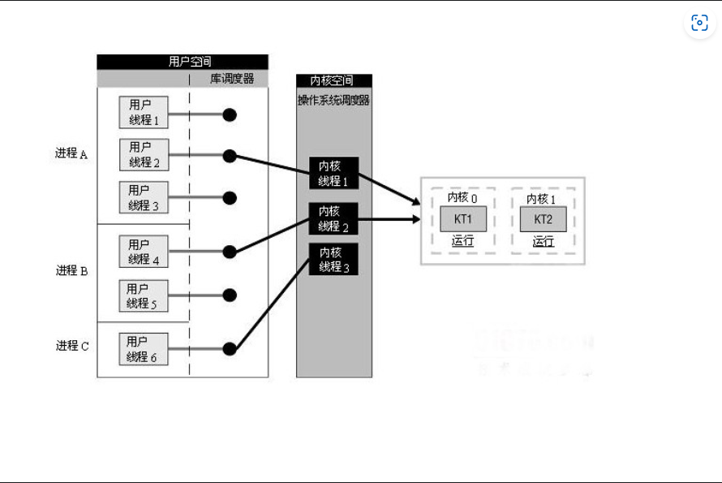
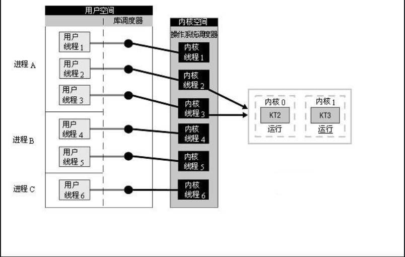

# 进程 线程 协程
1.什么是进程，什么是线程？
进程就是应用程序的启动实例。比如我们运行一个游戏，打开一个软件，就是开启了一个进程。
线程从属于进程，是程序的实际执行者。一个进程至少包含一个主线程，也可以有更多的子线程。

进程是资源分配的基本单位，线程是操作系统调度的基本单位。
而无论是进程还是线程，都是由操作系统所管理的

进程和线程：
把内存划分为多块，不同程序使用各自的内存空间互不干扰，这里单独的程序就是一个进程，CPU 可以在多个进程之间切换执行，让 CPU 的利用率变高。

为了实现 CPU 在多个进程之间切换，需要保存进程的上下文（如程序计数器、栈、内核数据结构等等），以便下次切换回来可以恢复执行。还需要一种调度算法，Linux 中采用了基于时间片和优先级的完全公平调度算法。

多进程的出现是为了解决 CPU 利用率的问题，那为什么还需要线程？答案是为了减少上下文切换时的开销

进程和线程在 Linux 中没有本质区别，他们最大的不同就是进程有自己独立的内存空间，而线程（同进程中）是共享内存空间。

在进程切换时需要转换内存地址空间，而线程切换没有这个动作，所以线程切换比进程切换代价更小。

**进程和线程的区别**
**根本区别**区别**：进程是操作系统资源分配的基本单位，而线程是任务调度和执行的基本单位

**在开销方面**：每个进程都有独立的代码和数据空间（程序上下文），程序之间的切换会有较大的开销；线程可以看做轻量级的进程，同一类线程共享代码和数据空间，每个线程都有自己独立的运行栈和程序计数器（PC），线程之间切换的开销小。

**所处环境**：在操作系统中能同时运行多个进程（程序）；而在同一个进程（程序）中有多个线程同时执行（通过CPU调度，在每个时间片中只有一个线程执行）

**内存分配方面**：系统在运行的时候会为每个进程分配不同的内存空间；而对线程而言，除了CPU外，系统不会为线程分配内存（线程所使用的资源来自其所属进程的资源），线程组之间只能共享资源。

**包含关系**：没有线程的进程可以看做是单线程的，如果一个进程内有多个线程，则执行过程不是一条线的，而是多条线（线程）共同完成的；线程是进程的一部分，所以线程也被称为轻权进程或者轻量级进程。

2.进程和线程的痛点
线程之间是如何进行协作的呢？

最经典的例子就是生产者/消费者模式。若干个生产者线程向队列中写入数据，若干个消费者线程从队列中消费数据。

但上面虽然正确实现了生产者/消费者模式，但并不是一个高性能的实现。为什么性能不高呢？

+ 涉及到同步锁；
+ 涉及到线程阻塞状态和可运行状态之间的切换；
+ 涉及线程的上下文切换；
+ 以上涉及到的任何一点，都是非常耗费性能的操作的。

3.什么是协程呢?
协程，是一种比线程更加轻量级的存在。正如一个进程可以拥有多个线程一样，一个线程也可以拥有多个协程。

最重要的是，协程不是被操作系统内核所管理，而完全是由程序所控制（也就是在用户态中执行）。

这样带来的好处就是性能得到了很大的提升，不会像线程切换那样消耗资源。

既然协程这么好，它到底是怎么来使用的呢？

协程是一种用户态的轻量级线程。协程的调度完全由用户控制，协程拥有自己的寄存器上下文和栈。协程调度切换时，将寄存器上下文和栈保存到其它地方，在切回来的时候，恢复先前保存的寄存器上下文和栈，直接操作栈则基本没有内核切换的开销，可以不加锁的访问全局变量，所以上下文的切换非常快。

既然协程这么优秀，为什么不彻底替代线程呢？
事实上协程和线程完全不是两个相同层面的东西，完全谈不上替代一说，协程可以说是一个独立于线程的功能，它是在线程的基础上，针对某些应用场景进一步发展出来的功能。我们知道，线程在多核的环境下是能做到真正意义上的并行执行的，注意，是并行，不是并发，而协程是为并发而生的。

想象一下业务场景，你需要执行两个互不依赖的sql查询，为了减少等待时间，常规的操作肯定主线程执行sqlB的同时另起一个线程执行sqlA，使两个sql并行执行。然而你会发现，执行两个sql的线程大多数时间只是在等待数据库服务器的响应，线程只是处于阻塞等待状态，而不是疯狂运转，而线程的创建、切换又很消耗系统资源，显然这很浪费。这个时候就该协程大展身手了，你可以在主线程中创建一个协程用于执行sqlB，然后再在主线程中执行sqlA，协程和线程一样，不会阻塞主线程，所以sqlB得到结果后，你可以通过语言的api去看看在协程中的sql执行完毕了没有，如果没有则等待，如果执行完毕了就拿结果，和线程操作几乎一摸一样。至于sqlA和sqlB是否真正在并行执行根本无所谓。为什么呢？ 我们假设执行一个sql需要三步，提交sql、等待、获得结果 ，其中第一步和第三步极省时，只要1毫秒一步，而第二步却要1000毫秒，那么使用并行的多线程执行两个sql，你只要花掉1002毫秒，而使用并发的协程你要花掉1004毫秒，但是线程比协程多消耗一个线程的资源，请问你会为了这2毫秒而选择多线程吗，显然不可能，创建线程的开销都要大于节省下来的时间，这就是协程存在的理由。

而服务器端开发中，大多数时候都是要花大量等待时间的场景，也就是所谓的IO密集，协程极为适合这种场景，而go又主打协程，直接从语法层面支持，切中了以往开发高性能程序太过于复杂的痛点，因此广受程序员们的欢迎。java其实也可以模拟出协程的效果，比如用nio和多线程，也能假装goroutines的效果，但实际操作起来太过于麻烦，还要掌握一大堆枯涩的概念，完全没有goroutines的优雅。所以在并发性能上，go完胜java。换言之，go比java更适应高并发场景，能更优雅方便的写出高并发程序。

## 多进程和多线程优缺点和适用范围

多进程的优点：
+ 编程相对容易；通常不需要考虑锁和同步资源的问题。 
+ 更强的容错性：比起多线程的一个好处是一个进程崩溃了不会影响其他进程。 
+ 有内核保证的隔离：数据和错误隔离。 对于使用如C/C++这些语言编写的本地代码，错误隔离是非常有用的：采用多进程架构的程序一般可以做到一定程度的自恢复；（master守护进程监控所有worker进程，发现进程挂掉后将其重启）。

多线程的优点：
+ 创建速度快，方便高效的数据共享 
  共享数据：多线程间可以共享同一虚拟地址空间；多进程间的数据共享就需要用到共享内存、信号量等IPC技术。
+ 较轻的上下文切换开销 - 不用切换地址空间，不用更改寄存器，不用刷新TLB。 
+ 提供非均质的服务。如果全都是计算任务，但每个任务的耗时不都为1s，而是1ms-1s之间波动；这样，多线程相比多进程的优势就体现出来，它能有效降低“简单任务被复杂任务压住”的概率。

应用场景：

多进程应用场景：
+ chrome浏览器也是多进程方式。 （原因：①可能存在一些网页不符合编程规范，容易崩溃，采用多进程一个网页崩溃不会影响其他网页；而采用多线程会。②网页之间互相隔离，保证安全，不必担心某个网页中的恶意代码会取得存放在其他网页中的敏感信息。）
+ web server服务器服务都有多进程的，至少有一个守护进程配合一个worker进程，例如apached,httpd等等以d结尾的进程包括init.d本身就是0级总进程，所有你认知的进程都是它的子进程； 

多线程应用场景
+ 线程间有数据共享，并且数据是需要修改的（不同任务间需要大量共享数据或频繁通信时）。
+ 提供非均质的服务（有优先级任务处理）事件响应有优先级。
+ 单任务并行计算，在非CPU Bound的场景下提高响应速度，降低时延。 
+ 与人有IO交互的应用，良好的用户体验（键盘鼠标的输入，立刻响应）
案例：
+ 桌面软件，响应用户输入的是一个线程，后台程序处理是另外的线程； 
memcached

选什么？
+ 需要频繁创建销毁的优先用线程（进程的创建和销毁开销过大）
这种原则最常见的应用就是Web服务器了，来一个连接建立一个线程，断了就销毁线程，要是用进程，创建和销毁的代价是很难承受的

+ 需要进行大量计算的优先使用线程（CPU频繁切换）
所谓大量计算，当然就是要耗费很多CPU，切换频繁了，这种情况下线程是最合适的。
这种原则最常见的是图像处理、算法处理。

+ 强相关的处理用线程，弱相关的处理用进程
什么叫强相关、弱相关？理论上很难定义，给个简单的例子就明白了。
一般的Server需要完成如下任务：消息收发、消息处理。“消息收发”和“消息处理”就是弱相关的任务，而“消息处理”里面可能又分为“消息解码”、“业务处理”，这两个任务相对来说相关性就要强多了。因此“消息收发”和“消息处理”可以分进程设计，“消息解码”、“业务处理”可以分线程设计。
当然这种划分方式不是一成不变的，也可以根据实际情况进行调整。

+ 可能要扩展到多机分布的用进程，多核分布的用线程

## 线程的实现

线程是独立调度的基本单位，进程是资源拥有的基本单位。在同一进程中，线程的切换不会引起进程切换。在不同进程中进行线程切换,如从一个进程内的线程切换到另一个进程中的线程时，会引起进程切换

用户级线程(User-LevelThread, ULT)	由应用程序所支持的线程实现, 内核意识不到用户级线程的实现
内核级线程(Kemel-LevelThread, KLT)	内核级线程又称为内核支持的线程

### 用户级线程

有关线程管理的所有工作都由应用程序完成，内核意识不到线程的存在. 应用程序可以通过使用**线程库**设计成多线程程序. 通常，应用程序从单线程起始，在该线程中开始运行，在其运行的任何时刻，可以通过调用线程库中的派生例程创建一个在相同进程中运行的新线程。

用户级线程仅存在于用户空间中，此类线程的创建、撤销、线程之间的同步与通信功能，都无须利用系统调用来实现。用户进程利用线程库来控制用户线程。由于线程在进程内切换的规则远比进程调度和切换的规则简单，不需要用户态/核心态切换，所以切换速度快。

用户级线程驻留在用户空间或模式。运行时库管理这些线程，它也位于用户空间。它们对于操作系统是不可见的，因此无法被调度到处理器内核。每个线程**并不具有自身的线程上下文**。因此，就线程的同时执行而言，任意给定时刻**每个进程只能够有一个线程在运行**，而且只有一个处理器内核会被分配给该进程。对于一个进程，可能有成千上万个用户级线程，但是它们对系统资源没有影响。运行时库调度并分派这些线程。

如同在图中看到的那样，库调度器从进程的多个线程中选择一个线程，然后该线程和该进程允许的一个内核线程关联起来。内核线程将被操作系统调度器指派到处理器内核。用户级线程是一种”多对一”的线程映射

#### 特点：
内核对线程包一无所知。从内核角度考虑，就是按正常的方式管理，即单线程进程（存在运行时系统）

#### 优点：
1. 可以在不支持线程的操作系统中实现。

2. 创建和销毁线程、线程切换代价等线程管理的代价比内核线程少得多, 因为保存线程状态的过程和调用程序都只是本地过程

3. 允许每个进程定制自己的调度算法，线程管理比较灵活。这就是必须自己写管理程序，与内核线程的区别

4. 线程能够利用的表空间和堆栈空间比内核级线程多

5. 不需要陷阱，不需要上下文切换，也不需要对内存高速缓存进行刷新，使得线程调用非常快捷

6. 线程的调度不需要内核直接参与，控制简单。

#### 缺点

1. 线程发生I/O或页面故障引起的阻塞时，如果调用阻塞系统调用则内核由于不知道有多线程的存在，而会阻塞整个进程从而阻塞所有线程, 因此同一进程中只能同时有一个线程在运行

2. 页面失效也会产生类似的问题。

3. 一个单独的进程内部，没有时钟中断，所以不可能用轮转调度的方式调度线程

4. 资源调度按照进程进行，多个处理机下，同一个进程中的线程只能在同一个处理机下分时复用

在用户级线程中，每个进程里的线程表由运行时系统管理。当一个线程转换到就绪状态或阻塞状态时，在该线程表中存放重新启动该线程所需的信息，与内核在进程表中存放的进程的信息完全一样

### 内核级线程

内核线程建立和销毁都是由操作系统负责、通过系统调用完成的。在内核的支持下运行，无论是用户进程的线程，或者是系统进程的线程，他们的创建、撤销、切换都是依靠内核实现的。

线程管理的所有工作由内核完成，应用程序没有进行线程管理的代码，只有一个到内核级线程的编程接口. 内核为进程及其内部的每个线程维护上下文信息，调度也是在内核基于线程架构的基础上完成。

内核线程驻留在内核空间，它们是内核对象。有了内核线程，每个用户线程被映射或绑定到一个内核线程。用户线程在其生命期内都会绑定到该内核线程。一旦用户线程终止，两个线程都将离开系统。这被称作”一对一”线程映射，

操作系统调度器管理、调度并分派这些线程。运行时库为每个用户级线程请求一个内核级线程。操作系统的内存管理和调度子系统必须要考虑到数量巨大的用户级线程。您必须了解每个进程允许的线程的最大数目是多少。操作系统为每个线程创建上下文。进程的每个线程在资源可用时都可以被指派到处理器内核。

内核线程的特点
+ 当某个线程希望创建一个新线程或撤销一个已有线程时，它进行一个系统调用

内核线程的优点:
+ 多处理器系统中，内核能够并行执行同一进程内的多个线程
+ 如果进程中的一个线程被阻塞，能够切换同一进程内的其他线程继续执行（用户级线程的一个缺点）
+ 所有能够阻塞线程的调用都以系统调用的形式实现，代价可观
+ 当一个线程阻塞时，内核根据选择可以运行另一个进程的线程，而用户空间实现的线程中，运行时系统始终运行自己进程中的线程
+ 信号是发给进程而不是线程的，当一个信号到达时，应该由哪一个线程处理它？线程可以“注册”它们感兴趣的信号

