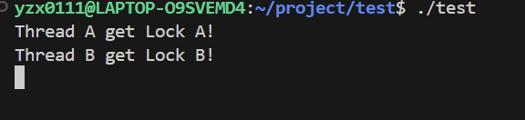
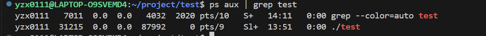
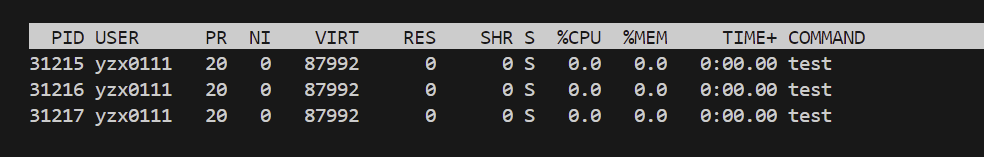
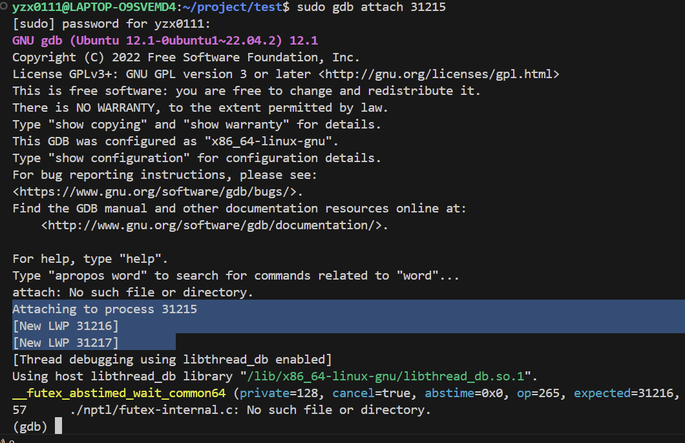

原文链接：https://blog.csdn.net/zsiming/article/details/126695393
# linux 排查死锁

```cpp
#include <iostream>
#include <thread>
#include <mutex>

using namespace std;

mutex mtxA;
mutex mtxB;

void taskA() {
	lock_guard<mutex> lockA(mtxA);
	cout << "Thread A get Lock A!" << endl;
	this_thread::sleep_for(chrono::seconds(1));
	lock_guard<mutex> lockB(mtxB);
	cout << "Thread A get Lock A and B!" << endl;
	cout << "Thread A relese all source!" << endl;

}

void taskB() {
	lock_guard<mutex> lockB(mtxB);
	cout << "Thread B get Lock B!" << endl;
	this_thread::sleep_for(chrono::seconds(1));
	lock_guard<mutex> lockA(mtxA);
	cout << "Thread B get Lock B and A!" << endl;
	cout << "Thread B relese all source!" << endl;
}

int main() {

	thread t1(taskA);
	thread t2(taskB);

	t1.join();
	t2.join();

	return 0;
}

```

我们将这个文件命名为：test.cpp ，并使用g++进行编译，生成可执行文件 (tip:注意一定要加上 -pthread，因为C++11里面的多线程库在Linux下也是基于pthread这个库实现的)：：

```cpp
g++ test.cpp -pthread -o test -g
```

然后运行：



已经发生死锁

## 排查死锁

首先，我们怀疑一个程序发生了死锁，首先可以查看该进程CPU利用率、内存利用率的情况。因为如果发生了死锁（这里假设是互斥锁），进程里面发生死锁的线程会处于阻塞的状态，此时基本不占有CPU，因此CPU的利用率、内存占有率将会比较低。 我们可以使用 ps aux 命令来拿到一个进程的状态：

`ps aux | grep test`



前面的是一个是执行了grep这个命令之后产生的进程，所以后面的进程是我们想排查的进程。多执行一次，不变的就是test

然后，使用 top 命令来查看进程的CPU利用率、内存占有率：

`top -Hp 31215`



可以看见，这个进程里面一共存在三个线程。仔细思考，应该是对应线程t1、t2、和 main线程。它们的CPU利用率、内存都是0，很有可能发生了死锁。

此时，进程已经运行起来了。在实际的项目中，我们一般也不可能把一个进程停掉用GDB调试。因此，只能用GDB 的 attach 命令来跟踪这个进程：

首先需要超级权限，然后： sudo gdb attach 31215



再查看三个线程的堆栈的调用情况：thread apply all bt

通过堆栈信息就可以查看到线程和程序之间的关系；

下一步我们单独查看每个线程的堆栈调用情况。 使用：info threads

得到：各个线程的索引。

使用 thread + 线程索来切换到某个线程：thread 1

使用 bt 来查看堆栈当前线程的堆栈调用：


