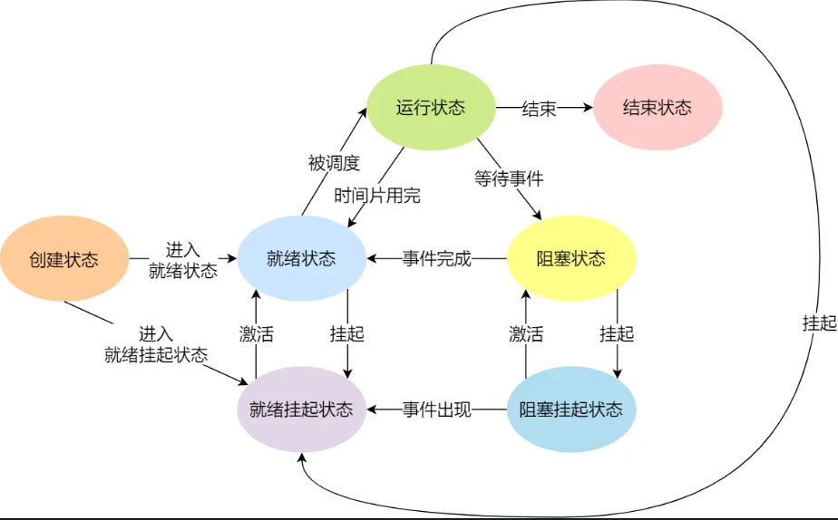

# 进程管理

+ 进程：
    + 进程的概念
    + 进程的状态
    + 进程的控制结构
    + 进程的控制
    + 进程的上下文切换

+ 线程：
    + 为什么使用线程
    + 什么是线程
    + 线程与进程的比较
    + 线程的上下文切换
    + 线程的实现

+ 调度
    + 调度时机
    + 调度原则
    + 调度算法


## 进程

### 进程的状态：运行，就绪，阻塞，创建，结束；

如果有大量处于阻塞状态的进程，进程可能会占用着物理内存，显然不是我们所希望的，毕竟物理内存空间有限的；
所以，在虚拟内存管理的操作系统中，通常会把阻塞状态的进程的物理内存空间换出硬盘，等需要再次运行时，再从硬盘换入到物理内存。

那么，就需要一个新的状态，来描述**进程没有占用实际的物理内存空间的情况，这个状态就是挂起状态**。这跟阻塞状态是不一样，阻塞状态是等待某个事件的返回。

挂起分为两种：
+ 阻塞挂起状态：进程在外存（硬盘）并等待某个事件的出现；
+ 就绪挂起状态：进程在外存（硬盘），但只要进入内存，即刻立刻运行；



导致进程挂起的原因不只是因为进程所使用的内存空间不在物理内存，还包括如下情况：
+ 通过 sleep 让进程间歇性挂起，其工作原理是设置一个定时器，到期后唤醒进程。
+ 用户希望挂起一个程序的执行，比如在 Linux 中用 Ctrl+Z 挂起进程；

### 进程的控制结构

用进程控制块（process control block，PCB）数据结构来描述进程的。

PCB 是进程存在的唯一标识，这意味着一个进程的存在，必然会有一个 PCB，如果进程消失了，那么 PCB 也会随之消失。

PCB 具体包含什么信息呢？

进程描述信息：
+ 进程标识符：标识各个进程，每个进程都有一个并且唯一的标识符（最大值32768=2^15 - 1 short int 的最大值）
+ 用户标识符：进程归属的用户，用户标识符主要为共享和保护服务；

进程控制和管理信息：
+ 进程当前状态，如 new、ready、running、waiting 或 blocked 等；
+ 进程优先级：进程抢占 CPU 时的优先级；

资源分配清单：
+ 有关内存地址空间或虚拟地址空间的信息，所打开文件的列表和所使用的 I/O 设备信息。

CPU 相关信息：
+ CPU 中各个寄存器的值，当进程被切换时，CPU 的状态信息都会被保存在相应的 PCB 中，以便进程重新执行时，能从断点处继续执行。

> 每个 PCB 是如何组织的呢？

通过链表：linux是双向循环链表；
把具有相同状态的进程链在一起，组成各种队列；

还有索引方式，它的工作原理：将同一状态的进程组织在一个索引表中，索引表项指向相应的 PCB，不同状态对应不同的索引表。

一般会选择链表，因为可能面临进程创建，销毁等调度导致进程状态发生变化，所以链表能够更加灵活的插入和删除。


### 进程的控制

进程的控制：进程的创建、终止、阻塞、唤醒过程；

1. 进程的创建

通过fork()创建，创建新的进程是为了立即执行新的不同的程序，而接着调用exec()函数就可以创建新的地址空间，并把新的程序载入其中。

exec() 函数家族是一组用于在现有进程中加载并执行新程序的系统调用。它们不会创建新的进程，而是替换当前进程的内存空间、堆栈、环境变量等，使得新的程序可以在相同的进程上下文中运行。

+ 申请一个空白的 PCB，并向 PCB 中填写一些控制和管理进程的信息，比如进程的唯一标识等；
+ 为该进程分配运行时所必需的资源，比如内存资源；
+ 将 PCB 插入到就绪队列，等待被调度运行；

先从进程表中找到一个未使用的进程；
然后初始化信息，分配pid，状态；
然后分配一个trapframe page；
分配一个一个user page table：映射RAMPOLINE和TRAPFRAME；
然后填充 p->context；

2. 进程的终止

3种终止：正常结束、异常结束以及外界干预

当一个进程被终止时，内核并不是立即把它从系统中清除。相反，进程被保持在一种已终止的状态中，直到被它的父进程回收。当父进程回收已终止的子进程时，内核将子进程的退出状态传递给父进程，然后抛弃已终止的进程，从此时开始，该进程就不存在了。一个终止但还未挥手的进程称为僵尸进程。

当子进程被终止时，其在父进程处继承的资源应当还给父进程。而当父进程被终止时，该父进程的子进程就变为孤儿进程，会被 1 号进程收养，并由 1 号进程对它们完成状态收集工作。

终止进程的过程如下：
+ 查找需要终止的进程的 PCB；
+ 如果处于执行状态，则立即终止该进程的执行，然后将 CPU 资源分配给其他进程；
+ 如果其还有子进程，则应将该进程的子进程交给 1 号进程接管；
+ 将该进程所拥有的全部资源都归还给操作系统；
+ 将其从 PCB 所在队列中删除；

3. 阻塞

当进程需要等待某一事件完成时，它可以调用阻塞语句把自己阻塞等待。而一旦被阻塞等待，它只能由另一个进程唤醒。

阻塞进程的过程如下：
+ 找到将要被阻塞进程标识号对应的 PCB；
+ 如果该进程为运行状态，则保护其现场，将其状态转为阻塞状态，停止运行；
+ 将该 PCB 插入到阻塞队列中去；

4. 唤醒进程

进程由「运行」转变为「阻塞」状态是由于进程必须等待某一事件的完成，所以处于阻塞状态的进程是绝对不可能叫醒自己的。

如果某进程正在等待 I/O 事件，需由别的进程发消息给它，则只有当该进程所期待的事件出现时，才由发现者进程用唤醒语句叫醒它。

## 调度时机

状态发生变化：
+ 就绪态到运行态
+ 运行态到阻塞态
+ 运行态到结束态

## 调度的原则

+ CPU 利用率，在这种发送 I/O 事件致使 CPU 空闲的情况下，调度程序需要从就绪队列中选择一个进程来运行。
+ 系统吞吐量：吞吐量表示的是单位时间内 CPU 完成进程的数量，长作业的进程会占用较长的 CPU 资源，因此会降低吞吐量，相反，短作业的进程会提升系统吞吐量；
+ 周转时间：周转时间是进程运行+阻塞时间+等待时间的总和，一个进程的周转时间越小越好；
+ 等待时间：这个等待时间不是阻塞状态的时间，而是进程处于就绪队列的时间，等待的时间越长，用户越不满意；
+ 响应时间：用户提交请求到系统第一次产生响应所花费的时间，在交互式系统中，响应时间是衡量调度算法好坏的主要标准。


## 线程冲突

忙等待:
CPU 体系结构提供的特殊原子操作指令：测试和置位（Test-and-Set）指令

无等待锁：
把当前线程放到锁的等待队列，然后执行调度程序，把CPU让给其他线程执行；

信号量适用于管理一组相同类型的资源或控制对临界区的访问，而条件变量更适合用于线程之间的复杂通信和协调。


### 哲学家就餐问题

1. 使用锁，每次只有一个能够使用；

2. 使用条件变量来解决哲学家就餐问题，我们需要确保每个哲学家在尝试获取筷子时不会导致死锁，并且当筷子可用时能够被正确通知。

指定哲学家总是先拿编号较小的筷子，然后拿编号较大的筷子。这可以防止循环等待条件的发生。

```cpp
#include <iostream>
#include <thread>
#include <vector>
#include <condition_variable>
#include <chrono>

const int NUM_PHILOSOPHERS = 5;
std::mutex table; // 保护共享数据的互斥锁

// 条件变量数组，用于等待筷子
std::condition_variable cv[NUM_PHILOSOPHERS];

// 筷子状态，0表示空闲，1表示被占用
std::atomic<bool> fork_states[NUM_PHILOSOPHERS]{false};

void philosopher(int id) {
    while (true) {
        // 思考
        std::this_thread::sleep_for(std::chrono::milliseconds(10 + rand() % 100));
        std::cout << "Philosopher " << id << " is thinking.\n";

        // 尝试拿筷子（临界区）
        {
            std::unique_lock<std::mutex> lock(table);

            // 哲学家总是先尝试拿起编号较小的筷子
            int first_fork = id;
            int second_fork = (id + 1) % NUM_PHILOSOPHERS;

            if (first_fork > second_fork) { // 如果是最后一个哲学家，则交换顺序
                std::swap(first_fork, second_fork);
            }

            // 等待直到左右两边的筷子都可用
            cv[id].wait(lock, [&]() {
                return !fork_states[first_fork] && !fork_states[second_fork];
            });

            // 拿起筷子
            fork_states[first_fork] = true;
            fork_states[second_fork] = true;
            std::cout << "Philosopher " << id << " is eating with forks " << first_fork << " and " << second_fork << ".\n";
            
            // 吃饭
            std::this_thread::sleep_for(std::chrono::milliseconds(10 + rand() % 100));

            // 放下筷子
            fork_states[first_fork] = false;
            fork_states[second_fork] = false;

            // 通知其他可能等待的哲学家
            for (int i = 0; i < NUM_PHILOSOPHERS; ++i) {
                cv[i].notify_all();
            }
        }
    }
}

int main() {
    srand(static_cast<unsigned>(time(0))); // 初始化随机数种子

    std::vector<std::thread> philosophers;

    // 创建哲学家线程
    for (int i = 0; i < NUM_PHILOSOPHERS; ++i) {
        philosophers.emplace_back(philosopher, i);
    }

    // 让主线程休眠一段时间，以便观察哲学家的行为
    std::this_thread::sleep_for(std::chrono::seconds(3));

    // 终止所有哲学家线程（实际上这个程序应该有更优雅的方式来结束线程）
    for (auto& t : philosophers) {
        if (t.joinable()) t.join();
    }

    return 0;
}
```

### 读写问题

## 死锁问题

linux怎么排查死锁:
1. gdb
+ 附加到进程：gdb -p <pid>，其中 <pid> 是你的程序的进程ID。
+ 查看线程状态：在GDB中输入 info threads 来查看所有线程的状态。
+ 检查线程调用栈：选择一个特定的线程后，使用 bt 命令来获取该线程的回溯信息，这有助于理解线程在等待什么资源。
+ 检测死锁：如果怀疑存在死锁，可以尝试使用 thread apply all bt 来打印所有线程的堆栈跟踪，并查找可能存在的循环等待条件。

### 避免死锁问题

资源有序分配法
线程 A 和 线程 B 获取资源的顺序要一样，当线程 A  是先尝试获取资源 A，然后尝试获取资源 B 的时候,线程 B 同样也是先尝试获取资源 A，然后尝试获取资源 B。也就是说，线程 A 和 线程 B 总是以相同的顺序申请自己想要的资源。

### 乐观锁和悲观锁

对于互斥锁加锁失败而阻塞的现象，是由**操作系统内核**实现的。当加锁失败时，内核会将线程置为「睡眠」状态，等到锁被释放后，内核会在合适的时机唤醒线程，当这个线程成功获取到锁后，于是就可以继续执行。

互斥锁加锁失败时，会从用户态陷入到内核态，让内核帮我们切换线程，虽然简化了使用锁的难度，但是存在一定的性能开销成本。

## 线程崩溃了，进程也会被崩溃吗？会，非法访问内存

Linux：默认情况下，单个线程的崩溃不会直接导致整个进程退出。然而，如果线程崩溃是因为未捕获的信号（例如段错误 SIGSEGV），并且该信号没有被进程中的任何地方处理，则它可能会导致整个进程终止。

C++：如果你使用的是 C 或 C++，线程崩溃通常会导致未定义行为。如果你的应用程序没有适当的错误处理或信号处理器，线程崩溃可能会传播到整个进程并导致其崩溃。

```cpp
作者：jameswhale
链接：https://www.zhihu.com/question/22397613/answer/1001161796
来源：知乎
著作权归作者所有。商业转载请联系作者获得授权，非商业转载请注明出处。

// 代码文件， test1.cpp， 一个线程可以访问另外一个线程栈空间的内容
#include <iostream>
#include <thread>

void func1();
void func2(int* a);

void func1()
{
    std::cout << "func1 enter" << std::endl;
    int a = 100;
    std::unique_ptr<std::thread> pt = std::make_unique<std::thread>(func2, &a);
    pt->join();
    std::cout << "func1 exit" << std::endl;
}

void func2(int * a)
{
    std::cout << "func2 enter" << std::endl;
    std::cout << *a << std::endl;// 通过地址访问另外一个线程的栈内容
    std::cout << "func2 exit" << std::endl;
}


int main()
{
    std::cout << "main enter" << std::endl;
    std::unique_ptr<std::thread> pt = std::make_unique<std::thread>(func1);
    pt->join();
    std::cout << "main exit" << std::endl;
}

// 编译语句：g++ -std=c++14 test1.cpp
// 程序打印如下：
main enter
func1 enter
func2 enter
100
func2 exit
func1 exit
main exit
```

```cpp
作者：jameswhale
链接：https://www.zhihu.com/question/22397613/answer/1001161796
来源：知乎
著作权归作者所有。商业转载请联系作者获得授权，非商业转载请注明出处。

// test2.cpp， 在C++里面，某个线程抛出异常没有捕获，整个进程会Coredump 。
#include <iostream>
#include <thread>

void func1();
void func2();

void func1()
{
    std::cout << "func1 enter" << std::endl;
    std::unique_ptr<std::thread> pt = std::make_unique<std::thread>(func2);
    pt->join();
    std::cout << "func1 exit" << std::endl;
}

void func2()
{
    std::cout << "func2 enter" << std::endl;
    throw;
    std::cout << "func2 exit" << std::endl;
}


int main()
{
    std::cout << "main enter" << std::endl;
    std::unique_ptr<std::thread> pt = std::make_unique<std::thread>(func1);
    pt->join();
    std::cout << "main exit" << std::endl;
} 
// 编译语句：g++ -std=c++14 test2.cpp
// 程序打印如下：
main enter
func1 enter
func2 enter
libc++abi.dylib: terminating
Abort trap: 6
```

```cpp
作者：jameswhale
链接：https://www.zhihu.com/question/22397613/answer/1001161796
来源：知乎
著作权归作者所有。商业转载请联系作者获得授权，非商业转载请注明出处。

// test3.cpp， 在C++里面，某个线程访问非法地址，整个进程会Coredump 。
#include <iostream>
#include <thread>

void func1();
void func2();

void func1()
{
    std::cout << "func1 enter" << std::endl;
    std::unique_ptr<std::thread> pt = std::make_unique<std::thread>(func2);
    pt->join();
    std::cout << "func1 exit" << std::endl;
}

void func2()
{
    std::cout << "func2 enter" << std::endl;
    int a = 100;
    std::cout << *(&a + 1000000) << std::endl;
    std::cout << "func2 exit" << std::endl;
}


int main()
{
    std::cout << "main enter" << std::endl;
    std::unique_ptr<std::thread> pt = std::make_unique<std::thread>(func1);
    pt->join();
    std::cout << "main exit" << std::endl;
}
// 编译语句：g++ -std=c++14 test3.cpp
// 程序打印如下：
main enter
func1 enter
func2 enter
Segmentation fault: 11
```

```cpp
作者：jameswhale
链接：https://www.zhihu.com/question/22397613/answer/1001161796
来源：知乎
著作权归作者所有。商业转载请联系作者获得授权，非商业转载请注明出处。

// test4.cpp , 除0没有(注意是没有)引起进程coredump，
#include <iostream>
#include <thread>

void func1();
void func2();

void func1()
{
    std::cout << "func1 enter" << std::endl;
    std::unique_ptr<std::thread> pt = std::make_unique<std::thread>(func2);
    pt->join();
    std::cout << "func1 exit" << std::endl;
}

void func2()
{
    std::cout << "func2 enter" << std::endl;
    100 / 0 ;
    std::cout << "func2 exit" << std::endl;
}


int main()
{
    std::cout << "main enter" << std::endl;
    std::unique_ptr<std::thread> pt = std::make_unique<std::thread>(func1);
    pt->join();
    std::cout << "main exit" << std::endl;
}
// 编译语句：g++ -std=c++14 test4.cpp
// 程序打印如下：
main enter
func1 enter
func2 enter
func2 exit
func1 exit
main exit
```


