原文链接：https://blog.csdn.net/a519640026/article/details/106940115

# B树

B-树,这里的 B 表示 balance( 平衡的意思),B-树是一种多路自平衡的搜索树（B树是一颗多路平衡查找树）它类似普通的平衡二叉树，不同的一点是B-树允许每个节点有更多的子节点。下图是 B-树的简化图.

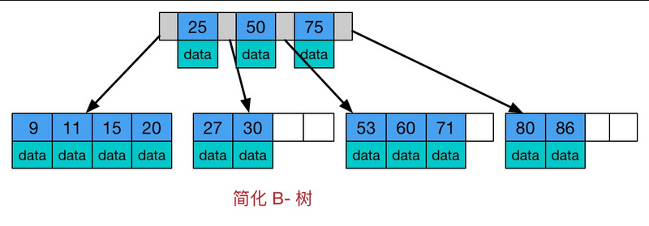

B-树有如下特点:

+ 所有键值分布在整颗树中（索引值和具体data都在每个节点里）；
+ 任何一个关键字出现且只出现在一个结点中；
+ 搜索有可能在非叶子结点结束（最好情况O(1)就能找到数据）；
+ 在关键字全集内做一次查找,性能逼近二分查找；

由平衡二叉树只有两个节点，这样就会导致树太深，所以就增加一个节点的子节点数目，这样就生成的b树。B-树是专门为外部存储器设计的，如磁盘，它对于读取和写入大块数据有良好的性能，所以一般被用在文件系统及数据库中。

定义只需要知道B-树允许每个节点有更多的子节点即可（多叉树）。子节点数量一般在上千，具体数量依赖外部存储器的特性。

> 先来看看为什么会出现B-树这类数据结构。

传统用来搜索的平衡二叉树有很多，如 AVL 树，红黑树等。这些树在一般情况下查询性能非常好，但当数据非常大的时候它们就无能为力了。原因当数据量非常大时，内存不够用，大部分数据只能存放在磁盘上，只有需要的数据才加载到内存中。一般而言内存访问的时间约为 50 ns，而磁盘在 10 ms 左右。速度相差了近 5 个数量级，磁盘读取时间远远超过了数据在内存中比较的时间。这说明程序大部分时间会阻塞在磁盘 IO 上。那么我们如何提高程序性能？减少磁盘 IO 次数，像 AVL 树，红黑树这类平衡二叉树从设计上无法“迎合”磁盘。

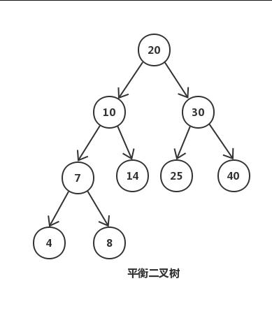

上图是一颗简单的平衡二叉树，平衡二叉树是通过旋转来保持平衡的，而旋转是对整棵树的操作，若部分加载到内存中则**无法完成旋转操作**。其次平衡二叉树的高度相对较大为 log n（底数为2），这样逻辑上很近的节点实际可能非常远，无法很好的利用**磁盘预读**（局部性原理），所以这类平衡二叉树在数据库和文件系统上的选择就被 pass 了。

> 空间局部性原理：如果一个存储器的某个位置被访问，那么将它附近的位置也会被访问。

索引的效率依赖与磁盘 IO 的次数，快速索引需要有效的减少磁盘 IO 次数，如何快速索引呢？
索引的原理其实是不断的缩小查找范围，就如我们平时用字典查单词一样，先找首字母缩小范围，再第二个字母等等。平衡二叉树是每次将范围分割为两个区间。为了更快，B-树每次将范围分割为多个区间，区间越多，定位数据越快越精确。那么如果节点为区间范围，每个节点就较大了。

所以新建节点时，直接申请**页大小的空间**（磁盘存储单位是按 block 分的，一般为 512 Byte。磁盘 IO 一次读取若干个 block，我们称为一页，具体大小和操作系统有关，一般为 4 k，8 k或 16 k），计算机内存分配是按页对齐的，这样就实现了一个节点只需要一次 IO。

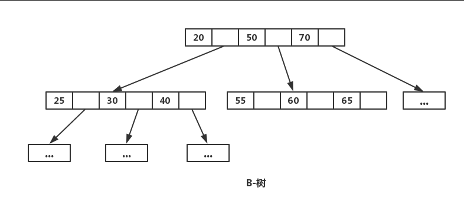

上图是一棵简化的B-树，多叉的好处非常明显，有效的降低了B-树的高度，为底数很大的 log n，底数大小与节点的子节点数目有关，一般一棵B-树的高度在 3 层左右。层数低，每个节点区确定的范围更精确，范围缩小的速度越快（比二叉树深层次的搜索肯定快很多）。

上面说了一个节点需要进行一次 IO，那么总 IO 的次数就缩减为了 log n 次。B-树的每个节点是 n 个有序的序列(a1,a2,a3…an)，并将该节点的子节点分割成 n+1 个区间来进行索引(X1< a1, a2 < X2 < a3, … , an+1 < Xn < anXn+1 > an)。

> 点评：B树的每个节点，都是存多个值的，不像二叉树那样，一个节点就一个值，B树把每个节点都给了一点的范围区间，区间更多的情况下，搜索也就更快了，比如：有1-100个数，二叉树一次只能分两个范围，0-50和51-100，而B树，分成4个范围 1-25， 25-50，51-75，76-100一次就能筛选走四分之三的数据。所以作为多叉树的B树是更快的

B-树的查找
我们来看看B-树的查找，假设每个节点有 n 个 key值，被分割为 n+1 个区间，注意，每个 key 值紧跟着 data 域，这说明B-树的 key 和 data 是聚合在一起的。一般而言，根节点都在内存中，B-树以每个节点为一次磁盘 IO，比如上图中，若搜索 key 为 25 节点的 data，首先在根节点进行二分查找（因为 keys 有序，二分最快），判断 key 25 小于 key 50，所以定位到最左侧的节点，此时进行一次磁盘 IO，将该节点从磁盘读入内存，接着继续进行上述过程，直到找到该 key 为止。

查找伪代码：

```cpp
Data* BTreeSearch(Root *node, Key key)
{
    Data* data;

    if(root == NULL)
        return NULL;
    data = BinarySearch(node);
    if(data->key == key)
    {
        return data;
    }else{
        node = ReadDisk(data->next);
        BTreeSearch(node, key);
    }
}
```

# B+ 树

B+树是B-树的变体，也是一种多路搜索树, 它与 B- 树的不同之处在于:

1. 所有关键字存储在叶子节点出现,内部节点(非叶子节点并不存储真正的 data)
2. 为所有叶子结点增加了一个链指针

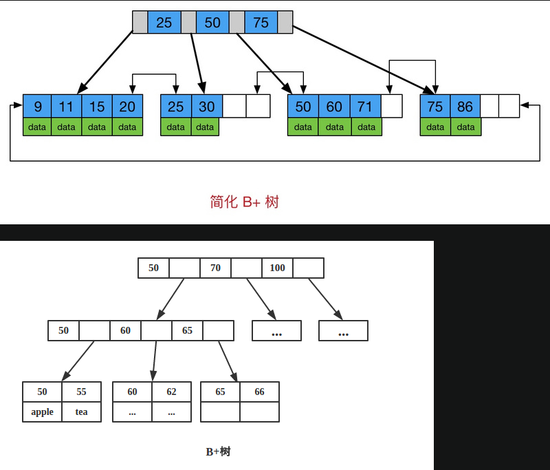

因为内节点并不存储 data，所以一般B+树的叶节点和内节点大小不同，而B-树的每个节点大小一般是相同的，为一页。

为了增加 区间访问性，一般会对B+树做一些优化。
如下图带顺序访问的B+树。

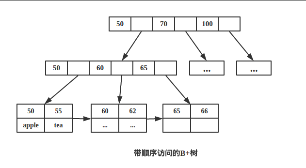

## B-树和B+树的区别
1. B+树内节点不存储数据，所有 data 存储在叶节点导致查询时间复杂度固定为 log n。而B-树查询时间复杂度不固定，与 key 在树中的位置有关，最好为O(1)。

如下所示B-树/B+树查询节点 key 为 50 的 data。

B-树：

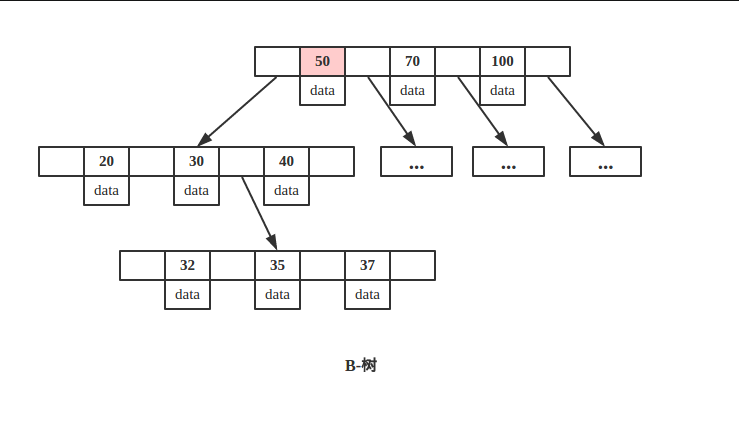

从上图可以看出，key 为 50 的节点就在第一层，B-树只需要一次磁盘 IO 即可完成查找。所以说B-树的查询最好时间复杂度是 O(1)。

B+树：

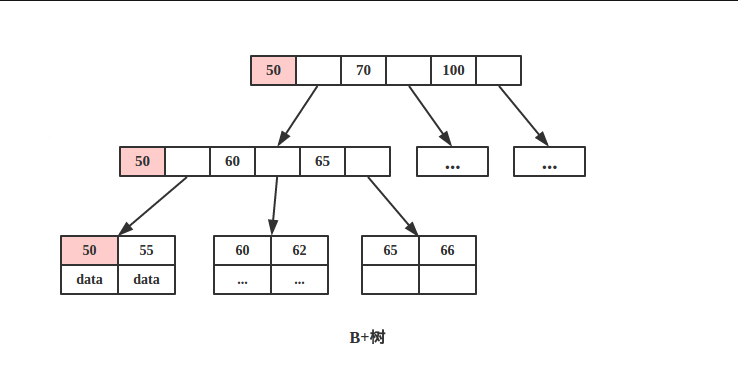

由于B+树所有的 data 域都在根节点，所以查询 key 为 50的节点必须从根节点索引到叶节点，时间复杂度固定为 O(log n)。

> 点评：B树的由于每个节点都有key和data，所以查询的时候可能不需要O(logn)的复杂度，甚至最好的情况是O(1)就可以找到数据，而B+树由于只有叶子节点保存了data，所以必须经历O(logn)复杂度才能找到数据

2.  B+树叶节点两两相连可大大增加区间访问性，可使用在范围查询等，而B-树每个节点 key 和 data 在一起，则无法区间查找。

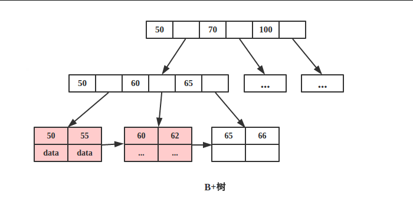

根据空间局部性原理：如果一个存储器的某个位置被访问，那么将它附近的位置也会被访问。

B+树可以很好的利用局部性原理，若我们访问节点 key为 50，则 key 为 55、60、62 的节点将来也可能被访问，我们可以利用磁盘预读原理提前将这些数据读入内存，减少了磁盘 IO 的次数。

当然B+树也能够很好的完成范围查询。比如查询 key 值在 50-70 之间的节点。

> 点评：由于B+树的叶子节点的数据都是使用链表连接起来的，而且他们在磁盘里是顺序存储的，所以当读到某个值的时候，磁盘预读原理就会提前把这些数据都读进内存，使得范围查询和排序都很快

3. **B+树更适合外部存储**。由于内节点无 data 域，每个节点能索引的范围更大更精确

这个很好理解，由于B-树节点内部每个 key 都带着 data 域，而B+树节点只存储 key 的副本，真实的 key 和 data 域都在叶子节点存储。前面说过磁盘是分 block 的，一次磁盘 IO 会读取若干个 block，具体和操作系统有关，那么由于磁盘 IO 数据大小是固定的，在一次 IO 中，单个元素越小，量就越大。这就意味着B+树单次磁盘 IO 的信息量大于B-树，从这点来看B+树相对B-树磁盘 IO 次数少。

> 点评：由于B树的节点都存了key和data，而B+树只有叶子节点存data，非叶子节点都只是索引值，没有实际的数据，这就时B+树在一次IO里面，能读出的索引值更多。从而减少查询时候需要的IO次数！

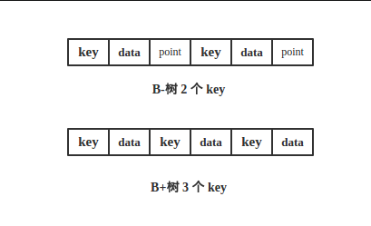

从上图可以看出相同大小的区域，B-树仅有 2 个 key，而B+树有 3 个 key。

## MySQL为什么使用B-Tree（B+Tree）&& 存储知识

上文说过，红黑树等数据结构也可以用来实现索引，但是文件系统及数据库系统普遍采用B-/+Tree作为索引结构，这一节将结合计算机组成原理相关知识讨论B-/+Tree作为索引的理论基础。

一般来说，索引本身也很大，不可能全部存储在内存中，因此索引往往以索引文件的形式存储的磁盘上。这样的话，索引查找过程中就要产生磁盘I/O消耗，相对于内存存取，I/O存取的消耗要高几个数量级，所以评价一个数据结构作为索引的优劣最重要的指标就是在查找过程中磁盘I/O操作次数的渐进复杂度。换句话说，索引的结构组织要尽量减少查找过程中磁盘I/O的存取次数。下面先介绍内存和磁盘存取原理，然后再结合这些原理分析B-/+Tree作为索引的效率。

存储数据最小单元
我们都知道计算机在存储数据的时候，有最小存储单元，这就好比我们今天进行现金的流通最小单位是一毛。

在计算机中磁盘存储数据最小单元是扇区，一个扇区的大小是512字节，而文件系统（例如XFS/EXT4）他的最小单元是块，一个块的大小是4k

而对于我们的InnoDB存储引擎也有自己的最小储存单元——页（Page），一个页的大小是16K。

下面几张图可以帮你理解最小存储单元：

文件系统中一个文件大小只有1个字节，但不得不占磁盘上4KB的空间。

磁盘扇区、文件系统、InnoDB存储引擎都有各自的最小存储单元。

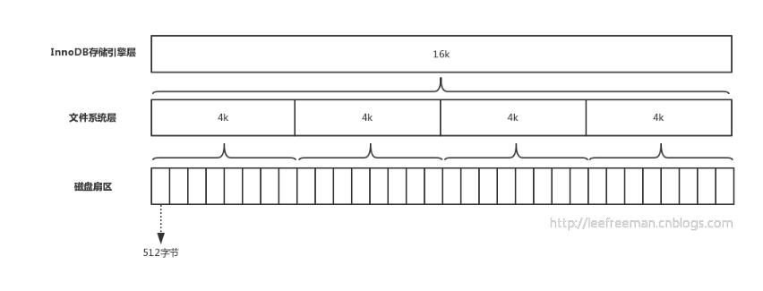

数据表中的数据都是存储在页中的，所以一个页中能存储多少行数据呢？假设一行数据的大小是1k，那么一个页可以存放16行这样的数据。

主存存取原理
目前计算机使用的主存基本都是随机读写存储器（RAM），现代RAM的结构和存取原理比较复杂，这里本文抛却具体差别，抽象出一个十分简单的存取模型来说明RAM的工作原理。

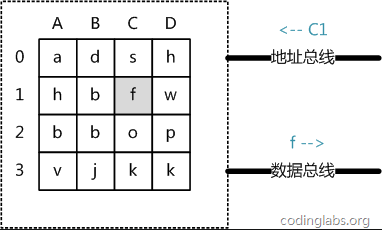

从抽象角度看，主存是一系列的存储单元组成的矩阵，每个存储单元存储固定大小的数据。每个存储单元有唯一的地址，现代主存的编址规则比较复杂，这里将其简化成一个二维地址：通过一个行地址和一个列地址可以唯一定位到一个存储单元。图5展示了一个4 x 4的主存模型。

主存的存取过程如下：

当系统需要读取主存时，则将地址信号放到地址总线上传给主存，主存读到地址信号后，解析信号并定位到指定存储单元，然后将此存储单元数据放到数据总线上，供其它部件读取。

写主存的过程类似，系统将要写入单元地址和数据分别放在地址总线和数据总线上，主存读取两个总线的内容，做相应的写操作。

这里可以看出，主存存取的时间仅与存取次数呈线性关系，因为不存在机械操作，两次存取的数据的“距离”不会对时间有任何影响，例如，先取A0再取A1和先取A0再取D3的时间消耗是一样的。

磁盘存取原理
上文说过，索引一般以文件形式存储在磁盘上，索引检索需要磁盘I/O操作。与主存不同，磁盘I/O存在机械运动耗费，因此磁盘I/O的时间消耗是巨大的。

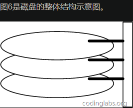

一个磁盘由大小相同且同轴的圆形盘片组成，磁盘可以转动（各个磁盘必须同步转动）。在磁盘的一侧有磁头支架，磁头支架固定了一组磁头，每个磁头负责存取一个磁盘的内容。磁头不能转动，但是可以沿磁盘半径方向运动（实际是斜切向运动），每个磁头同一时刻也必须是同轴的，即从正上方向下看，所有磁头任何时候都是重叠的（不过目前已经有多磁头独立技术，可不受此限制）。


盘片被划分成一系列同心环，圆心是盘片中心，每个同心环叫做一个磁道，所有半径相同的磁道组成一个柱面。磁道被沿半径线划分成一个个小的段，每个段叫做一个扇区，每个扇区是磁盘的最小存储单元。为了简单起见，我们下面假设磁盘只有一个盘片和一个磁头。

当需要从磁盘读取数据时，系统会将数据逻辑地址传给磁盘，磁盘的控制电路按照寻址逻辑将逻辑地址翻译成物理地址，即确定要读的数据在哪个磁道，哪个扇区。为了读取这个扇区的数据，需要将磁头放到这个扇区上方，为了实现这一点，磁头需要移动对准相应磁道，这个过程叫做寻道，所耗费时间叫做寻道时间，然后磁盘旋转将目标扇区旋转到磁头下，这个过程耗费的时间叫做旋转时间。

局部性原理与磁盘预读
由于存储介质的特性，磁盘本身存取就比主存慢很多，再加上机械运动耗费，磁盘的存取速度往往是主存的几百分分之一，因此为了提高效率，要尽量减少磁盘I/O。为了达到这个目的，磁盘往往不是严格按需读取，而是每次**都会预读**，即使只需要一个字节，磁盘也会从这个位置开始，顺序向后读取一定长度的数据放入内存。这样做的理论依据是计算机科学中著名的局部性原理：

当一个数据被用到时，其附近的数据也通常会马上被使用。

程序运行期间所需要的数据通常比较集中。

由于磁盘顺序读取的效率很高（不需要寻道时间，只需很少的旋转时间），因此对于具有局部性的程序来说，预读可以提高I/O效率。

预读的长度一般为页（page）的整倍数。页是计算机管理存储器的逻辑块，硬件及操作系统往往将主存和磁盘存储区分割为连续的大小相等的块，每个存储块称为一页（在许多操作系统中，页得大小通常为4k），主存和磁盘以页为单位交换数据。当程序要读取的数据不在主存中时，会触发一个缺页异常，此时系统会向磁盘发出读盘信号，磁盘会找到数据的起始位置并向后连续读取一页或几页载入内存中，然后异常返回，程序继续运行。

所以IO一次就是读一页的大小


