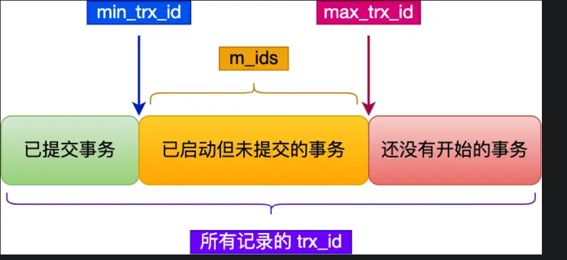

事务的特性？
并发事务会引发什么问题？
事务隔离级别有哪些？
MVCC如何工作？
可重复读如何工作？
读提交如何工作？

# 事务的隔离级别怎么实现的 
## 1. 事务的特性
acid：原子性，一致性，隔离性，持久性；

如何保证这四个特性？
+ 持久性：通过redo log （重做日志）
+ 原子性：undo log(回滚日志)
+ 隔离性： 通过mvcc或锁机制
+ 一致性：上面三个性质来保证 

## 2. 并发事务会引发什么问题？

脏读(dirty read)，不可重复读(non-repeatable read)，幻读(phantom read)；

### 脏读

脏读是指在一个事务中读取了另一个未提交事务的数据。如果这个未提交的事务后来被回滚（Rollback），那么第一个事务实际上读取到了一个从未发生过的状态的数据，这就导致了脏读的问题。

例如，假设事务T1修改了一行数据，但尚未提交。此时，事务T2读取了这行已经被修改的数据。如果之后事务T1回滚，那么事务T2实际上读取到了一个不存在的数据版本。

#### 解决方案

- **脏读**：可以通过设置适当的事务隔离级别来避免脏读。大多数数据库系统提供的“读已提交”（Read Committed）隔离级别就能防止脏读，因为在这种模式下，一个事务只能读取到已经提交的数据。

### 不可重复读

不可重复读:在一个事务内多次读取同一个数据，如果出现前后两次读到的**数据不一样**的情况，就以为着发生了不可重复读；


### 幻读

幻读是指在一个事务内，两次查询同一范围的数据时，由于其他事务的操作，导致第二次查询的结果集包含了第一次查询时没有的数据行，或者缺少了一些第一次查询时存在的数据行。这种情况通常发生在对某个范围的数据进行检索，并且在此期间有其他事务插入或删除了该范围内的数据。（增量）

例如，假设事务T1对某张表执行了一个范围查询，获取了一些记录。然后，另一个事务T2在这个范围内插入了一条新的记录并提交了事务。当事务T1再次执行相同的范围查询时，它会看到一条新的记录，这条记录在第一次查询时是不存在的，这就是幻读。

#### 解决方案
- **幻读**：要完全避免幻读，通常需要使用更高一级的隔离级别，如“可重复读”（Repeatable Read）或“序列化”（Serializable）。在“可重复读”模式下，事务在整个生命周期内看到的数据快照是一致的，这意味着即使其他事务对数据进行了修改，也不会影响当前事务所看到的数据。而“序列化”是最严格的隔离级别，它可以完全避免脏读、不可重复读以及幻读等问题，但是可能会导致较高的锁竞争和性能下降。

## 3.事务隔离级别有哪些

+ 脏读：读到其他事务未提交的数据
+ 不可重复读：前后读取的数据不一致
+ 幻读：前后读取的记录数量不一致

严重程度：脏读 > 不可重复读 > 幻读

隔离级别：
+ 读未提交：指一个事务还没提交时，它做的变更就能被其他事务看到
+ 读提交：指一个事务提交后，它的变更才能被其他事务看到
+ 可重复读：指一个事务执行过程中看到的数据，一直跟这个事务启动时看到数据一支；innodb 默认级别
+ 串行化：会对记录加上读写锁，在多个事务对这条记录进行读写操作时，如果发生了读写冲突的时候，后访问的事务必须等前一个事务执行完成，才能继续执行；

innodb默认：可重复读，但是可以很大程度上避免幻读：
+ 快照隔离：是通过 MVCC 方式解决了幻读，因为可重复读隔离级别下，事务执行过程中看到的数据，一直跟这个事务启动时看到的数据是一致的，即使中途有其他事务插入了一条数据，是查询不出来这条数据的，所以就很好了避免幻读问题。
+ 当前读（SELECT ... FOR UPDATE），是通过 next-key lock（记录锁+间隙锁）方式解决了幻读，是通过 next-key lock（记录锁+间隙锁）方式解决了幻读，如果有其他事务在 next-key lock 锁范围内插入了一条记录，那么这个插入语句就会被阻塞，无法成功插入，所以就很好了避免幻读问题。


四种隔离级别怎么实现的？
+ 对于「读未提交」隔离级别的事务来说，因为可以读到未提交事务修改的数据，所以直接读取最新的数据就好了；
+ 对于「串行化」隔离级别的事务来说，通过加读写锁的方式来避免并行访问；
+ 对于「读提交」和「可重复读」隔离级别的事务来说，它们是通过 Read View 来实现的，它们的区别在于创建 Read View 的时机不同。「读提交」隔离级别是在「**每个语句执行前**」都会重新生成一个 Read View，而「可重复读」隔离级别是「**启动事务时**」生成一个 Read View，然后整个事务期间都在用这个 Read View。 小林coding例子

## 4.Read View 在 MVCC 里如何工作的？

+ Read View中四个字段的作用
+ 聚簇索引中两个跟事务有关的隐藏列

Read View是什么？


聚簇索引记录的两个隐藏列：


对于使用 InnoDB 存储引擎的数据库表，它的聚簇索引记录中都包含下面两个隐藏列：
+ trx_id，当一个事务对某条聚簇索引记录进行改动时，就会把该事务的事务 id 记录在 trx_id 隐藏列里；
+ roll_pointer，每次对某条聚簇索引记录进行改动时，都会把旧版本的记录写入到 undo 日志中，然后这个隐藏列是个指针，指向每一个旧版本记录，于是就可以通过它找到修改前的记录。

bustub不一样，bustub把修改的增量保存在事务内部：
内部维护一个undolog数组，每一个元素表示修改的一个tuple，且保存指向下一个undlog的指针；

在创建 Read View 后，我们可以将记录中的 trx_id 划分这三种情况：



其实这里的min_trx_id，可以看出读时间戳，max_trx_id 写时间戳；

一个事务去访问记录的时候，除了自己的更新记录总是可见之外，还有这几种情况：
+ 如果记录的 trx_id 值小于 Read View 中的 min_trx_id 值，表示这个版本的记录是在创建 Read View 前已经提交的事务生成的，所以该版本的记录对当前事务可见。
+ 如果记录的 trx_id 值大于等于 Read View 中的 max_trx_id 值，表示这个版本的记录是在创建 Read View 后才启动的事务生成的，所以该版本的记录对当前事务不可见。
+ 如果记录的 trx_id 值在 Read View 的 min_trx_id和 max_trx_id 之间，需要判断 trx_id 是否在 m_ids 列表中：
    + 如果记录的 trx_id 在 m_ids 列表中，表示生成该版本记录的活跃事务依然活跃着（还没提交事务），所以该版本的记录对当前事务不可见。
    + 如果记录的 trx_id 不在 m_ids列表中，表示生成该版本记录的活跃事务已经被提交，所以该版本的记录对当前事务可见。

## 5. 可重复读如何工作

事务在整个生命周期内看到的数据快照是一致的，这意味着即使其他事务对数据进行了修改，也不会影响当前事务所看到的数据。

会根据read view进行判断；判断事务是否可见；

## 6. 读提交如何工作

读提交隔离级别是在**每次读取数据时**，都会生成一个新的 Read View。

也意味着，事务期间的多次读取同一条数据，前后两次读的数据可能会出现不一致，因为可能这期间另外一个事务修改了该记录，并提交了事务。

# mysql 可重复读隔离级别，完全解决幻读了吗？

innodb默认：可重复读，但是可以很大程度上避免幻读：
+ 快照隔离：是通过 MVCC 方式解决了幻读，因为可重复读隔离级别下，事务执行过程中看到的数据，一直跟这个事务启动时看到的数据是一致的，即使中途有其他事务插入了一条数据，是查询不出来这条数据的，所以就很好了避免幻读问题。
+ 当前读（SELECT ... FOR UPDATE），是通过 next-key lock（记录锁+间隙锁）方式解决了幻读，是通过 next-key lock（记录锁+间隙锁）方式解决了幻读，如果有其他事务在 next-key lock 锁范围内插入了一条记录，那么这个插入语句就会被阻塞，无法成功插入，所以就很好了避免幻读问题。

有个别的情况造成的幻读现象是无法解决的

幻读：当同一个查询在不同的时间产生不同的结果集时，事务中就会出现所谓的幻象问题。如，如果 SELECT 执行了两次，但第二次返回了第一次没有返回的行，则该行是“幻像”行。主要关注点是增量

## 快照隔离是如何避免幻读的？

可重复读隔离级是由 MVCC（多版本并发控制）实现的，实现的方式是开始事务后（执行 begin 语句后），在执行第一个查询语句后，会创建一个 Read View，后续的查询语句利用这个 Read View，通过这个 Read View 就可以在 undo log 版本链找到事务开始时的数据，所以事务过程中每次查询的数据都是一样的，即使中途有其他事务插入了新纪录，是查询不出来这条数据的，所以就很好了避免幻读问题。

## 当前读是如何避免幻读？

MySQL 里除了普通查询是快照读，其他都是**当前读**，比如 update、insert、delete，这些语句执行前都会查询**最新版本**的数据，然后再做进一步的操作。

Innodb 引擎为了解决「可重复读」隔离级别使用「当前读」而造成的幻读问题，就引出了**间隙锁**。

## 幻读被完全解决了吗？

可重复读隔离级别下虽然很大程度上避免了幻读，但是还是没有能完全解决幻读。

在可重复读隔离级别下，普通的查询是快照读，是不会看到别的事务插入的数据的。因此，幻读在“当前读”下才会出现。


1. **第一个事务：**
   ```sql
   BEGIN;
   SELECT * FROM t_stu WHERE id = 5;
   ```

2. **第二个事务：**
   ```sql
   BEGIN;
   INSERT INTO t_stu VALUES(5, '小美', 18);
   COMMIT;
   ```

3. **第一个事务继续：**
   ```sql
   UPDATE t_stu SET name = '小林coding' WHERE id = 5;
   SELECT * FROM t_stu WHERE id = 5; # 
   COMMIT;
   ```

UPDATE 操作之后的 SELECT 查询之所以被视为当前读（current read），主要是因为之前的 UPDATE 操作已经对相关行加了锁，并且这些锁在整个事务期间保持有效。这确保了后续在同一事务中的查询能够看到最新的数据版本，并且不会受到其他事务的影响。

分析

- 在第一个事务中，第一次执行 `SELECT * FROM t_stu WHERE id = 5;` 时，如果表中没有 `id = 5` 的记录，则查询结果为空。
  
- 第二个事务插入了一条 `id = 5` 的记录，并提交了该事务。这条记录现在对所有其他事务可见。

- 回到第一个事务，它接着执行 `UPDATE t_stu SET name = '小林coding' WHERE id = 5;` 和随后的 `SELECT * FROM t_stu WHERE id = 5;`。由于这是一个更新操作，它会执行**当前读**，即直接读取最新的数据版本，并且会看到由第二个事务插入并提交的新行，在这个时刻，这条新记录的 trx_id 隐藏列的值就变成了事务 A 的事务 id，之后事务 A 再使用普通 select 语句去查询这条记录时就可以看到这条记录了，于是就发生了幻读。因此，更新成功并且后续的查询将返回修改后的记录。

幻读解释

在这个例子中，**不会发生幻读**。幻读是指在一个事务内两次相同的查询返回了不同的结果集，通常是因为另一个事务在此期间插入了新行。但在你给出的例子中，情况略有不同：

- 第一个事务中的第一次 `SELECT` 查询发生在插入之前，第二次 `SELECT` 查询是在更新之后，而更新操作本身就是一种当前读，它会读取最新的数据版本。所以，这实际上不是幻读的问题，而是预期的行为——因为显式的更新操作使得第一个事务看到了新插入的数据。

要明确的是，在 `REPEATABLE READ` 隔离级别下，InnoDB通过多版本并发控制（MVCC）和一致性非锁定读来防止幻读。对于普通的 `SELECT` 查询，它们会看到事务开始时的一致性快照。然而，当涉及到 `INSERT`, `UPDATE`, 或带有锁的 `SELECT` 语句（如 `SELECT ... FOR UPDATE`），这些操作是当前读，它们会看到最新的数据版本，并可能影响其他事务所见的数据视图。

如果你希望确保在第一个事务中两次查询的结果一致，可以考虑使用更严格的隔离级别如 `SERIALIZABLE`，或者使用适当的锁定策略，例如 `SELECT ... LOCK IN SHARE MODE` 或 `SELECT ... FOR UPDATE` 来避免其他事务的插入或更新影响你的查询结果。

因为这里是 updata，索引隔离是当前读，会拿到最新数据，这个时候A是会看到id=5，进行更新；


### 幻读典型例子

你提到的情况确实涉及到了数据量的变化，但根据幻读的严格定义，在 `REPEATABLE READ` 隔离级别下，这种情况并不完全符合幻读的标准。幻读通常指的是在同一事务中两次执行相同的查询，返回的结果集中的行数不同，且这种差异是由其他事务插入的新行引起的。

### 为什么这不是典型的幻读

在你的例子中，第一个事务（事务A）第一次执行 `SELECT` 查询时，`id = 5` 的记录不存在。之后，第二个事务（事务B）插入了这条记录并提交。当事务A继续执行更新操作和第二次 `SELECT` 查询时，它看到了新插入的记录。这并不是因为普通的快照读导致的数据视图变化，而是由于显式的更新操作（当前读）触发了对最新数据版本的访问。

因此，这实际上不是幻读，而是预期的行为：更新操作本身就是一种当前读，它会读取最新的数据版本，并因此看到由另一个事务插入并提交的新行。

### 典型的幻读示例

#### 场景设定

假设有两个事务，事务A和事务B，以及一个表 `t_stu`，其中包含学生的记录。

#### 操作序列

1. **事务A开始：**
   ```sql
   BEGIN;
   SELECT * FROM t_stu WHERE age = 18; -- 假设返回了2条记录
   ```

2. **事务B插入一条新记录并提交：**
   ```sql
   BEGIN;
   INSERT INTO t_stu VALUES(6, '小美', 18);
   COMMIT;
   ```

3. **事务A继续：**
   ```sql
   SELECT * FROM t_stu WHERE age = 18; -- 返回了3条记录
   COMMIT;
   ```

在这个例子中，事务A在同一个事务内执行了两次相同的查询，但是返回的结果集中的行数不一样。第一次查询返回了2条记录，而第二次查询由于事务B插入了一条新的、符合条件的记录，返回了3条记录。这就是典型的幻读现象。

幻读的原因

- 在 `READ COMMITTED` 或更低隔离级别下，每次查询都会看到所有已经提交的更改，因此可能会发生幻读。
- 在 `REPEATABLE READ` 隔离级别下，InnoDB 默认情况下是通过多版本并发控制（MVCC）来防止幻读的，但对于某些操作如 `INSERT` 和 `UPDATE`，它们仍然可以导致类似的现象，因为这些操作是当前读。

如何避免幻读

要完全避免幻读，可以考虑以下方法：

- 使用 `SERIALIZABLE` 隔离级别，这是最严格的隔离级别，它确保事务串行化执行，从而彻底避免了脏读、不可重复读和幻读的问题。
- 在 `REPEATABLE READ` 隔离级别下，使用适当的锁定策略，例如 `SELECT ... FOR UPDATE` 或 `SELECT ... LOCK IN SHARE MODE`，以确保读取到的数据不会被其他事务修改或插入新的符合条件的行。


