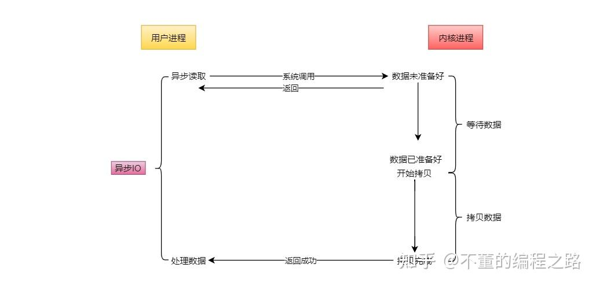
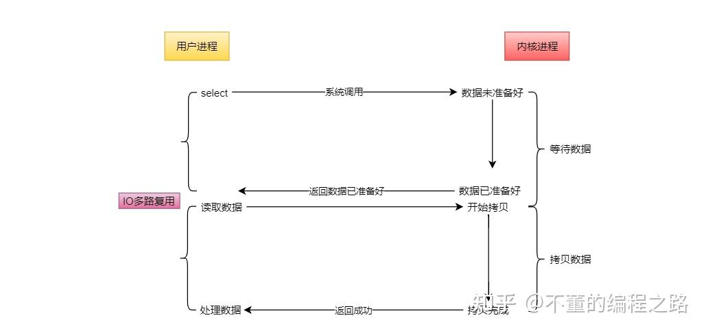
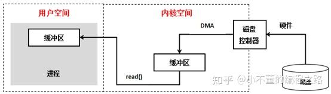

## 1. 什么是IO多路复用？

IO多路复用是一种同步IO模型，实现一个线程可以监视多个文件句柄；一旦某个文件句柄就绪，就能够通知应用程序进行相应的读写操作；没有文件句柄就绪时会阻塞应用程序，交出cpu。
+ 多路是指的是多个socket网络连接;
+ 复用指的是复用一个线程、使用一个线程来检查多个文件描述符（Socket）的就绪状态

在不创建进程的同时想多个客户端提供服务：IO复用；

处理每个请求的事件时，耗时控制在 1 毫秒以内，这样 1 秒内就可以处理上千个请求，把时间拉长来看，多个请求复用了一个进程，这就是多路复用，这种思想很类似一个 CPU 并发多个进程，所以也叫做时分多路复用。

我们熟悉的 select/poll/epoll 内核提供给用户态的多路复用系统调用，程可以通过一个系统调用函数从内核中获取多个事件。

select/poll/epoll 是如何获取网络事件的呢？在获取事件时，先把所有连接（文件描述符）传给内核，再由内核返回产生了事件的连接，然后在用户态中再处理这些连接对应的请求即可。

## 2. 五种IO模型

[1]blockingIO - 阻塞IO
[2]nonblockingIO - 非阻塞IO
[3]signaldrivenIO - 信号驱动IO
[4]asynchronousIO - 异步IO
[5]IOmultiplexing - IO多路复用

### 1. 阻塞IO模型


进程/线程在从调用recvfrom开始到它返回的整段时间内是被阻塞的，recvfrom成功返回后，应用进程/线程开始处理数据报。主要特点是进程阻塞挂起不消耗CPU资源，能及时响应每个操作；实现难度低，适用并发量小的网络应用开发，不适用并发量大的应用，因为一个请求IO会阻塞进程，所以每请求分配一个处理进程（线程）去响应，系统开销大。

### 2. 非阻塞式I/O模型：


进程发起IO系统调用后，如果内核缓冲区没有数据，需要到IO设备中读取，进程返回一个错误而不会被阻塞；进程发起IO系统调用后，如果内核缓冲区有数据，内核就会把数据返回进程。

+ 进程轮询（重复）调用，消耗CPU的资源；
+ 实现难度低、开发应用相对阻塞IO模式较难；
+ 适用并发量较小、且不需要及时响应的网络应用开发；

### 3. 信号驱动IO：


当进程发起一个IO操作，会向内核注册一个信号处理函数，然后进程返回不阻塞；当内核数据就绪时会发送一个信号给进程，进程便在信号处理函数中调用IO读取数据。

特点：回调机制，实现、开发应用难度大；

### 4. 异步IO



当进程发起一个IO操作，进程返回（不阻塞），但也不能返回果结；内核把整个IO处理完后，会通知进程结果。如果IO操作成功则进程直接获取到数据。

特点：

+ 不阻塞，数据一步到位；Proactor模式；
+ 需要操作系统的底层支持，LINUX 2.5 版本内核首现，2.6 版本产品的内核标准特性；
+ 实现、开发应用难度大；
+ 非常适合高性能高并发应用；


### 5. IO复用模型



大多数文件系统的默认IO操作都是缓存IO。在Linux的缓存IO机制中，操作系统会将IO的数据缓存在文件系统的页缓存（page cache）。也就是说，数据会先被拷贝到操作系统内核的缓冲区中，然后才会从操作系统内核的缓存区拷贝到应用程序的地址空间中。这种做法的缺点就是，需要在应用程序地址空间和内核进行多次拷贝，这些拷贝动作所带来的CPU以及内存开销是非常大的。

至于为什么不能直接让磁盘控制器把数据送到应用程序的地址空间中呢？最简单的一个原因就是应用程序不能直接操作底层硬件。

总的来说，IO分两阶段：

1)数据准备阶段

2)内核空间复制回用户进程缓冲区阶段。如下图：




## 3. 在改进网络 I/O 模型前，我先来提一个问题，你知道服务器单机理论最大能连接多少个客户端？

TCP 连接是由四元组唯一确认的，这个四元组就是：本机IP, 本机端口, 对端IP, 对端端口。

服务器作为服务方，通常会在本地固定监听一个端口，等待客户端的连接。因此服务器的本地 IP 和端口是固定的，于是对于服务端 TCP 连接的四元组只有对端 IP 和端口是会变化的，所以最大 TCP 连接数 = 客户端 IP 数×客户端端口数。

对于 IPv4，客户端的 IP 数最多为 2 的 32 次方，客户端的端口数最多为 2 的 16 次方，也就是服务端单机最大 TCP 连接数约为 2 的 48 次方.

这个理论值相当“丰满”，但是服务器肯定承载不了那么大的连接数，主要会受两个方面的限制：
+ 文件描述符，socket实际上是一个文件，也就会对应一个文件描述符。在linux下，单个进程打开文件描述符数是有限的，没有经过修改的值一般都是1024，不过可以通过ulimit增大文件描述符的数目；
+ 系统内存，每个TCP连接在内核中都有对应的数据结构，一维着每个连接都会占用一定内存的；

那如果服务器的内存只有 2 GB，网卡是千兆的，能支持并发 1 万请求吗？

并发 1 万请求，也就是经典的 C10K 问题 ，C 是 Client 单词首字母缩写，C10K 就是单机同时处理 1 万个请求的问题。

从硬件资源角度看，对于 2GB 内存千兆网卡的服务器，如果每个请求处理占用不到 200KB 的内存和 100Kbit 的网络带宽就可以满足并发 1 万个请求。

## 3. I/O 多路复用之select、poll、epoll详解

目前支持I/O多路复用的系统调用有select，pselect，poll，epoll。与多进程和多线程技术相比，I/O多路复用技术的最大优势是系统开销小，系统不必创建进程/线程，也不必维护这些进程/线程，从而大大减小了系统的开销。

I/O多路复用就是通过一种机制，一个进程可以监视多个描述符，一旦某个描述符就绪（一般是读就绪或者写就绪），能够通知程序进行相应的读写操作。但select，poll，epoll本质上都是同步I/O，因为他们都需要在读写事件就绪后自己负责进行读写，也就是说这个读写过程是阻塞的，而异步I/O则无需自己负责进行读写，异步I/O的实现会负责把数据从内核拷贝到用户空间

### 1. select

```cpp
int select (int n, fd_set *readfds, fd_set *writefds, fd_set *exceptfds, struct timeval *timeout);
```

select 函数监视的文件描述符分3类，分别是writefds、readfds、和exceptfds，当用户process调用select的时候，select会将需要监控的readfds集合拷贝到内核空间（假设监控的仅仅是socket可读），然后遍历自己监控的skb(SocketBuffer)，挨个调用skb的poll逻辑以便检查该socket是否有可读事件，遍历完所有的skb后，如果没有任何一个socket可读，那么select会调用schedule_timeout进入schedule循环，使得process进入睡眠。如果在timeout时间内某个socket上有数据可读了，或者等待timeout了，则调用select的process会被唤醒，接下来select就是遍历监控的集合，挨个收集可读事件并返回给用户了，

select 的限制
+ 底层数据结构：select 系统调用使用 fd_set 结构体来存储要监听的文件描述符集合。在许多操作系统中，fd_set 是一个固定大小的位图结构，例如在 Linux 系统里，fd_set 通常使用一个长度固定的 long 型数组表示，其大小限制使得能表示的文件描述符数量有限，一般最多只能处理 1024 个文件描述符。

>为什么不能 2^32?
>+ 操作系统限制：出于性能、资源管理以及历史兼容性等多方面考量，主流操作系统对 select 能处理的文件描述符数量做了人为限制 。例如，在 Linux 系统中，select 通常被限定最多处理 1024 个文件描述符，即便底层数据结构理论上有更大的表示潜力，系统内核在实现 select 相关逻辑时，并没有充分利用这一完整的 32 位空间来扩展监听数量，而是选择了一个更保守、平衡性能与复杂度的值。
>+ 性能瓶颈：即便不考虑操作系统的限制，真要监听海量的文件描述符，select 的实现机制也会导致严重的性能问题。每次调用 select，都要把 fd_set 从用户态拷贝到内核态，再拷贝回来，处理大规模的 fd_set 位图时，这种来回拷贝的开销极大。而且，遍历这么庞大的位图逐一检查文件描述符状态变化，效率十分低下，内核资源消耗也难以承受，所以即便理论上有扩展监听数量的可能，实际也不可行。

+ 内核实现开销：select 每次调用时，内核需要将用户态的 fd_set 拷贝到内核态，检查完毕后再拷贝回用户态。当文件描述符数量增多时，这种频繁的拷贝操作会带来巨大的性能开销，并且遍历整个固定大小的位图来检查状态变更效率也比较低。


```txt
[1] 每次调用select，都需要把被监控的fds集合从用户态空间拷贝到内核态空间，高并发场景下这样的拷贝会使得消耗的资源是很大的。
[2] 能监听端口的数量有限，单个进程所能打开的最大连接数由FD_SETSIZE宏定义，监听上限就等于fds_bits位数组中所有元素的二进制位总数，其大小是32个整数的大小（在32位的机器上，大小就是3232，同理64位机器上为3264），当然我们可以对宏FD_SETSIZE进行修改，然后重新编译内核，但是性能可能会受到影响，一般该数和系统内存关系很大，具体数目可以cat /proc/sys/fs/file-max察看。32位机默认1024个，64位默认2048。
[3] 被监控的fds集合中，只要有一个有数据可读，整个socket集合就会被遍历一次调用sk的poll函数收集可读事件：由于当初的需求是朴素，仅仅关心是否有数据可读这样一个事件，当事件通知来的时候，由于数据的到来是异步的，我们不知道事件来的时候，有多少个被监控的socket有数据可读了，于是，只能挨个遍历每个socket来收集可读事件了。
```

### 2. poll

poll的实现和select非常相似，只是描述fd集合的方式不同。针对select遗留的三个问题中（问题(2)是fd限制问题，问题(1)和(3)则是性能问题），poll只是使用pollfd结构而不是select的fd_set结构，这就解决了select的问题(2)fds集合大小1024限制问题。但poll和select同样存在一个性能缺点就是包含大量文件描述符的数组被整体复制于用户态和内核的地址空间之间，而不论这些文件描述符是否就绪，它的开销随着文件描述符数量的增加而线性增大。

```cpp
struct pollfd {
　　 int fd;           /*文件描述符*/
　　 short events;     /*监控的事件*/
　　 short revents;    /*监控事件中满足条件返回的事件*/
};
int poll(struct pollfd *fds, unsigned long nfds, int timeout);   
````

下面是poll的函数原型，poll改变了fds集合的描述方式，使用了pollfd结构而不是select的fd_set结构，使得poll支持的fds集合限制远大于select的1024。poll虽然解决了fds集合大小1024的限制问题，从实现来看。很明显它并没优化大量描述符数组被整体复制于用户态和内核态的地址空间之间，以及个别描述符就绪触发整体描述符集合的遍历的低效问题。poll随着监控的socket集合的增加性能线性下降，使得poll也并不适合用于大并发场景。

```cpp
poll服务端实现伪码：
struct pollfd fds[POLL_LEN];
unsigned int nfds=0;
fds[0].fd=server_sockfd;
fds[0].events=POLLIN|POLLPRI;
nfds++;
while {
    res=poll(fds,nfds,-1);
    if(fds[0].revents&(POLLIN|POLLPRI)) {
        //执行accept并加入fds中，nfds++
        if(--res<=0) continue
    }
    //循环之后的fds
    if(fds[i].revents&(POLLIN|POLLERR )) {
        //读操作或处理异常等
        if(--res<=0) continue
    }
}
```

### 3. epoll

相比于select，epoll最大的好处在于它不会随着监听fd数目的增长而降低效率。如前面我们所说，在内核中的select实现中，它是采用轮询来处理的，轮询的fd数目越多，自然耗时越多。并且，在linux/posix_types.h头文件有这样的声明：
#define __FD_SETSIZE 1024
表示select最多同时监听1024个fd，当然，可以通过修改头文件再重编译内核来扩大这个数目，但这似乎并不治本。

创建一个epoll的句柄，size用来告诉内核这个监听的数目一共有多大。这个参数不同于select()中的第一个参数，给出最大监听的fd+1的值。需要注意的是，当创建好epoll句柄后，它就是会占用一个fd值，在linux下如果查看/proc/进程id/fd/，是能够看到这个fd的，所以在使用完epoll后，必须调用close()关闭，否则可能导致fd被耗尽。

epoll的接口非常简单，一共就三个函数：

+ epoll_create：创建一个epoll句柄
+ epoll_ctl：向 epoll 对象中添加/修改/删除要管理的连接
+ epoll_wait：等待其管理的连接上的 IO 事件

epoll_create 函数
```cpp
int epoll_create(int size);
```
+ 功能：该函数生成一个 epoll 专用的文件描述符。
+ 参数size: 用来告诉内核这个监听的数目一共有多大，参数 size 并不是限制了 epoll 所能监听的描述符最大个数，只是对内核初始分配内部数据结构的一个建议。自从 linux 2.6.8 之后，size 参数是被忽略的，也就是说可以填只有大于 0 的任意值。
+ 返回值：如果成功，返回poll 专用的文件描述符，否者失败，返回-1。

epoll_create的源码实现：
```cpp
SYSCALL_DEFINE1(epoll_create1, int, flags)
{
    struct eventpoll *ep = NULL;

    //创建一个 eventpoll 对象
    error = ep_alloc(&ep);
}

//struct eventpoll 的定义
// file：fs/eventpoll.c
struct eventpoll {

    //sys_epoll_wait用到的等待队列
    wait_queue_head_t wq;

    //接收就绪的描述符都会放到这里
    struct list_head rdllist;

    //每个epoll对象中都有一颗红黑树
    struct rb_root rbr;

    ......
}
static int ep_alloc(struct eventpoll **pep)
{
    struct eventpoll *ep;

    //申请 epollevent 内存
    ep = kzalloc(sizeof(*ep), GFP_KERNEL);

    //初始化等待队列头
    init_waitqueue_head(&ep->wq);

    //初始化就绪列表
    INIT_LIST_HEAD(&ep->rdllist);

    //初始化红黑树指针
    ep->rbr = RB_ROOT;

    ......
}
```

其中eventpoll 这个结构体中的几个成员的含义如下：

+ wq： 等待队列链表。软中断数据就绪的时候会通过 wq 来找到阻塞在 epoll 对象上的用户进程。
+ rbr： 红黑树。为了支持对海量连接的高效查找、插入和删除，eventpoll 内部使用的就是红黑树。通过红黑树来管理用户主进程accept添加进来的所有 socket 连接。
+ rdllist： 就绪的描述符链表。当有连接就绪的时候，内核会把就绪的连接放到 rdllist 链表里。这样应用进程只需要判断链表就能找出就绪进程，而不用去遍历红黑树的所有节点了。

epoll_ctl 函数
```cpp
int epoll_ctl(int epfd, int op, int fd, struct epoll_event *event); 
```

+ 功能：epoll 的事件注册函数，它不同于 select() 是在监听事件时告诉内核要监听什么类型的事件，而是在这里先注册要监听的事件类型。
+ 参数epfd: epoll 专用的文件描述符，epoll_create()的返回值
+ 参数op: 表示动作，用三个宏来表示：
      + EPOLL_CTL_ADD：注册新的 fd 到 epfd 中；
      + EPOLL_CTL_MOD：修改已经注册的fd的监听事件；
      + EPOLL_CTL_DEL：从 epfd 中删除一个 fd；
+ 参数fd: 需要监听的文件描述符
+ 参数event: 告诉内核要监听什么事件，struct epoll_event 结构如:
      + events可以是以下几个宏的集合：
      + EPOLLIN ：表示对应的文件描述符可以读（包括对端 SOCKET 正常关闭）；
      + EPOLLOUT：表示对应的文件描述符可以写；
      + EPOLLPRI：表示对应的文件描述符有紧急的数据可读（这里应该表示有带外数据到来）；
      + EPOLLERR：表示对应的文件描述符发生错误；
      + EPOLLHUP：表示对应的文件描述符被挂断；
      + EPOLLET ：将 EPOLL 设为边缘触发(Edge Trigger)模式，这是相对于水平触发(Level Trigger)来说的。
      + EPOLLONESHOT：只监听一次事件，当监听完这次事件之后，如果还需要继续监听这个 socket 的话，需要再次把这个 socket 加入到 EPOLL 队列里
+ 返回值：0表示成功，-1表示失败。

epoll_wait函数
```CPP
int epoll_wait(int epfd, struct epoll_event * events, int maxevents, int timeout);
``` 
+ 功能：等待事件的产生，收集在 epoll 监控的事件中已经发送的事件，类似于 select() 调用。
+ 参数epfd: epoll 专用的文件描述符，epoll_create()的返回值
+ 参数events: 分配好的 epoll_event 结构体数组，epoll 将会把发生的事件赋值到events 数组中（events 不可以是空指针，内核只负责把数据复制到这个 events 数组中，不会去帮助我们在用户态中分配内存）。
参数maxevents: maxevents 告之内核这个 events 有多少个 。
参数timeout: 超时时间，单位为毫秒，为 -1 时，函数为阻塞。
+ 返回值：
如果成功，表示返回需要处理的事件数目
如果返回0，表示已超时


```cpp
#include <sys/socket.h>
#include <netinet/in.h>
#include <arpa/inet.h>
#include <stdio.h>
#include <unistd.h>
#include <errno.h>
#include <fcntl.h>
#include <stdlib.h>
#include <cassert>
#include <sys/epoll.h>
#include <sys/types.h>
#include <sys/stat.h>
#include <string.h>
#include<iostream>
const int MAX_EVENT_NUMBER = 10000; //最大事件数
// 设置句柄非阻塞
int setnonblocking(int fd)
{
    int old_option = fcntl(fd, F_GETFL);
    int new_option = old_option | O_NONBLOCK;
    fcntl(fd, F_SETFL, new_option);
    return old_option;
}

int main(){

    // 创建套接字
    int nRet=0;
    int m_listenfd = socket(PF_INET, SOCK_STREAM, 0);
    if(m_listenfd<0)
    {
        printf("fail to socket!");
        return -1;
    }
    // 
    struct sockaddr_in address;
    bzero(&address, sizeof(address));
    address.sin_family = AF_INET;
    address.sin_addr.s_addr = htonl(INADDR_ANY);
    address.sin_port = htons(6666);

    int flag = 1;
    // 设置ip可重用
    setsockopt(m_listenfd, SOL_SOCKET, SO_REUSEADDR, &flag, sizeof(flag));
    // 绑定端口号
    int ret = bind(m_listenfd, (struct sockaddr *)&address, sizeof(address));
    if(ret<0)
    {
        printf("fail to bind!,errno :%d",errno);
        return ret;
    }

    // 监听连接fd
    ret = listen(m_listenfd, 200);
    if(ret<0)
    {
        printf("fail to listen!,errno :%d",errno);
        return ret;
    }

    // 初始化红黑树和事件链表结构rdlist结构
    epoll_event events[MAX_EVENT_NUMBER];
    // 创建epoll实例
    int m_epollfd = epoll_create(5);
    if(m_epollfd==-1)
    {
        printf("fail to epoll create!");
        return m_epollfd;
    }


    // 创建节点结构体将监听连接句柄
    epoll_event event;
    event.data.fd = m_listenfd;
    //设置该句柄为边缘触发（数据没处理完后续不会再触发事件，水平触发是不管数据有没有触发都返回事件），
    event.events = EPOLLIN | EPOLLET | EPOLLRDHUP;
    // 添加监听连接句柄作为初始节点进入红黑树结构中，该节点后续处理连接的句柄
    epoll_ctl(m_epollfd, EPOLL_CTL_ADD, m_listenfd, &event);

    //进入服务器循环
    while(1)
    {
        int number = epoll_wait(m_epollfd, events, MAX_EVENT_NUMBER, -1);
        if (number < 0 && errno != EINTR)
        {
            printf( "epoll failure");
            break;
        }
        for (int i = 0; i < number; i++)
        {
            int sockfd = events[i].data.fd;
            // 属于处理新到的客户连接
            if (sockfd == m_listenfd)
            {
                struct sockaddr_in client_address;
                socklen_t client_addrlength = sizeof(client_address);
                int connfd = accept(m_listenfd, (struct sockaddr *)&client_address, &client_addrlength);
                if (connfd < 0)
                {
                    printf("errno is:%d accept error", errno);
                    return false;
                }
                epoll_event event;
                event.data.fd = connfd;
                //设置该句柄为边缘触发（数据没处理完后续不会再触发事件，水平触发是不管数据有没有触发都返回事件），
                event.events = EPOLLIN | EPOLLRDHUP;
                // 添加监听连接句柄作为初始节点进入红黑树结构中，该节点后续处理连接的句柄
                epoll_ctl(m_epollfd, EPOLL_CTL_ADD, connfd, &event);
                setnonblocking(connfd);
            }
            else if (events[i].events & (EPOLLRDHUP | EPOLLHUP | EPOLLERR))
            {
                //服务器端关闭连接，
                epoll_ctl(m_epollfd, EPOLL_CTL_DEL, sockfd, 0);
                close(sockfd);
            }
            //处理客户连接上接收到的数据
            else if (events[i].events & EPOLLIN)
            {
                char buf[1024]={0};
                read(sockfd,buf,1024);
                printf("from client :%s");

                // 将事件设置为写事件返回数据给客户端
                events[i].data.fd = sockfd;
                events[i].events = EPOLLOUT | EPOLLET | EPOLLONESHOT | EPOLLRDHUP;
                epoll_ctl(m_epollfd, EPOLL_CTL_MOD, sockfd, &events[i]);
            }
            else if (events[i].events & EPOLLOUT)
            {
                std::string response = "server response \n";
                write(sockfd,response.c_str(),response.length());

                // 将事件设置为读事件，继续监听客户端
                events[i].data.fd = sockfd;
                events[i].events = EPOLLIN | EPOLLRDHUP;
                epoll_ctl(m_epollfd, EPOLL_CTL_MOD, sockfd, &events[i]);
            }
            //else if 可以加管道，unix套接字等等数据
        }
    }


}
```

#### epoll的边缘触发与水平触发

水平触发(LT)

关注点是数据是否有无，只要读缓冲区不为空，写缓冲区不满，那么epoll_wait就会一直返回就绪，水平触发是epoll的默认工作方式。

边缘触发(ET)

关注点是变化，只要缓冲区的数据有变化，epoll_wait就会返回就绪。
这里的数据变化并不单纯指缓冲区从有数据变为没有数据，或者从没有数据变为有数据，还包括了数据变多或者变少。即当buffer长度有变化时，就会触发。
假设epoll被设置为了边缘触发，当客户端写入了100个字符，由于缓冲区从0变为了100，于是服务端epoll_wait触发一次就绪，服务端读取了2个字节后不再读取。这个时候再去调用epoll_wait会发现不会就绪，只有当客户端再次写入数据后，才会触发就绪。
这就导致如果使用ET模式，那就必须保证要「一次性把数据读取&写入完」，否则会导致数据长期无法读取/写入。

#### epoll 为什么比select、poll更高效？
1. epoll 采用红黑树管理文件描述符
从上图可以看出，epoll使用红黑树管理文件描述符，红黑树插入和删除的都是时间复杂度 O(logN)，不会随着文件描述符数量增加而改变。
select、poll采用数组或者链表的形式管理文件描述符，那么在遍历文件描述符时，时间复杂度会随着文件描述的增加而增加。
e
2. poll 将文件描述符添加和检测分离，减少了文件描述符拷贝的消耗
select&poll 调用时会将全部监听的 fd 从用户态空间拷贝至内核态空间并线性扫描一遍找出就绪的 fd 再返回到用户态。下次需要监听时，又需要把之前已经传递过的文件描述符再读传递进去，增加了拷贝文件的无效消耗，当文件描述很多时，性能瓶颈更加明显。
而epoll只需要使用epoll_ctl添加一次，后续的检查使用epoll_wait，减少了文件拷贝的消耗。


### 四、总结
select，poll，epoll都是IO多路复用机制，即可以监视多个描述符，一旦某个描述符就绪（读或写就绪），能够通知程序进行相应读写操作。 但select，poll，epoll本质上都是同步I/O，因为他们都需要在读写事件就绪后自己负责进行读写，也就是说这个读写过程是阻塞的，而异步I/O则无需自己负责进行读写，异步I/O的实现会负责把数据从内核拷贝到用户空间。

+ select，poll实现需要自己不断轮询所有fd集合，直到设备就绪，期间可能要睡眠和唤醒多次交替。而epoll其实也需要调用epoll_wait不断轮询就绪链表，期间也可能多次睡眠和唤醒交替，但是它是设备就绪时，调用回调函数，把就绪fd放入就绪链表中，并唤醒在epoll_wait中进入睡眠的进程。虽然都要睡眠和交替，但是select和poll在“醒着”的时候要遍历整个fd集合，而epoll在“醒着”的时候只要判断一下就绪链表是否为空就行了，这节省了大量的CPU时间。这就是回调机制带来的性能提升。

+ select，poll每次调用都要把fd集合从用户态往内核态拷贝一次，并且要把current往设备等待队列中挂一次，而epoll只要一次拷贝，而且把current往等待队列上挂也只挂一次（在epoll_wait的开始，注意这里的等待队列并不是设备等待队列，只是一个epoll内部定义的等待队列）。这也能节省不少的开销。


## 4. select poll epoll区别

(1)select==>时间复杂度O(n)

它仅仅知道了，有I/O事件发生了，却并不知道是哪那几个流（可能有一个，多个，甚至全部），我们只能无差别轮询所有流，找出能读出数据，或者写入数据的流，对他们进行操作。所以select具有O(n)的无差别轮询复杂度，同时处理的流越多，无差别轮询时间就越长。

(2)poll==>时间复杂度O(n)

poll本质上和select没有区别，它将用户传入的数组拷贝到内核空间，然后查询每个fd对应的设备状态， 但是它没有最大连接数的限制，原因是它是基于链表来存储的.

(3)epoll==>时间复杂度O(1)

epoll可以理解为event poll，不同于忙轮询和无差别轮询，epoll会把哪个流发生了怎样的I/O事件通知我们。所以我们说epoll实际上是事件驱动（每个事件关联上fd）的，此时我们对这些流的操作都是有意义的。（复杂度降低到了O(1)）

select，poll，epoll都是IO多路复用的机制。I/O多路复用就通过一种机制，可以监视多个描述符，一旦某个描述符就绪（一般是读就绪或者写就绪），能够通知程序进行相应的读写操作。但select，poll，epoll本质上都是同步I/O，因为他们都需要在读写事件就绪后自己负责进行读写，也就是说这个读写过程是阻塞的，而异步I/O则无需自己负责进行读写，异步I/O的实现会负责把数据从内核拷贝到用户空间。  

epoll跟select都能提供多路I/O复用的解决方案。在现在的Linux内核里有都能够支持，其中epoll是Linux所特有，而select则应该是POSIX所规定，一般操作系统均有实现


select：

select本质上是通过设置或者检查存放fd标志位的数据结构来进行下一步处理。这样所带来的缺点是：

1、 单个进程可监视的fd数量被限制，即能监听端口的大小有限。

      一般来说这个数目和系统内存关系很大，具体数目可以cat /proc/sys/fs/file-max察看。32位机默认是1024个。64位机默认是2048.

2、 对socket进行扫描时是线性扫描，即采用轮询的方法，效率较低：

       当套接字比较多的时候，每次select()都要通过遍历FD_SETSIZE个Socket来完成调度,不管哪个Socket是活跃的,都遍历一遍。这会浪费很多CPU时间。如果能给套接字注册某个回调函数，当他们活跃时，自动完成相关操作，那就避免了轮询，这正是epoll与kqueue做的。

3、需要维护一个用来存放大量fd的数据结构，这样会使得用户空间和内核空间在传递该结构时复制开销大


poll：

poll本质上和select没有区别，它将用户传入的数组拷贝到内核空间，然后查询每个fd对应的设备状态，如果设备就绪则在设备等待队列中加入一项并继续遍历，如果遍历完所有fd后没有发现就绪设备，则挂起当前进程，直到设备就绪或者主动超时，被唤醒后它又要再次遍历fd。这个过程经历了多次无谓的遍历。

它没有最大连接数的限制，原因是它是基于链表来存储的，但是同样有一个缺点：

1、大量的fd的数组被整体复制于用户态和内核地址空间之间，而不管这样的复制是不是有意义。                   

2、poll还有一个特点是“水平触发”，如果报告了fd后，没有被处理，那么下次poll时会再次报告该fd。

epoll:

epoll有EPOLLLT和EPOLLET两种触发模式，LT是默认的模式，ET是“高速”模式。LT模式下，只要这个fd还有数据可读，每次 epoll_wait都会返回它的事件，提醒用户程序去操作，而在ET（边缘触发）模式中，它只会提示一次，直到下次再有数据流入之前都不会再提示了，无 论fd中是否还有数据可读。所以在ET模式下，read一个fd的时候一定要把它的buffer读光，也就是说一直读到read的返回值小于请求值，或者 遇到EAGAIN错误。还有一个特点是，epoll使用“事件”的就绪通知方式，通过epoll_ctl注册fd，一旦该fd就绪，内核就会采用类似callback的回调机制来激活该fd，epoll_wait便可以收到通知。

epoll为什么要有EPOLLET触发模式？

如果采用EPOLLLT模式的话，系统中一旦有大量你不需要读写的就绪文件描述符，它们每次调用epoll_wait都会返回，这样会大大降低处理程序检索自己关心的就绪文件描述符的效率.。而采用EPOLLET这种边沿触发模式的话，当被监控的文件描述符上有可读写事件发生时，epoll_wait()会通知处理程序去读写。如果这次没有把数据全部读写完(如读写缓冲区太小)，那么下次调用epoll_wait()时，它不会通知你，也就是它只会通知你一次，直到该文件描述符上出现第二次可读写事件才会通知你！！！这种模式比水平触发效率高，系统不会充斥大量你不关心的就绪文件描述符


epoll的优点：

1、没有最大并发连接的限制，能打开的FD的上限远大于1024（1G的内存上能监听约10万个端口）；
2、效率提升，不是轮询的方式，不会随着FD数目的增加效率下降。只有活跃可用的FD才会调用callback函数；
即Epoll最大的优点就在于它只管你“活跃”的连接，而跟连接总数无关，因此在实际的网络环境中，Epoll的效率就会远远高于select和poll。
3、 内存拷贝，利用mmap()文件映射内存加速与内核空间的消息传递；即epoll使用mmap减少复制开销。


select、poll、epoll 区别总结：


1、支持一个进程所能打开的最大连接数

select

单个进程所能打开的最大连接数有FD_SETSIZE宏定义，其大小是32个整数的大小（在32位的机器上，大小就是3232，同理64位机器上FD_SETSIZE为3264），当然我们可以对进行修改，然后重新编译内核，但是性能可能会受到影响，这需要进一步的测试。

poll

poll本质上和select没有区别，但是它没有最大连接数的限制，原因是它是基于链表来存储的

epoll

虽然连接数有上限，但是很大，1G内存的机器上可以打开10万左右的连接，2G内存的机器可以打开20万左右的连接

2、FD剧增后带来的IO效率问题

select

因为每次调用时都会对连接进行线性遍历，所以随着FD的增加会造成遍历速度慢的“线性下降性能问题”。

poll

同上

epoll

因为epoll内核中实现是根据每个fd上的callback函数来实现的，只有活跃的socket才会主动调用callback，所以在活跃socket较少的情况下，使用epoll没有前面两者的线性下降的性能问题，但是所有socket都很活跃的情况下，可能会有性能问题。

3、 消息传递方式

select

内核需要将消息传递到用户空间，都需要内核拷贝动作

poll

同上

epoll

epoll通过内核和用户空间共享一块内存来实现的。

总结：

综上，在选择select，poll，epoll时要根据具体的使用场合以及这三种方式的自身特点。

1、表面上看epoll的性能最好，但是在连接数少并且连接都十分活跃的情况下，select和poll的性能可能比epoll好，毕竟epoll的通知机制需要很多函数回调。

2、select低效是因为每次它都需要轮询。但低效也是相对的，视情况而定，也可通过良好的设计改善 


###  整理

1、select实现

select的调用过程如下所示：


（1）使用copy_from_user从用户空间拷贝fd_set到内核空间

（2）注册回调函数__pollwait

（3）遍历所有fd，调用其对应的poll方法（对于socket，这个poll方法是sock_poll，sock_poll根据情况会调用到tcp_poll,udp_poll或者datagram_poll）

（4）以tcp_poll为例，其核心实现就是__pollwait，也就是上面注册的回调函数。

（5）__pollwait的主要工作就是把current（当前进程）挂到设备的等待队列中，不同的设备有不同的等待队列，对于tcp_poll来说，其等待队列是sk->sk_sleep（注意把进程挂到等待队列中并不代表进程已经睡眠了）。在设备收到一条消息（网络设备）或填写完文件数据（磁盘设备）后，会唤醒设备等待队列上睡眠的进程，这时current便被唤醒了。

（6）poll方法返回时会返回一个描述读写操作是否就绪的mask掩码，根据这个mask掩码给fd_set赋值。

（7）如果遍历完所有的fd，还没有返回一个可读写的mask掩码，则会调用schedule_timeout是调用select的进程（也就是current）进入睡眠。当设备驱动发生自身资源可读写后，会唤醒其等待队列上睡眠的进程。如果超过一定的超时时间（schedule_timeout指定），还是没人唤醒，则调用select的进程会重新被唤醒获得CPU，进而重新遍历fd，判断有没有就绪的fd。

（8）把fd_set从内核空间拷贝到用户空间。

select的几大缺点：

（1）每次调用select，都需要把fd集合从用户态拷贝到内核态，这个开销在fd很多时会很大

（2）同时每次调用select都需要在内核遍历传递进来的所有fd，这个开销在fd很多时也很大

（3）select支持的文件描述符数量太小了，默认是1024


2 poll实现

　　poll的实现和select非常相似，只是描述fd集合的方式不同，poll使用pollfd结构而不是select的fd_set结构，其他的都差不多,管理多个描述符也是进行轮询，根据描述符的状态进行处理，但是poll没有最大文件描述符数量的限制。poll和select同样存在一个缺点就是，包含大量文件描述符的数组被整体复制于用户态和内核的地址空间之间，而不论这些文件描述符是否就绪，它的开销随着文件描述符数量的增加而线性增大。


3、epoll

　　epoll既然是对select和poll的改进，就应该能避免上述的三个缺点。那epoll都是怎么解决的呢？在此之前，我们先看一下epoll和select和poll的调用接口上的不同，select和poll都只提供了一个函数——select或者poll函数。而epoll提供了三个函数，epoll_create,epoll_ctl和epoll_wait，epoll_create是创建一个epoll句柄；epoll_ctl是注册要监听的事件类型；epoll_wait则是等待事件的产生。

　　对于第一个缺点，epoll的解决方案在epoll_ctl函数中。每次注册新的事件到epoll句柄中时（在epoll_ctl中指定EPOLL_CTL_ADD），会把所有的fd拷贝进内核，而不是在epoll_wait的时候重复拷贝。epoll保证了每个fd在整个过程中只会拷贝一次。

　　对于第二个缺点，epoll的解决方案不像select或poll一样每次都把current轮流加入fd对应的设备等待队列中，而只在epoll_ctl时把current挂一遍（这一遍必不可少）并为每个fd指定一个回调函数，当设备就绪，唤醒等待队列上的等待者时，就会调用这个回调函数，而这个回调函数会把就绪的fd加入一个就绪链表）。epoll_wait的工作实际上就是在这个就绪链表中查看有没有就绪的fd（利用schedule_timeout()实现睡一会，判断一会的效果，和select实现中的第7步是类似的）。

　　对于第三个缺点，epoll没有这个限制，它所支持的FD上限是最大可以打开文件的数目，这个数字一般远大于2048,举个例子,在1GB内存的机器上大约是10万左右，具体数目可以cat /proc/sys/fs/file-max察看,一般来说这个数目和系统内存关系很大。

总结：

（1）select，poll实现需要自己不断轮询所有fd集合，直到设备就绪，期间可能要睡眠和唤醒多次交替。而epoll其实也需要调用epoll_wait不断轮询就绪链表，期间也可能多次睡眠和唤醒交替，但是它是设备就绪时，调用回调函数，把就绪fd放入就绪链表中，并唤醒在epoll_wait中进入睡眠的进程。虽然都要睡眠和交替，但是select和poll在“醒着”的时候要遍历整个fd集合，而epoll在“醒着”的时候只要判断一下就绪链表是否为空就行了，这节省了大量的CPU时间。这就是回调机制带来的性能提升。

（2）select，poll每次调用都要把fd集合从用户态往内核态拷贝一次，并且要把current往设备等待队列中挂一次，而epoll只要一次拷贝，而且把current往等待队列上挂也只挂一次（在epoll_wait的开始，注意这里的等待队列并不是设备等待队列，只是一个epoll内部定义的等待队列）。这也能节省不少的开销。 


