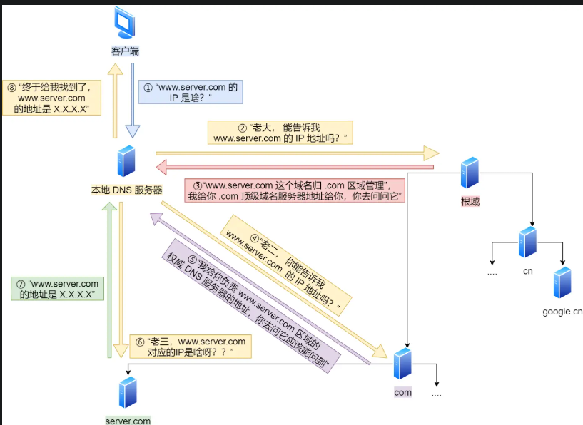
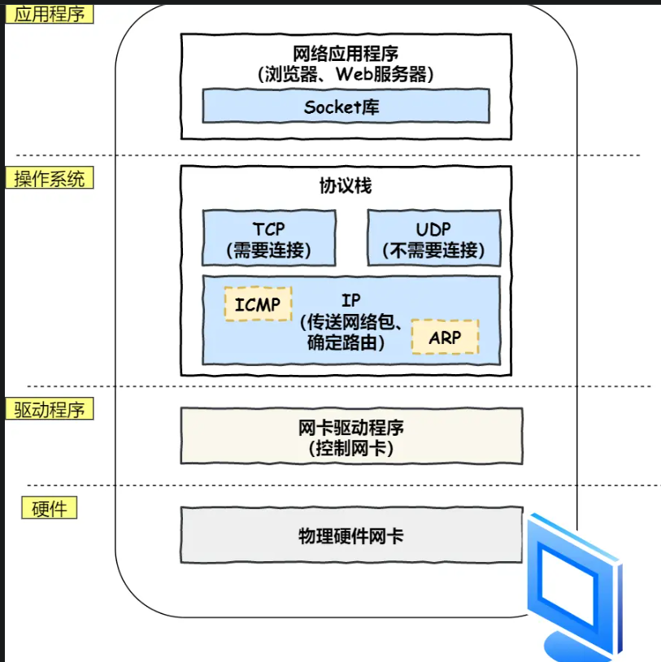
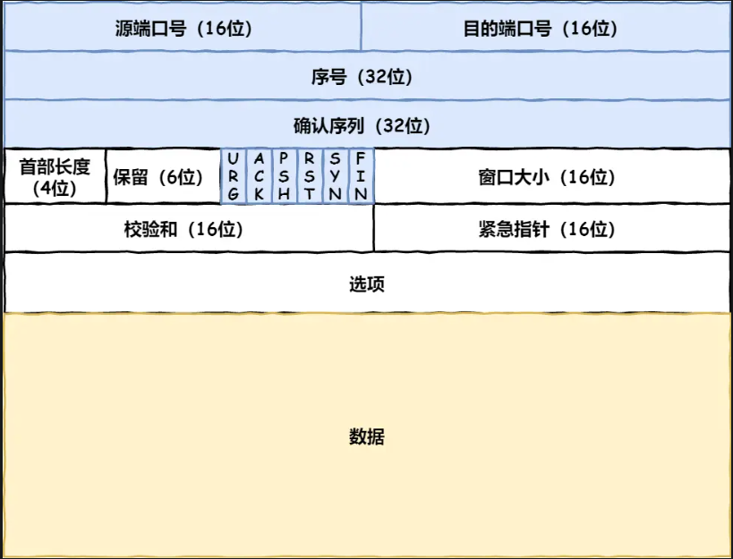
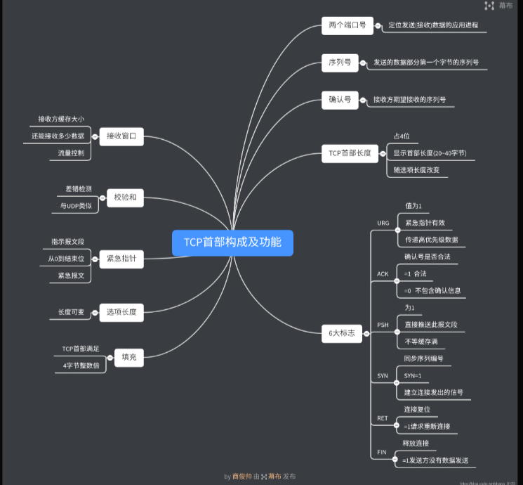
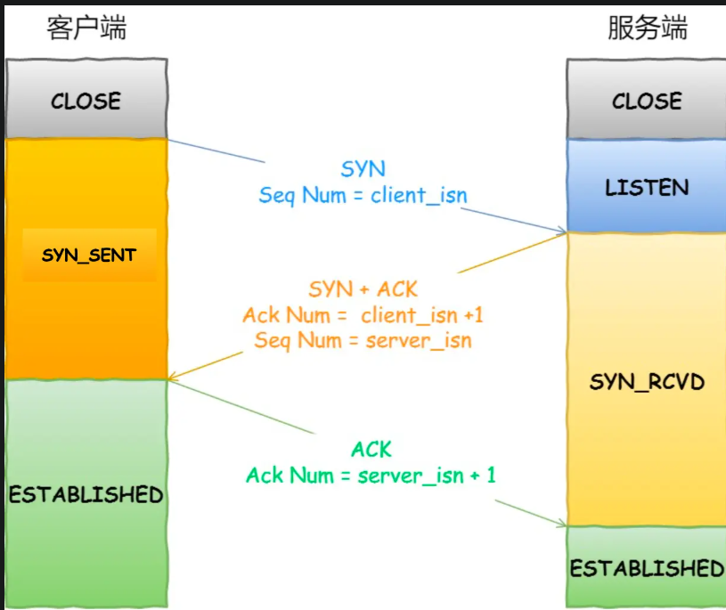
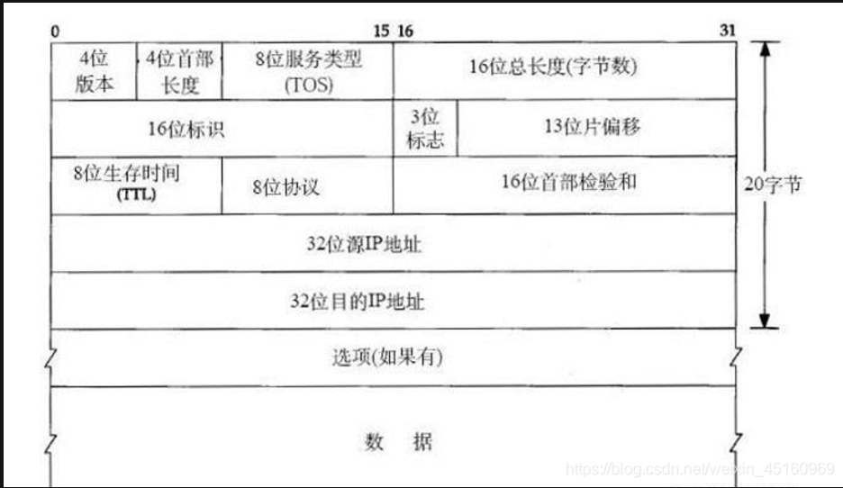
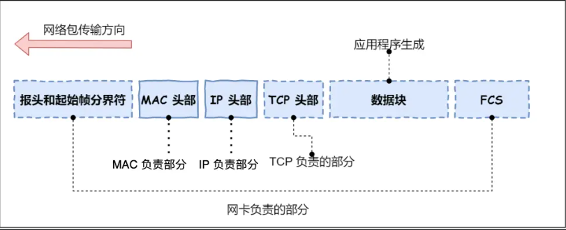
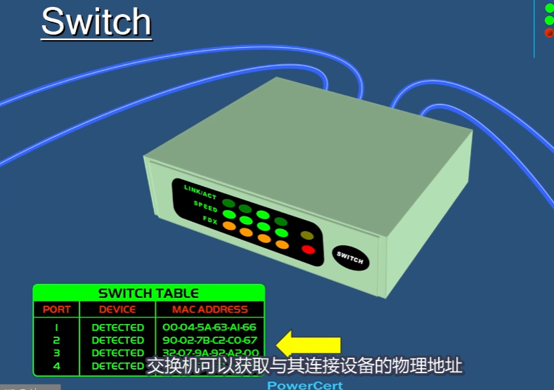
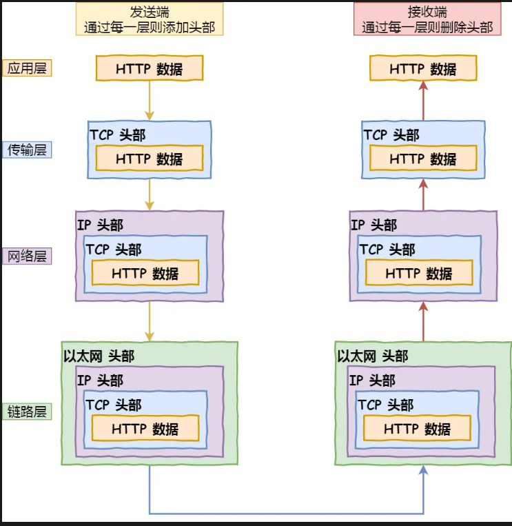

1. 解析 HTTP
2. 生成http请求信息
3. 通过DNS域名解析，找到ip
4. 通过DNS获取IP后，就可以把http的传输工作交给操作系统中的协议栈。
5. 添加 TCP头，ip头，mac
6. 通过网卡在网线上传输
7. 传输到交换机上，根据mac转发到目标端口
8. 通过路由器进入互联网

## 3. 通过DNS域名解析，找到ip
DNS服务器专门保存web服务器域名与ip的对应关系；

域名解析的工作流程：

## 4. 通过DNS获取IP后，就可以把http的传输工作交给操作系统中的协议栈。

应用程序（浏览器）通过调用socket库，来委托协议栈。协议栈分为两部分，分别是负责收发数据的TCP和UDP协议，这两个传输协议执行收发数据的操作；

协议栈下半部分用ip协议控制网络包收发操作，传输数据时，数据会被切成一块块网络包，而网络包的发送是由ip负责的；

ip中包括icmp和arp协议；
+ icmp 用于告知网络包传输过程中产生的错误以及各种控制信息
+ ARP 用于根据ip地址查询相应的以太网MAC地址

### TCP

> TCP传输数据前，要先三次握手建立连接

+ 刚开始，客户端和服务端都处于 close状态。先是服务端监听某个端口，处于 listen状态
+ 然后客户端发起连接 syn，之后客户端处于 syn-sent状态。
+ 服务端收到发起的连接，返回 syn，并且ack客户端的 syn，之后服务器处于 syn_rcvd状态
+ 客户端收到服务器发送的 syn和ack之后，发送对 syn确认的ack，之后处于 estableshed状态，因为它一发一收成功了；
+ 服务端收到ack的ack后，处于established状态，因为它也一发一收了

所以三次握手的目的是保证双方都有发送和接收的能力；

linux查看状态： netstat -napt

### ip

+ 源ip：客户端输出的ip地址
+ 目标地址，通过dns域名解析得到的web服务器ip

因为HTTP是经过tcp传输的，所以还包括协议号；

> 假设客户端有多个网卡，就会有多个 IP 地址，那 IP 头部的源地址应该选择哪个 IP 呢？

由路由器完成，路由器有多个网络接口，能够在任意接口上接收 Internet 数据报。路由器的任务是**根据路由表转发收到的数据报** cs144 lab

### 两点传输 MAC
生成了 IP 头部之后，接下来网络包还需要在 IP 头部的前面加上 MAC 头部。

MAC 头部是以太网使用的头部，它包含了接收方和发送方的 MAC 地址等信息

arp协议： cs144；

### 出口 网卡
网络包只是存放在内存中的一串二进制数字信息，没有办法直接发送给对方。因此，我们需要将数字信息
转换为电信号，才能在网线上传输，也就是说，这才是真正的数据发送过程。

负责执行这一操作的是网卡，要控制网卡还需要靠网卡驱动程序。

网卡驱动获取网络包之后，会将其复制到网卡内的缓存区中，接着会在其开头加上报头和起始帧分界符，
在末尾加上用于检测错误的帧校验序列。

+ 起始帧分界符是一个用来表示起始位置的标记
+ 末尾 fcs（帧校验位）用来检查包传输过程是否有损害

最后网卡把包转为电信号，通过网线发送出去
### 交换机
+ 集线器 hub：
  + 将局域网上的所有网络设备连接一起；
  + 会把数据发送到所有的端口
+ 路由器 router
  + 是一种根据ip地址，在不同网络中传输数据的设备
  + 根据ip，发送到不同的ip网络
+ 交换机 switch
  + 交换机可以获取与其他连接设备的物理地址,发送到特定的端口
  + 用于区域网的数据交换

集线器和交换机都是用于区域网的数据交换；
路由器可以获取ip地址，所以可以用于与互联网交换；

交换机的设计是将网络包原样转发到目的地。交换机工作在 MAC 层，也称为二层网络设备。

> 交换机的包接收操作

交换机的mac地址表包含两个信息：
+ 一个是设备的mac地址
+ 另一个是该设备连接在交换机的哪个端口上

> 当mac地址找不到指定的mac地址会怎样

地址表中找不到指定的MAC地址。这可能是因为具有该地址的设备还没有向交换机发送过包，或者这个
设备一段时间没有工作导致地址被从地址表中删除了。

这种情况下，交换机无法判断应该把泡转发到哪个端口，只能将包转发到除了源端口之外的所有端口上，
无论该设备连接在哪个端口上都能收到这个包。

这样做不会产生什么问题，因为以太网的设计本来就是将包发送到整个网络的，然后只有相应的接收者才
接收包，而其他设备则会忽略这个包。

### 路由器

> 路由器
路由器的端口具有MAC地址，因此它就能够成为以太网的发送方和接收方；同时还具有P地址，从这个
意义上来说，它和计算机的网卡是一样的。

当转发包时，首先路由器端口会接收发给自己的以太网包，然后路由表查询转发目标，再由相应的端口作
为发送方将以太网包发送出去。

> 查询路由表确定输出端口

完成泡接收操作之后，路由器就会去掉包开头的MAC头部。
MAC头部的作用就是将包送达路由器，其中的接收方MAC地址就是路由器端口的MAC地址。因此，当
包到达路由器之后，MAC头部的任务就完成了，于是MAC头部就会被丢弃。

接下来，路由器会根据MAC头部后方的IP头部中的内容进行包的转发操作。

在网络包传输的过程中，源ip和目标ip始终是不会变的，一直变换的是mac地址，因为需要mac地址在以太网内进行两个设备之间的包传输。

