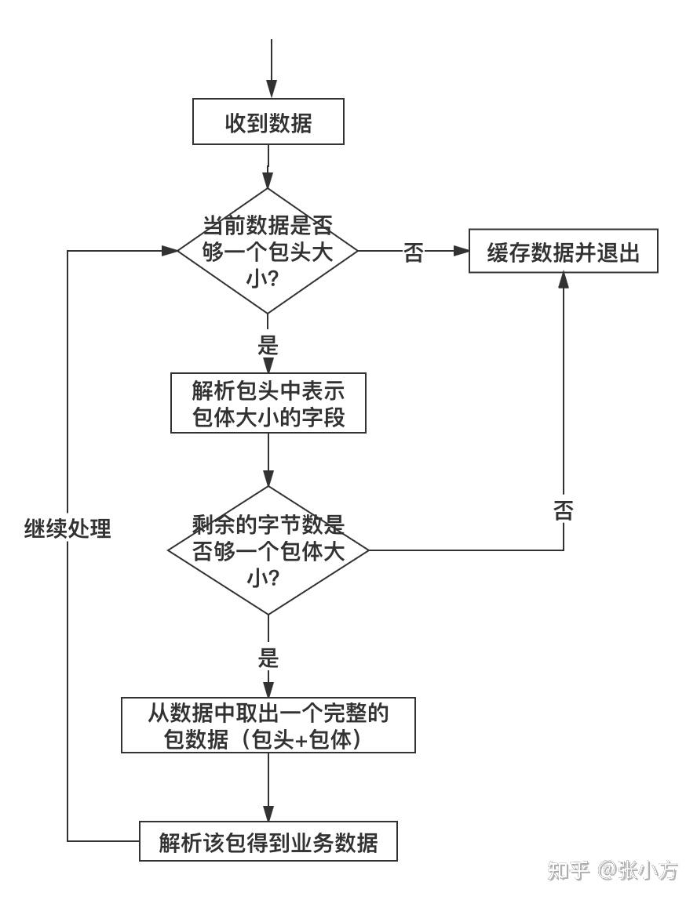

# 粘包和半包问题

粘包问题是应用层的问题，而不是TCP协议的问题。

## 什么是粘包？

粘包问题是指当发送两条消息时，比如发送了 ABC 和 DEF，但另一端接收到的却是 ABCD，像这种一次性读取了两条数据的情况就叫做粘包（正常情况应该是一条一条读取的）。

半包问题是指，当发送的消息是 ABC 时，另一端却接收到的是 AB 和 C 两条信息，像这种情况就叫做半包。

## 为什么会有粘包问题？

半包问题是指，当发送的消息是 ABC 时，另一端却接收到的是 AB 和 C 两条信息，像这种情况就叫做半包。

粘包的主要原因：
+ 发送方每次写入数据 < 套接字（Socket）缓冲区大小；
+ 接收方读取套接字（Socket）缓冲区数据不够及时。

半包的主要原因：
+ 发送方每次写入数据 > 套接字（Socket）缓冲区大小；
+ 发送的数据大于协议的 MTU (Maximum Transmission Unit，最大传输单元)，因此必须拆包。

缓冲区的优势以文件流的写入为例，如果我们不使用缓冲区，那么每次写操作 CPU 都会和低速存储设备也就是磁盘进行交互，那么整个写入文件的速度就会受制于低速的存储设备（磁盘）。但如果使用缓冲区的话，每次写操作会先将数据保存在高速缓冲区内存上，当缓冲区的数据到达某个阈值之后，再将文件一次性写入到磁盘上。因为内存的写入速度远远大于磁盘的写入速度，所以当有了缓冲区之后，文件的写入速度就被大大提升了。

## 如何解决粘包？

粘包和半包的解决方案有以下 3 种：

1. 发送方和接收方规定固定大小的缓冲区，也就是发送和接收都使用固定大小的 byte[] 数组长度，当字符长度不够时使用空字符弥补；
2. 在 TCP 协议的基础上封装一层数据请求协议，既将数据包封装成数据头（存储数据正文大小）+ 数据正文的形式，这样在服务端就可以知道每个数据包的具体长度了，知道了发送数据的具体边界之后，就可以解决半包和粘包的问题了；
3. 以特殊的字符结尾，比如以“\n”结尾，这样我们就知道结束字符，从而避免了半包和粘包问题（推荐解决方案）。


### 方法1：固定长度
虽然这种方式可以解决粘包和半包的问题，但这种固定缓冲区大小的方式增加了不必要的数据传输，因为这种方式当发送的数据比较小时会使用空字符来弥补，所以这种方式就大大的增加了网络传输的负担，所以它也不是最佳的解决方案。
如果包内容超过指定字节数，又得分包，需要增加额外处理逻辑--在发送端进行分包分片，在接受端重新组装包片。


### 方法2：封装请求协议
这种解决方案的实现思路是将请求的数据封装为两部分：数据头+数据正文，在数据头中存储数据正文的大小，当读取的数据小于数据头中的大小时，继续读取数据，直到读取的数据长度等于数据头中的长度时才停止。

这种格式的包一般分为两部分，即包头和包体，包头是固定大小的，且包头中必须含有一个字段来说明接下来的包体有多大。
```cpp
struct msg_header
{
    int32_t bodySize;
    int32_t cmd;
};
```

这就是一个典型的包头格式，bodySize 指定了这个包的包体是多大。由于包头大小是固定的（这里是 size(int32_t) + sizeof(int32_t) = 8 字节），对端先收取包头大小字节数目（当然，如果不够还是先缓存起来，直到收够为止），然后解析包头，根据包头中指定的包体大小来收取包体，等包体收够了，就组装成一个完整的包来处理。在有些实现中，包头中的 bodySize可能被另外一个叫 packageSize 的字段代替，这个字段的含义是整个包的大小，这个时候，我们只要用 packageSize 减去包头大小（这里是 sizeof(msg_header)）就能算出包体的大小，原理同上。




### 方法3：特殊字符结尾，按行读取

特殊字符结尾就可以知道流的边界了，因此也可以用来解决粘包和半包的问题，此实现方案是我们推荐最终解决方案。

这种解决方案的核心是，使用 Java 中自带的 BufferedReader 和 BufferedWriter，也就是带缓冲区的输入字符流和输出字符流，通过写入的时候加上 \n 来结尾，读取的时候使用 readLine 按行来读取数据，这样就知道流的边界了，从而解决了粘包和半包的问题。

不足之处就是如果协议数据包内容部分需要使用包结束标志字符，就需要对这些字符做转码或者转义操作，以免被接收方错误地当成包结束标志而误解析。


