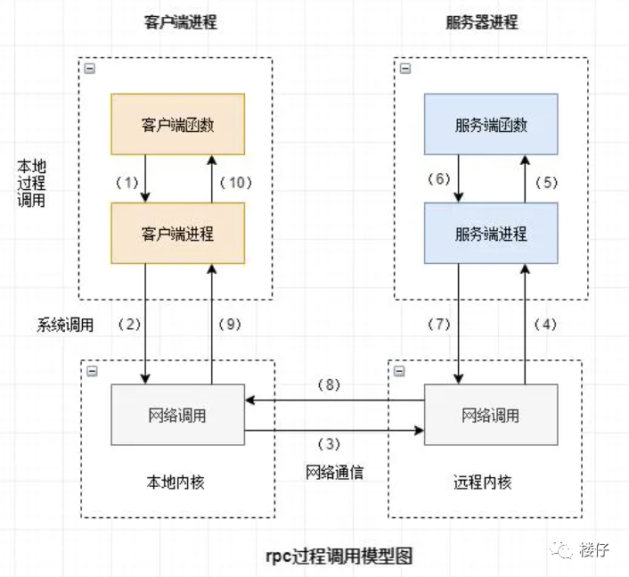

# RPC

我们知道纯裸TCP是不能拿来用的，会发生粘包半包等问题，所以需要在应用层规范消息体和消息头。这种就是协议；

TCP是传输层的协议，而基于TCP造成的HTTP和RPC他们只是定义了不同消息格式的应用层协议而已。

RPC是一种调用方式，先有RPC才有HTTP

## 1. 什么是RPC？

RPC（Remote Procedure Call Protocol）远程过程调用协议。一个通俗的描述是：客户端在不知道调用细节的情况下，调用存在于远程计算机上的某个对象，就像调用本地应用程序中的对象一样。

+ RPC是协议：既然是协议就只是一套规范，那么就需要有人遵循这套规范来进行实现。目前典型的RPC实现：Dubbo、Thrift、GRPC、Hetty等。
+ 网络协议和网络IO模型对其透明：既然RPC的客户端认为自己是在调用本地对象。那么传输层使用的是TCP/UDP还是HTTP协议就不需要关心
+ 信息格式对其透明：我们知道在本地应用程序中，对于某个对象的调用需要传递一些参数，并且会返回一个调用结果。至于被调用的对象内部是如何使用这些参数，并计算出处理结果的，调用方是不需要关心的。那么对于远程调用来说，这些参数会以某种信息格式传递给网络上的另外一台计算机，这个信息格式是怎样构成的，调用方是不需要关心的。
+ 应该有跨语言能力：为什么这样说呢？因为调用方实际上也不清楚远程服务器的应用程序是使用什么语言运行的。那么对于调用方来说，无论服务器方使用的是什么语言，本次调用都应该成功，并且返回值也应该按照调用方程序语言所能理解的形式进行描述。

## 2. 为什么使用RPC

发展过程：TCP->RPC->HTTP

客户端与服务端进行发送消息，此时都要用到应用层协议，在这种clint/server架构下，可以使用自家的RPC协议，因为只需要连接自己家的服务器就行了。

但是浏览器就不行了，需要访问其他的服务器，所以需要统一协议，而HTTP就是用来统一协议的。

## 3. RPC原理

### RPC调用流程

1. 服务消费方（client）调用以本地调用方式调用服务；
2. client stub接收到调用后负责将方法、参数等组装成能够进行网络传输的消息体；
3. client stub找到服务地址，并将消息发送到服务端；
4. server stub收到消息后进行解码；
5. server stub根据解码结果调用本地的服务；
6. 本地服务执行并将结果返回给server stub；
7. server stub将返回结果打包成消息并发送至消费方；
8. client stub接收到消息，并进行解码；
9. 服务消费方得到最终结果。

RPC的目标就是要2~8这些步骤都封装起来，让用户对这些细节透明。

### 如何做到透明化远程服务调用

怎么封装通信细节才能让用户像以本地调用方式调用远程服务呢？对java来说就是使用代理！java代理有两种方式：1） jdk 动态代理；2）字节码生成。尽管字节码生成方式实现的代理更为强大和高效，但代码维护不易，大部分公司实现RPC框架时还是选择动态代理方式。

