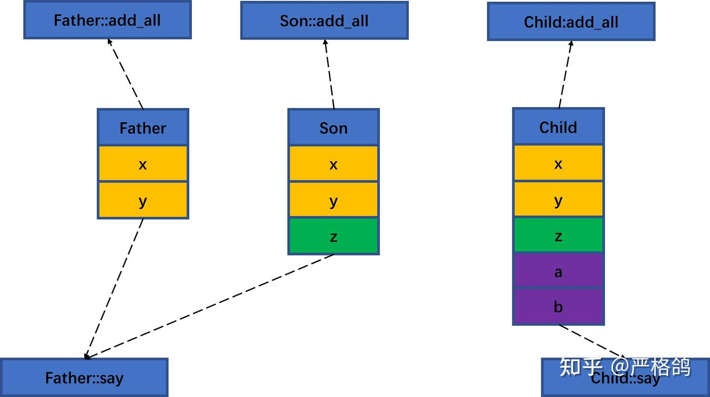
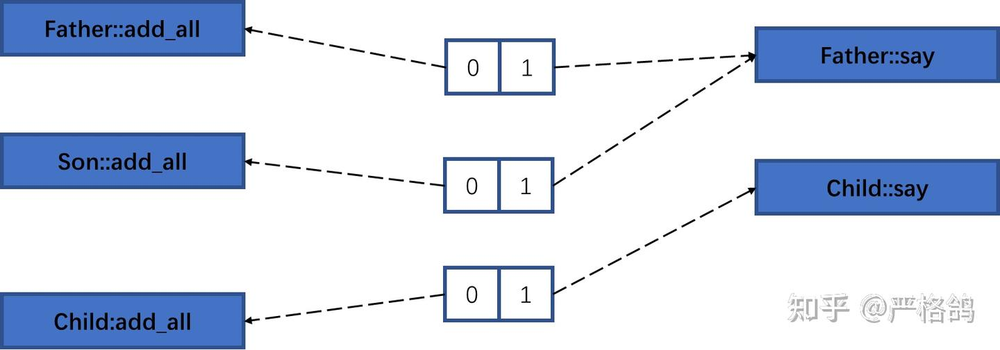
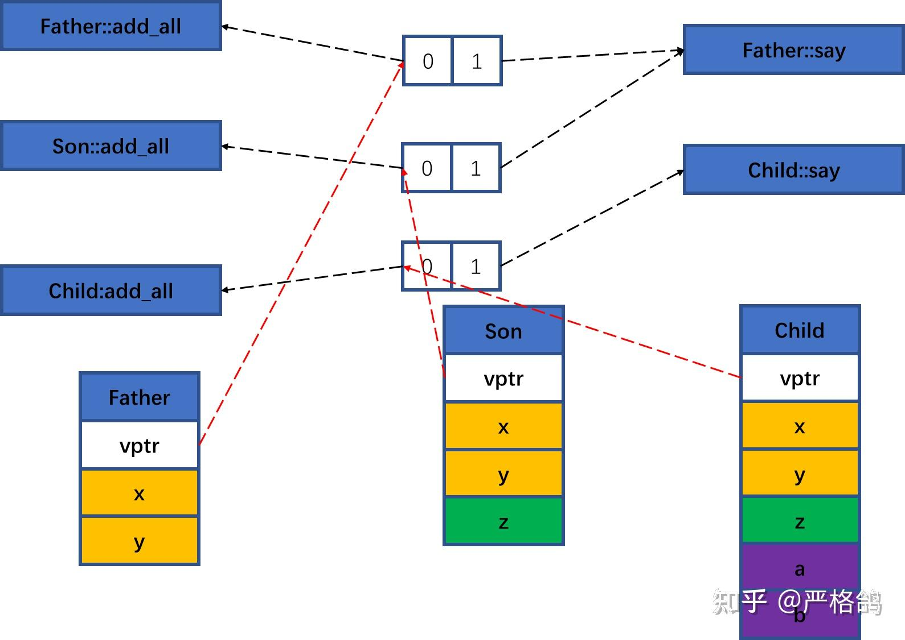

# c实现 c++版本
https://zhuanlan.zhihu.com/p/566782733

首先是最简单的封装/继承。

```cpp
class Father
{
    int x, y;
};

class Son :public Father
{
    int z;
};

struct Child :public Son
{
    int a, b;
};

void test() {
    printf("%d\n", sizeof(Father));
    printf("%d\n", sizeof(Son));
    printf("%d\n", sizeof(Child));
}
```

输出

>8
12
20

我们可以用strcut来模拟class，继承的实现直接在子类里面放置父类即可。

```cpp
struct Father
{
    int x, y;
};
struct Son
{
    Father super;
    int z;
};
struct Child
{
    Son super;
    int a, b;
};
void test() {
    printf("%d\n", sizeof(Father));
    printf("%d\n", sizeof(Son));
    printf("%d\n", sizeof(Child));
}
```

输出

>8
12
20

然后考虑封装函数，首先需要明白，函数在class里面是不占地方的

那么我们用C模拟的时候，也只能用一个函数

我们这里的做法是，转入一个类似python的self。然后我们通过self来调用数据。

```cpp
int add(void* self) {
    return ((Father*)self)->x + ((Father*)self)->y;
}
```

这里我们使用了强制类型转换，是的无论我们转入是哪个子类，都可以访问到属于Father的x,y。

```cpp
struct Father
{
    int x, y;
};
struct Son
{
    Father super;
    int z;
};
struct Child
{
    Son super;
    int a, b;
};
int add(void* self) {
    return ((Father*)self)->x + ((Father*)self)->y;
}
void test() {
    Father f = { 3,5 };
    printf("%d\n", add(&f));
    Son s = { 10,30 };
    printf("%d\n", add(&s));
    Child c = { 114,514 };
    printf("%d\n", add(&c));
}
```

输出

>8
40
628

## 实现虚函数。

首先看看我们需要实现的C++代码

```cpp
class Father
{
public:
    int x, y;
    Father() {}
    Father(int _x, int _y) { x = _x, y = _y; }
    virtual void say(const char* s) {
        printf("Father say : %s  ", s);
    }
    virtual int add_all() {
        return x + y;
    }
};

class Son :public Father
{
public:
    int z;
    Son() {};
    Son(int _x, int _y, int _z) { x = _x, y = _y, z = _z; };
    virtual int add_all() {
        return x + y + z;
    }
};

struct Child :public Son
{
public:
    int a, b;
    Child(int _x, int _y, int _z, int _a, int _b) { x = _x, y = _y, z = _z, a = _a, b = _b; };
    virtual void say(const char* s) {
        printf("Child say : %s  ", s);
    }
    virtual int add_all() {
        return x + y + z + a + b;
    }
};
void test() {
    Father* f = new Father(1, 2);
    f->say("this is Father");
    printf("%d\n", f->add_all());
    f = new Son(1, 2, 10);
    f->say("this is Son");
    printf("%d\n", f->add_all());
    f = new Child(1, 2, 3, 4, 5);
    f->say("this is Child");
    printf("%d\n", f->add_all());


    printf("%d %d %d", sizeof(Father), sizeof(Son), sizeof(Child));
}
```

输出

>Father say : this is Father 3
Father say : this is Son 13
Child say : this is Child 15
16 24 32

这里我们看下，上述代码一共创建了5个不同的函数。




这里我们需要在每个结构体里面放一个指向虚函数表的指针。

```cpp
struct Father
{
    void** vptr;
    int x, y;
};
struct Son
{
    Father super;
    int z;
};
struct Child
{
    Son super;
    int a, b;
};
void test() {
    printf("%d %d %d", sizeof(Father), sizeof(Son), sizeof(Child));
}
```

输出

>16 24 32

然后我们需要5个不同的函数的。

```cpp
int Father_add_all(void* self) {
    return ((Father*)self)->x + ((Father*)self)->y;
}

int Son_add_all(void* self) {
    return ((Father*)self)->x + ((Father*)self)->y + ((Son*)self)->z;
}

int Child_add_all(void* self) {
    return ((Father*)self)->x + ((Father*)self)->y + ((Son*)self)->z
        + ((Child*)self)->a + ((Child*)self)->b;
}
void Father_say(void* self, const char* s) {
    printf("Father say : %s  ", s);
}

void Child_say(void* self, const char* s) {
    printf("Child say : %s  ", s);
}
```

对于每个类，我们都需要一个虚函数表



首先我们需要先搞一个虚函数表

```cpp
void* v_table_Father[2];
void* v_table_Son[2];
void* v_table_Child[2];
```

然后我们需要将对应的函数都“挂载”到虚函数表

```cpp
void init() {
    v_table_Father[0] = Father_add_all;
    v_table_Father[1] = Father_say;

    v_table_Son[0] = Son_add_all;
    v_table_Son[1] = Father_say;

    v_table_Child[0] = Child_add_all;
    v_table_Child[1] = Child_say;
}
```

然后在构造一个新的类的时候，我们需要让vptr指向对应的虚函数表。



这里我们为了方便，用一个函数来包一下初始化（模拟new。

```cpp
Father* new_Father(int x, int y) {
    Father* f = (Father*)malloc(sizeof(Father));
    *f = { v_table_Father ,x,y };
    return f;
}

Son* new_Son(int x, int y, int z) {
    Son* s = (Son*)malloc(sizeof(Son));
    *s = { v_table_Son,x,y,z };
    return s;
}

Child* new_Child(int x, int y, int z, int a, int b) {
    Child* c = (Child*)malloc(sizeof(Child));
    *c = { v_table_Child,x,y,z,a,b };
    return c;
}
```

调用函数我们就只需要用函数指针强制类型转换void*，调用。

```cpp
int add_all(void* self) {
    Father* f = (Father*)self;
    auto p = (int(*)(void*))(f->vptr[0]);
    return p(f);
}

void say(void* self, const char* s) {
    Father* f = (Father*)self;
    auto p = (void(*)(void*, const char*))(f->vptr[1]);
    p(f, s);
}
```

# c实现封装 继承和多态

## 1. 封装

封装就是把一个抽象的事物的属性和相应的操作方法打包到一个类中，通过内部的方法来改变内部状态。封装的本质是隐藏信息的过程，使对象的内部状态不被外界直接访问和修改。

封装具有如下优点：

+ 提高了代码的安全性，数据只能被规定的方式访问，避免了误操作和非法访问。
+ 提高了代码的复用性，相同或类似的数据类型可以被多次利用。
+ 提高了代码的可维护性，当数据类型发生变化时，只需修改一个地方即可。

C语言中没有类的概念，但是可以使用结构体实现对事物的封装。封装的重要意义是，将函数（方法）和数据（属性）整合在一起，数据（属性）和数据（属性）整合在一起。这样，我们就可以通过简单的一个结构指针访问到所有的数据，操作所有的函数。

以下便是一个封装的具体例子：

```cpp
#include <stdio.h> 

typedef struct human
{ 
    int age; 
    char sex; 
    void (*set_age)(struct human *p, int age);
    int (*get_age)(struct human *p);
    void (*set_sex)(struct human *p, char sex);
    char (*get_sex)(struct human *p);
} Human; 

void set_age(Human *p, int age) 
{ 
    p->age = age; 
} 

int get_age(Human *p) 
{ 
    return p->age; 
} 

void set_sex(Human *p, char sex)
{ 
    p->sex = sex; 
} 

char get_sex(Human *p) 
{ 
    return p->sex; 
} 

int main() 
{ 
    Human p; 
    p.set_age = set_age(); 
    p.set_age(&p, 18); 
    p.set_sex = set_sex(); 
    p.set_sex(&p, 'M');
    p.get_age = get_age(); 
    printf("age: %d\n", p.get_age(&p));
    p.get_sex = get_sex();  
    printf("sex: %c\n", p.get_sex(&p)); 

    return 0; 
}
```

我们定义了一个“human”的结构体，里面包含了“age”/“sex”成员及“set_age”/“get_age”/”set_sex”/”get_sex”函数用于实现设置、获取年龄及性别。这就是封装，结构体的数据及函数就能实现human的属性及方法操作，另外只有通过结构体中的操作函数才能实现结构体内的数据的更改。

## 2. 继承

继承就是基于一个已有的类（父类或者基类），再创建一个新的类，这个类被称为子类或者派生类。子类或者派生类可以访问父类的数据及函数，从而避免重复编写代码。子类也可以添加自己的属性和数据。

继承具有如下优点：

+ 提高了代码的复用性，可以避免重复编写相同的代码。
+ 提高了代码的可扩展性，可以支持基于现有类，然后再细微地调整。
+ 提高了代码的可读性，继承使代码更加简洁明了。

在C语言里，可以通过结构体嵌套的方式，实现类的继承（这里指的是单继承，暂不考虑多继承），但是需要确保父类结构体引用需要放在子类结构体成员的**第一个位置**。这样，不论是数据的访问，还是强转都不会有什么问题。

内存布局上，首先是 Shape 的 color 成员，紧接着是 Circle 的 radius 成员，这保持了内存的连续性，方便通过指针操作进行访问和类型转换。将 Shape 放在首位允许将 Circle 指针安全地转换为 Shape 指针，反之亦然。这种转换对于实现多态行为和通用函数的调用至关重要。


以下便是一个继承的具体例子：

```cpp
#include <stdio.h>
#include <stdlib.h>

typedef struct human {
    int age;
    char sex;
} Human;

typedef struct person{
    Human human;
    char *name;
} Person;

Person* create_person(int age, char sex, char *name) {
    Person* cperson = (Person*) malloc(sizeof(Person));
    cperson->human.age = age;
    cperson->human.sex = sex;
    cperson->name = name;
    return cperson;
}

int main() {
    Person* cperson = create_person(18, 'w', "lucy");
    printf("(%d, %c) - name: %s\n", cperson->human.age, cperson->human.sex, cperson->name);
    free(cperson);
    return 0;
}
```

上述代码中，我们定义了两个结构体”Human”和”Person”。“Person”包含“Human”结构体以及成员变量“name”。通过函数“create_person()”构造一个“Person”类型的结构体，并为其中的“Human”成员以及“name”成员赋值。当需要在其他地方使用继承的特性时，可以使用类似的嵌套结构体的方式来实现。


## 3. 多态

多态是面向对象编程中最为核心的概念，它允许我们在不同的对象上执行相同的操作，从而实现灵活的操作处理。

多态具有如下优点：

+ 提高了代码的可扩展性，可以支持不同类型的对象，使程序更加灵活。
+ 提高了代码的可维护性，当类型发生变化时，只需要对相应的类进行修改即可。
+ 提高了代码的可读性，多态使代码更加简洁易读。

C语言中对于多态的实现，我们可以借助函数指针，利用同一的接口处理不同的数据。具有不同功能的函数可以用同一个函数名，这样可以用一个函数名调用不同功能的函数。

以下便是一个多态的具体例子：

```cpp
 #include <stdio.h>

typedef struct shape {
    void (*draw)(void* shape);
} Shape;

typedef struct {
    Shape base;
    int x;
    int y;
    int radius;
} Circle;

typedef struct {
    Shape base;
    int x1;
    int y1;
    int x2;
    int y2;
} Line;

void drawCircle(void* shape) {
    Circle* circle = (Circle*)shape;
    printf("Circle at (%d,%d) with radius %d\n", circle->x, circle->y, circle->radius);
}

void drawLine(void* shape) {
    Line* line = (Line*)shape;
    printf("Line from (%d,%d) to (%d,%d)\n", line->x1, line->y1, line->x2, line->y2);
}

int main() {
    Circle circle = {
        .base = { .draw = drawCircle }
        .x = 1,
        .y = 5,
        .radius = 10,
    };

    Line line = {
        .base = { .draw = drawLine }
        .x1 = 2,
        .y1 = 3,
        .x2 = 7,
        .y2 = 9,
    };

    Shape* shapes[2];
    shapes[0] = (Shape*)&circle;
    shapes[1] = (Shape*)&line;

    for (int i = 0; i < 2; i++) {
        shapes[i]->draw(shapes[i]);
    }

    return 0;
}
```

在上面的例子中，我们定义了一个“Shape”结构体和它的一个成员函数“draw”，此外还定义了两个从“Shape”派生的子结构体“Circle”和“Line”，并分别实现了它们自己“draw”函数。

通过声明让”Shape”中的”draw”函数成为了一个函数指针，指向一个参数为”void*”类型的函数。这让我们可以在”draw”函数中动态地处理不同的子结构体类型。

我们用”typedef”将结构体命名为”Shape”，以便在”Circle”和”Line”结构体中使用它们。最后，我们在主函数中创建了一个”Circle”和一个”Line”对象，并将它们存储在”Shape*”类型的数组中。使用一个循环来遍历数组，对每个形状对象调用它们自己的”draw”函数进行处理，这样便实现了多态的效果。


