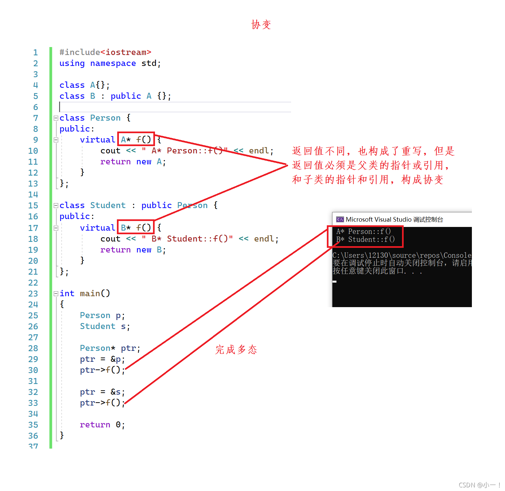
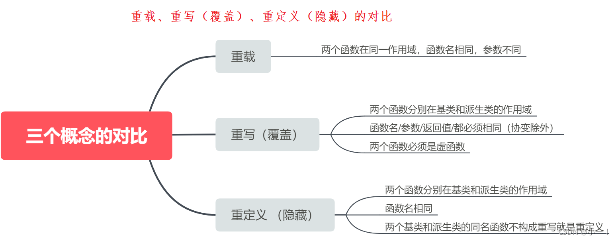

# 1. 封装
## 什么是封装？
c++是面向对象的程序，面向对象有三大特性：封装、继承、多态。

c++通过类，将一个对象的属性与行为结合在一起，使其更符合人们对于一件事务的认知，将属于该对象的所有东西打包在一起；通过访问限定符选择性的将其部分功能开放出来与其他对象进行交互，而对于内部的一些实现细节，外部用户不需要知道；

封装：将数据和操作数据的方法进行结合，隐藏对象的属性和实现细节，仅对外公开接口来和对象进行交互；

public： 类内外都可以访问 public 成员。派生类可以访问基类中的 public 成员。

private： 只有类的成员函数和友元函数可以访问 private 成员。派生类不能访问基类中的 private 成员。

protected： 提供了介于 public 和 private 之间的访问级别；
类的成员函数和派生类的成员函数可以访问 protected 成员。外部不可访问；


## 封装的好处：
封装的本质就是一种管理，想要暴露的用public，不想给别人看到的，我们使用protected/private把成员封装起来；隐藏内部细节，提高模块化和简化接口；

# 2. 继承
## 什么是继承？

继承就是一个类继承了另一个类的属性和方法，这个新的类包含了上一个类的属性和方法，被称为子类或者派生类，被继承的类称为父类或者基类。继承机制是面向对象设计使得**代码可以复用的最重要收到**，它允许在保存原有类特性的基础上进行扩展，增加新的功能，这样产生的类叫派生类。

### 继承方式（public、protected 或 private）会影响派生类对基类成员的访问权限：

1. public 继承：
+ 基类的 public 成员在派生类中仍然是 public。
+ 基类的 protected 成员在派生类中仍然是 protected。
+ 基类的 private 成员在派生类中仍然是不可访问的。
2. protected 继承：
+ 基类的 public 和 protected 成员在派生类中都变为 protected。
+ 基类的 private 成员在派生类中仍然是不可访问的。
3. private 继承：
+ 基类的 public 和 protected 成员在派生类中都变为 private。
+ 基类的 private 成员在派生类中仍然是不可访问的。


### 总结：

1. 基类private成员在派生类中无论以什么方式继承都是不可见的。这里的不可见是指基类的私有成员还是被继承到了派生类对象中，但是语法上限制派生类对象不管在类里面还是类外面都不能去访问它。

2. 基类private成员在派生类中是不能被访问，如果基类成员不想在类外直接被访问，但需要在派生类中能访问，就定义为protected。**可以看出保护成员限定符是因继承才出现的。**

3. 实际上面的表格我们进行一下总结会发现，基类的私有成员在子类都是不可见。基类的其他成员在子类的访问方式 == Min(成员在基类的访问限定符，继承方式)，public > protected > private。

4. 使用关键字class时默认的继承方式是private，使用struct时默认的继承方式是public，不过最好显示的写出继承方式。

5. 在实际运用中一般使用都是public继承，几乎很少使用protetced/private继承，也不提倡使用protetced/private继承，因为protetced/private继承下来的成员都只能在派生类的类里面使用，实际中扩展维护性不强。

## 基类和派生类对象赋值转换
派生类对象 可以赋值给 基类的对象 / 基类的指针 / 基类的引用。这里有个形象的说法叫切片或者切割。寓意把派生类中父类那部分切来赋值过去。基类对象不能赋值给派生类对象

基类对象不能赋值给派生类对象；
将一个基类指针转换为派生类指针，则需要显式地进行类型转换，并且应该确保该基类指针确实指向的是派生类的对象。


### 继承中的作用域
1. 在继承体系中基类和派生类都有独立的作用域
2. 子类和父类中有同名成员，子类成员将屏蔽父类对同名成员的直接访问，这种情况叫隐藏，也叫重定义。（在子类成员函数中，可以使用基类::基类成员 显示访问）
3. 需要注意的是如果是成员函数的隐藏，**只需要函数名相同就构成隐藏**。
4. 注意在实际中在继承体系里面最好不要定义同名的成员。

### 派生类的默认成员函数
6个默认成员函数，“默认”的意思就是指我们不写，编译器会变我们自动生成一个，那么在派生类中，这几个成员函数是如何生成的呢？

1. 派生类的构造函数必须调用基类的构造函数初始化基类的那一部分成员。如果基类没有默认的构造函数，则必须在派生类构造函数的**初始化列表阶段显示调用**。

2. 派生类的拷贝构造函数**必须调用基类的拷贝构造**完成基类的拷贝初始化
3. 派生类的 operator **必须要调用基类的拷贝构造**完成基类的拷贝初始化
4. 派生类的析构函数会被调用完成后**自动调用**基类的析构函数清理基类成员。因为这样才能保证派生类对象先清理派生类成员在清理基类成员的顺序。
5. 派生类对象初始化先调用基类构造再调用派生类构造
6. 派生类对象析构清理先调用派生类析构再调用基类的析构


### 继承与友元

**友元关系不能继承**，也就是说基类友元不能访问子类私有和保护成员

### 继承与静态成员

基类定义了 static静态成员，则整个继承体系里面只有一个这样的成员。无论派生出多少个子类，都只有一个static成员实例。

### 复杂的菱形继承及零星虚拟继承
单继承：一个子类只有一个直接父类时称这个继承关系为单继承

多继承：一个子类有两个或以上直接父类时称这个继承关系为多继承

菱形继承：菱形继承是多继承的一种特殊情况


菱形继承问题：从下面的对象成员模型构造，可以看出菱形继承有数据冗余和二义性的问题。再Assistant的对象种 Person成员会有两份；


**如何解决菱形继承中数据冗余和二歧义性问题**
**虚拟继承**可以解决菱形继承的二义性和数据冗余的问题。如上面的继承关系，在Student和Teacher的继承Person时使用虚拟继承，即可解决问题。需要注意的是，虚拟继承不要再其他地方去使用。

```cpp
class Person
{
public :
string _name ; // 姓名
};

class Student : virtual public Person
{
protected :
int _num ; //学号
};
class Teacher : virtual public Person
{
protected :
int _id ; // 职工编号
};

class Assistant : public Student, public Teacher
{
protected :
string _majorCourse ; // 主修课程
};
void Test ()
{
Assistant a ;
a._name = "peter";
}

```

**虚拟继承解决数据冗余和二义性的原理：**

```cpp
class A
{
public:
int _a;
};

// class B : public A
class B : virtual public A
{
public:
int _b;
};
// class C : public A
class C : virtual public A
{
public:
int _c;
};

class D : public B, public C
{
public:
int _d;
};

int main()
{
D d;
d.B::_a = 1;
d.C::_a = 2;
d._b = 3;
d._c = 4;
d._d = 5;
return 0;
}

```


继承的总结和反思
 1. 很多人说C++语法复杂，其实多继承就是一个体现。有了多继承，就存在菱形继承，有了菱形继承就有菱形虚拟继承，底层实现就很复杂。所以一般不建议设计出菱形继承。否则在复杂度及性能上都有问题。
 2. 多继承可以认为是C++的缺陷之一，很多后来的语言都没有多继承，如Java。

菱形继承的构造过程和析构过程。

```cpp
    Base
   /    \
Derived1 Derived2
   \    /
   Derived
```

虚继承：
+ Derived 的构造函数会直接调用 Base 的构造函数。
+ 然后调用 Derived1 和 Derived2 的构造函数。
+ Derived1 和 Derived2 的构造函数不会再次调用 Base 的构造函数。

结果是，Base 的构造函数只会被调用一次，避免了数据冗余。


析构顺序与构造顺序相反：
+ 先调用 Derived 的析构函数。
+ 然后调用 Derived2 的析构函数。
+ 接着调用 Derived1 的析构函数。
+ 最后调用 Base 的析构函数。

结果是，Base 的析构函数只会被调用一次。


# 3. 多态

好处：
提高代码的灵活性：多态使得程序能够在运行时根据对象的实际类型来决定调用哪个方法。这种动态绑定机制使代码更加灵活，能够更好地适应变化。

增强代码的可扩展性：通过多态，可以轻松地添加新的子类而不影响现有代码。只要新类实现了基类定义的接口或方法，现有的代码就可以无缝地使用新类的对象。

改善代码的可维护性：多态使得代码结构更加清晰，减少了重复代码。当需要修改某个行为时，只需在一个地方进行修改，而不是在多个地方重复修改。

实现接口多态：通过接口多态，可以定义一组相关的类共享一个共同的接口，这些类可以以不同的方式实现接口中的方法。这使得代码更加模块化和解耦。

**多态的概念：**通俗来说，就是多种形态，具体点就是去完成某个行为，当不同的对象去完成时会产出不同的状态和结果。

## 多态的定义和实现
多态：函数调用时的多种形态
静态多态：函数重载
动态多态：父类、基类的指针或引用调用调用重写的虚函数

1、 父类指针或引用**指向父类**，调用的就是父类的虚函数
2、 父类指针或引用**指向子类**，调用的就是子类的虚函数

## 多态的构成条件
多态是在不同继承关系的类对象，去调用同一函数，产生了不同的行为。比如Student 继承了Person。Person对象买票全价，Student对象买票半价。

那么在继承中要构成多态还有两个条件：
1. 必须通过基类的指针或者引用调用虚函数
2. 被调用的函数必须是虚函数，且派生类必须对基类的虚函数进行重写

虚函数：即被virtual修饰的类成员函数称为虚函数


虚函数重写
虚函数的重写(覆盖)：派生类中有一个跟基类完全相同的虚函数(即派生类虚函数与基类虚函数的返回值类型、函数名字、参数列表完全相同)，称子类的虚函数重写了基类的虚函数。

### 虚函数重写的两个例外：
1. 协变(基类与派生类虚函数返回值类型不同)
派生类重写基类虚函数时，与基类虚函数返回值类型不同。即基类虚函数返回基类对象的指针或者引用，派生类虚函数返回派生类对象的指针或者引用时，称为协变。


2. 析构函数的重写(基类与派生类析构函数的名字不同)

如果基类的析构函数为虚函数，此时派生类析构函数只要定义，无论是否加virtual关键字，都与基类的析构函数构成重写，虽然基类与派生类析构函数名字不同。虽然函数名不相同，看起来违背了重写的规则，其实不然，这里可以理解为编译器对析构函数的名称做了特殊处理，编译后析构函数的名称统一处理成destructor。

3. 子类的虚函数不加virtual也算是完成了重写


###  重载、重写（覆盖）、重定义（隐藏）的对比


### 抽象类

在虚函数的后面写上 =0 ，则这个函数为纯虚函数。**包含纯虚函数的类叫做抽象类**（也叫接口类），抽象类；

**不能实例化出对象。派生类继承后也不能实例化出对象**，只有重写纯虚函数，派生类才能实例化出对象。纯虚函数规范了派生类必须重写，另外纯虚函数更体现出了接口继承。


## 多态的原理
```cpp
// 这里常考一道笔试题：sizeof(Base)是多少？
class Base
{
public:
virtual void Func1()
{
cout << "Func1()" << endl;
}
private:
int _b = 1;
};
int main()
{
	Base b;
	return 0;
}
```
结果是8


通过监视窗口，我们发现b对象是8bytes，除了_b成员，还多一个__vfptr放在对象的前面(注意有些平台可能会放到对象的最后面，这个跟平台有关)，对象中的这个指针我们叫做虚函数表指针(v代表virtual，f代表function)。一个含有虚函数的类中都至少都有一个虚函数表指针，因为虚函数的地址要被放到虚函数表中，虚函数表也简称虚表。那么派生类中这个表放了些什么呢？我们接着往下分析


通过观察和测试，我们发现了以下几点问题：

1. 派生类对象d中也有一个虚表指针，d对象由两部分构成，一部分是父类继承下来的成员，虚表指针也就是存在部分的另一部分是自己的成员。

2. 基类b对象和派生类d对象虚表是不一样的，这里我们发现Func1完成了重写，所以d的虚表中存的是重写的Derive::Func1，所以虚函数的重写也叫作覆盖，覆盖就是指虚表中虚函数的覆盖。重写是语法的叫法，覆盖是原理层的叫法。

3. 另外Func2继承下来后是虚函数，所以放进了虚表，Func3也继承下来了，但是不是虚函数，所以不会放进虚表。

4. 虚函数表本质是一个存虚函数指针的指针数组，这个数组最后面放了一个nullptr。

5. 总结一下派生类的虚表生成：a.先将基类中的虚表内容拷贝一份到派生类虚表中 b.如果派生类重写了基类中某个虚函数，用派生类自己的虚函数覆盖虚表中基类的虚函数 c.派生类自己新增加的虚函数按其在派生类中的声明次序增加到派生类虚表的最后。

6. 这里还有一个童鞋们很容易混淆的问题：虚函数存在哪的？ 注意虚表存的是虚函数指针，不是虚函数，虚函数和普通函数一样的，都是存在代码段的，只是他的指针又存到了虚表中。另外对象中存的不是虚表，存的是虚表指针。

## 多态的构成条件
多态是在不同继承关系的类对象，去调用同一函数，产生了不同的行为。比如Student继承了Person。
Person对象买票全价，Student对象买票半价。
那么在继承中要构成多态还有两个条件：
+ 必须通过基类的指针或者引用调用虚函数
+ 被调用的函数必须是虚函数，且派生类必须对基类的虚函数进行重写

为什么一定要基类的指针或者引用去调用虚函数才能达到多态呢？基类对象直接调用虚函数不行吗？

只有基类的指针或者引用去调用虚函数才可以达到多态，基类的对象不能达到多态。


