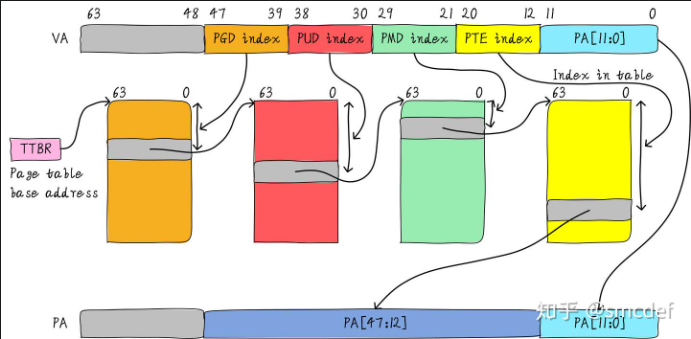
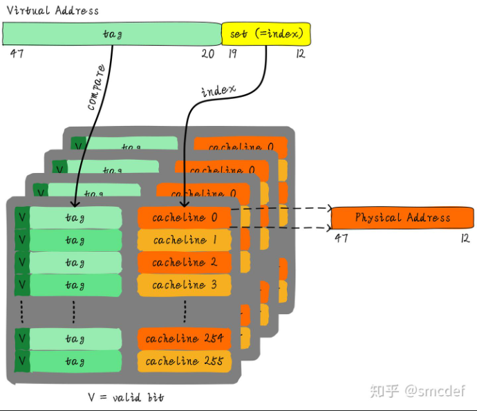
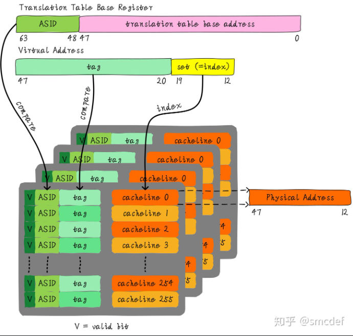

抄自：https://zhuanlan.zhihu.com/p/108425561
# TLB

TLB是translation lookaside buffer的简称。首先，我们知道MMU的作用是把虚拟地址转换成物理地址。虚拟地址和物理地址的映射关系存储在页表中，而现在页表又是分级的。64位系统一般都是3~5级。常见的配置是4级页表，就以4级页表为例说明。分别是PGD、PUD、PMD、PTE四级页表。

在硬件上会有一个叫做**页表基地址寄存器**，它存储PGD页表的首地址。MMU就是根据页表基地址寄存器从PGD页表一路查到PTE，最终找到物理地址(PTE页表中存储物理地址)。

## TLB的本质是什么

TLB其实就是一块高速缓存。数据cache缓存地址(虚拟地址或者物理地址)和数据。TLB**缓存虚拟地址和其映射的物理地址**。TLB根据虚拟地址查找cache，它没得选，只能根据虚拟地址查找。所以TLB是一个虚拟高速缓存。硬件存在TLB后，虚拟地址到物理地址的转换过程发生了变化。虚拟地址首先发往TLB确认是否命中cache，如果cache hit直接可以得到物理地址。否则，一级一级查找页表获取物理地址。并将虚拟地址和物理地址的映射关系缓存到TLB中。既然TLB是虚拟高速缓存（VIVT），是否存在别名和歧义问题呢？如果存在，软件和硬件是如何配合解决这些问题呢？

## TLB的特殊

虚拟地址映射物理地址的最小单位是4KB。所以TLB其实不需要存储虚拟地址和物理地址的低12位(因为低12位是一样的，根本没必要存储)。另外，我们如果命中cache，肯定是一次性从cache中拿出整个数据。所以虚拟地址不需要offset域。index域是否需要呢？这取决于cache的组织形式。如果是全相连高速缓存。那么就不需要index。如果使用多路组相连高速缓存，依然需要index。下图就是一个四路组相连TLB的例子。现如今64位CPU寻址范围并没有扩大到64位。64位地址空间很大，现如今还用不到那么大。因此硬件为了设计简单或者解决成本，实际虚拟地址位数只使用了一部分。这里以48位地址总线为了例说明。

## TLB的别名问题

我先来思考第一个问题，别名是否存在。我们知道PIPT的数据cache不存在别名问题。物理地址是唯一的，一个物理地址一定对应一个数据。但是不同的物理地址可能存储相同的数据。也就是说，物理地址对应数据是一对一关系，反过来是多对一关系。

由于TLB的特殊性，存储的是虚拟地址和物理地址的对应关系。因此，对于单个进程来说，同一时间一个虚拟地址对应一个物理地址，一个物理地址可以被多个虚拟地址映射。将PIPT数据cache类比TLB，我们可以知道TLB不存在别名问题。而VIVT Cache存在别名问题，原因是VA需要转换成PA，PA里面才存储着数据。中间多经传一手，所以引入了些问题。

## TLB的歧义问题

我们知道不同的进程之间看到的虚拟地址范围是一样的，所以多个进程下，不同进程的相同的虚拟地址可以映射不同的物理地址。这就会造成歧义问题。

例如，进程A将地址0x2000映射物理地址0x4000。进程B将地址0x2000映射物理地址0x5000。当进程A执行的时候将0x2000对应0x4000的映射关系缓存到TLB中。当切换B进程的时候，B进程访问0x2000的数据，会由于命中TLB从物理地址0x4000取数据。这就造成了歧义。如何消除这种歧义，我们可以借鉴VIVT数据cache的处理方式，**在进程切换时将整个TLB无效**。切换后的进程都不会命中TLB，但是会导致性能损失。

## 如何尽可能的避免flush TLB

首先需要说明的是，这里的flush理解成使无效的意思。我们知道进程切换的时候，为了避免歧义，我们需要主动flush整个TLB。如果我们能够区分不同的进程的TLB表项就可以避免flush TLB。我们知道Linux如何区分不同的进程？每个进程拥有一个独一无二的进程ID。如果TLB在判断是否命中的时候，除了比较tag以外，再额外比较进程ID该多好呢！这样就可以区分不同进程的TLB表项。进程A和B虽然虚拟地址一样，但是进程ID不一样，自然就不会发生进程B命中进程A的TLB表项。

所以，TLB添加一项ASID(Address Space ID)的匹配。ASID就类似进程ID一样，用来区分不同进程的TLB表项。这样在进程切换的时候就不需要flush TLB。但是仍然需要软件管理和分配ASID。

## 如何管理ASID

ASID和进程ID肯定是不一样的，别混淆二者。进程ID取值范围很大。但是ASID一般是8或16 bit。所以只能区分256或65536个进程。我们的例子就以8位ASID说明。所以我们不可能将进程ID和ASID一一对应，我们必须为每个进程分配一个ASID，进程ID和每个进程的ASID一般是不相等的。

每创建一个新进程，就为之分配一个新的ASID。当ASID分配完后，flush所有TLB，重新分配ASID。所以，如果想完全避免flush TLB的话，理想情况下，运行的进程数目必须小于等于256。然而事实并非如此，因此管理ASID上需要软硬结合。

Linux kernel为了管理每个进程会有个task_struct结构体，我们可以把分配给当前进程的ASID存储在这里。页表基地址寄存器有空闲位也可以用来存储ASID。当进程切换时，可以将页表基地址和ASID(可以从task_struct获得)共同存储在页表基地址寄存器中。当查找TLB时，硬件可以对比tag以及ASID是否相等(对比页表基地址寄存器存储的ASID和TLB表项存储的ASID)。如果都相等，代表TLB hit。否则TLB miss。当TLB miss时，需要多级遍历页表，查找物理地址。然后缓存到TLB中，同时缓存当前的ASID。

