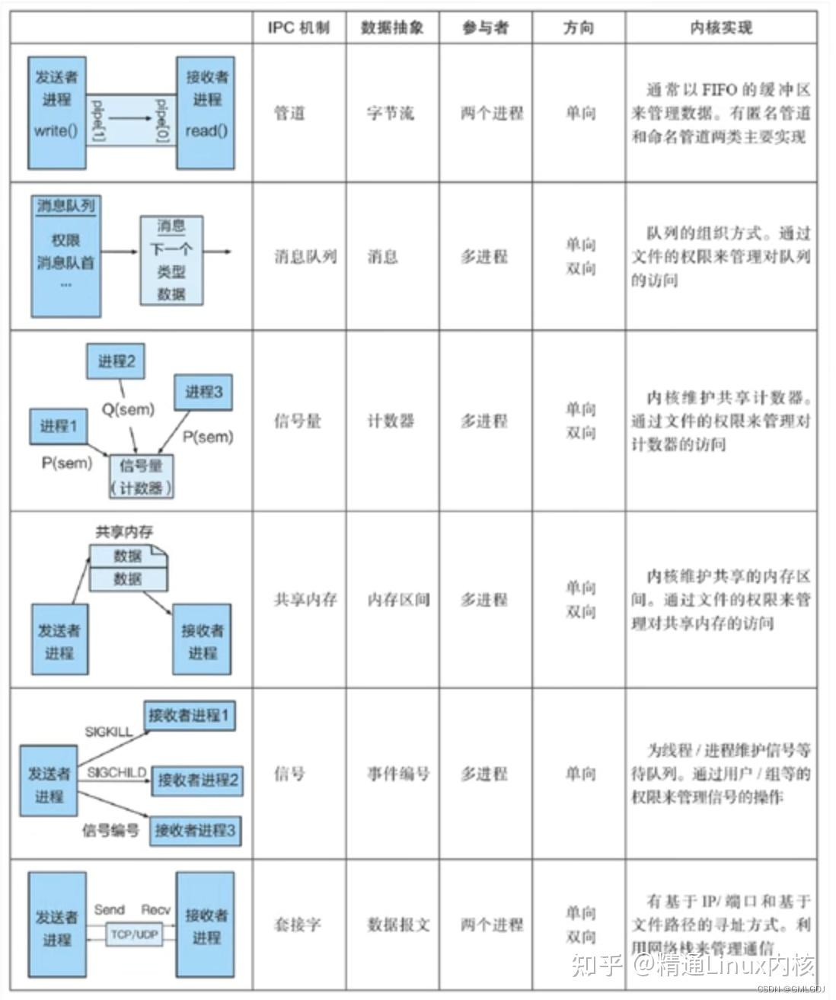
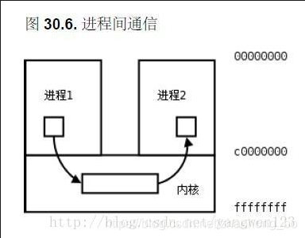
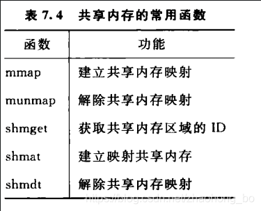

管道：
消息队列：
共享内存：
信号量：
信号：
套接字：


# 进程间的通信

每个进程的用户地址空间都是独立的，一般而言一个进程不能直接访问另一个进程的地址空间，不过内核空间是每个进程都共享的，所以进程之间想要进行信息交换就必须通过内核。

## 1.管道

它是半双工的（即数据只能在一个方向上流动），具有固定的读端和写端。

它只能用于具有亲缘关系的进程之间的通信（也是父子进程或者兄弟进程之间）。

它可以看成是一种特殊的文件，对于它的读写也可以使用普通的read、write 等函数。但是它不是普通的文件，并不属于其他任何文件系统，并且只存在于内存中。

管道分为pipe（无名管道）和fifo（命名管道）两种，除了建立、打开、删除的方式不同外，这两种管道几乎一样的。都是通过内核缓冲区实现数据传输。

+ pipe用于相关进程之间的通信，例如父进程和子进程，它通过pipe（）系统调用来创建并打开，当最后一个使用它的进程关闭对他的引用时，pipe将自动撤销。

+ FIFO及命名管道，在磁盘上有对应的节点，但没有数据块。换言之，只是一个名字和相应访问权限，通过mknode()系统调用或者mkfifo()函数来建立的。一旦建立，任何进程都可以通过文件名将其打开和进行读写，而不局限于父子进程，当然前提是进程对fifo有适当的访问权。当不在被进程使用时，FIFO在内存中释放，但磁盘节点仍然存在。

管道的实质是一个内核缓冲区，进程以先进先出的方式从缓冲区存取数据：管道一端的进程顺序地将进程数据写入缓冲区，另一端的进程则顺序地读取数据，该缓冲区可以看做一个循环队列，读和写的位置都是自动增加的，一个数据只能被读一次，读出以后再缓冲区都不复存在了。当缓冲区读空或者写满时，有一定的规则控制相应的读进程或写进程是否进入等待队列，当空的缓冲区有新数据写入或慢的缓冲区有数据读出时，就唤醒等待队列中的进程继续读写。



### 匿名管道

匿名管道只能在具有亲缘关系（父子进程）的进程间使用，。也就是说，匿名管道只能用于父子进程之间的通信。

管道的本质是什么：对于管道两端的进程而言，管道就是一个文件（这也就是为啥管道也被称为共享文件机制的原因了），但它不是普通的文件，它不属于某种文件系统，而是自立门户，单独构成一种文件系统，并且只存在于内存中。
管道的本质就是内核在内存中开辟了一个缓冲区，这个缓冲区与管道文件相关联，对管道文件的操作，被内核转换成对这块缓冲区的操作。

> 关闭不使用的端

防止死锁：
假设我们有一个父进程和一个子进程，父进程向管道写入大量数据，而子进程负责从管道读取这些数据。如果子进程没有正确关闭写端，或者由于某种原因没有及时读取数据，就可能发生以下情况：

写端阻塞：
 + 父进程不断向管道写入数据，当写入的数据量超过管道的缓冲区大小时，写操作会被阻塞。这意味着父进程会暂停执行，等待子进程读取数据以释放缓冲区空间。
读端不关闭：
 + 如果子进程没有关闭写端，即使父进程已经关闭了写端，子进程的读操作仍然会认为管道是打开的，因为它仍然持有写端文件描述符。这会导致子进程无法检测到EOF（文件末尾），从而继续等待更多的数据。
死锁：
 + 如果父进程被阻塞在写操作上，而子进程因为没有关闭写端而无法检测到EOF，子进程也不会去读取数据。这样，父进程和子进程都会陷入等待状态，形成死锁。

1. 如果所有指向管道写端的文件描述符都关闭了（管道写端的引用计数等于0），
而仍然有进程从管道的读端读数据，那么管道中剩余的数据都被读取后，
再次 read 会返回0，就像读到文件末尾一样。

2. 如果有指向管道写端的文件描述符没关闭（管道写端的引用计数大于0），
而持有管道写端的进程也没有向管道中写数据，这时有进程从管道读端读数据，
那么管道中剩余的数据都被读取后，再次 read 会阻塞，
直到管道中有数据可读了才读取数据并返回。


### 命名管道

和无名管道的主要区别在于，命名管道有一个名字，命名管道的名字对应于一个磁盘索引节点，有了这个文件名，任何进程有相应的权限都可以对它进行访问。

而无名管道却不同，进程只能访问自己或祖先创建的管道，而不能访任意访问已经存在的管道——因为没有名字。

Linux中通过系统调用mknod()或makefifo()来创建一个命名管道。最简单的方式是通过直接使用shell

#include <sys/stat.h>
// 返回值：成功返回0，出错返回-1
int mkfifo(const char *pathname, mode_t mode);

> mkfifo myfifo

或

> mknod myfifo p

以上命令在当前目录下创建了一个名为myfifo的命名管道。用ls -p命令查看文件的类型时，可以看到命名管道对应的文件名后有一条竖线"|"，表示该文件不是普通文件而是命名管道。

使用open()函数通过文件名可以打开已经创建的命名管道，而无名管道不能由open来打开。当一个命名管道不再被任何进程打开时，它没有消失，还可以再次被打开，就像打开一个磁盘文件一样。

> 可以用删除普通文件的方法将其删除，实际删除的事磁盘上对应的节点信息。

shell中 A | B，因为AB都是shell进程创建的子进程；


### 效率低

1. 上下文切换开销
频繁的上下文切换：每次读写操作都需要在用户态和内核态之间进行切换。这种切换涉及到保存和恢复寄存器状态、内存管理单元（MMU）状态等，会消耗大量的CPU时间。
调度开销：如果一个进程在写入数据时被阻塞，操作系统需要调度另一个进程运行，这也会增加额外的开销。

2. 数据复制开销
内核缓冲区：管道在内核中维护了一个缓冲区，数据从写入进程复制到内核缓冲区，再从内核缓冲区复制到读取进程。这种双重复制增加了数据传输的时间。
内存带宽：频繁的数据复制会占用内存带宽，尤其是在高负载情况下，这会影响整体系统性能。

3. 缓冲区大小限制
固定大小：管道的缓冲区大小是固定的，通常在几KB到几十KB之间。如果写入的数据量超过缓冲区大小，写操作会被阻塞，直到读操作释放部分缓冲区空间。这种阻塞会降低程序的响应速度。
阻塞问题：如果读取进程未能及时读取数据，写入进程可能会被长时间阻塞，导致性能下降。

4. 单向通信
半双工：管道是半双工的，即数据只能单向流动。如果需要双向通信，需要创建两个管道，这增加了复杂性和开销。

5. 缺乏高级功能
简单的API：管道提供的API相对简单，缺乏一些高级功能，如选择性接收、广播等。这在某些复杂的通信场景下可能不够灵活。
缺少同步机制：管道本身没有提供复杂的同步机制，如信号量、互斥锁等，需要额外的编程来实现这些功能。

6. 跨机器通信限制
本地通信：管道只能用于同一台机器上的进程间通信，不能用于跨网络的进程间通信。对于分布式系统，需要使用其他机制，如套接字（Socket）。

## 2. 消息队列

消息队列，就是一个消息的链表，是一系列保存在内核中消息的列表。用户进程可以向消息队列添加消息，也可以向消息队列读取消息。

消息队列与管道通信相比，其优势是对每个消息指定特定的消息类型，接收的时候不需要按照队列次序，而是**可以根据自定义条件**接收特定类型的消息。

可以把消息看做一个记录，具有特定的格式以及特定的优先级。对消息队列有写权限的进程可以向消息队列中按照一定的规则添加新消息，对消息队列有读权限的进程可以从消息队列中读取消息。

消息队列的本质就是存放在**内核中的消息的链表**，而消息本质上是用户自定义的数据结构。如果进程从消息队列中读取了某个消息，这个消息就会被从消息队列中删除。

消息队列的常用函数如下表：


头文件：
```cpp
#include <sys/types.h>
#include <sys/ipc.h>
#include <sys/msg.h>
```

0. ftok
保证多个通信进程看到同一份共享资源，即使用key来保证资源的唯一性。key需要使用ftok函数自动生成:

```cpp
#include <sys/types.h>
#include <sys/ipc.h>
key_t ftok(const char *pathname, int proj_id);
```

第一个参数pathname是值文件路径，第二个参数是项目id（用户自己指定，没有明确要求）。返回计算得到的key值，但如果传入的路径不存在，则会生成失败，返回-1。

如果多个进程需要通信，只需要传入同一个文件目录及项目id就能确定唯一的key值，即能够找到同一份共享内存资源。


1. 创建或打开消息队列：创建一个新的消息队列或打开一个已存在的消息队列。
```cpp
int msgget(key_t key, int msgflg);
```

第一个参数key需要使用ftok函数接口生成。第二个参数可以选择一下几种常用选项:
IPC_CRAET	创建共享内存时，如果共享内存已经已经存在，获取已经存在的共享内存；不存在则创建并返回
IPC_EXCL	需要与IPC_CREAT组合使用，单独使用没有意义。如果带创建的共享内存存在，则出错返回；如果不存在，则创建并返回对应的共享内存


2. 发送消息：向消息队列发送一条消息。
```cpp
int msgsnd(int msqid, const void *msgp, size_t msgsz, int msgflg);
```
第一个参数表示向哪一个消息队列中发送，需要传入能够标识队列唯一性的msgid；第三个参数msgsz用于标识msgbuf中的mtext的大小，即数据的大小；msgsnd中的msgflg的取值及含义如下表所示:
0	默认行为，阻塞等待消息队列，直到消息队列中有空间
IPC_NOWAIT	如果队列已满，不会阻塞等待，而是会返回错误码EAGAIN（设置在errno中）

3. 接收消息：从消息队列接收一条消息。
```cpp
ssize_t msgrcv(int msqid, void *msgp, size_t msgsz, long msgtyp, int msgflg);
```

msgrcv的第一个参数也是用于表示向哪一个消息队列中发送，需要传入具有唯一性的msgid；第三个参数msgsz表示用于接收数据的msgbuf中的mtext的大小，即接收缓冲区的大小（如果接收缓冲区的大小小于发送过来的数据，则会出错）；第四个参数msgtyp表示只接收消息队列中msgbuf的mtype字段为msgtyp的数据；msgrcv中的msgflg的取值及含义如下表所示

0	默认行为，阻塞等待消息队列，直到消息队列中有满足需求的数据
IPC_NOWAIT	非阻塞等待消息队列，如果队列中没有对应需求的数据，则errno设置为ENOMSG，并返回
MSG_EXCEPT	接收队列中msgbuf中的mtype不为msgtyp的数据
MSG_NOERROR	如果数据的长度长于接收方的msgbuf的mtext大小，则会发生截断，余下数据被丢弃

4. 删除消息队列：控制消息队列，包括获取和设置消息队列的状态，以及删除消息队列。
```cpp
int msgctl(int msqid, int cmd, struct msqid_ds *buf);
```
msgctl的第一个参数表示对哪一个消息队列进行操作，第二个参数的取值和描述如下标所示:

IPC_STAT	获取消息队列的状态
IPC_SET	设置消息队列的属性
IPC_RMID	从系统中移除消息队列

系统中管理消息队列时，维护了一个msgid_ds的结构，如果需要设置或获取某个新消息队列，需要创建一个struct msqid_ds类型的变量，将其传入第三个参数中。


```cpp
struct msgbuf{
	long mtype;//消息类型（>0）
	char mtext[128];//消息文本
};
```
mtext表示要发送的数据，因而mtext的数组大小由用户自己指定；而mtype用于标识数据;

## 3. 共享内存

为了避免像消息队列那样频繁的拷贝消息、进行系统调用，共享内存机制出现了

共享内存允许两个或多个进程共享一个给定的存储区，这一段存储区可以被两个或两个以上的进程映射至自身的地址空间中，一个进程写入共享内存的信息，可以被其他使用这个共享内存的进程，通过一个简单的内存读取错做读出，从而实现了进程间的通信。

采用共享内存进行通信的一个主要好处是效率高，因为进程可以直接读写内存，而不需要任何数据的拷贝，对于像管道和消息队里等通信方式，则需要再**内核和用户空间进行四次的数据拷贝**，而共享内存则**只拷贝两次**：一次从输入文件到共享内存区，另一次从共享内存到输出文件。

一般而言，进程之间在共享内存时，并不总是读写少量数据后就解除映射，有新的通信时在重新建立共享内存区域；而是保持共享区域，直到通信完毕为止，这样，数据内容一直保存在共享内存中，并没有写回文件。共享内存中的内容往往是在解除映射时才写回文件，因此，采用共享内存的通信方式效率非常高。



> 内核和用户空间进行四次的数据拷贝，而共享内存则只拷贝两次

1. 管道（Pipe）
管道在内核中维护了一个缓冲区，数据从写入进程复制到内核缓冲区，再从内核缓冲区复制到读取进程。具体步骤如下：

写入进程：
+ 用户空间到内核空间的数据拷贝：写入进程将数据从用户空间复制到内核空间的缓冲区。
+ 内核空间内的数据拷贝：内核将数据从写入进程的缓冲区复制到管道的内核缓冲区。
读取进程：
+ 内核空间到用户空间的数据拷贝：内核将数据从管道的内核缓冲区复制到读取进程的内核缓冲区。
+ 用户空间内的数据拷贝：读取进程将数据从内核空间的缓冲区复制到用户空间的缓冲区。
总共需要四次数据拷贝。

2. 消息队列（Message Queue）
消息队列的工作原理与管道类似，也是在内核中维护一个缓冲区。具体步骤如下：

发送进程：
+ 用户空间到内核空间的数据拷贝：发送进程将消息从用户空间复制到内核空间的缓冲区。
+ 内核空间内的数据拷贝：内核将消息从发送进程的缓冲区复制到消息队列的内核缓冲区。
接收进程：
+ 内核空间到用户空间的数据拷贝：内核将消息从消息队列的内核缓冲区复制到接收进程的内核缓冲区。
+ 用户空间内的数据拷贝：接收进程将消息从内核空间的缓冲区复制到用户空间的缓冲区。
同样需要四次数据拷贝。

共享内存（Shared Memory）的数据拷贝过程
共享内存允许多个进程直接访问同一块内存区域，减少了数据拷贝的次数。具体步骤如下：

写入进程：
+ 用户空间到共享内存的数据拷贝：写入进程将数据从用户空间复制到共享内存区域。
读取进程：
+ 共享内存到用户空间的数据拷贝：读取进程将数据从共享内存区域复制到用户空间的缓冲区。
总共只需要两次数据拷贝。


## 4. 信号量

用了共享内存通信方式，带来新的问题，那就是如果多个进程同时修改同一个共享内存，很有可能就冲突了。例如两个进程都同时写一个地址，那先写的那个进程会发现内容被别人覆盖了。

为了防止多进程竞争共享资源，而造成的数据错乱，所以需要保护机制，信号量就实现了这一保护机制。

信号量（semaphore）与已经介绍过的 IPC 结构不同，它是一个计数器。信号量用于**实现进程间的互斥与同步**，而不是用于存储进程间通信数据。

1、特点
信号量用于进程间同步，若要在进程间传递数据需要结合共享内存。

信号量基于操作系统的 PV 操作，程序对信号量的操作都是原子操作。

每次对信号量的 PV 操作不仅限于对信号量值加 1 或减 1，而且可以加减任意正整数。

支持信号量组。

2、原型
最简单的信号量是只能取 0 和 1 的变量，这也是信号量最常见的一种形式，叫做二值信号量（Binary Semaphore）。而可以取多个正整数的信号量被称为通用信号量。

Linux 下的信号量函数都是在通用的信号量数组上进行操作，而不是在一个单一的二值信号量上进行操作。

```cpp
#include <sys/sem.h>
// 创建或获取一个信号量组：若成功返回信号量集ID，失败返回-1
int semget(key_t key, int num_sems, int sem_flags);
// 对信号量组进行操作，改变信号量的值：成功返回0，失败返回-1
int semop(int semid, struct sembuf semoparray[], size_t numops);  
// 控制信号量的相关信息
int semctl(int semid, int sem_num, int cmd, ...);
```

## 5. 信号

对于异常情况下的工作模式，就需要用「信号」的方式来通知进程。

Ctrl+C 产生 SIGINT 信号，表示终止该进程；
Ctrl+Z 产生 SIGTSTP 信号，表示停止该进程，但还未结束；

kill -9 1050 ，表示给 PID 为 1050 的进程发送 SIGKILL 信号，用来立即结束该进程；

信号是进程间通信机制中唯一的异步通信机制，因为可以在任何时候发送信号给某一进程，一旦有信号产生，我们就有下面这几种，用户进程对信号的处理方式。

1. 执行默认操作
2. 捕捉信号
3. 忽略信号


## 6. socket

跨网络与不同主机上的进程进行通信，那该怎么做呢？这就是 Socket 通信做的事情了（当然，Socket 也能完成同主机上的进程通信）。


简单总结一下上面六种 Linux 内核提供的进程通信机制：

1）首先，最简单的方式就是管道，管道的本质是存放在内存中的特殊的文件。也就是说，内核在内存中开辟了一个缓冲区，这个缓冲区与管道文件相关联，对管道文件的操作，被内核转换成对这块缓冲区的操作。管道分为匿名管道和有名管道，匿名管道只能在父子进程之间进行通信，而有名管道没有限制。

2）虽然管道使用简单，但是效率比较低，不适合进程间频繁地交换数据，并且管道只能传输无格式的字节流。为此消息队列应用而生。消息队列的本质就是存放在内存中的消息的链表，而消息本质上是用户自定义的数据结构。如果进程从消息队列中读取了某个消息，这个消息就会被从消息队列中删除。

3）消息队列的速度比较慢，因为每次数据的写入和读取都需要经过用户态与内核态之间数据的拷贝过程，共享内存可以解决这个问题。所谓共享内存就是：两个不同进程的逻辑地址通过页表映射到物理空间的同一区域，它们所共同指向的这块区域就是共享内存。如果某个进程向共享内存写入数据，所做的改动将立即影响到可以访问同一段共享内存的任何其他进程。

对于共享内存机制来说，仅在建立共享内存区域时需要系统调用，一旦建立共享内存，所有的访问都可作为常规内存访问，无需借助内核。这样，数据就不需要在进程之间来回拷贝，所以这是最快的一种进程通信方式。

4）共享内存速度虽然非常快，但是存在冲突问题，为此，我们可以使用信号量和 PV 操作来实现对共享内存的互斥访问，并且还可以实现进程同步。

5）信号和信号量是完全不同的两个概念！信号是进程通信机制中唯一的异步通信机制，它可以在任何时候发送信号给某个进程。通过发送指定信号来通知进程某个异步事件的发送，以迫使进程执行信号处理程序。信号处理完毕后，被中断进程将恢复执行。用户、内核和进程都能生成和发送信号。

6）上面介绍的 5 种方法都是用于同一台主机上的进程之间进行通信的，如果想要跨网络与不同主机上的进程进行通信，就需要使用 Socket 通信。另外，Socket 也能完成同主机上的进程通信。


