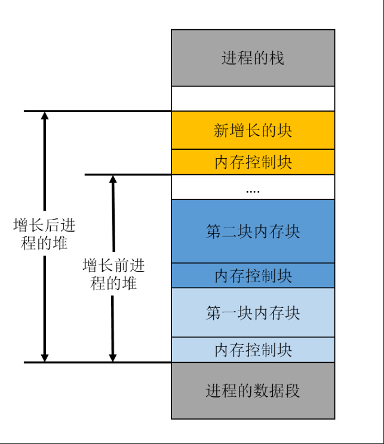
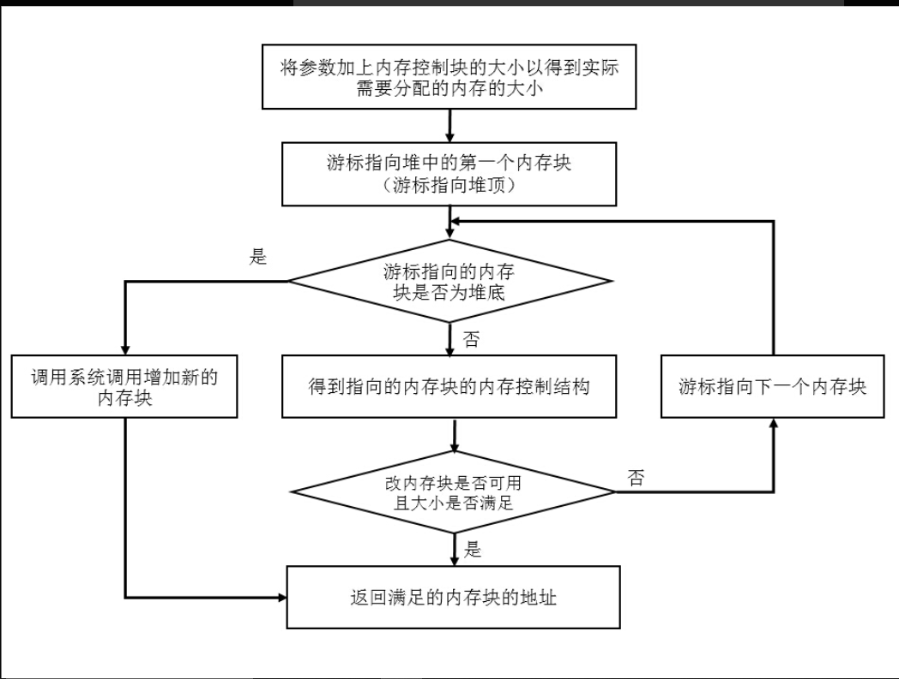
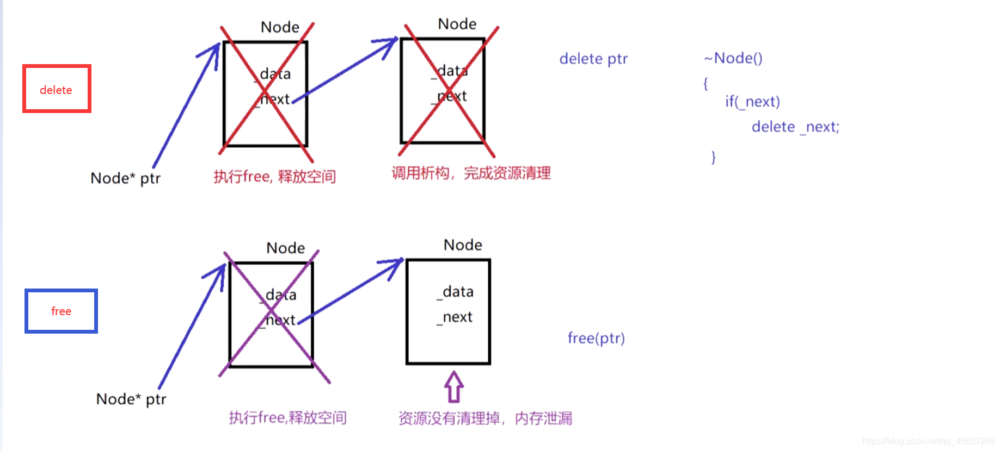

# 1. malloc
malloc 是一个标准库函数，用于在运行时从堆上分配指定大小的内存块。如果分配成功，它会返回一个指向这块内存的指针；如果分配失败，则返回NULL。malloc返回的是void *类型的指针，这意味着它可以被转换为任何数据类型的指针。

malloc：申请的内存是在堆空间。

分配内存调用底层的 sbrk();在xv6就知道这个函数了；而且知道这个分配其实时懒分配的 和 row一样，主要是利用 page fault实现的.我们知道当 malloc 时是在堆上开辟空间的，而一个进程的sz即当前进程的大小 也就是说sz就是其堆地址,当调用 sbrnk(n)时，我们分配的地址就是当前 p->sz,那么分配后的大小就是 p->sz = p->sz + n;此时我们知道修改堆，但是并不分配内存； 
```cpp
uint64
sys_sbrk(void)
{
  int addr;
  int n;

  if(argint(0, &n) < 0)
    return -1;
  addr = myproc()->sz;
  myproc()->sz = myproc()->sz + n;
//   if(growproc(n) < 0)
//     return -1;
  return addr;
}
```
当我要访问这个内存时，会触发 page fault,这个时候就是陷入中断，到 usertrap中，在这里我们进行分配内存。


>在第三章中。`sbrk` 是进程缩小或增加其内存的系统调用。该系统调用由 `growproc` 函数实现（`kernel/proc.c:253`）。`growproc` 根据 `n` 是正数还是负数调用 `uvmalloc` 或 `uvmdealloc`。
>
>`uvmalloc`（`kernel/vm.c:221`）使用 `kalloc` 分配物理内存，并使用 `mappages` 将 PTE 添加到用户页表中。


在malloc中直接调用 sbrk(n)即可； *ptr = sbrk(n);
在申请空间的时候，通常要大于n，因为要保持一些信息，比如说分配的大小和下一位置的指针：meta_data；所以在内存中的形式是：上面是meta_data，下面才是我们想要的data
用链表保存申请过的内存；


每次free的时候，把当前的 ptr加入到空闲链表中即可；当下一次申请分配的时候，直接从链表中拿取使用即可；
因为链表中是维护的可以使用的内存空间，当申请一个新的空间时，就去链表中查找，有两种策略，一种是找到第一个可以使用的，比如说申请 5,此时链表 2 10 20 30，返回node1，而且在这里可以 splic一下，因为 10 是用不完的，把这块内存分成两部分，一部分返回，一部分保留在链表中；另外一种策略是找到最适的大小比如：10 6 10，此时就返回6这个空间；

## 代码实现：
在linux系统下面一个程序的堆的管理是通过内存块进行管理的，也就是将堆分成了很多大小不一的内存块。这些块怎么管理尼，比如怎么查询块的大小，怎么查询块是否正在被程序使用，怎么知道这个块的地址。为了解决内存块的管理所以要设计一个管理内存块的数据结构，详细的数据结构如下：
```cpp
/**内存控制块数据结构，用于管理所有的内存块
* is_available: 标志着该块是否可用。1表示可用，0表示不可用
* size: 该块的大小
**/
struct mem_control_block {
    int is_available;
    int size;
};
```
有了管理内存块的数据结构，那么在内存中堆的组织形式也好理解了，也就是堆是由很多内存块组成的，所以有了如下的示意图：



综合上面的知识，可以很容易想到malloc()实现的大体思路。首先挨个检查堆中的内存是否可用，如果可用那么大小是否能满足需求，要是都满足的话就直接用。当遍历了堆中的所有内存块时，要是没有能满足需求的块时就只能通过系统调用向操作系统申请新的内存，然后将新的内存添加到堆中。思路很简单，malloc()实现流程图如下所示：



```cpp
/**内存控制块数据结构，用于管理所有的内存块
* is_available: 标志着该块是否可用。1表示可用，0表示不可用
* size: 该块的大小
**/
struct mem_control_block {
    int is_available;
    int size;
};

/**在实现malloc时要用到linux下的全局变量
*managed_memory_start：该指针指向进程的堆底，也就是堆中的第一个内存块
*last_valid_address：该指针指向进程的堆顶，也就是堆中最后一个内存块的末地址
**/
void *managed_memory_start;
void *last_valid_address;

/**malloc()功能是动态的分配一块满足参数要求的内存块
*numbytes：该参数表明要申请多大的内存空间
*返回值：函数执行结束后将返回满足参数要求的内存块首地址，要是没有分配成功则返回NULL
**/
void *malloc(size_t numbytes) {
    //游标，指向当前的内存块
    void *current_location;
    //保存当前内存块的内存控制结构
    struct mem_control_block *current_location_mcb;
    //保存满足条件的内存块的地址用于函数返回
    void *memory_location;
    memory_location = NULL;
    //计算内存块的实际大小，也就是函数参数指定的大小+内存控制块的大小
    numbytes = numbytes + sizeof(struct mem_control_block);
    //利用全局变量得到堆中的第一个内存块的地址
    current_location = managed_memory_start;

    //对堆中的内存块进行遍历，找合适的内存块
    while (current_location != last_valid_address) //检查是否遍历到堆顶了
    {
        //取得当前内存块的内存控制结构
        current_location_mcb = (struct mem_control_block*)current_location;
        //判断该块是否可用
        if (current_location_mcb->is_available)
            //检查该块大小是否满足
            if (current_location_mcb->size >= numbytes)
            {
                //满足的块将其标志为不可用
                current_location_mcb->is_available = 0;
                //得到该块的地址，结束遍历
                memory_location = current_location;
                break;
            }
        //取得下一个内存块
        current_location = current_location + current_location_mcb->size;
    }

    //在堆中已有的内存块中没有找到满足条件的内存块时执行下面的函数
    if (!memory_location)
    {
        //向操作系统申请新的内存块
        if (sbrk(numbytes) == -1)
            return NULL;//申请失败，说明系统没有可用内存
        memory_location = last_valid_address;
        last_valid_address = last_valid_address + numbytes;
        current_location_mcb = (struct mem_control_block)memory_location;
        current_location_mcb->is_available = 0;
        current_location_mcb->size = numbytes;
    }
    //到此已经得到所要的内存块，现在要做的是越过内存控制块返回内存块的首地址
    memory_location = memory_location + sizeof(struct mem_control_block);
    return memory_location;
}

/**free()功能是将参数指向的内存块进行释放
*firstbyte：要释放的内存块首地址
*返回值：空
**/
void free(void *firstbyte)
{
    struct mem_control_block *mcb;
    //取得该块的内存控制块的首地址
    mcb = firstbyte - sizeof(struct mem_control_block);
    //将该块标志设为可用
    mcb->is_available = 1;
    return;
}
```

## free两种情况了解吗？哪一种会将内存换给操作系统
1. 应用程序层面的释放
在应用程序或程序代码中，当使用如C语言中的malloc()、calloc()等函数分配了动态内存后，如果不再需要这块内存，可以通过调用free()函数来释放它。这表示告诉程序的运行时环境（例如C语言的堆管理器），这块内存现在可以被其他部分的代码重新使用。但是，这并不一定意味着内存会被立即归还给操作系统；而是说这块内存在程序内部可以再次被分配使用。

2. 操作系统层面的释放：
当一个进程结束或显式地调用了类似mmap()与munmap()这样的系统调用，以映射文件到内存或将之前映射的内存区域解除映射时，这部分内存就会被真正地释放回操作系统。这意味着该内存空间可以被操作系统重新分配给其他进程或用于其他目的。


# new
new 是一个运算符，不仅仅是分配内存，还会调用对象的构造函数来初始化对象。因此，new不仅分配内存，还能确保新创建的对象处于正确的初始状态。

delete 是与new对应的运算符，用于释放由new分配的内存，并且会调用对象的析构函数（如果有）。

自由存储区 是C++中动态分配和释放对象的一个概念，通过new分配的内存区域可以称为自由存储区，通过delete释放归还内存。自由存储区可以是堆、全局/静态存储区等，具体是在哪个区，主要还是要看new的实现以及C++编译器默认new申请的内存是在哪里。但是基本上，很多C++编译器默认使用堆来实现自由存储，运算符new和delete内部默认是使用malloc和free的方式来被实现，说它在堆上也对，说它在自由存储区上也正确。因为在C++中new和delete符号是可以重载的，我们可以重新实现new的实现代码，可以让其分配的内存位置在静态存储区等。而malloc和free是C里的库函数，无法对其进行重载。




**delete和free的区别**在于free只释放对象本身的内存，**而delete还要调用析构函数**。析构函数负责**释放实现该对象的程序员自己觉得需要释放的其它资源**。——这些资源的信息记录在对象本身，所以需要先释放这些资源之后才能释放对象本身的内存。至于new和delete底层是否使用的malloc/free不重要。因为前者跟后者的主要区别在于是否调用构造函数/析构函数，所以使用malloc/free作为底层完全没有问题。

```cpp
#include <iostream>
#include <cstdlib>  // for malloc and free

class MyClass {
public:
    MyClass() {
        std::cout << "Constructor called" << std::endl;
    }

    ~MyClass() {
        std::cout << "Destructor called" << std::endl;
    }

    // 重载 new 操作符
    void* operator new(size_t size) {
        std::cout << "Custom new operator called, allocating " << size << " bytes" << std::endl;
        void *ptr = malloc(size);  // 使用 malloc 分配内存
        if (ptr == nullptr) {
            throw std::bad_alloc();  // 如果分配失败，抛出异常
        }
        return ptr;
    }

    // 重载 delete 操作符
    void operator delete(void* ptr) noexcept {
        std::cout << "Custom delete operator called" << std::endl;
        free(ptr);  // 使用 free 释放内存
    }
};

int main() {
    try {
        MyClass *obj = new MyClass;  // 使用自定义的 new 操作符分配内存
        delete obj;  // 使用自定义的 delete 操作符释放内存
    } catch (const std::bad_alloc& e) {
        std::cerr << "Memory allocation failed: " << e.what() << std::endl;
    }

    return 0;
}
```


# 区别

尽管 new 和 malloc 都能分配内存，但它们在行为上存在以下几个关键区别：

+ 调用构造函数：new 会自动调用对象的构造函数，而 malloc 仅仅分配内存，不会初始化对象。使用 malloc 分配的内存区域是未初始化的，需要手动调用构造函数来初始化。

+ 类型安全：new 返回的是正确类型的指针，而 malloc 返回 void*，因此在 C++ 中需要显式地进行类型转换。

+ 失败处理：当内存分配失败时，new 会抛出 std::bad_alloc 异常，而 malloc 则会返回 NULL。这使得 new 更加符合 C++ 的异常处理机制。


2.1 属性的区别
new/delete：这两个是C++中的关键字，若要使用，需要编译器支持；

malloc/free：这两个是库函数，若要使用则需要引入相应的头文件才可以正常使用。

2.2 使用上的区别
malloc：申请空间需要显式填入申请内存的大小；

new：无需显式填入申请的内存大小，new会根据new的类型分配内存。

实例：

/** malloc/free用例 **/
int*ma = (int*)malloc(4)；
free(ma)；
/** new/delete用例 **/
int*ne =newint(0);
2.3 内存位置的区别
new：此操作符分配的内存空间是在自由存储区；

malloc：申请的内存是在堆空间。

C/C++的内存通常分为：堆、栈、自由存储区、全局/静态存储区、常量存储区。可能除了自由存储区，其他的内存分布大家应该都比较熟悉。

堆 是C语言和操作系统的术语，堆是操作系统所维护的一块特殊内存，它提供了动态分配的功能，当运行程序调用malloc()时就会从中分配，调用free()归还内存。那什么是自由存储区呢？

自由存储区 是C++中动态分配和释放对象的一个概念，通过new分配的内存区域可以称为自由存储区，通过delete释放归还内存。自由存储区可以是堆、全局/静态存储区等，具体是在哪个区，主要还是要看new的实现以及C++编译器默认new申请的内存是在哪里。但是基本上，很多C++编译器默认使用堆来实现自由存储，运算符new和delete内部默认是使用malloc和free的方式来被实现，说它在堆上也对，说它在自由存储区上也正确。因为在C++中new和delete符号是可以重载的，我们可以重新实现new的实现代码，可以让其分配的内存位置在静态存储区等。而malloc和free是C里的库函数，无法对其进行重载。

2.4 返回类型的区别
new操作符内存分配成功时，返回的是对象类型的指针，类型严格与对象匹配，无须进行类型转换，故new是符合类型安全性的操作符。而malloc内存分配成功则是返回void * ，需要通过强制类型转换将void*指针转换成我们需要的类型。所以在C++程序中使用new会比malloc安全可靠。

2.5 分配失败情况的区别
malloc分配内存失败时返回NULL，我们可以通过判断返回值可以得知是否分配成功；

new内存分配失败时，会抛出bac_alloc异常，它不会返回NULL，分配失败时如果不捕捉异常，那么程序就会异常退出，我们可以通过异常捕捉的方式获取该异常。

2.6 定义对象系统调度过程的区别
使用new操作符来分配对象内存时会经历三个步骤：

调用operator new 函数（对于数组是operator new[]）分配一块足够的内存空间（通常底层默认使用malloc实现，除非程序员重载new符号）以便存储特定类型的对象；

编译器运行相应的构造函数以构造对象，并为其传入初值。

对象构造完成后，返回一个指向该对象的指针。

使用delete操作符来释放对象内存时会经历两个步骤：

调用对象的析构函数。

编译器调用operator delete(或operator delete[])函数释放内存空间（通常底层默认使用free实现，除非程序员重载delete符号）。

自己可以通过实例去验证下，此处就不展开例程了。

2.7 扩张内存大小的区别
malloc：使用malloc分配内存后，发现内存不够用，那我们可以通过realloc函数来扩张内存大小，realloc会先判断当前申请的内存后面是否还有足够的内存空间进行扩张，如果有足够的空间，那么就会往后面继续申请空间，并返回原来的地址指针；否则realloc会在另外有足够大小的内存申请一块空间，并将当前内存空间里的内容拷贝到新的内存空间里，最后返回新的地址指针。

new：new没有扩张内存的机制。


## 解释
`new` 和 `malloc` 是两种不同的内存分配方式，它们在 C++ 中有着不同的用途和行为。虽然在某些实现中，`new` 可能会调用 `malloc` 来分配内存，但它们之间存在显著的区别。以下是详细的对比：

### 1. **用途**

- **`malloc`**：
  - **用途**：`malloc` 是 C 语言中的函数，用于在堆上分配指定大小的内存。
  - **返回类型**：返回一个指向分配内存的指针，类型为 `void *`。
  - **用法**：需要显式地指定分配的字节数。
  - **示例**：
    ```c
    int *p = (int *)malloc(sizeof(int) * 10);
    ```

- **`new`**：
  - **用途**：`new` 是 C++ 中的操作符，用于在堆上分配内存并调用构造函数初始化对象。
  - **返回类型**：返回一个指向分配内存的指针，类型为所请求类型的指针。
  - **用法**：直接指定对象的类型，自动计算所需的内存大小。
  - **示例**：
    ```cpp
    int *p = new int[10];
    ```

### 2. **内存分配和初始化**

- **`malloc`**：
  - **内存分配**：仅分配内存，不调用构造函数。
  - **初始化**：分配的内存未初始化，需要手动初始化。
  - **示例**：
    ```c
    int *p = (int *)malloc(sizeof(int) * 10);
    for (int i = 0; i < 10; ++i) {
        p[i] = i;  // 手动初始化
    }
    ```

- **`new`**：
  - **内存分配**：分配内存并调用构造函数初始化对象。
  - **初始化**：自动调用构造函数进行初始化。
  - **示例**：
    ```cpp
    class MyClass {
    public:
        MyClass() { /* 构造函数 */ }
    };

    MyClass *obj = new MyClass;  // 分配内存并调用构造函数
    ```

### 3. **内存释放**

- **`malloc`**：
  - **释放函数**：使用 `free` 释放内存。
  - **示例**：
    ```c
    free(p);
    ```

- **`new`**：
  - **释放操作符**：使用 `delete` 释放内存，并调用析构函数。
  - **示例**：
    ```cpp
    delete obj;  // 释放内存并调用析构函数
    ```

### 4. **错误处理**

- **`malloc`**：
  - **错误处理**：如果分配失败，返回 `NULL`。
  - **示例**：
    ```c
    int *p = (int *)malloc(sizeof(int) * 10);
    if (p == NULL) {
        // 处理错误
    }
    ```

- **`new`**：
  - **错误处理**：如果分配失败，默认抛出 `std::bad_alloc` 异常。
  - **示例**：
    ```cpp
    try {
        int *p = new int[10];
    } catch (const std::bad_alloc& e) {
        // 处理错误
    }
    ```

### 5. **底层实现**

- **`malloc`**：
  - **底层实现**：`malloc` 通常由 C 运行时库提供，直接管理内存分配。
  - **示例**：
    ```c
    void *malloc(size_t size);
    ```

- **`new`**：
  - **底层实现**：在许多 C++ 实现中，`new` 操作符可能会调用 `malloc` 来分配内存，然后调用构造函数进行初始化。
  - **示例**：
    ```cpp
    void *operator new(size_t size) {
        void *ptr = malloc(size);
        if (ptr == NULL) {
            throw std::bad_alloc();
        }
        return ptr;
    }
    ```

### 总结

- **`malloc`**：C 语言函数，仅分配内存，不调用构造函数，返回 `void *` 类型的指针，需要手动初始化和释放。
- **`new`**：C++ 操作符，分配内存并调用构造函数初始化对象，返回具体类型的指针，自动初始化和释放。

虽然 `new` 在底层可能调用 `malloc` 来分配内存，但它提供了更高级的功能，如构造函数的调用和异常处理，更适合 C++ 程序的内存管理。


