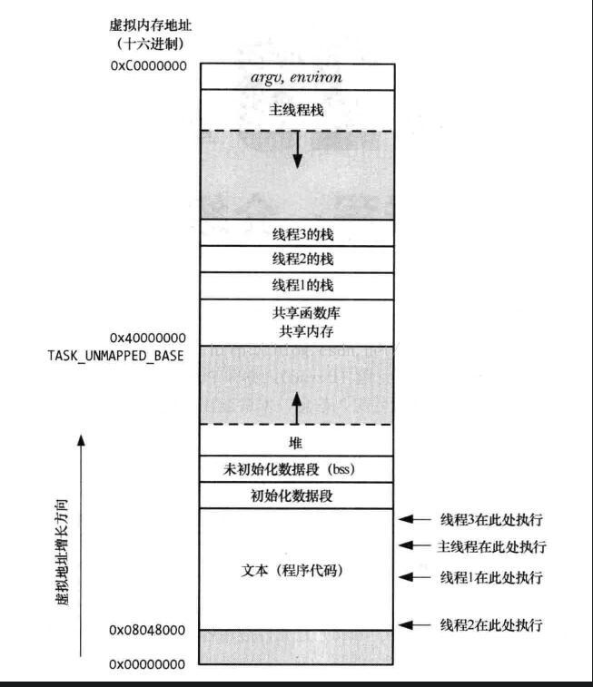

原文链接：https://blog.csdn.net/a987073381/article/details/52029070
# 线程间的通信

线程间的通信有两种情况：

1、一个进程中的线程与另外一个进程中的线程通信，由于两个线程只能访问自己所属进程的地址空间和资源，故等同于进程间的通信。

2、同一个进程中的两个线程进行通信。本文说的就是第二种情况。

线程间通信要简单的多。

因为同一进程的不同线程共享同一份**全局内存区域**，其中包括**初始化数据段、未初始化数据段，以及堆内存段**，所以线程之间可以方便、快速地共享信息。只需要将数据复制到共享（全局或堆）变量中即可。不过，要避免出现多个线程试图同时修改同一份信息。

下图为多线程的进程地址空间：

线程安全：

所在的进程中有多个线程在同时运行，而这些线程可能会同时某一段代码。如果每次运行结果和单线程运行的结果是一样的，而且其他的变量的值也和预期的是一样的，就是线程安全的。线程安全就是说多线程访问同一段代码不会产生不确定的结果。编写线程安全的代码依靠 **线程同步**。

## 线程同步 

锁机制： 互斥锁，条件变量，读写锁，自旋锁

互斥锁确保同一时间只能有一个线程访问共享资源。当锁被占用时试图对其加锁的线程都进入阻塞状态(释放CPU资源使其由运行状态进入等待状态)。当锁释放时哪个等待线程能获得该锁取决于内核的调度。

读写锁当以写模式加锁而处于写状态时任何试图加锁的线程(不论是读或写)都阻塞，当以读状态模式加锁而处于读状态时“读”线程不阻塞，“写”线程阻塞。读模式共享，写模式互斥。

条件变量可以以原子的方式阻塞进程，直到某个特定条件为真为止。对条件的测试是在互斥锁的保护下进行的。条件变量始终与互斥锁一起使用。

自旋锁上锁受阻时线程不阻塞而是在循环中轮询查看能否获得该锁，没有线程的切换因而没有切换开销，不过对CPU的霸占会导致CPU资源的浪费。 所以自旋锁适用于并行结构(多个处理器)或者适用于锁被持有时间短而不希望在线程切换产生开销的情况。

信号量机制(Semaphore)：包括无名线程信号量和命名线程信号量

信号机制(Signal)：类似进程间的信号处理

