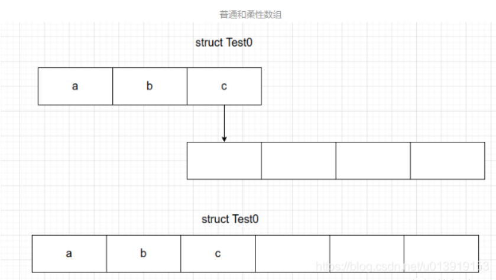

# 灵活数组

目的是在结构体或类的末尾提供一个可变长度的数组，以便于实现动态大小的数据结构

灵活数组成员的概念：
+ 在C语言中，结构体的最后一个成员可以是一个未指定大小的数组，即 类型名 数组名[];。这种数组被称为灵活数组成员。

+ 在C++中，虽然标准并不直接支持这种语法，但许多编译器允许使用 类型名 数组名[1]; 或 类型名 数组名[0]; 来实现类似的效果。


为什么使用灵活数组成员：
+ 节省内存：通过使用灵活数组成员，可以在分配内存时动态地决定数组的实际大小，而不是在编译时固定数组的大小。
+ 简化内存管理：可以将整个结构体（包括数组）作为一个整体进行分配和释放，避免了多次内存分配和释放的开销。

具体应用：
+ 在B+树的内部节点中，array_ 用于存储键值对（KeyValuePair），其中 KeyType 是键的类型，ValueType 是值的类型。
+ array_[1] 实际上只是一个占位符，表示数组的起始位置。实际的数组大小是在内存分配时动态确定的。

```cpp
class BPlusTreeInternalPage : public BPlusTreePage {
 public:
  // 必须在创建新节点后调用初始化方法
  void Init(page_id_t page_id, page_id_t parent_id = INVALID_PAGE_ID, int max_size = INTERNAL_PAGE_SIZE);

 private:
  // 灵活数组成员，用于存储键值对
  MappingType array_[1];
};

// 定义键值对的类型
typedef std::pair<KeyType, ValueType> MappingType;

```

```cpp
// 假设每个键值对占用8字节，最大容量为100个键值对
size_t size = sizeof(BPlusTreeInternalPage) + (100 - 1) * sizeof(MappingType);
BPlusTreeInternalPage *page = (BPlusTreeInternalPage *)malloc(size);

// 初始化页面
page->Init(page_id, parent_id, 100);

// 释放内存
free(page);
```

在这个例子中，array_[1] 实际上指向了分配的内存块中 BPlusTreeInternalPage 结构体之后的部分，这样就可以动态地存储任意数量的键值对。

为什么是 (100 - 1)？
+ sizeof(BPlusTreeInternalPage)：这部分计算结构体本身的固定部分占用的内存。
+ (100 - 1) * sizeof(MappingType)：这部分计算100个键值对占用的内存，但因为 array_[1] 已经占用了一个 MappingType 的空间，所以只需要再分配 (100 - 1) 个 MappingType 的空间。

## 解释

```cpp
#include<stdio.h>
struct Test0
{
    int a;
    int b;
    char *c;
};
struct Test1
{
    int a;
    int b;
    char c[];
};
int main(void)
{
    printf("sizeof(struct Test0) = %zd\n",sizeof(struct Test0));
    printf("sizeof(struct Test1) = %zd\n",sizeof(struct Test1));
    return 0;
}

```

在64位机器上编译运行结果：
16
8

对于Test0的结果是16，通常没有什么疑问，毕竟4（int）+4（int）+8（指针）= 16，但是对于后者的结构体占用空间为8字节，有的读者可能会有疑问。

有什么好处？
> 内存申请和释放

假设分别使用两种类型的结构体，存储16字节的字符数据，需要申请内存。对于struct Test0：
```cpp
strcut Test0 *t0 = malloc(sizeof(struct Test0));//为结构体申请内存
t0->c = malloc(sizeof(char) * 16);//为成员指向的数据申请内存
```

而对于struct Test1：
```cpp
strcut Test1 *t1 = malloc(sizeof(struct Test1) + sizeof(char) * 16);
```

t1->c，和普通成员无异。

要判断它们的地址是否连续也非常简单，只需要分别打印b和c的地址就可以了。

和内存释放类似，前面需要单独释放成员c申请的内存，而后者可以一起释放。

> 数据拷贝

正由于前面的差别，导致数据拷贝时，更有区别。
对于struct Test0：

```cpp
//memcpy(t0copy,t0,sizeof(struct Test0));//不可，这样直接t0copy的c和t0的c指向同一片内存区域。
t0copy.a = t0.a;
t0copy.b = t0.b;
memcpy(t0copy.c,t0.c,sizeof(char)*16);```

这里无法一次拷贝，因为它的成员c是一个指针类型，我们需要的是一份完整拷贝，因此必须拷贝它指向的内存。

但是对于struct Test1：

```cpp
memcpy(t0copy,t0,sizeof(strcut Test1) + sizeof(char) * 16);
```

在这里，由于柔性数组的内存，它的数据内容和结构体数据成员的地址是连续的，因此可以直接拷贝。

> 减少内存碎片

由于结构体的柔性数组和结构体成员的地址是连续的，即可一同申请内存，因此更大程度地避免了内存碎片。另外由于该成员本身不占结构体空间，因此，整体而言，比普通的数组成员占用空间要会稍微小点。



