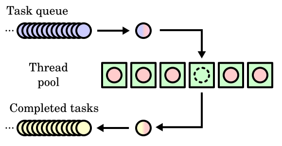

连接： https://github.com/mtrebi/thread-pool/tree/master?tab=readme-ov-file
# 线程池



+ 任务队列。这是存储必须完成的工作的地方。
+ 线程池。这是一组线程（或 worker），它们不断从队列中获取工作并执行工作。
+ 已完成的任务。当 Thread 完成工作时，我们返回 “something” 来通知工作已完成

线程池有三个函数：init(); shutdown(); submit();

## 1. 队列
安全队列
要入队，我们要做的第一件事是锁定互斥锁，以确保没有其他人正在访问资源。然后，我们将元素推送到队列中。当锁超出范围时，它会自动释放。

// SafeQueue.h
```cpp
#pragma once

#include <mutex>
#include <queue>

// Thread safe implementation of a Queue using an std::queue
template <typename T>
class SafeQueue {
private:
  std::queue<T> m_queue;
  std::mutex m_mutex;
public:
  SafeQueue() {

  }

  SafeQueue(SafeQueue& other) {
    //TODO:
  }

  ~SafeQueue() {

  }


  bool empty() {
    std::unique_lock<std::mutex> lock(m_mutex);
    return m_queue.empty();
  }
  
  int size() {
    std::unique_lock<std::mutex> lock(m_mutex);
    return m_queue.size();
  }

  void enqueue(T& t) {
    std::unique_lock<std::mutex> lock(m_mutex);
    m_queue.push(t);
  }
  
  bool dequeue(T& t) {
    std::unique_lock<std::mutex> lock(m_mutex);

    if (m_queue.empty()) {
      return false;
    }
    t = std::move(m_queue.front());
    
    m_queue.pop();
    return true;
  }
};
```

## 2. 提交

线程池最重要的方法是负责向队列中添加工作的方法。我把这个方法称为 submit。理解它的工作原理并不难，但乍一看它的实现似乎很可怕：

+ 接受任何带有任何参数的函数。
+ 立即返回 “something” 以避免阻塞主线程。此返回的对象最终应包含操作的结果。

```cpp
 // Submit a function to be executed asynchronously by the pool
  template<typename F, typename...Args> 
  auto submit(F&& f, Args&&... args) -> std::future<decltype(f(args...))> {
    // Create a function with bounded parameters ready to execute
    std::function<decltype(f(args...))()> func = std::bind(std::forward<F>(f), std::forward<Args>(args)...);
    // Encapsulate it into a shared ptr in order to be able to copy construct / assign 
    auto task_ptr = std::make_shared<std::packaged_task<decltype(f(args...))()>>(func);

    // Wrap packaged task into void function
    std::function<void()> wrapper_func = [task_ptr]() {
      (*task_ptr)(); 
    };

    // Enqueue generic wrapper function
    m_queue.enqueue(wrapper_func);

    // Wake up one thread if its waiting
    m_conditional_lock.notify_one();

    // Return future from promise
    return task_ptr->get_future();
  }
```

### 可变参数模板函数

```cpp
template<typename F, typename...Args>
```

这意味着 next 语句是模板化的。第一个模板参数称为 F （我们的函数），第二个参数是参数包。参数包是一种特殊的模板参数，可以接受零个或多个模板参数。实际上，这是一种在模板中表示可变数量的参数的方法。至少具有一个参数包的模板称为可变参数模板

总而言之，我们告诉编译器，我们的 submit 函数将采用一个 F 类型的泛型参数（我们的函数）和一个参数包 Args（函数 F 的参数）。

### 函数声明

```cpp
auto submit(F&& f, Args&&... args) -> std::future<decltype(f(args...))> {
```

这可能看起来很奇怪，但事实并非如此。实际上，可以使用两种不同的语法来声明函数。以下是最著名的：
```cpp
return-type identifier ( argument-declarations... )
```
但是，我们也可以像这样声明函数：
```cpp
auto identifier ( argument-declarations... ) -> return_type
```
为什么是两种语法？假设您有一个函数，它的返回类型取决于函数的输入参数。使用第一种语法时，无法声明该函数而不会收到编译器错误，因为您将在返回类型中使用尚未声明的变量（因为返回类型声明位于参数类型声明之前）。

使用第二种语法，您可以将函数声明为返回类型 auto，然后使用 -> 您可以根据之前声明的函数的参数来声明返回类型。

函数的返回类型为 std：：future 类型。std：：future 是一种特殊类型，它提供了一种访问异步操作结果的机制，在我们的例子中，是执行特定函数的结果。

最后，std：：future 的模板类型是 decltype（f（args...））。Decltype 是一个特殊的 C++ 关键字，用于检查实体的声明类型或表达式的类型和值类别。在我们的例子中，我们想知道函数 f 的返回类型，因此我们将泛型函数 f 和参数 pack args 的 decltype 给出。

### 函数体

```cpp
std::function<decltype(f(args...))()> func = std::bind(std::forward<F>(f), std::forward<Args>(args)...);
```

+ std::function 是一个函数包装器模板，位于 <functional> 头文件中。它可以存储、复制、调用任何可调用对象，比如普通函数、函数指针、成员函数指针、lambda 表达式等。语法形式为 std::function<返回类型(参数类型列表)> ，这里 decltype(f(args...)) 就是用于推导函数 f 调用后的返回类型，所以 std::function<decltype(f(args...))()> 定义了一个不接受参数，返回类型与 f(args...) 一致的可调用对象包装器，名为 func。

+ std::bind 同样来自 <functional> 头文件，用于绑定函数的参数，产生一个新的可调用对象。它允许你提前固定部分参数，改变函数调用的参数顺序，或者把参数个数较多的函数适配成参数个数较少的函数。给定一个函数 f 以及它的参数 args，std::bind(std::forward<F>(f), std::forward<Args>(args)...) 把函数 f 及其参数打包绑定在一起，生成一个新的临时可调用对象。std::forward 用于保持参数的原始值类别（左值或右值），避免不必要的拷贝或者移动。

这里发生了很多很多事情。首先，std：：bind（F， Args） 是一个函数，它使用给定的 Args 为 F 创建一个包装器。计算此包装器与使用已绑定的 Args 调用 F 相同。在这里，我们简单地使用泛型函数 f 和参数 pack args 调用 bind，但对每个参数使用另一个包装器 std：：forward（t）。需要第二个包装器来实现通用引用的完美转发。 此 bind 调用的结果是 std：：function。std：：function 是封装函数的 C++ 对象。它允许您执行函数，就好像它是一个普通函数一样，它使用所需的参数调用 operator（） 但是，因为它是一个对象，所以您可以存储它、复制它并四处移动它。任何 std：：function 的模板类型都是该函数的签名： std：：function< return-type （arguments）>。在这种情况下，我们已经知道如何使用 decltype 获取此函数的返回类型。但是，这些争论呢？嗯，因为我们把所有参数 args 都绑定到函数 f，所以我们只需要添加一对空括号来表示空的参数列表：decltype（f（args...））（）.

```cpp
// Encapsulate it into a shared ptr in order to be able to copy construct / assign 
auto task_ptr = std::make_shared<std::packaged_task<decltype(f(args...))()>>(func);
```

接下来我们要做的是创建一个 std：:packaged_task（t）。packaged_task 是可以异步执行的函数的包装器。它的结果存储在 std：：future 对象内的共享状态中。std：:p ackaged_task（t） 的模板化类型 T 是正在包装的函数 t 的类型。因为我们之前说过，函数 f 的签名是 decltype（f（args...））（） 的 （） 类型与 packaged_task 相同。然后，我们只需使用初始化函数 std：：make_shared 再次将此打包任务包装在 std：：shared_ptr 中。

```cpp
// Wrap packaged task into void function
std::function<void()> wrapperfunc = [task_ptr]() {
  (*task_ptr)(); 
};

```

同样，我们创建了一个 std：.function，但是，请注意，这次它的模板类型是 void（）。独立于函数 f 及其参数 args this wrapperfunc，返回类型将始终为 void。由于所有函数 f 可能具有不同的返回类型，因此将它们存储在容器（我们的 Queue）中的唯一方法是使用通用的 void 函数包装它们。在这里，我们只声明这个 wrapperfunc 来执行实际的任务 taskptr，该任务将执行绑定函数 func。

```cpp
// Enqueue generic wrapper function
m_queue.enqueue(wrapperfunc);
```

我们将此 wrapperfunc 排队。

```cpp
// Wake up one thread if its waiting
m_conditional_lock.notify_one();
```

在完成之前，我们唤醒一个线程，以防它正在等待。

```cpp
// Return future from promise
return task_ptr->get_future();
```

最后，我们回归 packaged_task 的未来。因为我们返回的是绑定到 taskptr packaged_task future，同时又与函数 func 绑定，所以执行这个 taskptr 将自动更新 future。因为我们用一个通用的包装函数包装了 taskptr 的执行，所以实际上是 wrapperfunc 的执行，它更新了 future。啊啊。由于我们将这个包装函数排入队列，它将在调用 operator（） 出队后由线程执行。

### 线程工作线程

现在我们了解了 submit 方法的工作原理，我们将重点介绍如何完成工作。线程工作程序的最简单实现可能是使用 polling：

```cpp
 Loop
	If Queue is not empty
		Dequeue work
		Do it
```

这看起来还不错，但效率不是很高。您明白为什么吗？如果 Queue 中没有工作，会发生什么情况？线程会一直循环并询问：队列是空的吗？

更明智的实现是通过 “休眠” 线程来完成，直到将一些工作添加到队列中。正如我们之前看到的，一旦我们将 work 加入队列，就会发送一个信号 notify_one（）。这使我们能够实现更高效的算法：

```cpp
Loop
	If Queue is empty
		Wait signal
	Dequeue work
	Do it
```

此信号系统是用 C++ 使用条件变量实现的。条件变量始终绑定到互斥锁，因此我向线程池类添加了一个互斥锁，只是为了管理这一点。worker 的最终代码如下所示：

```cpp
void operator()() {
	std::function<void()> func;
	bool dequeued;
	while (!m_pool->m_shutdown) {
	{
		std::unique_lock<std::mutex> lock(m_pool->m_conditional_mutex);
		if (m_pool->m_queue.empty()) {
			m_pool->m_conditional_lock.wait(lock);
		}
		dequeued = m_pool->m_queue.dequeue(func);
	}
		if (dequeued) {
	  		func();
		}
	}	
}

```

+ 使用 while 循环检查条件：线程被唤醒后，不是直接假设条件已经满足，而是通过 while 循环再次检查 m_pool->m_queue.empty() 这个条件。即便因为某些异常情况（例如虚假唤醒）线程从 wait 状态苏醒，只要队列依旧为空，它会继续等待，直到真正有任务进入队列，满足执行条件。
+ 正确的锁与条件变量配合：std::unique_lock<std::mutex> 与 std::condition_variable 的配合很规范。在调用 wait 之前先获取互斥锁，这避免了在等待期间其他线程对共享资源（队列 m_queue ）的非法访问；当线程被唤醒时，锁会自动重新获取，确保后续对队列 m_queue 的 dequeue 操作是线程安全的。


这里需要注意的是，func 是我们的包装函数，声明为：
```cpp
std::function<void()> wrapperfunc = [task_ptr]() {
  (*task_ptr)(); 
};

```
因此，执行此函数将自动更新 future。


// ThreadPool.h
```cpp
// ThreadPool.h
#pragma once

#include <functional>
#include <future>
#include <mutex>
#include <queue>
#include <thread>
#include <utility>
#include <vector>

#include "SafeQueue.h"

class ThreadPool {
private:
  class ThreadWorker {
  private:
    int m_id;
    ThreadPool * m_pool;
  public:
    ThreadWorker(ThreadPool * pool, const int id)
      : m_pool(pool), m_id(id) {
    }

    void operator()() {
      std::function<void()> func;
      bool dequeued;
      while (!m_pool->m_shutdown) {
        {
          std::unique_lock<std::mutex> lock(m_pool->m_conditional_mutex);
          if (m_pool->m_queue.empty()) {
            m_pool->m_conditional_lock.wait(lock);
          }
          dequeued = m_pool->m_queue.dequeue(func);
        }
        if (dequeued) {
          func();
        }
      }
    }
  };

  bool m_shutdown;
  SafeQueue<std::function<void()>> m_queue;
  std::vector<std::thread> m_threads;
  std::mutex m_conditional_mutex;
  std::condition_variable m_conditional_lock;
public:
  ThreadPool(const int n_threads)
    : m_threads(std::vector<std::thread>(n_threads)), m_shutdown(false) {
  }

  ThreadPool(const ThreadPool &) = delete;
  ThreadPool(ThreadPool &&) = delete;

  ThreadPool & operator=(const ThreadPool &) = delete;
  ThreadPool & operator=(ThreadPool &&) = delete;

  // Inits thread pool
  void init() {
    for (int i = 0; i < m_threads.size(); ++i) {
      m_threads[i] = std::thread(ThreadWorker(this, i));
    }
  }

  // Waits until threads finish their current task and shutdowns the pool
  void shutdown() {
    m_shutdown = true;
    m_conditional_lock.notify_all();
    
    for (int i = 0; i < m_threads.size(); ++i) {
      if(m_threads[i].joinable()) {
        m_threads[i].join();
      }
    }
  }

  // Submit a function to be executed asynchronously by the pool
  template<typename F, typename...Args> 
  auto submit(F&& f, Args&&... args) -> std::future<decltype(f(args...))> {
    // Create a function with bounded parameters ready to execute
    std::function<decltype(f(args...))()> func = std::bind(std::forward<F>(f), std::forward<Args>(args)...);
    // Encapsulate it into a shared ptr in order to be able to copy construct / assign 
    auto task_ptr = std::make_shared<std::packaged_task<decltype(f(args...))()>>(func);

    // Wrap packaged task into void function
    std::function<void()> wrapper_func = [task_ptr]() {
      (*task_ptr)(); 
    };

    // Enqueue generic wrapper function
    m_queue.enqueue(wrapper_func);

    // Wake up one thread if its waiting
    m_conditional_lock.notify_one();

    // Return future from promise
    return task_ptr->get_future();
  }
};
```

## 3. 使用

创建线程池非常简单：
```cpp
// Create pool with 3 threads
ThreadPool pool(3);

// Initialize pool
pool.init();
```

当我们想关闭矿池时，只需调用：
```cpp
// Shutdown the pool, releasing all threads
pool.shutdown()
```

Ff 我们想向矿池发送一些工作，初始化后，我们只需要调用 submit 函数：
```cpp
pool.submit(work);
```


// test
```cpp
#include <iostream>
#include <random>

#include "../include/ThreadPool.h"

std::random_device rd;
std::mt19937 mt(rd());
std::uniform_int_distribution<int> dist(-1000, 1000);
auto rnd = std::bind(dist, mt);


void simulate_hard_computation() {
  std::this_thread::sleep_for(std::chrono::milliseconds(2000 + rnd()));
}

// Simple function that adds multiplies two numbers and prints the result
void multiply(const int a, const int b) {
  simulate_hard_computation();
  const int res = a * b;
  std::cout << a << " * " << b << " = " << res << std::endl;
}

// Same as before but now we have an output parameter
void multiply_output(int & out, const int a, const int b) {
  simulate_hard_computation();
  out = a * b;
  std::cout << a << " * " << b << " = " << out << std::endl;
}

// Same as before but now we have an output parameter
int multiply_return(const int a, const int b) {
  simulate_hard_computation();
  const int res = a * b;
  std::cout << a << " * " << b << " = " << res << std::endl;
  return res;
}


int main(int argc, char *argv[])
{
  // Create pool with 3 threads
  ThreadPool pool(3);

  // Initialize pool
  pool.init();

  // Submit (partial) multiplication table
  for (int i = 1; i < 3; ++i) {
    for (int j = 1; j < 10; ++j) {
      pool.submit(multiply, i, j);
    }
  }

  // Submit function with output parameter passed by ref
  int output_ref;
  auto future1 = pool.submit(multiply_output, std::ref(output_ref), 5, 6);

  // Wait for multiplication output to finish
  future1.get();
  std::cout << "Last operation result is equals to " << output_ref << std::endl;

  // Submit function with return parameter 
  auto future2 = pool.submit(multiply_return, 5, 3);

  // Wait for multiplication output to finish
  int res = future2.get();
  std::cout << "Last operation result is equals to " << res << std::endl;
  
  pool.shutdown();

  return 0;
}
```

