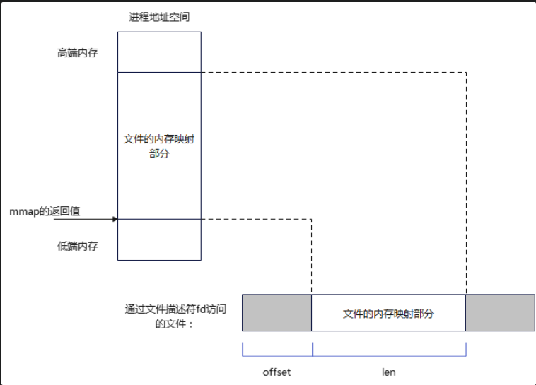

 - xv6 lab 10
## 语法
```cpp
#include <sys/mman.h>

void *mmap(void *addr, size_t length, int prot, int flags,
           int fd, off_t offset);
int munmap(void *addr, size_t length);
```

## 说明

mmap() 用于申请一段内存空间，将一个文件或Posix共享内存区对象映射到进程的地址空间；munmap() 释放由mmap创建的这段内存空间。二者是实现存储映射的关键。

注意：用mmap时，open()不可省，read()/write()可省。

根据内存背后有无实体文件与之关联，映射可以分为两种：
+ 文件映射：内存映射区域有实体文件与之关联。mmap系统调用将普通文件的一部分内容直接映射到进程的虚拟地址空间。一旦完成映射，就可以通过在相应的内存区域中操作字节来访问文件内容。这种映射也称为基于文件的映射。
+ 匿名映射：匿名映射没有对应的文件。这种映射的内存区域会被初始化成0

使用mmap内存映射文件的示意图：



可以看到，调用mmap，会申请一段内存空间（文件的内存映射部分），并且这段内存会自动映射到指定的文件内存映射部分。返回的是这段内存的起始地址，对应文件的内存映射部分offset处。

一个进程映射的内存可以与其他进程中的映射共享物理内存。所谓共享是指各个进程的页表条目指向RAM中的相同分页。

这种进程间的内存映射的共享，通常发生在两种情况；
1）通过fork，子进程继承父进程通过mmap映射的副本；
2）多个进程通过mmap映射同一个文件的同一个区域；

## 这种共享映射有什么用？

我们知道，在Linux中，进程地址空间是相互隔离的，一个进程不能直接操作另一个进程的虚拟地址空间中的内存。而mmap给出2种解决方案：前面的1）和2）。

在1）中，通过fork子进程继承父进程mmap的副本。对于malloc出来的内存，栈变量，父子进程存在写时复制现象，也就是说是两份内存。而对于mmap创建的共享内存，可以做到进程间共享同一个共享映射。

+ 私有映射（MAP_PRIVATE） 映射内容上发生的变更对其他进程不可见，也就是说堆映射内容的改变是私有的。对文件映射，变更不会同步到底层文件。内核用写时复制技术完成这个任务。
+ 共享映射（MAP_SHARED） 在映射内容上发生的所有变更，对所有共享同一个映射的其他进程都可见。对文件映射，变更会同步到底层文件。共享映射用于进程间通信。

内存映射根据有无文件关联，分成文件与匿名；根据映射是否在进程间共享，分成私有和共享。两两组合，有4种情形内存映射：


| 变更可见范围 |	文件 |	匿名 |
| 共享	| 内存映射IO，进程间共享内存 |	进程间共享内存 |
| 私有	| 根据文件内存初始化内存 |	内存分配 |


## 四种映射

1. 共享文件映射

1）打开文件，获取文件描述符fd，通过open完成。
2）将文件描述符作为fd参数，传给mmap。

伪代码：
```cpp
fd = open(...);
addr = mmap(..., MAP_SHARED, fd, ...);
close(fd); /* 可选 */
```
open打开文件时设置的权限（如读写权限O_RDWR/O_RDONLY/O_WRONLY）必须要和mmap系统调用所需权限相匹配。

具体来说，

打开时，必须允许读取，即O_RDONLY和O_RDWR至少指定一个；
mmap调用时，如果prot参数中指定了PROT_WRITE，并且flags中指定了MAP_SHARED，那么打开时，必须指定O_RDWR。
注意：
1）open时，不是所有文件都支持mmap，如管道文件。
2）mmap完成后，关闭fd并不会释放内存映射对应空间，需要专门调用munmap。

如果要将修改同步到底层文件，可以对fd调用fsync或fdatasync。

由于文件是有长度的，所以正常情况下，offset和length参数应该遵循一定限制：offset < 文件长度，且offset + length < 文件长度。而mmap是不检查offset、size定义的区域是否在文件的范围内的。

2. 私有文件映射

调用mmap时，将flags设置为MAP_PRIVATE，映射就是私有映射。常见情况是加载动态共享库，多个进程共享相同的文本段。

为了防止恶意程序篡改内存上的保护信息后再篡改程序或共享库的文本，通常会直接使用私有文件映射而不是共享文件映射。

3. 共享匿名映射
和文件映射相对应的是匿名映射，该映射没有文件与之对应。创建匿名映射2种方法：

+ 调用mmap时，在flags中指定MAP_ANONYMOUS，且将参数fd指定为-1。
+ 打开/dev/zero 设备文件，并将得到的文件描述符fd传递给mmap。
不论哪种方式，得到的内存映射中字节都会被初始化为0。

调用mmap创建匿名映射时，指定了MAP_SHARED就是共享匿名映射。共享匿名映射的作用是让相关（亲缘）进程共享一块内存区域。

示例：父进程创建一个共享匿名映射，然后fork创建子进程。这样父子进程就可以通过这块内存区域通信。

```cpp
addr = mmap(NULL, length, PROT_READ | PROT_WRITE, MAP_SHARED | MAP_ANOUNYMOUS, -1, 0);
if (addr == MAP_SHARED) {
    /* error handle */
}
child_pid = fork();

```
### 4. 私有匿名映射

调用mmap创建匿名映射时，指定了MAP_PRIVATE，那么创建出来的就是私有匿名映射。典型用途是分配进程所需内存。私有匿名映射也没有文件与之关联，对内存操作私有，不影响其他进程。
该用途典型例子是glibc的malloc实现。当要分配的内存 > MMAP_THREASHOLD字节时，glibc的malloc使用mmap来实现。通常，该阈值是128KB，可通过mallopt()调整。

```cpp
char* p = malloc(128*1024);
```
strace跟踪程序执行，可以看到调用mmap系统调用：
```cpp
mmap(NULL, 135168, PROT_READ|PROT_WRITE, MAP_PRIVATE|MAP_ANONYMOUS, -1, 0) = 0x7f2a29f0c000

```

