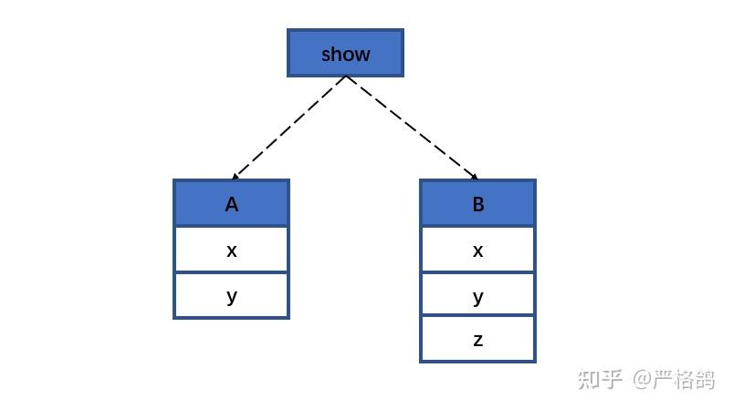
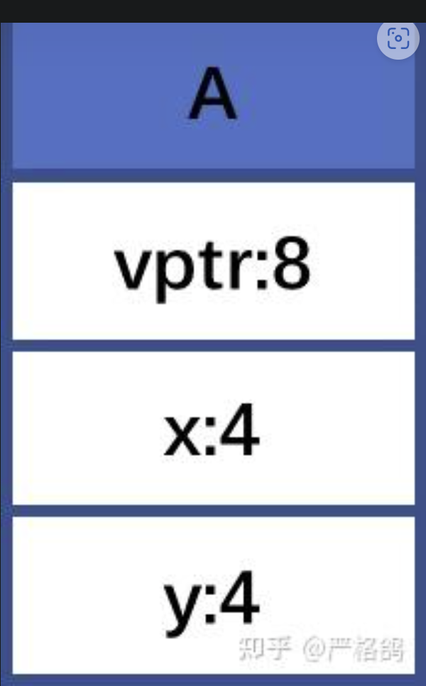
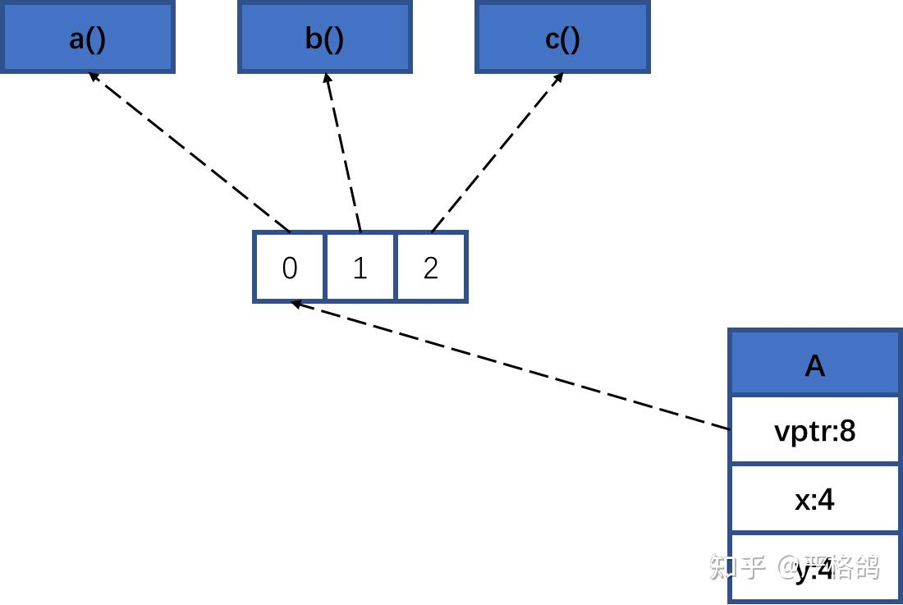
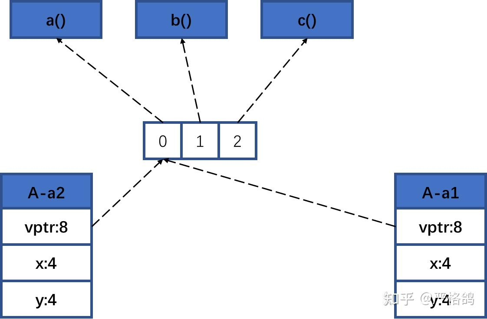
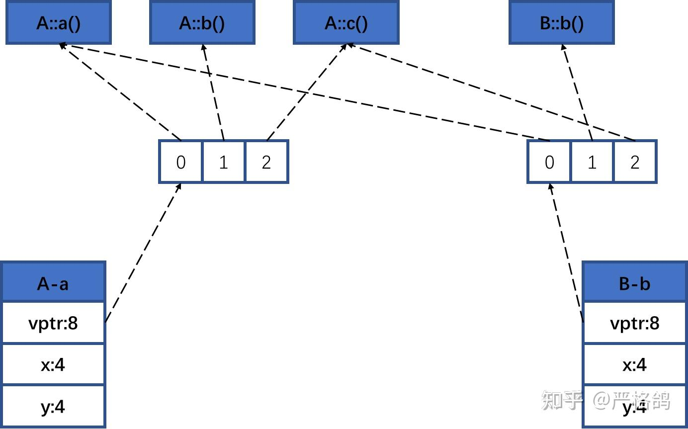
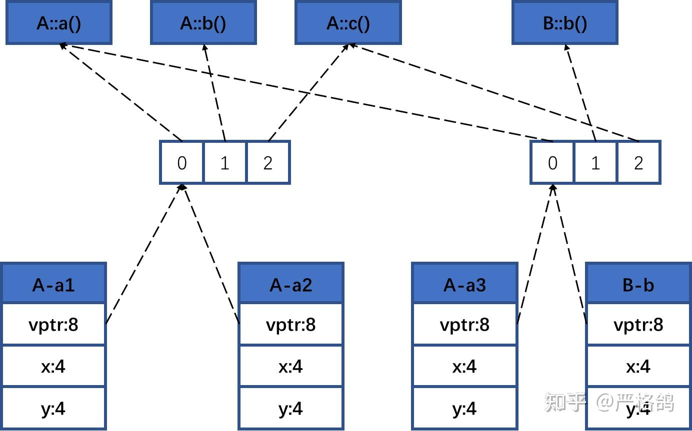
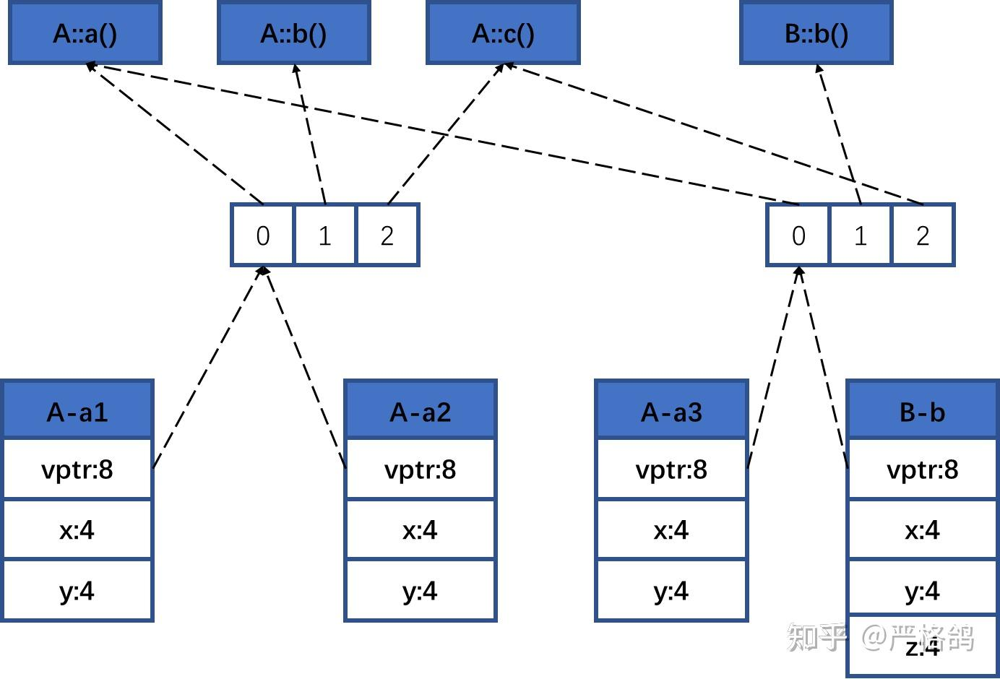

https://zhuanlan.zhihu.com/p/563418849


# 虚函数表位置

```cpp
class A {
public:
    int x;
};

int main() {

    cout << sizeof(A) << endl;
    A a;
    int* p = (int*)&a;
    *p = 23333;
    cout << a.x << endl;
    return 0;
}
```

输出：

>4
>23333

类这个概念，只存在于编译时期。

也就是，我们可以写出修改类中的私有变量的代码（因为，私有这个东西，只在编译时期中存在）

```cpp
class A {
private:
    int x;
public:
    int getx() { return x; }
};

int main() {

    cout << sizeof(A) << endl;
    A a;
    int* p = (int*)&a;
    *p = 114514;
    cout << a.getx() << endl;
    return 0;
}
```

输出：
>4
114514

函数是不占空间的。

写出一个继承
```cpp
class A {
public:
    int x, y;
    void show() { cout << "show" << endl; }
};
class B :public A {
public:
    int z;
};
int main(){
    cout << sizeof(A) << endl;
    cout << sizeof(B) << endl;
    return 0;
}
```

输出

>8
12

内存模型为



两个类共享一个show，这个show不会占用类的空间（放在别的地方了

输出下show的位置

```cpp
printf("%p\n", &A::show);
printf("%p\n", &B::show);
```

输出
```cpp
00007FF75D8A152D
00007FF75D8A152D
```
好我们来看看虚函数吧！如果你不会虚函数的话可以看下c++虚函数的作用是什么？

我们整个带虚函数的类
```cpp
class A {
public:
    virtual void a() { cout << "A a()" << endl; }
    virtual void b() { cout << "A b()" << endl; }
    virtual void c() { cout << "A c()" << endl; }
    int x, y;
};
```
输出下大小发现是16。



开头8的空间放了一个指针。

我们就直接放出内存模型




```cpp
class A {
public:
    virtual void a() { cout << "A a()" << endl; }
    virtual void b() { cout << "A b()" << endl; }
    virtual void c() { cout << "A c()" << endl; }
    int x, y;
};


int main() {
    typedef long long u64;
    typedef void(*func)();

    A a;
    u64* p = (u64*)&a;
    u64* arr = (u64*)*p;

    func fa = (func)arr[0];
    func fb = (func)arr[1];
    func fc = (func)arr[2];
    fa(); fb(); fc();
    return 0;
}
```

输出：
>A a()
A b()
A c()


对于A的实例化，那个指针都是指向同一块



```cpp
A a1, a2;
u64* p = (u64*)&a1;
cout << *p << endl;
p = (u64*)&a2;
cout << *p << endl;
```

输出

>140695023172728
140695023172728

现在我们来个A的派生
```cpp
class B :public A {
public:
    virtual void b() { cout << "B b()" << endl; }
};
```
按照上面的代码跑一下
```cpp
B b;
u64* p = (u64*)&b;
u64* arr = (u64*)*p;
func fa = (func)arr[0];
func fb = (func)arr[1];
func fc = (func)arr[2];
fa(); fb(); fc();
```

输出

>A a()
B b()
A c()

我们来对比下二者的虚函数的指向
```cpp
A a;
u64* pa = (u64*)&a;
u64* arra = (u64*)*pa;
B b;
u64* pb = (u64*)&b;
u64* arrb = (u64*)*pb;
for (int i = 0; i < 3; i++) {
    cout << hex << arra[i] << " " << arrb[i] << endl;
}
```
输出

>7ff6889a159b 7ff6889a159b
7ff6889a1596 7ff6889a15c3
7ff6889a155f 7ff6889a155f

也就是说，内存模型是这样的



这个时候我们看下任何虚函数教程都有的
```cpp
A *a = new B;
```
我们来对比下指向的那个数组
```cpp
A* a1 = new A;
A* a2 = new A;
A* a3 = new B;
B* b = new B;
cout << hex << *(u64*)a1 << endl;
cout << hex << *(u64*)a2 << endl;
cout << hex << *(u64*)a3 << endl;
cout << hex << *(u64*)b << endl;
```

输出

>7ff626e6bc78
7ff626e6bc78
7ff626e6bc18
7ff626e6bc18

内存模型为



如果我们的B，多放些数据
```cpp
class B :public A {
public:
    int z;
    virtual void b() { cout << "B b()" << endl; }
};
```

那内存模型为




