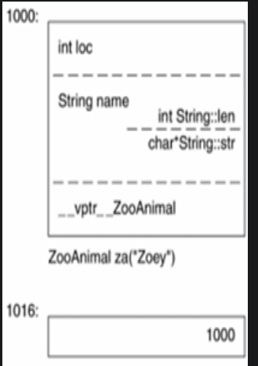
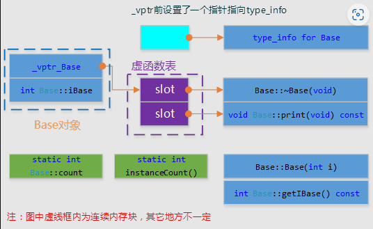

# c++ 对象模型

在C语言中，“数据”和“处理数据的操作（函数）”是分开声明的，也就是说，语言本身并没有支持“数据和函数”之间的关联性。在C++中，通过抽象数据类型（Abstract Data Type，ADT），在类中定义数据和函数，来实现数据和函数直接的绑定。概括来说，

在C++类中有两种数据成员：static，nonstatic；
三种成员函数：static、nonstatic、virtual。


所以影响c++对象大小的三个因素就是： 非静态数据成员，虚函数和字节对齐；

注意：一个指针不管指向哪一种数据类型，指针本身所需的内存大小是固定的。因为指针就是地址；

## 1. 存储位置

普通成员函数
 + 存储位置：普通成员函数并不存储在对象内部，而是作为代码的一部分编译成二进制指令，并且这些函数的代码存在于程序的代码段（text segment）中。每次调用成员函数时，CPU会跳转到相应的代码段执行。
 + 访问方式：通过**对象或指向对象的指针**来调用成员函数，这会导致隐式传递 this 指针给成员函数，使得成员函数可以访问对象的数据成员。

静态成员函数
 + 存储位置：静态成员函数与普通成员函数一样，存储在代码段中。但是，静态成员函数不依赖于任何特定的对象实例，因此它们不能访问非静态成员变量或使用 this 指针。
 + 调用方式：静态成员函数可以通过类名直接调用，也可以通过对象或指向对象的指针调用，但它们不会接收 this 指针。


对象内部：
 + 非静态成员变量
 + 虚函数表指针（如果有虚函数）
全局/静态存储区：
 + 静态成员变量 
代码段：
 + 普通成员函数
 + 静态成员函数


## 2. 基类和派生类转换

如果尝试将一个派生类对象赋值给一个基类的对象（而不是指针或引用），这被称为“**对象切片**”（object slicing）。对象切片是指派生类对象被复制到基类对象时，派生类特有的部分会被截断，只保留基类的部分。因此，在这种情况下，即使基类的函数是虚函数，你也不能调用派生类的版本，因为实际上操作的是一个纯粹的基类对象。

```cpp
class Base {
public:
    virtual void show() {
        std::cout << "Base class" << std::endl;
    }
};

class Derived : public Base {
public:
    void show() override {
        std::cout << "Derived class" << std::endl;
    }
};

int main() {
    Derived d;
    Base b = d; // 对象切片发生在这里
    b.show();   // 调用的是Base::show，不是Derived::show
}
```

假如使用**指针或者引用**，则会正确触发多态：

```cpp
    Derived d;
    Base& b = d; // 对象切片发生在这里
    b.show();   // 调用的是Base::show，不是Derived::show
    Base* ptr = &d;
    ptr->show();
```
输出：
    Derived class
    Derived class

## 3. 指针的类型

指向不同类型的指针有什么不同呢？
比如说：
  + base* a; 
  + int* b;
  + Array<streing>* c;

在内存视角来看，没什么不同，都是一个地址。
指针不同类型之间的差异：即不在其指针表示法不同，也不是其内容不同，而是其寻址出来的对象类型不同。也就是说，指针类型，会教导编译器如果解释某个特定地址中的内存及大小。

+ 一个指向地址1000的int型指针，在32位机器上，将覆盖地址空间 1000-1003
+ 一个string的指针8bytes(一个4字节的字符指针和一个用来表示长度的整数)，覆盖地址将是：1000-1007;

一个类对象的内存:
+ 所有非静态数据成员的大小。
+ 由内存对齐而填补的内存大小。
+ 为了支持virtual有内部产生的额外负担。(只增加虚表指针,虚表在对象之外2)

```cpp
class ZooAnimal {  
public:  
    ZooAnimal();  
    virtual ~ZooAnimal();  
    virtual void rotate();  
protected:  
    int loc;  
    String name;  
};
```

在32位计算机上所占内存为16字节：int四字节，String8字节（一个表示长度的整形，一个指向字符串的指针），以及一个指向虚函数表的指针vptr。对于继承类则为基类的内存大小加上本身数据成员的大小。



### 加上多态

假如让一个基类指针指向一个派生类，这个基类指针不能够使用任何的成员（变量和函数），除了virtual机制；
（如果函数是虚拟函数，则可以使用）

## 结论

> C++在加入封装后(只含有数据成员和普通成员函数)的布局成本增加了多少？

答案是并没有增加布局成本。就像C struct一样，memeber functions虽然含在class的声明之内，却不出现在object中。每一个non-inline member function只会诞生一个函数实体。至于每一个“拥有零个或一个定义的” inline function则会在其每一个使用者(模块)身上产生一个函数实体。

> C++在布局以及存取时间上主要的额外负担是哪来的?

virtual funciton机制，用以支持一个有效率的“执行期绑定”
virtual base class，用以实现“多次出现在继承体系中的base class，有一个单一而被共享的实体”

> 继承关系指定为虚拟继承,意味着什么?

虚拟继承（virtual inheritance）是C++中的一种特性，用于解决多重继承时可能出现的“钻石问题”（Diamond Problem）。在钻石问题中，如果一个派生类从两个基类派生而来，而这两个基类又共同继承自同一个基类，那么派生类将会包含该公共基类的两个独立副本。这可能导致对象布局复杂化，并且在访问公共基类成员时产生歧义。

在虚拟继承的情况下，base class不管在继承链中被派生(derived)多少次，永远只会存在一个实例(称为subobject)。

```cpp
class A {
public:
    virtual ~A() {}
};

class B : virtual public A {}; // Virtual inheritance from A
class C : virtual public A {}; // Virtual inheritance from A

class D : public B, public C {}; // Multiple inheritance from B and C
```

在这个例子中，D 只有一个 A 的实例，而不是两个。这消除了二义性和额外的内存开销。

使用虚拟继承的影响
+ 构造函数初始化列表：当使用虚拟继承时，必须确保正确初始化虚基类。这是因为派生类负责直接或间接地初始化虚基类。例如：
```cpp
class D : public B, public C {
public:
    D(int a) : A(a), B(), C() {} // Directly initializes A
};
```
+ 对象大小增加：为了支持虚拟继承，编译器会在对象中添加额外的信息（如指向虚基类的指针），这会导致对象的大小略微增加。
+ 性能影响：由于引入了额外的间接层来处理虚基类，访问虚基类成员的速度可能会稍微变慢。
+ 初始化顺序：虚基类总是最先被初始化，即使它们出现在继承列表中的后面位置。


> 什么时候应该在c++程序中以struct取代class?

答案之一是当他让人感觉比较好的时候。单独来看，关键词本身并不提供任何差异，c++编译器对二者都提供了相同支持，我们可以认为支持struct只是为了方便将c程序迁移到c++中。

> 那为什么我们要引入class关键词？

这是因为引入的不只是class这个关键词，更多的是它所支持的封装和继承的哲学。

> 怎么在c++中用好struct？

将struct和class组合起来，组合，而非继承，才是把c和c++结合在一起的唯一可行的方法。另外，当你要传递“一个复杂的class object的全部或部分”到某个c函数去时，struct声明可以将数据封装起来，并保证拥有与c兼容的空间布局。

> 转型(cast)其实是一种编译器指令。

大部分情况下它并不改变一个指针所含的真正地址，它只影响“被指出之内存大大小和其内容”的解释方式。
如一个类型为void *的指针只能够持有一个地址，但不能 通过它操作所指object。

> 一个基类指针和其派生类指针有什么不同？（单一一层继承，且其都指向派生类对象）

二者都指向基类对象的第一个byte,其间的差别是，派生类指针涵盖的地址包含整个派生类对象，而一个基类指针所涵盖的地址只包含派生类对象的基类子对象部分。
但基类指针可以通过virtual机制访问派生类对象的函数。
如果基类存在虚函数, 即使派生类被强转为基类, 虚表内依旧保存有原派生的类型,可以通过typeid 获取原派生类类型

## data 布局

### 1. c++对象大小

```CPP
class X {};
class Y :virtual public X {};
class Z :virtual public X {};
class A :public Y, public Z {};


int main() {
    cout << "X:" << sizeof(X) << endl;
    cout << "Y:" << sizeof(Y) << endl;
    cout << "Z:" << sizeof(Z) << endl;
    cout << "A:" << sizeof(A) << endl;
}
```

X:1
Y:8
Z:8
A:16

对于像X这样的一个的空类,插入一个字节。为什么要这样做呢？插入了这一个字节，那么X的每一个对象都将有一个独一无二的地址。如果不插入这一个字节呢？那对X的对象取地址的结果是什么？两个不同的X对象间地址的比较怎么办？

+ 我们再来看Y和Z。首先我们要明白的是实现虚继承，将要带来一些额外的负担——额外需要一个某种形式的指针。到目前为止，对于一个32位的机器来说Y、Z的大小应该为5，而不是8或者4。我们需要再考虑两点因素：内存对齐（alignment—）和编译器的优化。
    + alignment会将数值调整到某数的整数倍，32位计算机上位4bytes。内存对齐可以使得总线的运输量达到最高效率。所以Y、Z的大小被补齐到8就不足为奇了。64位8
    
A的大小是共享的X实体1字节,X和Y的大小分别减去虚基类带来的内存空间，都是4。A的总计大小为9，alignment以后就是12了


## function 布局

三种类型 member function：static,nonstatic,virtual;

### nonstatic function

事实上在c++中非静态成员函数（nostatic member function）与普通函数的调用也确实具有相同的效率，因为本质上非静态成员函数就如同一个普通函数.

+ 编译器内部会将成员函数等价转换为非成员函数，具体是这样做的: 改写成员函数的签名，使得其可以接受一个额外参数，这个额外参数即是this指针, 当然如果成员函数是const的，插入的this 参数类型将为 const xxx 类型。

```cpp
float Point::X();
//成员函数X被插入额外参数this
float Point:: X(Point* this );
```

+ 非静态成员函数X float Point::X();就相当于一个普通函数float X(Point* this);
+ 将每一个对非静态数据成员的操作都改写为经过this操作。
+ 将成员函数写成一个外部函数，对函数名进行“mangling”处理，使之成为独一无二的名称。

将一个成员函数改写成一个外部函数的关键在于两点，
+ 一是给函数提供一个可以直接读写成员数据的通道，给函数提供一个额外的指针参数
+ 二是解决好有可能带来的名字冲突,通过一定的规则将名字转换，使之独一无二。

由此可以做出一点总结：
+ 一个成员函数实际上就是一个被插入了一个接受其类的指针类型的额外参数的非成员函数，还要额外对函数的名称进行处理。额外插入的参数用来访问数据成员，而名称的特殊处理用来避免名字冲突。

### 虚拟成员函数(Virtual Member Functions)

如果function()是一个虚拟函数，
+ 那么用指针或引用进行的调用将发生一点特别的转换 —— 一个中间层被引入进来

```cpp
ptr->function()
// 将转化为
(*ptr->vptr[1])(ptr);
```

+ vptr 表示由编译器产生的指针，指向virtual table。它被安插在每一个“声明有（或继承自）”一个或多个virtual function 的class对象中。
+ 1 是virtual table的索引，关联到 function（）
+ 第二个ptr表示this指针

+ 当通过指针调用的时候，要调用的函数实体无法在编译期决定，必需待到执行期才能获得，所以上面引入一个间接层的转换必不可少。
+ 但是当我们通过**对象**（不是引用，也不是指针）来调用的时候，进行上面的转换就显得多余了，因为在编译器要调用的函数实体已经被决定。此时调用发生的转换，与一个非静态成员函数(Nonstatic Member Functions)调用发生的转换一致。


### 静态成员函数(Static Member Functions)

+ 静态成员函数的一些特性：
    + 不能够直接存取其类中的非静态成员（nostatic members），包括不能调用非静态成员函数(Nonstatic Member Functions)。因为它们没有 this 指针
    + 不能够声明为 const、voliatile或virtual。
    + 它不需经由对象调用，当然，通过对象调用也被允许。

+ 除了缺乏一个this指针他与非静态成员函数没有太大的差别。 在这里通过对象调用和通过指针或引用调用，将被转化为同样的调用代码。
+ 需要注意的是通过一个表达式或函数对静态成员函数进行调用，C++ Standard要求对表达式进行求值。
如：(a+=b).static_fuc();
+ 虽然省去对a+b求值对于static_fuc()的调用并没有影响，但是程序员肯定会认为表达式a+=b已经执行，一旦编译器为了效率省去了这一步，很难说会浪费多少程序员多少时间。这无疑是一个明智的规定。

静态函数可以被继承，但不会被重写（override）。如果派生类定义了同名的静态函数，则会**隐藏**基类中的静态函数，这被称为“名称隐藏”。

### 虚函数(Virtual Member Functions)


## c++对象模型加入单继承

```cpp
#pragma once
#include<iostream>
using namespace std;
class Base
{
public:
    Base(int);
    virtual ~Base(void);
    int getIBase() const;
    static int instanceCount();
    virtual void print() const;
protected:
    int iBase;
    static int count;
};
```



```cpp

```


