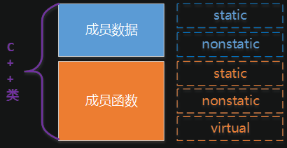
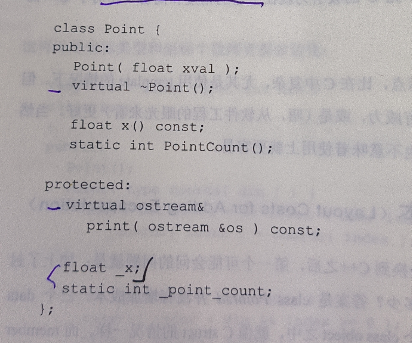
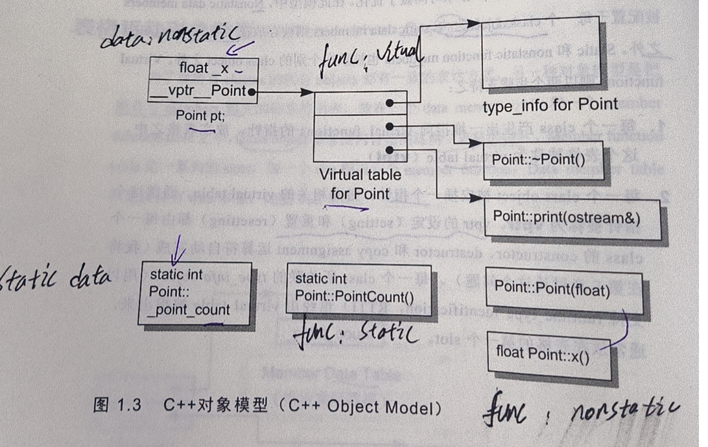

# c++ 对象模型

在C语言中，“数据”和“处理数据的操作（函数）”是分开声明的，也就是说，语言本身并没有支持“数据和函数”之间的关联性。在C++中，通过抽象数据类型（Abstract Data Type，ADT），在类中定义数据和函数，来实现数据和函数直接的绑定。概括来说，在C++类中有两种数据成员：static，nonstatic；三种成员函数：static、nonstatic、virtual。

所以影响c++对象大小的三个因素就是： 非静态数据成员，虚函数和字节对齐；

