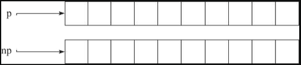
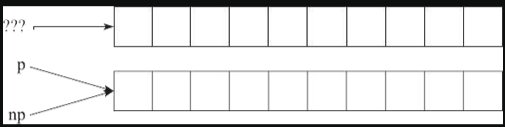
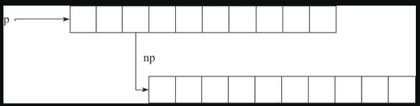

## 什么是内存泄露，如何检查和避免

内存溢出 OOM （out of memory），是指程序在申请内存时，没有足够的内存空间供其使用，出现out of memory；比如申请了一个int,但给它存了long才能存下的数，那就是内存溢出。

内存泄漏：
指堆内存的泄露。堆内存是指程序从堆中分配的，大小任意的（内存块的大小可以在程序运行期间决定）内存块，使用完后必须显示释放内存。应用程序一般使用malloc,new,realloc等函数从堆中分配到块内存，使用完后，程序必须负责相应的调用free或delete释放该内存块，否则，这块内存就不能再次使用，就说这块内存泄漏

### 造成内存泄漏常见的三种情况
1，指针重新赋值
2，错误的内存释放
3，返回值的不正确处理

> 指针重新赋值
```cpp
char * p = (char *)malloc(10);
char * np = (char *)malloc(10);
```


其中，指针变量 p 和 np 分别被分配了 10 个字节的内存。

```cpp
p=np;
```

这时候，指针变量 p 被 np 指针重新赋值，其结果是 p 以前所指向的内存位置变成了孤立的内存。它无法释放，因为没有指向该位置的引用，从而导致 10 字节的内存泄漏。

> 错误的内存释放

假设有一个指针变量 p，它指向一个 10 字节的内存位置。该内存位置的第三个字节又指向某个动态分配的 10 字节的内存位置。


```cpp
free(p);
```

很显然，如果通过调用 free 来释放指针 p，则 np 指针也会因此而变得无效。np 以前所指向的内存位置也无法释放，因为已经没有指向该位置的指针。换句话说，np 所指向的内存位置变为孤立的，从而导致内存泄漏。

因此，每当释放结构化的元素，而该元素又包含指向动态分配的内存位置的指针时，应首先遍历子内存位置（如本示例中的 np），并从那里开始释放，然后再遍历回父节点，如下面的代码所示：

```cpp
free(p->np);
free(p);
```

> 返回值的不正确处理

有时候，某些函数会返回对动态分配的内存的引用，如下面的示例代码所示：
```cpp
char *f(){
	return (char *)malloc(10);
}
void f1(){
	f();
}
```

函数 f1 中对 f 函数的调用并未处理该内存位置的返回地址，其结果将导致 f 函数所分配的 10 个字节的块丢失，并导致内存泄漏

### 避免内存泄漏

+ 确保没有在访问空指针。
+ 每个内存分配函数都应该有一个 free 函数与之对应，alloca 函数除外。
+ 每次分配内存之后都应该及时进行初始化，可以结合 memset 函数进行初始化，calloc 函数除外。
+ 每当向指针写入值时，都要确保对可用字节数和所写入的字节数进行交叉核对。
+ 在对指针赋值前，一定要确保没有内存位置会变为孤立的。
+ 每当释放结构化的元素（而该元素又包含指向动态分配的内存位置的指针）时，都应先遍历子内存位置并从那里开始释放，然后再遍历回父节点。
+ 始终正确处理返回动态分配的内存引用的函数返回值。


避免内存泄漏的几种方式：
+ 计数法：使用new计数加1，delete计数减一，然后判断；
+ 将基类的析构函数声明为虚函数
+ 对象数组的释放一定要用delete[]
+ new和delete 成对出现

检测工具：
linux使用valgrind；


