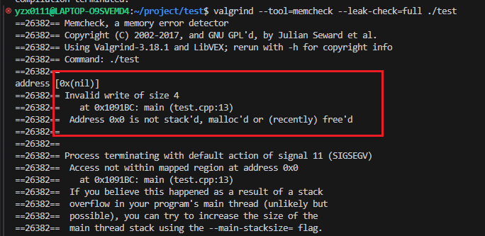

## 什么是内存泄露，如何检查和避免

内存溢出 OOM （out of memory），是指程序在申请内存时，没有足够的内存空间供其使用，出现out of memory；比如申请了一个int,但给它存了long才能存下的数，那就是内存溢出。

原因：
+ 内存泄漏：程序中动态分配的内存空间在使用完毕后没有及时释放，导致内存不断被占用，最终耗尽系统内存。例如，在 C 语言中使用malloc分配内存后，没有使用free释放；
+ 对象过大或过多：程序中创建了大量的大对象，或者对一些对象的引用持有时间过长，使得内存中同时存在的对象数量过多，超过了内存的承载能力。
+ 内存分配策略不合理：某些情况下，程序可能会采用不合理的内存分配策略，导致内存碎片过多，使得可用内存虽然总量足够，但无法分配出连续的大块内存来满足程序的需求。

排查方式：
+ 使用内存分析工具：不同的编程语言和开发环境都有相应的内存分析工具。在 C/C++ 中，可以使用 Valgrind 等工具来检测内存泄漏和内存错误。


内存泄漏：
指堆内存的泄露。堆内存是指程序从堆中分配的，大小任意的（内存块的大小可以在程序运行期间决定）内存块，使用完后必须显示释放内存。应用程序一般使用malloc,new,realloc等函数从堆中分配到块内存，使用完后，程序必须负责相应的调用free或delete释放该内存块，否则，这块内存就不能再次使用，就说这块内存泄漏

### 造成内存泄漏常见的三种情况
1，指针重新赋值
2，错误的内存释放
3，返回值的不正确处理

> 指针重新赋值
```cpp
char * p = (char *)malloc(10);
char * np = (char *)malloc(10);
```


其中，指针变量 p 和 np 分别被分配了 10 个字节的内存。

```cpp
p=np;
```

这时候，指针变量 p 被 np 指针重新赋值，其结果是 p 以前所指向的内存位置变成了孤立的内存。它无法释放，因为没有指向该位置的引用，从而导致 10 字节的内存泄漏。

> 错误的内存释放

假设有一个指针变量 p，它指向一个 10 字节的内存位置。该内存位置的第三个字节又指向某个动态分配的 10 字节的内存位置。


```cpp
free(p);
```

很显然，如果通过调用 free 来释放指针 p，则 np 指针也会因此而变得无效。np 以前所指向的内存位置也无法释放，因为已经没有指向该位置的指针。换句话说，np 所指向的内存位置变为孤立的，从而导致内存泄漏。

因此，每当释放结构化的元素，而该元素又包含指向动态分配的内存位置的指针时，应首先遍历子内存位置（如本示例中的 np），并从那里开始释放，然后再遍历回父节点，如下面的代码所示：

```cpp
free(p->np);
free(p);
```

> 返回值的不正确处理

有时候，某些函数会返回对动态分配的内存的引用，如下面的示例代码所示：
```cpp
char *f(){
	return (char *)malloc(10);
}
void f1(){
	f();
}
```

函数 f1 中对 f 函数的调用并未处理该内存位置的返回地址，其结果将导致 f 函数所分配的 10 个字节的块丢失，并导致内存泄漏

### 避免内存泄漏

+ 确保没有在访问空指针。
+ 每个内存分配函数都应该有一个 free 函数与之对应，alloca 函数除外。
+ 每次分配内存之后都应该及时进行初始化，可以结合 memset 函数进行初始化，calloc 函数除外。
+ 每当向指针写入值时，都要确保对可用字节数和所写入的字节数进行交叉核对。
+ 在对指针赋值前，一定要确保没有内存位置会变为孤立的。
+ 每当释放结构化的元素（而该元素又包含指向动态分配的内存位置的指针）时，都应先遍历子内存位置并从那里开始释放，然后再遍历回父节点。
+ 始终正确处理返回动态分配的内存引用的函数返回值。


避免内存泄漏的几种方式：
+ 计数法：使用new计数加1，delete计数减一，然后判断；
+ 将基类的析构函数声明为虚函数
+ 对象数组的释放一定要用delete[]
+ new和delete 成对出现

检测工具：
linux使用valgrind；


## 怎么检测内存泄漏，怎么实现一个内存泄漏检测工具？

### Windows平台下的内存泄漏检测

1. 检测是否存在内存泄漏问

Windows平台下面Visual Studio 调试器和 C 运行时 (CRT) 库为我们提供了检测和识别内存泄漏的有效方法，原理大致如下：内存分配要通过CRT在运行时实现，只要在分配内存和释放内存时分别做好记录，程序结束时对比分配内存和释放内存的记录就可以确定是不是有内存泄漏。在vs中启用内存检测的方法如下：


### Linux检测内存泄漏

Valgrind工具中的内存检测组件Memcheck， Memcheck支持的功能包括：

+ 使用空指针： 访问没有申请内存的空指针
+ 使用野指针：访问已释放内存的指针
+ 内存空间访问越界
+ 内存空间未释放
+ 内存空间重复释放
+ 内存空间申请和释放不匹配

编译的时候加上 -g;

```bash
valgrind --tool=memcheck --leak-check=full ./your_program [program arguments]
```
+ --leak-check=full：启用详细的内存泄漏检查。
+ ./your_program：你要测试的可执行文件路径。
+ [program arguments]：传递给你的程序的参数（如果有）。


除了基本的内存泄漏检查外，Valgrind 提供了许多有用的选项来调整其行为：

+ --show-leak-kinds=all：显示所有类型的内存泄漏，包括明确、间接和可能的泄漏。
+ --track-origins=yes：尝试跟踪未初始化值的来源，这可以帮助找出哪些变量在使用前没有被正确初始化。
+ --log-file=<file>：指定输出日志文件的位置，例如 --log-file=valgrind_output.txt。
+ --error-exitcode=<number>：如果检测到错误，退出时返回指定的状态码，可用于自动化测试脚本中。
+ --num-callers=<number>：设置回溯栈帧的最大数量，默认是12，增加这个数值可以帮助更准确地定位问题。

1. 检测程序使用空指针



访问空指针，特别是往空指针写数据时，基本会引起段错误（Segmentation fault ），此时系统会产生core dump 文件，通过 core dump文件结合GDB工具也很容易找出访问空指针的地方。

2. 程序使用野指针


注意：Valgrind不检查静态分配数组的使用情况！所以对静态分配的数组，Valgrind表示无能为力！


内存泄漏的原因在于没有成对地使用malloc/free和new/delete


## 不用工具检测内存泄漏

目的是找到这些内存是在哪里分配的，只需要检测出内存是在哪里申请的即可。

整体思路很简单：在申请内存时记录下该内存的地址和在代码中申请内存的位置，在内存销毁时删除该地址对应的记录，程序最后统计下还有哪条记录没有被删除，如果还有没被删除的记录就代表有内存泄漏。


