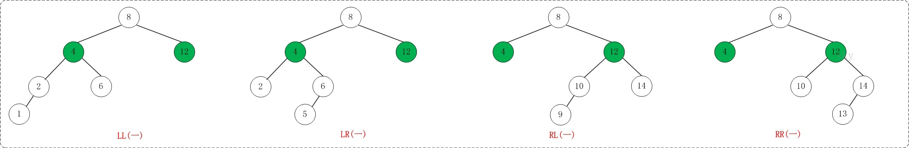
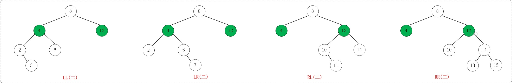
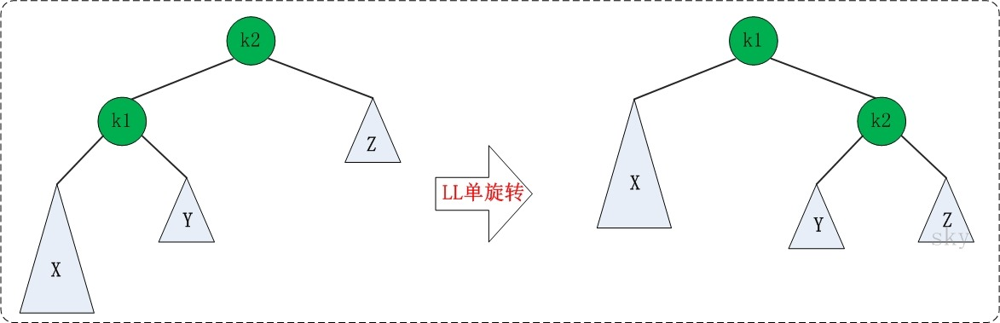
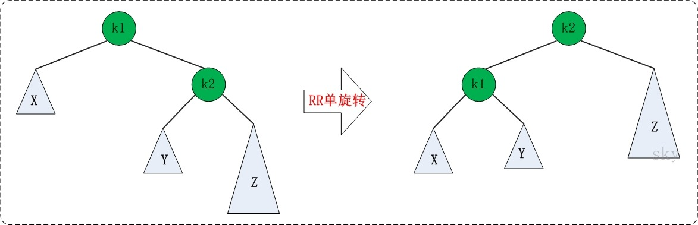
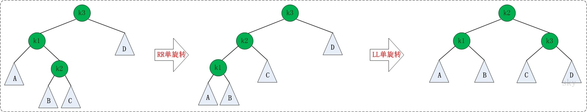
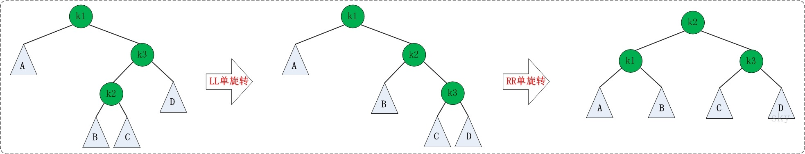

平衡二叉树是一种二叉排序树，其中每一个节点的左子树和右子树的高度差至多等于1；

## 主要是理解旋转：
如果在AVL树中进行插入或删除节点后，可能导致AVL树失去平衡。这种失去平衡的可以概括为4种姿态：LL(左左)，LR(左右)，RR(右右)和RL(右左)。下面给出它们的示意图：



上图中的4棵树都是"失去平衡的AVL树"，从左往右的情况依次是：LL、LR、RL、RR。除了上面的情况之外，还有其它的失去平衡的AVL树，如下图：



(1) LL：LeftLeft，也称为"左左"。插入或删除一个节点后，根节点的左子树的左子树还有非空子节点，导致"根的左子树的高度"比"根的右子树的高度"大2，导致AVL树失去了平衡。
     例如，在上面LL情况中，由于"根节点(8)的左子树(4)的左子树(2)还有非空子节点"，而"根节点(8)的右子树(12)没有子节点"；导致"根节点(8)的左子树(4)高度"比"根节点(8)的右子树(12)"高2。

(2) LR：LeftRight，也称为"左右"。插入或删除一个节点后，根节点的左子树的右子树还有非空子节点，导致"根的左子树的高度"比"根的右子树的高度"大2，导致AVL树失去了平衡。
     例如，在上面LR情况中，由于"根节点(8)的左子树(4)的左子树(6)还有非空子节点"，而"根节点(8)的右子树(12)没有子节点"；导致"根节点(8)的左子树(4)高度"比"根节点(8)的右子树(12)"高2。

(3) RL：RightLeft，称为"右左"。插入或删除一个节点后，根节点的右子树的左子树还有非空子节点，导致"根的右子树的高度"比"根的左子树的高度"大2，导致AVL树失去了平衡。
     例如，在上面RL情况中，由于"根节点(8)的右子树(12)的左子树(10)还有非空子节点"，而"根节点(8)的左子树(4)没有子节点"；导致"根节点(8)的右子树(12)高度"比"根节点(8)的左子树(4)"高2

(4) RR：RightRight，称为"右右"。插入或删除一个节点后，根节点的右子树的右子树还有非空子节点，导致"根的右子树的高度"比"根的左子树的高度"大2，导致AVL树失去了平衡。
     例如，在上面RR情况中，由于"根节点(8)的右子树(12)的右子树(14)还有非空子节点"，而"根节点(8)的左子树(4)没有子节点"；导致"根节点(8)的右子树(12)高度"比"根节点(8)的左子树(4)"高2。

1.  LL的旋转
LL失去平衡的情况，可以通过一次旋转让AVL树恢复平衡。如下图：



图中左边是旋转之前的树，右边是旋转之后的树。从中可以发现，旋转之后的树又变成了AVL树，而且该旋转只需要一次即可完

```cpp
/*
 * LL：左左对应的情况(左单旋转)。
 *
 * 返回值：旋转后的根节点
 */
template <class T>
AVLTreeNode<T>* AVLTree<T>::leftLeftRotation(AVLTreeNode<T>* k2)
{
    AVLTreeNode<T>* k1;

    k1 = k2->left;
    k2->left = k1->right;
    k1->right = k2;

    k2->height = max( height(k2->left), height(k2->right)) + 1;
    k1->height = max( height(k1->left), k2->height) + 1;

    return k1;
}
```

2.  RR的旋转
 


```cpp
/*
 * RR：右右对应的情况(右单旋转)。
 *
 * 返回值：旋转后的根节点
 */
template <class T>
AVLTreeNode<T>* AVLTree<T>::rightRightRotation(AVLTreeNode<T>* k1)
{
    AVLTreeNode<T>* k2;

    k2 = k1->right;
    k1->right = k2->left;
    k2->left = k1;

    k1->height = max( height(k1->left), height(k1->right)) + 1;
    k2->height = max( height(k2->right), k1->height) + 1;

    return k2;
}
```


3. LR的旋转

其实LR先旋转左节点，变成LL，然后再旋转跟节点即可

LR失去平衡的情况，需要经过两次旋转才能让AVL树恢复平衡。如下图：



第一次旋转是围绕"k1"进行的"RR旋转"，第二次是围绕"k3"进行的"LL旋转"。
```cpp
/*
 * LR：左右对应的情况(左双旋转)。
 *
 * 返回值：旋转后的根节点
 */
template <class T>
AVLTreeNode<T>* AVLTree<T>::leftRightRotation(AVLTreeNode<T>* k3)
{
    k3->left = rightRightRotation(k3->left);

    return leftLeftRotation(k3);
}
```

4.  RL的旋转

先旋转右节点变成RR，然后旋转根节点



第一次旋转是围绕"k3"进行的"LL旋转"，第二次是围绕"k1"进行的"RR旋转"。
```cpp
/*
 * RL：右左对应的情况(右双旋转)。
 *
 * 返回值：旋转后的根节点
 */
template <class T>
AVLTreeNode<T>* AVLTree<T>::rightLeftRotation(AVLTreeNode<T>* k1)
{
    k1->right = leftLeftRotation(k1->right);

    return rightRightRotation(k1);
}
```

5.插入 
```cpp
/* 
 * 将结点插入到AVL树中，并返回根节点
 *
 * 参数说明：
 *     tree AVL树的根结点
 *     key 插入的结点的键值
 * 返回值：
 *     根节点
 */
template <class T>
AVLTreeNode<T>* AVLTree<T>::insert(AVLTreeNode<T>* &tree, T key)
{
    if (tree == NULL) 
    {
        // 新建节点
        tree = new AVLTreeNode<T>(key, NULL, NULL);
        if (tree==NULL)
        {
            cout << "ERROR: create avltree node failed!" << endl;
            return NULL;
        }
    }
    else if (key < tree->key) // 应该将key插入到"tree的左子树"的情况
    {
        tree->left = insert(tree->left, key);
        // 插入节点后，若AVL树失去平衡，则进行相应的调节。
        if (height(tree->left) - height(tree->right) == 2)
        {
            if (key < tree->left->key)
                tree = leftLeftRotation(tree);
            else
                tree = leftRightRotation(tree);
        }
    }
    else if (key > tree->key) // 应该将key插入到"tree的右子树"的情况
    {
        tree->right = insert(tree->right, key);
        // 插入节点后，若AVL树失去平衡，则进行相应的调节。
        if (height(tree->right) - height(tree->left) == 2)
        {
            if (key > tree->right->key)
                tree = rightRightRotation(tree);
            else
                tree = rightLeftRotation(tree);
        }
    }
    else //key == tree->key)
    {
        cout << "添加失败：不允许添加相同的节点！" << endl;
    }

    tree->height = max( height(tree->left), height(tree->right)) + 1;

    return tree;
}
```
6. 删除
```cpp
//删除节点，返回根节点
template <class T>
AVLTreeNode<T>* AVLTree<T>::remove(AVLTreeNode<T>*& tree, AVLTreeNode<T>* z)
{
	//跟为空 或者 没有要删除的节点，直接返回nullptr
	if (tree == nullptr || z == nullptr)
		return nullptr;
	if (z->key < tree->key) // 待删节点在左子树
	{
		tree->left = remove(tree->left, z);
	}
	else if (z->key > tree->key) //待删节点在右子树
	{
		tree->right = remove(tree->right, z);
	}
	else //tree是要删除的节点
	{
		//左右孩子都非空
		if ((tree->left != nullptr) && (tree->right != nullptr))
		{
			//如果tree的左子树比右子树高
			//则 1.找出tree的左子树的最大节点
			//   2.将该最大节点的值赋值给tree
			//   3.删除该最大节点
			if (height(tree->left) > height(tree->right))
			{
				AVLTreeNode<T>* max = maximum(tree->left);
				tree->key = max->key;
				tree->left = remove(tree->left, max);
			}
			else
			{
				AVLTreeNode<T>* min = minimum(tree->right);
				tree->key = min->key;
				tree->right = remove(tree->right, min);
			}
		}
		else
		{
			AVLTreeNode<T>* tmp = tree;
			tree = (tree->left != nullptr) ? tree->left : tree->right;
			delete tmp;
		}
	}
	// 更新当前节点的高度
	if (tree) {
		tree->height = max(height(tree->left), height(tree->right)) + 1;
	}
// 调整平衡
	if (tree == nullptr)
		return nullptr;

	int balance = height(tree->left) - height(tree->right);

	if (balance > 1) {
		//进入这个条件，tree->left比不为空
		int leftBalance = height(tree->left->left) - height(tree->left->right);
		if (leftBalance < 0) {
			tree = leftRightRotation(tree);
		}
		else {
			tree = leftLeftRotation(tree);
		}
	}
	else if (balance < -1) {
		//进入这个条件，tree->right比不为空
		int rightBalance = height(tree->right->left) - height(tree->right->right);
		if (rightBalance > 0) {
			tree = rightLeftRotation(tree);
		}
		else {
			tree = rightRightRotation(tree);
		}
	}
	return tree;
}
```

## 总代码
```cpp
#ifndef AVL_HPP
#define AVL_HPP
#include<iostream>
#include<iomanip>
using namespace std;
template<class T>
class AVLTreeNode {
public:
	T key;
	int height;
	AVLTreeNode* left;
	AVLTreeNode* right;
	AVLTreeNode(T value, AVLTreeNode* l, AVLTreeNode* r) :
		key(value), height(0), left(l), right(r) {};
};

template<class T>
class AVLTree {
private:
	AVLTreeNode<T>* mRoot;
public:
	AVLTree();
	~AVLTree();

	//获取树高度
	int height();
	int max(int a, int b);

    // 前序遍历"AVL树"
    void preOrder();
    // 中序遍历"AVL树"
    void inOrder();
    // 后序遍历"AVL树"
    void postOrder();

    // (递归实现)查找"AVL树"中键值为key的节点
    AVLTreeNode<T>*search(T key);
    // (非递归实现)查找"AVL树"中键值为key的节点
    AVLTreeNode<T>*iterativeSearch(T key);

	//查找最小节点，返回最小节点的键值
	T minimum();
	//查找最大节点，返回最大节点的键值
	T maximum();

	// 将结点(key为节点键值)插入到AVL树中
	void insert(T key);

	// 删除结点(key为节点键值)
	void remove(T key);

	//销毁AVL树
	void destroy();

	//打印AVL树
	void print();
private:
	//获取树高度
	int height(AVLTreeNode<T>* tree);

    // 前序遍历"AVL树"
    void preOrder(AVLTreeNode<T>*tree) const;
    // 中序遍历"AVL树"
    void inOrder(AVLTreeNode<T>*tree) const;
    // 后序遍历"AVL树"
    void postOrder(AVLTreeNode<T>*tree) const;

	// (递归实现)查找"AVL树"中键值为key的节点
	AVLTreeNode<T>* search(AVLTreeNode<T>* x, T key) const;
	// (非递归实现)查找"AVL树"中键值为key的节点
	AVLTreeNode<T>* iterativeSearch(AVLTreeNode<T>* x, T key) const;

    // 查找最小结点：返回tree为根结点的AVL树的最小结点。
    AVLTreeNode<T>*minimum(AVLTreeNode<T>*tree);
    // 查找最大结点：返回tree为根结点的AVL树的最大结点。
    AVLTreeNode<T>*maximum(AVLTreeNode<T>*tree);

	// LL：左左对应的情况(左单旋转)。
	AVLTreeNode<T>* leftLeftRotation(AVLTreeNode<T>* k2);

	// RR：右右对应的情况(右单旋转)。
	AVLTreeNode<T>* rightRightRotation(AVLTreeNode<T>* k1);

	// LR：左右对应的情况(左双旋转)。
	AVLTreeNode<T>* leftRightRotation(AVLTreeNode<T>* k3);

	// RL：右左对应的情况(右双旋转)。
	AVLTreeNode<T>* rightLeftRotation(AVLTreeNode<T>* k1);

	// 将结点(z)插入到AVL树(tree)中
	AVLTreeNode<T>* insert(AVLTreeNode<T>*& tree, T key);

	// 删除AVL树(tree)中的结点(z)，并返回被删除的结点
	AVLTreeNode<T>* remove(AVLTreeNode<T>*& tree, AVLTreeNode<T>* z);

	//销毁AVL树
	void destroy(AVLTreeNode<T>*& tree);

	//打印AVL树
	void print(AVLTreeNode<T>* tree, T key, int direction);

};
template<class T>
AVLTree<T>::AVLTree():mRoot(nullptr) {};
template<class T>
AVLTree<T>::~AVLTree()
{
	destroy(mRoot);
}

template<class T>
int AVLTree<T>::height(AVLTreeNode<T>* tree)
{
	if (tree != nullptr)
		return tree->height;
	return 0;
}
template<class T>
int AVLTree<T>::height()
{
	return height(mRoot);
}

//比较两值大小
template<class T>
int AVLTree<T>::max(int a, int b)
{
	return a > b ? a : b;
}

// 前序遍历"AVL树"
template<class T>
void AVLTree<T>::preOrder(AVLTreeNode<T>* tree) const
{
	if (tree != nullptr)
	{
		cout << tree->key << " ";
		preOrder(tree->left);
		preOrder(tree->right);
	}
}
template<class T>
void AVLTree<T>::preOrder()
{
	preOrder(mRoot);
}

// 中序遍历"AVL树"
template<class T>
void AVLTree<T>::inOrder(AVLTreeNode<T>* tree) const
{
	if (tree != nullptr)
	{
		inOrder(tree->left);
		cout << tree->key << " ";
		inOrder(tree->right);
	}
}
template<class T>
void AVLTree<T>::inOrder()
{
	inOrder(mRoot);
}

// 后序遍历"AVL树"
template<class T>
void AVLTree<T>::postOrder(AVLTreeNode<T>* tree) const
{
	if (tree != nullptr)
	{
		postOrder(tree->left);
		postOrder(tree->right);
		cout << tree->key << " ";
	}
}
template<class T>
void AVLTree<T>::postOrder()
{
	postOrder(mRoot);
}

// (递归实现)查找"AVL树"中键值为key的节点
template<class T>
AVLTreeNode<T>* AVLTree<T>::search(AVLTreeNode<T>* x, T key) const
{
	if (x == nullptr || x->key == key)
		return x;
	if (key < x->key)
		return search(x->left, key);
	else
		return search(x->right, key);
}

template<class T>
AVLTreeNode<T>* AVLTree<T>::search(T key)
{
	return search(mRoot, key);
}

// (非递归实现)查找"AVL树"中键值为key的节点
template<class T>
AVLTreeNode<T>* AVLTree<T>::iterativeSearch(AVLTreeNode<T>* x, T key) const
{
	while (x!=nullptr && x->key!=key)
	{
		if (key < x->key)
			x = x->left;
		else
			x = x->right;
	}
	return x;
}
template<class T>
AVLTreeNode<T>* AVLTree<T>::iterativeSearch(T key)
{
	return iterativeSearch(mRoot, key);
}

// 查找最小结点：返回tree为根结点的AVL树的最小结点。
template<class T>
AVLTreeNode<T>* AVLTree<T>::minimum(AVLTreeNode<T>* tree)
{
	if (tree == nullptr)
		return nullptr;
	while (tree->left != nullptr)
		tree = tree->left;
	return tree;
}
template<class T>
T AVLTree<T>::minimum()
{
	AVLTreeNode<T>* p = minimum(mRoot);
	if (p != nullptr)
		return p->key;
	return (T)nullptr;
}

// 查找最大结点：返回tree为根结点的AVL树的最大结点。
template<class T>
AVLTreeNode<T>* AVLTree<T>::maximum(AVLTreeNode<T>* tree)
{
	if (tree == nullptr)
		return nullptr;
	while (tree->right!=nullptr)
		tree = tree->right;
	return tree;
}
template<class T>
T AVLTree<T>::maximum()
{
	AVLTreeNode<T>* p = maximum(mRoot);
	if (p != nullptr)
		return p->key;
	return (T)nullptr;
}

// LL：左左对应的情况(左单旋转)。
//返回根节点
template<class T>
AVLTreeNode<T>* AVLTree<T>::leftLeftRotation(AVLTreeNode<T>* k2)
{
	AVLTreeNode<T>* k1;
	k1 = k2->left;
	k2->left = k1->right;
	k1->right = k2;

	k2->height = max(height(k2->left), height(k2->right)) + 1;
	k1->height = max(height(k1->left), k2->height) + 1;
	return k1;
}

// RR：右右对应的情况(右单旋转)。
template<class T>
AVLTreeNode<T>* AVLTree<T>::rightRightRotation(AVLTreeNode<T>* k1)
{
	AVLTreeNode<T>* k2;

	k2 = k1->right;
	k1->right = k2->left;
	k2->left = k1;

	k1->height = max(height(k1->left), height(k1->right)) + 1;
	k2->height = max(height(k1->right), k1->height) + 1;
	return k2;
}

// LR：左右对应的情况(左双旋转)。
template<class T>
AVLTreeNode<T>* AVLTree<T>::leftRightRotation(AVLTreeNode<T>* k3)
{
	k3->left = rightRightRotation(k3->left);
	return leftLeftRotation(k3);
}

// RL：右左对应的情况(右双旋转)。
template<class T>
AVLTreeNode<T>* AVLTree<T>::rightLeftRotation(AVLTreeNode<T>* k1)
{
	k1->right = leftLeftRotation(k1->right);
	return rightRightRotation(k1);
}

//将节点插入树中，并返回根节点
template<class T>
AVLTreeNode<T>* AVLTree<T>::insert(AVLTreeNode<T>*& tree, T key)
{
	if (tree == nullptr)
	{
		tree = new AVLTreeNode<T>(key, nullptr, nullptr);
		if (tree == nullptr)
		{
			cout << "Error!" << endl;
			return nullptr;
		}
	}
	else if (key < tree->key)
	{
		tree->left = insert(tree->left, key);
		if (height(tree->left) - height(tree->right) == 2)
		{
			if (key < tree->left->key)
				tree = leftLeftRotation(tree);
			else
				tree = leftRightRotation(tree);
		}
	}
	else if (key > tree->key)
	{
		tree->right = insert(tree->right, key);
		if (height(tree->right) - height(tree->left) == 2)
		{
			if (key > tree->right->key)
				tree = rightRightRotation(tree);
			else
				tree = rightLeftRotation(tree);
		}
	}
	else //key==tree->key
	{
		cout << "error:不允许添加相同的节点" << endl;
	}
	tree->height = max(height(tree->left), height(tree->right)) + 1;
	return tree;
}
template<class T>
void AVLTree<T>::insert(T key)
{
	insert(mRoot, key);
}

//删除节点，返回根节点
template <class T>
AVLTreeNode<T>* AVLTree<T>::remove(AVLTreeNode<T>*& tree, AVLTreeNode<T>* z)
{
	//跟为空 或者 没有要删除的节点，直接返回nullptr
	if (tree == nullptr || z == nullptr)
		return nullptr;
	if (z->key < tree->key) // 待删节点在左子树
	{
		tree->left = remove(tree->left, z);
	}
	else if (z->key > tree->key) //待删节点在右子树
	{
		tree->right = remove(tree->right, z);
	}
	else //tree是要删除的节点
	{
		//左右孩子都非空
		if ((tree->left != nullptr) && (tree->right != nullptr))
		{
			//如果tree的左子树比右子树高
			//则 1.找出tree的左子树的最大节点
			//   2.将该最大节点的值赋值给tree
			//   3.删除该最大节点
			if (height(tree->left) > height(tree->right))
			{
				AVLTreeNode<T>* max = maximum(tree->left);
				tree->key = max->key;
				tree->left = remove(tree->left, max);
			}
			else
			{
				AVLTreeNode<T>* min = minimum(tree->right);
				tree->key = min->key;
				tree->right = remove(tree->right, min);
			}
		}
		else
		{
			AVLTreeNode<T>* tmp = tree;
			tree = (tree->left != nullptr) ? tree->left : tree->right;
			delete tmp;
		}
	}
	// 更新当前节点的高度
	if (tree) {
		tree->height = max(height(tree->left), height(tree->right)) + 1;
	}

	if (tree == nullptr)
		return nullptr;

	int balance = height(tree->left) - height(tree->right);

	if (balance > 1) {
		//进入这个条件，tree->left比不为空
		int leftBalance = height(tree->left->left) - height(tree->left->right);
		if (leftBalance < 0) {
			tree = leftRightRotation(tree);
		}
		else {
			tree = leftLeftRotation(tree);
		}
	}
	else if (balance < -1) {
		//进入这个条件，tree->right比不为空
		int rightBalance = height(tree->right->left) - height(tree->right->right);
		if (rightBalance > 0) {
			tree = rightLeftRotation(tree);
		}
		else {
			tree = rightRightRotation(tree);
		}
	}
	return tree;
}
template <class T>
void AVLTree<T>::remove(T key)
{
	AVLTreeNode<T>* z;
	if ((z = search(mRoot, key)) != nullptr)
		mRoot = remove(mRoot, z);
}

//销毁AVL树
template <class T>
void AVLTree<T>::destroy(AVLTreeNode<T>*& tree)
{
	if (tree == nullptr)
		return;
	if (tree->left != nullptr)
		destroy(tree->left);
	else
		destroy(tree->right);
	delete tree;
}
template <class T>
void AVLTree<T>::destroy()
{
	destroy(mRoot);
}


//打印AVL树
template <class T>
void AVLTree<T>::print(AVLTreeNode<T>* tree, T key, int direction)
{
	if (tree != nullptr)
	{
		if(direction==0) //tree 根节点
			cout << setw(2) << tree->key << " is root" << endl;
		else
			cout << setw(2) << tree->key << " is " << setw(2) << key << "'s " << setw(12) << (direction == 1 ? "right child" : "left child") << endl;
		print(tree->left, tree->key, -1);
		print(tree->right, tree->key, 1);
	}
}
template <class T>
void AVLTree<T>::print()
{
	if (mRoot != nullptr)
		print(mRoot, mRoot->key, 0);
}
#endif // !AVL_HPP


```


参考：http://www.cnblogs.com/skywang12345/p/3577360.html