## 一.为什么要有红黑树这种数据结构？
https://www.cnblogs.com/yinbiao/p/10732600.html
  我们知道ALV树是一种严格按照定义来实现的平衡二叉查找树，所以它查找的效率非常稳定，为O(log n),由于其严格按照左右子树高度差不大于1的规则，插入和删除操作中需要大量且复杂的操作来保持ALV树的平衡（左旋和右旋），因此ALV树适用于大量查询，少量插入和删除的场景中

  那么假设现在假设有这样一种场景：大量查询，大量插入和删除，现在使用ALV树就不太合适了，因为ALV树大量的插入和删除会非常耗时间，那么我们是否可以降低ALV树对平衡性的要求从而达到快速的插入和删除呢？

  答案肯定是有的，红黑树这种数据结构就应运而生了（因为ALV树是高度平衡的，所以查找起来肯定比红黑树快，但是红黑树在插入和删除方面的性能就远远不是ALV树所能比的了）

## 二.红黑树的简介

红黑树是一种特殊的二叉查找树，每个结点都要储存位表示结点的颜色，或红或黑

红黑树的查找、插入、删除的时间复杂度最坏为O(log n)。

但它是如何保证一棵n个结点的红黑树的高度始终保持在logn的呢？这就引出了红黑树的5个性质：
  1. 每个结点要么是红的要么是黑的。
  2. 根结点是黑的
  3. 每个叶结点（叶结点即指树尾端NIL指针或NULL结点）都是黑的。  
  4. 如果一个结点是红的，那么它的两个儿子都是黑的。  
  5. 对于任意结点而言，其到叶结点树尾端NIL指针的每条路径都包含相同数目的黑结点。

现在有个问题：红黑树是怎么通过上面5条性质保证任意结点到空的叶子结点的所有路径中，没有一条路径会大于其他路径的两倍的呢？（换句话说就是它是如何确保任何一个结点的左右子树的高度差不会超过二者中较低那个的一倍的呢？）

三.红黑树的基本操作之旋转

1.左旋

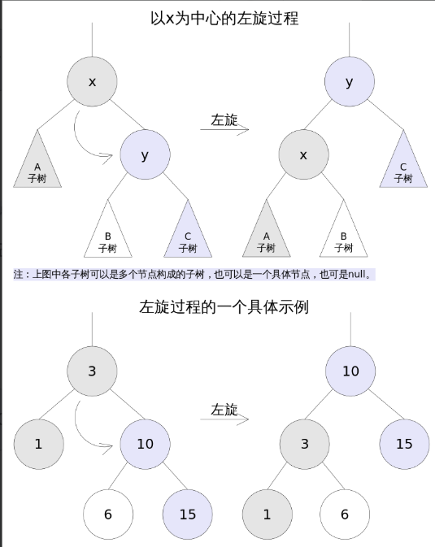

左旋是将X的右子树绕X逆时针旋转，使得X的右子树成为X的父亲，同时修改相关结点的引用，旋转之后，要求二叉查找树的属性依然满足

2.右旋

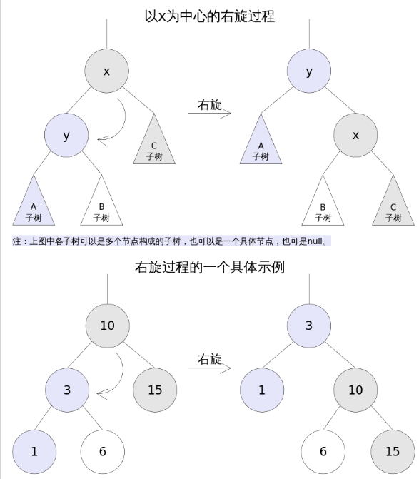

右旋是将X的左子树绕X顺时针旋转，使得X的左子树成为X的父亲，同时注意修改相关结点的引用，旋转之后要求仍然满足搜索树的属性

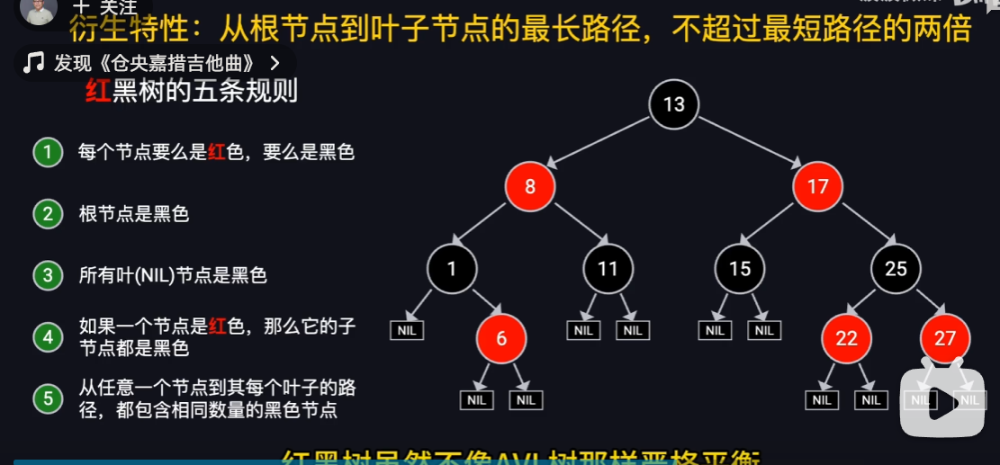

时间复杂度：
查询： O(log N)
插入： O(log N)
删除： O(log N)

旋转：重新着色+旋转；

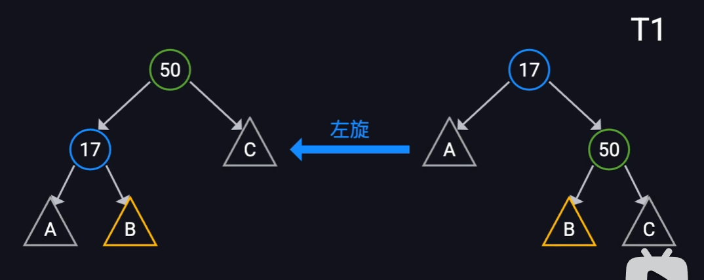

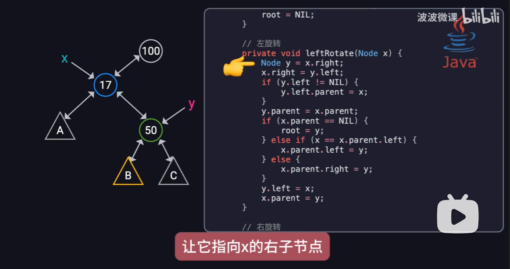

左旋的操作就是：原右子节点上升，原根节点x下降，而原y的左子树B变成x的右子树。

右旋相反；
旋转复杂度 O(1);

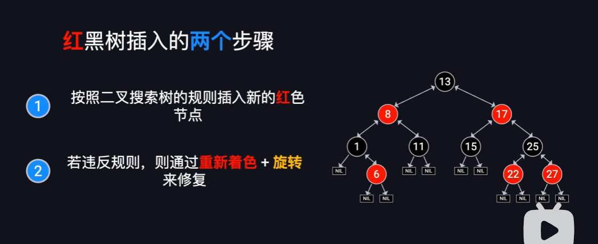

插入节点，最多破坏两条规则：
+ 根节点是黑色的
+ 如果一个节点是红色，那么它的子节点都是黑色的。红红冲突；

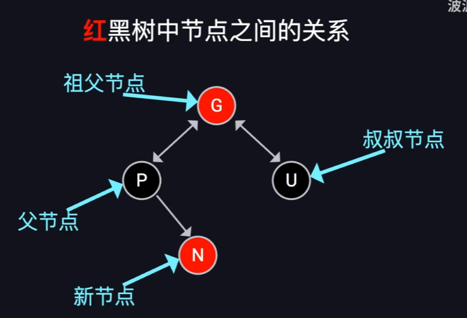

修复红红冲突，即N和P都是红色，先通过U的颜色区分。
1. U为红
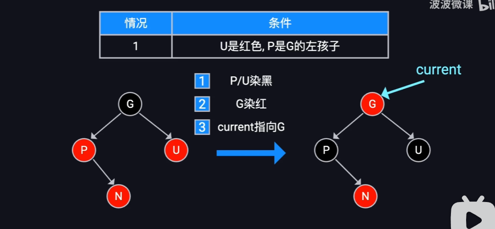

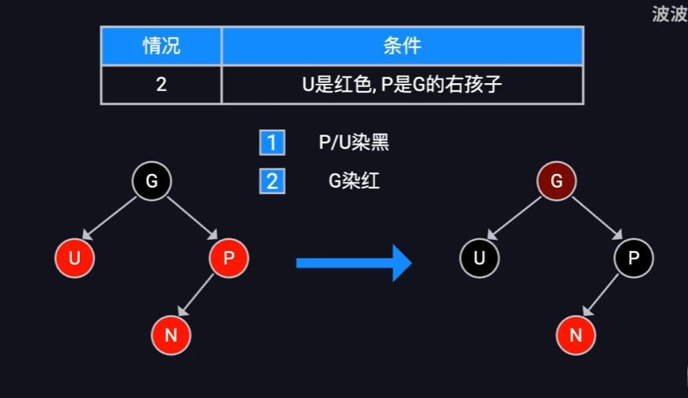

2. U为黑
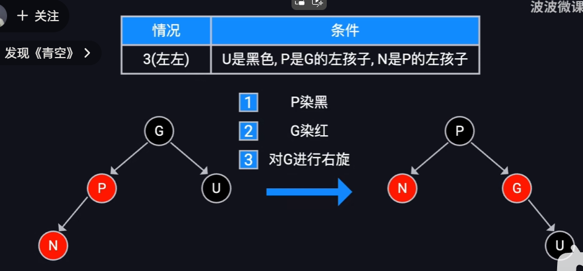

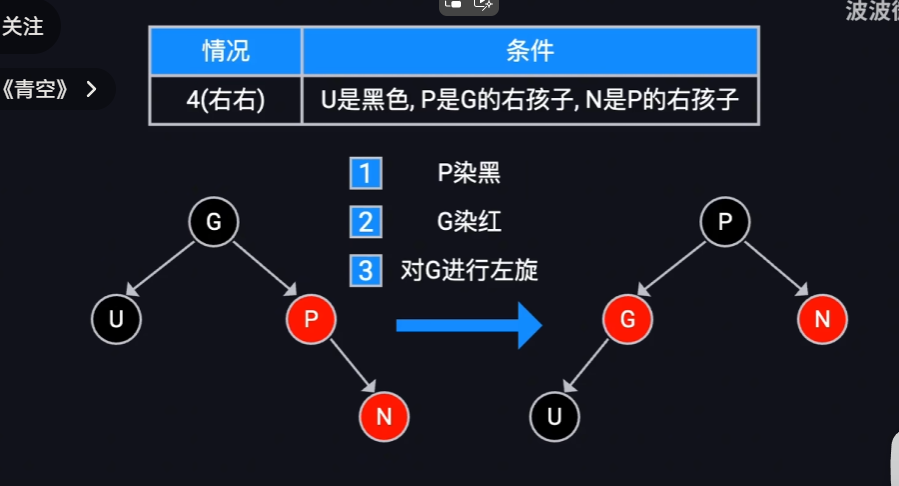

左右 右左
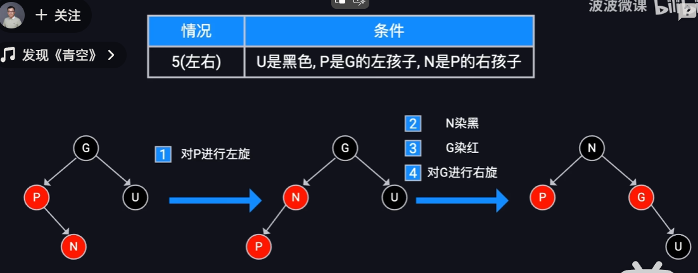

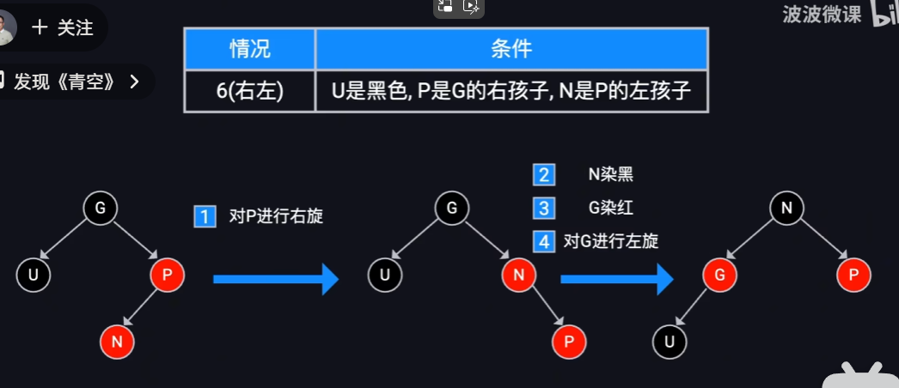

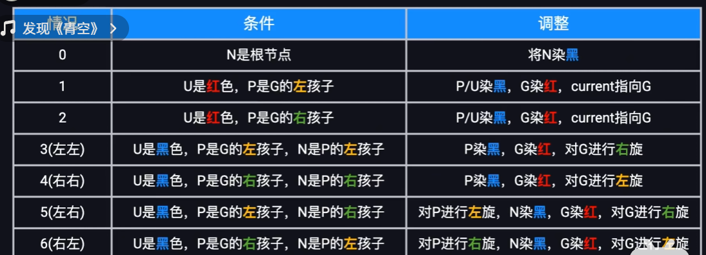

