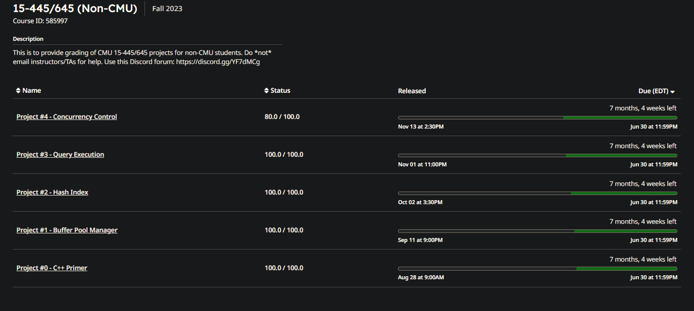

cmu15445已经做到 p4的4.1做完，得到了80分；这里文档写的提示非常好：

>> 此时，你应该已经获得了 80 分。只有在 80 分边界有一个并发测试用例和一个隐藏测试用例。在回来争取 100 分之前，你应该关注生活中的其他重要事情。接下来的 20 分可能会花费与所有先前分数相同的时间，因为有更多的并发测试用例和隐藏测试用例

所以打算先做到这里了，后面有时间再补吧！

做完这些课程，感觉难度：cmu15445 > cs6.081 > cs144 = tinywebserve

因为做webserve时，我先看了高性能服务器编程，几乎已经把所有的组件已经写了一遍，其实就是抄书上的，哈哈哈；所以后面实现起来没有那忙难。

下面的任务就是写简历和复习，重新把题刷起来了。已经一个月没有刷leetcode了，每天写cmu15445没有8h也有7h。虽然很难，但是收获很多，一句话两句话是说不完的，哈哈哈

