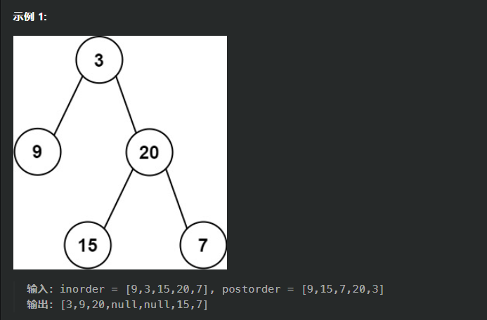

# 由前序和中序遍历得到二叉树
leetcode:105
给定两个整数数组 preorder 和 inorder ，其中 preorder 是二叉树的先序遍历， inorder 是同一棵树的中序遍历，请构造二叉树并返回其根节点。

**注意**：在二叉树中序遍历和前序遍历的情况下，所有节点的值是唯一的。这是一个标准的假设，确保可以唯一确定二叉树结构。因此，在 inorder 数组中不应该有重复的值。

## 递归
前序遍历的第一个节点是根节点，通过这个根节点可以将中序遍历分成左右子树。

步骤
1. 前序遍历的第一个元素是树的根节点。
2. 在中序遍历中找到这个根节点的位置，这样就可以确定左子树和右子树。
3. 根据根节点在中序遍历中的位置，可以确定左子树和右子树的节点数量。
4. 使用递归方法构建左子树和右子树

```cpp
#include <iostream>
#include <vector>
#include <unordered_map>

using namespace std;

struct TreeNode {
    int val;
    TreeNode* left;
    TreeNode* right;
    TreeNode(int x) : val(x), left(NULL), right(NULL) {}
};

class Solution {
public:
    TreeNode* buildTree(vector<int>& preorder, vector<int>& inorder) {
        unordered_map<int, int> inorderIndexMap;
        for (int i = 0; i < inorder.size(); ++i) {
            inorderIndexMap[inorder[i]] = i;
        }
        return buildTreeHelper(preorder, 0, preorder.size() - 1, inorder, 0, inorder.size() - 1, inorderIndexMap);
    }

private:
    TreeNode* buildTreeHelper(vector<int>& preorder, int preStart, int preEnd, 
                              vector<int>& inorder, int inStart, int inEnd, 
                              unordered_map<int, int>& inorderIndexMap) {
        if (preStart > preEnd || inStart > inEnd) {
            return NULL;
        }

        int rootVal = preorder[preStart];
        TreeNode* root = new TreeNode(rootVal);

        int rootIndex = inorderIndexMap[rootVal];
        int leftSubtreeSize = rootIndex - inStart;

        root->left = buildTreeHelper(preorder, preStart + 1, preStart + leftSubtreeSize, 
                                     inorder, inStart, rootIndex - 1, inorderIndexMap);
        root->right = buildTreeHelper(preorder, preStart + leftSubtreeSize + 1, preEnd, 
                                      inorder, rootIndex + 1, inEnd, inorderIndexMap);

        return root;
    }
};

void printInOrder(TreeNode* root) {
    if (root == NULL) return;
    printInOrder(root->left);
    cout << root->val << " ";
    printInOrder(root->right);
}

void printPreOrder(TreeNode* root) {
    if (root == NULL) return;
    cout << root->val << " ";
    printPreOrder(root->left);
    printPreOrder(root->right);
}

int main() {
    Solution sol;

    vector<int> preorder = {3, 9, 20, 15, 7};
    vector<int> inorder = {9, 3, 15, 20, 7};

    TreeNode* root = sol.buildTree(preorder, inorder);

    cout << "Constructed Binary Tree (In-order): ";
    printInOrder(root);
    cout << endl;

    cout << "Constructed Binary Tree (Pre-order): ";
    printPreOrder(root);
    cout << endl;

    // Cleanup the allocated memory (not shown here for brevity)
    return 0;
}

```

## 迭代
对于前序遍历中的任意两个连续节点 u 和 v，根据前序遍历的流程，我们可以知道 u 和 v 只有两种可能的关系：
+ v 是 u 的左儿子。这是因为在遍历到 u 之后，下一个遍历的节点就是 u 的左儿子，即 v
+ u 没有左儿子，并且 v 是 u 的某个祖先节点（或者 u 本身）的右儿子。如果 u 没有左儿子，那么下一个遍历的节点就是 u 的右儿子。如果 u 没有右儿子，我们就会向上回溯，直到遇到第一个有右儿子（且 u 不在它的右儿子的子树中）的节点 u 
a，那么 v 就是 ua的右儿子。

我们用一个栈 stack 来维护「当前节点的所有还没有考虑过右儿子的祖先节点」，栈顶就是当前节点。也就是说，只有在栈中的节点才可能连接一个新的右儿子。同时，我们用一个指针 index 指向中序遍历的某个位置，初始值为 0。index 对应的节点是「当前节点不断往左走达到的最终节点」，这也是符合中序遍历的，它的作用在下面的过程中会有所体现。

所以逻辑如下：
  1. 先向栈中加入根节点，并且初始化指针指向中序遍历数组：
    stack<TreeNode*> stk;
    stk.push(root);
    int inorderIndex = 0;
  2. 遍历前序遍历数组，我们知道前序遍历数组中，两个连续元素只有两种情况；
    首先要记得：栈顶是当前正在处理的根节点；前序：中左右；中序：左右中
    遍历数组：
      假如栈顶元素（根节点）不等于中序数组指向的元素，说明此根节点存在左节点（否则，若不存在左节点，中序和前序相等），而前序遍历是先访问根节点，然后左节点，所以这个遍历元素是根节点的左节点。然后把此节点加入栈中；接着处理这个节点的左子树；

      直到遍历到栈顶元素等于中序数组指向数组，说明此时栈顶元素没有左节点了，（最左边树处理完了），即遍历的元素是某个元素的右节点。
      那么如何找到这个节点呢？
      栈中的节点的顺序和它们在前序遍历中出现的顺序是一致的，而且每一个节点的右儿子都还没有被遍历过，那么这些节点的顺序和它们在中序遍历中出现的顺序一定是相反的。
 
      因此我们可以把 index 不断向右移动，并与栈顶节点进行比较。如果 index 对应的元素恰好等于栈顶节点，那么说明我们在中序遍历中找到了栈顶节点，所以将 index 增加 1 并弹出栈顶节点，直到 index 对应的元素不等于栈顶节点。此时说明中序遍历该访问右节点了，但是之前我们栈中维护的是「当前节点的所有还没有考虑过右儿子的祖先节点」，所以该遍历节点就是前一个弹出节点的右节点；
      把该节点加入栈中，处理这个节点的左子树；

```cpp
class Solution {
public:
    TreeNode* buildTree(vector<int>& preorder, vector<int>& inorder) {
        if (!preorder.size()) {
            return nullptr;
        }
        TreeNode* root = new TreeNode(preorder[0]);
        stack<TreeNode*> stk;
        stk.push(root);
        int inorderIndex = 0;
        for (int i = 1; i < preorder.size(); ++i) {
            int preorderVal = preorder[i];
            TreeNode* node = stk.top();
            if (node->val != inorder[inorderIndex]) {
                node->left = new TreeNode(preorderVal);
                stk.push(node->left);
            }
            else {
                while (!stk.empty() && stk.top()->val == inorder[inorderIndex]) {
                    node = stk.top();
                    stk.pop();
                    ++inorderIndex;
                }
                node->right = new TreeNode(preorderVal);
                stk.push(node->right);
            }
        }
        return root;
    }
};

作者：力扣官方题解
链接：https://leetcode.cn/problems/construct-binary-tree-from-preorder-and-inorder-traversal/solutions/255811/cong-qian-xu-yu-zhong-xu-bian-li-xu-lie-gou-zao-9/
来源：力扣（LeetCode）
著作权归作者所有。商业转载请联系作者获得授权，非商业转载请注明出处。
```


# 由中序和后序得到二叉树结构
leetcode:106
## 递归
其实不管是由前序和中序遍历得到二叉树还是由中序和后序得到二叉树结构，都是利用先得的根节点，然后由中序遍历数组得到左子树节点个数和右子树节点个数，然后递归即可；



上面这个实例：
我们知道：
  中序遍历：左中右
  后序遍历：左右中
所以后序遍历的最后一个节点必是根节点，然后在中序遍历数组中找到这个节点，那么中序遍历数组中的前半部分就是左子树，后半部分就是右子树；
然后递归即可；

```cpp
/**
 * Definition for a binary tree node.
 * struct TreeNode {
 *     int val;
 *     TreeNode *left;
 *     TreeNode *right;
 *     TreeNode() : val(0), left(nullptr), right(nullptr) {}
 *     TreeNode(int x) : val(x), left(nullptr), right(nullptr) {}
 *     TreeNode(int x, TreeNode *left, TreeNode *right) : val(x), left(left), right(right) {}
 * };
 */
class Solution {
    TreeNode* buildTreeHelper(vector<int>& inorder, int inStart,int inEnd,
                                vector<int>& postorder, int postStart,int postEnd,
                                unordered_map<int,int>& inorderIndexMap)
    {
        if(inStart>inEnd || postStart>postEnd)
            return nullptr;
        int rootVal=postorder[postEnd];
        TreeNode* root = new TreeNode(rootVal);

        int rootIndex = inorderIndexMap[rootVal];
        int leftSubtreeSize = rootIndex - inStart; 

        root->left = buildTreeHelper(inorder,inStart,rootIndex-1,
                                    postorder,postStart,postStart+leftSubtreeSize-1,inorderIndexMap);
        root->right = buildTreeHelper(inorder,rootIndex+1,inEnd,
                                    postorder,postStart+leftSubtreeSize,postEnd-1,inorderIndexMap);
        return root;

    }
public:
    TreeNode* buildTree(vector<int>& inorder, vector<int>& postorder) {
        unordered_map<int,int>inorderIndexMap;
        int len1=inorder.size();
        int len2=postorder.size();
        for(int i=0;i<len1;++i)
            inorderIndexMap[inorder[i]]=i;
        return buildTreeHelper(inorder,0,len1-1,postorder,0,len2-1,inorderIndexMap);
    }
};
```

## **迭代法**

迭代法的实现基于以下两点：
+ 如果将中序遍历反序，则得到反向的中序遍历，即每次遍历右孩子，再遍历根节点，最后遍历左孩子。
+ 如果将后序遍历反序，则得到反向的前序遍历，即每次遍历根节点，再遍历右孩子，最后遍历左孩子。

这样从后向前遍历，接相当于中序为：右中左；后序为中右左；就和前面的类似了；

对于后序遍历中的任意两个连续节点u和v（在后序遍历中，u在v的前面），根据后序遍历的流程，我们可以知道u和v只有两种可能的关系：
  + u是v的右儿子。这是因为在遍历到u之后，下一个遍历的节点就是u的双亲节点，即v；
  + v没有右儿子，并且u是v的某个祖先节点（或者v本身）的左儿子。如果v没有右儿子，那么上一个遍历的节点就是v的左儿子。如果v没有左儿子，则从v开始向上遍历v的祖先节点，直到遇到一个有左儿子（且v不在它的左儿子的子树中）的节点va，那么u就是va的左儿子。

我们用一个栈 stack 来维护「当前节点的所有还没有考虑过左儿子的祖先节点」，栈顶就是当前节点。也就是说，只有在栈中的节点才可能连接一个新的左儿子。同时，我们用一个指针 index 指向中序遍历的某个位置，初始值为 n - 1，其中 n 为数组的长度。index 对应的节点是「当前节点不断往右走达到的最终节点」，这也是符合反向中序遍历的，它的作用在下面的过程中会有所体现。

栈用于保存当前正在处理的节点。当遍历到一个节点时，将其压入栈中，这样可以在处理完子树后返回到这个节点。
栈顶节点表示当前正在处理的节点的根节点

如果栈顶节点的值不等于当前中序遍历的值，说明还没有到达当前子树的根节点，需要继续处理右子树。因为在后序遍历中，右子树的节点在左子树的节点之后。
如果栈顶节点的值等于当前中序遍历的值，说明已经到达当前子树的根节点，需要弹出栈顶节点，并处理左子树。

逻辑如下：
   1. 先向栈中加入根节点，并且初始化指针指向中序遍历数组：
     auto root = new TreeNode(postorder[postorder.size() - 1]);
     auto s = stack<TreeNode*>();
     s.push(root);
     int inorderIndex = inorder.size() - 1;
     从后向前遍历，这样的话：中序为：右中左；后序为中右左
   2.  遍历后序数组，我们知道后序遍历数组中，两个连续元素只有两种情况；；
    假如:当前根节点（栈顶元素）不等于中序指向元素，说明遍历元素为此根节点的右节点（否则，若是根节点的左节点，那么中序遍历最后一个元素一定是此根节点，相等），把此遍历节点假如栈中，处理右子树；

    直到根节点和中序指向元素相等，说明此根节点没有右节点了（最右边树处理完了），则遍历节点一定是某个节点的左节点，下面介绍找到这个位置，怎么找到这个位置呢？
    栈中的节点的顺序和它们在反向前序遍历中出现的顺序是一致的，而且每一个节点的左儿子都还没有被遍历过，那么这些节点的顺序和它们在反向中序遍历中出现的顺序一定是相反的。
    因此我们可以把 index 不断向左移动，并与栈顶节点进行比较。如果 index 对应的元素恰好等于栈顶节点，那么说明我们在反向中序遍历中找到了栈顶节点，所以将 index 减少 1 并弹出栈顶节点，直到 index 对应的元素不等于栈顶节点。
    按照这样的过程，我们弹出的最后一个节点 x 就是 遍历节点 的双亲节点，这是因为 遍历节点 出现在了 x 与 x 在栈中的下一个节点的反向中序遍历之间，因此 5 就是 x 的左儿子。
    然后向栈中加入此节点，处理此节点的右子树；

```cpp
class Solution {
public:
    TreeNode* buildTree(vector<int>& inorder, vector<int>& postorder) {
        if (postorder.size() == 0) {
            return nullptr;
        }
        auto root = new TreeNode(postorder[postorder.size() - 1]);
        auto s = stack<TreeNode*>();
        s.push(root);
        int inorderIndex = inorder.size() - 1;
        for (int i = int(postorder.size()) - 2; i >= 0; i--) {
            int postorderVal = postorder[i];
            auto node = s.top();
            if (node->val != inorder[inorderIndex]) {
                node->right = new TreeNode(postorderVal);
                s.push(node->right);
            } else {
                while (!s.empty() && s.top()->val == inorder[inorderIndex]) {
                    node = s.top();
                    s.pop();
                    inorderIndex--;
                }
                node->left = new TreeNode(postorderVal);
                s.push(node->left);
            }
        }
        return root;
    }
};

作者：力扣官方题解
链接：https://leetcode.cn/problems/construct-binary-tree-from-inorder-and-postorder-traversal/solutions/426738/cong-zhong-xu-yu-hou-xu-bian-li-xu-lie-gou-zao-14/
来源：力扣（LeetCode）
著作权归作者所有。商业转载请联系作者获得授权，非商业转载请注明出处。

```

# 总结

## 递归
其实不管是由前序和中序遍历得到二叉树还是由中序和后序得到二叉树结构，都是利用先得的根节点，然后由中序遍历数组得到左子树节点个数和右子树节点个数，然后递归即可；

前序由左到右是根节点，后序遍历由右到左是根节点，找到根节点后然后再中序遍历数组找到这个节点，为了快速找到，直接把数组映射到哈希表中，然后该节点的前面就是左子树，后面就是右子树，递归即可；

# 迭代法
可以发现由中序和后序得到二叉树其实和由前序和中序得到二叉树是一样的：
因为，再处理中序和后序得到二叉树时，我们从右向左访问，这就使得：
后序：左右中 -> 中右左
中序：左中右 -> 右中左
然后方法就和前序和中序得到二叉树是一样了：
前序: 中左右
中序：左中右

处理方法：
比如前序和中序得到二叉树
 + 如果遍历节点不等于中序数组的值，则此节点为遍历节点的左节点，然后压入栈
 + 如果遍历节点等于中序数组的值，说明此节点为某个节点的右节点，访问栈（其实就是倒叙前序遍历，即左中）如果相等，则说明此节点不在之前节点的右节点中；如果不相等，那么此节点接在前一个节点的右节点，然后再压入该节点，因为该节点的右节点还没访问。


