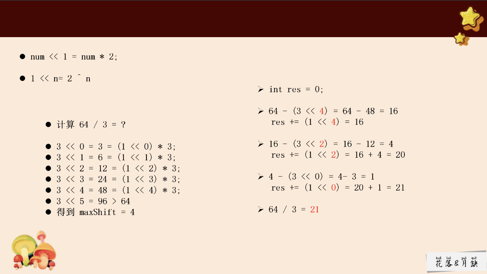

## 加法

原理：  a + b = 无进位加法 + 进位加法 = a^b + (a&b) << 1

```cpp
int add(int a, int b) {
   while (b != 0) {
        int no_c = a ^ b; // 无进位加法
        int c = (unsigned int)(a & b) << 1; // 进位加法，防止越界
        a = no_c;
        b = c;
    }
    return a;
}

```

### 解释：
 
不考虑进位情况下，位的异或运算跟求'和'的结果一致：

异或 1^1=0 1^0=1 0^0=0

求和 1+1=0 1+0=1 0+0=0

位的与运算跟求**进位**的结果也是一致：

位与 1&1=1 1&0=0 0&0=0

进位 1+1=1 1+0=0 0+0=0

> 3 + 9 = 22

我们像这样来拆分这个运算过程：

不考虑进位，分别对各位数进行相加，结果为sum： 
个位数3加上9为2；十位数1加上0为1； 最终结果为12；

只考虑进位，结果为carry： 
3 + 9 有进位，进位的值为10；

如果步骤2所得进位结果carry不为0，对步骤1所得sum，步骤2所得carry重复步骤1、 2、3；如果carry为0则结束，最终结果为步骤1所得sum： 

这里即是对sum = 12 和carry = 10重复以上三个步骤，(a) 不考虑进位，分别对各位数进行相加:sum = 22; (b) 只考虑进位: 上一步没有进位，所以carry = 0； (c) 步骤2carry = 0，结束，结果为sum = 22. 


13的二进制为0000 1101，9的二进制为0000 1001:

不考虑进位，分别对各位数进行相加： 
sum = 0000 1101 + 0000 1001 = 0000 0100

考虑进位： 
有两处进位，第0位和第3位，只考虑进位的结果为： 
carry = 0001 0010

步骤2carry == 0 ?，不为0，重复步骤1 、2 、3；为0则结束，结果为sum： 
本例中， 
(a)不考虑进位sum = 0001 0110; 
(b)只考虑进位carry = 0; 
(c)carry == 0，结束，结果为sum = 0001 0110 
转换成十进制刚好是22.

其实第一步不考虑进位的加法其实就是异或运算；而第二部只考虑进位就是与运算并左移一位–；第三步就是重复前面两步操作直到第二步进位结果为0。


## 减法

原理：转化为加法实现，a-b=a+(-b)，在计算机中，整数通过补码的形式存储，而补码的相反数等于符号位取反，数值位取反加1，相当于整数取反加1，即-b=~b+1.

```cpp
int sub(int a, int b) {
   b = add(~b, 1); // ~b + 1
   return add(a, b); // a + (-b)
}

```

## 乘数

前边已经讲过了加法运算和减法运算的实现，而乘法运算可以转化为加法运算，但是需要考虑符号问题。

因此乘法运算分为两个部分。

> 1）计算绝对值乘积；
> 2）根据同正异负，确定符号位。

```cpp
int mul(int a, int b) {
    int absA = a < 0 ? add(~a, 1) : a;
    int absB = b < 0 ? add(~b, 1) : b;
    if (absB < absA) swap(absA, absB); // 减小循环次数
    int cnt = 0, res = 0;
    while (cnt < absA) {
        res = add(res, absA);
        cnt = add(cnt, 1);
    }
    if ((a & 0x80000000) != (b & 0x80000000)) res = add(~res, 1);
    return res;
}
```

二进制乘法

这一过程就是根据乘数的每一位为0或1时，将被乘数错位的加在积上。时间复杂度为O(logN)。

(1) 判断乘数是否为0，为0跳转至步骤(4)
(2) 将乘数与1作与运算，确定末尾位为1还是为0，如果为1，则相加数为当前被乘数；如果为0，则相加数为0；将相加数加到最终结果中；
(3) 被乘数左移一位，乘数右移一位；回到步骤(1)
(4) 确定符号位，输出结果；

```cpp
int mul(int a, int b) {
    int absA = a < 0 ? add(~a, 1) : a;
    int absB = b < 0 ? add(~b, 1) : b;
    if (absA < absB) swap(absA, absB); // 减小循环次数
    int res = 0;
    while (absB) {
        if ((absB & 1) != 0)
            res = add(res, absA);
        absA <<= 1; // 每运算一次，被乘数要左移一位　　　
        absB >>= 1; // 每运算一次，乘数要右移一位
    }
    if ((a & 0x80000000) != (b & 0x80000000)) res = add(~res, 1);
    return res;
}
```

## 除法

方法1（累加）：a/b=c...d  ->  a=b*c+d,那么用 a 多次减去 b 使得结果小于 b 时，此时的次数就是 c
，结果就是 d，和乘法类似，首先排除符号的影响，最后再考虑符号位。

```cpp
int div(int a, int b) {
    int absA = a < 0 ? add(~a, 1) : a;
    int absB = b < 0 ? add(~b, 1) : b;
    int res = 0;
    while (absA >= absB) {
        absA = sub(absA, absB);
        res = add(res, 1);
    }
    if ((a & 0x80000000) != (b & 0x80000000)) res = add(~res, 1);
    return res;
}
```

方法二： 
a/b = c => a = b*c，假设：a = b * (2^7) + b * (2^4) + b * (2^1)，则 c 的二进制一定是 10010010，因此可以转换成 a 是由几个 b*2^i 的结果组成。

```cpp
int div(int a, int b) {
    int absA = a < 0 ? add(~a, 1) : a;
    int absB = b < 0 ? add(~b, 1) : b;
    int res = 0;
    for (int i = 31; i >= 0; i = sub(i, 1) ) {
        if ((absA >> i) >= absB) { // 有多少个 absB
            res |= (1 << i);
            absA = sub(absA, absB << i);
        }
    }
    if ((a & 0x80000000) != (b & 0x80000000)) res = add(~res, 1);
    return res;
}

```

处理溢出情况：
INT_MIN: -2^31 
INT_MAX: 2^31 - 1

a=-2^31: 
    b=1,返回-2^31 = 0x80000000
    b=-1,溢出。要返回 2^31-1 =  0x7FFFFFFF
b=-2^31
    a=-2^31,返回1；
    其余返回0；
a=0,返回0；

```cpp
class Solution {
public:
    int add(int a, int b) {
        while (b != 0) {
            int no_c = a ^ b; // 无进位加法
            int c = (unsigned int)(a & b) << 1; // 进位加法，防止越界
            a = no_c;
            b = c;
        }
        return a;
    }
    int sub(int a, int b) {
        b = add(~b, 1); // ~b + 1
        return add(a, b); // a + (-b)
    }
    int mul(int a, int b) {
        int absA = a < 0 ? add(~a, 1) : a;
        int absB = b < 0 ? add(~b, 1) : b;
        if (absA < absB) swap(absA, absB); // 减小循环次数
        int res = 0;
        while (absB) {
            if ((absB & 1) != 0)
                res = add(res, absA);
            absA <<= 1;
            absB >>= 1;
        }
        if ((a & 0x80000000) != (b & 0x80000000)) res = add(~res, 1);
        return res;
    }
    int div(int a, int b) {
        int absA = a < 0 ? add(~a, 1) : a;
        int absB = b < 0 ? add(~b, 1) : b;
        int res = 0;
        for (int i = 31; i >= 0; i = sub(i, 1) ) {
            if ((absA >> i) >= absB) {
                res |= (1 << i);
                absA = sub(absA, absB << i);
            }
        }
        if ((a & 0x80000000) != (b & 0x80000000)) res = add(~res, 1);
        return res;
    }
    int divide(int a, int b) {
        if (a == 0 || (a != 0x80000000 && b == 0x80000000)) return 0;
        if (a == 0x80000000) {
            if (b == 1) return 0x80000000;
            else if (b == -1) return 0x7fffffff;
            else if (b == 0x80000000) return 1;
        }
        if (a == 0x80000000) {
            int res = div(add(a, 1), b);
            return add(res, div(sub(a, mul(res, b)), b));
        }
        return div(a, b);
    }
};

```

需要对a == 0x80000000 单独考虑：
a / b = (a+1)/b+(-1)/b
      = (a+1)/b+(a-b*(a+1)/b) / b
      = c + (a-b*c)/b
c = (a+1)/b


### 使用快速减



```cpp
class Solution {
public:
    int divide(int a, int b) {
        if(a==INT_MIN && b==-1){
            return INT_MAX;
        }
        if(a==0 || b==1){
            return a;
        }else if(b==-1){
            return -b;
        }

        int negative=2;
        if(a>0){
            negative--;
            a=-a;
        }
        if(b>0){
            negative--;
            b=-b;
        }
        int res = dividecore(a,b);
        return negative==1?-res:res;
    }
    int dividecore(int a,int b){
        // 都是负数
        // 被除数 == 除数，直接返回结果为 1
        if(a==b){
            return 1;
        }
        int res=0;
        int shift=getmaxshift(b,a);
        while(a<=b){
            while(a>(b<<shift)){
                shift--;
            }
            a-=(b<<shift);
            res+=(1<<shift);
        }
        return res;
    }
    int getmaxshift(int num,int min){
        // num 是除数，min 是被除数，希望找到 num << shift < min 时，shift 的最大值 num和min都是负数
        int shift=0;
        int temp=num;
        while(temp>min && temp>=(INT_MIN>>1)){
            temp<<=1;
            shift++;
        }
        return shift;
    }
};
```

整数转化为二进制：
```cpp
#include <iostream>
#include <string>
#include <algorithm>

std::string intToBinary(int num) {
    if (num == 0) return "0";
    std::string binary;
    bool isNegative = num < 0;
    num = std::abs(num);
    while (num > 0) {
        binary += (num % 2) ? '1' : '0';
        num /= 2;
    }
    if (isNegative) binary += '-';
    std::reverse(binary.begin(), binary.end());
    return binary;
}

int main() {
    int num = -10;
    std::string binary = intToBinary(num);
    std::cout << binary << std::endl;
    return 0;
}
```

