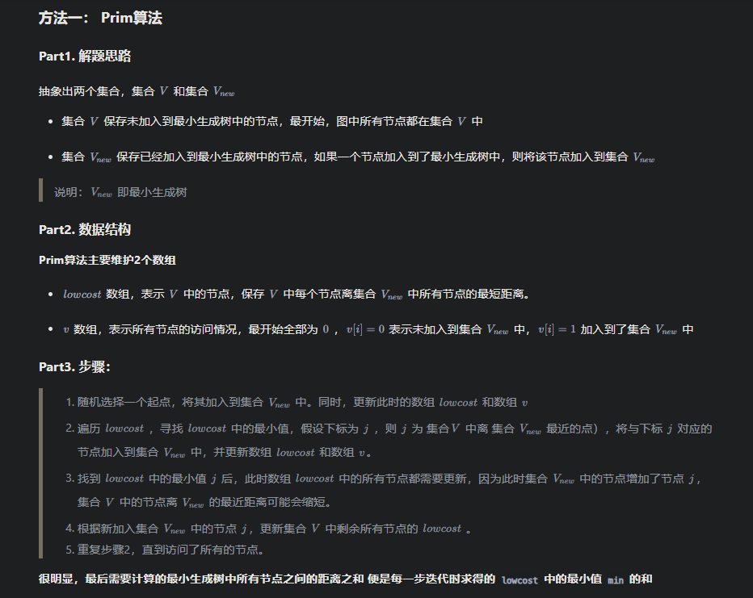

# 最小生成树

在一个连通的无向图中，最小生成树是一棵包含图中所有顶点，并且边的权值之和最小的树。它是原图的一个子图，具有以下特点：包含原图中所有的顶点；是一个连通且无环的图；所有边的权值之和在所有满足上述条件的子图中是最小的。

**1.最小生成树-Prim（普里姆）算法**

	{leetcode:
			1097,
			1098
			1584（中等）,（2024/5/6 18:09:14 ）
			1135,
	}
对于一个无向树的邻接矩阵，比如MA,有9个点

贪心策略：从任意顶点开始，逐步扩展树，每次选择一条连接树与非树顶点的最小权边，将对应的顶点加入树中。



```cpp
class Solution {
public:
    int prim(vector<vector<int> >& points, int start) {
        int n = points.size();
        int res = 0;

        // 1. 邻接矩阵
        vector<vector<int> > g(n, vector<int>(n));
        for (int i = 0; i < n; i++) {
            for (int j = i + 1; j < n; j++) {
                int dist = abs(points[i][0] - points[j][0]) + abs(points[i][1] - points[j][1]);
                g[i][j] = g[j][i] = dist;
            }
        }
        // 记录V中的点到Vnew的最近距离
        vector<int> lowcost(n, INT_MAX);
        // 记录V中的点是否加入到了Vnew
        vector<int> v(n);
        // lowcost 和 v 可以优化成一个数组

        // 2. 先将start加入到Vnew
        v[start] = 1;
        for (int i = 0; i < n; i++) {
            if (i == start) continue;
            lowcost[i] = g[i][start];
        }

        // 3. 遍历剩余若干个未加入到Vnew的节点
        for (int _ = 1; _ < n; _++) {
            // 找出此时V中，离Vnew最近的点
            int minIdx = -1;
            int minVal = INT_MAX;
            for (int j = 0; j < n; j++) {
                if (v[j] == 0 && lowcost[j] < minVal) {
                    minIdx = j;
                    minVal = lowcost[j];
                }
            }
            // 将最近的点加入Vnew
            v[minIdx] = 1;
            res += minVal;

            // 更新集合V中剩余所有点的lowcost
            for (int j = 0; j < n; j++) {
                if (v[j] == 0 && g[j][minIdx] < lowcost[j]) {
                    lowcost[j] = g[j][minIdx];
                }
            }
        }
        return res;

    }
    int minCostConnectPoints(vector<vector<int>>& points) {
        return prim(points, 0);  
    }
};
```


```cpp
#include <iostream>
#include <vector>
#include <queue>
#include <climits>
using namespace std;

#define V 4 // 顶点数

int primMST(int graph[V][V]) {
    priority_queue<pair<int, int>, vector<pair<int, int>>, greater<pair<int, int>>> pq;
    vector<int> key(V, INT_MAX);
    vector<bool> inMST(V, false);
    vector<int> parent(V, -1);

    // 从顶点0开始
    pq.push({0, 0});
    key[0] = 0;

    while (!pq.empty()) {
        int u = pq.top().second;
        pq.pop();
        inMST[u] = true;

        // 遍历所有邻接顶点
        for (int v = 0; v < V; ++v) {
            if (graph[u][v] && !inMST[v] && graph[u][v] < key[v]) {
                key[v] = graph[u][v];
                parent[v] = u;
                pq.push({key[v], v});
            }
        }
    }

    // 计算总权值, 边数 n-1
    int sum = 0;
    for (int i = 1; i < V; ++i) {
        sum += graph[i][parent[i]];
    }
    return sum;
}

int main() {
    int graph[V][V] = {
        {0, 2, 4, 3},
        {2, 0, 1, 0},
        {4, 1, 0, 5},
        {3, 0, 5, 0}
    };
    cout << "最小生成树权值和: " << primMST(graph) << endl;
    return 0;
}
```

**2.最小生成树-Kruskal（克鲁斯卡尔）算法**
利用并查法.
这里仍然使用：对于一个无向树的邻接矩阵，比如MA,有9个点
```cpp
//克鲁斯卡尔(Kruskal)算法
void MiniSpanTree_Kruskal(const int MA[][9])
{
	int num = 9;
	int n, m;
	Edge edges[20];
	int fa[20]; 
	int cnt=0;
	int ans=0;
	int idx = 0;
	//取出每条边
	for (int i = 0; i < num; i++)
	{
		for (int j = i+1; j < num; j++)
		{
			if (MA[i][j] != 100 && MA[i][j] != 0)
			{
				edges[idx].begin = i;
				edges[idx].end = j;
				edges[idx].w = MA[i][j];
				idx++;
			}
		}
	}
	//边进行排序，从小到大（注意用到lambda表达式）
	sort(edges, edges + 15, [](const Edge& a, const Edge& b) {return a.w < b.w; });
	//初始化
	for (int i = 0; i < num; i++)
	{
		fa[i] = i;
	}
	//合并
	for (int i = 0; i < 15; i++)
	{
		n = find_edges(fa, edges[i].begin);
		m = find_edges(fa, edges[i].end);
		if (n != m)
		{
			fa[n] = m;
			ans += edges[i].w;
			cnt++;
			cout << edges[i].begin << " "<< edges[i].end << " " << edges[i].w << endl;
		}
	}
	cout << "cnt:" << cnt << ";ans:" << ans << endl;
}
//查找（路径合并）
int find_edges(int* fa,int i)
{
	if (fa[i] == i)
		return i;
	else
		return fa[i] = find_edges(fa,fa[i]);
}
```

	lambda 表达式 [&](const Edge& a, const Edge& b) {return a.w < b.w; }
用于在排序算法中作为比较函数。它捕获了外部的所有变量（使用[&]），并以按值传递的方式获取所有的参数（const Edge& a 和 const Edge& b）。lambda表达式的主体是一个简单的比较操作，它比较两个Edge对象的w成员变量的大小，并返回比较结果。

	sort(edges, edges + 15, [](const Edge& a, const Edge& b) {return a.w < b.w; });


