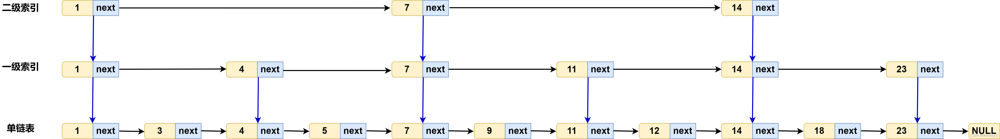
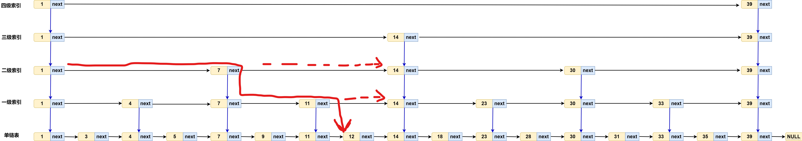
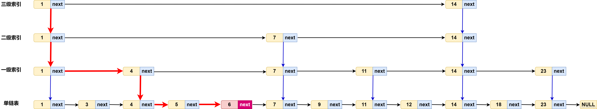

# 跳表

跳表的前提条件是 针对 有序的单链表 ，实现高效地查找，插入，删除。链表加多级索引的结构 就是 跳表。



## 1. 复杂度

> 跳表的查询时间复杂度

假设链表包含n个节点，在单链表中查询某个数据的时间复杂度是O(n)。

一个包含n个节点的有序单链表最多会有多少级索引？

每两个节点抽出一个节点作为上一级索引的节点，则 ：

第一级索引的节点个数大约是 n/2 ，第二级索引的节点个数大约是 n/4，第三级索引的节点个数大约是 n/8，则第k级索引节点的个数大约是 n/2^k。

假设有 h 级索引，最高一级的索引有两个节点，也就是 n/2^h=2;从而求得 h=logn -1 如果把原始链表这一层也算进去，那么整个跳表的高度约为 log n;



在跳表查询时，每一级索引 最多需要遍历3个节点。 

（因为假设在上图跳表中，从二级索引层，查找 节点12，则从节点1遍历到节点7，然后再遍历节点14(节点12 小于 节点14) ，从节点7向下一级索引层遍历到节点7，然再向右遍历节点11，再遍历节点14，发现节点12小于节点14， 则继续向下一级遍历，最终在下一级遍历到节点12。 

在上面遍历节点12的过程，在二级索引层遍历了3个节点（1—>7---->14），在一级索引层遍历了3个节点（7—>11---->14）。因此每一级最多遍历3个节点。 ）

那么在跳表中查询数据的时间复杂度就是每一层遍历的节点数乘以层数 ⁡3*logn ，因此跳表中查找的时间复杂度就是O(logn).  与二分查找的时间复杂度相同。

基于单链表实现了二分查找，查询效率的提升依赖构建了多级索引，是一种空间换时间的设计思路。

> 空间复杂度

建立索引后 的 总的索引点 的 空间复杂度：

n/2 + n/4 +...2 =n-2

跳表的查询数据的空间复杂度是O(n)，也就是说，基于单链表构造跳表，需要额外再用一倍的存储空间。

有没有办法降低索引占用的存储空间呢？

如果每3个节点 或 每5个节点抽1个节点到上一级索引，索引节点就会相应减少。假设每3个节点抽取一个节点到上一级，总的索引节点个数为：

n/3 + n/9 +...3+1 =n/2

每3个节点抽1个节点到上一级索引的方法  比 每2个节点抽1个节点构建索引的方式，减少了一半的索引节点存储空间。

因此，通过调节抽取节点的间隔，控制索引节点占用的存储空间，以此来达到空间复杂度 和 时间复杂度的平衡。


## 2.跳表的插入和删除

跳表作为一个动态数据结构，不仅支持查找操作，还支持数据的插入和删除操作，并且 插入和删除的操作的时间复杂度都是O(logn).

3.1  插入操作

为了保证原始链表中数据的有序性，我们需要先找到新数据应该插入的位置。 可以基于多级索引，快速查找到新数据的插入位置，时间复杂度为O(log n)。

假设插入数据为6的节点，如下图：



3.2  删除操作

删除原链表中的节点，如果节点存在于索引中，也要删除索引中的节点。 因为单链表中的删除需要用到 要删除节点 的 前驱动节点。 可以像插入操作一样，通过索引逐层向下遍历到原始链表中，要删除的节点，并记录其 前驱节点，从而实现删除操作。

## 3. 跳表索引动态更新

当频繁地向跳表中插入数据时，如果插入过程不伴随着索引更新，就有可能导致某2个索引节点之间数据非常多，在极端地情况下，跳表就会退化成单链表。

作为一种动态数据结构，为了避免性能下降，我们需要在数据插入，删除的过程中，动态地更新跳表的索引结构。  就像红黑树，二叉平衡树是通过左右旋来保持左右子树的大小平衡， 而跳表是借助随机函数来更新索引结构。

当向跳表中插入数据时，我们选择同时将这个数据插入到部分索引层中。 如何决定插入到哪些索引层中呢？ 通过一个随机函数来决定，比如通过  随机函数得到某个值 K, 那么就将这个节点添加到第一级到第K级索引中。


## 4. 实现 leetcode 1206

```cpp
struct Node
{
    //向右向下指针
    Node* right;
    Node* down;  
    int val;
    Node(Node *right, Node *down, int val)
            : right(right), down(down), val(val){}
};
 
class Skiplist {
private:
    Node *head;
    // 预先分配后，提升性能
    const static int MAX_LEVEL = 32;
    // 查找时临时使用的变量
    vector<Node*> pathList;
public:
    Skiplist() {
        //初始化头结点
        head = new Node(NULL, NULL, -1);
        pathList.reserve(MAX_LEVEL);
    }
    
    bool search(int target)
    {
        Node *p = head;
        while(p)
        {
            // 左右寻找目标区间
            while(p->right && p->right->val < target)
            {
                p = p->right;
            }
            // 没找到目标值，则继续往下走
            if(!p->right || target < p->right->val)
            {
                p = p->down;
            }
            else
            {   
                //找到目标值，结束
                return true;
            }
        }
        return false;
    }
    
    void add(int num) {
        //从上至下记录搜索路径
        pathList.clear();
        Node *p = head;
        // 从上到下去搜索 次小于num的 数字，等于就是另外一种实现里的 prevs
        while(p)
        {
            // 向右找到次小于num的p
            while (p->right && p->right->val < num)
            { 
                p = p->right;
            }
            pathList.push_back(p);
            p = p->down;
        }
 
        bool  insertUp = true;
        Node* downNode = NULL;
        // 从下至上搜索路径回溯，50%概率
        // 这里实现是会保证不会超过当前的层数的，然后靠头结点去额外加层， 即每次新增一层
        while (insertUp && pathList.size() > 0)
        {
            Node *insert = pathList.back();
            pathList.pop_back();
            // add新结点
            insert->right = new Node(insert->right,downNode,num); 
            // 把新结点赋值为downNode
            downNode = insert->right; 
            // 50%概率   
            insertUp = (rand()&1)==0;
            
        }
        // 插入新的头结点，加层
        if(insertUp)
        {  
            
            head = new Node(new Node(NULL,downNode,num), head, -1);
        }
    }
    
    bool erase(int num) {
        Node *p = head;
        bool seen = false;
        while (p)
        {
            // 当前层向右找到次小的点
            while (p->right && p->right->val < num)
            {
                p = p->right;
            }
            // 无效点，或者 太大， 则到下一层去
            if (!p->right || p->right->val > num)
            {  
                p = p->down;
            }
            else
            {
                // 搜索到目标结点，进行删除操作，结果记录为true
                // 继续往下层搜索，删除一组目标结点
                seen = true;
                p->right = p->right->right;
                p = p->down;
            }
        }
        return seen;
    }
};
```


