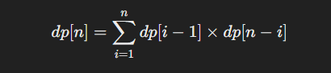

# leetcode 96

>给你一个整数 n ，求恰由 n 个节点组成且节点值从 1 到 n 互不相同的 二叉搜索树 有多少种？返回满足题意的二叉搜索树的种数。

# 解
思路：既然是二叉搜索树，那么根节点的左子树必然小于根节点，右子树值必然大于根节点值；
利用这个特性，可以选择数组中的任意一个节点作为根节点，小于这个数的为左子树节点，大于这个数的为右子树跟节点，排列组合就有left*right个组合，然后累加

假设我们选定某个值 i 作为根节点，那么：
  左子树的节点值为 [1, 2, ..., i-1]，一共 i-1 个节点。
  右子树的节点值为 [i+1, i+2, ..., n]，一共 n-i 个节点。

那么，以 i 为根的二叉搜索树的数量可以表示为：
  左子树的种数×右子树的种数

动态规划解法：
  1. 定义状态：
    令 dp[i] 表示由 i 个节点组成的不同的二叉搜索树的数量。
  2. 状态转移方程：
    对于 n 个节点，我们尝试以每一个 i（从 1 到 n）作为根节点，左子树有 i-1 个节点，右子树有 n-i 个节点。
      
  3. 初始条件：
    当没有节点时（即 n = 0），只有一种情况，即空树。所以 dp[0] = 1
```cpp
class Solution {
public:
    //dp[i]:i个节点，有dp[i]种二叉搜索树
    //dp[1]=1;
    //dp[0]=0;
    //二叉搜索树，左边小于根节点值；右边大于根节点值
    //dp[k]=dp[k-1]*dp[i-k],以k为根节点的树
    //dp[i]=sum(dp[k])，所有的树求和
    int numTrees(int n) {
        vector<int>dp(n+1);
        dp[0]=1;
        for(int i=1;i<n+1;i++)
        {
            for(int j=1;j<=i;j++)
            {
                dp[i]+=dp[j-1]*dp[i-j];
            }
        }
        return dp[n];
    }
};
```
时间复杂度：O(n^2)，因为我们有两个嵌套的循环。
空间复杂度：O(n)，需要一个大小为 n+1 的数组来存储 dp 值。


