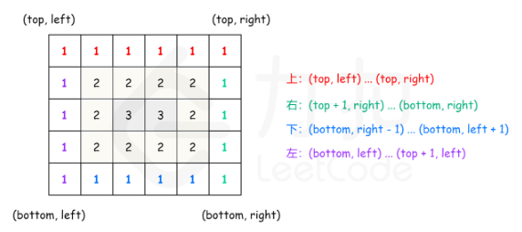

# leetcode 54. 螺旋矩阵

给你一个 m 行 n 列的矩阵 matrix ，请按照 顺时针螺旋顺序 ，返回矩阵中的所有元素。

## 解

方法1： 模拟

复杂度分析

时间复杂度：O(mn)，其中 m 和 n 分别是输入矩阵的行数和列数。矩阵中的每个元素都要被访问一次。

空间复杂度：O(mn)。需要创建一个大小为 m×n 的矩阵 visited 记录每个位置是否被访问过。


可以模拟螺旋矩阵的路径。初始位置是矩阵的左上角，初始方向是向右，当路径超出界限或者进入之前访问过的位置时，顺时针旋转，进入下一个方向。

判断路径是否进入之前访问过的位置需要使用一个与输入矩阵大小相同的辅助矩阵 visited，其中的每个元素表示该位置是否被访问过。当一个元素被访问时，将 visited 中的对应位置的元素设为已访问。

如何判断路径是否结束？由于矩阵中的每个元素都被访问一次，因此路径的长度即为矩阵中的元素数量，当路径的长度达到矩阵中的元素数量时即为完整路径，将该路径返回。

```cpp
class Solution {
private:
    static constexpr int directions[4][2] = {{0, 1}, {1, 0}, {0, -1}, {-1, 0}};
public:
    vector<int> spiralOrder(vector<vector<int>>& matrix) {
        if (matrix.size() == 0 || matrix[0].size() == 0) {
            return {};
        }
        
        int rows = matrix.size(), columns = matrix[0].size();
        vector<vector<bool>> visited(rows, vector<bool>(columns));
        int total = rows * columns;
        vector<int> order(total);

        int row = 0, column = 0;
        int directionIndex = 0;
        for (int i = 0; i < total; i++) {
            order[i] = matrix[row][column];
            visited[row][column] = true;
            int nextRow = row + directions[directionIndex][0], nextColumn = column + directions[directionIndex][1];
            if (nextRow < 0 || nextRow >= rows || nextColumn < 0 || nextColumn >= columns || visited[nextRow][nextColumn]) {
                directionIndex = (directionIndex + 1) % 4;
            }
            row += directions[directionIndex][0];
            column += directions[directionIndex][1];
        }
        return order;
    }
};
```

方法二：按层模拟

可以将矩阵看成若干层，首先输出最外层的元素，其次输出次外层的元素，直到输出最内层的元素。

定义矩阵的第 k 层是到最近边界距离为 k 的所有顶点。例如，下图矩阵最外层元素都是第 1 层，次外层元素都是第 2 层，剩下的元素都是第 3 层。

```cpp
[[1, 1, 1, 1, 1, 1, 1],
 [1, 2, 2, 2, 2, 2, 1],
 [1, 2, 3, 3, 3, 2, 1],
 [1, 2, 2, 2, 2, 2, 1],
 [1, 1, 1, 1, 1, 1, 1]]

```

对于每层，从左上方开始以顺时针的顺序遍历所有元素。假设当前层的左上角位于 (top,left)，右下角位于 (bottom,right)，按照如下顺序遍历当前层的元素。

1. 从左到右遍历上侧元素，依次为 (top,left) 到 (top,right)
2. 从上到下遍历右侧元素，依次为 (top+1,right) 到 (bottom,right)。
3. 如果 left < right 且 top < bottom，则从右到左遍历下侧元素，依次为 (bottom,right−1) 到 (bottom,left+1)，以及从下到上遍历左侧元素，依次为 (bottom,left) 到 (top+1,left)。



遍历完当前层的元素之后，将 left 和 top 分别增加 1，将 right 和 bottom 分别减少 1，进入下一层继续遍历，直到遍历完所有元素为止。

```cpp
class Solution {
public:
    vector<int> spiralOrder(vector<vector<int>>& matrix) {
        if (matrix.size() == 0 || matrix[0].size() == 0) {
            return {};
        }

        int rows = matrix.size(), columns = matrix[0].size();
        vector<int> order;
        int left = 0, right = columns - 1, top = 0, bottom = rows - 1;
        while (left <= right && top <= bottom) {
            for (int column = left; column <= right; column++) {
                order.push_back(matrix[top][column]);
            }
            for (int row = top + 1; row <= bottom; row++) {
                order.push_back(matrix[row][right]);
            }
            if (left < right && top < bottom) {
                for (int column = right - 1; column > left; column--) {
                    order.push_back(matrix[bottom][column]);
                }
                for (int row = bottom; row > top; row--) {
                    order.push_back(matrix[row][left]);
                }
            }
            left++;
            right--;
            top++;
            bottom--;
        }
        return order;
    }
};

作者：力扣官方题解
链接：https://leetcode.cn/problems/spiral-matrix/solutions/275393/luo-xuan-ju-zhen-by-leetcode-solution/
来源：力扣（LeetCode）
著作权归作者所有。商业转载请联系作者获得授权，非商业转载请注明出处。
```


