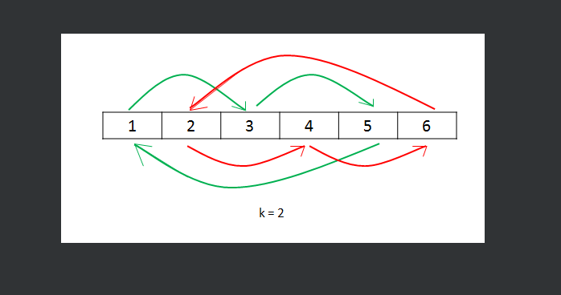

leetcode: 189
>给定一个整数数组 nums，将数组中的元素向右轮转 k 个位置，其中 k 是非负数。


# 解
## 方法1
我们可以使用额外的数组来将每个元素放至正确的位置。
```cpp
class Solution {
public:
    void rotate(vector<int>& nums, int k) {
        int len = nums.size();
        vector<int>temp = nums;
        for(int i=0;i<len;++i){
            nums[(i+k)%len] = temp[i];
        }
    }
};
```
时间复杂度： O(n)，其中 n 为数组的长度。
空间复杂度： O(n)。

## 方法2 环状替换
方法一中使用额外数组的原因在于如果我们直接将每个数字放至它最后的位置，这样被放置位置的元素会被覆盖从而丢失。因此，从另一个角度，我们可以将被替换的元素保存在变量 temp 中，从而避免了额外数组的开销。

我们从位置 0 开始，最初令 temp=nums[0]。根据规则，位置 0 的元素会放至 (0+k)modn 的位置，令 x=(0+k)modn，此时交换 temp 和 nums[x]，完成位置 x 的更新。然后，我们考察位置 x，并交换 temp 和 nums[(x+k)modn]，从而完成下一个位置的更新。不断进行上述过程，直至回到初始位置 0。

容易发现，当回到初始位置 0 时，有些数字可能还没有遍历到，此时我们应该从下一个数字开始重复的过程，可是这个时候怎么才算遍历结束呢？我们不妨先考虑这样一个问题：从 0 开始不断遍历，最终回到起点 0 的过程中，我们遍历了多少个元素？

由于最终回到了起点，故该过程恰好走了整数数量的圈，不妨设为 a 圈；再设该过程总共遍历了 b 个元素。因此，我们有 an=bk，即 an 一定为 n,k 的公倍数。又因为我们在第一次回到起点时就结束，因此 a 要尽可能小，故 an 就是 n,k 的最小公倍数 lcm(n,k)，因此 b 就为 lcm(n,k)/k。



```cpp
class Solution {
public:
    void rotate(vector<int>& nums, int k) {
        int n = nums.size();
        k = k % n;
        int count = gcd(k, n);
        for (int start = 0; start < count; ++start) {
            int current = start;
            int prev = nums[start];
            do {
                int next = (current + k) % n;
                swap(nums[next], prev);
                current = next;
            } while (start != current);
        }
    }
};

作者：力扣官方题解
链接：https://leetcode.cn/problems/rotate-array/solutions/551039/xuan-zhuan-shu-zu-by-leetcode-solution-nipk/
来源：力扣（LeetCode）
著作权归作者所有。商业转载请联系作者获得授权，非商业转载请注明出处。
```

或者直接计数
```cpp
class Solution {
public:
    void rotate(vector<int>& nums, int k) {
        int n = nums.size();
        k = k%n;
        int count = 0;
        int start=0;
        while(count<n){
            int current=start;
            int prev=nums[start];
            do{
                int next=(current+k)%n;
                swap(nums[next],prev);
                current=next;
                count++;
            }while(start!=current);
            start++;
        }
    }
};
```

## 方法3 翻转

该方法基于如下的事实：当我们将数组的元素向右移动 k 次后，尾部 k mod n 个元素会移动至数组头部，其余元素向后移动 kmodn 个位置。

该方法为数组的翻转：我们可以先将所有元素翻转，这样尾部的 kmodn 个元素就被移至数组头部，然后我们再翻转 [0,kmodn−1] 区间的元素和 [kmodn,n−1] 区间的元素即能得到最后的答案。

```cpp
class Solution {
public:
    void reverse(vector<int>& nums, int start, int end) {
        while (start < end) {
            swap(nums[start], nums[end]);
            start += 1;
            end -= 1;
        }
    }

    void rotate(vector<int>& nums, int k) {
        k %= nums.size();
        reverse(nums, 0, nums.size() - 1);
        reverse(nums, 0, k - 1);
        reverse(nums, k, nums.size() - 1);
    }
};

作者：力扣官方题解
链接：https://leetcode.cn/problems/rotate-array/solutions/551039/xuan-zhuan-shu-zu-by-leetcode-solution-nipk/
来源：力扣（LeetCode）
著作权归作者所有。商业转载请联系作者获得授权，非商业转载请注明出处。
```


