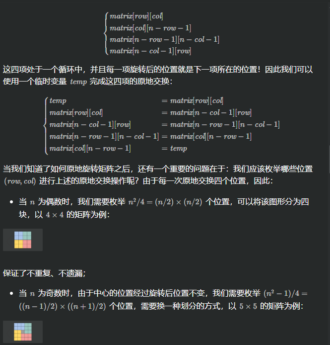

leetcode 48:旋转图像 

>给定一个 n × n 的二维矩阵 matrix 表示一个图像。请你将图像顺时针旋转 90 度。
你必须在 原地 旋转图像，这意味着你需要直接修改输入的二维矩阵。请不要 使用另一个矩阵来旋转图像。


## 方法1，利用数组
可以观察到，旋转后的元素变化：
//第一行->最后一列
//第二行->倒数第二列
```cpp
class Solution {
public:
    void rotate(vector<vector<int>>& matrix) {
        //第一行->最后一列
        //第二行->倒数第二列
        auto a=matrix;
        int m=matrix.size(),n=matrix[0].size();
        for(int i=0;i<m;++i){
            for(int j=0;j<n;++j){
                matrix[j][n-i-1]=a[i][j];
            }
        }
    }
};
```

## 方法二 原地旋转
这个方法很像 **3.轮转数组**的方法二，
当前位置位置替换下一个位置元素，下一个元素在替换它的下一个元素,依次类推，如果回到原点则加一；

这一题也是类似：



```cpp
class Solution {
public:
    void rotate(vector<vector<int>>& matrix) {
        int n = matrix.size();
        for (int i = 0; i < n / 2; ++i) {
            for (int j = 0; j < (n + 1) / 2; ++j) {
                int temp = matrix[i][j];
                matrix[i][j] = matrix[n - j - 1][i];
                matrix[n - j - 1][i] = matrix[n - i - 1][n - j - 1];
                matrix[n - i - 1][n - j - 1] = matrix[j][n - i - 1];
                matrix[j][n - i - 1] = temp;
            }
        }
    }
};

作者：力扣官方题解
链接：https://leetcode.cn/problems/rotate-image/solutions/526980/xuan-zhuan-tu-xiang-by-leetcode-solution-vu3m/
来源：力扣（LeetCode）
著作权归作者所有。商业转载请联系作者获得授权，非商业转载请注明出处。
```

## 方法三 翻转代替旋转
```cpp
class Solution {
public:
    void rotate(vector<vector<int>>& matrix) {
        int n = matrix.size();
        // 水平翻转
        for (int i = 0; i < n / 2; ++i) {
            for (int j = 0; j < n; ++j) {
                swap(matrix[i][j], matrix[n - i - 1][j]);
            }
        }
        // 主对角线翻转
        for (int i = 0; i < n; ++i) {
            for (int j = 0; j < i; ++j) {
                swap(matrix[i][j], matrix[j][i]);
            }
        }
    }
};

作者：力扣官方题解
链接：https://leetcode.cn/problems/rotate-image/solutions/526980/xuan-zhuan-tu-xiang-by-leetcode-solution-vu3m/
来源：力扣（LeetCode）
著作权归作者所有。商业转载请联系作者获得授权，非商业转载请注明出处。
```


