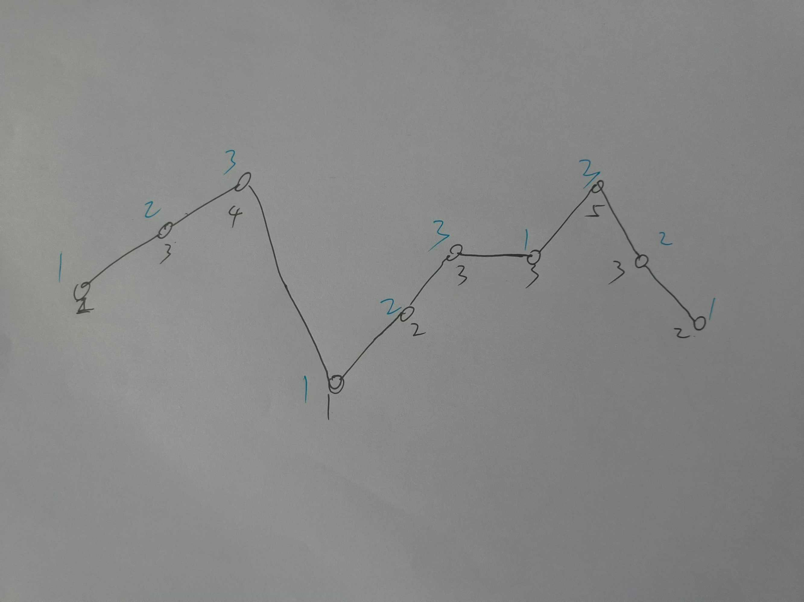
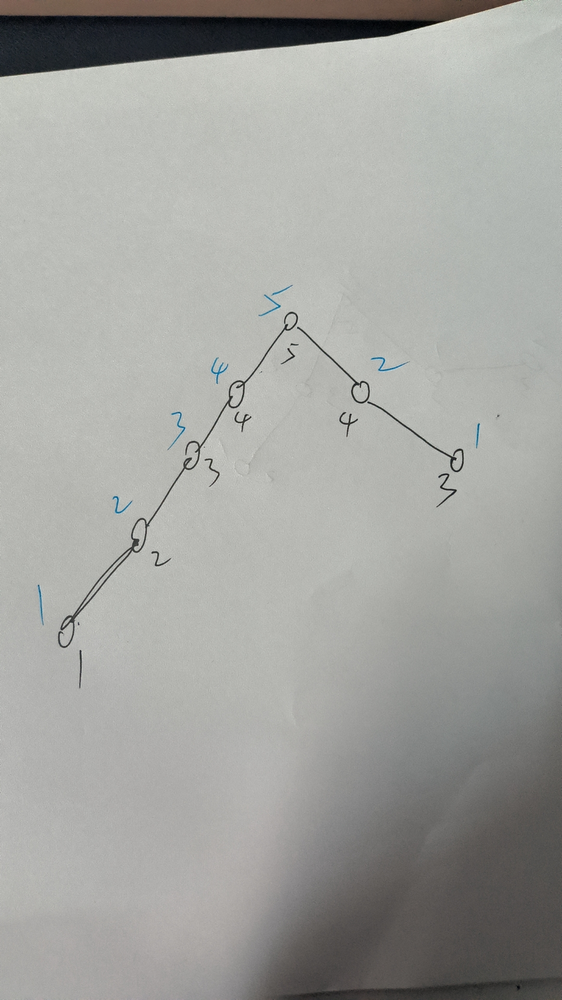

# 135.分发糖果
n 个孩子站成一排。给你一个整数数组 ratings 表示每个孩子的评分。

你需要按照以下要求，给这些孩子分发糖果：

每个孩子至少分配到 1 个糖果。
相邻两个孩子评分更高的孩子会获得更多的糖果。

请你给每个孩子分发糖果，计算并返回需要准备的 最少糖果数目 。


# 解
这题非常巧妙,写这种题一定要画图！



可以看上面这个图，当区域是递增序列的时候，那么糖果就从1开始增加；

当区域是递减序列的时候，糖果是从右边开始从1增加；
为什么从右向左遍历，看图最后一段就好理解了，假如从左向右遍历，想求5对应的糖果数，就要知道递减区间的长度，然后和递增区间的长度，那么这个值就是两者的最大值；
  而且会出现这样一种情况：假如递增的长度为5，递减的长度为3，则此糖果数为5，但是右边递减区域的糖果数不是从5开始递减的；所以不能从左向右遍历。
  

因为每个人最少一个糖果，所以区间内分数最少的人，糖果数量为1；

但是当先增后减的时候，这个时候的顶峰值是取递减区域和递增区域的较大者，但是其他的糖果数量并不改变；

注意，当两个数相等时，第二个糖果直接给1；

所以第一种解法就是，定义两个数组，分别维护递增区间和递减区间；
递增区间：只要当前值大于前面的，糖果数就加1；
递减区间：只要当前值大于后面的，糖果数就加1；
结果就是，取两者的最大值作为结果;

为什么可以这样做呢？
  从左到右遍历 确保了在左侧的任何一个孩子比其左边的孩子评分更高时，得到的糖果数也比左边的孩子多。
  从右到左遍历 确保了在右侧的任何一个孩子比其右边的孩子评分更高时，得到的糖果数也比右边的孩子多。
  这两个方向的遍历保证了相邻孩子之间的评分关系在两种方向上的一致性，从而满足题目中规定的条件。
  这种方法利用了动态规划的思想，通过局部的解决方案（每个方向的遍历）来构建全局的解决方案。

```cpp
class Solution {
public:
    int candy(vector<int>& ratings) {
        int n=ratings.size();
        vector<int>left(n,1),right(n,1);
        for(int i=1;i<n;++i)
        {
            if(ratings[i]>ratings[i-1])
                left[i]=left[i-1]+1;
        }
        for(int i=n-2;i>=0;--i)
        {
            if(ratings[i]>ratings[i+1])
                right[i]=right[i+1]+1;
        }
        int res=0;
        for(int i=0;i<n;++i)
        {
            res+=left[i]>=right[i]?left[i]:right[i];
        }
        return res;
    }
};
```

方法二：常数空间遍历

这个方法的思想和上面是一致的，增区间从1开始递增，减区间从右到左从1开始递增；顶峰值取较大值；

这种方法是一次遍历就可以得到结果；只是代码技巧上的改变
递增区间：当前的糖果数是之前的+1，如果分数相等则是1；
递减区间：
  假如递减区间的长度小于递增的长度，那么就糖果数从1开始递增，这个时候不包括顶峰；
  假如递减区间的长度大于等于递增区间，那么顶峰的糖果数就属于递减区间了，这个时候就要更新顶峰值了。官方这一部分的代码有点难以理解，原因就是它的维护顶峰值放到了dec中，每深入一层多加一次，这部分信息包含在
  ```cpp
    if (dec == inc) {
        dec++;
    }
  ```
换种更好理解的代码如下：
```cpp
class Solution {
public:
    int candy(vector<int>& ratings) {
        int n = ratings.size();
        int ret = 1;
        int inc = 1, dec = 0, pre = 1;
        for (int i = 1; i < n; i++) {
            if (ratings[i] >= ratings[i - 1]) {
                dec = 0;
                pre = ratings[i] == ratings[i - 1] ? 1 : pre + 1;
                ret += pre;
                inc = pre;
            } else {
                dec++; //递减区间的长度，不包括顶峰
                if(dec<inc)//递减区间(不包括顶峰)的长度小于递增区间
                {
                    ret += dec;
                }
                else if(dec>=inc)//递减区间(不包括顶峰)的长度大于递增区间，那么此时顶峰属于递减区间
                {
                    ret+=1;//更新顶峰值，因为顶峰值之前的值是增区间的长度
                    ret += dec; //加上递减区间的糖果数
                }
                pre = 1;//从递减区间跳到递增区间时，最小糖果色为1
            }
        }
        return ret;
    }
};
```


