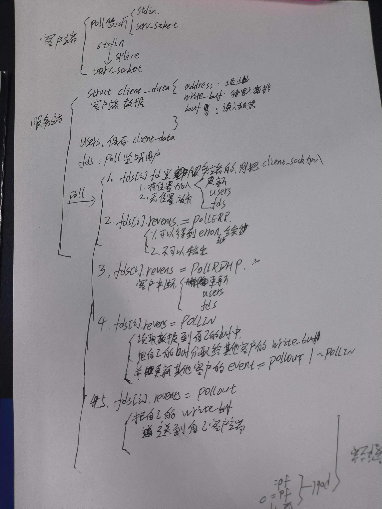

1. EPOLLONESHOT


2. 非阻塞


pollfd 结构体
 + pollfd 结构体定义在头文件 <poll.h> 中，用于描述一个文件描述符及其需要监控的事件。poll 系统调用通过这个结构体来等待文件描述符上指定的事件（如可读、可写或错误等）。
```cpp
struct pollfd {
    int   fd;        // 要监控的文件描述符
    short events;    // 要监控的事件
    short revents;   // poll 返回时该文件描述符上实际发生的事件
};

```
fd:
 + 要监视的文件描述符（如套接字、文件等）。
 + 例如，你可以设置为 STDIN_FILENO 来监视标准输入，或设置为一个网络套接字描述符。
events:
 + 你希望 poll 监控的事件。这是一个 short 类型的位掩码，用于指定要监视的事件类型。常用事件有：
  + POLLIN：数据可读。
  + POLLOUT：数据可写。
  + POLLERR：发生错误。
  + POLLHUP：挂起（如对端关闭连接）。

revents:
 + poll 调用返回时，用来指示实际发生的事件。poll 在返回时会将此字段填充为与 events 相关的事件。

## 实现聊天客户端
客户端程序使用poll 同时监听用户输入和网络连接，并利用splice函数将用户输入内容直接定向到网络连接上以发送，从而实现零拷贝。



## 同时处理TCP 和 UDP 


