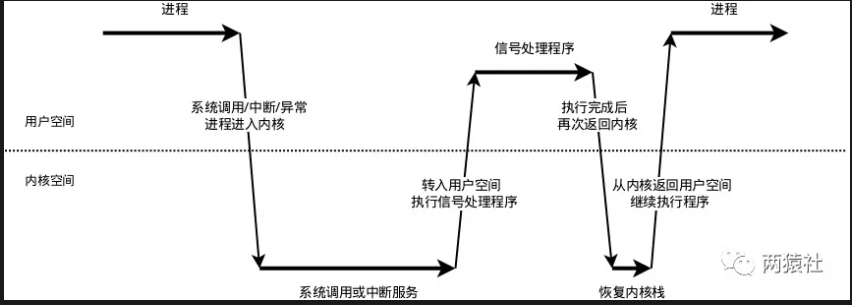

## 1. 服务器编程基本框架
 
主要由I/O单元，逻辑单元和网络存储单元组成，其中每个单元之间通过请求队列进行通信，从而协同完成任务。

其中I/O单元用于处理客户端连接，读写网络数据；逻辑单元用于处理业务逻辑的线程；网络存储单元指本地数据库和文件等。


5种I/O模型：Linux下高性能服务器编程：8.3

2种时间处理模式： Linux下高性能服务器编程：8.4


## 2. 同步I/O模拟proactor模式
同步I/O模型的工作流程如下（epoll_wait为例）：
 + 主线程往epoll内核事件表注册socket上的读就绪事件。
 + 主线程调用epoll_wait等待socket上有数据可读
 + 当socket上有数据可读，epoll_wait通知主线程,主线程从socket循环读取数据，直到没有更多数据可 + 读，然后将读取到的数据封装成一个请求对象并插入请求队列。
 + 睡眠在请求队列上某个工作线程被唤醒，它获得请求对象并处理客户请求，然后往epoll内核事件表中注册 + 该socket上的写就绪事件
 + 主线程调用epoll_wait等待socket可写。
 + 当socket上有数据可写，epoll_wait通知主线程。主线程往socket上写入服务器处理客户请求的结果。


## 3. 半同步/半反应堆

半同步/半反应堆并发模式是半同步/半异步的变体，将半异步具体化为某种事件处理模式.

并发模式中的同步和异步
>+ 同步指的是程序完全按照代码序列的顺序执行
>+ 异步指的是程序的执行需要由系统事件驱动

半同步/半异步模式工作流程
>+ 同步线程用于处理客户逻辑
>+ 异步线程用于处理I/O事件
>+ 异步线程监听到客户请求后，就将其封装成请求对象并插入请求队列中
>+ 请求队列将通知某个工作在同步模式的工作线程来读取并处理该请求对象

半同步/半反应堆工作流程（以Proactor模式为例）
>+ 主线程充当异步线程，负责监听所有socket上的事件
>+ 若有新请求到来，主线程接收之以得到新的连接socket，然后往epoll内核事件表中注册该socket上的读写事件
>+ 如果连接socket上有读写事件发生，主线程从socket上接收数据，并将数据封装成请求对象插入到请求队>+ 列中
>+ 所有工作线程睡眠在请求队列上，当有任务到来时，通过竞争（如互斥锁）获得任务的接管权

### 3.1 连接池：网络存储单元
连接池是一种设计模式，主要用于管理和复用一组数据库连接，从而提高应用程序的性能和响应能力。连接池预先创建一定数量的数据库连接，并维护这些连接的状态。当应用程序需要访问数据库时，可以直接从连接池中获取一个空闲的连接，而不需要每次都创建新的连接；使用完毕后，再将连接归还给连接池，而不是关闭连接。

连接池的好处
 1. 减少连接建立和关闭的开销：
   数据库连接是昂贵的操作，特别是对于远程数据库来说。连接池可以避免每次请求都创建和关闭连接的开 销。
 2. 提高应用性能：
   由于减少了连接的建立和关闭次数，应用程序的响应速度会得到提升。
 3. 统一管理连接：
   连接池可以控制并发连接的数量，避免过多的数据库连接导致的问题。
 4. 自动管理连接状态：
   连接池可以自动检测和处理失效的连接，保证从池中获取的都是有效的连接。

连接池的工作原理
 1. 初始化阶段：
   连接池在启动时会根据配置创建一定数量的数据库连接，并将它们放入池中。
 2. 获取连接：
   当应用程序需要访问数据库时，会向连接池请求一个连接。连接池会返回一个空闲的连接（如果有的 话）。
 3. 使用连接：
   应用程序使用该连接执行数据库操作。
 4. 归还连接：
   应用程序完成数据库操作后，将连接归还给连接池。此时连接并没有被关闭，而是被标记为“空闲”，可供 其他请求使用。
 5. 销毁连接：
   当连接池关闭或者达到最大连接数时，多余的连接会被关闭。

连接池的关键概念
 1. 最大连接数（Max Connections）：
   连接池可以同时持有的数据库连接的最大数量。
 2. 最小连接数（Min Connections）：
   连接池中始终保持的最小连接数量。
 3. 空闲连接（Idle Connections）：
   连接池中当前未被使用的连接数量。
 4. 活跃连接（Active Connections）：
   连接池中当前正被使用的连接数量。

**整体概述**
池可以看做资源的容器，所以多种实现方法，比如数组、链表、队列等。这里，使用单例模式和链表创建数据库连接池，实现对数据库连接资源的复用。

项目中的数据库模块分为两部分，其一是数据库连接池的定义，其二是利用连接池完成登录和注册的校验功能。具体的，工作线程从数据库连接池取得一个连接，访问数据库中的数据，访问完毕后将连接交还连接池。
 
**连接池的定义**
数据库连接池的定义，具体的涉及到单例模式创建、连接池代码实现、RAII机制释放数据库连接。

单例模式创建，结合代码描述连接池的单例实现。

连接池代码实现，结合代码对连接池的外部访问接口进行详解。

RAII机制释放数据库连接，描述连接释放的封装逻辑。

**实现**

为了使全局只会有一个连接池实例，使用单例模式
  唯一实例：类只能有一个实例，不能创建多个实例。
  全局访问点：提供一个全局的访问点，通常通过静态方法来获取该实例


实现步骤
 1. 私有化构造函数：防止其他类或代码直接通过 new 操作符创建对象。
 2. 静态方法返回实例：提供一个静态方法用于获取该类的唯一实例。
 3. 静态成员变量存储唯一实例：通过一个静态成员变量来存储该类的唯一实例。

使用到了 [单例模式](../C++语法/模式/单例模式.md) 和 [RALL模式](../C++语法/模式/RALL.md)；


### 3.2 线程池
本项目中，使用数据库连接池实现服务器访问数据库的功能，使用POST请求完成注册和登录的校验工作。

线程池的设计模式为半同步/半反应堆，其中反应堆具体为Proactor事件处理模式。

具体的，主线程为异步线程，负责监听文件描述符，接收socket新连接，若当前监听的socket发生了读写事件，然后将任务插入到请求队列。工作线程从请求队列中取出任务，完成读写数据的处理。

相较与书上的只是加了线程池，并且线程不关闭


## 4. 日志系统
日志，由服务器自动创建，并记录运行状态，错误信息，访问数据的文件。

同步日志，日志写入函数与工作线程串行执行，由于涉及到I/O操作，当单条日志比较大的时候，同步模式会阻塞整个处理流程，服务器所能处理的并发能力将有所下降，尤其是在峰值的时候，写日志可能成为系统的瓶颈。

生产者-消费者模型，并发编程中的经典模型。以多线程为例，为了实现线程间数据同步，生产者线程与消费者线程共享一个缓冲区，其中生产者线程往缓冲区中push消息，消费者线程从缓冲区中pop消息。

阻塞队列，将生产者-消费者模型进行封装，使用循环数组实现队列，作为两者共享的缓冲区。

异步日志，将所写的日志内容先存入阻塞队列，写线程从阻塞队列中取出内容，写入日志。

单例模式，最简单也是被问到最多的设计模式之一，保证一个类只创建一个实例，同时提供全局访问的方法。

### 4.1 整体概述

本项目中，使用单例模式创建日志系统，对服务器运行状态、错误信息和访问数据进行记录，该系统可以实现按天分类，超行分类功能，可以根据实际情况分别使用同步和异步写入两种方式。

其中异步写入方式，将生产者-消费者模型封装为阻塞队列，创建一个写线程，工作线程将要写的内容push进队列，写线程从队列中取出内容，写入日志文件。

日志系统大致可以分成两部分，其一是单例模式与阻塞队列的定义，其二是日志类的定义与使用。

涉及到： [单例模式](../C++语法/模式/单例模式.md) [条件变量](./Linux高性能服务器编程/14.多线程.md) [生产者消费者模型](../C++语法/模式/生产者消费之模型.md)

### 4.2 阻塞队列
阻塞队列类中封装了生产者-消费者模型，其中push成员是生产者，pop成员是消费者。

阻塞队列中，使用了循环数组实现了队列，作为两者共享缓冲区，当然了，队列也可以使用STL中的queue。

自定义队列

当队列为空时，从队列中获取元素的线程将会被挂起；当队列是满时，往队列里添加元素的线程将会挂起。


### 4.3 日志系统

日志系统分为两部分，其一是单例模式与阻塞队列的定义，其二是日志类的定义与使用。

#### 4.3.1基础API
**fputs**
```cpp
#include <stdio.h>
int fputs(const char *str, FILE *stream);
```
 + str，一个数组，包含了要写入的以空字符终止的字符序列。
 + stream，指向FILE对象的指针，该FILE对象标识了要被写入字符串的流。

**可变参数宏__VA_ARGS__**
__VA_ARGS__ 是一个预处理器宏，它在可变参数宏展开时被用来表示可变参数列表中的参数。当你定义一个接受可变参数的宏时，你会使用__VA_ARGS__来引用这些参数。

在C++中，使用__VA_ARGS__的可变参数宏通常是通过以下格式定义的：
```cpp
#define MACRO_NAME(args...) body(__VA_ARGS__)
```
这里的args...表示可变参数列表，body(__VA_ARGS__)则是宏体，其中__VA_ARGS__会被替换成实际传入的参数列表。
```cpp
#include <iostream>

#define PRINT(args...) do { \
    std::cout << "Arguments: "; \
    (void)(sizeof((args)) ? ((void)printf("%d ", (args)), 0) : 0); \
    std::cout << std::endl; \
} while(0)

int main() {
    PRINT(1);      // 输出: Arguments: 1
    PRINT(1, 2);   // 输出: Arguments: 1 2
    PRINT(1, 2, 3);// 输出: Arguments: 1 2 3
    return 0;
}
```


__VA_ARGS__是一个可变参数的宏，定义时宏定义中参数列表的最后一个参数为省略号，在实际使用时会发现有时会加##，有时又不加。
```cpp
//最简单的定义
#define my_print1(...)  printf(__VA_ARGS__)

//搭配va_list的format使用
#define my_print2(format, ...) printf(format, __VA_ARGS__)  
#define my_print3(format, ...) printf(format, ##__VA_ARGS__)
```
__VA_ARGS__宏前面加上##的作用在于，当可变参数的个数为0时，这里printf参数列表中的的##会把前面多余的","去掉，否则会编译出错，建议使用后面这种，使得程序更加健壮。

**fflush**
```cpp
#include <stdio.h>
int fflush(FILE *stream);
```
fflush()会强迫将缓冲区内的数据写回参数stream 指定的文件中，如果参数stream 为NULL，fflush()会将所有打开的文件数据更新。

在使用多个输出函数连续进行多次输出到控制台时，有可能下一个数据再上一个数据还没输出完毕，还在输出缓冲区中时，下一个printf就把另一个数据加入输出缓冲区，结果冲掉了原来的数据，出现输出错误。

在prinf()后加上fflush(stdout); 强制马上输出到控制台，可以避免出现上述错误。

#### 4.3.2 流程图与日志类定义
##### 4.3.2.1流程图
 + 日志文件
   + 局部变量的懒汉模式获取实例
   + 生成日志文件，并判断同步和异步写入方式

 + 同步
   + 判断是否分文件
   + 直接格式化输出内容，将信息写入日志文件

 + 异步
   + 判断是否分文件
   + 格式化输出内容，将内容写入阻塞队列，创建一个写线程，从阻塞队列取出内容写入日志文件

**同步日志记录（Synchronous Logging）**
同步日志记录指的是在记录日志时，应用程序会等待日志写入操作完成之后再继续执行。也就是说，当调用日志记录函数时，程序会暂停执行，直到日志实际写入到存储介质为止。
同步日志：在日志写入期间阻塞应用程序，确保数据的一致性和完整性。

**异步日志记录（Asynchronous Logging）**
异步日志记录指的是在记录日志时，应用程序不会等待日志写入操作完成。相反，它会将日志消息放入一个队列中，由另一个专门的线程或进程来处理这个队列，并将日志数据写入到存储介质。
异步日志：不阻塞应用程序，提高了系统的响应速度，但可能会在极端情况下丢失数据。

实现细节：
  1. 日志队列：异步日志通常使用一个队列来暂存待写入的日志数据，队列的实现需要保证其线程安全。
  2. 日志写入线程：异步日志需要一个专门的线程或进程来处理队列中的日志数据，并将其写入到存储介质。
  3. 日志刷新策略：需要定义何时将队列中的日志数据写入到存储介质，可以基于时间间隔、队列长度或其他条件来触发刷新。
  4. 错误处理：需要处理日志写入失败的情况，并提供适当的错误恢复机制。


##### 4.3.2.2 日志类定义
通过局部变量的懒汉单例模式创建日志实例，对其进行初始化生成日志文件后，格式化输出内容，并根据不同的写入方式，完成对应逻辑，写入日志文件。

日志类包括但不限于如下方法，
  + 公有的实例获取方法
  + 初始化日志文件方法
  + 异步日志写入方法，内部调用私有异步方法
  + 内容格式化方法
  + 刷新缓冲区


日志类中的方法都不会被其他程序直接调用，末尾的四个可变参数宏提供了其他程序的调用方法。

前述方法对日志等级进行分类，包括DEBUG，INFO，WARN和ERROR四种级别的日志。

##### 功能实现
init()函数实现日志创建、写入方式的判断。

write_log函数完成写入日志文件中的具体内容，主要实现日志分级、分文件、格式化输出内容

**生成日志文件 && 判断写入方式**

通过单例模式获取唯一的日志类，调用init方法，初始化生成日志文件，服务器启动按当前时刻创建日志，前缀为时间，后缀为自定义log文件名，并记录创建日志的时间day和行数count。

写入方式通过初始化时是否设置队列大小（表示在队列中可以放几条数据）来判断，若队列大小为0，则为同步，否则为异步。

**日志分级与分文件**

日志分级的实现大同小异，一般的会提供五种级别，具体的，
 + Debug，调试代码时的输出，在系统实际运行时，一般不使用。
 + Warn，这种警告与调试时终端的warning类似，同样是调试代码时使用。
 + Info，报告系统当前的状态，当前执行的流程或接收的信息等。
 + Error和Fatal，输出系统的错误信息

超行、按天分文件逻辑，具体的，
 + 日志写入前会判断当前day是否为创建日志的时间，行数是否超过最大行限制
   + 若为创建日志时间，写入日志，否则按当前时间创建新log，更新创建时间和行数
   + 若行数超过最大行限制，在当前日志的末尾加count/max_lines为后缀创建新log

将系统信息格式化后输出，具体为：格式化时间 + 格式化内容


整个日志的框架代码起始看日志流程图就可以对应起来了。

## 5. 定时器
之前在第11章已经写过了，这里是用的是基于链表的定时器；

### 5.1 基础知识

**非活跃**，是指客户端（这里是浏览器）与服务器端建立连接后，长时间不交换数据，一直占用服务器端的文件描述符，导致连接资源的浪费。

**定时事件**，是指固定一段时间之后触发某段代码，由该段代码处理一个事件，如从内核事件表删除事件，并关闭文件描述符，释放连接资源。

**定时器**，是指利用结构体或其他形式，将多种定时事件进行封装起来。具体的，这里只涉及一种定时事件，即定期检测非活跃连接，这里将该定时事件与连接资源封装为一个结构体定时器。

**定时器容器**，是指使用某种容器类数据结构，将上述多个定时器组合起来，便于对定时事件统一管理。具体的，项目中使用升序链表将所有定时器串联组织起来。

### 5.2 整体概述

本项目中，服务器主循环为每一个连接创建一个定时器，并对每个连接进行定时。另外，利用升序时间链表容器将所有定时器串联起来，若主循环接收到定时通知，则在链表中依次执行定时任务。

**信号处理机制**
每个进程之中，都有存着一个表，里面存着每种信号所代表的含义，内核通过设置表项中每一个位来标识对应的信号类型。



信号的接收
  接收信号的任务是由内核代理的，当内核接收到信号后，会将其放到对应进程的信号队列中，同时向进程发送一个中断，使其陷入内核态。注意，此时信号还只是在队列中，对进程来说暂时是不知道有信号到来的。

信号的检测
 + 进程从内核态返回到用户态前进行信号检测
 + 进程在内核态中，从睡眠状态被唤醒的时候进行信号检测
 + 进程陷入内核态后，有两种场景会对信号进行检测：
 + 当发现有新信号时，便会进入下一步，信号的处理。

信号的处理
 + ( 内核 )信号处理函数是运行在用户态的，调用处理函数前，内核会将当前内核栈的内容备份拷贝到用户栈上，并且修改指令 寄存器（eip）将其指向信号处理函数。
 + ( 用户 )接下来进程返回到用户态中，执行相应的信号处理函数。
 + ( 内核 )信号处理函数执行完成后，还需要返回内核态，检查是否还有其它信号未处理。
 + ( 用户 )如果所有信号都处理完成，就会将内核栈恢复（从用户栈的备份拷贝回来），同时恢复指令寄存器（eip）将其指向中断前的运行位置，最后回到用户态继续执行进程。

至此，一个完整的信号处理流程便结束了，如果同时有多个信号到达，上面的处理流程会在第2步和第3步骤间重复进行。


>在每个进程之中，都有存着一个表，里面存着每种信号所代表的含义，而这也是信号机制的根本。
> 由于信号的触发和发送是随机的，也就是异步的。接收进程是无法预知什么时间，会收到哪个信号的。下面就开始讲下信号的详细发送机制，举例说明，如果有A，B两个进程，A进程接收到出发条件，开始发送信号给B进程，信号并不是直接从进程A发送给进程B，而是要通过内核来进行转发。之所以要通过内核来转发，这样做的目的应该也是为了对进程的管理和安全因素考虑。因 为在这些信号当中，SIGSTOP和SIGKILL这两个信号是可以将接收此信号的进程停掉的，而这类信号，肯定是需要有权限才可以 发出的，不能够随便哪个程序都可以随便停掉别的进程。
> 
> A进程发送的信号消息，其实就是根据上面的那个信号表，根据需要对相应的表项进行设置。内核接受到这个信号消息后，会先 检查A进程是否有权限对B进程的信号表对应的项进行设置，如果可以，就会对B进程的信号表进行设置，这里面信号处理有个特 点，就是没有排队的机制，也就是说某个信号被设置之后，如果B进程还没有来及进行响应，那么如果后续第二个同样的信号消 息过来，就会被阻塞掉，也就是丢弃。
> 
> 内核对B进程信号设置完成后，就会发送中断请求给B进程，这样B进程就进入到内核态，这个时候进程B根据那个信号表，查找对应的此信号的处理函数，然后设置frame，设置好之后，跳回到用户态执行信号处理函数，处理完成后，再次返回到内核态，再次设置frame，然后再次返回用户态，从中断位置开始继续执行。这个frame其实就是在用户态和内核态之间跳转的时候，对 堆栈现场的压栈保存。
> 
> 作者：peilin song
> 链接：https://www.zhihu.com/question/24913599/answer/115102869
> 来源：知乎
> 著作权归作者所有。商业转载请联系作者获得授权，非商业转载请注明出处。

**代码分析-如何使用定时器**
服务器首先创建定时器容器链表，然后用统一事件源将异常事件，读写事件和信号事件统一处理，根据不同事件的对应逻辑使用定时器。

具体的，
 + 浏览器与服务器连接时，创建该连接对应的定时器，并将该定时器添加到链表上
 + 处理异常事件时，执行定时事件，服务器关闭连接，从链表上移除对应定时器
 + 处理定时信号时，将定时标志设置为true
 + 处理读事件时，若某连接上发生读事件，将对应定时器向后移动，否则，执行定时事件
 + 处理写事件时，若服务器通过某连接给浏览器发送数据，将对应定时器向后移动，否则，执行定时事件

## 6. http 处理
http报文处理流程:
 1. 浏览器端发出http连接请求，主线程创建http对象接收请求并将所有数据读入对应buffer，将该对象插入任务队列，工作线程从任务队列中取出一个任务进行处理。

 2. 工作线程取出任务后，调用process_read函数，通过主、从状态机对请求报文进行解析。

 3. 解析完之后，跳转do_request函数生成响应报文，通过process_write写入buffer，返回给浏览器端


### 6.1 流程图与状态机
从状态机负责读取报文的一行，主状态机负责对该行数据进行解析，主状态机内部调用从状态机，从状态机驱动主状态机。


**主状态机**
三种状态，标识解析位置。
   CHECK_STATE_REQUESTLINE，解析请求行
   CHECK_STATE_HEADER，解析请求头
   CHECK_STATE_CONTENT，解析消息体，仅用于解析POST请求

从状态机
三种状态，标识解析一行的读取状态。
  LINE_OK，完整读取一行
  LINE_BAD，报文语法有误
  LINE_OPEN，读取的行不完整

**请求报文**
1. GET
```SH
GET /562f25980001b1b106000338.jpg HTTP/1.1
Host:img.mukewang.com
User-Agent:Mozilla/5.0 (Windows NT 10.0; WOW64)
AppleWebKit/537.36 (KHTML, like Gecko) Chrome/51.0.2704.106 Safari/537.36
Accept:image/webp,image/*,*/*;q=0.8
Referer:http://www.imooc.com/
Accept-Encoding:gzip, deflate, sdch
Accept-Language:zh-CN,zh;q=0.8
空行
请求数据为空
```

2. POST
```sh
POST / HTTP1.1
Host:www.wrox.com
User-Agent:Mozilla/4.0 (compatible; MSIE 6.0; Windows NT 5.1; SV1; .NET CLR 2.0.50727; .NET CLR 3.0.04506.648; .CLR 3.5.21022)
Content-Type:application/x-www-form-urlencoded
Content-Length:40
Connection: Keep-Alive
空行
name=Professional%20Ajax&publisher=Wiley
```

> + 请求行，用来说明请求类型,要访问的资源以及所使用的HTTP版本。
>  GET说明请求类型为GET，/562f25980001b1b106000338.jpg(URL)为要访问的资源，该行的最后一部分说明使用的是HTTP1.1版本。
> + 请求头部，紧接着请求行（即第一行）之后的部分，用来说明服务器要使用的附加信息。
>   + HOST，给出请求资源所在服务器的域名。
>   + User-Agent，HTTP客户端程序的信息，该信息由你发出请求使用的浏览器来定义,并且在每个请求中自动发送等。
>   + Accept，说明用户代理可处理的媒体类型。
>   + Accept-Encoding，说明用户代理支持的内容编码。
>   + Accept-Language，说明用户代理能够处理的自然语言集。
>   + Content-Type，说明实现主体的媒体类型。
>   + Content-Length，说明实现主体的大小。
>   + Connection，连接管理，可以是Keep-Alive或close。
> + 空行，请求头部后面的空行是必须的即使第四部分的请求数据为空，也必须有空行。
> + 请求数据也叫主体，可以添加任意的其他数据。

3. 相应报文
HTTP响应也由四个部分组成，分别是：状态行、消息报头、空行和响应正文。
```sh
HTTP/1.1 200 OK
Date: Fri, 22 May 2009 06:07:21 GMT
Content-Type: text/html; charset=UTF-8
空行
<html>
      <head></head>
      <body>
            <!--body goes here-->
      </body>
</html>
```
> + 状态行，由HTTP协议版本号， 状态码， 状态消息 三部分组成。
> 第一行为状态行，（HTTP/1.1）表明HTTP版本为1.1版本，状态码为200，状态消息为OK。
> 
> + 消息报头，用来说明客户端要使用的一些附加信息。
> 第二行和第三行为消息报头，Date:生成响应的日期和时间；Content-Type:指定了MIME类型的HTML(text/html),编码类型是UTF-8。
> 
> + 空行，消息报头后面的空行是必须的。
> 
> + 响应正文，服务器返回给客户端的文本信息。空行后面的html部分为响应正文。


读入缓冲区的变化：


#### 6.1.1代码分析-http报文解析
简单来讲，浏览器端发出http连接请求，服务器端主线程创建http对象接收请求并将所有数据读入对应buffer，将该对象插入任务队列后，工作线程从任务队列中取出一个任务进行处理。

各子线程通过process函数对任务进行处理，调用process_read函数和process_write函数分别完成报文解析与报文响应两个任务。
```cpp
/* 由线程池中的工作线程调用，这是处理HTTP请求的入口函数， */
void http_conn::process()
{
    HTTP_CODE read_ret = process_read();
    if ( read_ret == NO_REQUEST )
    {
        modfd( m_epollfd, m_sockfd, EPOLLIN );
        return;
    }

    bool write_ret = process_write( read_ret );
    if ( ! write_ret )
    {
        close_conn();
    }

    modfd( m_epollfd, m_sockfd, EPOLLOUT );
}
```
解析报文整体流程
process_read通过while循环，将主从状态机进行封装，对报文的每一行进行循环处理。
  + 判断条件
    + 主状态机转移到CHECK_STATE_CONTENT，该条件涉及解析消息体
    + 从状态机转移到LINE_OK，该条件涉及解析请求行和请求头部
    + 两者为或关系，当条件为真则继续循环，否则退出
  + 循环体
    + 从状态机读取数据
    + 调用get_line函数，通过m_start_line将从状态机读取数据间接赋给text
    + 主状态机解析text


#### 6.1.2从状态机逻辑
在HTTP报文中，每一行的数据由\r\n作为结束字符，空行则是仅仅是字符\r\n。因此，可以通过查找\r\n将报文拆解成单独的行进行解析，项目中便是利用了这一点。

从状态机负责读取buffer中的数据，将每行数据末尾的\r\n置为\0\0，并更新从状态机在buffer中读取的位置m_checked_idx，以此来驱动主状态机解析。

 + 从状态机从m_read_buf中逐字节读取，判断当前字节是否为\r
   + 接下来的字符是\n，将\r\n修改成\0\0，将m_checked_idx指向下一行的开头，则返回LINE_OK
   + 接下来达到了buffer末尾，表示buffer还需要继续接收，返回LINE_OPEN
   + 否则，表示语法错误，返回LINE_BAD

 + 当前字节不是\r，判断是否是\n（一般是上次读取到\r就到了buffer末尾，没有接收完整，再次接收时会出现这种情况）
   + 如果前一个字符是\r，则将\r\n修改成\0\0，将m_checked_idx指向下一行的开头，则返回LINE_OK

 + 当前字节既不是\r，也不是\n
   + 表示接收不完整，需要继续接收，返回LINE_OPEN


#### 6.1.3 主状态机逻辑
主状态机初始状态是 CHECK_STATE_REQUESTLINE ，通过调用从状态机来驱动主状态机，在主状态机进行解析前，从状态机已经将每一行的末尾\r\n符号改为\0\0，以便于主状态机直接取出对应字符串进行处理。

 + CHECK_STATE_REQUESTLINE
   + 主状态机的初始状态，调用parse_request_line函数解析请求行
   + 解析函数从m_read_buf中解析HTTP请求行，获得请求方法、目标URL及HTTP版本号、
   + 解析完成后主状态机的状态变为CHECK_STATE_HEADER

解析完请求行后，主状态机继续分析请求头。在报文中，请求头和空行的处理使用的同一个函数，这里通过判断当前的text首位是不是\0字符，若是，则表示当前处理的是空行，若不是，则表示当前处理的是请求头。

+ CHECK_STATE_HEADER
 + 调用parse_headers函数解析请求头部信息
 + 判断是空行还是请求头，若是空行，进而判断content-length是否为0，如果不是0，表明是POST请求，则状态转移到CHECK_STATE_CONTENT，否则说明是GET请求，则报文解析结束。
 + 若解析的是请求头部字段，则主要分析connection字段，content-length字段，其他字段可以直接跳过，各位也可以根据需求继续分析。
 + connection字段判断是keep-alive还是close，决定是长连接还是短连接
 + content-length字段，这里用于读取post请求的消息体长度

如果仅仅是GET请求，如项目中的欢迎界面，那么主状态机只设置之前的两个状态足矣。

GET和POST请求报文的区别之一是有无消息体部分，GET请求没有消息体，当解析完空行之后，便完成了报文的解析。

但后续的**登录和注册功能**，为了避免将用户名和密码直接暴露在URL中，我们在项目中改用了POST请求，将用户名和密码添加在报文中作为消息体进行了封装。

为此，我们需要在解析报文的部分添加解析消息体的模块。

```CPP
while((m_check_state==CHECK_STATE_CONTENT && line_status==LINE_OK)||((line_status=parse_line())==LINE_OK))
```

**那么，这里的判断条件为什么要写成这样呢？**

在GET请求报文中，每一行都是\r\n作为结束，所以对报文进行拆解时，仅用从状态机的状态line_status=parse_line())==LINE_OK语句即可。

但，在POST请求报文中，消息体的末尾没有任何字符，所以不能使用从状态机的状态，这里转而使用主状态机的状态作为循环入口条件。

**那后面的&& line_status==LINE_OK又是为什么？**
解析完消息体后，报文的完整解析就完成了，但此时主状态机的状态还是CHECK_STATE_CONTENT，也就是说，符合循环入口条件，还会再次进入循环，这并不是我们所希望的。

为此，增加了该语句，并在完成消息体解析后，将line_status变量更改为LINE_OPEN，此时可以跳出循环，完成报文解析任务。

 + CHECK_STATE_CONTENT
  + 仅用于解析POST请求，调用parse_content函数解析消息体
  + 用于保存post请求消息体，为后面的登录和注册做准备

#### 6.1.4 相应报文

##### 流程图
浏览器端发出HTTP请求报文，服务器端接收该报文并调用process_read对其进行解析，根据解析结果HTTP_CODE，进入相应的逻辑和模块

其中，服务器子线程完成报文的解析与响应；主线程监测读写事件，调用read_once和http_conn::write完成数据的读取与发送。


**HTTP_CODE含义**
表示HTTP请求的处理结果，在头文件中初始化了八种情形，在报文解析与响应中只用到了七种。
+ NO_REQUEST
  + 请求不完整，需要继续读取请求报文数据
  + 跳转主线程继续监测读事件

+ GET_REQUEST
  + 获得了完整的HTTP请求
  + 调用do_request完成请求资源映射

+ NO_RESOURCE
  + 请求资源不存在
  + 跳转process_write完成响应报文

+ BAD_REQUEST
  + HTTP请求报文有语法错误或请求资源为目录
  + 跳转process_write完成响应报文

+ FORBIDDEN_REQUEST
  + 请求资源禁止访问，没有读取权限
  + 跳转process_write完成响应报文

+ FILE_REQUEST
  + 请求资源可以正常访问
  + 跳转process_write完成响应报文

+ INTERNAL_ERROR
  + 服务器内部错误，该结果在主状态机逻辑switch的default下，一般不会触发

##### 代码分析
**do_request**
process_read函数的返回值是对请求的文件分析后的结果，一部分是语法错误导致的BAD_REQUEST，一部分是do_request的返回结果.该函数将网站根目录和url文件拼接，然后通过stat判断该文件属性。另外，为了提高访问速度，通过mmap进行映射，将普通文件映射到内存逻辑地址

为了更好的理解请求资源的访问流程，这里对各种各页面跳转机制进行简要介绍。其中，浏览器网址栏中的字符，即url，可以将其抽象成ip:port/xxx，xxx通过html文件的action属性进行设置。


m_url为请求报文中解析出的请求资源，以/开头，也就是/xxx，项目中解析后的m_url有8种情况。

+ /
  + GET请求，跳转到judge.html，即欢迎访问页面
+ /0
  + POST请求，跳转到register.html，即注册页面
+ /1
  + POST请求，跳转到log.html，即登录页面
+ /2CGISQL.cgi
  + POST请求，进行登录校验
  + 验证成功跳转到welcome.html，即资源请求成功页面
  + 验证失败跳转到logError.html，即登录失败页面
+ /3CGISQL.cgi
  + POST请求，进行注册校验
  + 注册成功跳转到log.html，即登录页面
  + 注册失败跳转到registerError.html，即注册失败页面
+ /5
  + POST请求，跳转到picture.html，即图片请求页面
+ /6
  + POST请求，跳转到video.html，即视频请求页面
+ /7
  + POST请求，跳转到fans.html，即关注页面


**process_write**
HTTP响应也由四个部分组成，分别是：状态行、消息报头、空行和响应正文。
```sh
HTTP/1.1 200 OK
Date: Fri, 22 May 2009 06:07:21 GMT
Content-Type: text/html; charset=UTF-8
空行
<html>
      <head></head>
      <body>
            <!--body goes here-->
      </body>
</html>
```

根据do_request的返回状态，服务器子线程调用process_write向m_write_buf中写入响应报文。
  + add_status_line函数，添加状态行：http/1.1 状态码 状态消息
  + add_headers函数添加消息报头，内部调用add_content_length和add_linger函数
    + content-length记录响应报文长度，用于浏览器端判断服务器是否发送完数据
    + connection记录连接状态，用于告诉浏览器端保持长连接
  + add_blank_line添加空行

上述涉及的5个函数，均是内部调用add_response函数更新m_write_idx指针和缓冲区m_write_buf中的内容。
  http_conn对象维护：
  + 一个写缓冲区：m_write_buf[];
  + 写缓冲区中代发送的字节数：int m_write_idx;
  + 每次调用add_response 都是把响应字段添加到缓冲区中


响应报文分为两种，一种是请求文件的存在，通过 io 向量机制 iovec，声明两个 iovec，第一个指向 m_write_buf，第二个指向 mmap 的地址 m_file_address；一种是请求出错，这时候只申请一个 iovec，指向 m_write_buf。

 + iovec是一个结构体，里面有两个元素，指针成员iov_base指向一个缓冲区，这个缓冲区是存放的是writev将要发送的数据。

 + 成员iov_len表示实际写入的长度


**write**
服务器子线程调用process_write完成响应报文，随后注册epollout事件。服务器主线程检测写事件，并调用http_conn::write函数将响应报文发送给浏览器端。

当套接字缓冲区有足够的空间接收更多的数据时，EPOLLOUT会被触发。这意味着应用程序可以继续写入数据到套接字中。

该函数具体逻辑如下：

在生成响应报文时初始化byte_to_send，包括头部信息和文件数据大小。通过writev函数循环发送响应报文数据，根据返回值更新byte_have_send和iovec结构体的指针和长度，并判断响应报文整体是否发送成功。

 + 若writev单次发送成功，更新byte_to_send和byte_have_send的大小，若响应报文整体发送成功,则取消mmap映射,并判断是否是长连接.
   + 长连接重置http类实例，注册读事件，不关闭连接，
   + 短连接直接关闭连接

 + 若writev单次发送不成功，判断是否是写缓冲区满了。
   + 若不是因为缓冲区满了而失败，取消mmap映射，关闭连接
   + 若eagain则满了，更新iovec结构体的指针和长度，并注册写事件，等待下一次写事件触发（当写缓冲区从不可写变为可写，触发epollout），因此在此期间无法立即接收到同一用户的下一请求，但可以保证连接的完整性。

**问题：大文件传输**
一旦请求服务器文件较大文件时，需要多次调用writev函数，便会出现问题，不是文件显示不全，就是无法显示。

对数据传输过程分析后，定位到writev的m_iv结构体成员有问题，每次传输后不会自动偏移文件指针和传输长度，还会按照原有指针和原有长度发送数据。

根据前面的基础API分析，我们知道writev以顺序iov[0]，iov[1]至iov[iovcnt-1]从缓冲区中聚集输出数据。项目中，申请了2个iov，其中iov[0]为存储报文状态行的缓冲区，iov[1]指向资源文件指针。

对上述代码做了修改如下：
  + 由于报文消息报头较小，第一次传输后，需要更新m_iv[1].iov_base和iov_len，m_iv[0].iov_len置成0，只传输文件，不用传输响应消息头
  + 每次传输后都要更新下次传输的文件起始位置和长度

```cpp
/* 写HTTP相应 */
bool http_conn::write()
{
    int temp = 0;

    //若要发送的数据长度为0
    //表示响应报文为空，一般不会出现这种情况
    if (bytes_to_send == 0)
    {
        modfd(m_epollfd, m_sockfd, EPOLLIN, m_TRIGMode);
        init();
        return true;
    }

    while (1)
    {
        //将响应报文的状态行、消息头、空行和响应正文发送给浏览器端
        temp = writev(m_sockfd, m_iv, m_iv_count);

        if (temp < 0)
        {
            //判断缓冲区是否满了
            if (errno == EAGAIN)
            {
                modfd(m_epollfd, m_sockfd, EPOLLOUT, m_TRIGMode);
                return true;
            }
            //如果发送失败，但不是缓冲区问题，取消映射
            unmap();
            return false;
        }
        //正常发送，temp为发送的字节数
        bytes_have_send += temp;

        //更新已发送字节数
        bytes_to_send -= temp;

        //第一个iovec头部信息的数据已发送完，发送第二个iovec数据
        if (bytes_have_send >= m_iv[0].iov_len)
        {
            //不再继续发送头部信息
            m_iv[0].iov_len = 0;
            m_iv[1].iov_base = m_file_address + (bytes_have_send - m_write_idx);
            m_iv[1].iov_len = bytes_to_send;
        }
        //继续发送第一个iovec头部信息的数据
        else
        {
            m_iv[0].iov_base = m_write_buf + bytes_have_send;
            m_iv[0].iov_len = m_iv[0].iov_len - bytes_have_send;
        }

        //判断条件，数据已全部发送完
        if (bytes_to_send <= 0)
        {
            unmap();
            //在epoll树上重置EPOLLONESHOT事件
            modfd(m_epollfd, m_sockfd, EPOLLIN, m_TRIGMode);
            //浏览器的请求为长连接
            if (m_linger)
            {
                init();
                return true;
            }
            else
            {
                return false;
            }
        }
    }
}
```

## 7. 注册和登录
本项目中，使用数据库连接池实现服务器访问数据库的功能，使用POST请求完成注册和登录的校验工作。

+ 流程图，描述服务器从报文中提取出用户名密码，并完成注册和登录校验后，实现页面跳转的逻辑。
+ 载入数据库表，结合代码将数据库中的数据载入到服务器中。
+ 提取用户名和密码，结合代码对报文进行解析，提取用户名和密码。
+ 注册登录流程，结合代码对描述服务器进行注册和登录校验的流程。
+ 页面跳转，结合代码对页面跳转机制进行详解。


+ /
  + GET请求，跳转到judge.html，即欢迎访问页面
+ /0
  + GET请求，跳转到register.html，即注册页面
+ /1
  + GET请求，跳转到log.html，即登录页面
+ /2CGISQL.cgi
  + POST请求，进行登录校验
  + 验证成功跳转到welcome.html，即资源请求成功页面
  + 验证失败跳转到logError.html，即登录失败页面
+ /3CGISQL.cgi
  + POST请求，进行注册校验
  + 注册成功跳转到log.html，即登录页面
  + 注册失败跳转到registerError.html，即注册失败页面
+ /5
  + POST请求，跳转到picture.html，即图片请求页面
+ /6
  + POST请求，跳转到video.html，即视频请求页面
+ /7
  + POST请求，跳转到fans.html，即关注页面


### 载入数据库
一个 http_conn 对象维护一个 map<string,string> 保持用户名和密码，key：用户名;value:密码；
调用 initmysql_result(connection_pool* connPool)提取到 map中

### 提取用户名和密码
服务器端解析浏览器的请求报文，当解析为POST请求时，cgi标志位设置为1，并将请求报文的消息体赋值给m_string，进而提取出用户名和密码。

## 压力测试


