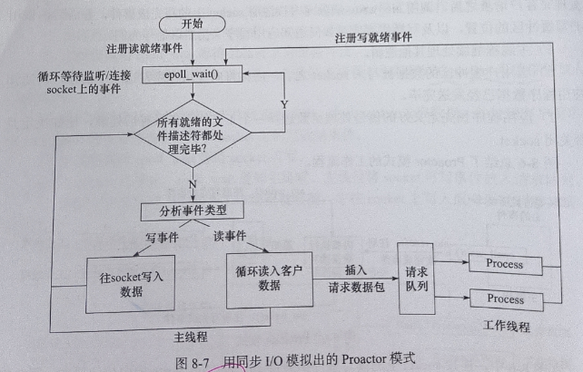
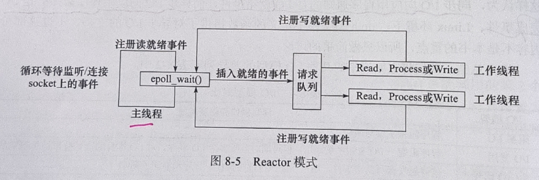
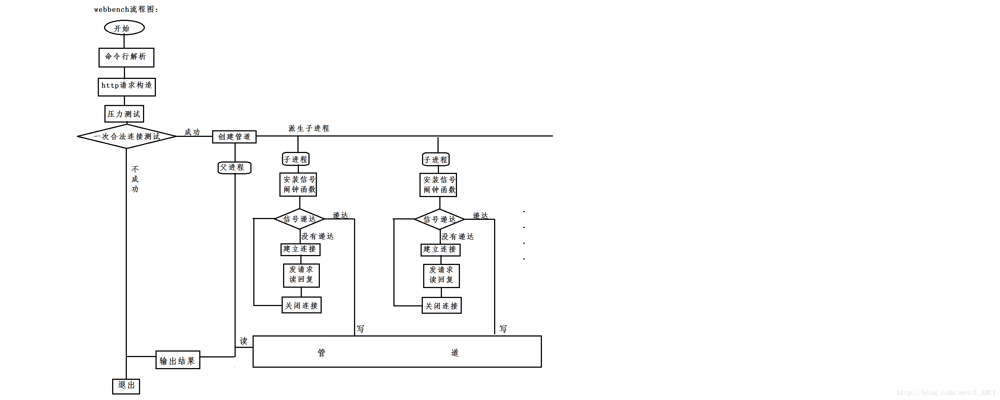

# 项目问题

## 1. 项目介绍
### 1. 为什么做这个项目

### 2. 介绍你的项目
这个项目是基于多线程的服务器；
主要包含5个模块：
  线程池，
  连接池，
  http请求解析模块，
  日志模块，
  时钟模块；

线程池模块：是基于**半同步/半反应堆并发模式**设计的线程池，其中反应堆具体为**Proactor事件**处理模式。

日志模块：使用生产者消费者模式维护阻塞队列；

**1. 什么是半同步/半反应堆模式？**
先解释一下什么是半同步/半异步模式？
 在半同步/半异步模式中，同步线程用于处理客户逻辑，异步线程用于处理I/O时间。当异步线程主线程监听到客户请求后，就将其封装成请求对象放入请求队列中。 请求队列将通知某个工作在同步模式的工作线程来读取并处理请求对象。

**2. 什么是Proactor事件，你知道Reactor模式吗**
Reactor和Proactor是两种高效的事件处理模式。

Proactor：其原理就是主线程执行数据读写操作，读写完成之后，主线程向工作线程通知这一“完成事件”。然后工作线程就相当于直接获得了数据读写的结果，接下来只要对读写的结果进行逻辑处理。

比如说这本项目中：
1. 主线程向epoll内核事件表中注册socket上的读事件；
2. 主线程调用epoll_wait等待socket上有数据可读；
3. 当socket上有数据可读时，epoll_wait通知主线程。主线程从socket循环读取数据，直到没有数据可读，然后将读取的数据封装成一个请求对象并插入到请求队列中；插入请求队列后，会发送一个**信号变量**
4. 然后线程池run()中等待的线程，则会被唤醒；然后从请求队列中拿到http_conn事件；然后往epoll内核事件表中注册socket上的写就绪事件
5. 然后主线程调用epoll_wait等待socket可写
6. 当socket可写时，epoll_wait通知主线程。主线程往socket上写入服务器处理请求客户请求的结果

Reactor:就是要求主线程只负责监听文件描述上是否有事件发生，有的话就立刻将该事件通知工作线程。除此之外，主线程不做任何其他工作。读写数据，接收新的连接，以及处理客户请求均在工作线程中完成。

**3. 什么是信号量？**

## 2. 线程池相关
### 1. 手写线程池

### 2. 线程的同步机制有哪些？

### 3. 线程池中的工作线程是一直等待吗？

### 4. 你的线程池工作线程处理完一个任务后的状态是什么？

### 5. 如果同时1000个客户端进行访问请求，线程数不多，怎么能及时响应处理每一个呢？

### 6. 如果一个客户请求需要占用线程很久的时间，会不会影响接下来的客户请求呢，有什么好的策略呢?

## 3. 并发模型相关
### 1. 简单说一下服务器使用的并发模型？

### 2. reactor、proactor、主从reactor模型的区别？

### 3. 你用了epoll，说一下为什么用epoll，还有其他复用方式吗？区别是什么？

## 4. HTTP报文解析相关
### 1. 用了状态机啊，为什么要用状态机？

### 2. 状态机的转移图画一下

### 3. https协议为什么安全？

### 4. https的ssl连接过程

### 5. GET和POST的区别

## 5. 数据库登录注册相关
### 1. 登录说一下？

### 2. 你这个保存状态了吗？如果要保存，你会怎么做？（cookie和session）

### 3. 登录中的用户名和密码你是load到本地，然后使用map匹配的，如果有10亿数据，即使load到本地后hash，也是很耗时的，你要怎么优化？

### 4. 用的mysql啊，redis了解吗？用过吗？

## 6. 定时器相关

### 1. 为什么要用定时器？

### 2. 说一下定时器的工作原理

### 3. 双向链表啊，删除和添加的时间复杂度说一下？还可以优化吗？

### 4. 最小堆优化？说一下时间复杂度和工作原理

## 7.日志相关
### 1. 说下你的日志系统的运行机制？

### 2. 为什么要异步？和同步的区别是什么？

### 3. 现在你要监控一台服务器的状态，输出监控日志，请问如何将该日志分发到不同的机器上？（消息队列）

## 8. 压测相关
### 1. 服务器并发量测试过吗？怎么测试的？

### 2. webbench是什么？介绍一下原理

### 3. 测试的时候有没有遇到问题？

## 9. 综合能力
### 1. 你的项目解决了哪些其他同类项目没有解决的问题？

### 2. 说一下前端发送请求后，服务器处理的过程，中间涉及哪些协议？

