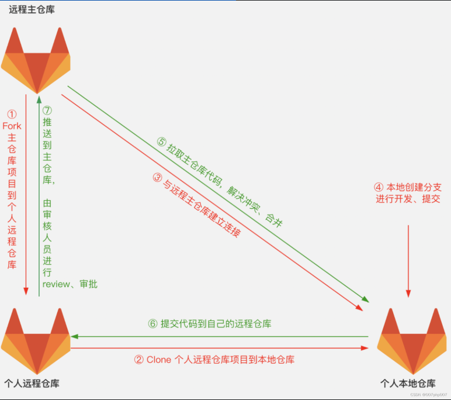

### 1. git merge 和 get rebase的区别

it merge
+ git merge 会将多个分支的修改合并到当前分支，它会创建一个新的合并提交（merge commit）。这个合并提交有两个父提交，分别指向被合并的两个分支的最新提交，以此来表示此次合并操作整合了这两个分支的修改内容。
+ 例如，在 master 分支上执行 git merge feature，Git 会找到两个分支的共同祖先（即分叉点），然后将 feature 分支和 master 分支从共同祖先开始的修改内容进行合并，最后生成一个新的合并提交添加到 master 分支上。

git rebase
+ git rebase 是将一个分支的修改逐个应用到另一个分支上。它会把当前分支的提交从原来的基础上分离出来，然后在目标分支的最新提交后面依次重新应用这些提交，让提交历史看起来就像是在目标分支的基础上依次进行开发一样，不会产生额外的合并提交。
+ 例如，在 feature 分支上执行 git rebase master，Git 会找到 feature 分支和 master 分支的共同祖先，然后将 feature 分支上从共同祖先之后的所有提交暂时保存起来，接着将 feature 分支的指针移动到 master 分支的最新提交上，最后再把之前保存的提交依次应用到 feature 分支上。

历史记录呈现
git merge
+ 使用 git merge 会保留分支的分叉历史，在查看提交历史时可以清晰地看到各个分支的发展路径以及合并操作的痕迹。合并提交会在历史记录中形成一个分叉点，显示出不同分支的修改是如何合并在一起的。
+ 这种历史记录可以直观地反映出团队成员的开发过程和分支之间的关系，但如果频繁进行合并操作，提交历史可能会变得比较复杂和混乱。
git rebase
+ git rebase 会使提交历史变得更加线性，看起来就像是所有的开发工作都是在一条直线上依次进行的。它消除了分支分叉的情况，让提交历史更加简洁、清晰。
+ 这种线性的提交历史便于查看和理解，也有助于后续的代码审查和版本回溯，但它掩盖了实际的开发分支情况。

### 2. git 冲突



当两个分支（或者多个分支）对同一文件的同一部分进行了修改，并且试图合并这些修改时，就会发生冲突。Git会标记出冲突的部分，需要我们手动解决。

解决本地冲突：
1. 合并分支
假设你正在 main 分支上，想要合并 feature 分支。
```bash
git checkout main
git merge feature
```
如果两个分支都对同一文件做了不同的修改，Git 会提示你有冲突，并显示冲突文件。

2. 查看冲突文件
使用以下命令查看冲突状态：
```bash
git status
```
输出中会显示“unmerged paths”，并列出冲突的文件。

3. 手动解决冲突
打开冲突文件，查找冲突标记：
```bash
<<<<<<< HEAD
当前分支的内容
=======
合并分支的内容
>>>>>>> feature
```
选择合适的内容，删除标记后保存文件。

4. 标记冲突已解决
使用以下命令将已解决的文件添加到暂存区：
```bash
git add <冲突文件名>
```

5. 提交合并
完成合并后，提交更改：
```bash
git commit -m "Resolved merge conflict between main and feature"
```

无论是本地冲突还是远程冲突，步骤都是类似的。主要是：

1. 尝试合并或拉取更改。
2. 检查冲突文件。
3. 手动解决冲突。
4. 标记解决后的文件并提交。


> 3. 版本回退

回退到某个提交：

查看提交历史： git log --oneline

选择提交后回退：git reset --hard <commit_hash>  # 永久回退
或者 git reset --soft <commit_hash>  # 保留文件变更

git revert <commit_hash>  # 创建一个新的提交来撤销某个提交

> 4. 版本管理

查看提交历史： git log --oneline --graph

创建标签：git tag -a v1.0 -m "Version 1.0"

推送标签到远程： git push origin v1.0

> 5. 删除分支

删除本地分支：

git branch -d feature  # 删除已合并的分支
git branch -D feature  # 强制删除未合并的分支

删除远程分支：

git push origin --delete feature

