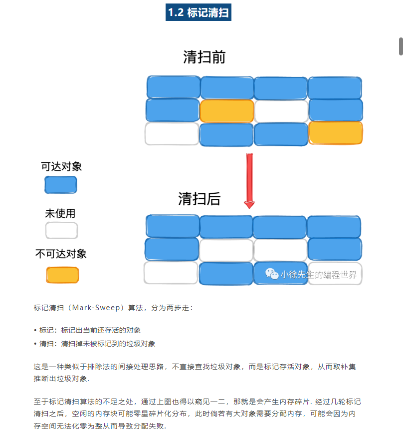
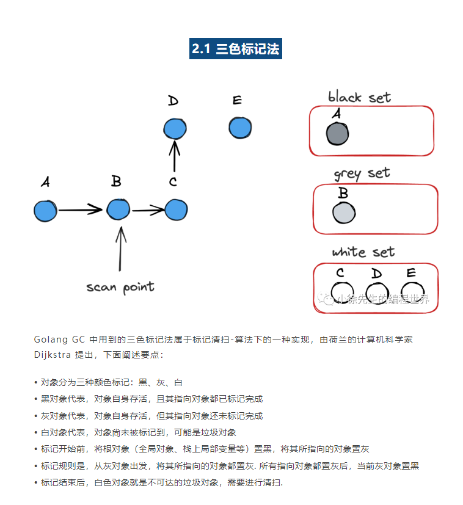
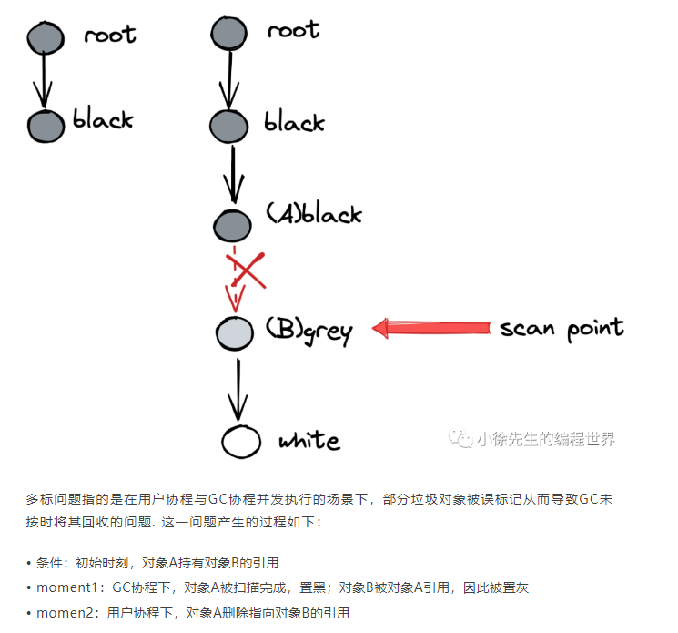

参考内容：
https://blog.csdn.net/qq_43716830/article/details/124405506
小徐先生的编程世界

## 1. 进程、线程、协程

进程：资源分配和CPU调度的基本单位

线程：CPU调度的基本单位，线程除了有一些自己的必要的堆栈空间之外，其它的资源都是共享的线程中的，共享的资源包括：

```txt
1.所有线程共享相同的虚拟地址空间，即它们可以访问同样的代码段、数据段和堆栈段。
2.文件描述符：进程打开的文件描述符是进程级别的资源，所以同一个进程中的线程可以共享打开的文件描述符，这意味着它们可以同时读写同一个文件。
3.全局变量：全局变量是进程级别的变量，因此可以被同一个进程中的所有线程访问和修改。
4.静态变量：静态变量也是进程级别的变量，在同一个进程中的线程之间共享内存空间。
5.进程ID、进程组ID
```

独占的资源：
```txt
1、线程ID
2、寄存器组的值
3、线程堆栈
4、错误返回码
5、信号屏蔽码
6、线程的优先级
```

协程：用户态的线程，可以通过用户程序创建、删除。协程切换时不需要切换内核态。

协程与线程的区别：
```txt
1.线程是操作系统的概念，而协程是程序级的概念。线程由操作系统调度执行，每个线程都有自己的执行上下文，包括程序计数器、寄存器等。而协程由程序自身控制。
2.多个线程之间通过切换执行的方式实现并发。线程切换时需要保存和恢复上下文，涉及到上下文切换的开销。而协程切换时不需要操作系统的介入，只需要保存和恢复自身的上下文，切换开销较小。
3.线程是抢占式的并发，即操作系统可以随时剥夺一个线程的执行权。而协程是合作式的并发，协程的执行权由程序自身决定，只有当协程主动让出执行权时，其他协程才会得到执行机会。
```

线程的优点
```txt
1.创建一个新线程的代价要比创建一个新进程小的多
2.线程之间的切换相较于进程之间的切换需要操作系统做的工作很少
3.线程占用的资源要比进程少很多
4.能充分利用多处理器的可并行数量
5.等待慢速 IO操作结束以后，程序可以执行其他的计算任务
```

缺点：
```txt
1.性能损失（ 一个计算密集型线程是很少被外部事件阻塞的，无法和其他线程共享同一个处理器，当计算密集型的	线程的数量比可用的处理器多，那么就有可能有很大的性能损失，这里的性能损失是指增加了额外的同步和调度开销，二可用资源不变。）
2.健壮性降低（线程之间是缺乏保护性的。在一个多线程程序里，因为时间上分配的细微差距或者是共享了一些不应该共享的变量而造成不良影响的可能影响是很大的。）
3.缺乏访问控制（ 因为进程是访问控制的基本粒度，在一个线程中调用某些OS函数会对整个进程造成影响 。）
4.编程难度提高（编写和 调试一个多线程程序比单线程困难的多。）
```

有栈协程和无栈协程
```txt
有栈协程：把局部变量放入到新开的空间上，golang的实现，类似于内核态线程的实现，不同协程间切换还是要切换对应的栈上下文，只是不用陷入内核

无栈协程：直接把局部变量放入系统栈上，js、c++、rust那种await、async实现，主要原理就是闭包+异步，换句话说，其实就是协程的上下文都放到公共内存中，协程切换时，使用状态机来切换，就不用切换对应的上下文了，因为都在堆里的。比有栈协程都要轻量许多。
```
## 2. 内存模型

虚拟内存，其作用如下：
• 在用户与硬件间添加中间代理层（没有什么是加一个中间层解决不了的）
• 优化用户体验（进程感知到获得的内存空间是“连续”的）
• “放大”可用内存（虚拟内存可以由物理内存+磁盘补足，并根据冷热动态置换，用户无感知）

操作系统中通常会将虚拟内存和物理内存切割成固定的尺寸，于虚拟内存而言叫作“页”，于物理内存而言叫作“帧”，原因及要点如下：
• 提高内存空间利用（以页为粒度后，消灭了不稳定的外部碎片，取而代之的是相对可控的内部碎片）
• 提高内外存交换效率（更细的粒度带来了更高的灵活度）
• 与虚拟内存机制呼应，便于建立虚拟地址->物理地址的映射关系（聚合映射关系的数据结构，称为页表）
• linux 页/帧的大小固定，

### golang 内存模型

• 以空间换时间，一次缓存，多次复用

由于每次向操作系统申请内存的操作很重，那么不妨一次多申请一些，以备后用.

Golang 中的堆 mheap 正是基于该思想，产生的数据结构. 我们可以从两个视角来解决 Golang 运行时的堆：

I 对操作系统而言，这是用户进程中缓存的内存

II 对于 Go 进程内部，堆是所有对象的内存起源

• 多级缓存，实现无/细锁化


堆是 Go 运行时中最大的临界共享资源，这意味着每次存取都要加锁，在性能层面是一件很可怕的事情.

在解决这个问题，Golang 在堆 mheap 之上，依次细化粒度，建立了 mcentral、mcache 的模型，下面对三者作个梳理：

• mheap：全局的内存起源，访问要加全局锁

• mcentral：每种对象大小规格（全局共划分为 68 种）对应的缓存，锁的粒度也仅限于同一种规格以内

• mcache：每个 P（正是 GMP 中的 P）持有一份的内存缓存，访问时无锁

注重于宏观架构即可.

• 多级规格，提高利用率


## 2. Go语言——垃圾回收

### 2.0 原理

垃圾回收：由垃圾收集器以类似守护协程的方式在后台运作，按照既定的策略为用户回收那些不再被使用的对象，释放对应的内存空间.

（1）GC 带来的优势包括

+ 屏蔽内存回收的细节： 更好地聚焦于核心的业务逻辑.
+ 以全局视野执行任务： 各自模块间，不可避免会涉及到临界资源的使用. 此时由于缺乏全局的视野，手动对内存进行管理无疑会增加开发者的心智负担. 

（2）GC 带来的劣势：

+ 提高了下限但降低了上限： 
+ 增加了额外的成本： 需要额外的状态信息用以存储全局的内存使用情况. 且部分时间需要中断整个程序用以支持垃圾回收工作的执行，这些都是GC额外产生的成本.

### 2.1 标记清扫



Go V1.3之前的标记-清除：
1.暂停业务逻辑，找到不可达的对象，和可达对象
2.开始标记，程序找出它所有可达的对象，并做上标记
3.标记完了之后，然后开始清除未标记的对象。
4.停止暂停，让程序继续跑。然后循环重复这个过程，直到process程序生命周期结束

标记-清除的缺点：
+ STW（stop the world）：让程序暂停，程序出现卡顿
+ 标记需要扫描整个heap
+ 清除数据会产生heap碎片

### 2.2 标记压缩


### 2.3 半空间复制


### 2.4 引用计数


### golang gc

**并发三色标记法+混合写屏障机制**;



“根对象所指向的对象” 指的是与根对象存在直接引用关系的对象。

比如有一个函数func test()，在函数内部定义了一个局部变量var a A，这里的a就是一个根对象，如果A结构体中有一个字段b，它指向另一个对象B，那么B就是根对象a所指向的对象。当函数执行时，a在栈上有自己的内存空间，它对B对象的引用使得B成为与根对象a直接关联的对象。

问题1：Golang 并发垃圾回收可能存在漏标问题


在上述场景中，由于GC协程在B删除C的引用后才开始扫描B，因此无法到达C. 又因为A已经被置黑，不会再重复扫描，因此从扫描结果上看，C是不可达的.

然而事实上，C应该是存活的（被A引用），而GC结束后会因为C仍为白色，因此被GC误删.

漏标问题是无法接受，其引起的误删现象可能会导致程序出现致命的错误. 针对漏标问题，Golang 给出的解决方案是屏障机制的使用.

问题2：Golang 并发垃圾回收可能存在多标问题



上述场景引发的问题是，在事实上，B在被A删除引用后，已成为垃圾对象，但由于其事先已被置灰，因此最终会更新为黑色，不会被GC删除.

错标问题对比于漏标问题而言，是相对可以接受的. 其导致本该被删但仍侥幸存活的对象被称为“浮动垃圾”，至多到下一轮GC，这部分对象就会被GC回收，因此错误可以得到弥补.

问题3：Golang 垃圾回收如何解决内存碎片问题？


Golang采用 TCMalloc 机制，依据对象的大小将其归属为到事先划分好的spanClass当中，这样能够消解外部碎片的问题，将问题限制在相对可控的内部碎片当中.

基于此，Golang选择采用实现上更为简单的标记清扫算法，避免使用复杂度更高的标记压缩算法，因为在 TCMalloc 框架下，后者带来的优势已经不再明显.

（4）Golang为什么不选择分代垃圾回收机制？


分代算法指的是，将对象分为年轻代和老年代两部分（或者更多），采用不同的GC策略进行分类管理. 分代GC算法有效的前提是，绝大多数年轻代对象都是朝生夕死，拥有更高的GC回收率，因此适合采用特别的策略进行处理.

然而Golang中存在内存逃逸机制，会在编译过程中将生命周期更长的对象转移到堆中，将生命周期短的对象分配在栈上，并以栈为单位对这部分对象进行回收.

综上，内存逃逸机制减弱了分代算法对Golang GC所带来的优势，考虑分代算法需要产生额外的成本（如不同年代的规则映射、状态管理以及额外的写屏障），Golang 选择不采用分代GC算法.

####  屏障机制

解决漏标问题；

漏标问题的本质就是，一个已经扫描完成的黑对象指向了一个被灰\白对象删除引用的白色对象. 构成这一场景的要素拆分如下：

（1）黑色对象指向了白色对象

（2）灰、白对象删除了白色对象

（3）（1）、（2）步中谈及的白色对象是同一个对象

（4）（1）发生在（2）之前

一套用于解决漏标问题的方法论称之为强弱三色不变式：

• 强三色不变式：白色对象不能被黑色对象直接引用（直接破坏（1））

• 弱三色不变式：白色对象可以被黑色对象引用，但要从某个灰对象出发仍然可达该白对象（间接破坏了（1）、（2）的联动）


> 混合写屏障

真实场景中，需要补充一个新的设定——屏障机制无法作用于栈对象.

这是因为栈对象可能涉及频繁的轻量操作，倘若这些高频度操作都需要一一触发屏障机制，那么所带来的成本将是无法接受的.

在这一背景下，单独看插入写屏障或删除写屏障，都无法真正解决漏标问题，除非我们引入额外的Stop the world（STW）阶段，对栈对象的处理进行兜底。

为了消除这个额外的 STW 成本，Golang 1.8 引入了混合写屏障机制，可以视为糅合了插入写屏障+删除写屏障的加强版本，要点如下：

• GC 开始前，以栈为单位分批扫描，将栈中所有对象置黑

• GC 期间，栈上新创建对象直接置黑

• 堆对象正常启用插入写屏障

• 堆对象正常启用删除写屏障


GC垃圾收集的多个阶段：
1.标记准备阶段；

> 启动后台标记任务
> 暂停程序（STW），所有的处理器在这时会进入安全点（Safe point）；
> 如果当前垃圾收集循环是强制触发的，我们还需要处理还未被清理的内存管理单元；
> 将根对象入队
> 开启写屏障

2.标记阶段；

> 恢复用户协程
> 使用三色标记法开始标记，此时用户协程和标记协程并发执行

3.标记终止阶段；

> 暂停用户协程
> 计算下一次触发GC时需要达到的堆目标
> 唤醒后台清扫协程

4.清理阶段；

> 关闭写屏障
> 恢复用户协程
> 异步清理回收

什么是根对象？
根对象（root object）是指那些能够从全局可达的地方访问到的对象。垃圾回收器会从根对象开始，通过遍历根对象的引用关系，逐步追踪并标记所有可达的对象。任何未被标记的对象都会被认为是垃圾，最终被回收释放。

```txt
1.全局变量：全局变量可以被程序中的任何位置引用到，因此是根对象。
2.当前正在执行的函数的局部变量：当一个函数正在执行时，其局部变量可以被当前函数中的代码访问到，因此也是根对象。
3.当前正在执行的 goroutine 的栈中的变量：goroutine 是 Go语言并发编程中的轻量级线程，每个 goroutine 都有一块独立的栈空间，其中的变量可以被当前goroutine 访问到，也是根对象。
4.其他和运行时系统相关的数据结构和变量。
```

三色标记法的缺点：
```txt
1.暂停时间：在进行垃圾回收时，必须停止程序执行，这会导致应用程序暂停。引入写屏障保护可以减少暂停时间，但仍然可能导致性能下降。
2.内存开销：三色标记法需要为每个对象维护额外的状态信息，以记录其标记状态。这会增加内存开销，并可能对内存资源造成负担。
3.频繁的垃圾回收：三色标记法需要频繁地迭代标记和清除对象，如果要回收的垃圾对象很多，可能会导致回收过程变得非常耗时。
4.碎片化：垃圾回收过程中，如果频繁进行对象的移动和重新分配内存，可能会导致内存碎片化，降低内存的利用率。
```

## 3. GC的触发条件

1.主动触发(手动触发)，通过调用 runtime.GC 来触发GC，此调用阻塞式地等待当前GC运行完毕。

2.被动触发，分为两种方式：

2.1.使用步调（Pacing）算法，其核心思想是控制内存增长的比例,每次内存分配时检查当前内存分配量是否已达到阈值（环境变量GOGC）：默认100%，即当内存扩大一倍时启用GC。

2.2.使用系统监控，当超过两分钟没有产生任何GC时，强制触发 GC。

## 4. GC调优

1.控制内存分配的速度，限制Goroutine的数量，提高赋值器mutator的CPU利用率（降低GC的CPU利用率）
2.少量使用+连接string
3.slice提前分配足够的内存来降低扩容带来的拷贝
4.避免map key对象过多，导致扫描时间增加
5.变量复用，减少对象分配，例如使用sync.Pool来复用需要频繁创建临时对象、使用全局变量等
6.增大GOGC的值，降低GC的运行频率

## 5. GMP调度和CSP模型
## 6. Groutine的切换时机
## 7. Goroutine调度原理
## 8. Goroutine的抢占式调度
## 9. Context结构原理
## 10. Context原理
## 11. Golang内存分配机制
## 12. 竞态、内存逃逸
## 13. golang内存对齐机制
## 14. golang中new和make的区别？
## 15. Golang的slice的实现原理
## 16. Golang中，array和slice的区别
## 17. Golang的map实现原理
## 18. Golang的map为什么是无序的？
## 19. Golang的map如何查找？
## 20. 为什么Golang的Map的负载因子是6.5？
## 21. Golang map如何扩容
## 22. Golang的sync.Map
## 23. Golang中对nil的Slice和空Slice的处理是一致的吗?
## 24. Golang的内存模型中为什么小对象多了会造成GC压力？
## 25. Channel的实现原理
## 26. Channel是同步的还是异步的？
## 27. Channel死锁场景
## 28. Golang互斥锁的实现原理
## 29. Goroutine的枪锁模式
## 30. 读写锁原理
## 31. Golang的原子操作有哪些？
## 32. 原子操作和锁的区别
## 33. Goroutine的实现原理
## 34. Groutine的泄露
## 35. 怎么查看Goroutine的数量？怎么限制Goroutine的数量？
## 36. Goroutine和线程的区别？
## 37. Go的Struct能不能比较？
## 38. Go的Slice如何扩容？
## 39. 在Go函数中为什么会发生内存泄露？发生了泄漏如何检测？
## 40. Go中两个Nil可能不相等吗？
## 41. Go语言中的内存对齐
## 42. interface底层原理
## 43. 两个 interface 可以比较吗？
## 44. go 打印时 %v %+v %#v 的区别？
## 45. 什么是 rune 类型？
## 46. 空 struct{} 占用空间么？用途是什么？
## 47. golang值接收者和指针接收者的区别
## 48. 引用传递和值传递
## 49. defer关键字的实现原理
## 50. Select底层原理
## 51. gRPC
## 52. 服务发现是怎么做的？
## 53. 设计模式
## 54. 反射
## 55. Golang字符串拼接对比
## 56. 常见字符集
## 57. String和[]byte的区别
## 58. HTTP和RPC对比
## 59. gRPC和RPC对比
## 60. Sync.Pool的使用
## 61. JWT
## 62. Gin框架
## 63. 协程池
## 64. math/rand
## 65. golang中指针的作用
