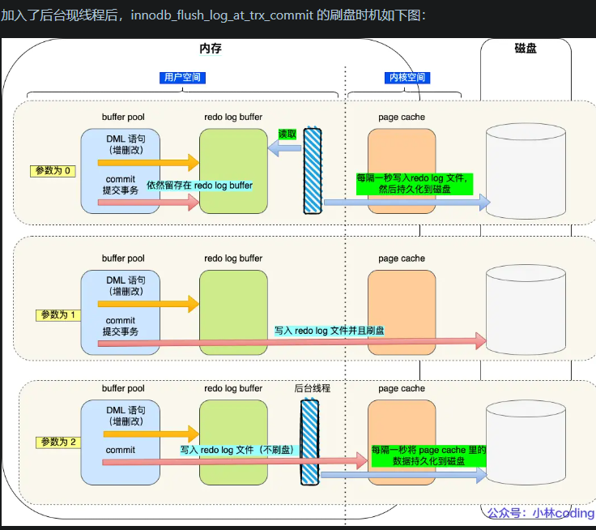
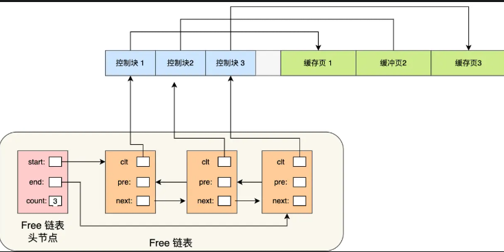

### 1. 一条sql执行慢的原因？如何优化？

1、大多数情况下很正常，偶尔很慢，则有如下原因

(1)、数据库在刷新脏页，例如 redo log 写满了需要同步到磁盘。
(2)、执行的时候，遇到锁，如表锁、行锁。
(3)、sql写的烂了

2、这条 SQL 语句一直执行的很慢，则有如下原因
(1)、没有用上索引或则索引失效：例如该字段没有索引；或则由于对字段进行运算、函数操作导致无法用索引。
(2)、有索引可能会走全表扫描

怎样判断是否走全表扫描：
索引区分度（索引的值不同越多，区分度越高），称为基数，而数据量大时不可能全部扫描一遍得到基数，而是采样部分数据进行预测，那有可能预测错了，导致走全表扫描。

**如何忧患一条慢sql**

> 数据库中设置SQL慢查询

开启慢查询日志：通过设置 slow_query_log 参数为 ON，并指定 long_query_time 阈值（单位为秒），MySQL 会将执行时间超过该阈值的查询记录到慢查询日志中。例如：

```sql
SET GLOBAL slow_query_log = 'ON';
SET GLOBAL long_query_time = 2;
```

> 分析慢查询日志

可以通过如下命令定位低效率执行sql
+ show processlist；
sql 可以用 explain 分析执行计划。

怎样使用explain的？对于执行计划你是怎样分析的？

type：表示MySQL在表中找到所需行的方式，或者叫访问类型
+ type=ALL，全表扫描，MySQL遍历全表来找到匹配行
+ type=index，索引全扫描
+ type=range，索引范围扫描
+ type=eq_ref，唯一索引
+ type=NULL，MySQL不用访问表或者索引，直接就能够得到结果（性能最好）

possible_keys: 表示查询可能使用的索引，这些索引是根据查询条件和表结构推测出来的，但不一定会实际使用。

key: 实际使用的索引

key_len: 使用索引字段的长度，该值可以帮助我们判断索引的使用情况，长度越短，索引效率越高。

rows: 扫描行的数量，，这只是一个估计值，并不一定是实际扫描的行数。

Extra：
+ using index：覆盖索引，不回表
+ using where：回表查询
+ using filesort：需要额外的排序，不能通过索引得到排序结果
+ Using temporary：表示 MySQL 使用了临时表来处理查询，通常出现在 GROUP BY 或 ORDER BY 操作中，可能会影响性能。
+  Using index condition 

> 为什么 Using filesort 不是好现象

+ 性能开销大：Using filesort 意味着 MySQL 无法直接使用索引完成排序操作，需要在内存或磁盘上创建临时文件对数据进行排序。如果数据量较大，磁盘 I/O 操作会显著增加，导致查询性能下降。
+ 资源占用高：排序操作需要额外的内存和 CPU 资源，当并发查询较多时，可能会导致服务器资源紧张，影响整体性能。

> 处理 Using filesort 的方法

1.  确保排序字段使用合适的索引

原理：如果查询的 ORDER BY 子句中的字段有合适的索引，MySQL 可以直接利用索引的有序性进行排序，避免文件排序。

2. 优化索引顺序

原理：当 ORDER BY 子句和 WHERE 子句同时存在时，要确保索引的顺序与查询中的字段顺序一致，这样可以最大程度地利用索引。

3. 避免在排序字段上使用函数或表达式

原理：如果在 ORDER BY 子句中对字段使用函数或表达式，MySQL 无法直接使用索引进行排序，只能进行文件排序。

> 为什么加索引就不用额外排序

索引的有序性:
原理：数据库中的索引是一种数据结构（如 B 树或 B+ 树），它会按照索引列的值进行排序存储。当查询需要对某列进行排序时，如果该列上有索引，MySQL 可以直接利用索引的有序性来获取数据，而无需再对数据进行额外的排序操作。

覆盖索引
原理：覆盖索引是指查询所需的所有数据都可以从索引中获取，而无需再回表查询实际的数据行。当使用覆盖索引进行排序时，由于索引本身就是有序的，MySQL 可以直接在索引上完成排序操作，不需要对数据行进行额外的排序。

索引扫描方式
原理：MySQL 有不同的索引扫描方式，如范围扫描、索引顺序扫描等。当使用合适的索引进行查询时，MySQL 可以选择合适的扫描方式，以有序的方式访问数据，从而避免额外的排序。


> 慢sql如何优化  

对于MYSQL慢sql语句的优化，我们也可以分几个方面来进行分析：索引+sql语句+数据库结构优化+优化器优化+架构优化。

索引：

1、尽量覆盖索引，支持索引下推

2、组合索引符合最左匹配原则

3、避免索引失效、

4、再写多读少的场景下，可以选择普通索引而不要唯一索引

更新时，普通索引可以使用change buffer进行优化，减少磁盘IO,将更新操作记录到change bufer，等查询来了将数据读到内存再进行修改.
插入性能：
+ 唯一索引：在插入数据时，数据库需要额外检查插入的值是否违反唯一性约束。

5、索引建立原则（一般建在where和order by，基数要大，区分度要高，不要过度索引，外键建索引）

sql语句

1、分页查询优化
该方案适用于主键自增的表，可以把Limit查询转换成某个位置的查询。
select * from tb_sku where id>20000 limit 10;

2、优化insert语句

多条插入语句写成一条
在事务中插数据
数据有序插入（主键索引）

数据库结构优化
1、将字段多的表分解成多个表
有些字段使用频率高，有些低，数据量大时，会由于使用频率低的存在而变慢，可以考虑分开。
2、对于经常联合查询的表，可以考虑建立中间表

### 2. 在 MySQL 中，普通索引、唯一索引和主键索引对 NULL 值的支持情况各不相同:

1. 功能区别

（1）主键索引

主键也是一种索引，且是我们最常用的索引，使用方法为`primary key(ColumnList)`。
一张表只允许一个主键索引，且主键列的值不允许重复，不允许为空`NULL`。
这是因为主键的主要作用是确保记录的唯一性和完整性，如果允许 NULL 值，就无法保证能唯一标识每一行数据

```sql
-- 创建一个名为 products 的表，并将 id 字段设置为主键
CREATE TABLE products (
    id INT PRIMARY KEY,
    product_name VARCHAR(200),
    price DECIMAL(10, 2)
);

-- 为已存在的表添加主键索引
ALTER TABLE existing_table ADD PRIMARY KEY (column_name);
```

（2）唯一索引

使用方法是`unique index IndexName(ColumnList)`。
一张表格可以有多个唯一索引，唯一索引列的值不允许重复，但允许为空`NULL`。
这是因为在 SQL 标准里，NULL 代表未知值，两个 NULL 值被认为是不相等的，所以可以在唯一索引列中有多个 NULL 值。
```sql
-- 创建一个名为 employees 的表，并为 email 字段创建唯一索引
CREATE TABLE employees (
    id INT,
    email VARCHAR(100),
    salary DECIMAL(10, 2),
    -- 使用 UNIQUE INDEX 关键字创建唯一索引
    UNIQUE INDEX idx_email (email)
);

-- 为已存在的 employees 表的 salary 字段创建唯一索引
CREATE UNIQUE INDEX idx_salary ON employees (salary);
```

（3）普通索引

普通索引是最基本的索引类型，它的作用仅仅是加快对数据的访问速度，不限制索引列的值是否唯一，也不限制是否为 NULL。所以，普通索引的字段可以为 NULL，而且可以有多个 NULL 值。

```sql
-- 创建一个名为 users 的表，并为 name 字段创建普通索引
CREATE TABLE users (
    id INT,
    name VARCHAR(50),
    age INT,
    -- 使用 INDEX 关键字创建普通索引
    INDEX idx_name (name)
);

-- 为已存在的 users 表的 age 字段创建普通索引
CREATE INDEX idx_age ON users (age);
```

（4） 联合索引

实际上，所有的索引都可以由多个字段列创建，这就叫联合索引。
但联合索引的功能区别也跟单列索引的功能区别一致。


2. 使用条件

1 索引列的数值

索引列、或者组成索引列的数值尽可能唯一。
唯一的数值索引，在查询的时候可以更快的定位数据记录。

2 数据类型选择

整型（int）的索引列查询效率要比字符串（char、varchar、text）高。

3 数据表复杂且量大

索引的创建会对应维护一张索引表，因此在采用索引时候应该是因为数据表复杂且量大。


### 3. sql数组分组用什么命令？group by, join, order by, limit 的优先级

在 SQL 中，若要对数组（一般是指表中的行数据集合）进行分组操作，主要使用 GROUP BY 子句。

GROUP BY 子句的作用 : GROUP BY 用于将结果集按照一个或多个列进行分组，结合聚合函数（如 SUM、COUNT、AVG、MAX、MIN 等）可以对每个分组进行统计计算。

总结一下，这些子句的执行顺序（优先级）为：JOIN > GROUP BY > ORDER BY > LIMIT 。

from > join > where > group by >  having > select > distinct > order by > limit;

1. 首先执行 JOIN 操作，它会根据指定的连接条件将多个表组合成一个临时结果集。
2. 对 JOIN 操作后的临时结果集按照 GROUP BY 指定的列进行分组。分组后可以使用聚合函数对每个分组进行计算。例如：
3. ORDER BY 用于对分组后的结果集进行排序，可以按照一个或多个列进行升序（ASC，默认）或降序（DESC）排序。
4. LIMIT 用于限制查询结果返回的行数，通常在排序之后使用，以获取排序后结果集的前几行。


### 4. MyISAM和Inodb的区别，和使用场景

事务支持,外键约束,锁机制,崩溃恢复,数据和索引存储方式

1. 事务支持

InnoDB 支持ACID 事务，适合需要高可靠性的场景。而 MyISAM 和 Memory 不支持事务

2. 外键约束

InnoDB 支持外键，而 MyISAM 和 Memory 不支持外键。

> 外键（Foreign Key）是一种用于建立和加强两个表之间数据联系的约束机制，它确保了数据的引用完整性。

3. 锁机制

InnoDB 支持行级锁和表级锁，默认使用行级锁。而 MyISAM 和 Memory 只支持表级锁，不支持行级锁。

4. 数据和索引存储方式

这三种存储引擎都支持B+Tree 索引；
+ InnoDB 支持聚簇索引，其他两种存储引擎不支持；
+ Memory 支持哈希索引，其他两种存储引擎不支持；
+ MyISAM 支持全文索引，InnoDB 也在 MySQL5.6 后支持全文索引，但 Memory 不支持全文索引。

5. 在数据存储方式上

+ 如果是 InnoDB，数据以 聚簇索引的方式存储，数据按主键顺序存储；
+ 如果是 MyISAM，数据和索引分开存储；
+ 如果是 Memory，数据存储在内存中，不支持持久化。


因为它们有这些区别，这三种存储引擎的使用场景也不一样：

1. 在 MySQL5.5 后，InnoDB 是 MySQL 的默认存储引擎。如果应用对事务的完整性有比较高的要求，在并发条件下要求数据的一致性，数据操作除了插入和查询之外，还包含很多的更新、删除操作，那么 InnoDB 存储引擎是比较合适的选择。（高并发读写、需事务的场景）

2. 在 MySQL5.5 前，MyISAM 是 MySQL 的默认存储引擎。如果应用是以读操作和插入操作为主，只有很少的更新和删除操作，并且对事务的完整性、并发性要求不是很高，那么选择这个存储引擎是非常合适的。适用于这种场景的还有 MongoDB 数据库。（读多写少、静态数据，如日志表）

3. Memory 则通常用于临时表及缓存。适用于这种场景的还有 Redis 数据库。


### 5. 分布式锁怎么实现的?分布式锁有效性怎么保证?

1. 为什么要使用分布式锁

一种跨机器的互斥机制来控制共享资源的访问，这就是分布式锁要解决的问题！


1. 基于数据库实现
悲观锁实现
原理：利用数据库的行级锁或表级锁，在事务中对某一行或整个表加锁，确保同一时间只有一个事务可以对其进行操作，从而实现分布式锁。
```sql

```

乐观锁实现
原理：通过在表中添加版本号字段，在更新数据时检查版本号是否与查询时一致，如果一致则更新数据并更新版本号，否则表示数据已被其他事务修改，需要重试。
```sql
-- 创建带版本号的表
CREATE TABLE resource (
    id INT PRIMARY KEY,
    data VARCHAR(255),
    version INT DEFAULT 0
);

-- 获取锁（尝试更新版本号）
UPDATE resource
SET data = 'new_data', version = version + 1
WHERE id = 1 AND version = (SELECT version FROM resource WHERE id = 1);
```

### 6. 事务篇

#### 6.1 事务有那些特性

原子性（Atomicity）：undo log（回滚日志） 来保证的；
隔离性（Isolation）：通过 MVCC（多版本并发控制） 或锁机制来保证的；
持久性（Durability）：通过 redo log （重做日志）来保证的；
一致性（Consistency）：是通过持久性+原子性+隔离性来保证；

#### 6.2 并发事务会引发什么问题

+ 脏读 ： 如果一个事务「读到」了另一个「未提交事务修改过的数据」，就意味着发生了「脏读」现象。

+ 不可重复读 ：在一个事务内多次读取同一个数据，如果出现前后两次读到的数据不一样的情况；

+ 幻读 ：在一个事务内多次查询某个符合查询条件的「记录数量」，如果出现前后两次查询到的记录数量不一样的情况，就意味着发生了「幻读」现象。

#### 6.3 事务的隔离级别有哪些

+ 读未提交：指一个事务还没提交时，它做的变更就能被其他事务看到；
+ 读提交：指一个事务提交之后，它做的变更才能被其他事务看到；
+ 可重复读 ： 指一个事务执行过程中看到的数据，一直跟这个事务启动时看到的数据是一致的，MySQL InnoDB 引擎的默认隔离级别；
+ 串行化： 会对记录加上读写锁，在多个事务对这条记录进行读写操作时，如果发生了读写冲突的时候，后访问的事务必须等前一个事务执行完成，才能继续执行；


MySQL InnoDB 引擎的默认隔离级别虽然是「可重复读」，但是它很大程度上避免幻读现象;解决的方案有两种：

+ 针对快照读（普通 select 语句）:是通过 MVCC 方式解决了幻读，因为可重复读隔离级别下，事务执行过程中看到的数据，一直跟这个事务启动时看到的数据是一致的，即使中途有其他事务插入了一条数据，是查询不出来这条数据的，所以就很好了避免幻读问题。
+ 针对当前读（select ... for update 等语句），是通过 next-key lock（记录锁+间隙锁）方式解决了幻读，），是通过 next-key lock（记录锁+间隙锁）方式解决了幻读，如果有其他事务在 next-key lock 锁范围内插入了一条记录，那么这个插入语句就会被阻塞，无法成功插入，所以就很好了避免幻读问题。

> 这四种隔离级别具体是如何实现的呢？

+ 对于「读未提交」隔离级别的事务来说，因为可以读到未提交事务修改的数据，所以直接读取最新的数据就好了；

+ 对于「串行化」隔离级别的事务来说，通过加读写锁的方式来避免并行访问；

+ 对于「读提交」和「可重复读」隔离级别的事务来说，它们是通过 Read View 来实现的，它们的区别在于创建 Read View 的时机不同.「读提交」隔离级别是在「每个语句执行前」都会重新生成一个 Read View，而「可重复读」隔离级别是「启动事务时」生成一个 Read View，然后整个事务期间都在用这个 Read View。


> 在 MySQL 有两种开启事务的命令

第一种：begin/start transaction 命令；
第二种：start transaction with consistent snapshot 命令；

+ 第一种：不代表事务启动了。只有在执行这个命令后，执行了第一条 select 语句，才是事务真正启动的时机；
+ 第二种：马上启动事务。

#### 6.4 read view在MVCC中如何工作的

+ Read View 中四个字段作用；
+ 聚簇索引记录中两个跟事务有关的隐藏列；


+ m_ids：指的是在创建 Read View 时，当前数据库中「活跃事务」的事务 id 列表
+ min_trx_id ：指的是在创建 Read View 时，当前数据库中「活跃事务」中事务 id 最小的事务
+ max_trx_id ：创建 Read View 时当前数据库中应该给下一个事务的 id 值
+ creator_trx_id ：的是创建该 Read View 的事务的事务 id。


通过「版本链」来控制并发事务访问同一个记录时的行为就叫 MVCC（多版本并发控制）

#### 6.5 可重复读是如何工作的

可重复读隔离级别是启动事务时生成一个 Read View，然后整个事务期间都在用这个 Read View.


#### 6.6 读提交是如何工作的

提交隔离级别是在每次读取数据时，都会生成一个新的 Read View。

也意味着，事务期间的多次读取同一条数据，前后两次读的数据可能会出现不一致，因为可能这期间，另外一个事务修改了该记录，并提交了事务。


#### 6.7 MySQL 可重复读隔离级别，完全解决幻读了吗？

只要 T1 和 T2 时刻执行产生的结果集是不相同的，那就发生了幻读的问题；

##### 6.7.1 快照读是如何避免幻读的？

可重复读隔离级是由 MVCC（多版本并发控制）实现的，实现的方式是开始事务后（执行 begin 语句后），在执行第一个查询语句后，会创建一个 Read View，后续的查询语句利用这个 Read View，通过这个 Read View 就可以在 undo log 版本链找到事务开始时的数据，所以事务过程中每次查询的数据都是一样的，即使中途有其他事务插入了新纪录，是查询不出来这条数据的，所以就很好了避免幻读问题。


##### 6.7.2 当前读如何避免幻读的？

MySQL 里除了普通查询是快照读，其他都是当前读，比如 update、insert、delete，这些语句执行前都会查询最新版本的数据，然后再做进一步的操作。

Innodb 引擎为了解决「可重复读」隔离级别使用「当前读」而造成的幻读问题，就引出了间隙锁。

比如说：

事务 A 执行了这面这条锁定读语句后，就在对表中的记录加上 id范围为 (2, +∞] 的 next-key lock（next-key lock 是间锁+记录锁的组合）

然后，事务 B 在执行插入语句的时候，判断到插入的位置被事务 A 加了 next-key lock，于是事物 B会生成一个插入意向锁，同时进入等待状态，直到事务 A 提交了事务。这就避免了由于事务 B 插入新记录而导致事务 A 发生幻读的现象。

##### 6.7.3 幻读被完全解决了吗？

可重复读隔离级别下虽然很大程度上避免了幻读，但是还是没有能完全解决幻读。


要避免这类特殊场景下发生幻读的现象的话，就是尽量在开启事务之后，马上执行 select ... forupdate 这类当前读的语句，因为它会对记录加 next-key lock，从而避免其他事务插入一条新记录。

### 7. 索引篇

#### 7.1 什么是索引？

MySQL 索引是一种用于提高数据库查询效率的数据结构，它就像书籍的目录一样，能帮助数据库快速定位到所需的数据，而不必逐行扫描整个表。

存储引擎：说白了就是如何存储数据、如何为存储的数据建立索引和如何更新、查询数据等技术的实现方法。MySQL 存储引擎有 MyISAM 、InnoDB、Memory。

索引的定义就是帮助存储引擎快速获取数据的一种数据结构，形象的说就是索引是数据的目录。

+ 按「数据结构」分类：B+tree索引、Hash索引
+ 按「物理存储」分类：聚簇索引（主键索引）、二级索引（辅助索引）。
+ 按「字段特性」分类：主键索引、唯一索引、普通索引、前缀索引。
+ 按「字段个数」分类：单列索引、联合索引。

B+Tree 相比于 B 树和二叉树来说，最大的优势在于查询效率很高，因为即使在数据量很大的情况，查询一个数据的磁盘 I/O 依然维持在 3-4次。

+ 主键索引的 B+Tree 的叶子节点存放的是实际数据，所有完整的用户记录都存放在主键索引的 B+Tree 的叶子节点里；
+ 二级索引的 B+Tree 的叶子节点存放的是主键值，而不是实际数据。

会先检二级索引中的 B+Tree 的索引值（商品编码，product_no），找到对应的叶子节点，然后获取主键值，然后再通过主键索引中的 B+Tree 树查询到对应的叶子节点，然后获取整行数据。这个过程叫「回表」，也就是说要查两个 B+Tree 才能查到数据。

不过，当查询的数据是能在二级索引的 B+Tree 的叶子节点里查询到，这时就不用再查主键索引查。

这种在二级索引的 B+Tree 就能查询到结果的过程就叫作「覆盖索引」，也就是只需要查一个 B+Tree 就能找到数据。

> 按「字段特性」分类：主键索引、唯一索引、普通索引、前缀索引。

+ 主键索引就是建立在主键字段上的索引，通常在创建表的时候一起创建，一张表最多只有一个主键索引，索引列的值不允许有空值。

+ 唯一索引建立在 UNIQUE 字段上的索引，一张表可以有多个唯一索引，索引列的值必须唯一，但是允许有空值。

+ 普通索引就是建立在普通字段上的索引，既不要求字段为主键，也不要求字段为 UNIQUE。

+ 前缀索引是指对字符类型字段的前几个字符建立的索引，而不是在整个字段上建立的索引，前缀索引是指对字符类型字段的前几个字符建立的索引，而不是在整个字段上建立的索引，

使用前缀索引的目的是为了减少索引占用的存储空间，提升查询效率。

> 按「字段个数」分类：单列索引、联合索引。

+ 建立在单列上的索引称为单列索引，比如主键索引；
+ 建立在多列上的索引称为联合索引；


使用联合索引时，存在最左匹配原则，也就是按照最左优先的方式进行索引的匹配。在使用联合索引进行查询的时候，如果不遵循「最左匹配原则」，联合索引会失效，这样就无法利用到索引快速查询的特性了。

(a, b, c) 联合索引，是先按 a 排序，在 a 相同的情况再按 b排序，在 b 相同的情况再按 c 排序。所以，b 和 c 是全局无序，局部相对有序的，这样在没有遵循最左匹配原则的情况下，是无法利用到索引的。

> 联合索引范围查询

联合索引有一些特殊情况，并不是查询过程使用了联合索引查询，就代表联合索引中的所有字段都用到了联合索引进行索引查询，也就是可能存在部分字段用到联合索引的 B+Tree，部分字段没有用到联合索引的 B+Tree 的情况。

联合索引的最左匹配原则会一直向右匹配直到遇到「范围查询」就会停止匹配。也就是范围查询的字段可以用到联合索引，但是在范围查询字段的后面的字段无法用到联合索引。

select * from t_table where a > 1 and b = 2 ，联合索引（a, b）哪一个字段用到了联合索引的 B+Tree？

这条查询语句只有 a 字段用到了联合索引进行索引查询，而 b 字段并没有使用到联合索引。


select * from t_table where a >= 1 and b = 2

对于符合 a = 1 的二级索引记录的范围里，b 字段的值是「有序」的
Q2 这条查询语句 a 和 b 字段都用到了联合索引进行索引查询。


SELECT * FROM t_table WHERE a BETWEEN  2 AND 8 AND b = 2
Q3 这条查询语句 a 和 b 字段都用到了联合索引进行索引查询。

key_len

SELECT * FROM t_user WHERE name like 'j%' and age = 22联合索引（name, age）哪一个字段用到了联合索引的 B+Tree？
4 这条查询语句 a 和 b 字段都用到了联合索引进行索引查询。

综上所示，联合索引的最左匹配原则，在遇到范围查询（如 >、<）的时候，就会停止匹配，也就是范围查询的字段可以用到联合索引，但是在范围查询字段的后面的字段无法用到联合索引。注意，对于 >=、<=、BETWEEN、like 前缀匹配的范围查询，并不会停止匹配

索引下推,索引区分度,联合索引进行排序

#### 7.2 什么时候需要/不需要索引

索引最大的好处是提高查询速度，但是索引也是有缺点的，比如:
+ 需要占用物理空间，数量越大，占用空间越大；
+ 创建索引和维护索引要耗费时间
+ 会降低表的增删改的效率，因为每次增删改索引，B+ 树为了维护索引有序性，都需要进行动态维护。

什么时候适用索引？
+ 字段有唯一性限制的，比如商品编码；
+ 经常用于 WHERE 查询条件的字段
+ 经常用于 GROUP BY 和 ORDER BY 的字段


什么时候不需要创建索引？
+ WHERE 条件，GROUP BY，ORDER BY 里用不到的字段
+ 字段中存在大量重复数据
+ 表数据太少的时候，不需要创建索引
+ 经常更新的字段不用创建索引

#### 7.3 有什么优化索引的方法

+ 前缀索引优化；
+ 覆盖索引优化； 联合索引，避免回表
+ 主键索引最好是自增的；
+ 索引最好设置为 NOT NULL
+ 防止索引失效；

前缀索引顾名思义就是使用某个字段中字符串的前几个字符建立索引，那我们为什么需要使用前缀来建立索引呢？

使用前缀索引是为了减小索引字段大小，可以增加一个索引页中存储的索引值，有效提高索引的查询速度。在一些大字符串的字段作为索引时，使用前缀索引可以帮助我们减小索引项的大小。

> 主键索引最好是自增的
InnoDB 创建主键索引默认为聚簇索引，数据被存放在了 B+Tree 的叶子节点上。也就是说，同一个叶子节点内的各个数据是按主键顺序存放的，因此，每当有一条新的数据插入时，数据库会根据主键将其插入到对应的叶子节点中。

如果我们使用自增主键，那么每次插入的新数据就会按顺序添加到当前索引节点的位置，不需要移动已有的数据，当页面写满，就会自动开辟一个新页面。，\每次插入一条新记录，都是追加操作，不需要重新移动数据，因此这种插入数据的方法效率非常高。

如果我们使用非自增主键，由于每次插入主键的索引值都是随机的，因此每次插入新的数据时，就可能会插入到现有数据页中间的某个位置，这将不得不移动其它数据来满足新数据的插入，甚至需要从一个页面复制数据到另外一个页面，我们通常将这种情况称为页分裂。页分裂还有可能会造成大量的内存碎片，导致索引结构不紧凑，从而影响查询效率。

另外，主键字段的长度不要太大，因为主键字段长度越小，意味着二级索引的叶子节点越小（二级索引的叶子节点存放的数据是主键值），这样二级索引占用的空间也就越小

> 覆盖索引优化

覆盖索引是指 SQL 中 query 的所有字段，在索引 B+Tree 的叶子节点上都能找得到的那些索引，从二级索引中查询得到记录，而不需要通过聚簇索引查询获得，可以避免回表的操作

> 索引最好设置为 NOT NULL

第一原因：索引列存在 NULL 就会导致优化器在做索引选择的时候更加复杂，更加难以优化，因为可为 NULL 的列会使索引、索引统计和值比较都更复杂，比如进行索引统计时，count 会省略值为NULL 的行。
第二个原因：NULL 值是一个没意义的值，但是它会占用物理空间，所以会带来的存储空间的问题，因为 InnoDB 存储记录的时候，如果表中存在允许为 NULL 的字段，，那么行格式 (opens new window)中至少会用 1 字节空间存储 NULL 值列表


> 防止索引失效

+ 当我们使用左或者左右模糊匹配的时候，也就是 like %xx 或者 like %xx%这两种方式都会造成索引失效；
+ 当我们在查询条件中对索引列做了计算、函数、类型转换操作
+ 联合索引要能正确使用需要遵循最左匹配原则，也就是按照最左优先的方式进行索引的匹配，否则就会导致索引失效。
+ 在 WHERE 子句中，如果在 OR 前的条件列是索引列，而在 OR 后的条件列不是索引列，那么索引会失效。


对于执行计划，参数有：
key 字段表示实际用的索引
key_len 表示索引的长度；
rows 表示扫描的数据行数
type 表示数据扫描类型，我们需要重点看这个。
+ All（全表扫描）；
+ index（全索引扫描）；
+ range（索引范围扫描）；
+ ref（非唯一索引扫描）；

#### 7.4 索引失效

+ 当我们使用左或者左右模糊匹配的时候，也就是 like %xx 或者 like %xx% 这两种方式都会造成索引失效；

+ 当我们在查询条件中对索引列使用函数，就会导致索引失效。

+ 当我们在查询条件中对索引列进行表达式计算，也是无法走索引的。

+ MySQL 在遇到字符串和数字比较的时候，会自动把字符串转为数字，然后再进行比较。如果字符串是索引列，而条件语句中的输入参数是数字的话，那么索引列会发生隐式类型转换，由于隐式类型转换是通过 CAST 函数实现的，等同于对索引列使用了函数，所以就会导致索引失效。

+ 联合索引要能正确使用需要遵循最左匹配原则，也就是按照最左优先的方式进行索引的匹配，否则就会导致索引失效。

+ 在 WHERE 子句中，如果在 OR 前的条件列是索引列，而在 OR 后的条件列不是索引列，那么索引会失效。


> 对索引使用左或者左右模糊匹配

select * from t_user where name like '林%';

也就是 like %xx 或者 like %xx% 这两种方式都会造成索引失效。

因为索引 B+ 树是按照「索引值」有序排列存储的，只能根据前缀进行比较。

> 对索引使用函数

select * from t_user where length(name)=6;

因为索引保存的是索引字段的原始值，而不是经过函数计算后的值，自然就没办法走索引了。

> 对索引进行表达式计算

explain select * from t_user where id + 1 = 10;

因为索引保存的是索引字段的原始值，而不是 id + 1 表达式计算后的值，所以无法走索引，只能通过把索引字段的取值都取出来，然后依次进行表达式的计算来进行条件判断，因此采用的就是全表扫描的方式。

> 对索引隐式类型转换

如果索引字段是字符串类型，但是在条件查询中，输入的参数是整型的话，你会在执行计划的结果发现这条语句会走全表扫描。

select * from t_user where phone = 1300000001;

explain select * from t_user where id = '1';

为什么第一个例子会导致索引失效，而第二例子不会呢？

**MySQL 在遇到字符串和数字比较的时候，会自动把字符串转为数字，然后再进行比较。**

第一个：elect * from t_user where CAST(phone AS signed int) = 1300000001;

可以看到，**CAST 函数**是作用在了 phone 字段，而 phone 字段是索引，也就是对索引使用了函数！而前面我们也说了，对索引使用函数是会导致索引失效的。

> 联合索引非最左匹配

联合索引要能正确使用需要遵循最左匹配原则，也就是按照最左优先的方式进行索引的匹配。

> WHERE 子句中的 OR

在 WHERE 子句中，如果在 OR 前的条件列是索引列，而在 OR 后的条件列不是索引列，那么索引会失效。

这是因为 OR 的含义就是两个只要满足一个即可，因此只有一个条件列是索引列是没有意义的，只要有条件列不是索引列，就会进行全表扫描。

#### 7.6 count(*) 和 count(1) 有什么区别？哪个性能最好？

> 哪种count性能最好？

count(*) = count(1) > count(主键字段) > count(字段)

> count() 是什么？

count() 是一个聚合函数，函数的参数不仅可以是字段名，也可以是其他任意表达式，该函数作用是统计符合查询条件的记录中，函数指定的参数不为 NULL 的记录有多少个。

假设 count() 函数的参数是字段名，如下

```sql
select count(name) from t_order;
```

这条语句是统计「 t_order 表中，name 字段不为 NULL 的记录」有多少个。也就是说，如果某一条记录中的 name 字段的值为 NULL，则就不会被统计进去。

再来假设 count() 函数的参数是数字 1 这个表达式，如下：

```sql
select count(1) from t_order;
```

这条语句是统计「 t_order 表中，1 这个表达式不为 NULL 的记录」有多少个。

1 这个表达式就是单纯数字，它永远都不是 NULL，所以上面这条语句，其实是在统计 t_order 表中有多少个记录。

> count(主键字段) 执行过程是怎样的？

在通过 count 函数统计有多少个记录时，MySQL 的 server 层会维护一个名叫 count 的变量。

server 层会循环向 InnoDB 读取一条记录，如果 count 函数指定的参数不为 NULL，那么就会将变量 count加 1，直到符合查询的全部记录被读完，就退出循环。最后将 count 变量的值发送给客户端。

InnoDB 是通过 B+ 树来保存记录的，根据索引的类型又分为聚簇索引和二级索引，它们区别在于，聚簇索引的叶子节点存放的是实际数据，而二级索引的叶子节点存放的是主键值，而不是实际数据。

用下面这条语句作为例子：

select count(id) from t_order

如果表里只有主键索引，没有二级索引时，那么，InnoDB 循环遍历聚簇索引，将读取到的记录返回给server 层，然后读取记录中的 id 值，就会 id 值判断是否为 NULL，如果不为 NULL，就将 count 变量加 1。

但是，如果表里有二级索引时，InnoDB 循环遍历的对象就不是聚簇索引，而是二级索引。

这是因为相同数量的二级索引记录可以比聚簇索引记录占用更少的存储空间，所以二级索引树比聚簇索引树小，这样遍历二级索引的 I/O 成本比遍历聚簇索引的 I/O 成本小，因此「优化器」优先选择的是二级索引。

> count(1) 执行过程是怎样的？

select count(1) from t_order;

如果表里只有主键索引，没有二级索引时

那么，InnoDB 循环遍历聚簇索引（主键索引），将读取到的记录返回给 server 层，但是不会读取记录中的任何字段的值，因为 count 函数的参数是 1，不是字段，所以不需要读取记录中的字段值。参数 1 很明显并不是 NULL，因此 server 层每从 InnoDB 读取到一条记录，就将 count 变量加 1。

可以看到，count(1) 相比 count(主键字段) 少一个步骤，就是不需要读取记录中的字段值，所以通常会说count(1) 执行效率会比 count(主键字段) 高一点。

但是，如果表里有二级索引时，InnoDB 循环遍历的对象就二级索引了。

> count(*) 执行过程是怎样的？

用于计算表中的行数，包括包含 NULL 值的行。

+ 语义是「统计所有行」，MySQL 对其有深度优化（尤其在 InnoDB 引擎中）。
+ 会直接扫描最小的非空索引（如主键），无需回表，速度最快。

> count(字段) 执行过程是怎样的？

count(字段) 的执行效率相比前面的 count(1)、 count(*)、 count(主键字段) 执行效率是最差的。


对于这个查询来说，会采用全表扫描的方式来计数，所以它的执行效率是比较差的。

总结：
count(1)、 count(*)、 count(主键字段)在执行的时候，如果表里存在二级索引，优化器就会选择二级索引进行扫描。

所以，如果要执行 count(1)、 count(*)、 count(主键字段) 时，尽量在数据表上建立二级索引，这样优化器会自动采用 key_len 最小的二级索引进行扫描，相比于扫描主键索引效率会高一些。

再来，就是不要使用 count(字段) 来统计记录个数，因为它的效率是最差的，会采用全表扫描的方式来统计。如果你非要统计表中该字段不为 NULL 的记录个数，建议给这个字段建立一个二级索引。

> 为什么要通过遍历的方式来计数？

MyISAM 引擎时，执行 count 函数只需要 O(1 )复杂度，这是因为每张 MyISAM 的数据表都有一个 meta 信息有存储了row_count值，由表级锁保证一致性，所以直接读取 row_count 值就是 count 函数的执行结果。

> 如何优化 count(*)？

第一种，近似值
explain 命令来表进行估算。

第二种，额外表保存计数值
如果是想精确的获取表的记录总数，我们可以将这个计数值保存到单独的一张计数表中.

当我们在数据表插入一条记录的同时，将计数表中的计数字段 + 1。也就是说，在新增和删除操作时，我们需要额外维护这个计数表。


### 8. 锁篇

#### 8.1 有哪些锁

> 1. 全局锁

要使用全局锁，则要执行这条命令： `flush tables with read lock`

执行后，整个数据库就处于只读状态了，这时其他线程执行以下操作，都会被阻塞：

+ 对数据的增删改操作，比如 insert、delete、update等语句；
+ 对表结构的更改操作，比如 alter table、drop table 等语句。

如果要释放全局锁，则要执行这条命令：`unlock tables`

会话断开了，全局锁会被自动释放。

> 全局锁应用场景是什么？

全局锁主要应用于做全库逻辑备份，这样在备份数据库期间，不会因为数据或表结构的更新，而出现备份文件的数据与预期的不一样。

> 加全局锁又会带来什么缺点呢？

加上全局锁，意味着整个数据库都是只读状态.

那么如果数据库里有很多数据，备份就会花费很多的时间，关键是备份期间，业务只能读数据，而不能更新数据，这样会造成业务停滞。

> 既然备份数据库数据的时候，使用全局锁会影响业务，那有什么其他方式可以避免？

有的，如果数据库的引擎支持的事务支持**可重复读的隔离级别**，那么在备份数据库之前先开启事务，会先创建 Read View，然后整个事务执行期间都在用这个 Read View，而且由于 MVCC 的支持，备份期间业务依然可以对数据进行更新操作。

因为在可重复读的隔离级别下，即使其他事务更新了表的数据，也不会影响备份数据库时的 Read View，这就是事务四大特性中的隔离性，这样备份期间备份的数据一直是在开启事务时的数据。

备份数据库的工具是 mysqldump，在使用 mysqldump 时加上 –single-transaction 参数的时候，就会在备份数据库之前先开启事务。。这种方法只适用于支持「可重复读隔离级别的事务」的存储引擎。

InnoDB 存储引擎默认的事务隔离级别正是可重复读，因此可以采用这种方式来备份数据库。

> 2. 表锁
+ 表锁
+ 元数据锁
+ 意向锁
+ AUTO-INC锁

> 表锁

如果我们想对学生表（t_student）加表锁，可以使用下面的命令：

```sql
//表级别的共享锁，也就是读锁；
//允许当前会话读取被锁定的表，但阻止其他会话对这些表进行写操作。
lock tables t_student read;

//表级别的独占锁，也就是写锁；
//允许当前会话对表进行读写操作，但阻止其他会话对这些表进行任何操作（读或写）。
lock tables t_stuent write;
```

需要注意的是，表锁除了会限制别的线程的读写外，也会限制本线程接下来的读写操作。

举个例子， 如果在某个线程 A 中执行 lock tables t1 read, t2 write; 这个语句，则其他线程写 t1、读写 t2 的语句都会被阻塞。同时，线程 A 在执行 unlock tables 之前，也只能执行读 t1、读写 t2 的操作。连写 t1 都不允许，自然也不能访问其他表。

要释放表锁，可以使用下面这条命令，会释放当前会话的所有表锁：`unlock tables`

另外，当会话退出后，也会释放所有表锁。

在还没有出现更细粒度的锁的时候，表锁是最常用的处理并发的方式，不过尽量避免在使用 InnoDB 引擎的表使用表锁，因为表锁的颗粒度太大，会影响并发性能，InnoDB 牛逼的地方在于实现了颗粒度更细的行级锁。

> 元数据锁

再来说说元数据锁（MDL）。

我们不需要显示的使用 MDL，因为当我们对数据库表进行操作时，会自动给这个表加上 MDL：

+ 对一张表进行 CRUD 操作时，加的是 MDL 读锁；
+ 对一张表做结构变更操作的时候，加的是 MDL 写锁；

MDL 是为了保证当用户对表执行 CRUD 操作时，防止其他线程对这个表结构做了变更。

当有线程在执行 select 语句（ 加 MDL 读锁）的期间，如果有其他线程要更改该表的结构（ 申请 MDL 写锁），那么将会被阻塞，直到执行完 select 语句（ 释放 MDL 读锁）。

反之，当有线程对表结构进行变更（ 加 MDL 写锁）的期间，，如果有其他线程执行了 CRUD 操作（ 申请 MDL 读锁），那么就会被阻塞，直到表结构变更完成（ 释放 MDL 写锁）。

> MDL 不需要显示调用，那它是在什么时候释放的?

MDL 是在事务提交后才会释放，这意味着事务执行期间，MDL 是一直持有的。

那如果数据库有一个长事务（所谓的长事务，就是开启了事务，但是一直还没提交），那在对表结构做变更操作的时候，可能会发生意想不到的事情，比如下面这个顺序的场景：

1. 首先，线程 A 先启用了事务（但是一直不提交），然后执行一条 select 语句，此时就先对该表加上 MDL 读锁；
2. 然后，线程 B 也执行了同样的 select 语句，此时并不会阻塞，因为「读读」并不冲突；
3. 接着，线程 C 修改了表字段，此时由于线程 A 的事务并没有提交，也就是 MDL 读锁还在占用着，这时线程 C 就无法申请到 MDL 写锁，就会被阻塞，

那么在线程 C 阻塞后，后续有对该表的 select 语句，就都会被阻塞，如果此时有大量该表的 select 语句的请求到来，就会有大量的线程被阻塞住，这时数据库的线程很快就会爆满了。

> 为什么线程 C 因为申请不到 MDL 写锁，而导致后续的申请读锁的查询操作也会被阻塞？

这是因为申请 MDL 锁的操作会形成一个队列，队列中写锁获取优先级高于读锁，一旦出现 MDL 写锁等待，会阻塞后续该表的所有 CRUD 操作。

所以为了能安全的对表结构进行变更，在对表结构变更前，先要看看数据库中的长事务，是否有事务已经对表加上了 MDL 读锁，如果可以考虑 kill 掉这个长事务，然后再做表结构的变更。

> 意向锁

+ 在使用 InnoDB 引擎的表里对某些记录加上「共享锁」之前，需要先在表级别加上一个「意向共享锁」；
+ 在使用 InnoDB 引擎的表里对某些纪录加上「独占锁」之前，需要先在表级别加上一个「意向独占锁」；

也就是，当执行插入、更新、删除操作，需要先对表加上「意向独占锁」，然后对该记录加独占锁。

而普通的 select 是不会加行级锁的，通的 select 语句是利用 MVCC 实现一致性读，是无锁的。

不过，select 也是可以对记录加共享锁和独占锁的，具体方式如下

```sql
//先在表上加上意向共享锁，然后对读取的记录加共享锁
select ... lock in share mode;

//先表上加上意向独占锁，然后对读取的记录加独占锁
select ... for update;
```

意向共享锁和意向独占锁是表级锁，不会和行级的共享锁和独占锁发生冲突，而且意向锁之间也不会发生冲突，只会和共享表锁（lock tables ... read）和独占表锁（lock tables ... write）发生冲突。

表锁和行锁是满足读读共享、读写互斥、写写互斥的。

如果没有「意向锁」，那么加「独占表锁」时，就需要遍历表里所有记录，查看是否有记录存在独占锁，这样效率会很慢。

那么有了「意向锁」，由于在对记录加独占锁前，先会加上表级别的意向独占锁，那么在加「独占表锁」时，直接查该表是否有意向独占锁，如果有就意味着表里已经有记录被加了独占锁，这样就不用去遍历表里的记录。

所以，意向锁的目的是为了快速判断表里是否有记录被加锁。

> AUTO-INC 锁

表里的主键通常都会设置成自增的，这是通过对主键字段声明 AUTO_INCREMENT 属性实现的。

之后可以在插入数据时，可以不指定主键的值，数据库会自动给主键赋值递增的值，这主要是通过AUTO-INC 锁实现的。

AUTO-INC 锁是特殊的表锁机制，锁**不是再一个事务提交后才释放，而是再执行完插入语句后就会立即释放**。

在插入数据时，会加一个表级别的 AUTO-INC 锁，然后为被 AUTO_INCREMENT 修饰的字段赋值递增的值，等插入语句执行完成后，才会把 AUTO-INC 锁释放掉。

那么，一个事务在持有 AUTO-INC 锁的过程中，其他事务的如果要向该表插入语句都会被阻塞，从而保证插入数据时，被 AUTO_INCREMENT 修饰的字段的值是连续递增的。

但是， AUTO-INC 锁再对大量数据进行插入的时候，会影响插入性能，因为另一个事务中的插入会被阻塞。

因此， 在 MySQL 5.1.22 版本开始，InnoDB 存储引擎提供了一种轻量级的锁来实现自增。

一样也是在插入数据的时候，会为被 AUTO_INCREMENT修饰的字段加上轻量级锁，然后给该字段赋值一个自增的值，就把这个轻量级锁释放了，而不需要等待整个插入语句执行完后才释放锁。

InnoDB 存储引擎提供了个 innodb_autoinc_lock_mode 的系统变量，是用来控制选择用 AUTO-INC 锁，还是轻量级的锁。

+ 当 innodb_autoinc_lock_mode = 0，就采用 AUTO-INC 锁，语句执行结束后才释放锁；
+ 当 innodb_autoinc_lock_mode = 2，就采用轻量级锁，申请自增主键后就释放锁，并不需要等语句执行后才释放。
+ 当 innodb_autoinc_lock_mode = 1：
    + 普通 insert 语句，自增锁在申请之后就马上释放
    + 类似 insert … select 这样的批量插入数据的语句，自增锁还是要等语句结束后才被释放；

当 innodb_autoinc_lock_mode = 2 是性能最高的方式，但是当搭配 binlog 的日志格式是 statement 一起使用的时候，在「主从复制的场景」中会发生数据不一致的问题。


session A 往表 t 中插入了 4 行数据，然后创建了一个相同结构的表 t2，然后两个 session 同时执行向表 t2 中插入数据。

如果 innodb_autoinc_lock_mode = 2，意味着「申请自增主键后就释放锁，不必等插入语句执行完」。那么就可能出现这样的情况：

+ session B 先插入了两个记录，(1,1,1)、(2,2,2)；
+ 然后，session A 来申请自增 id 得到 id=3，插入了（3,5,5)；
+ 之后，session B 继续执行，插入两条记录 (4,3,3)、 (5,4,4)。

可以看到，session B 的 insert 语句，生成的 id 不连续。

当「主库」发生了这种情况，binlog 面对 t2 表的更新只会记录这两个 session的 insert 语句，如果binlog_format=statement，记录的语句就是原始语句。记录的顺序要么先记 session A 的 insert 语句，要么先记 session B 的 insert 语句。

但不论是哪一种，这个 binlog 拿去「从库」执行，这时从库是按「顺序」执行语句的，只有当执行完一条 SQL 语句后，才会执行下一条 SQL。因此，在从库上「不会」发生像主库那样两个 session 「同时」执行向表 t2 中插入数据的场景。所以，在备库上执行了 session B 的 insert 语句，生成的结果里面，id 都是连续的。这时，主从库就发生了数据不一致。

要解决这问题，binlog 日志格式要设置为 row，这样在 binlog 里面记录的是主库分配的自增值，到备库执行的时候，主库的自增值是什么，从库的自增值就是什么。

所以，当 innodb_autoinc_lock_mode = 2 时，并且 binlog_format = row，既能提升并发性，又不会出现数据一致性问题


> 3. 行锁

普通的 select 语句是不会对记录加锁的，因为它属于快照读。如果要在查询时对记录加行锁，可以使用下面这两个方式，这种查询会加锁的语句称为锁定读。

```sql
//对读取的记录加共享锁
select ... lock in share mode;

//对读取的记录加独占锁
select ... for update;
```

上面这两条语句必须在一个事务中，因为当事务提交了，锁就会被释放，所以在使用这两条语句的时因为当事务提交了，锁就会被释放，所以在使用这两条语句的时

行级锁的类型主要有三类：
+ Record Lock，记录锁，也就是仅仅把一条记录锁上；
+ Gap Lock，间隙锁，锁定一个范围，但是不包含记录本身；
+ Next-Key Lock：Record Lock + Gap Lock 的组合，锁定一个范围，并且锁定记录本身。

> Record Lock

Record Lock 称为记录锁，锁住的是一条记录。而且记录锁是有 S 锁和 X 锁之分的：

+ 当一个事务对一条记录加了 S 型记录锁后，其他事务也可以继续对该记录加 S 型记录锁（S 型与 S 锁兼容），但是不可以对该记录加 X 型记录锁（S 型与 X 锁不兼容）;

+ 当一个事务对一条记录加了 X 型记录锁后，其他事务既不可以对该记录加 S 型记录锁（S 型与 X 锁不兼容），也不可以对该记录加 X型记录锁（X 型与 X 锁不兼容）。

> Gap Lock

Gap Lock 称为间隙锁，只存在于可重复读隔离级别，目的是为了解决可重复读隔离级别下幻读的现象。

间隙锁虽然存在 X 型间隙锁和 S 型间隙锁，但是并没有什么区别,间隙锁之间是兼容的，即两个事务可以同时持有包含共同间隙范围的间隙锁，并不存在互斥关系，因为间隙锁的目的是防止插入幻影记录而提出的

> Next-Key Lock

Next-Key Lock 称为临键锁，是 Record Lock + Gap Lock 的组合，锁定一个范围，并且锁定记录本身

next-key lock 是包含间隙锁+记录锁的，如果一个事务获取了 X 型的 next-key lock，那么另外一个事务在获取相同范围的 X 型的 next-key lock 时，是会被阻塞的。

> 插入意向锁

一个事务在插入一条记录的时候，需要判断插入位置是否已被其他事务加了间隙锁（next-key lock 也包含间隙锁）。

如果有的话，插入操作就会发生阻塞，直到拥有间隙锁的那个事务提交为止（释放间隙锁的时刻），在此期间会生成一个插入意向锁，表明有事务想在某个区间插入新记录，但是现在处于等待状态。

插入意向锁名字虽然有意向锁，但是它并不是意向锁，它是一种特殊的间隙锁，属于行级别锁。

如果说间隙锁锁住的是一个区间，那么「插入意向锁」锁住的就是一个点。因而从这个角度来说，插入意向锁确实是一种特殊的间隙锁。

插入意向锁与间隙锁的另一个非常重要的差别是：尽管「插入意向锁」也属于间隙锁，但两个事务却不能在同一时间内，一个拥有间隙锁，另一个拥有该间隙区间内的插入意向锁（当然，插入意向锁如果不在间隙锁区间内则是可以的）。


####   8.5 MySql死锁了怎么办？


> 为什么产生死锁

可重复读隔离级别下，是存在幻读的问题。

Innodb 引擎为了解决「可重复读」隔离级别下的幻读问题，就引出了 next-key 锁，它是记录锁和间隙锁的组合。

+ Record Lock，记录锁，锁的是记录本身；

+ Gap Lock，间隙锁，锁的就是两个值之间的空隙，以防止其他事务在这个空隙间插入新的数据，从而避免幻读现象。

普通的 select 语句是不会对记录加锁的，因为它是通过 MVCC 的机制实现的快照读，如果要在查询时对记录加行锁，可以使用下面这两个方式：

```sql
begin;
//对读取的记录加共享锁
select ... lock in share mode;
commit; //锁释放

begin;
//对读取的记录加排他锁
select ... for update;
commit; //锁释放
```

行锁的释放时机是在事务提交（commit）后，锁就会被释放，并不是一条语句执行完就释放行锁。

比如，下面事务 A 查询语句会锁住 (2, +∞]范围的记录，然后期间如果有其他事务在这个锁住的范围插入数据就会被阻塞。


next-key 锁的加锁规则其实挺复杂的，在一些场景下会退化成记录锁或间隙锁

需要注意的是，如果 update 语句的 where 条件没有用到索引列，那么就会全表扫描，在一行行扫描的过程中，不仅给行记录加上了行锁，还给行记录两边的空隙也加上了间隙锁，相当于锁住整个表，后直到事务结束才会释放锁。

所以在线上千万不要执行没有带索引条件的 update 语句;


因此，此时事务 A 在二级索引（INDEX_NAME : index_order）上加的是 X 型的 next-key 锁，锁范围是(1006, +∞]。

当事务 B 往事务 A next-key 锁的范围 (1006, +∞]里插入 id = 1008 的记录就会被锁住：

Insert into t_order (order_no, create_date) values (1008, now());

因为当我们执行以下插入语句时，会在插入间隙上获取插入意向锁，而插入意向锁与间隙锁是冲突的，所以当其它事务持有该间隙的间隙锁时，需要等待其它事务释放间隙锁之后，才能获取到插入意向锁。而间隙锁与间隙锁之间是兼容的，所以所以两个事务中 select ... for update 语句并不会相互影响。

案例中的事务 A 和事务 B 在执行完后 select ... for update 语句后都持有范围为(1006,+∞]的next-key 锁，而接下来的插入操作为了获取到插入意向锁，都在等待对方事务的间隙锁释放，于是就造成了循环等待，导致死锁。

> 为什么间隙锁与间隙锁之间是兼容的？

间隙锁的意义只在于阻止区间被插入，因此是可以共存的。一个事务获取的间隙锁不会阻止另一个事务获取同一个间隙范围的间隙锁，共享和排他的间隙锁是没有区别的，他们相互不冲突，且功能相同，即两个事务可以同时持有包含共同间隙的间隙锁。

这里的共同间隙包括两种场景：
+ 其一是两个间隙锁的间隙区间完全一样；
+ 其二是一个间隙锁包含的间隙区间是另一个间隙锁包含间隙区间的子集。

但是有一点要注意，next-key lock 是包含间隙锁+记录锁的，如果一个事务获取了 X 型的 next-key lock，那么另外一个事务在获取相同范围的 X 型的 next-key lock 时，是会被阻塞的。

比如，一个事务持有了范围为 (1, 10] 的 X 型的 next-key lock，那么另外一个事务在获取相同范围的 X 型的 next-key lock 时，就会被阻塞。

虽然相同范围的间隙锁是多个事务相互兼容的，但对于记录锁，我们是要考虑 X 型与 S 型关系。X 型的记录锁与 X 型的记录锁是冲突的，比如一个事务执行了 select ... where id = 1 for update，后一个事务在执行这条语句的时候，就会被阻塞的。

但是还要注意！对于这种范围为 (1006, +∞] 的 next-key lock，两个事务是可以同时持有的，不会冲突。因为 +∞ 并不是一个真实的记录，自然就不需要考虑 X 型与 S 型关系。

> 插入意向锁是什么？

注意！插入意向锁名字虽然有意向锁，但是它并不是意向锁，它是一种特殊的间隙锁。

这段话表明尽管插入意向锁是一种特殊的间隙锁，但不同于间隙锁的是，该锁只用于并发插入操作。

如果说间隙锁锁住的是一个区间，那么「插入意向锁」锁住的就是一个点。因而从这个角度来说，插入意向锁确实是一种特殊的间隙锁。

插入意向锁与间隙锁的另一个非常重要的差别是：尽管「插入意向锁」也属于间隙锁，但两个事务却不能在同一时间内，一个拥有间隙锁，另一个拥有该间隙区间内的插入意向锁（当然，插入意向锁如果不在间隙锁区间内则是可以的）。

另外，我补充一点，插入意向锁的生成时机：

+ 每插入一条新记录，都需要看一下待插入记录的下一条记录上是否已经被加了间隙锁，如果已加间隙锁，此时会生成一个插入意向锁，然后锁的状态设置为等待状态（PS：MySQL 加锁时，是先生成锁结构，然后设置锁的状态，如果锁状态是等待状态，并不是意味着事务成功获取到了锁，只有当锁状态为正常状态时，才代表事务成功获取到了锁），现象就是 Insert 语句会被阻塞。


> insert 语句是怎么加行级锁的？

Insert 语句在正常执行时是不会生成锁结构的，它是靠聚簇索引记录自带的 trx_id 隐藏列来作为隐式锁来保护记录的。

> 什么是隐式锁？

当事务需要加锁的时，如果这个锁不可能发生冲突，InnoDB会跳过加锁环节，这种机制称为隐式锁。隐式锁是 InnoDB 实现的一种延迟加锁机制，其特点是只有在可能发生冲突时才加锁，从而减少了锁的数量，提高了系统整体性能。

隐式锁就是在 Insert 过程中不加锁，只有在特殊情况下，才会将隐式锁转换为显示锁，这里我们列举两个场景。

+ 如果记录之间加有间隙锁，为了避免幻读，此时是不能插入记录的；
+ 如果 Insert 的记录和已有记录存在唯一键冲突，此时也不能插入记录；

1. 记录之间加有间隙锁

每插入一条新记录，都需要看一下待插入记录的下一条记录上是否已经被加了间隙锁，如果已加间隙锁，此时会生成一个插入意向锁，然后锁的状态设置为等待状态(PS：MySQL 加锁时，是先生成锁结构，然后设置锁的状态，如果锁状态是等待状态，并不是意味着事务成功获取到了锁，只有当锁状态为正常状态时，才代表事务成功获取到了锁)，现象就是 Insert 语句会被阻塞。

2. 遇到唯一键冲突

如果在插入新记录时，插入了一个与「已有的记录的主键或者唯一二级索引列值相同」的记录（不过可以有多条记录的唯一二级索引列的值同时为NULL，这里不考虑这种情况），此时插入就会失败，然后对于这条记录加上了 S 型的锁。

+ 如果主键索引重复，插入新记录的事务会给已存在的主键值重复的聚簇索引记录添加 S 型记录锁。
+ 如果唯一二级索引重复，插入新记录的事务都会给已存在的二级索引列值重复的二级索引记录添加 S 型 next-key 锁.

> 如何避免死锁？

死锁的四个必要条件：互斥、占有且等待、不可强占用、循环等待。只要系统发生死锁，这些条件必然成立，但是只要破坏任意一个条件就死锁就不会成立。

在数据库层面，有两种策略通过「打破循环等待条件」来解除死锁状态：

+ 设置事务等待锁的超时时间。当一个事务的等待时间超过该值后，就对这个事务进行回滚，于是锁就释放了，另一个事务就可以继续执行了。就对这个事务进行回滚，于是锁就释放了，另一个事务就可以继续执行了。

+ 开启主动死锁检测。主动死锁检测在发现死锁后，主动回滚死锁链条中的某一个事务，让其他事务得以继续执行。将参数 innodb_deadlock_detect 设置为 on，表示开启这个逻辑，默认就开启。


### 9. 日志篇

+ undo log（回滚日志）：是 Innodb 存储引擎层生成的日志，实现了事务中的原子性，主要用于事务回滚和 MVCC。
+ redo log（重做日志）：是 Innodb 存储引擎层生成的日志，实现了事务中的持久性，主要用于掉电等故障恢复；
+ binlog （归档日志）：是 Server 层生成的日志，主要用于数据备份和主从复制；

#### 9.1 为什么需要 undo log

undo log 是一种用于撤销回退的日志。在事务没提交之前，MySQL 会先记录更新前的数据到 undo log 日志文件里面，当事务回滚时，可以利用 undo log 来进行回滚。

undo log 两大作用：
+ 实现事务回滚，保障事务的原子性。事务处理过程中，如果出现了错误或者用户执 行了 ROLLBACK 语句，MySQL 可以利用 undo log 中的历史数据将数据恢复到事务开始之前的状态。

+ 实现 MVCC（多版本并发控制）关键因素之一。MVCC 是通过 ReadView + undo log 实现的。undolog 为每条记录保存多份历史数据，MySQL 在执行快照读（普通 select 语句）的时候，会根据事务的 Read View 里的信息，顺着 undo log 的版本链找到满足其可见性的记录。


undo log 和数据页的刷盘策略是一样的，都需要通过 redo log 保证持久化。
buffer pool 中有 undo 页，对 undo 页的修改也都会记录到 redo log。redo log 会每秒刷盘，提交事务时也会刷盘，数据页和 undo 页都是靠这个机制保证持久化的。

#### 9.2 为什么需要 redo log 

为了防止断电导致数据丢失的问题，当有一条记录需要更新的时候，InnoDB 引擎就会先将本次对这个页的修改以 redo log 的形式记录下来，然后更新内存（同时标记为脏页），这个时候更新就算完成了。

后续，InnoDB 引擎会在适当的时候，由后台线程将缓存在 Buffer Pool 的脏页刷新到磁盘里，这就是 **WAL** （Write-Ahead Logging）技术。

WAL 技术指的是， MySQL 的写操作并不是立刻写到磁盘上，而是先写日志，然后在合适的时间再写到磁盘上。


具体的过程：
1. 写入 redo log：当有写操作发生时，MySQL 会首先将该操作对应的日志记录写入到 redo log 中。redo log 是顺序写入的，这种方式效率较高，能够快速记录下数据库的变更操作。
2. 写入缓存：接着，数据会被写入到 InnoDB 存储引擎的缓冲池中。缓冲池是内存中的一块区域，用于缓存数据页和索引页等。数据先写入缓存可以提高后续查询的性能，因为如果后续有对相同数据的读取操作，就可以直接从缓存中获取，而不需要再次从磁盘读取。
3. 刷盘：在适当的时候，MySQL 会将缓冲池中的数据异步地刷新到磁盘上的实际数据文件中。这个过程是由后台线程负责的，会根据一定的策略（如缓冲池的空间使用情况、事务的提交情况等）来决定何时将数据刷盘。


> 什么是 redo log？
redo log 是物理日志，记录了某个数据页做了什么修改，比如对 XXX 表空间中的 YYY 数据页 ZZZ 偏移量的地方做了AAA 更新，每当执行一个事务就会产生这样的一条或者多条物理日志。

在事务提交时，只要先将 redo log 持久化到磁盘即可，可以不需要等到将缓存在 Buffer Pool 里的脏页数据持久化到磁盘。

当系统崩溃时，虽然脏页数据没有持久化，但是 redo log 已经持久化，接着 MySQL 重启后，可以根据 redo log 的内容，将所有数据恢复到最新的状态。

> redo log 和 undo log 区别在哪？

+ redo log 记录了此次事务「修改后」的数据状态，记录的是更新之后的值，主要用于事务崩溃恢复，保证事务的持久性。
+ undo log 记录了此次事务「修改前」的数据状态，记录的是更新之前的值，主要用于事务回滚，保证事务的原子性。

> redo log 要写到磁盘，数据也要写磁盘，为什么要多此一举？

把随机写变为顺序写；

> 为什么需要 redo log

+ 实现事务的持久性，让 MySQL 有 crash-safe 的能力，能够保证 MySQL 在任何时间段突然崩溃，重启后之前已提交的记录都不会丢失；
+ 将写操作从「随机写」变成了「顺序写」，提升 MySQL 写入磁盘的性能。

WAL 技术的另外一个优点：MySQL 的写操作从磁盘的「随机写」变成了「顺序写」

> 产生的 redo log 是直接写入磁盘的吗？

redo log 也有自己的缓存—— redo log buffer，每当产生一条 redo log 时，会先写入到 redo log buffer，后续在持久化到磁盘如下图：


> redo log 什么时候刷盘？

+ MySQL 正常关闭时；
+ 当 redo log buffer 中记录的写入量大于 redo log buffer 内存空间的一半时，会触发落盘；
+ InnoDB 的后台线程每隔 1 秒，将 redo log buffer 持久化到磁盘。
+ 每次事务提交时都将缓存在 redo log buffer 里的 redo log 直接持久化到磁盘（这个策略可由 innodb_flush_log_at_trx_commit 参数控制）

> innodb_flush_log_at_trx_commit 参数控制的是什么？

单独执行一个更新语句的时候，InnoDB 引擎会自己启动一个事务，在执行更新语句的过程中，生成的 redo log 先写入到 redo log buffer 中，然后等事务提交的时候，再将缓存在 redo log buffer 中的 redo log 按组的方式「顺序写」到磁盘

除此之外，InnoDB 还提供了另外两种策略:

+ 当设置该参数为 0 时，表示每次事务提交时 ，还是将 redo log 留在 redo log buffer 中 ，该模式下在事务提交时不会主动触发写入磁盘的操作。
+ 当设置该参数为 1 时，表示每次事务提交时，都将缓存在 redo log buffer 里的 redo log 直接持久化到磁盘，这样可以保证 MySQL 异常重启之后数据不会丢失。
+ 当设置该参数为 2 时，表示每次事务提交时，，都只是缓存在 redo log buffer 里的 redo log 写到 redo log 文件，注意写入到「 redo log 文件」并不意味着写入到了磁盘，因为操作系统的文件系统中有个 Page Cache


> innodb_flush_log_at_trx_commit 为 0 和 2 的时候，什么时候才将 redo log 写入磁盘？

InnoDB 的后台线程每隔 1 秒：

+ 针对参数 0 ：会把缓存在 redo log buffer 中的 redo log ，通过调用 write() 写到操作系统的 Page Cache，然后调用 fsync() 持久化到磁盘。所以参数为 0 的策略，MySQL 进程的崩溃会导致上一秒钟所有事务数据的丢失;
+ 针对参数 2 ：调用 fsync，将缓存在操作系统中 Page Cache里的 redo log 持久化到磁盘。所以参数为2 的策略，较取值为 0 情况下更安全，因为 MySQL 进程的崩溃并不会丢失数据，只有在操作系统崩溃或者系统断电的情况下，上一秒钟所有事务数据才可能丢失。



> 这三个参数的应用场景是什么？

这三个参数的数据安全性和写入性能的比较如下：

+ 数据安全性：参数 1 > 参数 2 > 参数 0
+ 写入性能：参数 0 > 参数 2> 参数 1

> redo log 文件写满了怎么办？

重做日志文件组是以**循环写**的方式工作的;

如果 write pos 追上了 checkpoint，就意味着 redo log 文件满了，这时 MySQL 不能再执行新的更新操作，也就是说 MySQL 会被阻塞（因此所以针对并发量大的系统，适当设置 redo log 的文件大小非常重要），此时会停下来将 Buffer Pool 中的脏页刷新到磁盘中，然后标记 redo log 哪些记录可以被擦除，接着对旧的 redo log 记录进行擦除，等擦除完旧记录腾出了空间，checkpoint 就会往后移动（图中顺时针），然后 MySQL 恢复正常运行，继续执行新的更新操作。

#### 9.3 bin log

MySQL 在完成一条更新操作后，Server 层还会生成一条 binlog，等之后事务提交的时候，会将该事物执行过程中产生的所有 binlog 统一写 入 binlog 文件。

> redo log 和 binlog 有什么区别？

1、适用对象不同：

+ binlog 是 MySQL 的 Server 层实现的日志，所有存储引擎都可以使用；
+ redo log 是 Innodb 存储引擎实现的日志；

2、文件格式不同：

+ binlog 有 3 种格式类型，分别是 STATEMENT（默认格式）、ROW、 MIXED，区别如下：
    + STATEMENT：每一条修改数据的 SQL 都会被记录到 binlog 中相当于记录了逻辑操作，所以针对这种格式， binlog 可以称为逻辑日志）主从复制中 slave 端再根据 SQL 语句重现。但STATEMENT 有动态函数的问题，比如你用了 uuid 或者 now 这些函数，你在主库上执行的结果并不是你在从库执行的结果，这种随时在变的函数会导致复制的数据不一致；
    + ROW：记录行数据最终被修改成什么样了（这种格式的日志，就不能称为逻辑日志了），不会出现STATEMENT 下动态函数的问题。但 ROW 的缺点是每行数据的变化结果都会被记录，比如执行批量update 语句，更新多少行数据就会产生多少条记录，使 binlog 文件过大，而在 STATEMENT 格式下只会记录一个 update 语句而已；

+ redo log 是物理日志，记录的是在某个数据页做了什么修改，比如对 XXX 表空间中的 YYY 数据页 ZZZ 偏移量的地方做了AAA 更新；

3、写入方式不同：

+ binlog 是追加写，写满一个文件，就创建一个新的文件继续写，不会覆盖以前的日志，保存的是全量的日志。
+ redo log 是循环写，日志空间大小是固定，全部写满就从头开始，保存未被刷入磁盘的脏页日志。

4、用途不同：
+ binlog 用于备份恢复、主从复制；
+ redo log 用于掉电等故障恢复。

> 如果不小心整个数据库的数据被删除了，能使用 redo log 文件恢复数据吗？

不能，redo log是循环写，binlog 记录了所有的日志。

> 主从复制怎么实现的

依赖于 binlog ，也就是记录 MySQL 上的所有变化并以二进制形式保存在磁盘上。复制的过程就是将 binlog 中的数据从主库传输到从库上。

这个过程一般是异步的，也就是主库上执行事务操作的线程不会等待复制 binlog 的线程同步完成。


主从复制过程梳理成 3 个阶段：

+ 写入 Binlog：主库写 binlog 日志，提交事务，并更新本地存储数据。
+ 同步 Binlog：把 binlog 复制到所有从库上，每个从库把 binlog 写到暂存日志中。
+ 回放 Binlog：回放 binlog，并更新存储引擎中的数据。

具体详细过程如下：

+ MySQL 主库在收到客户端提交事务的请求之后，会先写入 binlog，再提交事务，更新存储引擎中的数据，事务提交完成后，返回给客户端“操作成功”的响应。

+ 从库会创建一个专门的 I/O 线程，连接主库的 log dump 线程，来接收主库的 binlog 日志，再把binlog 信息写入 relay log 的中继日志里，再返回给主库“复制成功”的响应。

+ 从库会创建一个用于回放 binlog 的线程，去读 relay log 中继日志，然后回放 binlog 更新存储引擎中的数据，最终实现主从的数据一致性。

在完成主从复制之后，你就可以在写数据时只写主库，在读数据时只读从库，这样即使写请求会锁表或者锁记录，也不会影响读请求的执行。

> 从库是不是越多越好？

不是的。

因为从库数量增加，从库连接上来的 I/O 线程也比较多，主库也要创建同样多的 log dump 线程来处理复制的请求，对主库资源消耗比较高，同时还受限于主库的网络带宽。

> MySQL 主从复制还有哪些模型？

+ 同步复制：MySQL 主库提交事务的线程要等待所有从库的复制成功响应，才返回客户端结果。
+ 异步复制（默认模型）：MySQL 主库提交事务的线程并不会等待 binlog 同步到各从库，就返回客户端结果。这种模式一旦主库宕机，数据就会发生丢失。
+ 半同步复制：事务线程不用等待所有的从库复制成功响应，只要一部分复制成功响应回来就行，比如一主二从的集群，只要数据成功复制到任意一个从库上，主库的事务线程就可以返回给客户端。这种半同步复制的方式，兼顾了异步复制和同步复制的优点，即使出现主库宕机，至少还有一个从库有最新的数据，不存在数据丢失的风险。

> binlog 什么时候刷盘？

事务执行过程中，先把日志写到 binlog cache（Server 层的 cache），事务提交的时候，再把 binlog cache 写到 binlog 文件中。

一个事务的 binlog 是不能被拆开的，因此无论这个事务有多大（比如有很多条语句），也要保证一次性写入。这是因为有一个线程只能同时有一个事务在执行的设定，所以每当执行一个 begin/start transaction 的时候，就会默认提交上一个事务，这样如果一个事务的 binlog 被拆开的时候，在备库执行就会被当做多个事务分段自行，这样破坏了原子性，是有问题的。

MySQL 给每个线程分配了一片内存用于缓冲 binlog ，该内存叫 binlog cache，参数 binlog_cache_size 用于控制单个线程内 binlog cache 所占内存的大小。如果超过了这个参数规定的大小，就要暂存到磁盘。

> 什么时候 binlog cache 会写到 binlog 文件？

在事务提交的时候，执行器把 binlog cache 里的完整事务写入到 binlog 文件中，并清空 binlog cache。


虽然每个线程有自己 binlog cache，但是最终都写到同一个 binlog 文件：

+ 图中的 write，指的就是指把日志写入到 binlog 文件，但是并没有把数据持久化到磁盘，因为数据还缓存在文件系统的 page cache 里，write 的写入速度还是比较快的，因为不涉及磁盘 I/O。
+ 图中的 fsync，才是将数据持久化到磁盘的操作，这里就会涉及磁盘 I/O，所以频繁的 fsync 会导致磁盘

MySQL提供一个 sync_binlog 参数来控制数据库的 binlog 刷到磁盘上的频率：

+ sync_binlog = 0 的时候，表示每次提交事务都只 write，不 fsync，后续交由操作系统决定何时将数据持久化到磁盘；
+ sync_binlog = 1 的时候，表示每次提交事务都会 write，然后马上执行 fsync；
+ sync_binlog =N(N>1) 的时候，表示每次提交事务都 write，但累积 N 个事务后才 fsync。

在MySQL中系统默认的设置是 sync_binlog = 0，也就是不做任何强制性的磁盘刷新指令，这时候的性能是最好的，但是风险也是最大的。因为一旦主机发生异常重启，还没持久化到磁盘的数据就会丢失。

而当 sync_binlog 设置为 1 的时候，是最安全但是性能损耗最大的设置。因为当设置为 1 的时候，即使主机发生异常重启，最多丢失一个事务的 binlog，而已经持久化到磁盘的数据就不会有影响，不过就是对写入性能影响太大。

#### 9.4 两阶段提交

> 为什么需要两阶段提交？

事务提交后，redo log 和 binlog 都要持久化到磁盘，但是这两个是独立的逻辑，可能出现半成功的状态，这样就造成两份日志之间的逻辑不一致。

MySQL 为了避免出现两份日志之间的逻辑不一致的问题，使用了「两阶段提交」来解决，两阶段提交其实是分布式事务一致性协议，它可以保证多个逻辑操作要不全部成功，要不全部失败，不会出现半成功的状态。

两阶段提交把单个事务的提交拆分成了 2 个阶段，分别是「准备（Prepare）阶段」和「提交（Commit）阶段」，每个阶段都由协调者（Coordinator）和参与者（Participant）共同完成。注意，不由协调者（Coordinator）和参与者（Participant）共同完成。注意，不，commit 语句执行的时候，会包含提交（Commit）阶段。

> 两阶段提交的过程是怎样的？

在 MySQL 的 InnoDB 存储引擎中，开启 binlog 的情况下，MySQL 会同时维护binlog 日志与 InnoDB 的 redo log，为了保证这两个日志的一致性，MySQL 使用了**内部 XA 事务**，内部 XA 事务由 binlog 作为协调者，存储引擎是参与者。

```txt
内部 XA 事务：
+ 作用机制：在 MySQL 中，binlog 和 InnoDB 存储引擎的 redo log 是两个独立的日志系统，分别用于记录数据库的更改和保证事务的持久性。内部 XA 事务将这两个日志的写入过程纳入一个统一的事务协调机制中。当一个事务发生时，首先会在 InnoDB 存储引擎中记录 redo log，这是为了确保在数据库崩溃等异常情况下能够恢复数据。然后，相关的事务信息会被记录到 binlog 中，以便进行数据备份、复制等操作。内部 XA 事务通过两阶段提交（Two - Phase Commit，2PC）的方式来协调这两个日志的写入。
```

当客户端执行 commit 语句或者在自动提交的情况下，MySQL 内部开启一个 XA 事务，分两阶段来完成 XA 事务的提交，如下图：


从图中可看出，事务的提交过程有两个阶段，就是将 redo log 的写入拆成了两个步骤：prepare 和 commit，中间再穿插写入binlog，具体如下：

+ prepare 阶段：将 XID（内部 XA 事务的 ID） 写入到 redo log，同时将 redo log 对应的事务状态设置为 prepare，然后将 redo log 持久化到磁盘（innodb_flush_log_at_trx_commit = 1 的作用）；

+ commit 阶段：把 XID 写入到 binlog，然后将 binlog 持久化到磁盘（sync_binlog = 1 的作用），接着调用引擎的提交事务接口，将 redo log 状态设置为 commit，此时该状态并不需要持久化到磁盘，只需要 write 到文件系统的 page cache 中就够了，因为只要 binlog 写磁盘成功，就算 redo log 的状态还是prepare 也没有关系，一样会被认为事务已经执行成功

> 异常重启会出现什么现象？


不管是时刻 A（redo log 已经写入磁盘， binlog 还没写入磁盘），还是时刻 B （redo log 和 binlog 都已经写入磁盘，还没写入 commit 标识）崩溃，此时的 redo log 都处于 prepare 状态。

在 MySQL 重启后会按顺序扫描 redo log 文件，碰到处于 prepare 状态的 redo log，就拿着 redo log 中的 XID 去 binlog 查看是否存在此 XID：

+ 如果 binlog 中没有当前内部 XA 事务的 XID，说明 redolog 完成刷盘，但是 binlog 还没有刷盘，则回滚事务。对应时刻 A 崩溃恢复的情况。
+ 如果 binlog 中有当前内部 XA 事务的 XID，说明 redolog 和 binlog 都已经完成了刷盘，则提交事务。对应时刻 B 崩溃恢复的情况。

可以看到，对于处于 prepare 阶段的 redo log，即可以提交事务，也可以回滚事务，这取决于是否能在binlog 中查找到与 redo log 相同的 XID，如果有就提交事务，如果没有就回滚事务。这样就可以保证redo log 和 binlog 这两份日志的一致性了。

所以说，两阶段提交是以 binlog 写成功为事务提交成功的标识，因为 binlog 写成功了，就意味着能在binlog 中查找到与 redo log 相同的 XID。

> 处于 prepare 阶段的 redo log 加上完整 binlog，重启就提交事务，MySQL 为什么要这么设计?

binlog 已经写入了，之后就会被从库（或者用这个 binlog 恢复出来的库）使用。

所以，在主库上也要提交这个事务。采用这个策略，主库和备库的数据就保证了一致性。

> 事务没提交的时候，redo log 会被持久化到磁盘吗？

会的。

事务执行中间过程的 redo log 也是直接写在 redo log buffer 中的，这些缓存在 redo log buffer 里的 redo log 也会被「后台线程」每隔一秒一起持久化到磁盘。
 
也就是说，事务没提交的时候，redo log 也是可能被持久化到磁盘的。

有的同学可能会问，如果 mysql 崩溃了，还没提交事务的 redo log 已经被持久化磁盘了，mysql 重启后，数据不就不一致了？

这种情况 mysql 重启会进行回滚操作，因为事务没提交的时候，binlog 是还没持久化到磁盘的。

所以， redo log 可以在事务没提交之前持久化到磁盘，但是 binlog 必须在事务提交之后，才可以持久化到磁盘。

> 两阶段提交有什么问题？

性能很差，主要有两个方面的影响：

+ 磁盘 I/O 次数高：对于“双1”配置，每个事务提交都会进行两次 fsync（刷盘），一次是 redo log 刷盘，另一次是 binlog 刷盘。

+ 锁竞争激烈：两阶段提交虽然能够保证「单事务」两个日志的内容一致，但在「多事务」的情况下，却不能保证两者的提交顺序一致，因此，在两阶段提交的流程基础上，还需要加一个锁来保证提交的原子性，从而保证多事务的情况下，两个日志的提交顺序一致。

> 为什么两阶段提交的磁盘 I/O 次数会很高？

binlog 和 redo log 在内存中都对应的缓存空间，binlog 会缓存在 binlog cache，redo log 会缓存在 redolog buffer，它们持久化到磁盘的时机分别由下面这两个参数控制。一般我们为了避免日志丢失的风险，会将这两个参数设置为 1：

+ 当 sync_binlog = 1 的时候，表示每次提交事务都会将 binlog cache 里的 binlog 直接持久到磁盘；
+ 当 innodb_flush_log_at_trx_commit = 1 时，表示每次事务提交时，都将缓存在 redo log buffer 里的redo log 直接持久化到磁盘；

如果 sync_binlog 和 当 innodb_flush_log_at_trx_commit 都设置为 1，那么在每个事务提交过程中， 都会至少调用 2 次刷盘操作，一次是 redo log 刷盘，一次是 binlog 落盘，所以这会成为性能瓶颈。

> 为什么锁竞争激烈？

在早期的 MySQL 版本中，通过使用 prepare_commit_mutex 锁来保证事务提交的顺序，在一个事务获取到锁时才能进入 prepare 阶段，一直到 commit 阶段结束才能释放锁，下个事务才可以继续进行 prepare 操作。

**组提交**

MySQL 引入了 binlog 组提交（group commit）机制，当有多个事务提交的时候，会将多个 binlog 刷盘操作合并成一个，从而减少磁盘 I/O 的次数，如果说 10 个事务依次排队刷盘的时间成本是 10，那么将这 10 个事务一次性一起刷盘的时间成本则近似于 1。

引入了组提交机制后，prepare 阶段不变，只针对 commit 阶段，将 commit 阶段拆分为三个过程：

+ flush 阶段：多个事务按进入的顺序将 binlog 从 cache 写入文件（不刷盘）；
+ sync 阶段：对 binlog 文件做 fsync 操作（多个事务的 binlog 合并一次刷盘）；
+ commit 阶段：各个事务按顺序做 InnoDB commit 操作；

上面的每个阶段都有一个队列，每个阶段有锁进行保护，因此保证了事务写入的顺序，第一个进入队列的事务会成为 leader，leader领导所在队列的所有事务，全权负责整队的操作，完成后通知队内其他事务操作结束。


对每个阶段引入了队列后，锁就只针对每个队列进行保护，不再锁住提交事务的整个过程，可以看的出来，锁粒度减小了，这样就使得多个阶段可以并发执行，从而提升效率。

> 有 binlog 组提交，那有 redo log 组提交吗？

做了个改进，在 prepare 阶段不再让事务各自执行 redo log 刷盘操作，而是推迟到组提交的 flush 阶段，也就是说 prepare 阶段融合在了 flush 阶段。

这个优化是将 redo log 的刷盘延迟到了 flush 阶段之中，sync 阶段之前。通过延迟写 redo log 的方式，为 redolog 做了一次组写入，这样 binlog 和 redo log 都进行了优化。

“双 1” 配置（sync_binlog 和innodb_flush_log_at_trx_commit 都配置为 1）。

> flush 阶段

第一个事务会成为 flush 阶段的 Leader，此时后面到来的事务都是 Follower ：


接着，获取队列中的事务组，由绿色事务组的 Leader 对redo log 做一次 write + fsync，即一次将同组事务的 redolog 刷盘：


完成了 prepare 阶段后，将绿色这一组事务执行过程中产生的 binlog 写入 binlog 文件（调用 write，不会调用 fsync，所以不会刷盘，binlog 缓存在操作系统的文件系统中）。


从上面这个过程，可以知道 flush 阶段队列的作用是用于支撑 redo log 的组提交。

如果在这一步完成后数据库崩溃，由于 binlog 中没有该组事务的记录，所以 MySQL 会在重启后回滚该组事务。

> sync 阶段

绿色这一组事务的 binlog 写入到 binlog 文件后，并不会马上执行刷盘的操作，而是会等待一段时间,这个等待的时长由 Binlog_group_commit_sync_delay 参数控制，目的是为了组合更多事务的 binlog，然后再一起刷盘，如下过程：


不过，在等待的过程中，如果事务的数量提前达到了Binlog_group_commit_sync_no_delay_count 参数设置的值，就不用继续等待了，就马上将 binlog 刷盘，如下图：


从上面的过程，可以知道 sync 阶段队列的作用是用于支持 binlog 的组提交。

如果想提升 binlog 组提交的效果，可以通过设置下面这两个参数来实现：
+ binlog_group_commit_sync_delay= N，表示在等待 N 微妙后，直接调用 fsync，将处于文件系统中page cache 中的 binlog 刷盘，也就是将「 binlog 文件」持久化到磁盘。
+ binlog_group_commit_sync_no_delay_count = N，表示如果队列中的事务数达到 N 个，就忽视binlog_group_commit_sync_delay 的设置，直接调用 fsync，将处于文件系统中 page cache 中的 binlog 刷盘。

如果在这一步完成后数据库崩溃，由于 binlog 中已经有了事务记录，MySQL会在重启后通过 redo log 刷盘的数据继续进行事务的提交。

> commit 阶段

最后进入 commit 阶段，调用引擎的提交事务接口，将 redo log 状态设置为 commit。

#### 9.5 磁盘I/O很高，优化方法

事务在提交的时候，需要将 binlog 和 redo log 持久化到磁盘，那么如果出现 MySQL 磁盘 I/O 很高的现象，我们可以通过控制以下参数，来 “延迟” binlog 和 redo log 刷盘的时机，从而降低磁盘 I/O 的频率：

+ 设置组提交的两个参数： binlog_group_commit_sync_delay 和binlog_group_commit_sync_no_delay_count 参数，延迟 binlog 刷盘的时机，从而减少 binlog 的刷盘次数。这个方法是基于“额外的故意等待”来实现的，因此可能会增加语句的响应时间，但即使 MySQL 进程中途挂了，也没有丢失数据的风险，因为 binlog 早被写入到 page cache 了，只要系统没有宕机，缓存在 page cache 里的 binlog 就会被持久化到磁盘。
+ 将 sync_binlog 设置为大于 1 的值（比较常见是 100~1000），表示每次提交事务都 write，但累积 N个事务后才 fsync，相当于延迟了 binlog 刷盘的时机。但是这样做的风险是，主机掉电时会丢 N 个事务的 binlog 日志。
+ 将 innodb_flush_log_at_trx_commit 设置为 2。表示每次事务提交时，都只是缓存在 redo log buffer 里的 redo log 写到 redo log 文件，注意写入到「 redo log 文件」并不意味着写入到了磁盘，因为操作系统的文件系统中有个 Page Cache，专门用来缓存文件数据的，所以写入「 redo log文件」意味着写入到了操作系统的文件缓存，然后交由操作系统控制持久化到磁盘的时机。

#### 9.6 update 语句的执行过程。

UPDATE t_user SET name = 'xiaolin' WHERE id = 1;

1. 执行器负责具体执行，会调用存储引擎的接口，通过主键索引树搜索获取 id = 1 这一行记录：
    + 如果 id=1 这一行所在的数据页本来就在 buffer pool 中，就直接返回给执行器更新；
    + 如果记录不在 buffer pool，将数据页从磁盘读入到  buffer pool，返回记录给执行器。
2. 执行器得到聚簇索引记录后，会看一下更新前的记录和更新后的记录是否一样：
    + 如果一样的话就不进行后续更新流程；
    + 如果不一样的话就把更新前的记录和更新后的记录都当作参数传给 InnoDB 层，让 InnoDB 真正的执行更新记录的操作；
3. 开启事务， InnoDB 层更新记录前，首先要记录相应的 undo log，因为这是更新操作，需要把被更新的列的旧值记下来，也就是要生成一条 undo log，undo log 会写入 Buffer Pool 中的 Undo 页面，不过在内存修改该 Undo 页面后，需要记录对应的 redo log。
4. InnoDB 层开始更新记录，会先将记录写到 redo log 里面，然后更新内存（同时标记为脏页），这个时候更新就算完成了。为了减少磁盘I/O，不会立即将脏页写入磁盘，后续由后台线程选择一个合适的时机将脏页写入到磁盘。这就是 WAL 技术，MySQL 的写操作并不是立刻写到磁盘上，而是先写 redo 日志，然后在合适的时间再将修改的行数据写到磁盘上。
5. 至此，一条记录更新完了。
6. 在一条更新语句执行完成后，然后开始记录该语句对应的 binlog，此时记录的 binlog 会被保存到 binlog cache，并没有刷新到硬盘上的 binlog 文件，在事务提交时才会统一将该事务运行过程中的所有binlog 刷新到硬盘。
7. 事务提交，剩下的就是「两阶段提交」的事情。
+ prepare 阶段：将 redo log 对应的事务状态设置为 prepare，然后将 redo log 刷新到硬盘；
+ commit 阶段：将 binlog 刷新到磁盘，接着调用引擎的提交事务接口，将 redo log 状态设置为 commit（将事务设置为 commit 状态后，刷入到磁盘 redo log 文件）；
8. 至此，一条更新语句执行完成。

### 10. 内存篇
####  为什么要有Buffer Pool?
要想提升查询性能

> Buffer Pool有多大？

默认配置下 Buffer Pool 只有 128MB 。

> Buffer Pool缓存什么？

内存页

#### 2. 如何管理Buffer Pool?
> 如何管理空闲页？

为了能够快速找到空闲的缓存页，可以使用链表结构，将空闲缓存页的「控制块」作为链表的节点，这个链表称为 Free 链表（空闲链表）



Free 链表上除了有控制块，还有一个头节点，该头节点包含链表的头节点地址，尾节点地址，以及当前链表中节点的数量等信息。

Free 链表节点是一个一个的控制块，而每个控制块包含着对应缓存页的地址，所以相当于 Free 链表节点都对应一个空闲的缓存页。

有了 Free 链表后，每当需要从磁盘中加载一个页到 Buffer Pool 中时，就从 Free链表中取一个空闲的缓存页，并且把该缓存页对应的控制块的信息填上，然后把该缓存页对应的控制块从 Free 链表中移除。

> 如何管理脏页？

设计 Buffer Pool 除了能提高读性能，还能提高写性能，也就是更新数据的时候，不需要每次都要写入磁盘，而是将 Buffer Pool 对应的缓存页标记为脏页，然后再由后台线程将脏页写入到磁盘。

那为了能快速知道哪些缓存页是脏的，于是就设计出 Flush 链表，它跟 Free 链表类似的，链表的节点也是控制块，区别在于 Flush 链表的元素都是脏页。


有了 Flush 链表后，后台线程就可以遍历 Flush 链表，将脏页写入到磁盘。

> 如何提高缓存命中率？

简单的 LRU 算法并没有被 MySQL 使用，因为简单的 LRU 算法无法避免下面这两个问题：

+ 预读失效；
+ Buffer Pool 污染；

> 预读失效

MySQL 在加载数据页时，会提前把它相邻的数据页一并加载进来，目的是为了减少磁盘 IO。

但是可能这些被提前加载进来的数据页，并没有被访问，相当于这个预读是白做了，这个就是预读失效。

如果使用简单的 LRU 算法，就会把预读页放到 LRU 链表头部，而当 Buffer Pool空间不够的时候，还需要把末尾的页淘汰掉。

如果这些预读页如果一直不会被访问到，就会出现一个很奇怪的问题，不会被访问的预读页却占用了 LRU链表前排的位置，而末尾淘汰的页，可能是频繁访问的页，这样就大大降低了缓存命中率。

> 怎么解决预读失效而导致缓存命中率降低的问题？

让预读的页停留在 Buffer Pool 里的时间要尽可能的短，让真正被访问的页才移动到 LRU 链表的头部，从而保证真正被读取的热数据留在 Buffer Pool 里的时间尽可能长。

MySQL 是这样做的，它改进了 LRU 算法，将 LRU 划分了 2 个区域：old 区域 和 young 区域。

划分这两个区域后，预读的页就只需要加入到 old 区域的头部，当页被真正访问的时候，才将页插入 young 区域的头部。如果预读的页一直没有被访问，就会从 old 区域移除，这样就不会影响 young 区域中的热点数据。


> 什么是 Buffer Pool 污染？

当某一个 SQL 语句扫描了大量的数据时，在 Buffer Pool 空间比较有限的情况下，可能会将 Buffer Pool里的所有页都替换出去，导致大量热数据被淘汰了，等这些热数据又被再次访问的时候，由于缓存未命中，就会产生大量的磁盘 IO，MySQL 性能就会急剧下降，这个过程被称为 Buffer Pool 污染。

> 怎么解决出现 Buffer Pool 污染而导致缓存命中率下降的问题？

MySQL 是这样做的，进入到 young 区域条件增加了一个**停留在 old 区域的时间判断**。

具体是这样做的，在对某个处在 old 区域的缓存页进行第一次访问时，就在它对应的控制块中记录下来这个访问时间：

+ 如果后续的访问时间与第一次访问的时间在某个时间间隔内，那么该缓存页就不会被从 old 区域移动到 young 区域的头部；

+ 如果后续的访问时间与第一次访问的时间不在某个时间间隔内，那么该缓存页移动到 young 区域的头部；

也就说，只有同时满足「被访问」与「在 old 区域停留时间超过 1 秒」两个条件，才会被插入到 young 区域头部，这样就解决了 Buffer Pool 污染的问题 。

另外，MySQL 针对 young 区域其实做了一个优化，为了防止 young 区域节点频繁移动到头部。young 区域前面 1/4 被访问不会移动到链表头部，只有后面的 3/4被访问了才会。

> 脏页什么时候会被刷入磁盘？
  
这个不用担心，InnoDB 的更新操作采用的是 Write Ahead Log 策略，即先写日志，再写入磁盘，通过redo log 日志让 MySQL 拥有了崩溃恢复能力。

下面几种情况会触发脏页的刷新：
+ 当 redo log 日志满了的情况下，会主动触发脏页刷新到磁盘；
+ Buffer Pool 空间不足时，需要将一部分数据页淘汰掉，如果淘汰的是脏页，需要先将脏页同步到磁盘；
+ MySQL 认为空闲时，后台线程会定期将适量的脏页刷入到磁盘；
+ MySQL 正常关闭之前，会把所有的脏页刷入到磁盘；


### 10. 基于 MVCC 实现并发控制，在事务的快照隔离级别下，是如何避免读写冲突的呢

MVCC 的核心思想是为数据的每个版本维护一个时间戳或版本号，不同事务在不同的时间点看到的数据版本不同。

在快照隔离级别下，每个事务在开始时会获取一个数据库的快照，在整个事务执行过程中，它只能看到这个快照中的数据，就好像整个数据库在事务开始的那一刻被冻结了一样。

避免读写冲突的具体机制
1. 读操作
+ 获取快照：当一个事务开始时，数据库会为该事务分配一个全局事务 ID（通常是一个递增的数字），并使用这个 ID 来创建一个数据库的快照。这个快照包含了在该事务开始时所有已提交事务对数据所做的修改。
+ 读取快照数据：在事务执行过程中，所有的读操作都会从这个快照中获取数据。无论其他事务在该事务执行期间对数据进行了什么修改，该事务都不会看到这些修改，只会看到快照中的数据版本。这样就避免了读操作受到其他事务写操作的影响，不会出现脏读（读取到未提交的数据）和不可重复读（在同一个事务中多次读取同一数据得到不同结果）的问题。

2. 写操作
+ 版本管理：数据库会为每个数据项维护多个版本，每个版本都有一个对应的事务 ID。当一个事务要修改数据时，它不会直接覆盖原有的数据，而是创建一个新的数据版本，并将这个版本与该事务的 ID 关联起来。
+ 冲突检测：在事务提交时，数据库会检查该事务在执行过程中所读取的数据版本是否被其他事务修改过。如果没有被修改过，说明没有发生读写冲突，该事务可以正常提交；如果发现读取的数据版本已经被其他事务修改过，说明发生了读写冲突，该事务会被回滚。

### 11. 数据库服务器为什么适合开多个线程跑，redis一个线程就很快？

数据库服务器（如MySQL, PostgreSQL等）
1. I/O密集型操作：传统的关系型数据库通常会涉及到大量的磁盘I/O操作。多线程可以有效地利用CPU在等待磁盘读写时的空闲时间，通过切换到其他线程来执行不同的任务，提高整体效率。
2. 并发处理：数据库需要同时处理来自多个客户端的查询请求。多线程或进程能够并行处理这些请求，从而提高系统的吞吐量和响应速度。
3. 复杂查询处理：一些复杂的查询可能涉及大量计算、连接操作等，使用多线程可以加速这些计算密集型任务的执行。

Redis
1. 内存驻留数据：Redis将数据存储在内存中，因此其访问速度极快，基本不受磁盘I/O的限制。由于大多数操作都是直接在内存中进行的，所以即使是单线程也能够以非常高的速度处理请求。
2. 异步事件驱动：Redis采用非阻塞I/O模型，并利用epoll、kqueue等机制实现高效的网络通信，确保即使在单线程模式下也能快速响应多个客户端的请求。
3. 避免上下文切换开销：单线程设计减少了多线程编程中的上下文切换和同步锁带来的额外开销，使得Redis在高并发场景下依然能保持良好的性能表现。
4. 简单的命令集：Redis提供的操作相对简单且高效，大部分命令都能在很短的时间内完成。这意味着在单个线程中循环执行这些命令不会成为瓶颈。


### 12. mysql怎么上悲观锁和乐观锁
悲观锁
悲观锁的核心思想是，在事务对数据进行操作之前，先假设会发生冲突，因此会对数据进行加锁，防止其他事务对该数据进行修改，直到当前事务结束。MySQL 中常用的悲观锁是通过 SELECT ... FOR UPDATE 语句来实现的。

乐观锁
乐观锁的核心思想是，在事务对数据进行操作之前，先假设不会发生冲突，因此不会对数据进行加锁，而是在更新数据时检查数据是否被其他事务修改过。如果数据没有被修改过，则更新成功；如果数据已经被修改过，则表示发生了冲突，需要进行相应的处理，如重试或回滚。MySQL 中通常通过在表中添加一个**版本号字段**来实现乐观锁。

更新前要先查询version，更新时比较version是否相同。


### 13. B+树和红黑树

> c++中map为什么不适用b+树而是红黑树。而数据库使用B+树，而不使用红黑树

为什么 std::map 使用红黑树而不是 B+ 树？
1. 内存占用：红黑树每个节点只包含一个元素，而B+树的节点可以包含多个元素。对于小规模的数据集合，红黑树的内存使用效率较高。
2. 局部性原理：红黑树由于其结构特性，能更好地利用CPU缓存，因为它们倾向于访问更少且连续的内存地址，这在内存操作时尤为重要。
3. 实现复杂度：对于内存中的数据结构，红黑树相对简单易实现，并且能够提供足够的性能。相比之下，B+树的实现较为复杂，尤其是在处理节点分裂和合并的时候。


数据库为何偏好使用 B+ 树？
1. 磁盘访问优化：B+树设计用于减少磁盘I/O操作次数。它的内部节点仅存储键值而不存储实际数据，所有叶节点位于同一层，这样一次I/O可以获得更多的有用信息，提高了检索效率。
2. 范围查询友好：B+树的所有叶子节点都通过链表相连，使得范围查询非常高效。用户可以在遍历过程中快速地从当前记录移动到下一个记录，而无需回溯到根节点重新搜索。
3. 高扇出因子：B+树的每一个节点可以拥有许多子节点（即高扇出因子），这意味着树的高度较低，从而减少了查找路径长度，进而降低了查找成本。

### 14. 火山模型

一条sql语句语句在 Bustub 中的旅行：
1. Parser : 一条 sql 语句，首先经过 Parser 生成一棵抽象语法树 AST。具
2. Binder: 在得到 AST 后，还需要将这些词语绑定到数据库实体上

比如说： `SELECT colA FROM table1;`

其中 SELECT 和 FROM 是关键字，colA 和 table1 是标识符。Binder 遍历 AST，将这些词语绑定到相应的实体上。实体是 Bustub 可以理解的各种 c++ 类。绑定完成后，得到的结果是一棵 Bustub 可以直接理解的树。把它叫做 Bustub AST。

3. Planner; 得到 Bustub AST 后，Planner 遍历这棵树，生成初步的查询计划。查询计划也是一棵树的形式。例如这条 sql：

SELECT t1.y, t2.x FROM t1 INNER JOIN t2 ON t1.x = t2.y;


4. Optimizer: 由 Planner 得到初步的查询计划后，再将查询计划交给 Optimizer 进行修改优化，生成优化过后的最终查询计划。Optimizer 主要有两种实现方式：

+ Rule-based. Optimizer 遍历初步查询计划，根据已经定义好的一系列规则，对 PlanNode 进行一系列的修改、聚合等操作。例如我们在 Task 3 中将要实现的，将 Limit + Sort 合并为 TopN。这种 Optimizer 不需要知道数据的具体内容，仅是根据预先定义好的规则修改 Plan Node。
+ Cost-based. 这种 Optimizer 首先需要读取数据，利用统计学模型来预测不同形式但结果等价的查询计划的 cost。最终选出 cost 最小的查询计划作为最终的查询计划。

5. Executor

在拿到 Optimizer 生成的具体的查询计划后，就可以生成真正执行查询计划的一系列算子了。生成算子的步骤很简单，遍历查询计划树，将树上的 PlanNode 替换成对应的 Executor。算子的执行模型也大致分为三种：

+ Iterator Model，或 Pipeline Model，或火山模型。每个算子都有 Init() 和 Next() 两个方法。Init() 对算子进行初始化工作。Next() 则是向下层算子请求下一条数据。当 Next() 返回 false 时，则代表下层算子已经没有剩余数据，迭代结束。可以看到，火山模型一次调用请求一条数据，占用内存较小，但函数调用开销大，特别是虚函数调用造成 cache miss 等问题。

+ Materialization Model. 所有算子立即计算出所有结果并返回。和 Iterator Model 相反。这种模型的弊端显而易见，当数据量较大时，内存占用很高。但减少了函数调用的开销。比较适合查询数据量较小的 OLTP workloads。

+ Vectorization Model. 对上面两种模型的中和，一次调用返回一批数据。利于 SIMD 加速。目前比较先进的 OLAP 数据库都采用这种模型。

> 什么是火山模型 Iterator Model

火山模型是数据库界已经很成熟的解释计算模型，该计算模型将关系代数中每一种操作抽象为一个 Operator，将整个 SQL 构建成一个 Operator 树，从根节点到叶子结点自上而下地递归调用 next() 函数。

每个算子都有 Init() 和 Next() 两个方法。Init() 对算子进行初始化工作。Next() 则是向下层算子请求下一条数据。当 Next() 返回 false 时，则代表下层算子已经没有剩余数据，迭代结束。可以看到，火山模型一次调用请求一条数据，占用内存较小，但函数调用开销大，特别是**虚函数调用造成** cache miss 等问题。


> 火山模型的优缺点

优点
+ 高效的内存管理：火山模型采用流水线式的执行方式，每次只处理一个元组，在处理完一个元组后立即释放相关的内存资源，而不需要一次性将所有结果集都存储在内存中。这种方式能够有效地控制内存的使用，尤其在处理大规模数据时，可以避免内存溢出的问题，提高了系统的稳定性和性能。

+ 良好的可扩展性：由于每个操作符都是独立的迭代器，因此很容易向系统中添加新的操作符或优化策略。

那么缺点呢？也够明显吧？每次都是计算一个 tuple（Tuple-at-a-time），这样会造成多次调用 next ，也就是造成大量的**虚函数调用**，这样会造成 CPU 的利用率不高。
+ 缓存利用率较低：由于火山模型是流水线式的执行方式，每次只处理一个元组，对于数据的访问是顺序的，难以充分利用现代硬件的缓存机制。


> 虚函数调用开销：

在火山模型中，每个操作符都是一个对象，通常继承自一个基类（如 Iterator）。基类定义了一个虚函数 next()，每个具体的操作符类实现了这个虚函数。
每次调用 next() 方法时，都需要进行虚函数调用，这涉及到动态绑定和间接跳转，增加了运行时开销。
对于大规模数据处理和高并发查询，这些额外的开销可能会显著影响性能。

>  虚函数调用开销

内存消耗
每个包含虚函数的类都会有一个指向虚函数表（vtable）的指针，通常称为 vptr。这个指针在每个对象实例中都占用一定的内存空间。此外，虚函数表本身也需要占用一些内存来存储类的所有虚函数的地址。

时间消耗
当调用虚函数时，程序需要通过 vptr 查找并调用正确的函数版本。这个查找过程涉及到两次间接寻址：
1. 通过对象的 vptr 访问其对应的虚函数表。
2. 在虚函数表中找到相应的函数地址。

> 虚函数调用可能导致缓存未命中（cache miss）

虚函数调用可能导致缓存未命中（cache miss）是因为C++的虚函数机制依赖于虚函数表（vtable），这是一种**运行时多态性的实现方式**。当一个对象通过指针或引用调用其虚函数时，编译器不能在编译时确定确切要调用哪个函数版本，因此它必须在运行时通过对象的虚函数表来查找正确的函数地址。

缓存未命中（Cache Miss）
计算机的CPU为了提高访问内存的速度，使用了多级缓存（如L1, L2, L3）。这些缓存存储了最近使用的数据和指令副本，以便快速访问。当CPU请求的数据或指令已经在缓存中时，这称为缓存命中（cache hit），可以快速获取。而如果不在缓存中，则需要从更慢的主存中读取，这就是缓存未命中（cache miss），会导致性能下降，因为需要等待更长时间才能得到所需的数据或指令。

虚函数与缓存
对于虚函数调用来说，每次调用都会涉及到两次间接寻址：
1. 通过对象的 vptr 访问虚函数表。
2. 在虚函数表中找到相应的函数地址。
这两个步骤中的任何一个都可能导致缓存未命中，尤其是当**不同的对象实例分散在内存的不同位置时**，它们的虚函数表可能也会分布在不同的地方，从而增加了缓存失效的概率。此外，如果程序频繁地调用不同的虚函数，那么虚函数表本身也可能不会很好地驻留在缓存中，进一步增加缓存未命中的可能性。

> 优化方向

火山模型中一次只取一条数据，如果每次取多条数据呢？貌似可行啊，因为可以将每次 next 带来的 CPU 开销被一组数据给分摊。这样当 CPU 访问元组中的某个列时会将该元组加载到 CPU Cache（如果该元组大小小于 CPU Cache 缓存行的大小）, 访问后继的列将直接从 CPU Cache 中获取，从而具有较高的 CPU Cache 命中率，然而如果只访问一个列或者少数几个列时 CPU 命中率仍然不理想。另外，我们再想想什么时候可以做到取多条数据同时计算呢？当然是同一列的时候，所以针对的是列存的场景，因为输入是同列的一组数据，面对的是相同的操作，这正是向量寄存器干的事情，这是 CPU 层面计算性能的优化，因此称为向量化。并且如果每次只取一列的部分数据，返回一个可以放到 CPU Cache 的向量，那么又可以利用到 CPU Cache。

向量化计算就是将一个循环处理一个数组的时候每次处理 1 个数据共处理 N 次，转化为向量化——每次同时处理 8 个数据共处理 N/8 次，其中依赖的技术就是 SIMD（Single Instruction Multiple Data，单指令流多数据流），SIMD 可以在一条 CPU 指令上处理 2、4、8 或者更多份的数据。

### 15 介绍一下Mysql写入数据的流程，越详细越好。

1. 客户端发起请求

+ 应用程序通过数据库驱动与 MySQL 建立连接，然后使用 SQL 语句来请求写入数据。例如使用INSERT INTO语句，像INSERT INTO users (name, age) VALUES ('John', 30)，该语句表示要向users表中插入一条新记录，记录包含name为John，age为 30 这两个字段的值。

2. 查询解析与验证

+ 词法分析：MySQL 服务器接收到客户端发送的 SQL 语句后，首先会进行词法分析。它会将输入的 SQL 语句按照字符流的方式进行扫描，将其分割成一个个的单词（Token）。例如，对于INSERT INTO users (name, age) VALUES ('John', 30)语句，会被分割为INSERT、INTO、users等单词。

+ 语法分析：基于词法分析得到的单词，MySQL 会进行语法分析，构建语法树来检查语句的语法结构是否正确。比如检查INSERT INTO后面是否跟着正确的表名，VALUES后面的值的数量和类型是否与列匹配等。如果语法错误，如写成INSER INTO，则会返回语法错误信息。

+ 语义分析：在语法分析通过后，进行语义分析。MySQL 会检查语句中涉及的表、列是否存在，用户是否具有执行该操作的权限等。例如，如果要插入数据的表不存在，或者用户没有对该表的插入权限，就会返回相应的错误。

3. 查询优化
+ 生成执行计划：MySQL 会根据表的结构、索引信息等，分析不同的执行方案，并选择最优的执行计划。例如，如果表上有合适的索引，MySQL 可能会选择使用索引来加快数据插入的速度。对于有外键约束的表，还需要考虑外键关系，确保插入的数据符合外键约束条件。

+ 确定操作顺序：如果写入操作涉及多个表，比如在有级联插入的情况下，MySQL 会确定先插入哪个表，后插入哪个表，以保证数据的一致性和完整性。

存储引擎层写入数据

+ 日志写入：首先，InnoDB 会将写入操作记录到重做日志（Redo Log）缓冲区中。这是为了保证在数据库发生崩溃等异常情况时，能够通过重做日志来恢复数据。然后，按照一定的策略，将重做日志缓冲区中的内容刷新到磁盘上的重做日志文件中。

+ 数据页加载与修改：InnoDB 会根据要插入的数据的主键等信息，确定数据应该存储在哪个数据页中。如果该数据页不在内存中，就会从磁盘加载到内存的缓冲池中。然后，在缓冲池中的数据页上进行数据插入操作，修改数据页的内容。

+ 事务处理：如果写入操作是在一个事务中，InnoDB 会将该操作标记为事务的一部分，记录事务的相关信息，如事务 ID 等。在事务提交时，会检查事务的完整性和一致性。

+ 刷盘操作：在适当的时候，InnoDB 会将缓冲池中修改过的数据页刷新到磁盘上的实际数据文件中，这个过程称为刷脏。刷盘的时机可以是在事务提交时，也可以是根据缓冲池的状态、系统的负载等因素来决定。


向客户端返回结果

+ 完成数据写入后，MySQL 服务器会向客户端返回操作结果。如果写入成功，会返回成功的信息，如受影响的行数等。如果写入过程中发生错误，如违反了唯一性约束、数据类型不匹配等，会返回相应的错误代码和错误信息，客户端可以根据这些信息来处理写入失败的情况。

### 16. 数据集库出现死锁，怎么排查？

线上死锁异常分析：
+ 异常处理SOP
+ 死锁日志数据分析
+ BINLOG日志数据分析

线上偶发的MySQL死锁问题，排查过程如下：
1. 线上错误日志报警发现死锁异常
2. 查看错误日志的堆栈信息
3. 查看MySQL死锁相关的日志
4. 根据binlog查看死锁相关事务的执行内容
5. 根据上述信息找出两个相互死锁的事务执行的SQL操作，进行分析推断死锁的原因。

### 17. 假设现在像是银行这种场景，并发可能导致一些问题，那mysql选哪个事务隔离级别可以解决呢？怎么解决的呢？

选择 “可重复读” 作为事务隔离级别。它通过 MVCC 保证了在同一个事务内多次读取数据的一致性，避免了不可重复读问题；通过间隙锁在一定程度上解决了幻读问题，同时又能保持相对较高的并发性能。

+ 含义：在同一个事务中，多次读取同一数据的结果是一致的。

+ 并发问题解决情况：可以解决脏读和不可重复读问题，MySQL 的 InnoDB 存储引擎通过多版本并发控制（MVCC）和间隙锁（Gap Lock）在一定程度上解决了幻读问题。在银行系统中，当一个事务在读取某一范围内的数据时，其他事务无法插入新的数据，避免了幻读。这是银行系统中常用的隔离级别。

+ 解决原理
    + MVCC：当开启一个事务时，会为这个事务分配一个唯一的事务 ID。在读取数据时，不是直接读取最新的数据版本，而是根据事务 ID 去查找符合当前事务可见性规则的数据版本。如果有其他事务修改了数据但还未提交，当前事务读取的数据依然是旧版本的数据，保证了在同一个事务内多次读取数据的一致性。
    
    + 间隙锁：当执行范围查询（如 SELECT * FROM accounts WHERE balance > 1000）时，InnoDB 会对查询范围加间隙锁，防止其他事务在这个范围内插入新的数据，从而避免了幻读的发生。

> 可重复读隔离级别下可能出现的死锁问题及解决方法

死锁产生的原因:

+ 事务资源竞争：当两个或多个事务同时请求对同一组资源（如数据库表中的行、锁等）进行不同类型的操作（如一个事务请求写锁，而另一个事务请求读锁），且这些请求形成了循环等待的关系时，就可能发生死锁。例如，事务 T1 持有资源 R1 的锁，并请求资源 R2 的锁，而事务 T2 持有资源 R2 的锁，并请求资源 R1 的锁，这样两个事务就相互等待，形成死锁。

+ 并发操作顺序：在高并发环境下，多个事务并发执行的顺序是不确定的。如果事务的执行顺序不当，就容易导致死锁。例如，两个事务同时对不同的行进行更新操作，并且按照不同的顺序请求锁，可能会导致死锁。

死锁的解决方法
+ 设置死锁检测与超时机制
    + 死锁检测：数据库系统通常会定期检查是否存在死锁情况。例如，MySQL 的 InnoDB 存储引擎会自动检测死锁，并选择一个牺牲者（通常是事务回滚代价最小的事务）来进行回滚，以打破死锁。

    + 超时设置：可以设置事务等待锁的超时时间，当一个事务等待锁的时间超过了这个设定值，就会自动放弃并回滚。通过合理设置超时时间，可以避免事务长时间等待导致系统性能下降。例如，在 MySQL 中，可以通过设置 innodb_lock_wait_timeout 参数来设置超时时间（单位为秒）。

+ 优化事务逻辑和 SQL 语句
    + 减少事务持有锁的时间：尽量将事务中的操作精简，避免在事务中进行长时间的计算或其他与数据库操作无关的任务，以减少事务持有锁的时间，降低死锁发生的概率。

    + 按照相同顺序访问资源：确保多个事务按照相同的顺序访问资源，这样可以避免由于访问顺序不同而导致的死锁。例如，如果有多个事务需要更新多张表，那么在每个事务中都按照相同的表顺序进行更新操作。

    + 避免不必要的锁竞争：仔细分析业务逻辑，尽量避免在事务中对不必要的资源加锁。例如，如果只是读取数据而不需要修改，可以使用一致性读（通过 MVCC 实现），而不是加读锁，这样可以减少锁的竞争。

> 死锁检测

死锁检测通常是通过构建事务等待图，并检查图中是否存在环来实现的。

构建事务等待图
+ 节点和边的定义：事务等待图是一个有向图，其中节点表示事务，边表示事务之间的等待关系。如果事务 T1 等待事务 T2 释放锁，那么就有一条从 T1 指向 T2 的有向边。

+ 信息收集：InnoDB 存储引擎会在内存中维护一个**锁信息表**，用于记录每个事务当前持有的锁以及正在等待的锁。当一个事务请求锁时，会检查锁信息表，如果发现所需的锁已被其他事务持有，就会在事务等待图中添加相应的边，表示当前事务等待持有锁的事务释放锁。

检测环
+ 深度优先搜索（DFS）或广度优先搜索（BFS）：死锁检测算法通常使用深度优先搜索或广度优先搜索来遍历事务等待图，从每个节点开始搜索，如果在搜索过程中发现某个节点的后继节点是其自身，或者搜索到了已经访问过的节点，就说明存在环，即发生了死锁。

+ 定期检测：InnoDB 存储引擎会定期触发死锁检测，例如每隔一定的时间间隔或者在特定的操作之后（如事务提交、回滚或锁请求失败等）进行检测。这样可以及时发现死锁并采取相应的措施来解决。

> 使用 MVCC 和间隙锁，不能完全解决幻读。

事务操作过程
事务 A：
开启事务，设置隔离级别为可重复读，并执行查询，获取总订单金额大于 1500 的订单信息：

```sql
SET TRANSACTION ISOLATION LEVEL REPEATABLE READ;
START TRANSACTION;
SELECT * FROM orders WHERE order_amount > 1500;
```
此时结果集包含 ('ORD002', 1002, 2000.00)。

事务 B：
开启事务，修改一条订单金额小于 1500 的记录，将其金额更新为大于 1500：
```sql
START TRANSACTION;
UPDATE orders SET order_amount = 1800.00 WHERE order_number = 'ORD001';
COMMIT;
```

事务 A：
再次执行相同的查询：
```sql
SELECT * FROM orders WHERE order_amount > 1500;
```

此时结果集变为 ('ORD001', 1001, 1800.00), ('ORD002', 1002, 2000.00)，结果集中出现了之前查询没有的记录，类似于幻读现象。

### 18. 索引查找使用的二分查找有什么好处吗？与跳表等结构或者是遍历来比呢？

二分查找的好处
二分查找是在有序数组上进行的高效查找算法，其时间复杂度为 O(logn)。以下是它的好处：

+ 查找效率高：在大规模有序数据集中，相比线性遍历查找的 O(n) 时间复杂度
+ 实现简单：二分查找的算法逻辑清晰，代码实现相对简单，仅需通过不断缩小查找范围来定位目标元素，易于理解和维护。


与跳表对比
跳表是一种随机化的数据结构，它通过在原始链表上创建多级索引来提高查找效率，平均时间复杂度也是 O(logn)。与跳表相比，二分查找有以下特点：

+ 空间复杂度低：二分查找仅需常数级的额外空间，而跳表需要额外的空间来存储多级索引，其空间复杂度为O(n)。
+ 数据存储要求高：二分查找要求数据必须存储在数组中，且数组元素必须有序。而跳表是基于链表实现的，插入和删除操作更加灵活，时间复杂度为 O(logn)，而在数组中进行插入和删除操作可能需要移动大量元素，时间复杂度为 O(n)。


与遍历查找对比
遍历查找即顺序访问数据结构中的每个元素，直到找到目标元素或遍历完整个数据结构，时间复杂度为 O(n)。与遍历查找相比，二分查找的优势明显：
+ 查找速度快：随着数据规模的增大，遍历查找的时间开销会线性增长，而二分查找的时间开销增长缓慢。例如，在一个包含 1000 个元素的数据集中，遍历查找平均需要进行 500 次比较，而二分查找最多只需约 10 次比较。
+ 受数据规模影响小：当数据量非常大时，遍历查找的性能会急剧下降，而二分查找仍能保持较高的查找效率。

综上所述，二分查找在有序数组上进行查找时具有高效、简单的优点，但对数据的有序性和存储结构有一定要求。跳表则更适合需要频繁进行插入和删除操作的场景，而遍历查找适用于数据规模较小或数据无序的情况。

### 19. 对数据库的备份、容灾这块有了解吗？

1. 数据库备份
+ 定义：指将数据库中的数据、结构以及相关的系统信息复制到其他存储介质（如磁盘阵列、磁带库、云存储等）上，以便在数据库出现故障、数据丢失或损坏时能够恢复数据。

类型：
+ 完全备份：对整个数据库进行完整的备份，包括数据文件、日志文件和其他相关文件。优点是恢复时简单直接，可快速还原到备份时的状态；缺点是备份时间长、占用存储空间大。

+ 差异备份：仅备份自上次完全备份以来发生变化的数据。与完全备份相比，备份速度更快，占用空间较少。恢复时需要先恢复完全备份，再恢复差异备份。

+ 增量备份：只备份自上次备份（完全备份或增量备份）以来修改过的数据。备份速度最快，占用空间最小，但恢复过程相对复杂，需要依次恢复完全备份和多个增量备份。


2. 数据库容灾
+ 定义：指通过技术和管理手段，在发生灾难（如自然灾害、硬件故障、人为误操作等）时，保证数据库系统能够继续运行或快速恢复，确保业务的连续性。

+ 类型：
    + 本地容灾：在同一数据中心内实现容灾，通过冗余设备、存储镜像等技术保证数据库的可用性。例如，使用磁盘阵列的冗余技术（如 RAID）防止单个磁盘故障导致数据丢失。

    + 异地容灾：在不同地理位置建立灾备中心，通过数据复制技术将主数据中心的数据同步到灾备中心。根据距离和数据同步方式的不同，又可分为同城灾备和异地灾备。同城灾备距离较近，一般用于应对区域性灾难；异地灾备距离较远，可应对更严重的灾难。

+ 实现方式：
    + 数据复制：将主数据库的数据实时或定期复制到备用数据库。常用的数据复制技术有基于日志的复制、存储级复制等。例如，MySQL 的主从复制就是基于日志的复制方式，主数据库将数据修改记录到二进制日志中，从数据库通过读取和应用这些日志来保持与主数据库的数据一致。

    + 双活或多活架构：多个数据中心同时提供服务，数据在多个中心之间实时同步。这种架构可以提高系统的可用性和性能，同时具备较强的容灾能力。例如，一些大型互联网公司采用多活数据中心架构，实现全球范围内的业务高可用。

3. 备份与容灾的关系：数据库备份是容灾的基础，通过备份数据可以在灾难发生后恢复数据库到某个时间点的状态。容灾则更侧重于在灾难发生时保证业务的连续性，通过多种技术手段确保数据库系统能够快速切换到备用环境继续运行。


#### 19.1 数据库使用集群的话，主从数据库同步出现数据不一致可能是什么原因、要怎么解决的呢？那为什么不能通过每次修改数据后就直接同步binlog给从库来保证一致性呢，还有redolog存在的意义是？

> 主从数据库同步出现数据不一致的原因

+ 网络问题：网络延迟、丢包等情况可能导致主库与从库之间的数据传输不及时或数据丢失，从而引起数据不一致。
+ 主从库配置不同：例如存储引擎、字符集、事务隔离级别等配置不一致，可能导致在执行相同的 SQL 语句时，主从库产生不同的结果。
+ 并发操作：在主库上有大量并发的写操作时，可能会导致从库的复制线程无法及时跟上主库的更新速度，从而出现数据暂时不一致的情况。
+ 数据修改绕过复制机制：如果在从库上直接进行数据修改，而不是通过主库的复制来更新数据，那么就会导致主从数据不一致。

> 解决主从数据不一致的方法

+ 检查网络连接：确保主从库之间的网络稳定，减少延迟和丢包。可以通过监控网络性能指标，如带宽、延迟、丢包率等，及时发现并解决网络问题。
+ 优化并发操作：合理设计数据库架构和业务逻辑，减少主库上的并发写操作冲突。可以通过增加缓存、优化 SQL 语句等方式来提高数据库的性能和并发处理能力。
+ 避免从库直接写数据：严格限制对从库的写操作，确保所有数据修改都通过主库进行，然后由主库将变更同步到从库。

> 不能仅通过每次修改数据后直接同步 binlog 给从库来保证一致性的原因

+ 事务完整性问题：数据库中的操作通常是通过事务来保证数据的一致性和完整性。如果仅仅同步 binlog 中的语句，而不考虑事务的提交顺序和完整性，可能会导致从库在应用这些语句时出现数据不一致的情况。例如，一个事务中包含多个语句，这些语句可能会对不同的表进行修改。如果在同步 binlog 时，这些语句的顺序被打乱，或者部分语句丢失，那么从库上的数据就可能会出现错误。

+ 数据一致性检查：数据库在执行事务时，会进行一系列的数据一致性检查，如约束检查、外键检查等。直接同步 binlog 可能会绕过从库上的这些检查，导致从库的数据不符合数据库的一致性要求。
 

 
redo log 存在的意义
+ 保证事务的持久性：在数据库系统中，当一个事务提交时，需要确保其对数据的修改能够持久化存储，即使发生系统崩溃或电源故障等情况，数据也不会丢失。redo log 记录了事务对数据页的修改操作，在数据库重启时，系统可以通过 redo log 来重新执行这些操作，将数据库恢复到崩溃前的状态，从而保证了事务的持久性。

+ 提高数据库性能：如果没有 redo log，每次事务提交时都需要将数据页直接写入磁盘，这会导致大量的磁盘 I/O 操作，严重影响数据库的性能。而有了 redo log，事务提交时只需将 redo log 记录写入磁盘，而数据页可以在适当的时候批量写入磁盘，这样可以大大减少磁盘 I/O 次数，提高数据库的性能。

### 20. MYSQL主从复制原理

原文链接：https://blog.csdn.net/Asaasa1/article/details/110635313

1. 什么是主从复制

主从复制是用来建立一个和 主数据库完全一样的数据库环境称为从数据库；主数据库一般是准实时的业务数据库

2. 主从复制作用

我们来思考如果在企业网站中，后端MYSQL数据库只有一台时候，会有以下问题：

1、单点故障服务不可用
2、无法处理大量的并发数据请求
3、数据丢失

所以通过主从复制后，它的优点就很明显

1、如果主节点出现故障，那么我们就直接将服务切到从节点，来保证服务立马可用。

2、如果并发请求特别大的时候，我们可用进行读写分离操作，让主库负责写，从库负责读。

3、如果主库数据丢失，但从库还保存一份，减少数据丢失的风险。

#### 1. 主从复制原理

1. 主从复制原理


上面主要分成了三步

(1) Master的更新事件(update、insert、delete)会按照顺序写入bin-log中。当Slave连接到Master的后,Master机器会为Slave开启 binlog dump线程,该线程会去读取bin-log日志

(2) Slave连接到Master后,Slave库有一个I/O线程 通过请求binlog dump thread读取bin-log日志,然后写入从库的relay log日志中。

(3) Slave还有一个 SQL线程,实时监控 relay-log日志内容是否有更新,解析文件中的SQL语句,在Slave数据库中去执行。

总结
(1) 既然是要把事件记录到bin-log日志，那么对于Master就必须开启bin-log功能。

(2) 整个Mysql主从复制一共开启了3个线程。Master开启 IO线程，Slave开启 IO线程 和 SQL线程。

(3) 这点也很重要那就是Master和Slave交互的时候，记住这里是Slave去请求Master,而不是Master主动推给Slave。Slave通过IO线程

连接Master后发起请求,Master服务器收到Slave IO线程发来的日志请求信息，io线程去将bin-log内容返回给slave IO线程。

2. MySQL主从复制同步方式

(1) 异步复制

MySQL主从同步 默认是异步复制的。就是上面三步中,只有第一步是同步的(也就是Mater写入bin log日志),就是主库写入binlog日志后即可成功返回客户端，无须等待binlog

日志传递给从库的过程。Master 不关心 Slave 的数据有没有写入成功。因此如果Master和Slave之间有网络延迟，就会造成暂时的数据不一致的现象；如果Master出故障，而数据还没有复制过去，则会造成数据丢失；但也有好处，效率较其他两种复制方式最高。

(2) 同步复制

对于同步复制而言，Master主机将事件发送给Slave主机后会触发一个等待，直到所有Slave节点（如果有多个Slave）返回数据复制成功的信息给Master。这种复制方式最安全，但是同时，效率也是最差的。

(3) 半同步复制

对于半同步复制而言，Master主机将事件发送给Slave主机后会触发一个等待，直到其中一个Slave节点（如果有多个Slave）返回数据复制成功的信息给Master。由此增强了

数据的一致性，但是因为Master主机的确认开销，会损耗一部分的性能；另外，半同步复制除了不需要等待所有Slave主机确认事件的接收外，半同步数据复制并不要求那些事件

完全地执行，因此，仍有可能看到在Slave主机上数据复制延迟的发生，如果因为网络延迟等原因造成Slave迟迟没有返回复制成功的信息，超过了Master设置的超时时长，半同步

复制就降级为异步复制方式，而后继续数据复制。

#### 2. Mysql主从同步延时

上面也说了，Mysql默认采用的异步操作，因为它的效率明显是最高的。因为只要写入bin log后事物就结束返回成功了。但由于从库从主库异步拷贝日志 以及

串行执行 SQL 的特点，所以从库的数据一定会比主库慢一些，是有延时的。所以经常出现，刚写入主库的数据可能是读不到的，要过几十毫秒，甚至几百毫秒才能

读取到。这就是主从同步延时问题。


> 1. 如何查看主从延迟时间

通过监控 show slave status 命令输出的Seconds_Behind_Master参数的值来判断：

```cpp
mysql> show slave status\G;
    // 状态一
    Seconds_Behind_Master: NULL
    // 状态二
    Seconds_Behind_Master: 0
    // 状态三
    Seconds_Behind_Master: 79
```

Seconds_Behind_Master=0: 表示主从复制良好；

Seconds_Behind_Master=NULL: 表示io_thread或是sql_thread有任何一个发生故障；

Seconds_Behind_Master=79: 数字越大表示从库延迟越严重。


> 2、影响延迟因素

这里整理了影响主从复制延迟大致有以下几个原因：

1）主节点如果执行一个很大的事务，那么就会对主从延迟产生较大的影响

2）网络延迟，日志较大，slave数量过多

3）主上多线程写入，从节点只有单线程同步

4）机器性能问题，从节点是否使用了“烂机器”

5）锁冲突问题也可能导致从机的SQL线程执行慢

> 3、优化主从复制延迟

这个没有说去完全解决，要想解决那么就只能采用同步复制策略。不过，一般不建议使用这种同步模式。显而易见，如果写操作必须等待更新同步完成，肯定会

极大地影响性能，除非你不在乎性能。

1）大事务：将大事务分为小事务，分批更新数据

2）减少Slave的数量，不要超过5个，减少单次事务的大小

3）MySQL 5.7之后，可以使用多线程复制，使用MGR复制架构

4）在磁盘、raid卡、调度策略有问题的情况下可能会出现单个IO延迟很高的情况，可用iostat命令查看DB数据盘的IO情况，再进一步判断

5）针对锁问题可以通过抓去processlist以及查看information_schema下面和锁以及事务相关的表来查看

### 21. 索引下推

抄自： https://juejin.cn/post/7005794550862053412

> 什么是索引下推

索引下推(Index Condition Pushdown，简称ICP)，是MySQL5.6版本的新特性，它能减少回表查询次数，提高查询效率。

> 索引下推优化的原理


MySQL服务层负责SQL语法解析、生成执行计划等，并调用存储引擎层去执行数据的存储和检索。

**索引下推**的下推其实就是指将部分上层（服务层）负责的事情，交给了下层（引擎层）去处理。

我们来具体看一下，在没有使用ICP的情况下，MySQL的查询：
+ 存储引擎读取索引记录；
+ 根据索引中的主键值，定位并读取完整的行记录；
+ 存储引擎把记录交给Server层去检测该记录是否满足WHERE条件。

使用ICP的情况下，查询过程：
+ 存储引擎读取索引记录（不是完整的行记录）；
+ 判断WHERE条件部分能否用索引中的列来做检查，条件不满足，则处理下一行索引记录；
+ 条件满足，使用索引中的主键去定位并读取完整的行记录（就是所谓的回表）；
+ 存储引擎把记录交给Server层，Server层检测该记录是否满足WHERE条件的其余部分。

> 例子
索引下推的具体实践

使用一张用户表tuser，表里创建联合索引（name, age）。

如果现在有一个需求：检索出表中名字第一个字是张，而且年龄是10岁的所有用户。那么，SQL语句是这么写的：

```sql
select * from tuser where name like '张%' and age=10;
```

假如你了解索引最左匹配原则，那么就知道这个语句在搜索索引树的时候，只能用 张，找到的第一个满足条件的记录id为1。


> 没有使用ICP

在MySQL 5.6之前，存储引擎根据通过联合索引找到name like '张%' 的主键id（1、4），逐一进行回表扫描，去聚簇索引找到完整的行记录，server层再对数据根据age=10进行筛选。


> 使用ICP

而MySQL 5.6 以后， 存储引擎根据（name，age）联合索引，找到name like '张%'，由于联合索引中包含age列，所以存储引擎直接再联合索引里按照age=10过滤。按照过滤后的数据再一一进行回表扫描。


可以看到只回表了一次。

除此之外我们还可以看一下执行计划，看到Extra一列里 Using index condition，这就是用到了索引下推。

索引下推使用条件
+ 只能用于range、 ref、 eq_ref、ref_or_null访问方法；
+ 只能用于InnoDB和 MyISAM存储引擎及其分区表；
+ 对InnoDB存储引擎来说，索引下推只适用于二级索引（也叫辅助索引）;

> 索引下推的目的是为了减少回表次数，也就是要减少IO操作。对于InnoDB的聚簇索引来说，数据和索引是在一起的，不存在回表这一说。

+ 引用了子查询的条件不能下推；
+ 引用了存储函数的条件不能下推，因为存储引擎无法调用存储函数。

### 22. mysql不使用redolog可以吗？

可行原因

从技术层面而言，MySQL 允许你通过配置来禁用 redo log。在 MySQL 中，你可以修改 innodb_flush_log_at_trx_commit 参数，同时也可以在配置文件里将 innodb_log_file_size 设置为较小的值，以此模拟不使用 redo log 的情况。

不推荐原因
+ redo log 在 MySQL 里起着关键作用，若不使用它，会引发以下问题：
数据恢复能力下降：redo log 的主要功能是在数据库崩溃或者意外关闭之后，确保未写入磁盘的数据能够被恢复。要是没有 redo log，在发生崩溃时，那些还未持久化到磁盘的数据就会丢失。

+ 性能降低：redo log 能够提升数据库的写入性能。它采用顺序写入的方式，和随机写入相比，顺序写入的速度更快。要是禁用 redo log，每次写入操作都得直接更新磁盘上的数据页，这会造成大量的随机 I/O，从而降低性能。

+ 事务一致性无法保证：在事务处理中，redo log 是保证事务持久性和一致性的重要组成部分。没有 redo log，数据库就难以保证在事务提交之后，数据能够被正确持久化，可能会出现事务部分提交或者数据不一致的状况。

### 23. 自增id用完怎么办？

> 表定义自增值 id

表定义的自增值达到上限后的逻辑是：再申请下一个 id 时，得到的值保持不变。

232-1（4294967295）不是一个特别大的数，对于一个频繁插入删除数据的表来说，是可能会被用完的。因此在建表的时候你需要考察你的表是否有可能达到这个上限，如果有可能，就应该创建成 8 个字节的 bigint unsigned。

> InnoDB 系统自增 row_id

如果你创建的 InnoDB 表没有指定主键，那么 InnoDB 会给你创建一个不可见的，长度为 6 个字节的 row_id。InnoDB 维护了一个全局的 dict_sys.row_id 值，所有无主键的 InnoDB 表，每插入一行数据，都将当前的 dict_sys.row_id 值作为要插入数据的 row_id，然后把 dict_sys.row_id 的值加 1。

1. row_id 写入表中的值范围，是从 0 到 2^48-1；
2. 当 dict_sys.row_id=2^48时，如果再有插入数据的行为要来申请 row_id，拿到以后再取最后 6 个字节的话就是 0。

也就是说，写入表的 row_id 是从 0 开始到 248-1。达到上限后，下一个值就是 0，然后继续循环。

在 InnoDB 逻辑里，申请到 row_id=N 后，就将这行数据写入表中；如果表中已经存在 row_id=N 的行，新写入的行就会覆盖原有的行。

从这个角度看，我们还是应该在 InnoDB 表中主动创建自增主键。因为，表自增 id 到达上限后，再插入数据时报主键冲突错误，是更能被接受的。

毕竟覆盖数据，就意味着数据丢失，影响的是数据可靠性；报主键冲突，是插入失败，影响的是可用性。而一般情况下，可靠性优先于可用性。


### 24. 日志和索引问题（45讲：15）


> 1. MySQL 怎么知道 binlog 是完整的?

回答：一个事务的 binlog 是有完整格式的：

+ statement 格式的 binlog，最后会有 COMMIT；
+ row 格式的 binlog，最后会有一个 XID event。

另外，在 MySQL 5.6.2 版本以后，还引入了 binlog-checksum 参数，用来验证 binlog 内容的正确性。对于 binlog 日志由于磁盘原因，可能会在日志中间出错的情况，MySQL 可以通过校验 checksum 的结果来发现。所以，MySQL 还是有办法验证事务 binlog 的完整性的。

> 2. redo log 和 binlog 是怎么关联起来的?

回答：它们有一个共同的数据字段，叫 XID。崩溃恢复的时候，会按顺序扫描 redo log：

+ 如果碰到既有 prepare、又有 commit 的 redo log，就直接提交；如果碰到只有
+ parepare、而没有 commit 的 redo log，就拿着 XID 去 binlog 找对应的事务。

> 3. 处于 prepare 阶段的 redo log 加上完整 binlog，重启就能恢复，MySQL 为什么要这么设计?

其实，这个问题还是跟我们在反证法中说到的数据与备份的一致性有关。在时刻 B，也就是 binlog 写完以后 MySQL 发生崩溃，这时候 binlog 已经写入了，之后就会被从库（或者用这个 binlog 恢复出来的库）使用。

所以，在主库上也要提交这个事务。采用这个策略，主库和备库的数据就保证了一致性。

> 4. 如果这样的话，为什么还要两阶段提交呢？干脆先 redo log 写完，再写 binlog。崩溃恢复的时候，必须得两个日志都完整才可以。是不是一样的逻辑？

回答：其实，两阶段提交是经典的分布式系统问题，并不是 MySQL 独有的。

如果必须要举一个场景，来说明这么做的必要性的话，那就是事务的持久性问题。

对于 InnoDB 引擎来说，如果 redo log 提交完成了，事务就不能回滚（如果这还允许回滚，就可能覆盖掉别的事务的更新）。而如果 redo log 直接提交，然后 binlog 写入的时候失败，InnoDB 又回滚不了，数据和 binlog 日志又不一致了。

两阶段提交就是为了给所有人一个机会，当每个人都说“我 ok”的时候，再一起提交。

> 5. 不引入两个日志，也就没有两阶段提交的必要了。只用 binlog 来支持**崩溃恢复**，又能支持归档，不就可以了？

这位同学的意思是，只保留 binlog，然后可以把提交流程改成这样：… -> “数据更新到内存” -> “写 binlog” -> “提交事务”，是不是也可以提供崩溃恢复的能力？

答案是不可以。

InnoDB 接入了 MySQL 后，发现既然 binlog 没有崩溃恢复的能力，那就用 InnoDB 原有的 redo log 好了。

而如果说实现上的原因的话，就有很多了。就按照问题中说的，只用 binlog 来实现崩溃恢复的流程.


这样的流程下，binlog 还是不能支持崩溃恢复的。我说一个不支持的点吧：binlog 没有能力恢复“数据页”。

如果在图中标的位置，也就是 binlog2 写完了，但是整个事务还没有 commit 的时候，MySQL 发生了 crash。

重启后，引擎内部事务 2 会回滚，然后应用 binlog2 可以补回来；但是对于事务 1 来说，系统已经认为提交完成了，不会再应用一次 binlog1。

但是，InnoDB 引擎使用的是 WAL 技术，执行事务的时候，写完内存和日志，事务就算完成了。如果之后崩溃，要依赖于日志来恢复数据页。

也就是说在图中这个位置发生崩溃的话，事务 1 也是可能丢失了的，而且是数据页级的丢失。此时，binlog 里面并没有记录数据页的更新细节，是补不回来的。

你如果要说，那我优化一下 binlog 的内容，让它来记录数据页的更改可以吗？但，这其实就是又做了一个 redo log 出来。

```txt
根本原因还是redo log知道这条修改是否真的落到磁盘上了，没落到磁盘的即使事务是完成，但也会恢复。但binlog只知道事务完成了，实际到底有没有真的落到磁盘是不知道的，往往落到磁盘是在后续刷盘阶段执行的，因此binlog是不知道这条日志记录是否需要恢复。
```

> 6. 那能不能反过来，只用 redo log，不要 binlog？

回答：如果只从崩溃恢复的角度来讲是可以的。你可以把 binlog 关掉，这样就没有两阶段提交了，但系统依然是 crash-safe 的。


因为 binlog 有着 redo log 无法替代的功能。

一个是归档。redo log 是循环写，写到末尾是要回到开头继续写的。这样历史日志没法保留，redo log 也就起不到归档的作用。

一个就是 MySQL 系统依赖于 binlog。binlog 作为 MySQL 一开始就有的功能，被用在了很多地方。其中，MySQL 系统高可用的基础，就是 binlog 复制。


> 7：redo log 一般设置多大？

回答：redo log 太小的话，会导致很快就被写满，然后不得不强行刷 redo log，这样 WAL 机制的能力就发挥不出来了。

所以，如果是现在常见的几个 TB 的磁盘的话，就不要太小气了，直接将 redo log 设置为 4 个文件、每个文件 1GB 吧。

> 8：正常运行中的实例，数据写入后的最终落盘，是从 redo log 更新过来的还是从 buffer pool 更新过来的呢？

实际上，redo log 并没有记录数据页的完整数据，所以它并没有能力自己去更新磁盘数据页，也就不存在“数据最终落盘，是由 redo log 更新过去”的情况。

1. 如果是正常运行的实例的话，数据页被修改以后，跟磁盘的数据页不一致，称为脏页。最终数据落盘，就是把内存中的数据页写盘。这个过程，甚至与 redo log 毫无关系。

2. 在崩溃恢复场景中，InnoDB 如果判断到一个数据页可能在崩溃恢复的时候丢失了更新，就会将它读到内存，然后让 redo log 更新内存内容。更新完成后，内存页变成脏页，就回到了第一种情况的状态。

> 9：redo log buffer 是什么？是先修改内存，还是先写 redo log 文件？

事务要往两个表中插入记录，插入数据的过程中，生成的日志都得先保存起来，但又不能在还没 commit 的时候就直接写到 redo log 文件里。

所以，redo log buffer 就是一块内存，用来先存 redo 日志的。也就是说，在执行第一个 insert 的时候，数据的内存被修改了，redo log buffer 也写入了日志。

但是，真正把日志写到 redo log 文件（文件名是 ib_logfile+ 数字），是在执行 commit 语句的时候做的。


单独执行一个更新语句的时候，InnoDB 会自己启动一个事务，在语句执行完成的时候提交。过程跟上面是一样的，只不过是“压缩”到了一个语句里面完成。

### 25. 什么是Change Buffer


> 什么是Change Buffer

我们知道MySQL在查询的时候有一种预读机制， 为了提高同样数据的查询效率，会将磁盘中的数据加载到内存中，Buffer Pool(缓冲池)就承担了这么一个角色。

如果每次写操作，数据库都直接更新磁盘中的数据，会很占磁盘IO，那么MySQL是怎么优化的呢？

当用户执行SQL对非唯一索引进行更改时，如果索引对应的数据页不在缓存中时，InnoDB不会直接加载磁盘数据到缓存数据页中，而是缓存对这些更改操作(buffer changes)。

缓存区的更改操作会在磁盘数据被其它读操作加载到缓存中时合并(Merge)到对应的缓存数据页中。

InnoDB在Buffer Pool中开辟了一块内存，用来存储变更记录，用来缓存写操作到内存，就是Change Buffer。

MySQL使用它的目的是降低写操作的磁盘IO，提升数据库性能。

> Change Buffer结构


从图中右侧信息可以做一些小总结：

+ ChangeBuffer用于**存储SQL变更操作**；
+ ChangeBuffer中的每个变更操作都有其对应的数据页，并且该数据页未加载到缓存中；
+ 当ChangeBuffer中变更操作对应的数据页加载到缓存中后，InnoDB会把变更操作Merge到数据页上；
+ InnoDB会定期加载Change Buffer中操作对应的数据页到缓存中，并Merge变更操作

> change buffer存储的信息

在 MySQL 的 Change Buffer 中，写操作信息指的是对二级索引页进行插入、更新或删除操作时所需的关键数据，这些信息会被临时存储起来，后续再合并到实际的索引页中。

写操作信息的构成
写操作信息主要包含以下几个关键部分：
+ 操作类型：明确是插入（Insert）、更新（Update）还是删除（Delete）操作。
+ 索引键值：表示操作涉及的二级索引的键值，通过这个键值可以定位到具体要操作的索引记录。
+ 其他必要元数据：如页号、偏移量等，这些信息有助于在后续合并操作时准确地找到要修改的索引页和具体位置。

1. 插入操作
当执行以下插入语句时：
```sql
INSERT INTO users (id, name, age) VALUES (1, 'Alice', 25);
```
如果 idx_name 对应的索引页不在 Buffer Pool 中，Change Buffer 会记录以下写操作信息：
+ 操作类型：Insert
+ 索引键值：'Alice'
+ 其他元数据：可能包括该记录在索引中的位置信息（如页号、偏移量），以及 id 值（1），用于关联主表记录。

2. 更新操作
假设执行更新语句：

UPDATE users SET name = 'Bob' WHERE id = 1;

若更新涉及的 idx_name 索引页不在 Buffer Pool 中，Change Buffer 会记录：
+ 操作类型：Update
+ 旧索引键值：'Alice'
+ 新索引键值：'Bob'
+ 其他元数据：同样包含页号、偏移量和 id 值（1），以便在合并操作时能准确找到要更新的索引记录。

3. 删除操作
执行删除语句：

DELETE FROM users WHERE id = 1;

当 idx_name 索引页不在 Buffer Pool 中，Change Buffer 会记录：
+ 操作类型：Delete
+ 索引键值：'Bob'（假设之前已更新为 'Bob'）
+ 其他元数据：包括页号、偏移量和 id 值（1），用于定位要删除的索引记录。


> 工作流程

写入流程


执行两条Insert语句，其中左侧的要更新的数据页 Page1 不在Buffer Pool，而右侧需要更新的数据页Page2在Buffer Pool缓存中。

1. 数据页Page1不在Buffer Pool中的话将写入Change Buffer，缓存下对Page1的修改
2. 数据页Page2在缓存中，直接更新(最终写入磁盘)

这里会写两次内存：一次是修改Buffer Pool的数据页、另一次是Change buffer中记录这个写入操作

但是会写一次磁盘：不对啊，应该会写入两次Redo Log啊，并不是的，因为两次操作合在一起写了一次磁盘，还是顺序写

注意：默认下ibdata存放InnoDB表（InnoDB数据字典）元数据、undo logs、change buffer, doublewrite buffer

写入后再读


读Page2的时候很好理解，直接从Buffer Pool 中返回，

但是读Page1时，需把Page1从磁盘读入内存，然后将Change Buffer里面的操作日志，Merge生成一个正确版本并返回结果。

> change buffer的redo log时机

1. 写入 Redo Log 的时机

在事务执行写操作时，无论数据是否存在于缓冲池中，都会马上把该写操作的日志信息写入 Redo Log 里。这是因为 Redo Log 的主要作用是保证事务的持久性，也就是在数据库发生崩溃之后，能够借助 Redo Log 来恢复还未持久化到磁盘的数据。

具体流程如下：
+ 当执行写操作时，首先会在内存里生成 Redo Log 记录。
+ 接着将这些记录写入到 Redo Log Buffer 中。
+ 按照配置的策略（如 innodb_flush_log_at_trx_commit），把 Redo Log Buffer 里的内容刷新到磁盘上的 Redo Log File 中。

2. Change Buffer 的作用和 Merge 过程

Change Buffer 是一种特殊的缓存，其作用是减少随机 I/O，提升写操作的性能。当要更新的数据页不在缓冲池里时，不会马上从磁盘读取该数据页，而是把更新操作记录在 Change Buffer 中。之后在满足一定条件（例如数据页被读取到缓冲池、定期合并等）时，会把 Change Buffer 里的操作合并（Merge）到数据页上。

3. 两者关系

+ 写操作先记录到 Redo Log 以保证事务的持久性。
+ 同时，若数据页不在缓冲池里，写操作会被记录到 Change Buffer 以减少随机 I/O。
+ 后续进行 Merge 操作时，不需要再次记录到 Redo Log，因为最初的写操作已经记录过了。


> SQL的变更操作什么时候被放在Change Buffer？

从文章开始我们就知道并不是所有的MySQL操作都会进入Change Buffer ，其实只有符合以下几个条件的，才会在执行阶段不直接修改数据页，而是放入Change Buffer。

+ SQL是对非唯一键数据的修改
+ 修改的数据页不在 Buffer Pool缓冲中
+ 修改后不需要立即返回变更后的数据
+ 该SQL是DML、不是DDL (也就是修改类型是对数据的修改）

> 为什么Change Buffer只能是缓存非唯一索引？

Change Buffer只适用于非唯一索引数据的变更修改情况，而不能为唯一索引或者主键数据的原因在于【唯一索引需要做唯一性校验】

那么是怎么做唯一性校验的呢？对唯一索引进行更新时必须将对应的数据页加载到Buffer Pool缓存中进行校验，自然就不会用到Change Buffer啦

> 什么时候会把Change Buffer 数据持（merge）到磁盘上呢？

我们知道Change Buffer只是缓存了数据的变更操作，但是没有实际落盘持久化，以下情况会触发Merge落盘。

+ 访问变更操作对应的数据页
+ InnoDB后台线程定期Merge
+ Buffer Pool缓冲空间不足
+ 数据库正常关闭时
+ Redo Log 写满时

但是基本不会出现Redo Log写满的情况，这个种情况出现的话，数据库都不可用了

> Change Buffer适合什么样的业务场景呢？

主要适合这两种情景： 数据大部分是非唯一索引 写多读少，并且修改后不需要立即返回修改值

相反在这两种场景反而不适合，Change Buffer 反而会成了负担，增加了复杂度。就是上面合适场景的反向， 数据库是唯一索引，修改后需要立即读取修改值。


### 26.  MySQL的RC和RR有什么区别？

> 底层实现
RC（read commit）底层实现：MVCC版本管理
RR（repeat read) 底层实现：MVCC版本管理和间隙锁

> MVCC实现上的区别:

+ 事务开始时生成一个快照，有一个版本号（事务ID，transaction id）
+ 修改时基于当前读（读取最新的数据）把修改后的数据和版本号追加到undo-log里
    + RC级别下：每一个语句执行前都会重新算出一个新的视图（版本号变成新的）| 查询只承认在语句启动前就已经提交完成的数据; >= 当前版本号且已经提交的事务版本号，如果没有，就不变
    + RR级别下：只有在事务开始时才生成快照 | 查询只承认在事务启动前就已经提交完成的数据

+ 查询时基于快照读，在undo-log里从后往前查询，查询第一个 <= 当前事务版本号的数据，这样可以保证就读不到其它数据未提交的数据，解决了脏读
    + RC级别下：因为每次读都会生成新的快照（版本号），所以下次查询时的版本号不一样，读取到的数据可能不一样，可能存在不可重复读问题
    + RR级别下：每次读的版本号是一样的，所以每次读的数据都是一样的，是可重复读的


> RR独有的间隙锁

RR隔离级别下使用了间隙锁来应对幻读的问题;

什么是间隙锁？更新时不但锁住某一行的数据，也锁住他的间隙，比如范围查询，不但锁住范围内的行，把这个范围也锁住，这个时候不允许在这个区间插入数据，可以一定程度避免幻读

+ 为什么说是一定程度：因为只有在修改时才加锁，事务1当第一次查询到某个范围，得到结果集1，事务2这个时候在这个范围集里面插入了新数据，并且提交了事务释放锁，事务1第二次查询（当前读）就发现结果集多了事务2插入的新数据，基于此结果集的更新（因为是当前读）就会多出一些数据。

+ 间隙锁加锁规则：

原则 1：加锁的基本单位是 next-key lock。next-key lock 是前开后闭区间。
原则 2：查找过程中访问到的对象才会加锁。

优化 1：索引上的等值查询，给唯一索引加锁的时候，next-key lock 退化为行锁。因为唯一索引只能存在一行数据，不需要使用间隙锁
优化 2：索引上的等值查询，向右遍历时且最后一个值不满足等值条件的时候，next-key lock 退化为间隙锁。

一个 bug：唯一索引上的范围查询会访问到不满足条件的第一个值为止。


> MySQL为什么选择RR为默认隔离级别

主要原因是因为：RC级别下不能保证binlog记录顺序，主从同步时会有问题。

MySQL在主从复制的过程中，数据的同步是通过bin log进行的，简单理解就是主服务器把数据变更记录到bin log中，然后再把bin log同步传输给从服务器，从服务器接收到bin log之后，再把其中的数据恢复到自己的数据库存储中。


以上两个事务执行之后，数据库里面的记录会变成（11，2）和（20，2），这个发上在主库的数据变更

因为事务的隔离级别是read committed，所以，事务1在更新时，只会对b=2这行加上行级锁，不会影响到事务2对b=1这行的写操作。

以上两个事务执行之后，会在bin log中记录两条记录，因为事务2先提交，所以UPDATE t1 SET b=2 where b=1;会被优先记录，然后再记录UPDATE t1 SET a=11 where b=2;

这样bin log同步到备库之后，SQL语句回放时，会先执行UPDATE t1 SET b=2 where b=1;，再执行UPDATE t1 SET a=11 where b=2;。

这时候，数据库中的数据就会变成（11，2）和（11，2）。这就导致主库和备库的数据不一致了！！！

为了避免这样的问题发生。MySQL就把数据库的默认隔离级别设置成了RR。因为RR隔离级别下有间隙锁，可以控制事务2在事务1之后执行。

### 27. 插入的执行过程

1. 语法解析

+ 当你向数据库发送一条 INSERT 语句时，数据库管理系统（DBMS）首先会对该语句进行语法解析。
+ 此过程会检查语句是否符合 SQL 语法规则，例如关键字拼写是否正确、语句结构是否完整等。如果语法存在错误，DBMS 会立即返回错误信息。

2. 语义检查

+ 语法解析通过后，DBMS 会进行语义检查。
+ 它会检查语句中的表名、列名是否存在于数据库中，以及插入的值的数据类型是否与表中对应列的数据类型相匹配。
+ 同时，还会检查是否存在违反数据库约束（如主键约束、唯一约束、外键约束、非空约束等）的情况。

3. 权限验证
+ DBMS 会验证执行该 INSERT 语句的用户是否具有向指定表插入数据的权限。
+ 如果用户没有相应的权限，DBMS 会拒绝执行该操作并返回权限不足的错误信息。
 
4. 事务处理（如果适用）
+ 如果数据库处于事务模式下，INSERT 操作会成为事务的一部分。
+ 事务会确保数据的一致性和完整性，例如在一个事务中包含多个 INSERT 语句时，要么所有操作都成功执行，要么都不执行（原子性）。
+ 在开始插入数据之前，DBMS 会根据事务的隔离级别进行相应的锁定操作，以防止其他事务对同一数据进行并发修改。

5. 数据插入
+ 在通过前面的检查和验证后，DBMS 会开始将数据插入到指定的表中。
+ 对于聚集索引表，数据会按照索引的顺序存储；对于非聚集索引表，数据会被插入到数据页中。
+ 插入数据时，DBMS 会更新相应的系统统计信息，如行数、数据页的使用情况等。

6. 索引更新
+ 如果表上存在索引（如主键索引、唯一索引、普通索引等），DBMS 会在插入数据后更新这些索引。
+ 确保索引能够准确反映表中数据的最新状态，以便后续的查询操作能够快速定位数据。

7. 日志记录
+ 为了保证数据的安全性和可恢复性，DBMS 会将 INSERT 操作记录到事务日志中。
+ 事务日志包含了操作的详细信息，如插入的数据、操作的时间等。在数据库出现故障时，可以利用事务日志进行数据恢复。

8. 提交或回滚（如果适用）
+ 如果 INSERT 操作是在事务中执行的，那么在操作完成后，需要根据事务的执行结果进行提交或回滚操作。
+ 如果所有操作都成功执行，并且用户执行了 COMMIT 语句，那么事务会被提交，数据的更改会永久保存到数据库中。
+ 如果在操作过程中出现了错误，或者用户执行了 ROLLBACK 语句，那么事务会被回滚，所有的更改都会被撤销。

### 28。redo log和内存写入顺序

1. 先写 Redo Log

当执行修改操作时，MySQL 会马上生成相应的 Redo Log 记录。这些记录会先被写入到内存中的 Redo Log Buffer 里。这一过程能保证在后续步骤出现问题（如数据库崩溃）时，借助 Redo Log 可以恢复未持久化的数据，确保事务的持久性。

2. 修改内存中的数据

在生成并记录 Redo Log 之后，MySQL 会对内存中的数据页（位于缓冲池）进行修改。这是因为直接操作内存的速度比操作磁盘要快很多，能够显著提升数据库的性能。如果要修改的数据页不在缓冲池中，会先将其从磁盘读取到缓冲池，再进行修改；若修改操作涉及的数据页不在缓冲池，同时开启了 Change Buffer 功能，会把修改操作记录到 Change Buffer 中，后续在合适的时机再进行合并操作。

3. 在合适的时机写入磁盘

内存中的数据页不会立即同步到磁盘，而是在合适的时机进行持久化。以下是一些常见的触发时机：
检查点（Checkpoint）机制：MySQL 会定期把内存中已经修改的数据页（脏页）刷新到磁盘，减少崩溃恢复时需要重做的操作数量。
缓冲池空间不足：当缓冲池中的空闲空间不足时，为了给新的数据页腾出空间，会把一些脏页刷新到磁盘。
事务提交：根据 innodb_flush_log_at_trx_commit 参数的设置，事务提交时可能会触发数据页的刷新操作。

### 29. 读写分离和分库分表

> 1. 什么是读写分离？

读写分离主要是为了将对数据库的读写操作分散到不同的数据库节点上。 这样的话，就能够小幅提升写性能，大幅提升读性能。


> 2. 如何实现读写分离？

不论是使用哪一种读写分离具体的实现方案，想要实现读写分离一般包含如下几步：

1. 部署多台数据库，选择其中的一台作为主数据库，其他的一台或者多台作为从数据库。
2. 保证主数据库和从数据库之间的数据是实时同步的，这个过程也就是我们常说的主从复制。
3. 系统将写请求交给主数据库处理，读请求交给从数据库处理。

1. 代理方式


我们可以在应用和数据中间加了一个代理层。应用程序所有的数据请求都交给代理层处理，代理层负责分离读写请求，将它们路由到对应的数据库中。

提供类似功能的中间件有 MySQL Router（官方， MySQL Proxy 的替代方案）、Atlas（基于 MySQL Proxy）、MaxScale、MyCat。

关于 MySQL Router 多提一点：在 MySQL 8.2 的版本中，MySQL Router 能自动分辨对数据库读写/操作并把这些操作路由到正确的实例上。

2. 组件方式

在这种方式中，我们可以通过引入第三方组件来帮助我们读写请求。

这也是我比较推荐的一种方式。这种方式目前在各种互联网公司中用的最多的，相关的实际的案例也非常多。如果你要采用这种方式的话，推荐使用 sharding-jdbc ，直接引入 jar 包即可使用，非常方便。同时，也节省了很多运维的成本。

> 3. 如何避免主从延迟？

读写分离对于提升数据库的并发非常有效，但是，同时也会引来一个问题：主库和从库的数据存在延迟，比如你写完主库之后，主库的数据同步到从库是需要时间的，这个时间差就导致了主库和从库的数据不一致性问题。这也就是我们经常说的 主从同步延迟 。

两种方案:

+ 强制将读请求路由到主库处理

既然你从库的数据过期了，那我就直接从主库读取嘛！这种方案虽然会增加主库的压力，但是，实现起来比较简单，也是我了解到的使用最多的一种方式。

+ 延迟读取

对于一些对数据比较敏感的场景，你可以在完成写请求之后，避免立即进行请求操作。

> 4. 什么情况下会出现主从延迟？如何尽量减少延迟？

MySQL 主从同步延时是指从库的数据落后于主库的数据，这种情况可能由以下两个原因造成：

1. 从库 I/O 线程接收 binlog 的速度跟不上主库写入 binlog 的速度，导致从库 relay log 的数据滞后于主库 binlog 的数据；

2. 从库 SQL 线程执行 relay log 的速度跟不上从库 I/O 线程接收 binlog 的速度，导致从库的数据滞后于从库 relay log 的数据。

与主从同步有关的时间点主要有 3 个：
1. 主库执行完一个事务，写入 binlog，将这个时刻记为 T1；
2. 从库 I/O 线程接收到 binlog 并写入 relay log 的时刻记为 T2；
3. 从库 SQL 线程读取 relay log 同步数据本地的时刻记为 T3。

结合我们上面讲到的主从复制原理，可以得出：

+ T2 和 T1 的差值反映了从库 I/O 线程的性能和网络传输的效率，这个差值越小说明从库 I/O 线程的性能和网络传输效率越高。

+ T3 和 T2 的差值反映了从库 SQL 线程执行的速度，这个差值越小，说明从库 SQL 线程执行速度越快。

那什么情况下会出现出从延迟呢？这里列举几种常见的情况：

1. 从库机器性能比主库差：从库接收 binlog 并写入 relay log 以及执行 SQL 语句的速度会比较慢（也就是 T2-T1 和 T3-T2 的值会较大），进而导致延迟。解决方法是选择与主库一样规格或更高规格的机器作为从库，或者对从库进行性能优化，比如调整参数、增加缓存、使用 SSD 等。

2. 从库处理的读请求过多：从库需要执行主库的所有写操作，同时还要响应读请求，如果读请求过多，会占用从库的 CPU、内存、网络等资源，影响从库的复制效率（也就是 T2-T1 和 T3-T2 的值会较大，和前一种情况类似）。解决方法是引入缓存（推荐）、使用一主多从的架构，将读请求分散到不同的从库，或者使用其他系统来提供查询的能力，比如将 binlog 接入到 Hadoop、Elasticsearch 等系统中。

3. 大事务：运行时间比较长，长时间未提交的事务就可以称为大事务。由于大事务执行时间长，并且从库上的大事务会比主库上的大事务花费更多的时间和资源，因此非常容易造成主从延迟。解决办法是避免大批量修改数据，尽量分批进行。类似的情况还有执行时间较长的慢 SQL ，实际项目遇到慢 SQL 应该进行优化。

4. 从库太多：主库需要将 binlog 同步到所有的从库，如果从库数量太多，会增加同步的时间和开销（也就是 T2-T1 的值会比较大，但这里是因为主库同步压力大导致的）。解决方案是减少从库的数量，或者将从库分为不同的层级，让上层的从库再同步给下层的从库，减少主库的压力。

> 5. 什么是分库？

分库 就是将数据库中的数据分散到不同的数据库上，可以垂直分库，也可以水平分库。

垂直分库 就是把单一数据库按照业务进行划分，不同的业务使用不同的数据库，进而将一个数据库的压力分担到多个数据库。

举个例子：说你将数据库中的用户表、订单表和商品表分别单独拆分为用户数据库、订单数据库和商品数据库。


水平分库 是把同一个表按一定规则拆分到不同的数据库中，每个库可以位于不同的服务器上，这样就实现了水平扩展，解决了单表的存储和性能瓶颈的问题。

举个例子：订单表数据量太大，你对订单表进行了水平切分（水平分表），然后将切分后的 2 张订单表分别放在两个不同的数据库。


> 6. 什么是分表？

分表 就是对单表的数据进行拆分，可以是垂直拆分，也可以是水平拆分。

垂直分表 是对数据表列的拆分，把一张列比较多的表拆分为多张表。

举个例子：我们可以将用户信息表中的一些列单独抽出来作为一个表。

水平分表 是对数据表行的拆分，把一张行比较多的表拆分为多张表，可以解决单一表数据量过大的问题。

举个例子：我们可以将用户信息表拆分成多个用户信息表，这样就可以避免单一表数据量过大对性能造成影响。

水平拆分只能解决单表数据量大的问题，为了提升性能，我们通常会选择将拆分后的多张表放在不同的数据库中。也就是说，水平分表通常和水平分库同时出现。


> 7. 什么情况下需要分库分表？

遇到下面几种场景可以考虑分库分表：

+ 单表的数据达到千万级别以上，数据库读写速度比较缓慢。
+ 数据库中的数据占用的空间越来越大，备份时间越来越长。
+ 应用的并发量太大（应该优先考虑其他性能优化方法，而非分库分表）。

不过，分库分表的成本太高，如非必要尽量不要采用。而且，并不一定是单表千万级数据量就要分表，毕竟每张表包含的字段不同，它们在不错的性能下能够存放的数据量也不同，还是要具体情况具体分析。

> 8. 常见的分片算法有哪些？

分片算法主要解决了数据被水平分片之后，数据究竟该存放在哪个表的问题。

常见的分片算法有：

+ 哈希分片：求指定分片键的哈希，然后根据哈希值确定数据应被放置在哪个表中。哈希分片比较适合随机读写的场景，**不太适合经常需要范围查询**的场景。哈希分片可以使每个表的数据分布相对均匀，但对动态伸缩（例如新增一个表或者库）不友好。

+ 范围分片：按照特定的范围区间（比如时间区间、ID 区间）来分配数据，比如 将 id 为 1~299999 的记录分到第一个表， 300000~599999 的分到第二个表。范围分片适合需要经常进行范围查找且数据分布均匀的场景，不太适合随机读写的场景（数据未被分散，容易出现热点数据的问题）。

+ 映射表分片：使用一个单独的表（称为映射表）来存储分片键和分片位置的对应关系。映射表分片策略可以支持任何类型的分片算法，如哈希分片、范围分片等。映射表分片策略是可以灵活地调整分片规则，不需要修改应用程序代码或重新分布数据。不过，这种方式需要维护额外的表，还增加了查询的开销和复杂度。

+ 一致性哈希分片：将哈希空间组织成一个环形结构，将分片键和节点（数据库或表）都映射到这个环上，然后根据顺时针的规则确定数据或请求应该分配到哪个节点上，解决了传统哈希对动态伸缩不友好的问题。

> 9. 分片键如何选择？

分片键（Sharding Key）是数据分片的关键字段。分片键的选择非常重要，它关系着数据的分布和查询效率。一般来说，分片键应该具备以下特点：

+ 具有共性，即能够覆盖绝大多数的查询场景，尽量减少单次查询所涉及的分片数量，降低数据库压力；
+ 具有离散性，即能够将数据均匀地分散到各个分片上，避免数据倾斜和热点问题；
+ 具有稳定性，即分片键的值不会发生变化，避免数据迁移和一致性问题；
+ 具有扩展性，即能够支持分片的动态增加和减少，避免数据重新分片的开销。

> 10. 分库分表会带来什么问题呢？

引入分库分表之后，会给系统带来什么挑战呢？

+ join 操作：同一个数据库中的表分布在了不同的数据库中，导致无法使用 join 操作。这样就导致我们需要手动进行数据的封装，比如你在一个数据库中查询到一个数据之后，再根据这个数据去另外一个数据库中找对应的数据。不过，很多大厂的资深 DBA 都是建议尽量不要使用 join 操作。因为 join 的效率低，并且会对分库分表造成影响。对于需要用到 join 操作的地方，可以采用多次查询业务层进行数据组装的方法。不过，这种方法需要考虑业务上多次查询的事务性的容忍度。

+ 事务问题：同一个数据库中的表分布在了不同的数据库中，如果单个操作涉及到多个数据库，那么数据库自带的事务就无法满足我们的要求了。这个时候，我们就需要引入分布式事务了。

+ 分布式 ID：分库之后， 数据遍布在不同服务器上的数据库，数据库的自增主键已经没办法满足生成的主键唯一了。我们如何为不同的数据节点生成全局唯一主键呢？这个时候，我们就需要为我们的系统引入分布式 ID 了。

+ 跨库聚合查询问题：分库分表会导致常规聚合查询操作，如 group by，order by 等变得异常复杂。这是因为这些操作需要在多个分片上进行数据汇总和排序，而不是在单个数据库上进行。为了实现这些操作，需要编写复杂的业务代码，或者使用中间件来协调分片间的通信和数据传输。这样会增加开发和维护的成本，以及影响查询的性能和可扩展性。

> 11. 分库分表有没有什么比较推荐的方案？

Apache ShardingSphere 是一款分布式的数据库生态系统， 可以将任意数据库转换为分布式数据库，并通过数据分片、弹性伸缩、加密等能力对原有数据库进行增强。

ShardingSphere 项目（包括 Sharding-JDBC、Sharding-Proxy 和 Sharding-Sidecar）是当当捐入 Apache 的，目前主要由京东数科的一些巨佬维护。


> 12. 分库分表后，数据怎么迁移呢？

分库分表之后，我们如何将老库（单库单表）的数据迁移到新库（分库分表后的数据库系统）呢？

比较简单同时也是非常常用的方案就是**停机迁移**，写个脚本老库的数据写到新库中。比如你在凌晨 2 点，系统使用的人数非常少的时候，挂一个公告说系统要维护升级预计 1 小时。然后，你写一个脚本将老库的数据都同步到新库中。

如果你不想停机迁移数据的话，也可以考虑双写方案。双写方案是针对那种不能停机迁移的场景，实现起来要稍微麻烦一些。具体原理是这样的：

+ 我们对老库的更新操作（增删改），同时也要写入新库（双写）。如果操作的数据不存在于新库的话，需要插入到新库中。 这样就能保证，咱们新库里的数据是最新的。
+ 在迁移过程，双写只会让被更新操作过的老库中的数据同步到新库，我们还需要自己写脚本将老库中的数据和新库的数据做比对。如果新库中没有，那咱们就把数据插入到新库。如果新库有，旧库没有，就把新库对应的数据删除（冗余数据清理）。
+ 重复上一步的操作，直到老库和新库的数据一致为止。


读写分离主要是为了将对数据库的读写操作分散到不同的数据库节点上。 这样的话，就能够小幅提升写性能，大幅提升读性能。

读写分离基于主从复制，MySQL 主从复制是依赖于 binlog 。

分库 就是将数据库中的数据分散到不同的数据库上。分表 就是对单表的数据进行拆分，可以是垂直拆分，也可以是水平拆分。

引入分库分表之后，需要系统解决事务、分布式 id、无法 join 操作问题。

现在很多公司都是用的类似于 TiDB 这种分布式关系型数据库，不需要我们手动进行分库分表（数据库层面已经帮我们做了），也不需要解决手动分库分表引入的各种问题，直接一步到位，内置很多实用的功能（如无感扩容和缩容、冷热存储分离）！如果公司条件允许的话，个人也是比较推荐这种方式！

> 13. 冷热表

冷热表，也常被称为冷热数据分离，是一种数据库设计策略，根据数据的访问频率将数据分为 “热数据” 和 “冷数据”。热数据是经常被访问的，而冷数据则很少被查询或修改。这种分离通常通过时间维度来实现，比如最近三个月的订单是热数据，更早的则是冷数据。

冷热表的具体实现方式。通常，冷数据会被迁移到单独的存储介质，比如归档数据库或低成本存储（如 HDFS），而热数据保留在性能较高的主数据库中。这样做的目的是优化存储成本和查询性能，因为频繁访问的热数据需要更快的响应，而冷数据可以存放在更经济的存储中。

然后是分库分表的概念。分库分表主要是为了解决单库单表的数据量过大问题，通过水平或垂直拆分将数据分布到多个数据库或表中，以提高系统的扩展性和并发处理能力。分库分表的核心在于数据分布的策略，比如按用户 ID 哈希、按时间范围分片等。

两者的区别。首先，冷热分离侧重于数据的访问模式，按冷热程度分离；而分库分表侧重于数据量的分布，解决性能瓶颈。其次，冷热分离通常在同一数据库内或不同存储介质间迁移数据，而分库分表涉及数据拆分到不同库或表中。应用场景方面，冷热分离适用于有明显冷热区分的业务，如订单、日志；分库分表适用于数据量极大，单表性能不足的情况。

优缺点。冷热分离的优点是降低成本，优化查询效率，但可能需要额外的数据迁移机制。分库分表提高了系统的扩展性和并发能力，但增加了复杂度，如跨分片查询、事务处理困难。


## 30 范式

> 1. 什么是范式？

范式是数据库设计时遵循的一种规范，不同的规范要求遵循不同的范式。

最常用的三大范式

第一范式(1NF)：属性不可分割，即每个属性都是不可分割的原子项。(实体的属性即表中的列)

第二范式(2NF)：满足第一范式；且不存在部分依赖，即非主属性必须完全依赖于主属性。(主属性即主键；完全依赖是针对于联合主键的情况，非主键列不能只依赖于主键的一部分)

第三范式(3NF)：满足第二范式；且不存在传递依赖，即非主属性不能与非主属性之间有依赖关系，非主属性必须直接依赖于主属性，不能间接依赖主属性。（A -> B, B ->C, A -> C）


> 2. 举例说明3NF：

1NF
属性不可再分，即表中的每个列都不可以再进行拆分。

如下学生信息表(student)：

id、name(姓名)、sex_code(性别代号)、sex_desc(性别描述)、contact(联系方式)

primary key(id)


2NF
在满足1NF的前提下，表中不存在部分依赖，非主键列要完全依赖于主键。(主要是说在联合主键的情况下，非主键列不能只依赖于主键的一部分)

如下学生成绩表(score)：

stu_id(学生id)、kc_id(课程id)、score(分数)、kc_name(课程名)

primary key(stu_id, kc_id)


3NF：
在满足2NF的前提下，不存在传递依赖。(A -> B, B -> C, A->C)

如下学生信息表(student)：

primary key(id)


什么样的表越容易符合3NF？

非主键列越少的表。(1NF强调列不可再分；2NF和3NF强调非主属性列和主属性列之间的关系)

如代码表(sexcode)，非主键列只有一个sex_desc；

或者将学生表的主键设计为primary key(id,name,sex_code,phone)，这样非主键列只有address，更容易符合3NF。


