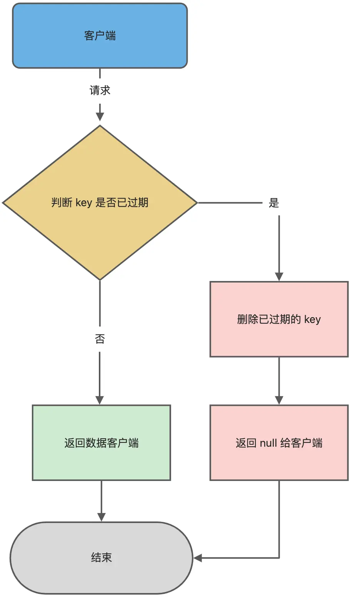

###  00. 面试题：

#### 00.1 Redis 和 Memcached 有什么区别？为什么用 Redis 作为 MySQL 的缓存？

都说用 Redis 作为缓存，但是 Memcached 也是基于内存的数据库，为什么不选择它作为缓存呢？

Redis 与 Memcached 共同点：

1. 都是基于内存的数据库，一般都用来当做缓存使用。
2. 都有过期策略。
3. 两者的性能都非常高。

Redis 与 Memcached 区别：

+ Redis 支持的数据类型更丰富（String、Hash、List、Set、ZSet），而 Memcached 只支持最简单的 key-value 数据类型；
+ Redis 支持数据的持久化，可以将内存中的数据保持在磁盘中，重启的时候可以再次加载进行使用，而Memcached 没有持久化功能，数据全部存在内存之中，Memcached 重启或者挂掉后，数据就没了；
+ Redis 原生支持集群模式，Memcached 没有原生的集群模式，需要依靠客户端来实现往集群中分片写入数据；
+ Redis 支持发布订阅模型、Lua 脚本、事务等功能，而 Memcached 不支持；

> 为什么用 Redis 作为 MySQL 的缓存？

主要是因为 Redis 具备「高性能」和「高并发」两种特性。

1. Redis 具备高性能

假如用户第一次访问 MySQL 中的某些数据。这个过程会比较慢，因为是从硬盘上读取的。将该用户访问的数据缓存在 Redis 中，这样下一次再访问这些数据的时候就可以直接从缓存中获取了，操作 Redis 缓存就是直接操作内存，所以速度相当快。

如果 MySQL 中的对应数据改变的之后，同步改变 Redis 缓存中相应的数据即可，不过这里会有 Redis 和 MySQL 双写一致性的问题

2.  Redis 具备高并发

单台设备的 Redis 的 QPS（Query Per Second，每秒钟处理完请求的次数） 是 MySQL 的 10 倍，Redis 单机的 QPS 能轻松破 10w，而 MySQL 单机的 QPS 很难破 1w。

所以，直接访问 Redis 能够承受的请求是远远大于直接访问 MySQL 的，所以我们可以考虑把数据库中的部分数据转移到缓存中去，这样用户的一部分请求会直接到缓存这里而不用经过数据库

#### 00.2 Redis 数据类型以及使用场景分别是什么？

Redis 提供了丰富的数据类型，常见的有五种数据类型：String（字符串），Hash（哈希），List（列表），Set（集合）、Zset（有序集合）。


随着 Redis 版本的更新，后面又支持了四种数据类型： BitMap（2.2 版新增）、HyperLogLog（2.8 版新增）、GEO（3.2 版新增）、Stream（5.0 版新增）。Redis 五种数据类型的应用场景：

+ String 类型的应用场景：缓存对象、常规计数、分布式锁、共享 session 信息等。
+ List 类型的应用场景：消息队列（但是有两个问题：1. 生产者需要自行实现全局唯一 ID；2. 不能以消费组形式消费数据）等。
+ Hash 类型：缓存对象、购物车等。
+ Set 类型：聚合计算（并集、交集、差集）场景，比如点赞、共同关注、抽奖活动等。
+ Zset 类型：排序场景，比如排行榜、电话和姓名排序等。

Redis 后续版本又支持四种数据类型，它们的应用场景如下：

+ BitMap（2.2 版新增）：二值状态统计的场景，比如签到、判断用户登陆状态、连续签到用户总数等；
+ HyperLogLog（2.8 版新增）：海量数据基数统计的场景，比如百万级网页 UV 计数等；
+ GEO（3.2 版新增）：存储地理位置信息的场景，比如滴滴叫车；
+ Stream（5.0 版新增）：消息队列，相比于基于 List 类型实现的消息队列，有这两个特有的特性：自动生成全局唯一消息ID，支持以消费组形式消费数据。

#### 00.3. 五种常见的 Redis 数据类型是怎么实现？


> String 类型内部实现

String 类型的底层的数据结构实现主要是 SDS（简单动态字符串）。SDS 和我们认识的 C 字符串不太一样，之所以没有使用 C 语言的字符串表示，因为 SDS 相比于 C 的原生字符串：

+ SDS 不仅可以保存文本数据，还可以保存二进制数据。因为 SDS 使用 len 属性的值而不是空字符来判断字符串是否结束，并且 SDS 的所有 API 都会以处理二进制的方式来处理 SDS 存放在 buf[] 数组里的数据。所以 SDS 不光能存放文本数据，而且能保存图片、音频、视频、压缩文件这样的二进制数据。
+ SDS 获取字符串长度的时间复杂度是 O(1)。因为 C 语言的字符串并不记录自身长度，所以获取长度的复杂度为 O(n)；而 SDS 结构里用 len 属性记录了字符串长度，所以复杂度为 O(1)。
+ Redis 的 SDS API 是安全的，拼接字符串不会造成缓冲区溢出。因为 SDS 在拼接字符串之前会检查 SDS 空间是否满足要求，如果空间不够会自动扩容，所以不会导致缓冲区溢出的问题。

> List 类型内部实现

List 数据类型底层数据结构就只由 quicklist 实现了，替代了双向链表和压缩列表。

> Hash 类型内部实现

> ZSet 类型内部实现

+ 如果有序集合的元素个数小于 128 个，并且每个元素的值小于 64 字节时，Redis 会使用压缩列表作为 Zset 类型的底层数据结构；
+ 如果有序集合的元素不满足上面的条件，Redis 会使用跳表作为 Zset 类型的底层数据结构；

#### 00.4 Redis 线程模型

> Redis 是单线程吗？

Redis 单线程指的是「接收客户端请求->解析请求 ->进行数据读写等操作->发送数据给客户端」这个过程是由一个线程（主线程）来完成的，这也是我们常说 Redis 是单线程的原因。

但是，Redis 程序并不是单线程的，Redis 在启动的时候，是会启动后台线程（BIO）的： 

+ Redis 在 2.6 版本，会启动 2 个后台线程，分别处理关闭文件、AOF 刷盘这两个任务；
+ Redis 在 4.0 版本之后，新增了一个新的后台线程，用来异步释放 Redis 内存，也就是 lazyfree 线程。例如执行 unlink key / flushdb async / flushall async 等命令，会把这些删除操作交给后台线程来执行，好处是不会导致 Redis 主线程卡顿。因此，当我们要删除一个大 key 的时候，不要使用 del 命令删除，因为 del 是在主线程处理的，这样会导致 Redis 主线程卡顿，因此我们应该使用 unlink 命令来异步删除大key。


之所以 Redis 为「关闭文件、AOF 刷盘、释放内存」这些任务创建单独的线程来处理，是因为这些任务的操作都是很耗时的，如果把这些任务都放在主线程来处理，那么 Redis 主线程就很容易发生阻塞，这样就无法处理后续的请求了。

后台线程相当于一个消费者，生产者把耗时任务丢到任务队列中，消费者（BIO）不停轮询这个队列，拿出任务就去执行对应的方法即可。


关闭文件、AOF 刷盘、释放内存这三个任务都有各自的任务队列：

+ BIO_CLOSE_FILE，关闭文件任务队列：当队列有任务后，后台线程会调用 close(fd) ，将文件关闭；
+ BIO_AOF_FSYNC，AOF刷盘任务队列：当 AOF 日志配置成 everysec 选项后，主线程会把 AOF 写日志操作封装成一个任务，也放到队列中。当发现队列有任务后，后台线程会调用 fsync(fd)，将 AOF 文件刷盘，
+ BIO_LAZY_FREE，lazy free 任务队列：当队列有任务后，后台线程会 free(obj) 释放对象 / free(dict) 删除数据库所有对象 / free(skiplist) 释放跳表对象；

> Redis 单线程模式是怎样的？


图中的蓝色部分是一个事件循环，是由主线程负责的，可以看到网络 I/O 和命令处理都是单线程。 Redis 初始化的时候，会做下面这几件事情：

+ 可以看到网络 I/O 和命令处理都是单线程。 Redis 初始化的时候，会做下面这几件事情：
+ 然后，调用 bind() 绑定端口和调用 listen() 监听该 socket；
+ 然后，调用 bind() 绑定端口和调用 listen() 监听该 socket；

初始化完后，主线程就进入到一个事件循环函数，主要会做以下事情：

+ 首先，先调用处理发送队列函数，看是发送队列里是否有任务，如果有发送任务，则通过 write 函数将客户端发送缓存区里的数据发送出去，如果这一轮数据没有发送完，就会注册写事件处理函数，等待 epoll_wait 发现可写后再处理 。
+ 接着，调用 epoll_wait 函数等待事件的到来：
    + 如果是连接事件到来，则会调用连接事件处理函数，该函数会做这些事情：调用 accpet 获取已连接的 socket -> 调用 epoll_ctl 将已连接的 socket 加入到 epoll -> 注册「读事件」处理函数；
    + 如果是读事件到来，则会调用读事件处理函数，该函数会做这些事情：调用 read 获取客户端发送的数据 -> 解析命令 -> 处理命令 ->将客户端对象添加到发送队列 -> 将执行结果写到发送缓存区等待发送；
    + 如果是写事件到来，则会调用写事件处理函数，该函数会做这些事情：通过 write 函数将客户端发送缓存区里的数据发送出去，该函数会做这些事情：通过 write 函数将客户端发送缓存区里的数据发送出去，


> Redis 采用单线程为什么还这么快？

之所以 Redis 采用单线程（网络 I/O 和执行命令）那么快，有如下几个原因：

+ Redis 的大部分操作都在内存中完成，并且采用了高效的数据结构，因此 Redis 瓶颈可能是机器的内存或者网络带宽，而并非 CPU，既然 CPU 不是瓶颈，那么自然就采用单线程的解决方案了；

+ Redis 采用单线程模型可以避免了多线程之间的竞争，省去了多线程切换带来的时间和性能上的开销，而且也不会导致死锁问题。

+ Redis 采用了 I/O 多路复用机制处理大量的客户端 Socket 请求，IO 多路复用机制是指一个线程处理多个 IO 流，就是我们经常听到的 select/epoll 机制。简单来说，在 Redis 只运行单线程的情况下，该机制允许内核中，同时存在多个监听 Socket 和已连接 Socket。内核会一直监听这些 Socket 上的连接请求或数据请求。一旦有请求到达，就会交给 Redis 线程处理，这就实现了一个 Redis 线程处理多个 IO 流的效果。

> Redis 6.0 之前为什么使用单线程？

**CPU 并不是制约 Redis 性能表现的瓶颈所在**，更多情况下是受到内存大小和网络I/O的限制，所以 Redis 核心网络模型使用单线程并没有什么问题，如果你想要使用服务的多核CPU，可以在一台服务器上启动多个节点或者采用分片集群的方式。


使用了单线程后，可维护性高，多线程模型虽然在某些方面表现优异，但是它却引入了程序执行顺序的不确定性，带来了并发读写的一系列问题，增**加了系统复杂度、同时可能存在线程切换、甚至加锁解锁、死锁造成的性能损耗**

> Redis 6.0 之后为什么引入了多线程？

虽然 Redis 的主要工作（网络 I/O 和执行命令）一直是单线程模型，但是在 Redis 6.0 版本之后，也采用了多个 I/O 线程来处理网络请求，这是因为随着网络硬件的性能提升，Redis 的性能瓶颈有时会出现在网络 I/O 的处理上。

所以为了提高网络 I/O 的并行度，Redis 6.0 对于网络 I/O 采用多线程来处理。但是对于命令的执行，Redis 仍然使用单线程来处理，所以大家不要误解 Redis 有多线程同时执行命令。

Redis 官方表示，Redis 6.0 版本引入的多线程 I/O 特性对性能提升至少是一倍以上。

#### 00.5 Redis 持久化

> Redis 如何实现数据不丢失？

Redis 的读写操作都是在内存中，所以 Redis 性能才会高，但是当 Redis 重启后，内存中的数据就会丢失，那为了保证内存中的数据不会丢失，Redis 实现了数据持久化的机制，这个机制会把数据存储到磁盘，这样在 Redis 重启就能够从磁盘中恢复原有的数据。

Redis 共有三种数据持久化的方式：
+ AOF 日志：每执行一条写操作命令，就把该命令以追加的方式写入到一个文件里；
+ RDB 快照：将某一时刻的内存数据，以二进制的方式写入磁盘；
+ 混合持久化方式：Redis 4.0 新增的方式，集成了 AOF 和 RDB 的优点；

> AOF 日志是如何实现的？

Redis 在执行完一条写操作命令后，就会把该命令以追加的方式写入到一个文件里，然后 Redis 重启时，会读取该文件记录的命令，然后逐一执行命令的方式来进行数据恢复。


> 为什么先执行命令，再把数据写入日志呢？

Reids 是先执行写操作命令后，才将该命令记录到 AOF 日志里的，这么做其实有两个好处。

+ 避免额外的检查开销：因为如果先将写操作命令记录到 AOF 日志里，再执行该命令的话，如果当前的命令语法有问题，那么如果不进行命令语法检查，该错误的命令记录到 AOF 日志里后，Redis 在使用日志恢复数据时，就可能会出错。

+ 不会阻塞当前写操作命令的执行：因为当写操作命令执行成功后，才会将命令记录到 AOF 日志。

当然，这样做也会带来风险：

+ 数据可能会丢失： 执行写操作命令和记录日志是两个过程，那当 Redis 在还没来得及将命令写入到硬盘时，服务器发生宕机了，这个数据就会有丢失的风险。

+ 可能阻塞其他操作： 由于写操作命令执行成功后才记录到 AOF 日志，所以不会阻塞当前命令的执行，但因为 AOF 日志也是在主线程中执行，所以当 Redis 把日志文件写入磁盘的时候，还是会阻塞后续的操作无法执行。

> AOF 写回策略有几种？


1. Redis 执行完写操作命令后，会将命令追加到 server.aof_buf 缓冲区；
2. 然后通过 write() 系统调用，将 aof_buf 缓冲区的数据写入到 AOF 文件，此时数据并没有写入到硬盘，而是拷贝到了内核缓冲区 page cache，等待内核将数据写入硬盘；
3. 具体内核缓冲区的数据什么时候写入到硬盘，由内核决定。


Redis 提供了 3 种写回硬盘的策略，控制的就是上面说的第三步的过程。 在 Redis.conf 配置文件中的appendfsync 配置项可以有以下 3 种参数可填：

+ Always，这个单词的意思是「总是」，所以它的意思是每次写操作命令执行完后，同步将 AOF 日志数据写回硬盘；

+ Everysec，这个单词的意思是「每秒」，所以它的意思是每次写操作命令执行完后，先将命令写入到 AOF 文件的内核缓冲区，然后每隔一秒将缓冲区里的内容写回到硬盘；

+ No，意味着不由 Redis 控制写回硬盘的时机，转交给操作系统控制写回的时机，就是每次写操作命令执行完后，先将命令写入到 AOF 文件的内核缓冲区，再由操作系统决定何时将缓冲区内容写回硬盘。

> AOF 日志过大，会触发什么机制？

AOF 日志是一个文件，随着执行的写操作命令越来越多，文件的大小会越来越大。 如果当 AOF 日志文件过大就会带来性能问题，比如重启 Redis 后，需要读 AOF 文件的内容以恢复数据，如果文件过大，整个恢复的过程就会很慢。

所以，Redis 为了避免 AOF 文件越写越大，提供了 AOF 重写机制，所以，Redis 为了避免 AOF 文件越写越大，提供了 AOF 重写机制，


AOF 重写机制是在重写时，读取当前数据库中的所有键值对，然后将每一个键值对用一条命令记录到「新的 AOF 文件」，等到全部记录完后，就将新的 AOF 文件替换掉现有的 AOF 文件。

> 重写 AOF 日志的过程是怎样的？

Redis 的重写 AOF 过程是由后台子进程 bgrewriteaof 来完成的，这么做可以达到两个好处：

+ 子进程进行 AOF 重写期间，主进程可以继续处理命令请求，从而避免阻塞主进程；
+ 子进程带有主进程的数据副本，这里使用子进程而不是线程，因为如果是使用线程，多线程之间会共享内存，那么在修改共享内存数据的时候，需要通过加锁来保证数据的安全，而这样就会降低性能。而使用子进程，创建子进程时，父子进程是共享内存数据的，不过这个共享的内存只能以只读的方式，而当父子进程任意一方修改了该共享内存，就会发生「写时复制」，于是父子进程就有了独立的数据副本，就不用加锁来保证数据安全。

触发重写机制后，主进程就会创建重写 AOF 的子进程，此时父子进程共享物理内存，重写子进程只会对这个内存进行只读，重写 AOF 子进程会读取数据库里的所有数据，并逐一把内存数据的键值对转换成一条命令，再将命令记录到重写日志（新的 AOF 文件）。

但是重写过程中，主进程依然可以正常处理命令，那问题来了，重写 AOF 日志过程中，如果主进程修改了已经存在 key-value，那么会发生写时复制，此时这个 key-value 数据在子进程的内存数据就跟主进程的内存数据不一致了，这时要怎么办呢？

为了解决这种数据不一致问题，Redis 设置了一个 AOF 重写缓冲区，这个缓冲区在创建 bgrewriteaof 子进程之后开始使用。

在重写 AOF 期间，当 Redis 执行完一个写命令之后，它会同时将这个写命令写入到 「AOF 缓冲区」和 「AOF 重写缓冲区」。

也就是说，在 bgrewriteaof 子进程执行 AOF 重写期间，主进程需要执行以下三个工作:
+ 执行客户端发来的命令；
+ 将执行后的写命令追加到 「AOF 缓冲区」；
+ 将执行后的写命令追加到 「AOF 重写缓冲区」；

当子进程完成 AOF 重写工作（扫描数据库中所有数据，逐一把内存数据的键值对转换成一条命令，再将命令记录到重写日志）后，会向主进程发送一条信号，信号是进程间通讯的一种方式，且是异步的。

主进程收到该信号后，会调用一个信号处理函数，该函数主要做以下工作：

+ 将 AOF 重写缓冲区中的所有内容追加到新的 AOF 的文件中，使得新旧两个 AOF 文件所保存的数据库状态一致；
+ 新的 AOF 的文件进行改名，覆盖现有的 AOF 文件。

信号函数执行完后，主进程就可以继续像往常一样处理命令了。

> RDB 快照是如何实现的呢？

因为 AOF 日志记录的是操作命令，不是实际的数据，所以用 AOF 方法做故障恢复时，需要全量把日志都执行一遍，一旦 AOF 日志非常多，势必会造成 Redis 的恢复操作缓慢。

为了解决这个问题，Redis 增加了 RDB 快照。RDB 快照就是记录某一个瞬间的内存数据，记录的是实际数据，而 AOF 文件记录的是命令操作的日志，而不是实际的数据。

因此在 Redis 恢复数据时， RDB 恢复数据的效率会比 AOF 高些，因为直接将 RDB 文件读入内存就可以，不需要像 AOF 那样还需要额外执行操作命令的步骤才能恢复数据。

> RDB 做快照时会阻塞线程吗？

Redis 提供了两个命令来生成 RDB 文件，分别是 save 和 bgsave，他们的区别就在于是否在「主线程」里执行：

+ 执行了 save 命令，就会在主线程生成 RDB 文件，由于和执行操作命令在同一个线程，所以如果写入 RDB 文件的时间太长，会阻塞主线程；

+ 执行了 bgsave 命令，会创建一个子进程来生成 RDB 文件，这样可以避免主线程的阻塞；

Redis 还可以通过配置文件的选项来实现每隔一段时间自动执行一次 bgsave 命令，默认会提供以下配置：

```cpp
save 900 1
save 300 10
save 60 10000
```

别看选项名叫 save，实际上执行的是 bgsave 命令，也就是会创建子进程来生成 RDB 快照文件。 只要满足上面条件的任意一个，就会执行 bgsave，它们的意思分别是：

+ 900 秒之内，对数据库进行了至少 1 次修改；
+ 300 秒之内，对数据库进行了至少 10 次修改；
+ 60 秒之内，对数据库进行了至少 10000 次修改。

Redis 的快照是全量快照，也就是说每次执行快照，都是把内存中的「所有数据」都记录到磁盘中。

> RDB 在执行快照的时候，数据能修改吗？

可以的，执行 bgsave 过程中，Redis 依然可以继续处理操作命令的，也就是数据是能被修改的，关键的技术就在于写时复制技术（Copy-On-Write, COW）。

执行 bgsave 命令的时候，会通过 fork() 创建子进程，此时子进程和父进程是共享同一片内存数据的，因为创建子进程的时候，会复制父进程的页表，但是页表指向的物理内存还是一个，此时如果主线程执行读操作，则主线程和 bgsave 子进程互相不影响。

如果主线程执行写操作，则被修改的数据会复制一份副本，然后 bgsave 子进程会把该副本数据写入 RDB文件，在这个过程中，主线程仍然可以直接修改原来的数据。


> 为什么会有混合持久化？

RDB 优点是数据恢复速度快，但是快照的频率不好把握。频率太低，丢失的数据就会比较多，频率太高，就会影响性能。

AOF 优点是丢失数据少，但是数据恢复不快。

为了集成了两者的优点， Redis 4.0 提出了混合使用 AOF 日志和内存快照，也叫混合持久化，既保证了 Redis 重启速度，又降低数据丢失风险。

混合持久化工作在 AOF 日志重写过程，当开启了混合持久化时，在 AOF 重写日志时，fork 出来的重写子进程会先将与主线程共享的内存数据以 RDB 方式写入到 AOF 文件，然后主线程处理的操作命令会被记录在重写缓冲区里，重写缓冲区里的增量命令会以 AOF 方式写入到 AOF 文件，写入完成后通知主进程将新的含有 RDB 格式和 AOF 格式的 AOF 文件替换旧的的 AOF 文件。

也就是说，使用了混合持久化，AOF 文件的前半部分是 RDB 格式的全量数据，后半部分是 AOF 格式的增量数据。

这样的好处在于，重启 Redis 加载数据的时候，由于前半部分是 RDB 内容，这样加载的时候速度会很快。

加载完 RDB 的内容后，才会加载后半部分的 AOF 内容，这里的内容是 Redis 后台子进程重写 AOF 期间，主线程处理的操作命令，可以使得数据更少的丢失。

混合持久化优点：

+ 合持久化结合了 RDB 和 AOF 持久化的优点，开头为 RDB 的格式，使得 Redis 可以更快的启动，同时结合 AOF 的优点，有减低了大量数据丢失的风险。

混合持久化缺点：

+ AOF 文件中添加了 RDB 格式的内容，使得 AOF 文件的可读性变得很差；

+ 兼容性差，如果开启混合持久化，那么此混合持久化 AOF 文件，就不能用在 Redis 4.0 之前版本了。

#### 00.6 Redis 集群

> Redis 如何实现服务高可用？

要想设计一个高可用的 Redis 服务，一定要从 Redis 的多服务节点来考虑，比如 Redis 的主从复制、哨兵模式、切片集群。

> 主从复制

主从复制是 Redis 高可用服务的最基础的保证，实现方案就是将从前的一台 Redis 服务器，同步数据到多台从 Redis 服务器上，即一主多从的模式，且主从服务器之间采用的是「读写分离」的方式。

主服务器可以进行读写操作，当发生写操作时自动将写操作同步给从服务器，而从服务器一般是只读，并接受主服务器同步过来写操作命令，然后执行这条命令。


也就是说，所有的数据修改只在主服务器上进行，然后将最新的数据同步给从服务器，这样就使得主从服务器的数据是一致的。

注意，主从服务器之间的命令复制是**异步**进行的。

具体来说，在主从服务器命令传播阶段，主服务器收到新的写命令后，会发送给从服务器。但是，主服务器并不会等到从服务器实际执行完命令后，再把结果返回给客户端，而是主服务器自己在本地执行完命令后，就会向客户端返回结果了。如果从服务器还没有执行主服务器同步过来的命令，主从服务器间的数据就不一致了。

所以，无法实现强一致性保证（主从数据时时刻刻保持一致），数据不一致是难以避免的。

> 哨兵模式

在使用 Redis 主从服务的时候，会有一个问题，就是当 Redis 的主从服务器出现故障宕机时，需要手动进行恢复。

为了解决这个问题，Redis 增加了哨兵模式（Redis Sentinel），因为哨兵模式做到了可以监控主从服务器，并且提供主从节点故障转移的功能。


> 切片集群模式

当 Redis 缓存数据量大到一台服务器无法缓存时，就需要使用 Redis 切片集群（Redis Cluster ）方案，它将数据分布在不同的服务器上，以此来降低系统对单主节点的依赖，从而提高 Redis 服务的读写性能。

Redis Cluster 方案采用哈希槽（Hash Slot），来处理数据和节点之间的映射关系。在 Redis Cluster 方案中，一个切片集群共有 16384 个哈希槽，这些哈希槽类似于数据分区，每个键值对都会根据它的 key，被映射到一个哈希槽中，具体执行过程分为两大步：

+ 根据键值对的 key，按照 CRC16 算法计算一个 16 bit 的值
+ 再用 16bit 值对 16384 取模，得到 0~16383 范围内的模数，每个模数代表一个相应编号的哈希槽。

接下来的问题就是，这些哈希槽怎么被映射到具体的 Redis 节点上的呢？有两种方案：

+ 平均分配： 在使用 cluster create 命令创建 Redis 集群时，Redis 会自动把所有哈希槽平均分布到集群节点上。比如集群中有 9 个节点，则每个节点上槽的个数为 16384/9 个。
+ 手动分配： 可以使用 cluster meet 命令手动建立节点间的连接，组成集群，再使用 cluster addslots 命令，指定每个节点上的哈希槽个数。

#### 00.7 集群脑裂导致数据丢失怎么办？

> 什么是脑裂？

先来理解集群的脑裂现象，这就好比一个人有两个大脑，那么到底受谁控制呢？

那么在 Redis 中，集群脑裂产生数据丢失的现象是怎样的呢？

在 Redis 主从架构中，部署方式一般是「一主多从」，主节点提供写操作，从节点提供读操作。 如果主节点的网络突然发生了问题，它与所有的从节点都失联了，但是此时的主节点和客户端的网络是正常的，这个客户端并不知道 Redis 内部已经出现了问题，还在照样的向这个失联的主节点写数据（过程A），此时这些数据被旧主节点缓存到了缓冲区里，因为主从节点之间的网络问题，这些数据都是无法同步给从节点的。

这时，哨兵也发现主节点失联了，它就认为主节点挂了（但实际上主节点正常运行，只是网络出问题了），于是哨兵就会在「从节点」中选举出一个 leader 作为主节点，时集群就有两个主节点了 —— 脑裂出现了。

然后，网络突然好了，哨兵因为之前已经选举出一个新主节点了，它就会把旧主节点降级为从节点（A），然后从节点（A）会向新主节点请求数据同步，因为第一次同步是全量同步的方式，此时的从节点（A）会清空掉自己本地的数据，然后再做全量同步。所以，之前客户端在过程 A 写入的数据就会丢失了，也就是集群产生脑裂数据丢失的问题。

总结一句话就是：由于网络问题，集群节点之间失去联系。主从数据不同步；重新平衡选举，产生两个主服务。等网络恢复，旧主节点会降级为从节点，再与新主节点进行同步复制的时候，由于会从节点会清空自己的缓冲区，所以导致之前客户端写入的数据丢失了。

> 解决方案

当主节点发现从节点下线或者通信超时的总数量小于阈值时，那么禁止主节点进行写数据，直接把错误返回给客户端。

在 Redis 的配置文件中有两个参数我们可以设置：

+ min-slaves-to-write x，主节点必须要有至少 x 个从节点连接，如果小于这个数，主节点会禁止写数据。
+ min-slaves-max-lag x，主从数据复制和同步的延迟不能超过 x 秒，如果超过，主节点会禁止写数据。

我们可以把 min-slaves-to-write 和 min-slaves-max-lag 这两个配置项搭配起来使用，分别给它们设置一定的阈值，假设为 N 和 T。

这两个配置项组合后的要求是，主库连接的从库中至少有 N 个从库，和主库进行数据复制时的 ACK 消息延迟不能超过 T 秒，否则，主库就不会再接收客户端的写请求了。

即使原主库是假故障，它在假故障期间也无法响应哨兵心跳，也不能和从库进行同步，自然也就无法和从库进行 ACK 确认了。这样一来，min-slaves-to-write 和 min-slaves-max-lag 的组合要求就无法得到满足，原主库就会被限制接收客户端写请求，客户端也就不能在原主库中写入新数据了

等到新主库上线时，就只有新主库能接收和处理客户端请求，此时，新写的数据会被直接写到新主库中。而原主库会被哨兵降为从库，即使它的数据被清空了，也不会有新数据丢失。

#### 00.8 Redis 过期删除与内存淘汰

> Redis 使用的过期删除策略是什么？

Redis 是可以对 key 设置过期时间的，因此需要有相应的机制将已过期的键值对删除，而做这个工作的就是过期键值删除策略。

每当我们对一个 key 设置了过期时间时，Redis 会把该 key 带上过期时间存储到一个过期字典（expires dict）中，也就是说「过期字典」保存了数据库中所有 key 的过期时间。

当我们查询一个 key 时，Redis 首先检查该 key 是否存在于过期字典中：

+ 如果不在，则正常读取键值；
+ 如果存在，则会获取该 key 的过期时间，然后与当前系统时间进行比对，如果比系统时间大，那就没有过期，否则判定该 key 已过期。

Redis 使用的过期删除策略是「惰性删除+定期删除」这两种策略配和使用。

> 什么是惰性删除策略？

惰性删除策略的做法是，不主动删除过期键，每次从数据库访问 key 时，都检测 key 是否过期，如果过期则删除该 key。



惰性删除策略的优点：

+ 因为每次访问时，才会检查 key 是否过期，所以此策略只会使用很少的系统资源，因此，惰性删除策略对 CPU 时间最友好。

惰性删除策略的缺点：

+ 如果一个 key 已经过期，而这个 key 又仍然保留在数据库中，那么只要这个过期 key 一直没有被访问，它所占用的内存就不会释放，造成了一定的内存空间浪费。所以，惰性删除策略对内存不友好。

> 什么是定期删除策略？

定期删除策略的做法是，每隔一段时间「随机」从数据库中取出一定数量的 key 进行检查，并删除其中的过期key。

Redis 的定期删除的流程：

1. 从过期字典中随机抽取 20 个 key；
2. 检查这 20 个 key 是否过期，并删除已过期的 key；
3. 如果本轮检查的已过期 key 的数量，超过 5 个（20/4），也就是「已过期 key 的数量」占比「随机抽取 key 的数量」大于 25%，则继续重复步骤 1；如果已过期的 key 比例小于 25%，则停止继续删除过期 key，然后等待下一轮再检查。

可以看到，定期删除是一个循环的流程。那 Redis 为了保证定期删除不会出现循环过度，致线程卡死现象，为此增加了定期删除循环流程的时间上限，默认不会超过 25ms。

定期删除的流程如下：


定期删除策略的优点：

+ 通过限制删除操作执行的时长和频率，来减少删除操作对 CPU 的影响，同时也能删除一部分过期的数据减少了过期键对空间的无效占用。

定期删除策略的缺点：

+ 难以确定删除操作执行的时长和频率。如果执行的太频繁，就会对 CPU 不友好；如果执行的太少，那又和惰性删除一样了，过期 key 占用的内存不会及时得到释放。

可以看到，惰性删除策略和定期删除策略都有各自的优点，所以 Redis 选择「惰性删除+定期删除」这两种策略配和使用，以求在合理使用 CPU 时间和避免内存浪费之间取得平衡。

> Redis 持久化时，对过期键会如何处理的？

Redis 持久化文件有两种格式：RDB（Redis Database）和 AOF（Append Only File），下面我们分别来看过期键在这两种格式中的呈现状态。

RDB 文件分为两个阶段，RDB 文件生成阶段和加载阶段。

+ RDB 文件生成阶段：从内存状态持久化成 RDB（文件）的时候，会对 key 进行过期检查，过期的键
「不会」被保存到新的 RDB 文件中，因此 Redis 中的过期键不会对生成新 RDB 文件产生任何影响。

+ RDB 加载阶段：RDB 加载阶段时，要看服务器是主服务器还是从服务器，分别对应以下两种情况：
    + 如果 Redis 是「主服务器」运行模式的话，在载入 RDB 文件时，序会对文件中保存的键进行检查，过期键「不会」被载入到数据库中。所以过期键不会对载入 RDB 文件的主服务器造成影响；
    + 如果 Redis 是「从服务器」运行模式的话，在载入 RDB 文件时，不论键是否过期都会被载入到数据库中。但由于主从服务器在进行数据同步时，从服务器的数据会被清空。所以一般来说，过期键对载入 RDB 文件的从服务器也不会造成影响。

AOF 文件分为两个阶段，AOF 文件写入阶段和 AOF 重写阶段。

+ AOF 文件写入阶段：当 Redis 以 AOF 模式持久化时，如果数据库某个过期键还没被删除，那么 AOF 文件会保留此过期键，当此过期键被删除后，Redis 会向 AOF 文件追加一条 DEL 命令来显式地删除该键值。
+ AOF 重写阶段：执行 AOF 重写时，会对 Redis 中的键值对进行检查，已过期的键不会被保存到重写后的 AOF 文件中，因此不会对 AOF 重写造成任何影响。

> Redis 主从模式中，对过期键会如何处理？

当 Redis 运行在主从模式下时，从库不会进行过期扫描，从库对过期的处理是被动的。也就是即使从库中的 key 过期了，如果有客户端访问从库时，依然可以得到 key 对应的值，像未过期的键值对一样返回。

从库的过期键处理依靠主服务器控制，主库在 key 到期时，会在 AOF 文件里增加一条 del 指令，同步到所有的从库，从库通过执行这条 del 指令来删除过期的 key。


#### 3. Redis的大key如何处理？ 

> 什么是 Redis 大 key？

大 key 并不是指 key 的值很大，而是 key 对应的 value 很大

一般而言，下面这两种情况被称为大 key：
+ String 类型的值大于 10 KB；
+ Hash、List、Set、ZSet 类型的元素的个数超过 5000个；

> 大 key 会造成什么问题？

+ 客户端超时阻塞。由于 Redis 执行命令是单线程处理，然后在操作大 key 时会比较耗时，那么就会阻塞 Redis，从客户端这一视角看，就是很久很久都没有响应。

+ 引发网络阻塞。每次获取大 key 产生的网络流量较大，如果一个 key 的大小是 1 MB，每秒访问量为 1000，那么每秒会产生 1000MB 的流量，这对于普通千兆网卡的服务器来说是灾难性的。

+ 阻塞工作线程。如果使用 del 删除大 key 时，会阻塞工作线程，这样就没办法处理后续的命令。

+ 内存分布不均。集群模型在 slot 分片均匀情况下，会出现数据和查询倾斜情况，部分有大 key 的 Redis 节点占用内存多，QPS 也会比较大。

> 如何找到大 key ？

1. redis-cli --bigkeys 查找大key

可以通过 redis-cli --bigkeys 命令查找大 key：

`redis-cli -h 127.0.0.1 -p6379 -a "password"  -- bigkeys`

+ 最好选择在从节点上执行该命令。因为主节点上执行时，会阻塞主节点；
+ 如果没有从节点，那么可以选择在 Redis 实例业务压力的低峰阶段进行扫描查询，以免影响到实例的正常运行；或者可以使用 -i 参数控制扫描间隔，避免长时间扫描降低 Redis 实例的性能。

该方式的不足之处：
+ 这个方法只能返回每种类型中最大的那个 bigkey，无法得到大小排在前 N 位的 bigkey；
+ 对于集合类型来说，这个方法只统计集合元素个数的多少，而不是实际占用的内存量。但是，一个集合中的元素个数多，并不一定占用的内存就多。因为，有可能每个元素占用的内存很小，这样的话，即使元素个数有很多，总内存开销也不大；

2. 使用 SCAN 命令查找大 key

使用 SCAN 命令对数据库扫描，然后用 TYPE 命令获取返回的每一个 key 的类型。

对于 String 类型，可以直接使用 STRLEN 命令获取字符串的长度，也就是占用的内存空间字节数


### 0. 数据类型
#### 1. Redis常见数据类型和应用场景

常见的有五种：String（字符串），Hash（哈希），List（列表），Set（集合）、Zset（有序集合）。

四种数据类型： BitMap（2.2 版新增）、HyperLogLog（2.8 版新增）、GEO（3.2 版新增）、Stream（5.0 版新增）。

##### 1.1 String

String 是最基本的 key-value 结构，key 是唯一标识，value 是具体的值，value其实不仅是字符串， 也可以是数字（整数或浮点数），value 最多可以容纳的数据长度是 512M。

> 内部实现

底层的数据结构实现主要是 int 和 SDS（简单动态字符串）

C 语言的字符串不足之处以及可以改进的地方：
+ 获取字符串长度的时间复杂度为 O（N）；
+ 字符串的结尾是以 “\0” 字符标识，字符串里面不能包含有 “\0” 字符，因此不能保存二进制数据；
+ 字符串操作函数不高效且不安全，比如有缓冲区溢出的风险，有可能会造成程序运行终止；


+ SDS 不仅可以保存文本数据，还可以保存二进制数据。因为 SDS 使用 len 属性的值而不是空字符来判断字符串是否结束，并且 SDS 的所有 API 都会以处理二进制的方式来处理 SDS 存放在 buf[] 数组里的数据。所以 SDS 不光能存放文本数据，而且能保存图片、音频、视频、压缩文件这样的二进制数据。
+ SDS 获取字符串长度的时间复杂度是 O(1)。
+ Redis 的 SDS API 是安全的，拼接字符串不会造成缓冲区溢出。因为 SDS 在拼接字符串之前会检查SDS 空间是否满足要求，如果空间不够会自动扩容，所以不会导致缓冲区溢出的问题。

字符串对象的内部编码（encoding）有 3 种 ：int、raw和 embstr。


如果一个字符串对象保存的是整数值，并且这个整数值可以用long类型来表示，那么字符串对象会将整数值保存在字符串对象结构的ptr属性里面（将void*转换成 long），并将字符串对象的编码设置为int。


如果字符串对象保存的是一个字符串，并且这个字符申的长度小于等于 32 字节，那么字符串对象将使用一个简单动态字符串（SDS）来保存这个字符串，并将对象的编码设置为embstr，embstr编码是专门用于保存短字符串的一种优化编码方式：


如果字符串对象保存的是一个字符串，并且这个字符串的长度大于 32 字节，那么字符串对象将使用一个简单动态字符串（SDS）来保存这个字符串，并将对象的编码设置为raw：


可以看到embstr和raw编码都会使用SDS来保存值，但不同之处在于embstr会通过一次内存分配函数来分配一块连续的内存空间来保存redisObject和SDS，而raw编码会通过调用两次内存分配函数来分别分配两块空间来保存redisObject和SDS。Redis这样做会有很多好处：

+ embstr编码将创建字符串对象所需的内存分配次数从 raw 编码的两次降低为一次；
+ 释放 embstr编码的字符串对象同样只需要调用一次内存释放函数；
+ 因为embstr编码的字符串对象的所有数据都保存在一块连续的内存里面可以更好的利用 CPU 缓存提升性能。

但是 embstr 也有缺点的：

+ 如果字符串的长度增加需要重新分配内存时，整个redisObject和sds都需要重新分配空间，所以embstr编码的字符串对象实际上是只读的，redis没有为embstr编码的字符串对象编写任何相应的修改程序。当我们对embstr编码的字符串对象执行任何修改命令（例如append）时，程序会先将对象的编码**从embstr转换成raw**，然后再执行修改命令。

> 应用场景

缓存对象
使用 String 来缓存对象有两种方式：
+ 直接缓存整个对象的 JSON，命令例子：SET user:1 '{"name":"xiaolin", "age":18}'。
+ 采用将 key 进行分离为 user:ID:属性，采用 MSET 存储，用 MGET 获取各属性值，命令例子： MSET user:1:name xiaolin user:1:age 18 user:2:name xiaomei user:2:age 20


常规计数
因为 Redis 处理命令是单线程，所以执行命令的过程是原子的。因此 String 数据类型适合计数场景，比如计算访问次数、点赞、转发、库存数量等等。

##### 1.2 List

List 列表是简单的字符串列表，按照插入顺序排序，可以从头部或尾部向 List 列表添加元素。

列表的最大长度为 2^32 - 1，也即每个列表支持超过 40 亿个元素。

> 内部实现

List 类型的底层数据结构是由双向链表或压缩列表实现的：

+ 如果列表的元素个数小于 512 个，列表每个元素的值都小于 64 字节，Redis 会使用压缩列表作为 List 类型的底层数据结构；
+ 如果列表的元素不满足上面的条件，Redis 会使用双向链表作为 List 类型的底层数据结构；

List 数据类型底层数据结构就只由 quicklist 实现了，替代了双向链表和压缩列表。

应用场景

消息队列

消息队列在存取消息时，必须要满足三个需求，分别是消息保序、处理重复的消息和保证消息可靠性。

Redis 的 List 和 Stream 两种数据类型，就可以满足消息队列的这三个需求。

1. 如何满足消息保序需求？

List 本身就是按先进先出的顺序对数据进行存取的，所以，如果使用 List 作为消息队列保存消息的话，就已经能满足消息保序的需求了。


不过，在消费者读取数据时，有一个潜在的性能风险点。

在生产者往 List 中写入数据时，List 并不会主动地通知消费者有新消息写入，如果消费者想要及时处理消息，就需要在程序中不停地调用 RPOP 命令（比如使用一个while(1)循环）。如果有新消息写入，RPOP命令就会返回结果，否则，RPOP命令返回空值，再继续循环。

所以，即使没有新消息写入List，消费者也要不停地调用 RPOP 命令，这就会导致消费者程序的 CPU 一直消耗在执行 RPOP 命令上，带来不必要的性能损失。

为了解决这个问题，Redis提供了 BRPOP 命令。BRPOP命令也称为阻塞式读取，客户端在没有读到队列数据时，自动阻塞，直到有新的数据写入队列，再开始读取新数据。和消费者程序自己不停地调用RPOP命令相比，这种方式能节省CPU开销。


2. 如何处理重复的消息？

消费者要实现重复消息的判断，需要 2 个方面的要求：

+ 每个消息都有一个全局的 ID。
+ 消费者要记录已经处理过的消息的 ID。当收到一条消息后，消费者程序就可以对比收到的消息 ID 和记录的已处理过的消息 ID，来判断当前收到的消息有没有经过处理。如果已经处理过，那么，消费者程序就不再进行处理了。

但是 List 并不会为每个消息生成 ID 号，所以我们需要自行为每个消息生成一个全局唯一ID，成之后，我们在用 LPUSH 命令把消息插入 List 时，需要在消息中包含这个全局唯一 ID。

3. 如何保证消息可靠性？

为了留存消息，List 类型提供了 BRPOPLPUSH 命令，这个命令的作用是让消费者程序从一个 List 中读取消息，同时，Redis 会把这个消息再插入到另一个 List（可以叫作备份 List）留存。

这样一来，如果消费者程序读了消息但没能正常处理，等它重启后，就可以从备份 List 中重新读取消息并进行处理了。

> List 作为消息队列有什么缺陷？

List 不支持多个消费者消费同一条消息，因为一旦消费者拉取一条消息后，这条消息就从 List 中删除了，无法被其它消费者再次消费。

要实现一条消息可以被多个消费者消费，那么就要将多个消费者组成一个消费组，使得多个消费者可以消费同一条消息，但是 List 类型并不支持消费组的实现。

##### 1.3 Hash

Hash 是一个键值对（key - value）集合，其中 value 的形式如： value=[{field1，value1}，...{fieldN，valueN}]。Hash 特别适合用于存储对象。


> 内部实现

Hash 类型的底层数据结构是由压缩列表或哈希表实现的：
+ 如果哈希类型元素个数小于 512 个，所有值小于 64 字节的话，Redis 会使用压缩列表作为 Hash 类型的底层数据结构；
+ 如果哈希类型元素不满足上面条件，Redis 会使用哈希表作为 Hash 类型的 底层数据结构.

压缩列表数据结构已经废弃了，交由 listpack 数据结构来实现了。

> 应用场景

缓存对象
Hash 类型的 （key，field， value） 的结构与对象的（对象id， 属性， 值）的结构相似，也可以用来存储对象。

购物车
以用户 id 为 key，商品 id 为 field，商品数量为 value，恰好构成了购物车的3个要素

##### 1.4 set

Set 类型是一个无序并唯一的键值集合，它的存储顺序不会按照插入的先后顺序进行存储。

Set 类型和 List 类型的区别如下：
+ List 可以存储重复元素，Set 只能存储非重复元素；
+ List 是按照元素的先后顺序存储元素的，而 Set 则是无序方式存储元素的。

> 内部实现

Set 类型的底层数据结构是由哈希表或整数集合实现的：
+ 如果集合中的元素都是整数且元素个数小于 512 （默认值，set-maxintset-entries配置）个，Redis 会使用整数集合作为 Set 类型的底层数据结构；
+ 如果集合中的元素不满足上面条件，则 Redis 使用哈希表作为 Set 类型的底层数据结构。

> 应用场景

集合的主要几个特性，无序、不可重复、支持并交差等操作。

因此 Set 类型比较适合用来数据去重和保障数据的唯一性，还可以用来统计多个集合的交集、错集和并集等，当我们存储的数据是无序并且需要去重的情况下，比较适合使用集合类型进行存储。

Set 的差集、并集和交集的计算复杂度较高，在数据量较大的情况下，如果直接执行这些计算，会导致 Redis 实例阻塞。

点赞：Set 类型可以保证一个用户只能点一个赞；

共同关注： 
Set 类型支持交集运算，所以可以用来计算共同关注的好友、公众号等。

抽奖活动：
存储某活动中中奖的用户名 ，Set 类型因为有去重功能，可以保证同一个用户不会中奖两次。

##### 1.5 Zset

Zset 类型（有序集合类型）相比于 Set 类型多了一个排序属性 score（分值），对于有序集合 ZSet 来说，每个存储元素相当于有两个值组成的，一个是有序集合的元素值，一个是排序值。

有序集合保留了集合不能有重复成员的特性（分值可以重复），但不同的是，有序集合中的元素可以排序。


内部实现:

Zset 类型的底层数据结构是由压缩列表或跳表实现的：
+ 如果有序集合的元素个数小于 128 个，并且每个元素的值小于 64 字节时，Redis 会使用压缩列表作为 Zset 类型的底层数据结构；

+ 如果有序集合的元素不满足上面的条件，Redis 会使用跳表作为 Zset 类型的底层数据结构；

> 应用：
Zset 类型（Sorted Set，有序集合） 可以根据元素的权重来排序，我们可以自己来决定每个元素的权重值。比如说，我们可以根据元素插入 Sorted Set 的时间确定权重值，先插入的元素权重小，后插入的元素权重大。

在面对需要展示最新列表、排行榜等场景时，如果数据更新频繁或者需要分页显示，可以优先考虑使用 Sorted Set。

排行榜: 有序集合比较典型的使用场景就是排行榜。例如学生成绩的排名榜、游戏积分排行榜、视频播放排名、电商系统中商品的销量排名等。

##### 1.6 BitMap

Bitmap，即位图，是一串连续的二进制数组（0和1），可以通过偏移量（offset）定位元素。BitMap通过最小的单位bit来进行0|1的设置，表示某个元素的值或者状态，时间复杂度为O(1)。


由于 bit 是计算机中最小的单位，使用它进行储存将非常节省空间，特别适合一些数据量大且使用二值统计的场景。


内部实现
 
Bitmap 本身是用 String 类型作为底层数据结构实现的一种统计二值状态的数据类型。

String 类型是会保存为二进制的字节数组，所以，Redis 就把字节数组的每个 bit 位利用起来，用来表示一个元素的二值状态，你可以把 Bitmap 看作是一个 bit 数组。

常用命令

bitmap 基本操作：

```txt
# 设置值，其中value只能是 0 和 1
SETBIT key offset value

# 获取值
GETBIT key offset

# 获取指定范围内值为 1 的个数
# start 和 end 以字节为单位
BITCOUNT key start end
```

bitmap 运算操作：

```txt
# BitMap间的运算
# operations 位移操作符，枚举值
AND 与运算 &
OR 或运算 |
XOR 异或 ^
NOT 取反 ~

# result 计算的结果，会存储在该key中
# key1 … keyn 参与运算的key，可以有多个，空格分割，not运算只能一个key
# 当 BITOP 处理不同长度的字符串时，较短的那个字符串所缺少的部分会被看作 0。返回值是保存到 destkey 的字符串的长度（以字节byte为单位），和输入 key 中最长的字符串长度相等。
BITOP [operations] [result] [key1] [keyn…]

# 返回指定key中第一次出现指定value(0/1)的位置
BITPOS [key] [value]
```

应用场景
Bitmap 类型非常适合二值状态统计的场景，这里的二值状态就是指集合元素的取值就只有 0 和 1 两种，在记录海量数据时，Bitmap 能够有效地节省内存空间。

签到统计
在签到打卡的场景中，我们只用记录签到（1）或未签到（0），所以它就是非常典型的二值状态。

签到统计时，每个用户一天的签到用 1 个 bit 位就能表示，一个月（假设是 31 天）的签到情况用 31 个bit 位就可以，而一年的签到也只需要用 365 个 bit 位，根本不用太复杂的集合类型。

假设我们要统计 ID 100 的用户在 2022 年 6 月份的签到情况，就可以按照下面的步骤进行操作。

第一步，执行下面的命令，记录该用户 6 月 3 号已签到。

SETBIT uid:sign:100:202206 2 1

第二步，检查该用户 6 月 3 日是否签到。

GETBIT uid:sign:100:202206 2 

第三步，统计该用户在 6 月份的签到次数。

BITCOUNT uid:sign:100:202206

这样，我们就知道该用户在 6 月份的签到情况了。

> 如何统计这个月首次打卡时间呢？

Redis 提供了 BITPOS key bitValue [start] [end]指令，返回数据表示 Bitmap 中第一个值为 bitValue 的 offset 位置。

在默认情况下， 命令将检测整个位图，  用户可以通过可选的 start 参数和 end 参数指定要检测的范围。所以我们可以通过执行这条命令来获取 userID = 100 在 2022 年 6 月份首次打卡日期：

BITPOS uid:sign:100:202206 1

#### 2. Redis 数据结构


> 键值对数据库是怎么实现的？

Redis 的键值对中的 key 就是字符串对象，而 value 可以是字符串对象，也可以是集合数据类型的对象，比如 List 对象、Hash 对象、Set 对象和 Zset 对象。

> 键值对是如何保存在 Redis 中的呢？

Redis 是使用了一个「哈希表」保存所有键值对，哈希表的最大好处就是让我们可以用 O(1) 的时间复杂度来快速查找到键值对。哈希表其实就是一个数组，数组中的元素叫做哈希桶

Redis 的哈希桶是怎么保存键值对数据的呢？

哈希桶存放的是指向键值对数据的指针（dictEntry*），这样通过指针就能找到键值对数据，然后因为键值对的值可以保存字符串对象和集合数据类型的对象，所以键值对的数据结构中并不是直接保存值本身，而是保存了 void * key 和 void * value 指针，分别指向了实际的键对象和值对象，这样一来，即使值是集合数据，也可以通过 void * value 指针找到。


+ redisDb 结构，表示 Redis 数据库的结构，结构体里存放了指向了 dict 结构的指针；
+ dict 结构，结构体里存放了 2 个哈希表，正常情况下都是用「哈希表1」，「哈希表2」只有在 rehash 的时候才用
+ ditctht 结构，表示哈希表的结构，结构里存放了哈希表数组，数组中的每个元素都是指向一个哈希表节点结构（dictEntry）的指针；
+ dictEntry 结构，表示哈希表节点的结构，结构里存放了 **void * key 和 void * value 指针， key 指向的是 String 对象，而 value 则可以指向 String 对象，也可以指向集合类型的对象，比如 List 对象、Hash 对象、Set 对象和 Zset 对象。

void * key 和 void * value 指针指向的是 Redis 对象，Redis 中的每个对象都由 redisObject 结构表示，如下图：


+ type，标识该对象是什么类型的对象（String 对象、 List 对象、Hash 对象、Set 对象和 Zset 对象）；
+ encoding，标识该对象使用了哪种底层的数据结构；
+ ptr，指向底层数据结构的指针。


> SDS 简单动态字符串（simple dynamic string，SDS） 的数据结构来表示字符串

字符串在 Redis 中是很常用的，键值对中的键是字符串类型，值有时也是字符串类型。

C 语言字符串的缺陷: 

+ 获取字符串长度的时间复杂度为 O（N）；
+ 符串的结尾是以 “\0” 字符标识，字符串里面不能包含有 “\0” 字符，因此不能保存二进制数据；
+ 字符串操作函数不高效且不安全，比如有缓冲区溢出的风险，有可能会造成程序运行终止；

char *strcat(char *dest, const char* src);

C 语言的字符串是不会记录自身的缓冲区大小的，所以 strcat 函数假定程序员在执行这个函数时，已经为 dest 分配了足够多的内存，可以容纳 src 字符串中的所有内容，而一旦这个假定不成立，就会发生缓冲区溢出将可能会造成程序运行终止

> SDS 结构设计

Redis 实现的 SDS 的结构就把上面这些问题解决了;


+ len，记录了字符串长度。这样获取字符串长度的时候，只需要返回这个成员变量值就行，时间复杂度只需要 O（1）。
+ alloc，分配给字符数组的空间长度。这样在修改字符串的时候，可以通过 alloc - len 计算出剩余的空间大小，可以用来判断空间是否满足修改需求，如果不满足的话，就会自动将 SDS 的空间扩展至执行修改所需的大小，然后才执行实际的修改操作，所以使用 SDS 既不需要手动修改 SDS 的空间大小，也不会出现前面所说的缓冲区溢出的问题。
+ flags，用来表示不同类型的 SDS。一共设计了 5 种类型，分别是 sdshdr5、sdshdr8、sdshdr16、sdshdr32 和 sdshdr64
+ buf[]，字节数组，用来保存实际数据。不仅可以保存字符串，也可以保存二进制数据。

> O（1）复杂度获取字符串长度:
获取字符串长度的时候，直接返回这个成员变量的值就行，所以复杂度只有 O（1）

> 二进制安全:
因为 SDS 不需要用 “\0” 字符来标识字符串结尾了，而是有个专门的 len 成员变量来记录长度，所以可存储包含 “\0” 的数据。但是 SDS 为了兼容部分 C 语言标准库的函数， SDS 字符串结尾还是会加上 “\0” 字符。

因此， SDS 的 API 都是以处理二进制的方式来处理 SDS 存放在 buf[] 里的数据，程序不会对其中的数据做任何限制，数据写入的时候时什么样的，它被读取时就是什么样的。

通过使用二进制安全的 SDS，而不是 C 字符串，使得 Redis 不仅可以保存文本数据，也可以保存任意格式的二进制数据.

> 不会发生缓冲区溢出:
Redis 的 SDS 结构里引入了 alloc 和 len 成员变量，这样 SDS API 通过 alloc - len 计算，可以算出剩余可用的空间大小，这样在对字符串做修改操作的时候，就可以由程序内部判断缓冲区大小是否足够用。

而且，当判断出缓冲区大小不够用时，Redis 会自动将扩大 SDS 的空间大小，以满足修改所需的大小。

```cpp
hisds hi_sdsMakeRoomFor(hisds s, size_t addlen){
    // s目前的剩余空间已足够，无需扩展，直接返回
    if (avail >= addlen)
        return s;
    //获取目前s的长度
    len = hi_sdslen(s);
    sh = (char *)s - hi_sdsHdrSize(oldtype);
    //扩展之后 s 至少需要的长度
    //根据新长度，为s分配新空间所需要的大小
    if (newlen < HI_SDS_MAX_PREALLOC)
        //新长度<HI_SDS_MAX_PREALLOC 则分配所需空间*2的空间
        newlen *= 2;
    else
    //否则，分配长度为目前长度+1MB
        newlen += HI_SDS_MAX_PREALLOC;
}
```

SDS 扩容的规则代码如下：
+ 如果所需的 sds 长度小于 1 MB，那么最后的扩容是按照翻倍扩容来执行的，即 2 倍的newlen
+ 如果所需的 sds 长度超过 1 MB，那么最后的扩容长度应该是 newlen + 1MB。

在扩容 SDS 空间之前，SDS API 会优先检查未使用空间是否足够，如果不够的话，API 不仅会为 SDS 分配修改所必须要的空间，还会给 SDS 分配额外的「未使用空间」。

这样的好处是，下次在操作 SDS 时，如果 SDS 空间够的话，API 就会直接使用「未使用空间」，而无须执行内存分配，有效的减少内存分配次数。

> 节省内存空间

SDS 结构中有个 flags 成员变量，表示的是 SDS 类型。

Redis 一共设计了 5 种类型，分别是 sdshdr5、sdshdr8、sdshdr16、sdshdr32 和 sdshdr64。

这 5 种类型的主要区别就在于，它们数据结构中的 len 和 alloc 成员变量的数据类型不同。

比如 sdshdr16 和 sdshdr32 这两个类型，它们的定义分别如下：

```cpp
struct __attribute__ ((__packed__)) sdshdr16 {
    uint16_t len;
    uint16_t alloc;
    unsigned char flags; 
    char buf[];
};

struct __attribute__ ((__packed__)) sdshdr32 {
    uint32_t len;
    uint32_t alloc;
    unsigned char flags;
    char buf[];
}
```

+ sdshdr16 类型的 len 和 alloc 的数据类型都是 uint16_t，表示字符数组长度和分配空间大小不能超过 2 的 16 次方。
+ sdshdr32 则都是 uint32_t，表示表示字符数组长度和分配空间大小不能超过 2 的 32 次方。

之所以 SDS 设计不同类型的结构体，是为了能灵活保存不同大小的字符串，从而有效节省内存空间。比如，在保存小字符串时，结构头占用空间也比较少。

除了设计不同类型的结构体，Redis 在编程上还使用了专门的编译优化来节省内存空间，即在 struct 声明了 __attribute__ ((packed)) ，它的作用是：告诉编译器取消结构体在编译过程中的优化对齐，按照实际占用字节数进行对齐。

> 链表

链表节点结构设计

```cpp
typedef struct listNode {
    //前置节点
    struct listNode *prev;
    //后置节点
    struct listNode *next;
    //节点的值
    void *value;
}listNode;
```


链表结构设计
不过，Redis 在 listNode 结构体基础上又封装了 list 这个数据结构，这样操作起来会更方便，链表结构如下：

```cpp
typedef struct list {
    //链表头节点
    listNode *head;
    //链表尾节点
    listNode *tail;
    //节点值复制函数
    void *(*dup)(void *ptr);
    //节点值释放函数
    void (*free)(void *ptr);
    //节点值比较函数
    int (*match)(void *ptr, void *key);
    //链表节点数量
    unsigned long len;
}list;
```

list 结构为链表提供了链表头指针 head、链表尾节点 tail、链表节点数量 len、以及可以自定义实现的dup、free、match 函数。


> 链表的优势与缺陷

Redis 的链表实现优点如下：

+ listNode 链表节点的结构里带有 prev 和 next 指针，获取某个节点的前置节点或后置节点的时间复杂度只需O(1)，而且这两个指针都可以指向 NULL，所以链表是无环链表；
+ list 结构因为提供了表头指针 head 和表尾节点 tail，所以获取链表的表头节点和表尾节点的时间复杂度只需O(1)；
+ list 结构因为提供了链表节点数量 len，所以获取链表中的节点数量的时间复杂度只需O(1)；
+ listNode 链表节使用 void* 指针保存节点值，并且可以通过 list 结构的 dup、free、match 函数指针为节点设置该节点类型特定的函数，因此链表节点可以保存各种不同类型的值；

链表的缺陷也是有的：
+ 链表每个节点之间的内存都是不连续的，意味着无法很好利用 CPU 缓存。能很好利用 CPU 缓存的数据结构就是数组，因为数组的内存是连续的，这样就可以充分利用 CPU 缓存来加速访问。
+ 还有一点，保存一个链表节点的值都需要一个链表节点结构头的分配，内存开销较大。

> 压缩列表

压缩列表的最大特点，就是它被设计成一种内存紧凑型的数据结构，占用一块连续的内存空间，不仅可以利用 CPU 缓存，而且会针对不同长度的数据，进行相应编码，这种方法可以有效地节省内存开销。

但是，压缩列表的缺陷也是有的：

+ 不能保存过多的元素，否则查询效率就会降低；
+ 新增或修改某个元素时，压缩列表占用的内存空间需要重新分配，甚至可能引发连锁更新的问题。

因此，Redis 对象（List 对象、Hash 对象、Zset 对象）包含的元素数量较少，或者元素值不大的情况才会使用压缩列表作为底层数据结构。

压缩列表结构设计

压缩列表是 Redis 为了节约内存而开发的，它是由连续内存块组成的顺序型数据结构，有点类似于数组。


压缩列表在表头有三个字段：
+ zlbytes，记录整个压缩列表占用对内存字节数；
+ zltail，记录压缩列表「尾部」节点距离起始地址由多少字节，也就是列表尾的偏移量；
+ zllen，记录压缩列表包含的节点数量；
+ zlend，标记压缩列表的结束点，固定值 0xFF（十进制255）。

在压缩列表中，如果我们要查找定位第一个元素和最后一个元素，可以通过表头三个字段（zllen）的长度直接定位，复杂度是 O(1)。而查找其他元素时，就没有这么高效了，只能逐个查找，此时的复杂度就是 O(N) 了，因此压缩列表不适合保存过多的元素。


当我们往压缩列表中插入数据时，压缩列表就会根据数据类型是字符串还是整数，以及数据的大小，会使用不同空间大小的 prevlen 和 encoding 这两个元素里保存的信息，这种根据数据大小和类型进行不同的空间大小分配的设计思想，正是 Redis 为了节省内存而采用的。

连锁更新
压缩列表新增某个元素或修改某个元素时，如果空间不不够，压缩列表占用的内存空间就需要重新分配。而当新插入的元素较大时，可能会导致后续元素的 prevlen 占用空间都发生变化，从而引起「连锁更新」问题，导致每个元素的空间都要重新分配，造成访问压缩列表性能的下降。

虽然压缩列表紧凑型的内存布局能节省内存开销，但是如果保存的元素数量增加了，或是元素变大了，会导致内存重新分配，最糟糕的是会有「连锁更新」的问题。

因此，压缩列表只会用于保存的节点数量不多的场景，只要节点数量足够小，即使发生连锁更新，也是能接受的。

> quicklist

quicklist 的结构体跟链表的结构体类似，都包含了表头和表尾，区别在于 quicklist 的节点是 quicklistNode。

```cpp
typedef struct quicklist {
   //quicklist的链表头
   quicklistNode *head;      //quicklist的链表头
   //quicklist的链表尾
   quicklistNode *tail; 
   //所有压缩列表中的总元素个数
   unsigned long count;
   //quicklistNodes的个数
   unsigned long len; 
   ....
}quicklist;
```

quicklistNode 的结构定义：
```cpp
typedef struct quicklistNode {
    //前一个quicklistNode
    struct quicklistNode *prev; //前一个quicklistNode
    //下一个quicklistNode
    struct quicklistNode *next; 
    //quicklistNode指向的压缩列表
    unsigned char *zl;
    //压缩列表的的字节大小
    unsigned int sz;    
    //压缩列表的元素个数
    unsigned int count : 16; 
    ...
} quicklistNode; 
```

可以看到，quicklistNode 结构体里包含了前一个节点和下一个节点指针，这样每个 quicklistNode 形成了一个双向链表。但是链表节点的元素不再是单纯保存元素值，而是保存了一个压缩列表，所以 quicklistNode 结构体里有个指向压缩列表的指针 *zl。


在向 quicklist 添加一个元素的时候，不会像普通的链表那样，直接新建一个链表节点。而是会检查插入位置的压缩列表是否能容纳该元素，如果能容纳就直接保存到 quicklistNode 结构里的压缩列表，如果不能容纳，才会新建一个新的 quicklistNode 结构。

quicklist 会控制 quicklistNode 结构里的压缩列表的大小或者元素个数，来规避潜在的连锁更新的风险，但是这并没有完全解决连锁更新的问题。


> 哈希表

哈希表中的每一个 key 都是独一无二的，程序可以根据 key 查找到与之关联的 value，或者通过 key 来更新 value，又或者根据 key 来删除整个 key-value等等。

在讲压缩列表的时候，提到过 Redis 的 Hash 对象的底层实现之一是压缩列表（最新 Redis 代码已将压缩列表替换成 listpack）。Hash 对象的另外一个底层实现就是哈希表。

哈希表优点在于，它能以 O(1) 的复杂度快速查询数据。

Redis 采用了「链式哈希」来解决哈希冲突，在不扩容哈希表的前提下，将具有相同哈希值的数据串起来，形成链接起，以便这些数据在表中仍然可以被查询到。

> 哈希表结构设计

```cpp
typedef struct dictht {
    //哈希表数组
    dictEntry **table;
    //哈希表大小
    unsigned long size;  
    //哈希表大小掩码，用于计算索引值
    unsigned long sizemask;
    //该哈希表已有的节点数量
    unsigned long used;
}dictht;
```


哈希表节点的结构如下：

```cpp
typedef struct dictEntry {
    //键值对中的键
    void *key;
    //键值对中的值
    union {
        void *val;
        uint64_t u64;
        int64_t s64;
        double d;
    } v;
    //指向下一个哈希表节点，形成链表
    struct dictEntry *next;
}dictEntry;
```

dictEntry 结构里不仅包含指向键和值的指针，还包含了指向下一个哈希表节点的指针，这个指针可以将多个哈希值相同的键值对链接起来，以此来解决哈希冲突的问题，这就是链式哈希。

另外，这里还跟你提一下，dictEntry 结构里键值对中的值是一个「联合体 v」定义的，因此，键值对中的值可以是一个指向实际值的指针，或者是一个无符号的 64 位整数或有符号的 64 位整数或double 类的值。这么做的好处是可以节省内存空间，因为当「值」是整数或浮点数时，就可以将值的数据内嵌在 dictEntry 结构里，无需再用一个指针指向实际的值，从而节省了内存空间。

> 哈希冲突

哈希表实际上是一个数组，数组里多每一个元素就是一个哈希桶。

当一个键值对的键经过 Hash 函数计算后得到哈希值，再将(哈希值 % 哈希表大小)取模计算，得到的结果值就是该 key-value 对应的数组元素位置，也就是第几个哈希桶。

> rehash

Redis 定义一个 dict 结构体，这个结构体里定义了两个哈希表（ht[2]）。

```cpp
typedef struct dict {
    //两个Hash表，交替使用，用于rehash操作
    dictht ht[2]; 
}dict;
```


在正常服务请求阶段，插入的数据，都会写入到「哈希表 1」，此时的「哈希表 2 」 并没有被分配空间。

随着数据逐步增多，触发了 rehash 操作，这个过程分为三步：

+ 给「哈希表 2」 分配空间，一般会比「哈希表 1」 大一倍（两倍的意思）；
+ 将「哈希表 1 」的数据迁移到「哈希表 2」 中；
+ 迁移完成后，「哈希表 1 」的空间会被释放，并把「哈希表 2」 设置为「哈希表 1」，然后在「哈希表 2」 新创建一个空白的哈希表，为下次 rehash 做准备。


这个过程看起来简单，但是其实第二步很有问题，如果「哈希表 1 」的数据量非常大，那么在迁移至「哈希表 2 」的时候，因为会涉及大量的数据拷贝，此时可能会对 Redis 造成阻塞，无法服务其他请求。

> 整数集合

整数集合是 Set 对象的底层实现之一。当一个 Set 对象只包含整数值元素，并且元素数量不大时，就会使用整数集这个数据结构作为底层实现。


#### 2. Redis数据结构

### 1. 持久化

#### 1. AOF    

> 1. 什么是AOF？优点和缺点

保存写操作命令到日志的持久化方式，就是 Redis 里的 AOF(Append Only File) 持久化功能，注意只会记录写操作命令，读操作命令是不会被记录的，因为没意义。

开启： 修改 redis.conf 配置


Redis 是先执行写操作命令后，才将该命令记录到 AOF 日志里的，这么做其实有两个好处。

+ 第一个好处，避免额外的检查开销。

如果先将写操作命令记录到 AOF 日志里，再执行该命令的话，如果当前的命令语法有问题，那么如果不进行命令语法检查，该错误的命令记录到 AOF 日志里后，Redis 在使用日志恢复数据时，就可能会出错。

而如果先执行写操作命令再记录日志的话，只有在该命令执行成功后，才将命令记录到 AOF 日志里，这样就不用额外的检查开销，保证记录在 AOF 日志里的命令都是可执行并且正确的。

+ 第二个好处，不会阻塞当前写操作命令的执行，因为当写操作命令执行成功后，才会将命令记录到 AOF 日志。

风险：

+ 第一个风险，执行写操作命令和记录日志是两个过程，那当 Redis 在还没来得及将命令写入到硬盘时，服务器发生宕机了，这个数据就会有丢失的风险。

+ 第二个风险，前面说道，由于写操作命令执行成功后才记录到 AOF 日志，所以不会阻塞当前写操作命令的执行，但是可能会给「下一个」命令带来阻塞风险。

因为将命令写入到日志的这个操作也是在主进程完成的（执行命令也是在主进程），也就是说这两个操作是同步的。


如果在将日志内容写入到硬盘时，服务器的硬盘的 I/O 压力太大，就会导致写硬盘的速度很慢，进而阻塞住了，也就会导致后续的命令无法执行。

> 2. 三种写回策略，写入AOF的过程


流程：
1. Redis 执行完写操作命令后，会将命令追加到 server.aof_buf 缓冲区；
2. 然后通过 write() 系统调用，将 aof_buf 缓冲区的数据写入到 AOF 文件，此时数据并没有写入到硬盘，而是拷贝到了内核缓冲区 page cache，等待内核将数据写入硬盘；
3. 具体内核缓冲区的数据什么时候写入到硬盘，由内核决定。


Redis 提供了 3 种写回硬盘的策略，控制的就是上面说的第三步的过程。

在 redis.conf 配置文件中的 appendfsync 配置项可以有以下 3 种参数可填：

+ Always，次写操作命令执行完后，同步将 AOF 日志数据写回硬盘；
+ Everysec，每次写操作命令执行完后，先将命令写入到AOF 文件的内核缓冲区，然后每隔一秒将缓冲区里的内容写回到硬盘；
+ No，不由 Redis 控制写回硬盘的时机，转交给操作系统控制写回的时机，也就是每次写操作命令执行完后，先将命令写入到 AOF 文件的内核缓冲区，再由操作系统决定何时将缓冲区内容写回硬盘。

这 3 种写回策略都无法能完美解决「主进程阻塞」和「减少数据丢失」的问题，因为两个问题是对立的，偏向于一边的话，就会要牺牲另外一边.


这三种策略只是在控制 fsync() 函数的调用时机。


如果想要应用程序向文件写入数据后，能立马将数据同步到硬盘，就可以调用 fsync() 函数，这样内核就会将内核缓冲区的数据直接写入到硬盘，等到硬盘写操作完成后，该函数才会返回。

+ Always 策略就是每次写入 AOF 文件数据后，就执行 fsync() 函数；
+ Everysec 策略就会创建一个异步任务来执行 fsync() 函数； 
+ No 策略就是永不执行 fsync() 函数;

> 3. 重写机制是什么？为什么不直接复用？

AOF 日志是一个文件，随着执行的写操作命令越来越多，文件的大小会越来越大。

如果当 AOF 日志文件过大就会带来性能问题，比如重启 Redis 后，需要读 AOF 文件的内容以恢复数据，如果文件过大，整个恢复的过程就会很慢。

AOF 重写机制是在重写时，读取当前数据库中的所有键值对，然后将每一个键值对用一条命令记录到「新的 AOF 文件」，等到全部记录完后，就将新的 AOF 文件替换掉现有的 AOF 文件。

重写机制的妙处在于，尽管某个键值对被多条写命令反复修改，最终也只需要根据这个「键值对」当前的最新状态，然后用一条命令去记录键值对，代替之前记录这个键值对的多条命令，这样就减少了 AOF 文件中的命令数量。

为什么重写 AOF 的时候，不直接复用现有的 AOF 文件，而是先写到新的 AOF 文件再覆盖过去。

因为如果 AOF 重写过程中失败了，现有的 AOF 文件就会造成污染，可能无法用于恢复使用。

> 4. AOF后台重写,好处，那两个阶段阻塞，AOF重写缓冲区。

Redis 的重写 AOF 过程是由后台子进程 bgrewriteaof 来完成的，这么做可以达到两个好处：

+ 子进程进行 AOF 重写期间，主进程可以继续处理命令请求，从而避免阻塞主进程；

+ 子进程带有主进程的数据副本（数据副本怎么产生的后面会说），这里使用子进程而不是线程，因为如果是使用线程，多线程之间会共享内存，那么在修改共享内存数据的时候，需要通过加锁来保证数据的安全，而这样就会降低性能。而使用子进程，创建子进程时，父子进程是共享内存数据的，不过这个共享的内存只能以只读的方式，而当父子进程任意一方修改了该共享内存，就会发生「写时复制」，于是父子进程就有了独立的数据副本，就不用加锁来保证数据安全。

所以，有两个阶段会导致阻塞父进程：
+ 创建子进程的途中，由于要复制父进程的页表等数据结构，阻塞的时间跟页表的大小有关，页表越大，阻塞的时间也越长；
+ 创建完子进程后，如果子进程或者父进程修改了共享数据，就会发生写时复制，这期间会拷贝物理内存，如果内存越大，自然阻塞的时间也越长；


重写 AOF 日志过程中，如果主进程修改了已经存在 key-value，此时这个 key-value 数据在子进程的内存数据就跟主进程的内存数据不一致了，这时要怎么办呢？

为了解决这种数据不一致问题，Redis 设置了一个 AOF 重写缓冲区，这个缓冲区在创建 bgrewriteaof 子进程之后开始使用。

在重写 AOF 期间，当 Redis 执行完一个写命令之后，它会同时将这个写命令写入到 「AOF 缓冲区」和「AOF 重写缓冲区」。


也就是说，在 bgrewriteaof 子进程执行 AOF 重写期间，主进程需要执行以下三个工作:

+ 执行客户端发来的命令；
+ 将执行后的写命令追加到 「AOF 缓冲区」；
+ 将执行后的写命令追加到 「AOF 重写缓冲区」；

当子进程完成 AOF 重写工作（扫描数据库中所有数据，逐一把内存数据的键值对转换成一条命令，再将命令记录到重写日志）后，会向主进程发送一条信号，信号是进程间通讯的一种方式，且是异步的。

主进程收到该信号后，会调用一个信号处理函数，该函数主要做以下工作：

+ 将 AOF 重写缓冲区中的所有内容追加到新的 AOF 的文件中，使得新旧两个 AOF 文件所保存的数据库状态一致；
+ 新的 AOF 的文件进行改名，覆盖现有的 AOF 文件。

在整个 AOF 后台重写过程中，除了发生写时复制会对主进程造成阻塞，还有信号处理函数执行时也会对主进程造成阻塞，在其他时候，AOF 后台重写都不会阻塞主进程。

#### 2. RDB

AOF 文件的内容是操作命令；
RDB 文件的内容是二进制数据。

所以，RDB 记录的是实际数据，而 AOF 文件记录的是命令操作的日志，而不是实际的数据。

因此在 Redis 恢复数据时， RDB 恢复数据的效率会比 AOF 高些，因为直接将 RDB 文件读入内存就可以，不需要像 AOF 那样还需要额外执行操作命令的步骤才能恢复数据。

> 1. 怎么使用

Redis 提供了两个命令来生成 RDB 文件，分别是 save 和 bgsave，他们的区别就在于是否在「主线程」里执行：

+ 执行了 save 命令，就会在主线程生成 RDB 文件，由于和执行操作命令在同一个线程，所以如果写入 RDB 文件的时间太长，会阻塞主线程；
+ 执行了 bgsave 命令，会创建一个子进程来生成 RDB 文件，这样可以避免主线程的阻塞；

RDB 文件的加载工作是在服务器启动时自动执行的，Redis 并没有提供专门用于加载 RDB 文件的命令。

这里提一点，Redis 的快照是**全量快照**，也就是说每次执行快照，都是把内存中的「所有数据」都记录到磁盘中。

缺点：执行快照是一个比较重的操作，如果频率太频繁，可能会对 Redis 性能产生影响。如果频率太低，服务器故障时，丢失的数据会更多。

在服务器发生故障时，丢失的数据会比 AOF 持久化的方式更多，因为 RDB 快照是全量快照的方式，因此执行的频率不能太频繁，否则会影响 Redis 性能，而 AOF 日志可以以秒级的方式记录操作命令，所以丢失的数据就相对更少。

> 2. 执行快照的是否能被修改吗？

直接说结论吧，执行 bgsave 过程中，Redis 依然可以继续处理操作命令的，也就是数据是能被修改的。

bgsave 快照过程中，如果主线程修改了共享数据，发生了写时复制后，RDB 快照保存的是原本的内存数据，而主线程刚修改的数据，是没办法在这一时间写入 RDB 文件的，只能交由下一次的 bgsave 快照。

#### 3. 混合使用 AOF 日志和内存快照

如果想要开启混合持久化功能，可以在 Redis 配置文件将下面这个配置项设置成 yes：

aof-use-rdb-preamble yes

混合持久化工作在 AOF 日志重写过程。

当开启了混合持久化时，在 AOF 重写日志时，fork 出来的重写子进程会先将与主线程当开启了混合持久化时，在 AOF 重写日志时，fork 出来的重写子进程会先将与主线程缓冲区里，重写缓冲区里的增量命令会以 AOF 方式写入到 AOF 文件，写入完成后通知主进程将新的含有 RDB 格式和 AOF 格式的 AOF 文件替换旧的的 AOF 文件。

也就是说，使用了混合持久化，AOF 文件的前半部分是 RDB 格式的全量数据，后半部分是 AOF 格式的增量数据。

这样的好处在于，重启 Redis 加载数据的时候，由于前半部分是 RDB 内容，这样加载的时候速度会很快。

加载完 RDB 的内容后，才会加载后半部分的 AOF 内容，这里的内容是 Redis 后台子进程重写 AOF 期间，主线程处理的操作命令，可以使得数据更少的丢失。

#### 4. Redis 大 Key 对持久化有什么影响？

> 三种写回策略，在持久化大 Key 的时候，会影响什么？

+ Always 策略就是每次写入 AOF 文件数据后，就执行 fsync() 函数；
+ Everysec 策略就会创建一个异步任务来执行 fsync() 函数；
+ No 策略就是永不执行 fsync() 函数;

在使用 Always 策略的时候，主线程在执行完命令后，会把数据写入到 AOF 日志文件，然后会调用 fsync()函数，将内核缓冲区的数据直接写入到硬盘，等到硬盘写操作完成后，该函数才会返回。

当使用 Always 策略的时候，如果写入是一个大 Key，主线程在执行 fsync() 函数的时候，阻塞的时间会比较久，因为当写入的数据量很大的时候，数据同步到硬盘这个过程是很耗时的。

当使用 Everysec 策略的时候，由于是异步执行 fsync() 函数，所以大 Key 持久化的过程（数据同步磁盘）不会影响主线程。

当使用 No 策略的时候，由于永不执行 fsync() 函数，所以大 Key 持久化的过程不会影响主线程。

> 2. 大 Key 对 AOF 重写和 RDB 的影响

当 AOF 日志写入了很多的大 Key，AOF 日志文件的大小会很大，那么很快就会触发 AOF 重写机制。

AOF 重写机制和 RDB 快照（bgsave 命令）的过程，都会分别通过 fork() 函数创建一个子进程来处理任务。

在通过 fork() 函数创建子进程的时候，虽然不会复制父进程的物理内存，但是内核会把父进程的页表复制一份给子进程，如果页表很大，那么这个复制过程是会很耗时的，那么在执行 fork 函数的时候就会发生阻塞现象。

而且，fork 函数是由 Redis 主线程调用的，如果 fork 函数发生阻塞，那么意味着就会阻塞 Redis 主线程。由于 Redis 执行命令是在主线程处理的，所以当 Redis 主线程发生阻塞，就无法处理后续客户端发来的命令。

会有两个阶段会导致阻塞父进程（主线程）：
+ 创建子进程的途中，由于要复制父进程的页表等数据结构，阻塞的时间跟页表的大小有关，页表越大，阻塞的时间也越长；
+ 创建完子进程后，如果父进程修改了共享数据中的大 Key，就会发生写时复制，这期间会拷贝物理内存，由于大 Key 占用的物理内存会很大，那么在复制物理内存这一过程，就会比较耗时，所以有可能会阻塞父进程。

> 3. 如何避免大 Key 呢？

最好在设计阶段，就把大 key 拆分成一个一个小 key。或者，定时检查 Redis 是否存在大 key ，如果该大key 是可以删除的，不要使用 DEL 命令删除，因为该命令删除过程会阻塞主线程，而是用 unlink 命令（Redis 4.0+）删除大 key，因为该命令的删除过程是异步的，不会阻塞主线程。

### 2. 功能篇

#### 1. 过期删除策略

Redis 是可以对 key 设置过期时间的，因此需要有相应的机制将已过期的键值对删除，而做这个工作的就是过期键值删除策略。

> 1. 如何设置过期时间？

+ expire <key> <n> 设置 key 在 n 秒后过期
+ pexpire <key> <n> 设置 key 在 n 毫秒后过期
+ expireat <key> <n>：设置 key 在某个时间戳（精确到秒）之后过期
+ pexpireat <key> <n>：设置 key 在某个时间戳（精确到毫秒）之后过期

在设置字符串时，也可以同时对 key 设置过期时间，共有 3 种命令：

+ set <key> <value> ex <n> ：设置键值对的时候，同时指定过期时间（精确到秒）
+ set <key> <value> px <n> ：设置键值对的时候，同时指定过期时间（精确到毫秒）；

查看某个 key 剩余的存活时间，可以使用 TTL <key> 命令。

取消 key 的过期时间，则可以使用 PERSIST <key> 命令。

> 2. 如果判定key已过期？ 过期字典

每当我们对一个 key 设置了过期时间时，Redis 会把该 key 带上过期时间存储到一个过期字典（expires dict）中，也就是说「过期字典」保存了数据库中所有 key 的过期时间。

过期字典存储在 redisDb 结构中，如下：
```cpp
typedef struct redisDb {
    dict *dict;    /* 数据库键空间，存放着所有的键值对 */
    dict *expires; /* 键的过期时间 */
} redisDb;
```


字典实际上是哈希表，哈希表的最大好处就是让我们可以用 O(1) 的时间复杂度来快速查找。当我们查询一个 key 时，Redis 首先检查该 key 是否存在于过期字典中：

+ 如果不在，则正常读取键值；
+ 如果存在，则会获取该 key 的过期时间，然后与当前系统时间进行比对，如果比系统时间大，那就没有过期，否则判定该 key 已过期。

> 3. 过期删除策略有哪些？

+ 定时删除；
+ 惰性删除；
+ 定期删除；

> 定时删除策略是怎么样的？

定时删除策略的做法是，在设置 key 的过期时间时，同时创建一个定时事件，当时间到达时，由事件处理器自动执行 key 的删除操作。

定时删除策略的优点：

+ 可以保证过期 key 会被尽快删除，也就是内存可以被尽快地释放。因此，定时删除对内存是最友好的。

+ 在过期 key 比较多的情况下，删除过期 key 可能会占用相当一部分 CPU 时间，在内存不紧张但 CPU 时间紧张的情况下，将 CPU 时间用于删除和当前任务无关的过期键上，无疑会对服务器的响应时间和吞吐量造成影响。所以，定时删除策略对 CPU 不友好。

> 惰性删除策略是怎么样的？

惰性删除策略的做法是，不主动删除过期键，每次从数据库访问 key 时，都检测 key 是否过期，如果过期则删除该 key。

惰性删除策略的优点：
+ 因为每次访问时，才会检查 key 是否过期，所以此策略只会使用很少的系统资源，因此，惰性删除策略对 CPU 时间最友好。

惰性删除策略的缺点：
+ 如果一个 key 已经过期，而这个 key 又仍然保留在数据库中，那么只要这个过期 key 一直没有被访问，它所占用的内存就不会释放，造成了一定的内存空间浪费。所以，惰性删除策略对内存不友好。

> 定期删除策略是怎么样的？

定期删除策略的做法是，每隔一段时间「随机」从数据库中取出一定数量的 key 进行检查，并删除其中的过期key。

定期删除策略的优点：
+ 通过限制删除操作执行的时长和频率，来减少删除操作对 CPU 的影响，同时也能删除一部分过期的数据减少了过期键对空间的无效占用。


定期删除策略的缺点：
+ 内存清理方面没有定时删除效果好，同时没有惰性删除使用的系统资源少。
+ 难以确定删除操作执行的时长和频率。如果执行的太频繁，定期删除策略变得和定时删除策略一样，对CPU不友好；如果执行的太少，那又和惰性删除一样了，过期 key 占用的内存不会及时得到释放。

> 4. Redis过期删除策略是什么？

Redis 选择「惰性删除+定期删除」这两种策略配和使用，以求在合理使用 CPU 时间和避免内存浪费之间取得平衡。

> Redis 是怎么实现惰性删除的？

Redis 的惰性删除策略由 db.c 文件中的expireIfNeeded 函数实现，代码如下：

```cpp
int expireIfNeeded(redisDb *db, robj *key) {
    // 判断 key 是否过期
    if (!keyIsExpired(db,key)) return 0;
    /* 删除过期键 */
    // 如果 server.lazyfree_lazy_expire 为 1 表示异步删除，反之同步删除；
    return server.lazyfree_lazy_expire ? dbAsyncDelete(db,key) : 
                                        dbSyncDelete(db,key);
    }
```

Redis 在访问或者修改 key 之前，都会调用 expireIfNeeded 函数对其进行检查，检查 key 是否过期：

+ 如果过期，则删除该 key，至于选择异步删除，还是选择同步删除，根据 lazyfree_lazy_expire 参数配置决定（Redis 4.0版本开始提供参数），然后返回 null 客户端；
+ 如果没有过期，不做任何处理，然后返回正常的键值对给客户端；


> Redis 是怎么实现定期删除的？

定期删除策略的做法：每隔一段时间「随机」从数据库中取出一定数量的 key 进行检查，并删除其中的过期key。

1. 这个间隔检查的时间是多长呢？

在 Redis 中，默认每秒进行 10 次过期检查一次数据库，此配置可通过 Redis 的配置文件 redis.conf 进行配置，配置键为 hz 它的默认值是 hz 10。

特别强调下，每次检查数据库并不是遍历过期字典中的所有 key，而是从数据库中随机抽取一定数量的 key 进行过期检查。

2. 随机抽查的数量是多少呢？

20
Redis 的定期删除的流程：
+ 从过期字典中随机抽取 20 个 key；
+ 检查这 20 个 key 是否过期，并删除已过期的 key；
+ 如果本轮检查的已过期 key 的数量，超过 5 个（20/4），也就是「已过期 key 的数量」占比「随机抽取 key 的数量」大于 25%，则继续重复步骤 1；如果已过期的 key 比例小于 25%，则停止继续删除过期 key，然后等待下一轮再检查。

那 Redis 为了保证定期删除不会出现循环过度，导致线程卡死现象，为此增加了定期删除循环流程的时间上限，默认不会超过 25ms。

```cpp
do {
    //已过期的数量
    expired = 0；
    //随机抽取的数量
    num = 20;
    while (num--) {
        //1. 从过期字典中随机抽取 1 个 key
        //2. 判断该 key 是否过期，如果已过期则进行删除，同时对 expired++
    }
    // 超过时间限制则退出
    if (timelimit_exit) return;
    /* 如果本轮检查的已过期 key 的数量，超过 25%，则继续随机抽查，否则退出本轮检查 */
} while (expired > 20/4); 
```

#### 2. 内存淘汰策略

前面说的过期删除策略，是删除已过期的 key，而当 Redis 的运行内存已经超过 Redis 设置的最大内存之后，则会使用内存淘汰策略删除符合条件的 key，以此来保障 Redis 高效的运行。

> 如何设置 Redis 最大运行内存？

在配置文件 redis.conf 中，可以通过参数 maxmemory <bytes> 来设定最大运行内存，只有在 Redis 的运行内存达到了我们设置的最大运行内存，才会触发内存淘汰策略。

> Redis 内存淘汰策略有哪些？

Redis 内存淘汰策略共有八种，这八种策略大体分为「不进行数据淘汰」和「进行数据淘汰」两类策略。

1、不进行数据淘汰的策略

noeviction ：它表示当运行内存超过最大设置内存时，不淘汰任何数据，这时如果有新的数据写入，会报错通知禁止写入，不淘汰任何数据，但是如果没用数据写入的话，只是单纯的查询或者删除操作的话，还是可以正常工作

2、进行数据淘汰的策略

针对「进行数据淘汰」这一类策略，又可以细分为「在设置了过期时间的数据中进行淘汰」和在所有数据范围内进行淘汰」这两类策略。

在设置了过期时间的数据中进行淘汰：
+ volatile-random：随机淘汰设置了过期时间的任意键值；
+ volatile-ttl：优先淘汰更早过期的键值。
+ volatile-lru（Redis3.0 之前，默认的内存淘汰策略）：淘汰所有设置了过期时间的键值中，最久未使用的键值；
+ volatile-lfu（Redis 4.0 后新增的内存淘汰策略）：淘汰所有设置了过期时间的键值中，最少使用的键值；

在所有数据范围内进行淘汰：
+ allkeys-random：随机淘汰任意键值;
+ allkeys-lru：淘汰整个键值中最久未使用的键值；
+ allkeys-lfu（Redis 4.0 后新增的内存淘汰策略）：淘汰整个键值中最少使用的键值。

> 如何查看当前 Redis 使用的内存淘汰策略？

可以使用 config get maxmemory-policy 命令，来查看当前 Redis 的内存淘汰策略;

> 如何修改 Redis 内存淘汰策略？

+ 通过修改 Redis 配置文件修改，设置“maxmemory-policy <策略>”，它的优点是重启 Redis 服务后配置不会丢失，缺点是必须重启 Redis 服务，设置才能生效。

> Redis 是如何实现 LRU 算法的？

Redis 实现的是一种近似 LRU 算法，目的是为了更好的节约内存，它的实现方式是在 Redis 的对象结构体中添加一个额外的字段，用于记录此数据的最后一次访问时间。

当 Redis 进行内存淘汰时，会使用随机采样的方式来淘汰数据，它是随机取 5 个值（此值可配置），然后淘汰最久没有使用的那个。

Redis 实现的 LRU 算法的优点：
+ 不用为所有的数据维护一个大链表，节省了空间占用；
+ 不用在每次数据访问时都移动链表项，提升了缓存的性能；

但是 LRU 算法有一个问题，无法解决缓存污染问题，比如应用一次读取了大量的数据，而这些数据只会被读取这一次，那么这些数据会留存在 Redis 缓存中很长一段时间，造成缓存污染。

因此，在 Redis 4.0 之后引入了 LFU 算法来解决这个问题。

> Redis 是如何实现 LFU 算法的？

LFU 算法相比于 LRU 算法的实现，多记录了「数据的访问频次」的信息。Redis 对象的结构如下：

```cpp
typedef struct redisObject {
    // 24 bits，用于记录对象的访问信息
    unsigned lru:24;  
} robj;
```

Redis 对象头中的 lru 字段，在 LRU 算法下和 LFU 算法下使用方式并不相同。

在 LRU 算法中，Redis 对象头的 24 bits 的 lru 字段是用来记录 key 的访问时间戳，因此在 LRU 模式下，Redis可以根据对象头中的 lru 字段记录的值，来比较最后一次 key 的访问时间长，从而淘汰最久未被使用的 key。

在 LFU 算法中，Redis对象头的 24 bits 的 lru 字段被分成两段来存储，高 16bit 存储 ldt(Last DecrementTime)，低 8bit 存储 logc(Logistic Counter)。

+ ldt 是用来记录 key 的访问时间戳；
+ logc 是用来记录 key 的访问频次，它的值越小表示使用频率越低，越容易淘汰，每个新加入的 key 的logc 初始值为 5。

logc 并不是单纯的访问次数，而是访问频次（访问频率），因为 logc 会随时间推移而衰减的。

Redis 在访问 key 时，对于 logc 是这样变化的：
+ 先按照上次访问距离当前的时长，来对 logc 进行衰减；
+ 然后，再按照一定概率增加 logc 的值

redis.conf 提供了两个配置项，用于调整 LFU 算法从而控制 logc 的增长和衰减：
+ lfu-decay-time 用于调整 logc 的衰减速度，它是一个以分钟为单位的数值，默认值为1，lfu-decay-time 值越大，衰减越慢；
+ lfu-log-factor 用于调整 logc 的增长速度，lfu-log-factor 值越大，logc 增长越慢。


### 3. 缓存篇
#### 3.1 缓存雪崩

原因：
+ 大量缓存数据同时过期
+ redis故障宕机时；

解决方案：

> 大量缓存数据同时过期

+ 均匀设置过期时间 : 避免将大量的数据设置成同一个过期时间,在设置过期时间加上一个随机数，这样保证数据不会再同一时间过期；

+ 互斥锁 ： 如果发现访问的数据不在 Redis 里，就加个互斥锁，保证同一时间内只有一个请求来构建缓存。最好设置超时时间

+ 后台更新缓存 ： 让缓存“永久有效”，并将更新缓存的工作交由后台线程定时更新。

当系统内存紧张的时候，有些缓存数据会被“淘汰”，而在缓存被“淘汰”到下一次后台定时更新缓存的这段时间内，业务线程读取缓存失败就返回空值，业务的视角就以为是数据丢失了。

解决方法：
第一种方式，后台线程不仅负责定时更新缓存，而且也负责频繁地检测缓存是否有效，检测到缓存失效了，原因可能是系统紧张而被淘汰的，于是就要马上从数据库读取数据，并更新到缓存。

第二种方式，在业务线程发现缓存数据失效后（缓存数据被淘汰），**通过消息队列发送一条消息通知后台线程更新缓存**，后台线程收到消息后，在更新缓存前可以判断缓存是否存在，存在就不执行更新缓存操作；不存在就读取数据库数据，并将数据加载到缓存。这种方式相比第一种方式缓存的更新会更及时，用户体验也比较好。

在业务刚上线的时候，我们最好提前把数据缓起来，而不是等待用户访问才来触发缓存构建，这就是所谓的缓存预热，后台更新缓存的机制刚好也适合干这个事情。

> Redis 故障宕机

+ Redis故障宕机
    + 服务熔断或请求限流机制
    + 构建Redis缓存高可靠集群

> 1. 服务熔断或请求限流机制

服务熔断机制: 暂停业务应用对缓存服务的访问，直接返回错误，不用再继续访问数据库，从而降低对数据库的访问压力，保证数据库系统的正常运行，然后等到 Redis 恢复正常后，再允许业务应用访问缓存服务。

服务熔断机制是保护数据库的正常允许，但是暂停了业务应用访问缓存服系统，全部业务都无法正常工作

为了减少对业务的影响，我们可以启用请求限流机制，只将少部分请求发送到数据库进行处理，再多的请求就在入口直接拒绝服务，等到 Redis 恢复正常并把缓存预热完后，再解除请求限流的机制。

> 构建 Redis 缓存高可靠集群

服务熔断或请求限流机制是缓存雪崩发生后的应对方案，我们最好通过主从节点的方式构建 Redis 缓存高可靠集群。

如果 Redis 缓存的主节点故障宕机，从节点可以切换成为主节点，继续提供缓存服务，避免了由于 Redis 故障宕机而导致的缓存雪崩问题。

#### 3.2缓存击穿

秒杀活动，这类被频地访问的数据被称为热点数据。

如果缓存中的某个热点数据过期了，此时大量的请求访问了该热点数据，就无法从缓存中读取，直接访问数据库，数据库很容易就被高并发的请求冲垮，这就是缓存击穿的问题。

缓存击穿是缓存雪崩的一个子集。

+ 互斥锁
+ 不给热点数据设置过期时间，
  
#### 3.3缓存穿透

当发生缓存雪崩或击穿时，数据库中还是保存了应用要访问的数据，一旦缓存恢复相对应的数据，就可以减轻数据库的压力，而缓存穿透就不一样了。

当用户访问的数据，既不在缓存中，也不在数据库中，导致请求在访问缓存时，发现缓存缺失，再去访问数据库时，发现数据库中也没有要访问的数据，没办法构建缓存数据，来服务后续的请求。那么当有大量这样的请求到来时，数据库的压力骤增，这就是缓存穿透的问题。

原因：
+ 业务操作，数据被删除
+ 黑客攻击

方案：
+ 非法请求限制
+ 缓存空值或者默认值
+ 布隆过滤器

> 非法请求限制

在 API 入口处我们要判断求请求参数是否合理，请求参数是否含有非法值、请求字段是否存在，如果判断出是恶意请求就直接返回错误，避免进一步访问缓存和数据库。

> 缓存空值或者默认值

在缓存中设置一个空值或者默认值，这样后续请求就可以从缓存中读取到空值或者默认值，返回给应用，而不会继续查询数据库。

> 布隆过滤器

使用布隆过滤器快速判断数据是否存在，避免通过查询数据库来判断数据是否存在。

即使发生了缓存穿透，大量请求只会查询 Redis 和布隆过滤器，而不会查询数据库，保证了数据库能正常运行，Redis 自身也是支持布隆过滤器的。

##### 3.3.1 布隆过滤器

某样东西一定不存在或者可能存在。

##### 实现原理

https://zhuanlan.zhihu.com/p/43263751

布隆过滤器是一个 bit 向量或者说 bit 数组，长这样：


如果我们要映射一个值到布隆过滤器中，我们需要使用多个不同的哈希函数生成多个哈希值，并对每个生成的哈希值指向的 bit 位置 1，例如针对值 “baidu” 和三个不同的哈希函数分别生成了哈希值 1、4、7，则上图转变为：


Ok，我们现在再存一个值 “tencent”，如果哈希函数返回 3、4、8 的话，图继续变为：


值得注意的是，4 这个 bit 位由于两个值的哈希函数都返回了这个 bit 位，因此它被覆盖了。现在我们如果想查询 “dianping” 这个值是否存在，哈希函数返回了 1、5、8三个值，结果我们发现 5 这个 bit 位上的值为 0，说明没有任何一个值映射到这个 bit 位上，因此我们可以很确定地说 “dianping” 这个值不存在。而当我们需要查询 “baidu” 这个值是否存在的话，那么哈希函数必然会返回 1、4、7，然后我们检查发现这三个 bit 位上的值均为 1，那么我们可以说 “baidu” 存在了么？答案是不可以，只能是 “baidu” 这个值可能存在。

> 支持删除么

传统的布隆过滤器并不支持删除操作;

> 如何选择哈希函数个数和布隆过滤器长度

很显然，过小的布隆过滤器很快所有的 bit 位均为 1，那么查询任何值都会返回“可能存在”，起不到过滤的目的了。布隆过滤器的长度会直接影响误报率，布隆过滤器越长其误报率越小。

另外，哈希函数的个数也需要权衡，个数越多则布隆过滤器 bit 位置位 1 的速度越快，且布隆过滤器的效率越低；但是如果太少的话，那我们的误报率会变高。

k 为哈希函数个数，m 为布隆过滤器长度，n 为插入的元素个数，p 为误报率

如何选择适合业务的 k 和 m 值呢，这里直接贴一个公式：


> 大 Value 拆分

Redis 因其支持 setbit 和 getbit 操作，且纯内存性能高等特点，因此天然就可以作为布隆过滤器来使用。但是布隆过滤器的不当使用极易产生大 Value，增加 Redis 阻塞风险，因此生成环境中建议对体积庞大的布隆过滤器进行拆分。

+ 大 Value 问题：
如果布隆过滤器的位数组非常大（例如占用 100MB 内存），单个 Redis Key 对应的 Value 体积会变得庞大。
每次对布隆过滤器的操作（如 SETBIT/GETBIT）都需要访问整个位数组，可能导致 Redis 处理延迟，甚至阻塞其他请求（Redis 是单线程模型）。

+ 内存碎片与网络传输：
大 Value 会导致内存碎片化，降低 Redis 内存利用率；同时在分布式场景下，大 Value 的网络传输成本也会显著增加。

拆分的形式方法多种多样，但是本质是不要将 Hash(Key) 之后的请求分散在多个节点的多个小 bitmap 上，而是应该拆分成多个小 bitmap 之后，对一个 Key 的所有哈希函数都落在这一个小 bitmap 上。

正确的拆分方式是：对每个元素，通过某种规则（如分片函数）确定它属于哪个分片，且该元素的所有哈希函数计算结果均落在同一个分片内。

+ 示例：
    元素 key 首先通过分片函数 shard_id = hash(key) % N 确定属于分片2。
然后，哈希函数 h1(key)、h2(key)、h3(key) 的结果会被限制在分片2的 bitmap 范围内。
    + 写入/查询：只需操作分片2这一个分片，性能与未拆分时接近。
    + 误判率可控：每个分片的误判率与原设计一致，整体误判率不变。

错误做法：哈希结果分散到多个分片
假设将一个大布隆过滤器拆分为多个小 bitmap（例如分片1、分片2、分片3），但每个元素的多个哈希函数可能落在不同分片：

示例：
元素 key 通过哈希函数 h1(key)、h2(key)、h3(key) 计算出 3 个位置。
如果拆分时，h1(key) 落在分片1，h2(key) 落在分片2，h3(key) 落在分片3，则：

写入问题：添加 key 时需要操作 3 个分片（分片1、分片2、分片3），写入性能大幅下降。

查询问题：检查 key 是否存在时，需要同时读取 3 个分片，网络开销和延迟显著增加。

误判率失控：每个分片的容量更小，哈希冲突概率增加，导致整体误判率远高于预期。


> 布隆过滤器误判率高的原因

+ 哈希函数设计不合理
    + 哈希冲突：如果哈希函数不能均匀地将元素映射到布隆过滤器的位数组中，就会导致某些位置被频繁占用，而其他位置很少被使用。这样一来，当新元素插入时，更容易出现误判的情况。例如，哈希函数对某些特定值域的元素计算出的哈希值集中在位数组的某一段，那么这一段的比特位很快就会被全部置为 1，后续不在集合中的元素如果哈希到这些位置，就会被误判为在集合中。

    + 哈希值分布不均匀：理想情况下，哈希函数应该将元素均匀地分布在整个位数组的空间中。如果哈希函数产生的哈希值分布不均匀，会使得位数组中的某些区域被过度使用，而其他区域则利用率不足。这会导致在判断元素是否存在时，误判的概率增加。

+ 位数组大小设置不当
    + 数组过小：位数组是布隆过滤器存储数据的基础结构，如果位数组的大小相对于要存储的元素数量过小，那么随着元素的不断插入，位数组中的比特位很快就会被大量置为 1。当查询一个不在集合中的元素时，该元素对应的哈希位置很可能已经被其他元素置为 1 了，从而导致误判率升高。

+ 元素数量超出设计容量
    + 超出负荷：布隆过滤器在设计时通常会根据预期的元素数量来选择合适的参数（如位数组大小、哈希函数个数等）。如果实际插入的元素数量远远超过了设计容量，位数组中的比特位被置为 1 的比例会过高，使得整个布隆过滤器的状态变得过于 “拥挤”，误判的可能性就会大大增加。

+ 哈希函数个数选择不当
    + 个数过多：虽然增加哈希函数的个数可以降低误判率，但当哈希函数个数过多时，每个元素在位数组中对应的比特位数量增加，这可能导致位数组中的比特位被置为 1 的速度过快，反而增加了误判的概率。

    + 个数过少：哈希函数个数过少时，无法充分利用位数组的空间，也不能很好地分散元素在位数组中的位置，容易造成哈希冲突，使得误判率升高。


### 4. 缓存一致性

+ 先更新数据库，再更新缓存；
+ 先更新缓存，再更新数据库；

都存在并发问题，当两个请求并发**更新同一条**数据的时候，可能会出现缓存和数据库中的数据不一致的现象。

> 更新缓存相较于删除缓存的劣势：

+ 如果你写入的缓存值，是经过复杂计算才得到的话。更新缓存频率高的话，就浪费性能啦。
+ 在写数据库场景多，读数据场景少的情况下，数据很多时候还没被读取到，又被更新了，这也浪费了性能呢(实际上，写多的场景，用缓存也不是很划算了)


> 先更新数据库，还是先删除缓存？

Cache Aside 策略: 在更新数据时，不更新缓存，而是删除缓存中的数据。然后，到读取数据时，发现缓存中没了数据之后，再从数据库中读取数据，更新到缓存中。

写策略步骤：
+ 更新数据库中的数据；
+ 删除缓存中的数据。

读策略步骤：
+ 如果读取的数据命中了缓存，则直接返回数据；
+ 如果读取的数据没有命中缓存，则从数据库中读取数据，然后将数据写入到缓存，并且返回给用户。

> 两种方法 

1. 先删除缓存，再更新数据库； -> 在「读 + 写」并发的时候，还是会出现缓存和数据库的数据不一致的问题。

可以通过写入数据库后，再删除缓存，从而保证后续的一致性。但是会缺失一次，但是通过保证强一致性可以解决，通过加锁。但是会保证吞吐量减少。

缓存延时双删策略: 
+ 先删除缓存 -》 再更新数据库 -》 休眠一会（比如1秒），再次删除缓存。

★ 这个休眠时间 = 读业务逻辑数据的耗时 + 几百毫秒。 为了确保读请求结束，写请求可以删除读请求可能带来的缓存脏数据。

该方案虽然解决了数据不一致的问题，但是由于请求A在更新完数据库之后，需要休眠M秒再次淘汰缓存，一定程度上影响了数据更新操作的吞吐量。


2. 先更新数据库，再删除缓存。 -> 也是会出现数据不一致性的问题，但是在实际中，这个问题出现的概率并不高。但是在实际中，这个问题出现的概率并不高。

因为缓存的写入通常要远远快于数据库的写入，所以在实际中很难出现请求 B 已经更新了数据库并且删除了缓存，请求 A 才更新完缓存的情况。

所以，「先更新数据库 + 再删除缓存」的方案，是可以保证数据一致性的。

> 如何保证「先更新数据库 ，再删除缓存」这两个操作能执行成功？

问题：在删除缓存（第二个操作）的时候失败了，导致缓存中的数据是旧值，而数据库是最新值。

> 如何保证两个操作都能执行成功？

+ 消息队列重试机制
+ 订阅 MySQL binlog，再操作缓存。

> 消息队列重试机制


消息队列重试机制：将第二个操作（删除缓存）要操作的数据加入到消息队列，由消费者来操作数据。

+ 如果应用删除缓存失败，可以从消息队列中重新读取数据，然后再次删除缓存，这个就是重试机制。当然，如果重试超过的一定次数，还是没有成功，我们就需要向业务层发送报错信息了。
+ 如果删除缓存成功，就要把数据从消息队列中移除，避免重复操作，否则就继续重试。

缺点：对代码入侵性比较强，因为需要改造原本业务的代码。


> 订阅 MySQL binlog，再操作缓存： 

第一步是更新数据库，那么更新数据库成功，就会产生一条变更日志，记录在 binlog 里。

于是我们就可以通过订阅 binlog 日志，拿到具体要操作的数据，然后再执行缓存删除，阿里巴巴开源的 Canal 中间件就是基于这个实现的。

Canal 模拟 MySQL 主从复制的交互协议，把自己伪装成一个 MySQL 的从节点，向 MySQL 主节点发送 dump 请求，MySQL 收到请求后，就会开始推送 Binlog 给 Canal，Canal 解析 Binlog 字节流之后，转换为便于读取的结构化数据，供下游程序订阅使用。


具体的做法是：将binlog日志采集发送到MQ队列里面，然后编写一个简单的缓存删除消息者订阅binlog日志，根据更新log删除缓存，并且通过ACK机制确认处理这条更新log，保证数据缓存一致性

必须是**删除缓存成功，再回 ack 机制给消息队列**，否则可能会造成消息丢失的问题，比如消费服务从消息队列拿到事件之后，直接回了 ack，然后再执行删除缓存操作的话，如果删除缓存的操作还是失败了，那么因为提前给消息队列回 ack了，就没办重试了。

所以，如果要想保证「先更新数据库，再删缓存」策略第二个操作能执行成功，我们可以使用：

+ 消息队列来重试缓存的删除，优点是保证缓存一致性的问题，缺点会对业务代码入侵
+ 订阅 MySQL binlog + 消息队列 + 重试缓存的删除，优点是规避了代码入侵问题，也很好的保证缓存一致性的问题，缺点就是引入的组件比较多，对团队的运维能力比较有高要求。


### 5. 高可用

抄自：小林coding

#### 5.1 主从复制

问题：
+ 如果服务器发生了宕机，由于数据恢复是需要点时间，那么这个期间是无法服务新的请求的；
+ 如果这台服务器的硬盘出现了故障，可能数据就都丢失了。

这个模式可以保证多台服务器的数据一致性，且主从服务器之间采用的是「读写分离」的方式。

+ 主服务器可以进行读写操作，当发生写操作时自动将写操作同步给从服务器；
+ 从服务器一般是只读，并接受主服务器同步过来写操作命令，然后执行这条命令。


> 第一次同步

使用 replicaof 命令形成主服务器和从服务器的关系。

比如，现在有服务器 A 和 服务器 B，我们在服务器 B 上执行下面这条命令：

```bash
replicaof <服务器 A 的 IP 地址> <服务器 A 的 Redis 端口号>
```

接着，服务器 B 就会变成服务器 A 的「从服务器」，然后与主服务器进行第一次同步。

主从服务器间的第一次同步的过程可分为三个阶段：

+ 第一阶段是建立链接、协商同步；
+ 第二阶段是主服务器同步数据给从服务器；
+ 第三阶段是主服务器发送新写操作命令给从服务器。


> 第一阶段：建立链接、协商同步

执行了 replicaof 命令后，从服务器就会给主服务器发送 psync 命令，表示要进行数据同步。

psync 命令包含两个参数，分别是主服务器的 runID 和复制进度 offset。

+ runID，每个 Redis 服务器在启动时都会自动生产一个随机的 ID 来唯一标识自己。当从服务器和主服务器第一次同步时，因为不知道主服务器的 run ID，所以将其设置为 "?"。
+ offset，表示复制的进度，第一次同步时，其值为 -1。

主服务器收到 psync 命令后，会用 FULLRESYNC 作为响应命令返回给对方。

并且这个响应命令会带上两个参数：主服务器的 runID 和主服务器目前的复制进度 offset。从服务器收到响应后，会记录这两个值。

FULLRESYNC 响应命令的意图是采用全量复制的方式，也就是主服务器会把所有的数据都同步给从服务器。

所以，第一阶段的工作时为了全量复制做准备。

> 第二阶段：主服务器同步数据给从服务器

接着，主服务器会执行 bgsave 命令来生成 RDB 文件，然后把文件发送给从服务器。

从服务器收到 RDB 文件后，会先清空当前的数据，然后载入 RDB 文件。

这里有一点要注意，主服务器生成 RDB 这个过程是不会阻塞主线程的，因为 bgsave 命令是产生了一个子进程来做生成 RDB 文件的工作，是异步工作的，这样 Redis 依然可以正常处理命令。

但是，这期间的写操作命令并没有记录到刚刚生成的 RDB 文件中，这时主从服务器间的数据就不一致了。

那么为了保证主从服务器的数据一致性，主服务器在下面这三个时间间隙中将收到的写操作命令，写入到replication buffer 缓冲区里：

+ 主服务器生成 RDB 文件期间；
+ 主服务器发送 RDB 文件给从服务器期间；
+ 「从服务器」加载 RDB 文件期间；

> 第三阶段：主服务器发送新写操作命令给从服务器

在主服务器生成的 RDB 文件发送完，从服务器收到 RDB 文件后，丢弃所有旧数据，将 RDB 数据载入到内存。完成 RDB 的载入后，会回复一个确认消息给主服务器。

接着，主服务器将 replication buffer 缓冲区里所记录的写操作命令发送给从服务器，从服务器执行来自主服务器 replication buffer 缓冲区里发来的命令，这时主从服务器的数据就一致了。
 
至此，主从服务器的第一次同步的工作就完成了。

> 命令传播

主从服务器在完成第一次同步后，双方之间就会维护一个 TCP 连接。

后续主服务器可以通过这个连接继续将写操作命令传播给从服务器，然后从服务器执行该命令，使得与主服务器的数据库状态相同。

而且这个连接是长连接的，目的是避免频繁的 TCP 连接和断开带来的性能开销。

上面的这个过程被称为基于长连接的命令传播，通过这种方式来保证第一次同步后的主从服务器的数据一致性。

> 分摊主服务器的压力

我们可以知道主从服务器在第一次数据同步的过程中，主服务器会做两件耗时的操作：生成 RDB 文件和传输 RDB 文件。

主服务器是可以有多个从服务器的，如果从服务器数量非常多，而且都与主服务器进行全量同步的话，就会带来两个问题：

+ 由于是通过 bgsave 命令来生成 RDB 文件的，那么主服务器就会忙于使用 fork() 创建子进程，如果主服务器的内存数据非大，在执行 fork() 函数时是会阻塞主线程的，从而使得 Redis 无法正常处理请求；
+ 传输 RDB 文件会占用主服务器的网络带宽，会对主服务器响应命令请求产生影响。


Redis 也是一样的，从服务器可以有自己的从服务器，我们可以把拥有从服务器的从服务器当作经理角色，它不仅可以接收主服务器的同步数据，自己也可以同时作为主服务器的形式将数据同步给从服务器，组织形式如下图：


通过这种方式，主服务器生成 RDB 和传输 RDB 的压力可以分摊到充当经理角色的从服务器。

那具体怎么做到的呢？

其实很简单，我们在「从服务器」上执行下面这条命令，使其作为目标服务器的从服务器：

replicaof <目标服务器的IP> 6379

此时如果目标服务器本身也是「从服务器」，那么该目标服务器就会成为「经理」的角色，不仅可以接受主服务器同步的数据，也会把数据同步给自己旗下的从服务器，从而减轻主服务器的负担。

> 增量复制

主从服务器在完成第一次同步后，就会基于长连接进行命令传播。

可是，网络总是不按套路出牌的嘛，说延迟就延迟，说断开就断开。

如果主从服务器间的网络连接断开了，那么就无法进行命令传播了，这时从服务器的数据就没办法和主服务器保持一致了，客户端就可能从「从服务器」读到旧的数据。

那么问题来了，如果此时断开的网络，又恢复正常了，要怎么继续保证主从服务器的数据一致性呢？

所以，从 Redis 2.8 开始，网络断开又恢复后，从主从服务器会采用增量复制的方式继续同步，也就是只会把网络断开期间主服务器接收到的写操作命令，同步给从服务器。

网络恢复后的增量复制过程如下图：


主要有三个步骤：
+ 从服务器在恢复网络后，会发送 psync 命令给主服务器，此时的 psync 命令里的 offset 参数不是 -1；
+ 主服务器收到该命令后，然后用 CONTINUE 响应命令告诉从服务器接下来采用增量复制的方式同步数据；
+ 然后主服务将主从服务器断线期间，所执行的写命令发送给从服务器，然后从服务器执行这些命令。

那么关键的问题来了，主服务器怎么知道要将哪些增量数据发送给从服务器呢？

+ repl_backlog_buffer，是一个「环形」缓冲区，用于主从服务器断连后，从中找到差异的数据；
+ replication offset，标记上面那个缓冲区的同步进度，主从服务器都有各自的偏移量，主服务器使用master_repl_offset 来记录自己「写」到的位置，从服务器使用 slave_repl_offset 来记录自己「读」到的位置。

那 repl_backlog_buffer 缓冲区是什么时候写入的呢？

在主服务器进行命令传播时，不仅会将写命令发送给从服务器，还会将写命令写入到 repl_backlog_buffer 缓冲区里，因此 这个缓冲区里会保存着最近传播的写命令。

网络断开后，当从服务器重新连上主服务器时，从服务器会通过 psync 命令将自己的复制偏移量

slave_repl_offset 发送给主服务器，主服务器根据自己的 master_repl_offset 和 slave_repl_offset 之间的差距，然后来决定对从服务器执行哪种同步操作：

+ 如果判断出从服务器要读取的数据还在 repl_backlog_buffer 缓冲区里，那么主服务器将采用增量同步的方式；
+ 相反，如果判断出从服务器要读取的数据已经不存在 repl_backlog_buffer 缓冲区里，那么主服务器将采用全量同步的方式。

当主服务器在 repl_backlog_buffer 中找到主从服务器差异（增量）的数据后，就会将增量的数据写入到 replication buffer 缓冲区，这个缓冲区我们前面也提到过，它是缓存将要传播给从服务器的命令。


repl_backlog_buffer 缓行缓冲区的默认大小是 1M，并且由于它是一个环形缓冲区，所以当缓冲区写满后，主服务器继续写入的话，就会覆盖之前的数据。因此，当主服务器的写入速度远超于从服务器的读取速度，缓冲区的数据一下就会被覆盖.

那么在网络恢复时，如果从服务器想读的数据已经被覆盖了，主服务器就会采用全量同步，这个方式比增量同步的性能损耗要大很多。

因此，为了避免在网络恢复时，主服务器频繁地使用全量同步的方式，我们应该调整下 repl_backlog_buffer 缓冲区大小，尽可能的大一些，减少出现从服务器要读取的数据被覆盖的概率，从而使得主服务器采用增量同步的方式。

> Redis主从节点时长连接还是短连接？

长连接

> 怎么判断 Redis 某个节点是否正常工作？

Redis 判断节点是否正常工作，基本都是通过互相的 ping-pong 心态检测机制，如果有一半以上的节点去 ping 一个节点的时候没有 pong 回应，集群就会认为这个节点挂掉了，会断开与这个节点的连接。

Redis 主从节点发送的心态间隔是不一样的，而且作用也有一点区别：

+ Redis 主节点默认每隔 10 秒对从节点发送 ping 命令，判断从节点的存活性和连接状态，可通过参数repl-ping-slave-period控制发送频率。
+ Redis 从节点每隔 1 秒发送 replconf ack{offset} 命令，给主节点上报自身当前的复制偏移量，目的是为了：
    + 实时监测主从节点网络状态；
    + 上报自身复制偏移量， 检查复制数据是否丢失，如果从节点数据丢失， 再从主节点的复制缓冲区中拉取丢失数据。

> #主从复制架构中，过期key如何处理？

主节点处理了一个key或者通过淘汰算法淘汰了一个key，这个时间主节点模拟一条del命令发送给从节点，从节点收到该命令后，就进行删除key的操作。

> Redis 是同步复制还是异步复制？

Redis 主节点每次收到写命令之后，先写到内部的缓冲区，然后异步发送给从节点。

> 主从复制中两个 Buffer(replication buffer 、repl backlog buffer)有什么区别？

+ 出现的阶段不一样：
    + repl backlog buffer 是在增量复制阶段出现，一个主节点只分配一个 repl backlog buffer；
    + replication buffer 是在全量复制阶段和增量复制阶段都会出现，主节点会给每个新连接的从节点，分配一个 replication buffer；
+ 这两个 Buffer 都有大小限制的，当缓冲区满了之后，发生的事情不一样：
    + 当 repl backlog buffer 满了，因为是环形结构，会直接覆盖起始位置数据;
    + 当 replication buffer 满了，会导致连接断开，删除缓存，从节点重新连接，重新开始全量复制。

> 如何应对主从数据不一致？

主从数据不一致，就是指客户端从从节点中读取到的值和主节点中的最新值并不一致。

之所以会出现主从数据不一致的现象，是因为主从节点间的命令复制是异步进行的，所以无法实现强一致性保证（主从数据时时刻刻保持一致）。

具体来说，在主从节点命令传播阶段，主节点收到新的写命令后，会发送给从节点。但是，主节点并不会等到从节点实际执行完命令后，再把结果返回给客户端，而是主节点自己在本地执行完命令后，就会向客户端返回结果了。如果从节点还没有执行主节点同步过来的命令，主从节点间的数据就不一致了。

第一种方法，尽量保证主从节点间的网络连接状况良好，避免主从节点在不同的机房。

第二种方法，可以开发一个外部程序来监控主从节点间的复制进度。具体做法：

+ Redis 的 INFO replication 命令可以查看主节点接收写命令的进度信息（master_repl_offset）和从节点复制写命令的进度信息（slave_repl_offset），所以，我们就可以开发一个监控程序，先用 INFO replication 命令查到主、从节点的进度，然后，我们用 master_repl_offset 减去 slave_repl_offset，这样就能得到从节点和主节点间的复制进度差值了。

+ 如果某个从节点的进度差值大于我们预设的阈值，我们可以让客户端不再和这个从节点连接进行数据读取，这样就可以减少读到不一致数据的情况。不过，为了避免出现客户端和所有从节点都不能连接的情况，我们需要把复制进度差值的阈值设置得大一些。

> 主从切换如何减少数据丢失？

主从切换过程中，产生数据丢失的情况有两种：

+ 异步复制同步丢失
+ 集群产生脑裂数据丢失

我们不可能保证数据完全不丢失，只能做到使得尽量少的数据丢失。

```txt
使用 SLAVEOF NO ONE 命令把选定的从节点提升为主节点。

针对其他从节点，使用 SLAVEOF 命令让它们开始复制新的主节点。
SLAVEOF <new_master_ip> <new_master_port>
把 <new_master_ip> 和 <new_master_port> 替换成新主节点的 IP 地址和端口号。
```

> 异步复制同步丢失

对于 Redis 主节点与从节点之间的数据复制，是异步复制的，当客户端发送写请求给主节点的时候，客户端会返回 ok，接着主节点将写请求异步同步给各个从节点，但是如果此时主节点还没来得及同步给从节点时发生了断电，那么主节点内存中的数据会丢失。

> 减少异步复制的数据丢失的方案

Redis 配置里有一个参数 min-slaves-max-lag，表示一旦所有的从节点数据复制和同步的延迟都超过了min-slaves-max-lag 定义的值，那么主节点就会拒绝接收任何请求。

假设将 min-slaves-max-lag 配置为 10s 后，根据目前 master->slave 的复制速度，如果数据同步完成所需要时间超过10s，就会认为 master 未来宕机后损失的数据会很多，master 就拒绝写入新请求。这样就能将 master 和 slave 数据差控制在10s内，即使 master 宕机也只是这未复制的 10s 数据。

那么对于客户端，当客户端发现 master 不可写后，我们可以采取降级措施，将数据暂时写入本地缓存和磁盘中，在一段时间（等 master 恢复正常）后重新写入 master 来保证数据不丢失，也可以将数据写入kafka 消息队列，等 master 恢复正常，再隔一段时间去消费 kafka 中的数据，让将数据重新写入 master 。

> 集群产生脑裂数据丢失

那么在 Redis 中，集群脑裂产生数据丢失的现象是怎样的呢？

在 Redis 主从架构中，部署方式一般是「一主多从」，主节点提供写操作，从节点提供读操作。

如果主节点的网络突然发生了问题，它与所有的从节点都失联了，但是此时的主节点和客户端的网络是正常的，这个客户端并不知道 Redis 内部已经出现了问题，还在照样的向这个失联的主节点写数据（过程A），此时这些数据被主节点缓存到了缓冲区里，因为主从节点之间的网络问题，这些数据都是无法同步给从节点的。

这时，哨兵也发现主节点失联了，它就认为主节点挂了（但实际上主节点正常运行，只是网络出问题了），于是哨兵就会在从节点中选举出一个 leeder 作为主节点，这时集群就有两个主节点了 —— 脑裂出现了。

这时候网络突然好了，哨兵因为之前已经选举出一个新主节点了，它就会把旧主节点降级为从节点（A），然后从节点（A）会向新主节点请求数据同步，因为第一次同步是全量同步的方式，此时的从节点（A）会清空掉自己本地的数据，然后再做全量同步。所以，之前客户端在过程 A 写入的数据就会丢失了，也就是集群产生脑裂数据丢失的问题。

总结一句话就是：由于网络问题，集群节点之间失去联系。主从数据不同步；重新平衡选举，产生两个主服务。等网络恢复，旧主节点会降级为从节点，再与新主节点进行同步复制的时候，由于会从节点会清空自己的缓冲区，所以导致之前客户端写入的数据丢失了。

> 减少脑裂的数据丢的方案

当主节点发现「从节点下线的数量太多」，或者「网络延迟太大」的时候，那么主节点会禁止写操作，直接把错误返回给客户端。

在 Redis 的配置文件中有两个参数我们可以设置：
+ min-slaves-to-write x，主节点必须要有至少 x 个从节点连接，如果小于这个数，主节点会禁止写数据。
+ min-slaves-max-lag x，主从数据复制和同步的延迟不能超过 x 秒，如果主从同步的延迟超过 x 秒，主节点会禁止写数据。

我们可以把 min-slaves-to-write 和 min-slaves-max-lag 这两个配置项搭配起来使用，分别给它们设置一定的阈值，假设为 N 和 T。

这两个配置项组合后的要求是，主节点连接的从节点中至少有 N 个从节点，「并且」主节点进行数据复制时的 ACK 消息延迟不能超过 T 秒，否则，主节点就不会再接收客户端的写请求了。

即使原主节点是假故障，它在假故障期间也无法响应哨兵心跳，也不能和从节点进行同步，自然也就无法和从节点进行 ACK 确认了。这样一来，min-slaves-to-write 和 min-slaves-max-lag 的组合要求就无法得到满足，原主节点就会被限制接收客户端写请求，客户端也就不能在原主节点中写入新数据了。

等到新主节点上线时，就只有新主节点能接收和处理客户端请求，此时，新写的数据会被直接写到新主节点中。而原主节点会被哨兵降为从节点，，即使它的数据被清空了，也不会有新数据丢失。我再来给你举个例子。

> 主从如何做到故障自动切换？

主节点挂了 ，从节点是无法自动升级为主节点的，这个过程需要人工处理，在此期间 Redis 无法对外提供写操作。

此时，Redis 哨兵机制就登场了，哨兵在发现主节点出现故障时，由哨兵自动完成故障发现和故障转移，并通知给应用方，从而实现高可用性。


#### 5.2 为什么要有哨兵

在 Redis 的主从架构中，由于主从模式是读写分离的，如果主节点（master）挂了，那么将没有主节点来服务客户端的写操作请求，也没有主节点给从节点（slave）进行数据同步了。


这时如果要恢复服务的话，需要人工介入，选择一个「从节点」切换为「主节点」，然后让其他从节点指向新的主节点，同时还需要通知上游那些连接 Redis 主节点的客户端，将其配置中的主节点 IP 地址更新为「新主节点」的 IP 地址。

Redis 在 2.8 版本以后提供的哨兵（Sentinel）机制，它的作用是实现主从节点故障转移。它会监测主节点是否存活，如果发现主节点挂了，它就会选举一个从节点切换为主节点，并且把新主节点的相关信息通知给从节点和客户端

> 哨兵机制是如何工作的？

哨兵其实是一个运行在特殊模式下的 Redis 进程，所以它也是一个节点。从“哨兵”这个名字也可以看得出来，它相当于是“观察者节点”，观察的对象是主从节点。

哨兵节点主要负责三件事情：监控、选主、通知。

+ 哨兵节点是如何监控节点的？又是如何判断主节点是否真的故障了？
+ 根据什么规则选择一个从节点切换为主节点？
+ 怎么把新主节点的相关信息通知给从节点和客户端呢？

> 如何判断主节点真的故障了？

哨兵会每隔 1 秒给所有主从节点发送 PING 命令，当主从节点收到 PING 命令后，会发送一个响应命令给哨兵，这样就可以判断它们是否在正常运行。


如果主节点或者从节点没有在规定的时间内响应哨兵的 PING 命令，哨兵就会将它们标记为「主观下线」。这个「规定的时间」是配置项 down-after-milliseconds 参数设定的，单位是毫秒。

> 主观下线？难道还有客观下线？

客观下线只适用于主节点.

之所以针对「主节点」设计「主观下线」和「客观下线」两个状态，是因为有可能「主节点」其实并没有故障，可能只是因为主节点的系统压力比较大或者网络发送了拥塞，导致主节点没有在规定时间内响应哨兵的 PING 命令。

所以，为了减少误判的情况，哨兵在部署的时候不会只部署一个节点，而是用多个节点部署成哨兵集群（最少需要三台机器来部署哨兵集群），通过多个哨兵节点一起判断，就可以就可以避免单个哨兵因为自身网络状况不好，而误判主节点下线的情况。同时，多个哨兵的网络同时不稳定的概率较小，由它们一起做决策，误判率也能降低。

> 具体是怎么判定主节点为「客观下线」的呢？

当一个哨兵判断主节点为「主观下线」后，就会向其他哨兵发起命令，其他哨兵收到这个命令后，就会根据自身和主节点的网络状况，做出赞成投票或者拒绝投票的响应。


当这个哨兵的赞同票数达到哨兵配置文件中的 quorum 配置项设定的值后，这时主节点就会被该哨兵标记为「客观下线」。

例如，现在有 3 个哨兵，quorum 配置的是 2，那么一个哨兵需要 2 张赞成票，就可以标记主节点为“客观下线”了。这 2 张赞成票包括哨兵自己的一张赞成票和另外两个哨兵的赞成票。

PS：quorum 的值一般设置为哨兵个数的二分之一加 1，例如 3 个哨兵就设置 2。

哨兵判断完主节点客观下线后，哨兵就要开始在多个「从节点」中，选出一个从节点来做新主节点。

> 由哪个哨兵进行主从故障转移？

需要在哨兵集群中选出一个 leader，让 leader 来执行主从切换。

选举 leader 的过程其实是一个投票的过程，在投票开始前，肯定得有个「候选者」。

> 那谁来作为候选者呢？

哪个哨兵节点判断主节点为「客观下线」，这个哨兵节点就是候选者，所谓的候选者就是想当 Leader 的哨兵。

举个例子，假设有三个哨兵。当哨兵 B 先判断到主节点「主观下线后」，就会给其他实例发送 is-master-down-by-addr 命令。接着，其他哨兵会根据自己和主节点的网络连接情况，做出赞成投票或者拒绝投票的响应。


当哨兵 B 收到赞成票数达到哨兵配置文件中的 quorum 配置项设定的值后，就会将主节点标记为「客观下线」，此时的哨兵 B 就是一个 Leader 候选者。

> 候选者如何选举成为 Leader？

候选者会向其他哨兵发送命令，表明希望成为 Leader 来执行主从切换，候选者会向其他哨兵发送命令，表明希望成为 Leader 来执行主从切换，

每个哨兵只有一次投票机会，如果用完后就不能参与投票了，可以投给自己或投给别人，但是只有候选者才能把票投给自己。

那么在投票过程中，任何一个「候选者」，要满足两个条件：
+ 第一，拿到半数以上的赞成票；
+ 第二，拿到的票数同时还需要大于等于哨兵配置文件中的 quorum 值。

举个例子，假设哨兵节点有 3 个，quorum 设置为 2，那么任何一个想成为 Leader 的哨兵只要拿到 2 张赞成票，就可以选举成功了。如果没有满足条件，就需要重新进行选举。


如果某个时间点，刚好有两个哨兵节点判断到主节点为客观下线，那这时不就有两个候选者了？这时该如何决定谁是 Leader 呢？

每位候选者都会先给自己投一票，然后向其他哨兵发起投票请求。如果投票者先收到「候选者 A」的投票请求，就会先投票给它，如果投票者用完投票机会后，收到「候选者 B」的投票请求后，就会拒绝投票。这时，候选者 A 先满足了上面的那两个条件，所以「候选者 A」就会被选举为 Leader。

> 为什么哨兵节点至少要有 3 个？

如果哨兵集群中只有 2 个哨兵节点，此时如果一个哨兵想要成功成为 Leader，必须获得 2 票，而不是 1 票。

所以，如果哨兵集群中有个哨兵挂掉了，那么就只剩一个哨兵了，如果这个哨兵想要成为 Leader，这时票数就没办法达到 2 票，就无法成功成为 Leader，这时是无法进行主从节点切换的。

因此，通常我们至少会配置 3 个哨兵节点。这时，如果哨兵集群中有个哨兵挂掉了，那么还剩下两个哨兵，如果这个哨兵想要成为 Leader，这时还是有机会达到 2 票的，所以还是可以选举成功的，不会导致无法进行主从节点切换。

当然，你要问，如果 3 个哨兵节点，挂了 2 个怎么办？这个时候得人为介入了，或者增加多一点哨兵节点。

Redis 1 主 4 从，5 个哨兵，quorum 设置为 3，如果 2 个哨兵故障，当主节点宕机时，哨兵能否判断主节点“客观下线”？主从能否自动切换？

+ 哨兵集群可以判定主节点“客观下线”。哨兵集群还剩下 3 个哨兵，当一个哨兵判断主节点“主观下线”后，询问另外 2 个哨兵后，有可能能拿到 3 张赞同票，这时就达到了 quorum 的值，因此，哨兵集群可以判定主节点为“客观下线”。

+ 哨兵集群可以完成主从切换。当有个哨兵标记主节点为「客观下线」后，就会进行选举 Leader 的过程，因为此时哨兵集群还剩下 3 个哨兵，那么还是可以拿到半数以上（5/2+1=3）的票，而且也达到了 quorum 值，满足了选举 Leader 的两个条件，所以就能选举成功，因此哨兵集群可以完成主从切换。

quorum 的值建议设置为哨兵个数的二分之一加 1，例如 3 个哨兵就设置 2，5 个哨兵设置为 3,而且哨兵节点的数量应该是奇数。

> 主从故障转移的过程是怎样的？

在哨兵集群中通过投票的方式，选举出了哨兵 leader 后，就可以进行主从故障转移的过程了，如下图：


主从故障转移操作包含以下四个步骤：

+ 第一步：在已下线主节点（旧主节点）属下的所有「从节点」里面，挑选出一个从节点，并将其转换为主节点。

+ 第二步：让已下线主节点属下的所有「从节点」修改复制目标，修改为复制「新主节点」；

+ 第三步：将新主节点的 IP 地址和信息，通过「发布者/订阅者机制」通知给客户端；

+ 第四步：继续监视旧主节点，当这个旧主节点重新上线时，将它设置为新主节点的从节点；

> 步骤一：选出新主节点

故障转移操作第一步要做的就是在已下线主节点属下的所有「从节点」中，挑选出一个状态良好、数据完整的从节点，然后向这个「从节点」发送 SLAVEOF no one 命令，将这个「从节点」转换为「主节点」。

那么多「从节点」，到底选择哪个从节点作为新主节点的？

随机的方式好吗？随机的方式，实现起来很简单，但是如果选到一个网络状态不好的从节点作为新主节点，那么可能在将来不久又要做一次主从故障迁移。

所以，我们首先要把网络状态不好的从节点给过滤掉。首先把已经下线的从节点过滤掉，然后把以往网络连接状态不好的从节点也给过滤掉。

怎么判断从节点之前的网络连接状态不好呢？

Redis 有个叫 down-after-milliseconds * 10 配置项，其 down-after-milliseconds 是主从节点断连的最大连接超时时间。如果在 down-after-milliseconds 毫秒内，主从节点都没有通过网络联系上，我们就可以认为主从节点断连了。如果发生断连的次数超过了 10 次，就说明这个从节点的网络状况不好，不适合作为新主节点。

至此，我们就把网络状态不好的从节点过滤掉了，接下来要对所有从节点进行三轮考察：优先级、复制进进度、ID 号。在进行每一轮考察的时候，哪个从节点优先胜出，就选择其作为新主节点。

+ 第一轮考察：哨兵首先会根据从节点的优先级来进行排序，优先级越小排名越靠前，
+ 第二轮考察：如果优先级相同，则查看复制的下标，哪个从「主节点」接收的复制数据多，哪个就靠前。
+ 第三轮考察：如果优先级和下标都相同，就选择从节点 ID 较小的那个。


第一轮考察：优先级最高的从节点胜出

Redis 有个叫 slave-priority 配置项，可以给从节点设置优先级。

每一台从节点的服务器配置不一定是相同的，我们可以根据服务器性能配置来设置从节点的优先级。

比如，如果「A 从节点」的物理内存是所有从节点中最大的，那么我们可以把「A 从节点」的优先级设置成最高。这样当哨兵进行第一轮考虑的时候，优先级最高的 A 从节点就会优先胜出，于是就会成为新主节点

第二轮考察：复制进度最靠前的从节点胜出

如果在第一轮考察中，发现优先级最高的从节点有两个，那么就会进行第二轮考察，比较两个从节点哪个复制进度。

什么是复制进度？主从架构中，主节点会将写操作同步给从节点，在这个过程中，主节点会用 master_repl_offset 记录当前的最新写操作在 repl_backlog_buffer 中的位置（如下图中的「主服务器已经写入的数据」的位置），而从节点会用 slave_repl_offset 这个值记录当前的复制进度（如下图中的「从服务器要读的位置」的位置）。


如果某个从节点的 slave_repl_offset 最接近 master_repl_offset，说明它的复制进度是最靠前的，于是就可以将它选为新主节点。

第三轮考察：ID 号小的从节点胜出

如果在第二轮考察中，发现有两个从节点优先级和复制进度都是一样的，那么就会进行第三轮考察，比较两个从节点的 ID 号，ID 号小的从节点胜出。

什么是 ID 号？每个从节点都有一个编号，这个编号就是 ID 号，是用来唯一标识从节点的。


在选举出从节点后，哨兵 leader 向被选中的从节点发送 SLAVEOF no one 命令，让这个从节点解除从节点的身份，将其变为新主节点。

如下图，哨兵 leader 向被选中的从节点 server2 发送SLAVEOF no one 命令，将该从节点升级为新主节点。


在发送 SLAVEOF no one 命令之后，哨兵 leader 会以每秒一次的频率向被升级的从节点发送 INFO 命令（没进行故障转移之前，INFO 命令的频率是每十秒一次），并观察命令回复中的角色信息，当被升级节点的角色信息从原来的 slave 变为master 时，哨兵 leader 就知道被选中的从节点已经顺利升级为主节点了。

如下图，选中的从节点 server2 升级成了新主节点：


> 步骤二：将从节点指向新主节点

当新主节点出现之后，哨兵 leader 下一步要做的就是，让已下线主节点属下的所有「从节点」指向「新主节点」，这一动作可以通过向「从节点」发送 SLAVEOF 命令来实现。

如下图，哨兵 leader 向所有从节点（server3 和 server4）发送 SLAVEOF ，让它们成为新主节点的从节点。


所有从节点指向新主节点后的拓扑图如下：


> 步骤三：通知客户的主节点已更换

经过前面一系列的操作后，哨兵集群终于完成主从切换的工作，那么新主节点的信息要如何通知给客户端呢？

这主要通过 Redis 的发布者/订阅者机制来实现的。每个哨兵节点提供发布者/订阅者机制，客户端可以从哨兵订阅消息。

哨兵提供的消息订阅频道有很多，不同频道包含了主从节点切换过程中的不同关键事件，几个常见的事件如下：


客户端和哨兵建立连接后，客户端会订阅哨兵提供的频道。主从切换完成后，哨兵就会向 +switch-master 频道发布新主节点的 IP 地址和端口的消息，这个时候客户端就可以收到这条信息，然后用这里面的新主节点的 IP 地址和端口进行通信了。

通过发布者/订阅者机制机制，有了这些事件通知，客户端不仅可以在主从切换后得到新主节点的连接信息，还可以监控到主从节点切换过程中发生的各个重要事件。这样，客户端就可以知道主从切换进行到哪一步了，有助于了解切换进度

> 步骤四：将旧主节点变为从节点

故障转移操作最后要做的是，继续监视旧主节点，当旧主节点重新上线时，哨兵集群就会向它发送 SLAVEOF 命令，让它成为新主节点的从节点

> 哨兵集群是如何组成的？

搭建哨兵集群的时候，竟然只需要填下面这几个参数，设置主节点名字、主节点的 IP 地址和端口号以及 quorum 值。

sentinel monitor  <master-name> <ip> <redis-port> <quorum> 

哨兵节点之间是通过 Redis 的发布者/订阅者机制来相互发现的。

在主从集群中，主节点上有一个名为__sentinel__:hello的频道，不同哨兵就是通过它来相互发现，实现互相通信的。

在下图中，哨兵 A 把自己的 IP 地址和端口的信息发布到__sentinel__:hello  频道上，哨兵 B 和 C 订阅了该频道。那么此时，哨兵 B 和 C 就可以从这个频道直接获取哨兵 A 的 IP 地址和端口号。然后，哨兵 B、C 可以和哨兵 A 建立网络连接。


通过这个方式，哨兵 B 和 C 也可以建立网络连接，这样一来，哨兵集群就形成了。

> 哨兵集群会对「从节点」的运行状态进行监控，那哨兵集群如何知道「从节点」的信息？

主节点知道所有「从节点」的信息，所以哨兵会每 10 秒一次的频率向主节点发送 INFO 命令来获取所有「从节点」的信息。

如下图所示，哨兵 B 给主节点发送 INFO 命令，主节点接受到这个命令后，就会把从节点列表返回给哨哨兵。接着，哨兵就可以根据从节点列表中的连接信息，和每个从节点建立连接，并在这个连接上持续地对从节点进行监控。哨兵 A 和 C 可以通过相同的方法和从节点建立连接。


正是通过 Redis 的发布者/订阅者机制，哨兵之间可以相互感知，然后组成集群，同时，哨兵又通过 INFO 命令，在主节点里获得了所有从节点连接信息，于是就能和从节点建立连接，并进行监控了


#### 5.3 为什么要有集群


### 6. redis内存满了会发生什么问题？

> Redis占用内存大小

可以配置Redis能使用的最大的内存大小。

1. 通过配置文件配置

通过在Redis安装目录下面的redis.conf配置文件中添加以下配置设置内存大小
```txt
//设置Redis最大占用内存大小为100M
maxmemory 100mb
```

2、通过命令修改
Redis支持运行时通过命令动态修改内存大小

```txt
//设置Redis最大占用内存大小为100M
127.0.0.1:6379> config set maxmemory 100mb
//获取设置的Redis能使用的最大内存大小
127.0.0.1:6379> config get maxmemory
```

2. Redis的内存淘汰

Redis定义了几种策略用来处理这种情况：

noeviction(默认策略)：对于写请求不再提供服务，直接返回错误（DEL请求和部分特殊请求除外）

allkeys-lru：从所有key中使用LRU算法进行淘汰

volatile-lru：从设置了过期时间的key中使用LRU算法进行淘汰

allkeys-random：从所有key中随机淘汰数据

volatile-random：从设置了过期时间的key中随机淘汰

volatile-ttl：在设置了过期时间的key中，根据key的过期时间进行淘汰，越早过期的越优先被淘汰

当使用volatile-lru、volatile-random、volatile-ttl这三种策略时，如果没有key可以被淘汰，则和noeviction一样返回错误

3. 如何获取及设置内存淘汰策略

获取当前内存淘汰策略：
127.0.0.1:6379> config get maxmemory-policy

4. LRU在Redis中的实现

Redis使用的是近似LRU算法，它跟常规的LRU算法还不太一样。近似LRU算法通过随机采样法淘汰数据，**每次随机出5（默认）个key，从里面淘汰掉最近最少使用的key**。

> 可以通过maxmemory-samples参数修改采样数量：例：maxmemory-samples 10 maxmenory-samples配置的越大，淘汰的结果越接近于严格的LRU算法

Redis为了实现近似LRU算法，给每个key增加了一个额外增加了一个24bit的字段，用来存储该key最后一次被访问的时间。


