## 1. 理论算法协议

抄自 javaGuide
原文链接：https://javaguide.cn/distributed-system/protocol/cap-and-base-theorem.html


### 1.GAP 理论

CAP 也就是 Consistency（一致性）、Availability（可用性）、Partition Tolerance（分区容错性） 这三个单词首字母组合。

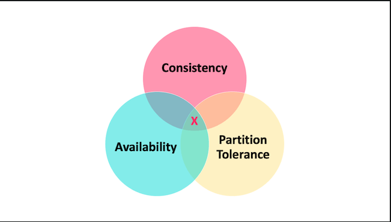

在理论计算机科学中，CAP 定理（CAP theorem）指出对于一个分布式系统来说，当设计读写操作时，只能同时满足以下三点中的两个：

+ 一致性（Consistency） : 所有节点访问同一份最新的数据副本
+ 可用性（Availability）: 非故障的节点在合理的时间内返回合理的响应（不是错误或者超时的响应）。
+ 分区容错性（Partition Tolerance） : 分布式系统出现网络分区的时候，仍然能够对外提供服务。

> 什么是网络分区？

分布式系统中，多个节点之间的网络本来是连通的，但是因为某些故障（比如部分节点网络出了问题）某些节点之间不连通了，整个网络就分成了几块区域，这就叫 网络分区。

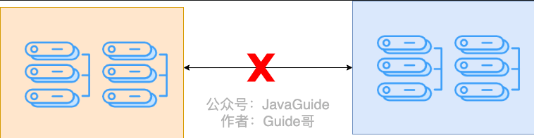

> 不是所谓的“3 选 2”

当发生网络分区的时候，如果我们要继续服务，那么强一致性和可用性只能 2 选 1。也就是说当网络分区之后 P 是前提，决定了 P 之后才有 C 和 A 的选择。也就是说分区容错性（Partition tolerance）我们是必须要实现的。

简而言之就是：CAP 理论中分区容错性 P 是一定要满足的，在此基础上，只能满足可用性 A 或者一致性 C。

因此，分布式系统理论上不可能选择 CA 架构，只能选择 CP 或者 AP 架构。 比如 ZooKeeper、HBase 就是 CP 架构，Cassandra、Eureka 就是 AP 架构，Nacos 不仅支持 CP 架构也支持 AP 架构。

> 为啥不可能选择 CA 架构呢？

举个例子：若系统出现“分区”，系统中的某个节点在进行写操作。为了保证 C， 必须要禁止其他节点的读写操作，这就和 A 发生冲突了。如果为了保证 A，其他节点的读写操作正常的话，那就和 C 发生冲突了。

选择 CP 还是 AP 的关键在于当前的业务场景，没有定论，比如对于需要确保强一致性的场景如银行一般会选择保证 CP 。

另外，需要补充说明的一点是：如果网络分区正常的话（系统在绝大部分时候所处的状态），也就说不需要保证 P 的时候，C 和 A 能够同时保证。

> CAP 实际应用案例

下图是 Dubbo 的架构图。注册中心 Registry 在其中扮演了什么角色呢？提供了什么服务呢？

注册中心负责服务地址的注册与查找，相当于目录服务，服务提供者和消费者只在启动时与注册中心交互，注册中心不转发请求，压力较小。

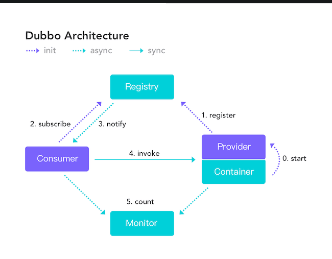

常见的可以作为注册中心的组件有：ZooKeeper、Eureka、Nacos...。
1. ZooKeeper 保证的是 CP。 任何时刻对 ZooKeeper 的读请求都能得到一致性的结果，但是，ZooKeeper 不保证每次请求的可用性比如在 Leader 选举过程中或者半数以上的机器不可用的时候服务就是不可用的。
2. Eureka 保证的则是 AP。 Eureka 在设计的时候就是优先保证 A （可用性）。在 Eureka 中不存在什么 Leader 节点，每个节点都是一样的、平等的。因此 Eureka 不会像 ZooKeeper 那样出现选举过程中或者半数以上的机器不可用的时候服务就是不可用的情况。 Eureka 保证即使大部分节点挂掉也不会影响正常提供服务，只要有一个节点是可用的就行了。只不过这个节点上的数据可能并不是最新的。
3. Nacos 不仅支持 CP 也支持 AP。

总结：
在进行分布式系统设计和开发时，我们不应该仅仅局限在 CAP 问题上，还要关注系统的扩展性、可用性等等

在系统发生“分区”的情况下，CAP 理论只能满足 CP 或者 AP。要注意的是，这里的前提是系统发生了“分区”

如果系统没有发生“分区”的话，节点间的网络连接通信正常的话，也就不存在 P 了。这个时候，我们就可以同时保证 C 和 A 了。

总结：如果系统发生“分区”，我们要考虑选择 CP 还是 AP。如果系统没有发生“分区”的话，我们要思考如何保证 CA 。

### 2. BASE 理论

BASE 是 Basically Available（基本可用）、Soft-state（软状态） 和 Eventually Consistent（最终一致性） 三个短语的缩写。BASE 理论是对 CAP 中一致性 C 和可用性 A 权衡的结果，其来源于对大规模互联网系统分布式实践的总结，是基于 CAP 定理逐步演化而来的，它大大降低了我们对系统的要求。

> BASE 理论的核心思想

即使无法做到强一致性，但每个应用都可以根据自身业务特点，采用适当的方式来使系统达到最终一致性。

也就是牺牲数据的一致性来满足系统的高可用性，系统中一部分数据不可用或者不一致时，仍需要保持系统整体“主要可用”。

BASE 理论本质上是对 CAP 的延伸和补充，更具体地说，是对 CAP 中 AP 方案的一个补充。

为什么这样说呢？

CAP 理论这节我们也说过了：如果系统没有发生“分区”的话，节点间的网络连接通信正常的话，也就不存在 P 了。这个时候，我们就可以同时保证 C 和 A 了。因此，如果系统发生“分区”，我们要考虑选择 CP 还是 AP。如果系统没有发生“分区”的话，我们要思考如何保证 CA 。

因此，AP 方案只是在系统发生分区的时候放弃一致性，而不是永远放弃一致性。在分区故障恢复后，系统应该达到最终一致性。这一点其实就是 BASE 理论延伸的地方

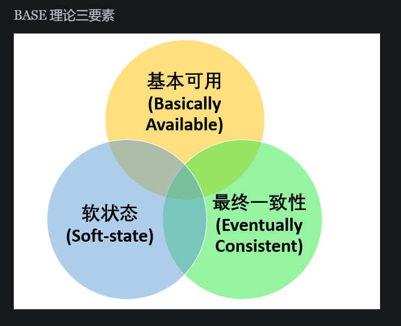

> 基本可用

基本可用是指分布式系统在出现不可预知故障的时候，允许损失部分可用性。但是，这绝不等价于系统不可用。

什么叫允许损失部分可用性呢？
+ 响应时间上的损失: 正常情况下，处理用户请求需要 0.5s 返回结果，但是由于系统出现故障，处理用户请求的时间变为 3 s。
+ 系统功能上的损失：正常情况下，用户可以使用系统的全部功能，但是由于系统访问量突然剧增，系统的部分非核心功能无法使用。

> 软状态

软状态指允许系统中的数据存在中间状态（CAP 理论中的数据不一致），并认为该中间状态的存在不会影响系统的整体可用性，即允许系统在不同节点的数据副本之间进行数据同步的过程存在延时。

> 最终一致性

最终一致性强调的是系统中所有的数据副本，在经过一段时间的同步后，最终能够达到一个一致的状态。因此，最终一致性的本质是需要系统保证最终数据能够达到一致，而不需要实时保证系统数据的强一致性。

分布式一致性的 3 种级别：
1. 强一致性：系统写入了什么，读出来的就是什么。
2. 弱一致性：不一定可以读取到最新写入的值，也不保证多少时间之后读取到的数据是最新的，只是会尽量保证某个时刻达到数据一致的状态。
3. 最终一致性：弱一致性的升级版，系统会保证在一定时间内达到数据一致的状态。业界比较推崇是最终一致性级别，但是某些对数据一致要求十分严格的场景比如银行转账还是要保证强一致性。

> 那实现最终一致性的具体方式是什么呢? 

+ 读时修复 : 在读取数据时，检测数据的不一致，进行修复。比如 Cassandra 的 Read Repair 实现，具体来说，在向 Cassandra 系统查询数据的时候，如果检测到不同节点的副本数据不一致，系统就自动修复数据。
+ 写时修复 : 在写入数据，检测数据的不一致时，进行修复。比如 Cassandra 的 Hinted Handoff 实现。具体来说，Cassandra 集群的节点之间远程写数据的时候，如果写失败 就将数据缓存下来，然后定时重传，修复数据的不一致性。
+ 异步修复 : 这个是最常用的方式，通过定时对账检测副本数据的一致性，并修复。


## 2. RPC 架构

抄自：https://cloud.tencent.com/developer/article/2021745

RPC（Remote Procedure Call Protocol）远程过程调用协议。一个通俗的描述是：客户端在不知道调用细节的情况下，调用存在于远程计算机上的某个对象，就像调用本地应用程序中的对象一样。

+ RPC是协议：既然是协议就只是一套规范，那么就需要有人遵循这套规范来进行实现。目前典型的RPC实现包括：Dubbo、Thrift、GRPC、Hetty等。

+ 网络协议和网络IO模型对其透明：既然RPC的客户端认为自己是在调用本地对象。那么传输层使用的是TCP/UDP还是HTTP协议，又或者是一些其他的网络协议它就不需要关心了。

+ 信息格式对其透明：我们知道在本地应用程序中，对于某个对象的调用需要传递一些参数，并且会返回一个调用结果。至于被调用的对象内部是如何使用这些参数，并计算出处理结果的，调用方是不需要关心的。那么对于远程调用来说，这些参数会以某种信息格式传递给网络上的另外一台计算机，这个信息格式是怎样构成的，调用方是不需要关心的。

+ 应该有跨语言能力：为什么这样说呢？因为调用方实际上也不清楚远程服务器的应用程序是使用什么语言运行的。那么对于调用方来说，无论服务器方使用的是什么语言，本次调用都应该成功，并且返回值也应该按照调用方程序语言所能理解的形式进行描述。

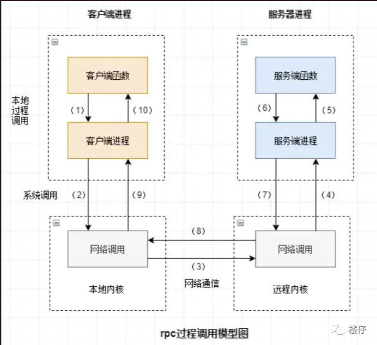

> 为什么要用RPC?

其实这是应用开发到一定的阶段的强烈需求驱动的。如果我们开发简单的单一应用，逻辑简单、用户不多、流量不大，那我们用不着。当我们的系统访问量增大、业务增多时，我们会发现一台单机运行此系统已经无法承受。此时，我们可以将业务拆分成几个互不关联的应用，分别部署在各自机器上，以划清逻辑并减小压力。此时，我们也可以不需要RPC，因为应用之间是互不关联的。

当我们的业务越来越多、应用也越来越多时，自然的，我们会发现有些功能已经不能简单划分开来或者划分不出来。此时，可以将公共业务逻辑抽离出来，将之组成独立的服务Service应用 。而原有的、新增的应用都可以与那些独立的Service应用 交互，以此来完成完整的业务功能。

所以此时，我们急需一种高效的应用程序之间的通讯手段来完成这种需求，所以你看，RPC大显身手的时候来了！

其实描述的场景也是服务化 、微服务和分布式系统架构的基础场景。即RPC框架就是实现以上结构的有力方式。


> 常用的RPC框架

+ Thrift：thrift是一个软件框架，用来进行可扩展且跨语言的服务的开发。它结合了功能强大的软件堆栈和代码生成引擎，以构建在 C++, Java, Python, PHP, Ruby, Erlang, Perl, Haskell, C#, Cocoa, JavaScript, Node.js, Smalltalk, and OCaml 这些编程语言间无缝结合的、高效的服务

+ gRPC：一开始由 google 开发，是一款语言中立、平台中立、开源的远程过程调用(RPC)系统。

+ Dubbo：Dubbo是一个分布式服务框架，以及SOA治理方案。其功能主要包括：高性能NIO通讯及多协议集成，服务动态寻址与路由，软负载均衡与容错，依赖分析与降级等。Dubbo是阿里巴巴内部的SOA服务化治理方案的核心框架，Dubbo自2011年开源后，已被许多非阿里系公司使用。

+ Spring Cloud：Spring Cloud由众多子项目组成，如Spring Cloud Config、Spring Cloud Netflix、Spring Cloud Consul 等，提供了搭建分布式系统及微服务常用的工具，如配置管理、服务发现、断路器、智能路由、微代理、控制总线、一次性token、全局锁、选主、分布式会话和集群状态等，满足了构建微服务所需的所有解决方案。Spring Cloud基于Spring Boot, 使得开发部署极其简单。

> RPC原理

RPC调用流程:

要让网络通信细节对使用者透明，我们需要对通信细节进行封装，我们先看下一个RPC调用的流程涉及到哪些通信细节：

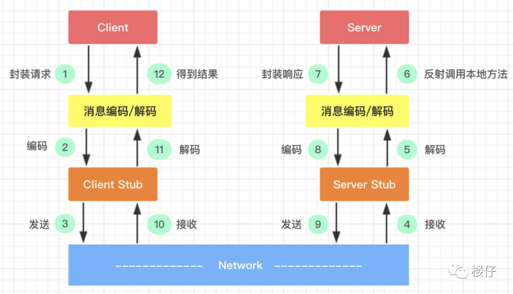

1. 服务消费方（client）调用以本地调用方式调用服务；
2. client stub接收到调用后负责将方法、参数等组装成能够进行网络传输的消息体；
3. client stub找到服务地址，并将消息发送到服务端；
4. server stub收到消息后进行解码；
5. server stub根据解码结果调用本地的服务；
6. 本地服务执行并将结果返回给server stub；
7. server stub将返回结果打包成消息并发送至消费方；
8. client stub接收到消息，并进行解码；
9. 服务消费方得到最终结果。

> 如何做到透明化远程服务调用

怎么封装通信细节才能让用户像以本地调用方式调用远程服务呢？对java来说就是使用代理！java代理有两种方式：1） jdk 动态代理；2）字节码生成。尽管字节码生成方式实现的代理更为强大和高效，但代码维护不易，大部分公司实现RPC框架时还是选择动态代理方式。

下面简单介绍下动态代理怎么实现我们的需求。我们需要实现RPCProxyClient代理类，代理类的invoke方法中封装了与远端服务通信的细节，消费方首先从RPCProxyClient获得服务提供方的接口，当执行helloWorldService.sayHello("test")方法时就会调用invoke方法。

```java
public class RPCProxyClient implements java.lang.reflect.InvocationHandler{
    private Object obj;
    public RPCProxyClient(Object obj){
        this.obj=obj;
    }
    /**
     * 得到被代理对象;
     */
    public static Object getProxy(Object obj){
        return java.lang.reflect.Proxy.newProxyInstance(obj.getClass().getClassLoader(),
                obj.getClass().getInterfaces(), new RPCProxyClient(obj));
    }
    /**
     * 调用此方法执行
     */
    public Object invoke(Object proxy, Method method, Object[] args)
            throws Throwable {
        //结果参数;
        Object result = new Object();
        // ...执行通信相关逻辑
        // ...
        return result;
    }
}
```

```java
public class Test {
     public static void main(String[] args) {         
     HelloWorldService helloWorldService = (HelloWorldService)RPCProxyClient.getProxy(HelloWorldService.class);
     helloWorldService.sayHello("test");
    }
}
```

其实就是通过动态代理模式，在执行该方法的前后对数据进行封装和解码等，让用于感觉就像是直接调用该方法一样，殊不知，我们对方法前后都经过了复杂的处理。

> 如何对消息进行编码和解码

确定消息数据结构
客户端的请求消息结构一般需要包括以下内容：

+ 接口名称：在我们的例子里接口名是“HelloWorldService”，如果不传，服务端就不知道调用哪个接口了
+ 方法名：一个接口内可能有很多方法，如果不传方法名服务端也就不知道调用哪个方法；
+ 参数类型&参数值：参数类型有很多，比如有bool、int、long、double、string、map、list，甚至如struct等，以及相应的参数值；
+ 超时时间 + requestID（标识唯一请求id）

服务端返回的消息结构一般包括以下内容：

+ 状态code + 返回值
+ requestID

**序列化**

一旦确定了消息的数据结构后，下一步就是要考虑序列化与反序列化了。

什么是序列化？序列化就是将数据结构或对象转换成二进制串的过程，也就是编码的过程。

什么是反序列化？将在序列化过程中所生成的二进制串转换成数据结构或者对象的过程。

为什么需要序列化？转换为二进制串后才好进行网络传输嘛！

为什么需要反序列化？将二进制转换为对象才好进行后续处理！

现如今序列化的方案越来越多，每种序列化方案都有优点和缺点，它们在设计之初有自己独特的应用场景，那到底选择哪种呢？从RPC的角度上看，主要看三点：

+ 通用性：比如是否能支持Map等复杂的数据结构；
+ 性能：包括时间复杂度和空间复杂度，由于RPC框架将会被公司几乎所有服务使用，如果序列化上能节约一点时间，对整个公司的收益都将非常可观，同理如果序列化上能节约一点内存，网络带宽也能省下不少；
+ 可扩展性：对互联网公司而言，业务变化飞快，如果序列化协议具有良好的可扩展性，支持自动增加新的业务字段，而不影响老的服务，这将大大提供系统的灵活度。

目前互联网公司广泛使用Protobuf、Thrift、Avro等成熟的序列化解决方案来搭建RPC框架，这些都是久经考验的解决方案。

> 如何发布自己的服务

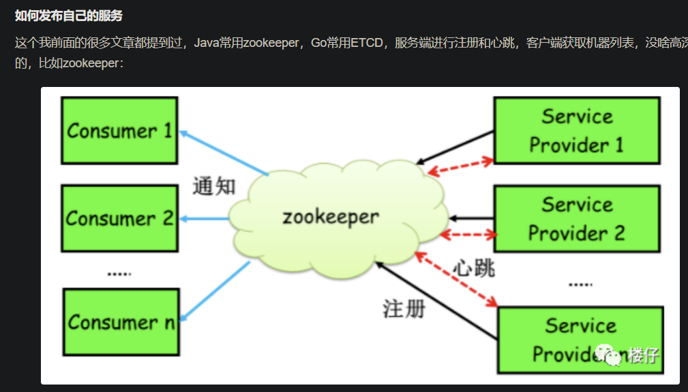

> gRPC 简介

gRPC是一个高性能、通用的开源RPC框架，其由Google 2015年主要面向移动应用开发并基于HTTP/2协议标准而设计，基于ProtoBuf序列化协议开发，且支持众多开发语言。

由于是开源框架，通信的双方可以进行二次开发，所以客户端和服务器端之间的通信会更加专注于业务层面的内容，减少了对由gRPC框架实现的底层通信的关注。

如下图，DATA部分即业务层面内容，下面所有的信息都由gRPC进行封装。 

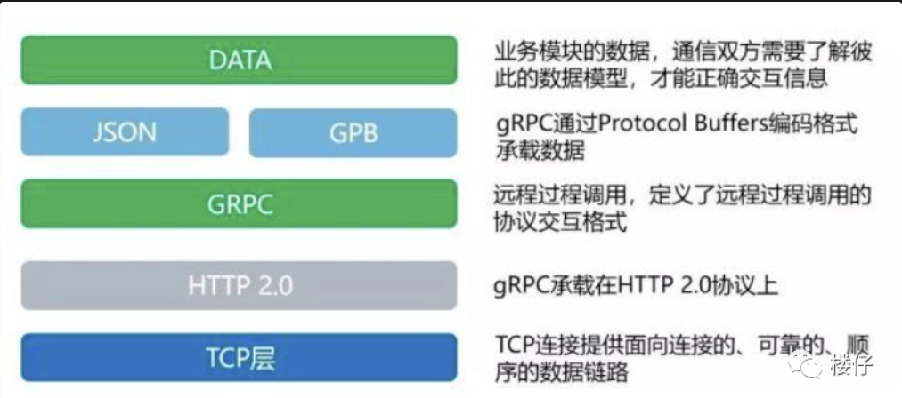

gRPC 特点
+ 语言中立，支持多种语言；
+ 基于 IDL 文件定义服务，通过 proto3 工具生成指定语言的数据结构、服务端接口以及客户端 Stub；
+ 通信协议基于标准的 HTTP/2 设计，支持双向流、消息头压缩、单 TCP 的多路复用、服务端推送等特性，这些特性使得 gRPC 在移动端设备上更加省电和节省网络流量；
+ 序列化支持 PB（Protocol Buffer）和 JSON，PB 是一种语言无关的高性能序列化框架，基于 HTTP/2 + PB, 保障了 RPC 调用的高性能。

gRPC 交互过程

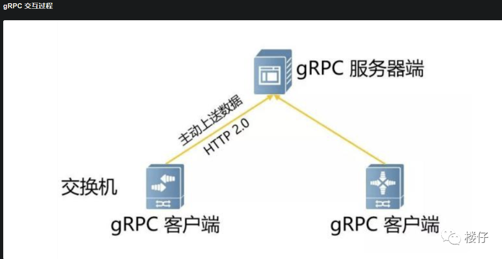

+ 交换机在开启gRPC功能后充当gRPC客户端的角色，采集服务器充当gRPC服务器角色；
+ 交换机会根据订阅的事件构建对应数据的格式（GPB/JSON），通过Protocol Buffers进行编写proto文件，交换机与服务器建立gRPC通道，通过gRPC协议向服务器发送请求消息；
+ 服务器收到请求消息后，服务器会通过Protocol Buffers解译proto文件，还原出最先定义好格式的数据结构，进行业务处理；
+ 数据处理完后，服务器需要使用Protocol Buffers重编译应答数据，通过gRPC协议向交换机发送应答消息；
+ 交换机收到应答消息后，结束本次的gRPC交互。

简单地说，gRPC就是在客户端和服务器端开启gRPC功能后建立连接，将设备上配置的订阅数据推送给服务器端。我们可以看到整个过程是需要用到Protocol Buffers将所需要处理数据的结构化数据在proto文件中进行定义。

> 什么是Protocol Buffers?

可以理解ProtoBuf是一种更加灵活、高效的数据格式，与XML、JSON类似，在一些高性能且对响应速度有要求的数据传输场景非常适用。ProtoBuf在gRPC的框架中主要有三个作用：

+ 定义数据结构
+ 定义服务接口
+ 通过序列化和反序列化，提升传输效率

> 为什么ProtoBuf会提高传输效率呢？

我们知道使用XML、JSON进行数据编译时，数据文本格式更容易阅读，但进行数据交换时，设备就需要耗费大量的CPU在I/O动作上，自然会影响整个传输速率。Protocol Buffers不像前者，它会将字符串进行序列化后再进行传输，即二进制数据。

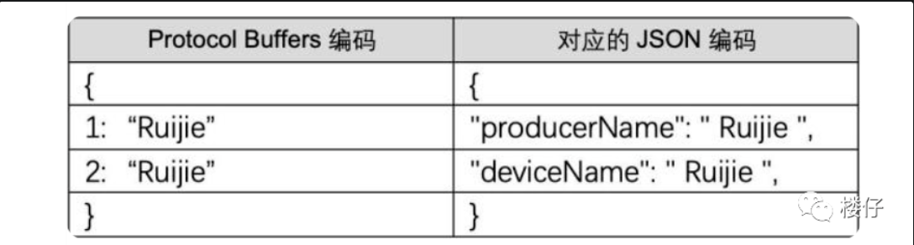

可以看到其实两者内容相差不大，并且内容非常直观，但是Protocol Buffers编码的内容只是提供给操作者阅读的，实际上传输的并不会以这种文本形式，而是序列化后的二进制数据。字节数会比JSON、XML的字节数少很多，速率更快。

> Protocol Buffers（ProtoBuf）相比 JSON，它在传输效率上有显著提升

序列化后数据体积更小:
+ 二进制编码：JSON 是基于文本的格式，使用人类可读的字符串来表示数据，包含大量的冗余字符，如括号、引号、逗号等。而 ProtoBuf 使用二进制编码，将数据转换为紧凑的二进制格式，不包含这些冗余字符，从而大幅减小了数据体积。例如，对于一个简单的整数，JSON 会将其转换为字符串形式存储，而 ProtoBuf 会以二进制形式存储，占用空间更小。
+ 字段编号：在 ProtoBuf 中，每个字段都有一个唯一的编号，在序列化和反序列化时，只需要使用这些编号来标识字段，而不需要像 JSON 那样使用字段名。这样可以减少数据传输的大小，尤其是在字段名较长的情况下，效果更加明显。

序列化和反序列化速度更快
+ 预定义数据结构：在使用 ProtoBuf 之前，需要先定义数据结构（.proto 文件），并生成相应的代码。在序列化和反序列化时，由于数据结构是预定义的，程序可以直接根据这些信息进行操作，不需要像 JSON 那样进行复杂的字符串解析和处理。
+ 高效的算法：ProtoBuf 实现了高效的序列化和反序列化算法，这些算法针对二进制数据进行了优化，能够快速地将数据转换为二进制格式或从二进制格式转换为数据对象。

网络传输开销更小
+ 数据体积小带来的优势：由于 ProtoBuf 序列化后的数据体积更小，因此在网络传输过程中，需要传输的数据量也相应减少。这不仅可以减少网络带宽的占用，还可以降低传输延迟，提高传输效率。
+ 减少传输时间：在高并发的网络环境中，数据传输时间是影响系统性能的重要因素之一。ProtoBuf 由于其数据体积小和序列化 / 反序列化速度快的特点，能够显著减少数据的传输时间，从而提高系统的整体性能。

> 如何支撑跨平台，多语言呢？

Protocol Buffers自带一个编译器也是一个优势点。前面提到的proto文件就是通过编译器进行编译的，proto文件需要编译生成一个类似库文件，基于库文件才能真正开发数据应用。具体用什么编程语言编译生成这个库文件呢？由于现网中负责网络设备和服务器设备的运维人员往往不是同一组人，运维人员可能会习惯使用不同的编程语言进行运维开发，那么Protocol Buffers其中一个优势就能发挥出来——跨语言。

从上面的介绍，我们得出在编码方面Protocol Buffers对比JSON、XML的优点：

+ 简单，体积小，数据描述文件大小只有1/10至1/3；
+ 传输和解析的速率快，相比XML等，解析速度提升20倍甚至更高；
+ 可编译性强。

> 基于HTTP 2.0标准设计

除了Protocol Buffers之外，从交互图中和分层框架可以看到， gRPC还有另外一个优势——它是基于HTTP 2.0协议的。

由于gRPC基于HTTP 2.0标准设计，带来了更多强大功能，如多路复用、二进制帧、头部压缩、推送机制。这些功能给设备带来重大益处，如节省带宽、降低TCP连接次数、节省CPU使用等。gRPC既能够在客户端应用，也能够在服务器端应用，从而以透明的方式实现两端的通信和简化通信系统的构建。

HTTP 版本分为HTTP 1.X、 HTTP 2.0，其中HTTP 1.X是当前使用最广泛的HTTP协议，HTTP 2.0称为超文本传输协议第二代。HTTP 1.X定义了四种与服务器交互的方式，分别为：GET、POST、PUT、DELETE，这些在HTTP 2.0中均保留。HTTP 2.0的新特性：

+ 双向流、多路复用
+ 二进制帧
+ 头部压缩


## 3. 分布式锁

> 为什么需要分布式锁？

在多线程环境中，如果多个线程同时访问共享资源（例如商品库存、外卖订单），会发生数据竞争，可能会导致出现脏数据或者系统问题，威胁到程序的正常运行。

举个例子，假设现在有 100 个用户参与某个限时秒杀活动，每位用户限购 1 件商品，且商品的数量只有 3 个。如果不对共享资源进行互斥访问，就可能出现以下情况：

+ 线程 1、2、3 等多个线程同时进入抢购方法，每一个线程对应一个用户。
+ 线程 1 查询用户已经抢购的数量，发现当前用户尚未抢购且商品库存还有 1 个，因此认为可以继续执行抢购流程。
+ 线程 2 也执行查询用户已经抢购的数量，发现当前用户尚未抢购且商品库存还有 1 个，因此认为可以继续执行抢购流程。
+ 线程 1 继续执行，将库存数量减少 1 个，然后返回成功。
+ 线程 2 继续执行，将库存数量减少 1 个，然后返回成功。
+ 此时就发生了超卖问题，导致商品被多卖了一份。

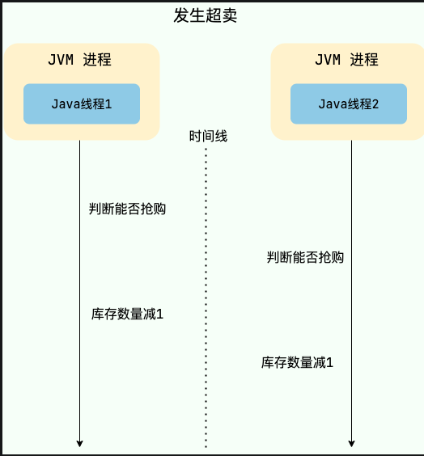

为了保证共享资源被安全地访问，我们需要使用互斥操作对共享资源进行保护，即同一时刻只允许一个线程访问共享资源，其他线程需要等待当前线程释放后才能访问。这样可以避免数据竞争和脏数据问题，保证程序的正确性和稳定性。

> 如何才能实现共享资源的互斥访问呢？ 锁是一个比较通用的解决方案，更准确点来说是悲观锁。

悲观锁总是假设最坏的情况，认为共享资源每次被访问的时候就会出现问题(比如共享数据被修改)，所以每次在获取资源操作的时候都会上锁，这样其他线程想拿到这个资源就会阻塞直到锁被上一个持有者释放。也就是说，共享资源每次只给一个线程使用，其它线程阻塞，用完后再把资源转让给其它线程。

对于单机多线程来说，在 Java 中，我们通常使用 ReentrantLock 类、synchronized 关键字这类 JDK 自带的 本地锁 来控制一个 JVM 进程内的多个线程对本地共享资源的访问。

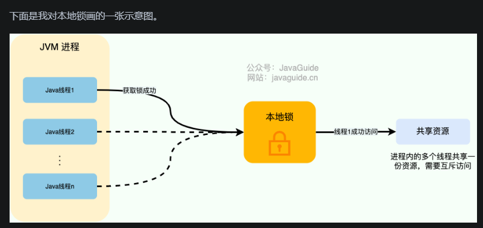

分布式系统下，不同的服务/客户端通常运行在独立的 JVM 进程上。如果多个 JVM 进程共享同一份资源的话，使用本地锁就没办法实现资源的互斥访问了。于是，分布式锁 就诞生了。

举个例子：系统的订单服务一共部署了 3 份，都对外提供服务。用户下订单之前需要检查库存，为了防止超卖，这里需要加锁以实现对检查库存操作的同步访问。由于订单服务位于不同的 JVM 进程中，本地锁在这种情况下就没办法正常工作了。我们需要用到分布式锁，这样的话，即使多个线程不在同一个 JVM 进程中也能获取到同一把锁，进而实现共享资源的互斥访问。

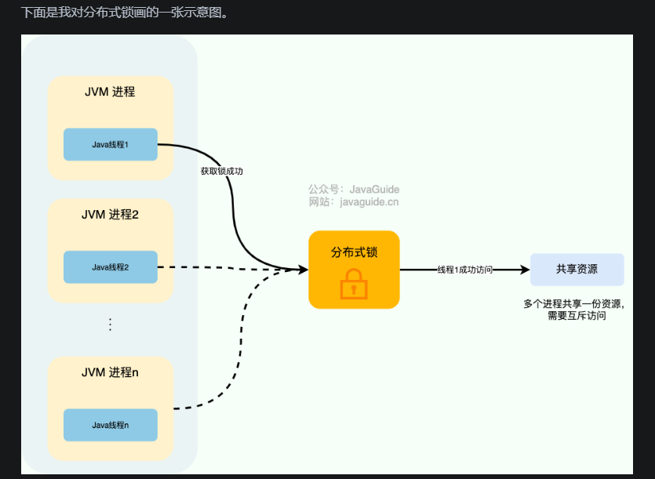

从图中可以看出，这些独立的进程中的线程访问共享资源是互斥的，同一时刻只有一个线程可以获取到分布式锁访问共享资源

> 分布式锁应该具备哪些条件？

+ 互斥：任意一个时刻，锁只能被一个线程持有。
+ 高可用：锁服务是高可用的，当一个锁服务出现问题，能够自动切换到另外一个锁服务。并且，即使客户端的释放锁的代码逻辑出现问题，锁最终一定还是会被释放，不会影响其他线程对共享资源的访问。这一般是通过超时机制实现的。
+ 可重入：一个节点获取了锁之后，还可以再次获取锁。

了上面这三个基本条件之外，一个好的分布式锁还需要满足下面这些条件：
+ 高性能：获取和释放锁的操作应该快速完成，并且不应该对整个系统的性能造成过大影响。
+ 非阻塞：如果获取不到锁，不能无限期等待，避免对系统正常运行造成影响。分布式锁的常见实现方式有哪些？

> 分布式锁的常见实现方式有哪些？

常见分布式锁实现方案如下：

+ 基于关系型数据库比如 MySQL 实现分布式锁。
+ 基于分布式协调服务 ZooKeeper 实现分布式锁。
+ 基于分布式键值存储系统比如 Redis 、Etcd 实现分布式锁。

关系型数据库的方式一般是通过唯一索引或者排他锁实现。不过，一般不会使用这种方式，问题太多比如性能太差、不具备锁失效机制。


> 基于 Redis 实现分布式锁

如何基于 Redis 实现一个最简易的分布式锁？

不论是本地锁还是分布式锁，核心都在于“互斥”。

在 Redis 中， SETNX 命令是可以帮助我们实现互斥。SETNX 即 SET if Not eXists (对应 Java 中的 setIfAbsent 方法)，如果 key 不存在的话，才会设置 key 的值。如果 key 已经存在， SETNX 啥也不做。

```sql
SETNX lockKey uniqueValue
(integer) 1
SETNX lockKey uniqueValue
(integer) 0
```

释放锁的话，直接通过 DEL 命令删除对应的 key 即可。

```sql
DEL lockKey
(integer) 1
```

为了防止误删到其他的锁，这里我们建议使用 Lua 脚本通过 key 对应的 value（唯一值）来判断。

选用 Lua 脚本是为了保证解锁操作的原子性。因为 Redis 在执行 Lua 脚本时，可以以原子性的方式执行，从而保证了锁释放操作的原子性。

保证操作的原子性
+ SETNX 与解锁操作的原子性问题：在分布式锁的使用过程中，加锁可以使用 SETNX 命令，但解锁操作不仅要删除锁对应的键，还需要先检查当前锁是否为当前客户端所持有（即锁的值是否与客户端设置的值一致），避免误删其他客户端的锁。如果不使用 Lua 脚本，那么检查锁值和删除锁这两个操作就需要分开执行，在多线程或多客户端环境下，可能会出现竞态条件。
+ Lua 脚本的原子性：Redis 执行 Lua 脚本时是原子性的，这意味着在脚本执行期间，不会有其他命令插入执行。因此，使用 Lua 脚本将检查锁值和删除锁这两个操作封装在一起，可以保证整个解锁过程的原子性，避免了竞态条件的发生。

> 为什么在 Redis 里使用 Lua 脚本能够保证操作的原子性

这主要和 Redis 的执行机制相关；
Redis 采用单线程模型来处理客户端的请求，也就是说在同一时间，Redis 只会执行一个命令或者一个 Lua 脚本。当一个 Lua 脚本被发送到 Redis 服务器时，Redis 会将其当作一个整体任务来执行，在这个脚本执行的过程中，不会去处理其他客户端的请求。

```sql
// 释放锁时，先比较锁对应的 value 值是否相等，避免锁的误释放
if redis.call("get",KEYS[1]) == ARGV[1] then
    return redis.call("del",KEYS[1])
else
    return 0
end
```

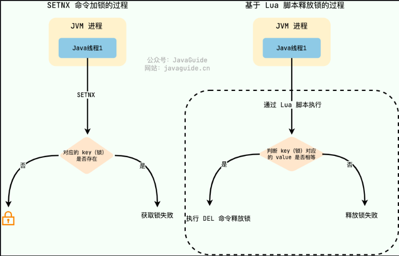

这是一种最简易的 Redis 分布式锁实现，实现方式比较简单，性能也很高效。

不过，这种方式实现分布式锁存在一些问题。就比如应用程序遇到一些问题比如释放锁的逻辑突然**挂掉**，可能会导致锁无法被释放，进而造成共享资源无法再被其他线程/进程访问。

> 为什么要给锁设置一个过期时间？

问题：
1. 当锁过期时线程还在处理业务中
2. 当处理完释放其他线程的锁
解决：
1. 加长时间，并添加子线程每10s确认线程是否存在，在线程即将过期时时间重设
2. 给锁增加唯一id


为了避免锁无法被释放，我们可以想到的一个解决办法就是：给这个 key（也就是锁） 设置一个过期时间 。

```sql
127.0.0.1:6379> SET lockKey uniqueValue EX 3 NX
OK
```

+ lockKey：加锁的锁名；
+ uniqueValue：能够唯一标识锁的随机字符串；
+ NX：只有当 lockKey 对应的 key 值不存在的时候才能 SET 成功；
+ EX：过期时间设置（秒为单位）EX 3 标示这个锁有一个 3 秒的自动过期时间。与 EX 对应的是 PX（毫秒为单位），这两个都是过期时间设置。

一定要保证**设置指定 key 的值和过期时间**是一个原子操作！！！ 不然的话，依然可能会出现锁无法被释放的问题。

这样确实可以解决问题，不过，这种解决办法同样存在漏洞：如果操作共享资源的时间大于过期时间，就会出现锁提前过期的问题，进而导致分布式锁直接失效。如果锁的超时时间设置过长，又会影响到性能。

你或许在想：如果操作共享资源的操作还未完成，锁过期时间能够自己续期就好了！

> 如何实现锁的优雅续期？

Redisson 是一个开源的 Java 语言 Redis 客户端，提供了很多开箱即用的功能，不仅仅包括多种分布式锁的实现。并且，Redisson 还支持 Redis 单机、Redis Sentinel、Redis Cluster 等多种部署架构。

Redisson 中的分布式锁自带**自动续期机制**，使用起来非常简单，原理也比较简单，其提供了一个专门用来监控和续期锁的 Watch Dog（ 看门狗），如果操作共享资源的线程还未执行完成的话，Watch Dog 会不断地延长锁的过期时间，进而保证锁不会因为超时而被释放。

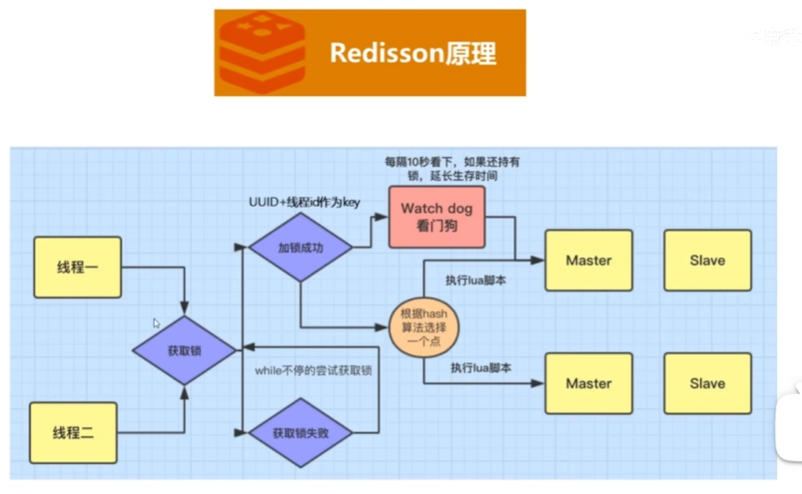

如果redis采用集群模式，因为是AP模式，当设置一个锁的时候，只会向一个节点上锁，设置成功后，就会立马返回，然后内部进行同步。但是如果设置到主节点（上锁），但是此时主节点挂掉了，但是从节点没有同步，这时就会发生线程不安全（没有上锁）；

解决方法：red lock,他会保证所有的节点上锁。相当于同步，他会等待所有的节点都上完锁，然后才返回。

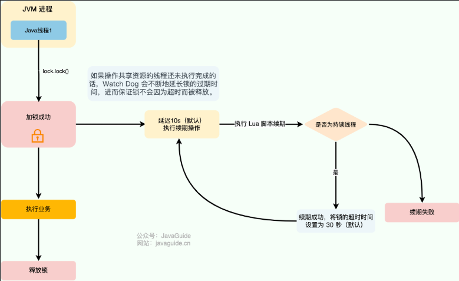


看门狗名字的由来于 getLockWatchdogTimeout() 方法，这个方法返回的是看门狗给锁续期的过期时间，默认为 30 秒

```java
//默认 30秒，支持修改
private long lockWatchdogTimeout = 30 * 1000;

public Config setLockWatchdogTimeout(long lockWatchdogTimeout) {
    this.lockWatchdogTimeout = lockWatchdogTimeout;
    return this;
}
public long getLockWatchdogTimeout() {
   return lockWatchdogTimeout;
}
```

renewExpiration() 方法包含了看门狗的主要逻辑：

```java
private void renewExpiration() {
         //......
        Timeout task = commandExecutor.getConnectionManager().newTimeout(new TimerTask() {
            @Override
            public void run(Timeout timeout) throws Exception {
                //......
                // 异步续期，基于 Lua 脚本
                CompletionStage<Boolean> future = renewExpirationAsync(threadId);
                future.whenComplete((res, e) -> {
                    if (e != null) {
                        // 无法续期
                        log.error("Can't update lock " + getRawName() + " expiration", e);
                        EXPIRATION_RENEWAL_MAP.remove(getEntryName());
                        return;
                    }

                    if (res) {
                        // 递归调用实现续期
                        renewExpiration();
                    } else {
                        // 取消续期
                        cancelExpirationRenewal(null);
                    }
                });
            }
         // 延迟 internalLockLeaseTime/3（默认 10s，也就是 30/3） 再调用
        }, internalLockLeaseTime / 3, TimeUnit.MILLISECONDS);

        ee.setTimeout(task);
    }
```

默认情况下，每过 10 秒，看门狗就会执行续期操作，将锁的超时时间设置为 30 秒。看门狗续期前也会先判断是否需要执行续期操作，需要才会执行续期，否则取消续期操作。

Watch Dog 通过调用 renewExpirationAsync() 方法实现锁的异步续期：

```java
protected CompletionStage<Boolean> renewExpirationAsync(long threadId) {
    return evalWriteAsync(getRawName(), LongCodec.INSTANCE, RedisCommands.EVAL_BOOLEAN,
            // 判断是否为持锁线程，如果是就执行续期操作，就锁的过期时间设置为 30s（默认）
            "if (redis.call('hexists', KEYS[1], ARGV[2]) == 1) then " +
                    "redis.call('pexpire', KEYS[1], ARGV[1]); " +
                    "return 1; " +
                    "end; " +
                    "return 0;",
            Collections.singletonList(getRawName()),
            internalLockLeaseTime, getLockName(threadId));
}
```

可以看出， renewExpirationAsync 方法其实是调用 Lua 脚本实现的续期，这样做主要是为了保证续期操作的原子性。

我这里以 Redisson 的分布式可重入锁 RLock 为例来说明如何使用 Redisson 实现分布式锁：

```java
// 1.获取指定的分布式锁对象
RLock lock = redisson.getLock("lock");
// 2.拿锁且不设置锁超时时间，具备 Watch Dog 自动续期机制
lock.lock();
// 3.执行业务
...
// 4.释放锁
lock.unlock();
```

只有未指定锁超时时间，才会使用到 Watch Dog 自动续期机制。

```java
// 手动给锁设置过期时间，不具备 Watch Dog 自动续期机制
lock.lock(10, TimeUnit.SECONDS);
```

> 如何实现可重入锁？

所谓可重入锁指的是在一个线程中可以多次获取同一把锁，比如一个线程在执行一个带锁的方法，该方法中又调用了另一个需要相同锁的方法，则该线程可以直接执行调用的方法即可重入 ，而无需重新获得锁。像 Java 中的 synchronized 和 ReentrantLock 都属于可重入锁。

不可重入的分布式锁基本可以满足绝大部分业务场景了，一些特殊的场景可能会需要使用可重入的分布式锁。

可重入分布式锁的实现核心思路是线程在获取锁的时候**判断是否为自己的锁**，如果是的话，就不用再重新获取了。为此，我们可以为每个锁关联一个可重入计数器和一个占有它的线程。当可重入计数器大于 0 时，则锁被占有，需要判断占有该锁的线程和请求获取锁的线程是否为同一个。

实际项目中，我们不需要自己手动实现，推荐使用我们上面提到的 Redisson ，其内置了多种类型的锁比如可重入锁（Reentrant Lock）、自旋锁（Spin Lock）、公平锁（Fair Lock）、多重锁（MultiLock）、 红锁（RedLock）、 读写锁（ReadWriteLock）。

> Redis 如何解决集群情况下分布式锁的可靠性？

为了避免单点故障，生产环境下的 Redis 服务通常是集群化部署的。

Redis 集群下，上面介绍到的分布式锁的实现会存在一些问题。由于 Redis 集群数据同步到各个节点时是异步的，如果在 Redis 主节点获取到锁后，在没有同步到其他节点时，Redis 主节点宕机了，此时新的 Redis 主节点依然可以获取锁，所以多个应用服务就可以同时获取到锁。

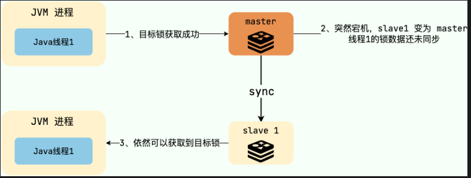

Redlock 算法的思想是让客户端向 Redis 集群中的多个独立的 Redis 实例依次请求申请加锁，如果(**客户端能够和半数以上**)的实例成功地完成加锁操作，那么我们就认为，客户端成功地获得分布式锁，否则加锁失败。

即使部分 Redis 节点出现问题，只要保证 Redis 集群中有半数以上的 Redis 节点可用，分布式锁服务就是正常的。

Redlock 是直接操作 Redis 节点的，并不是通过 Redis 集群操作的，这样才可以避免 Redis 集群主从切换导致的锁丢失问题。

> redlock加锁有什么问题？

1. 时钟漂移问题

+ 原理：Redlock 的算法依赖于系统时钟的准确性。在加锁过程中，它会记录锁的过期时间，并且在多个 Redis 节点上进行操作。如果不同 Redis 节点的时钟存在较大的漂移，可能会导致锁的过期时间计算不准确。
+ 影响：例如，某个节点的时钟比其他节点快，那么在该节点上设置的锁可能会提前过期，从而导致多个客户端同时获得锁，破坏了锁的互斥性。

3. 性能问题

+ 原理：Redlock 需要在多个 Redis 节点上进行加锁和解锁操作，这会增加网络开销和操作的延迟。与单节点的分布式锁相比，Redlock 的性能会有所下降。
+ 影响：在高并发场景下，频繁的网络请求和操作延迟可能会成为系统的瓶颈，影响系统的性能和响应速度。

4. 节点崩溃恢复问题

+ 原理：当 Redis 节点崩溃后又恢复时，可能会丢失之前设置的锁信息。如果在节点崩溃期间，客户端已经在其他节点上加锁，而恢复后的节点又允许其他客户端加锁，就会导致多个客户端同时持有锁。
+ 影响：为了避免这种情况，需要在节点恢复后进行数据同步和锁的检查，但这会增加系统的复杂性和处理时间。

## 4. 分布式事务

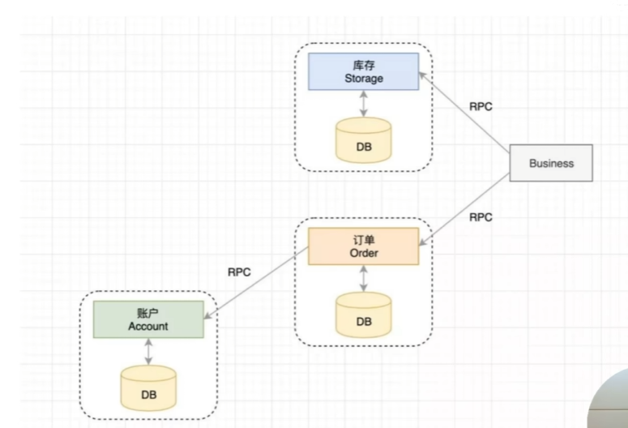

一个操作，可能操作三个不同的库，比如这里的 库存、订单、账户。每一个库中都有自己的事务，那么我们怎么保证若一个库中的事务出错，其他的库就要回滚呢？分布式事务。

### 4.1 分布式事务解决方案 2PC

1. 2pc 也就是两阶提交

2PC即两阶段提交协议，是将整个事务流程分为两个阶段，准备阶段（Prepare phase）、提交阶段（commit phase），2是指两个阶段，P是指准备阶段，C是指提交阶段。

二阶段提交是一种**强一致性设计**，2PC 引入一个事务协调者的角色来协调管理各参与者（也可称之为各本地资源）的提交和回滚，二阶段分别指的是准备（投票）和提交两个阶段。

在计算机中部分关系数据库如Oracle、MySQL支持两阶段提交协议，如下图：

1.准备阶段（Prepare phase）：事务管理器给每个参与者发送Prepare消息，每个数据库参与者在本地执行事务，并写本地的Undo/Redo日志，此时事务没有提交。（Undo日志是记录修改前的数据，用于数据库回滚，Redo日志是记录修改后的数据，用于提交事务后写入数
据文件）

2.提交阶段（commit phase）：如果事务管理器收到了参与者的执行失败或者超时消息时，直接给每个参与者发送回滚(Rollback)消息；否则，发送提交(Commit)消息；参与者根据事务管理器的指令执行提交或者回滚操作，并释放事务处理过程中使用的锁资源。注意:必须在最后阶段释放锁资源。

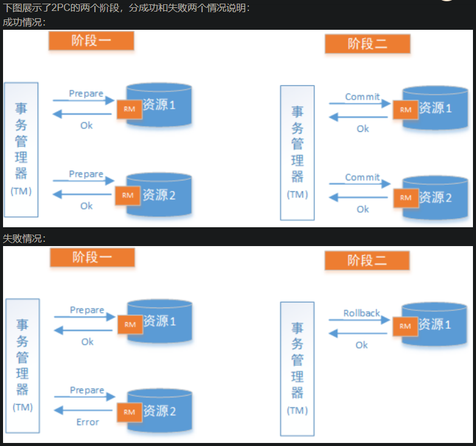

缺点：
1. 2PC 是一种尽量保证强一致性的分布式事务，因此它是同步阻塞的，而同步阻塞就导致长久的资源锁定问题，总体而言效率低，并且存在单点故障问题，在极端条件下存在数据不一致的风险。
2. 如果事务在第一阶段已经不可用，那么在第二阶段就会进行回滚。那么就造成了其他事务的资源浪费。
3. 数据不一致：在事务管理器向所有服务发送提交事务Commit阶段时，某些参与者可能发生网络抖动，无法正常接收到Commit请求，从而导致每个参与者的数据不一致

> XA方案

2PC的传统方案是在数据库层面实现的，如Oracle、MySQL都支持2PC协议，为了统一标准减少行业内不必要的对接成本，需要制定标准化的处理模型及接口标准，国际开放标准组织Open Group定义了分布式事务处理模型DTP（Distributed Transaction Processing Reference Model）。

下面新用户注册送积分为例来说明：

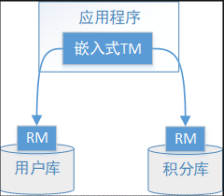

执行流程如下：
1、应用程序（AP）持有用户库和积分库两个数据源。
2、应用程序（AP）通过TM通知用户库RM新增用户，同时通知积分库RM为该用户新增积分，RM此时并未提交事务，此时用户和积分资源锁定。
3、TM收到执行回复，只要有一方失败则分别向其他RM发起回滚事务，回滚完毕，资源锁释放。
4、TM收到执行回复，全部成功，此时向所有RM发起提交事务，提交完毕，资源锁释放。


### 4.2 分布式事务解决方啊 3pc

3PC 的出现是为了解决 2PC 的一些问题，相比于 2PC 它在参与者中也引入了超时机制，并且新增了一个阶段使得参与者可以利用这一个阶段统一各自的状态。

解决缺点2：如果事务在第一阶段已经不可用，那么在第二阶段就会进行回滚。那么就造成了其他事务的资源浪费。

3PC 包含了三个阶段，分别是准备阶段、预提交阶段和提交阶段，对应的英文就是：CanCommit、PreCommit 和 DoCommit。

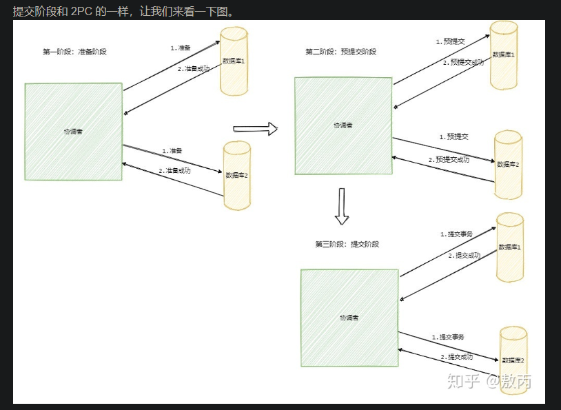

首先准备阶段的变更成不会直接执行事务，而是会先去询问此时的参与者是否有条件接这个事务，因此不会一来就干活直接锁资源，使得在某些资源不可用的情况下所有参与者都阻塞着。

而预提交阶段引入起到了一个统一状态的作用，它像一道栅栏，表明在预提交阶段前所有参与者其实还未都回应，在预处理阶段表明所有参与者都已经回应了。


## 5. 分布式 ID

> 1. 什么是分布式 ID？

分布式 ID 是分布式系统下的 ID。分布式 ID 不存在与现实生活中，属于计算机系统中的一个概念。

简单举一个分库分表的例子。

我司的一个项目，使用的是单机 MySQL 。但是，没想到的是，项目上线一个月之后，随着使用人数越来越多，整个系统的数据量将越来越大。单机 MySQL 已经没办法支撑了，需要进行分库分表（推荐 Sharding-JDBC）。

在分库之后， 数据遍布在不同服务器上的数据库，数据库的自增主键已经没办法满足生成的主键唯一了。我们如何为不同的数据节点生成全局唯一主键呢？

这个时候就需要生成分布式 ID了。

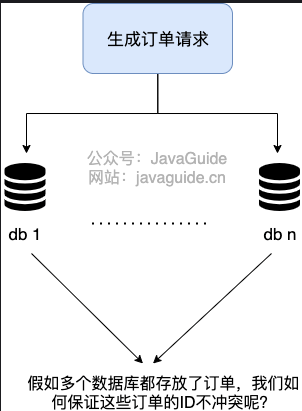

> 2. 分布式 ID 需要满足哪些要求?

一个最基本的分布式 ID 需要满足下面这些要求：

+ 全局唯一：ID 的全局唯一性肯定是首先要满足的！
+ 高性能：分布式 ID 的生成速度要快，对本地资源消耗要小。
+ 高可用：生成分布式 ID 的服务要保证可用性无限接近于 100%。
+ 方便易用：拿来即用，使用方便，快速接入！

除了这些之外，一个比较好的分布式 ID 还应保证：

+ 安全：ID 中不包含敏感信息。

+ 有序递增：如果要把 ID 存放在数据库的话，ID 的有序性可以提升数据库写入速度。并且，很多时候 ，我们还很有可能会直接通过 ID 来进行排序。

+ 有具体的业务含义：生成的 ID 如果能有具体的业务含义，可以让定位问题以及开发更透明化（通过 ID 就能确定是哪个业务）。

+ 独立部署：也就是分布式系统单独有一个发号器服务，专门用来生成分布式 ID。这样就生成 ID 的服务可以和业务相关的服务解耦。不过，这样同样带来了网络调用消耗增加的问题。总的来说，如果需要用到分布式 ID 的场景比较多的话，独立部署的发号器服务还是很有必要的。

> 3. 分布式 ID 常见解决方案

数据库
数据库主键自增
这种方式就比较简单直白了，就是通过关系型数据库的自增主键产生来唯一的 ID。

1.创建一个数据库表。
```sql
CREATE TABLE `sequence_id` (
  `id` bigint(20) unsigned NOT NULL AUTO_INCREMENT,
  `stub` char(10) NOT NULL DEFAULT '',
  PRIMARY KEY (`id`),
  UNIQUE KEY `stub` (`stub`)
) ENGINE=InnoDB DEFAULT CHARSET=utf8mb4;
```

stub 字段无意义，只是为了占位，便于我们插入或者修改数据。并且，给 stub 字段创建了唯一索引，保证其唯一性。

2.通过 replace into 来插入数据。

```sql
BEGIN;
REPLACE INTO sequence_id (stub) VALUES ('stub');
SELECT LAST_INSERT_ID();
COMMIT;
```

插入数据这里，我们没有使用 insert into 而是使用 replace into 来插入数据，具体步骤是这样的：

+ 第一步：尝试把数据插入到表中。
+ 第二步：如果主键或唯一索引字段出现重复数据错误而插入失败时，先从表中删除含有重复关键字值的冲突行，然后再次尝试把数据插入到表中。

这种方式的优缺点也比较明显：

+ 优点：实现起来比较简单、ID 有序递增、存储消耗空间小
+ 缺点：支持的并发量不大、存在数据库单点问题（可以使用数据库集群解决，不过增加了复杂度）、ID 没有具体业务含义、安全问题（比如根据订单 ID 的递增规律就能推算出每天的订单量，商业机密啊！ ）、每次获取 ID 都要访问一次数据库（增加了对数据库的压力，获取速度也


> UUID

UUID 是 Universally Unique Identifier（通用唯一标识符） 的缩写。UUID 包含 32 个 16 进制数字（8-4-4-4-12）。


> 雪花算法 Snowflake

Snowflake 是 Twitter 开源的分布式 ID 生成算法。Snowflake 由 64 bit 的二进制数字组成，这 64bit 的二进制被分成了几部分，每一部分存储的数据都有特定的含义：

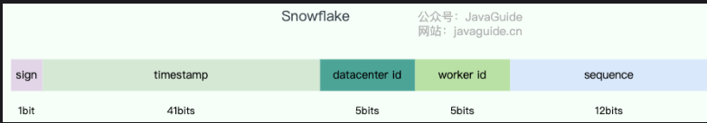

+ sign(1bit):符号位（标识正负），始终为 0，代表生成的 ID 为正数。
+ timestamp (41 bits):一共 41 位，用来表示时间戳，单位是毫秒，可以支撑 2 ^41 毫秒（约 69 年）
+ datacenter id + worker id (10 bits):一般来说，前 5 位表示机房 ID，后 5 位表示机器 ID（实际项目中可以根据实际情况调整）。这样就可以区分不同集群/机房的节点。
+ sequence (12 bits):一共 12 位，用来表示序列号。 序列号为自增值，代表单台机器每毫秒能够产生的最大 ID 数(2^12 = 4096),也就是说单台机器每毫秒最多可以生成 4096 个 唯一 ID。

在实际项目中，我们一般也会对 Snowflake 算法进行改造，最常见的就是在 Snowflake 算法生成的 ID 中加入业务类型信息。

我们再来看看 Snowflake 算法的优缺点：
+ 优点：生成速度比较快、生成的 ID 有序递增、比较灵活（可以对 Snowflake 算法进行简单的改造比如加入业务 ID）

+ 缺点：需要解决重复 ID 问题（ID 生成依赖时间，在获取时间的时候，可能会出现时间回拨的问题，也就是服务器上的时间突然倒退到之前的时间，进而导致会产生重复 ID）、依赖机器 ID 对分布式环境不友好（当需要自动启停或增减机器时，固定的机器 ID 可能不够灵活）。

如果你想要使用 Snowflake 算法的话，一般不需要你自己再造轮子。有很多基于 Snowflake 算法的开源实现比如美团 的 Leaf、百度的 UidGenerator（后面会提到），并且这些开源实现对原有的 Snowflake 算法进行了优化，性能更优秀，还解决了 Snowflake 算法的时间回拨问题和依赖机器 ID 的问题。

并且，Seata 还提出了“改良版雪花算法”，针对原版雪花算法进行了一定的优化改良，解决了时间回拨问题，大幅提高的 QPS。具体介绍和改进原理，可以参考下面这两篇文章：


