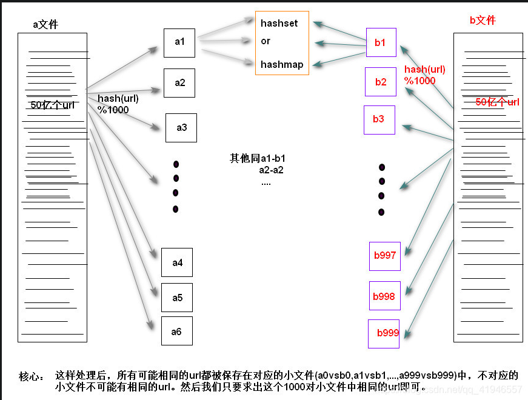
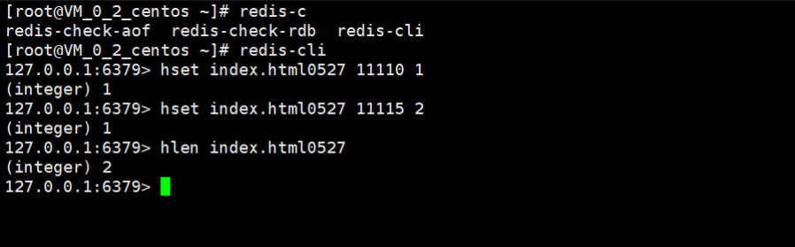
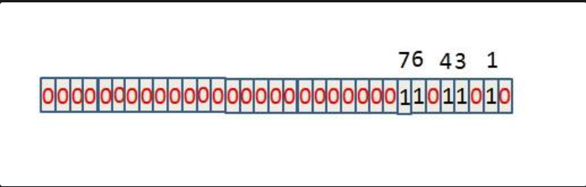
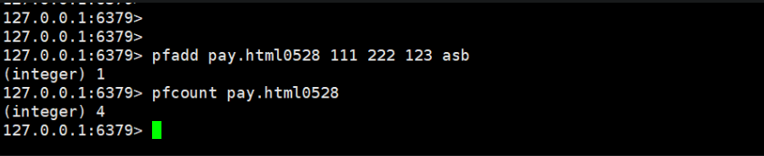

### 1.一个存储IP地址的100G 的文件, 找出现次数最多的 IP ？

使用MapReduce的思想解决，加上哈希分割，先将大文件中的IP地址按照哈希函数进行分割，存到多个文件上，接着每个分片单独处理，用Hashmap统计IP出现频次，记录当前分片最大值。最后归并处理，找出所有候选IP中的最大出现次数的IP。

1. 哈希分割（预处理阶段）

① 使用高效哈希函数计算每个IP的哈希值② 按哈希值取模分片：hash(ip) % N → 生成N个分片文件

分片数计算：假设可用内存1G，每个分片限制为50MB → N=2000分片

2. 分块统计（Map阶段）

每个分片处理时：
+ 将小文件加载到内存中
+ ① 使用HashMap<String, Long>统计IP出现频率 
+ ② 同步维护当前分片的最大值：maxIP和maxCount

3. 全局归并（Reduce阶段）

+ 读取所有中间结果文件中的最高频IP
+ 在这些候选IP中找出全局出现次数最多的IP

4. 关键问题

1.哈希函数设计  file_index = hash(IP地址) % 256

这个哈希函数确保了同一个IP地址一定会被映射到同一个文件索引

2.某个分割的文件仍然过大，怎么解决？

若某分片的IP种类过多导致HashMap溢出，解决方案：

对该分片进行二次哈希分片

5. 面试回答模板

1. 哈希分片：将IP按哈希值分散到256个分片中，确保相同IP在同一分片；
2. 分块统计：对每个分片使用HashMap统计频率，同时记录分片内的最大值；
3. 全局归并：比较所有分片的最大值得到最终结果。

### 2. 100G的文件里有很多id，用1G内存的机器排序，怎么做？

海量数据排序思路
核心方案：外排序（分治+多路归并）MapReduce

外排序是指数据量太大，无法全部加载到内存中，需要将数据分成多个小块进行排序，然后将排序后的小块合并成一个大的有序块

1. 分块排序（Map阶段）

+ 分块策略 按1G内存容量限制，将100G文件拆分为 200个500MB分块（保留内存用于排序计算和系统开销）

+ 内存排序 每个分块加载至内存后： ① 使用快速排序（时间复杂度O(n log n)） ② 去重优化：若存在重复ID，排序时合并相同项（节省存储空间），根据要求是否去重

+ 临时文件写入 排序后分块写入磁盘，命名规则：chunk_0001.sorted ~ chunk_0200.sorted

2. 多路归并（Reduce阶段）

使用K路归并算法合并这些排序好的小文件

具体实现方法：

+ 从每个小文件中读取一小部分数据到内存（例如每个文件读取几MB）
+ 建立最小堆（优先队列）来追踪当前每个文件的最小值
+ 每次从堆中取出最小值，写入输出文件
+ 从该最小值所在的文件再读入一个ID到堆中
+ 重复上述过程直到所有文件都处理完

具体示例：

① 分批归并：每轮合并50个分块（50路归并），共需4轮（200/50）
② 堆排序优化：使用 最小堆（PriorityQueue） 管理各分块当前读取值


### 3. 如果页16kb，bigint类型索引，每行6kb数据，问三层b+树的最大占用内存

计算节点指针大小
一般来说，节点指针的大小通常为 4 字节或 8 字节，这里假设为8 字节。

计算叶子节点能存储的记录数
+ 页大小为 16KB，即 16 * 1024 = 16384 字节。
+ 每个记录为 6KB，即 6 * 1024 = 6144 字节。
+ 假设每个叶子节点除了数据记录外，还需要额外的开销来存储一些元数据，比如记录的数量等，这里假设额外开销为16 字节。
+ 那么每个叶子节点能存储的记录数为：(16384 - 16) // 6144 ≈ 2 条记录（向下取整）。


计算非叶子节点能存储的指针数
+ 非叶子节点主要存储索引值和指向子节点的指针。
+ 假设每个索引值（bigint 类型）占用8 字节。
+ 那么每个非叶子节点能存储的指针数为：16384 // (8 + 8) = 1024 个指针（向下取整）。

计算三层 B + 树能存储的记录数
+ 第一层（根节点）是一个非叶子节点，能存储 1024 个指针，指向第二层的 1024 个节点。
+ 第二层是非叶子节点层，每个节点能存储 1024 个指针，所以第二层总共能存储 1024 * 1024 个指针，指向第三层的叶子节点。
+ 第三层是叶子节点层，每个叶子节点能存储 2 条记录，所以第三层总共能存储 1024 * 1024 * 2 条记录。

计算三层 B + 树占用的内存
+ 叶子节点占用内存：(1024 * 1024 * 2) * 6144 字节 = 1024 * 1024 * 12288 字节
+ 非叶子节点占用内存：(1 + 1024 + 1024 * 1024) * 16384 字节


### 4· 如何在100亿数据中找到最大的1000个数,时间复杂度?

方法一：

对于小顶堆来说移动根元素到 底部或者移动底部元素到根部只需要log2N，相比N来说时间复杂度优化太多了（1亿的logN值是26-27的一个浮点数）

具体思路：先从文件中取出1000个元素构建一个最小堆数组（O（log 1000）），然后对剩下的100亿-1000个数字m进行遍历,如果当前元素大于 最小堆的堆顶，

算法步骤
1. 初始化小顶堆：从输入的十亿个数中先取出 1000 个数，构建一个小顶堆。这个堆的大小为 1000。

2. 遍历剩余的数：对剩下的数依次进行如下操作：
+ 将当前数与堆顶元素比较，如果当前数大于堆顶元素，说明当前数有可能是前 100 大的数。
+ 用当前数替换堆顶元素，然后对堆进行调整，使其重新满足小顶堆的性质。

3. 得到结果：遍历完所有数后，堆中的 100 个数就是前 100 个最大的数。

O(n logk)

方法二：分治法  即大数据里最常用的MapReduce。

a、将100亿个数据分为1000个大分区，每个区1000万个数据

b、每个大分区再细分成100个小分区。总共就有1000*100=10万个分区

c、计算每个小分区上最大的1000个数

为什么要找出每个分区上最大的1000个数？举个例子说明，全校高一有100个班，我想找出全校前10名的同学，很傻的办法就是，把高一100个班的同学成绩都取出来，作比较，这个比较数据量太大了。应该很容易想到，班里的第11名，不可能是全校的前10名。也就是说，不是班里的前10名，就不可能是全校的前10名。因此，只需要把每个班里的前10取出来，作比较就行了，这样比较的数据量就大大地减少了。我们要找的是100亿中的最大1000个数，所以每个分区中的第1001个数一定不可能是所有数据中的前1000个。

d、合并每个大分区细分出来的小分区。每个大分区有100个小分区，我们已经找出了每个小分区的前1000个数。将这100个分区的1000*100个数合并，找出每个大分区的前1000个数。

e、合并大分区。我们有1000个大分区，上一步已找出每个大分区的前1000个数。我们将这1000*1000个数合并，找出前1000.这1000个数就是所有数据中最大的1000个数

 
（a、b、c为map阶段，d、e为reduce阶段）


方法三：Hash法。

如果这1亿个书里面有很多重复的数，先通过Hash法，把这1亿个数字去重复，这样如果重复率很高的话，会减少很大的内存用量，从而缩小运算空间，

然后通过分治法或最小堆法查找最大的10000个数

### 5. 两张不同银行的银行卡转账，怎么保证数据一致性

数据一致性在这里指的是转账过程中，两个银行的系统必须同时完成扣款和入账，不能出现一方成功而另一方失败的情况.

银行之间转账的数据一致性通常依赖于分布式事务处理机制，比如两阶段提交（2PC）或者最终一致性模型。但不同银行之间的系统是独立的，没有共享的数据库，所以如何协调这两个独立系统的事务是关键。


1. 分布式事务模型

+ 两阶段提交（2PC）变体：跨行转账通常不直接使用标准 2PC（因协调成本高），但会模拟类似逻辑：
    + 阶段 1（扣款冻结）：转出银行（A）预扣款并标记为 “处理中”，通知清算系统（如央行）。
    + 阶段 2（最终确认）：转入银行（B）确认入账后，A 银行正式扣款；若 B 失败，A 解冻资金并通知用户。

2. 清算系统介入

+ 央行 / 银联对账：每日固定时间（如大额系统关闭后），银行与清算机构核对交易流水。若发现 A 已扣款但 B 未入账，自动触发调账或退款。

3. 冲正与差错处理

+ 自动冲正：若 B 银行在设定时间内（如 30 分钟）未返回成功响应，A 银行自动撤销交易，资金退回账户。
+ 人工调账：极端情况下（如系统故障），银行根据交易流水人工干预，确保数据最终一致。


### 6. 设计一个游戏排行功能，要求能够实时查看自己的排名和全服前几名；

```cpp
#include <iostream>
#include <vector>
#include <algorithm>
#include <string>

// 玩家结构体，包含玩家 ID 和分数
struct Player {
    std::string id;
    int score;
};

// 游戏排行系统类
class GameRankingSystem {
private:
    std::vector<Player> players;

    // 比较函数，用于按分数降序排序
    static bool compareByScore(const Player& a, const Player& b) {
        return a.score > b.score;
    }

public:
    // 添加玩家分数
    void addScore(const std::string& playerId, int score) {
        for (auto& player : players) {
            if (player.id == playerId) {
                player.score = score;
                return;
            }
        }
        players.push_back({playerId, score});
    }

    // 获取玩家排名
    int getRank(const std::string& playerId) {
        std::vector<Player> sortedPlayers = players;
        std::sort(sortedPlayers.begin(), sortedPlayers.end(), compareByScore);

        for (size_t i = 0; i < sortedPlayers.size(); ++i) {
            if (sortedPlayers[i].id == playerId) {
                return static_cast<int>(i + 1);
            }
        }
        return -1;
    }

    // 获取全服前 n 名玩家信息
    std::vector<Player> getTopRanks(int n) {
        std::vector<Player> sortedPlayers = players;
        std::sort(sortedPlayers.begin(), sortedPlayers.end(), compareByScore);

        int count = std::min(n, static_cast<int>(sortedPlayers.size()));
        return std::vector<Player>(sortedPlayers.begin(), sortedPlayers.begin() + count);
    }
};

int main() {
    GameRankingSystem rankingSystem;

    // 添加玩家分数
    rankingSystem.addScore("player1", 100);
    rankingSystem.addScore("player2", 200);
    rankingSystem.addScore("player3", 150);

    // 查看玩家排名
    std::string targetPlayer = "player2";
    int rank = rankingSystem.getRank(targetPlayer);
    if (rank != -1) {
        std::cout << targetPlayer << " 的排名是: " << rank << std::endl;
    } else {
        std::cout << "未找到该玩家信息。" << std::endl;
    }

    // 获取全服前 2 名玩家信息
    int topN = 2;
    std::vector<Player> topPlayers = rankingSystem.getTopRanks(topN);
    std::cout << "全服前 " << topN << " 名玩家信息:" << std::endl;
    for (const auto& player : topPlayers) {
        std::cout << "玩家 ID: " << player.id << ", 分数: " << player.score << std::endl;
    }

    return 0;
}    
```

### 7. 朋友圈发推文和查看推文，发推文请求大概是 4000次/s，查看推文请求 300000 次/s，从存储角度设计。

发推文是写操作，每秒 4000 次，这个量级不算特别大，但也不小。而查看推文是读操作，每秒 30 万次，这明显是读多写少的情况。所以系统设计需要优先优化读性能，同时保证写的可靠性和可扩展性。

首先想到的是数据库的选择。传统的单机数据库肯定扛不住这么高的读请求，所以必须用分布式数据库或者 NoSQL。比如，Cassandra 或者 DynamoDB 这样的分布式系统，可以水平扩展，适合高吞吐量的场景。不过还要考虑数据模型的设计。


对于发推文，每条推文需要存储用户 ID、内容、时间戳、可见性设置等。可能需要一个主表来存储推文的基本信息，比如 tweets 表，包含 tweet_id、user_id、content、timestamp 等字段。主键可以是 tweet_id，或者组合键 user_id 加 timestamp，方便按用户和时间查询。

但读请求的压力更大，特别是查看朋友圈的时候，用户需要看到自己关注的人的最新推文。这时候如果每次都去查询所有关注用户的推文，然后按时间排序，性能会很差，尤其是当用户关注了很多人的时候。这时候需要用到读扩散或写扩散的策略。

**读扩散**是当用户查看朋友圈时，系统实时拉取所有关注用户的推文，合并排序。这种方法写的时候简单，但读的时候延迟高，尤其是用户关注的人很多，或者推文数量大时，显然不适合 30 万 QPS 的场景。

**写扩散**则是用户在发推文时，系统将推文异步推送到所有粉丝的 timeline 中。比如，每个用户有一个自己的 timeline 表，存储自己收到的推文。这样读的时候只需要查询自己的 timeline 表，效率很高。但写的时候会有很大的压力，特别是用户有很多粉丝的情况下，比如大 V 发推文，需要写入数百万的 timeline 中，这会导致写放大的问题。

这时候可能需要结合两种策略。比如普通用户采用写扩散，而大 V 采用读扩散。或者对推文进行**冷热分离**，热数据用缓存，冷数据存数据库。

存储方面，推文主表可以用分布式数据库，比如分片存储，按照用户 ID 或者推文 ID 进行分片。而 timeline 数据可能需要使用更高速的存储，比如 Redis 或者 Memcached 作为缓存层，或者使用时间序列数据库，如 TimescaleDB，来优化时间范围查询。


> 针对高并发朋友圈系统的存储设计，需要从读写分离、缓存策略、分库分表、异步处理等维度进行优化，具体方案如下：


一、存储架构分层（核心思路：读写分离 + 冷热分离）

写链路分层
+ 第一层：写入队列缓冲（Kafka/Pulsar）
    + 所有发推请求先写入消息队列，削峰填谷，保障 4000/s 写入不丢数据
    + 按用户 ID 做分区 Key，保证同一用户的推文顺序性

+ 第二层：主存储（分布式数据库）

```sql
-- 推文主表（分库分表）
CREATE TABLE tweets (
  tweet_id BIGINT PRIMARY KEY, -- 雪花算法生成
  user_id BIGINT,
  content TEXT,
  visibility TINYINT, -- 0:公开 1:好友 2:私密
  create_time TIMESTAMP,
  INDEX idx_user_time(user_id, create_time DESC)
) ENGINE=InnoDB
-- 按user_id hash分128个库，每个库分16表，总2048物理表
```

+ 第三层：索引存储（Elasticsearch）
    + 建立 (user_id, create_time) 的联合索引用于时间线查询
    + 索引字段仅存储 tweet_id，数据回查走主库

### 8. 一个文件每一行 有 a,b两个数，文件很大。现在想找到 前n个，a最大，如果a相等 b最大的值。怎么求解？

方法1：

假设文件很大，不能全部加载到内存里，所以必须逐行处理。这时候用堆结构可能比较合适。因为堆的大小可以控制在 n，这样内存占用不会太大。具体来说，每读取一行，提取 a 和 b 的值，然后和当前堆中的最小元素比较。如果当前元素的 a 比堆顶的 a 大，或者 a 相等但 b 更大，那么就需要替换堆顶的元素，并重新调整堆结构。

方法思路
1. 堆的选择：使用最小堆，堆的大小固定为 n。堆中存储元组 (a, b)，并根据元组的自然顺序（先比较 a，a 相同时比较 b）进行排序。
2. 逐行处理文件：每次读取一行数据，解析出 a 和 b 的值。
3. 维护堆：
    + 当堆未满时，直接将元素加入堆。
    + 当堆已满时，若新元素比堆顶元素大（即新元素的 a 更大，或 a 相等但 b 更大），则替换堆顶元素。
4. 最终排序：处理完所有行后，将堆中的元素按 a 降序、b 降序排列，得到结果。

这种方法确保在内存中仅维护 n 个元素，时间复杂度为 O (m log n)（m 为总行数），适用于处理大文件。

方法2：

维护一个始终有序的列表（按(a降序, b降序)排序），始终保持列表长度≤n。

每次读取新数据时：
1. 二分查找插入位置（保证有序性）
2. 若列表未满，直接插入；若已满且新元素更大，插入后截断多余元素

优点：实现简单（无需堆操作），直接可视化有序列表
缺点：插入时间复杂度 O (n)（堆为 O (log n)），适合 n≤1e4 的场景


方法3：
核心思路
1. 分块排序：将大文件拆分为多个小文件，每个小文件内存排序后写出
2. 多路归并：用 k 路归并（k 为分块数），每次取当前块的最大 a/b，维护前 n 个

优缺点
优点：处理超大规模文件（GB 级），内存占用极低（仅维护块指针）
缺点：实现复杂（需处理文件 IO 和指针管理），适合专业场景


### 9. 有A、B两个文件，各有50亿个URL，每个url各占64字节，电脑内存只有4G，找出A、B中相同的URL

方法一：

采用Bloom filter，假设布隆过滤器的错误率为0.01，则位数组大小 m 约为输入元素个数n的13倍，此时需要的哈希函数k约为8个。

元素个数：n = 5G

位数组大小：m = 5G * 13 = 65G = 650亿 即需要650亿个bit位才能达到错误率0.01

而我们拥有的内存可容纳bit位个数：4G * 8bit = 32G bit = 320亿，按此实现错误率大于0.01。


方法二：采用分治的思想




假如每个url大小为10bytes，那么可以估计每个文件的大小为50G×64=320G，远远大于内存限制的4G，所以不可能将其完全加载到内存中处理，可以采用分治的思想来解决。

Step1：遍历文件a，对每个url求取hash(url)%1000，然后根据所取得的值将url分别存储到1000个小文件(记为a0,a1,...,a999，每个小文件约300M);

Step2:遍历文件b，采取和a相同的方式将url分别存储到1000个小文件(记为b0,b1,...,b999);

巧妙之处：这样处理后，所有可能相同的url都被保存在对应的小文件(a0vsb0,a1vsb1,...,a999vsb999)中，不对应的小文件不可能有相同的url。然后我们只要求出这个1000对小文件中相同的url即可。

　Step3：求每对小文件ai和bi中相同的url时，可以把ai的url存储到hash_set/hash_map中。然后遍历bi的每个url，看其是否在刚才构建的hash_set中，如果是，那么就是共同的url，存到文件里面就可以了。

1、为什么使用hash？是把任意长度的输入（又叫做预映射pre-image）通过散列算法变换成固定长度的输出，该输出就是散列值。这种转换是一种压缩映射，也就是，散列值的空间通常远小于输入的空间，不同的输入可能会散列成相同的输出，所以不可能从散列值来确定唯一的输入值。简单的说就是一种将任意长度的消息压缩到某一固定长度的消息摘要的函数。

也就是说将url通过hash函数变成一个固定长度的值，（url有的挺长的！）然后假如有一部分数值%1000后，等于0，那么放入到a0中，等于1的放入到a1中，以此类推


### 10. 数亿的用户，如何用Redis统计独立用户访问量

Redis统计独立用户访问量的三种方法：Hash、Bitset和概率算法（HyperLogLog）。

+ Hash方法简单易实现但占用内存大；
+ Bitset节省内存，适用于大量数据但可能有瑕疵；
+ 概率算法HyperLogLog占用内存极小，适用于不需要精确数据的场景，但存在误差。

使用Hash
哈希是Redis的一种基础数据结构，Redis底层维护的是一个开散列，会把不同的key映射到哈希表上，如果是遇到关键字冲突，那么就会拉出一个链表出来。

当一个用户访问的时候，如果用户登陆过，那么我们就使用用户的id，如果用户没有登陆过，那么我们也能够前端页面随机生成一个key用来标识用户，当用户访问的时候，我们可以使用HSET命令，key可以选择URI与对应的日期进行拼凑，field可以使用用户的id或者随机标识，value可以简单设置为1。

当我们要统计某一个网站某一天的访问量的时候，就可以直接使用HLEN来得到最终的结果了。



优点：简单，容易实现，查询也是非常方便，数据准确性非常高。

缺点：占用内存过大，。随着key的增多，性能也会下降。小网站还行，拼多多这种数亿PV的网站肯定受不了


使用Bitset
我们知道，对于一个32位的int，如果我们只用来记录id，那么只能够记录一个用户，但如果我们转成2进制，每位用来表示一个用户，那么我们就能够一口气表示32个用户，空间节省了32倍！对于有大量数据的场景，如果我们使用bitset，那么，可以节省非常多的内存。对于没有登陆的用户，我们也可以使用哈希算法，把对应的用户标识哈希成一个数字id。bitset非常的节省内存，假设有1亿个用户，也只需要100000000/8/1024/1024约等于12兆内存。



Redis已经为我们提供了SETBIT的方法，使用起来非常的方便，我们可以看看下面的例子，我们在item页面可以不停地使用SETBIT命令，设置用户已经访问了该页面，也可以使用GETBIT的方法查询某个用户是否访问。最后我们通过BITCOUNT可以统计该网页每天的访问数量。

优点占用内存更小，查询方便，可以指定查询某个用户，数据可能略有瑕疵，对于非登陆的用户，可能不同的key映射到同一个id，否则需要维护一个非登陆用户的映射，有额外的开销。

缺点如果用户非常的稀疏，那么占用的内存可能比方法一更大。


使用概率算法
对于拼多多这种多个页面都可能非常多访问量的网站，如果所需要的数量不用那么准确，可以使用概率算法，事实上，我们对一个网站的UV的统计，1亿跟1亿零30万其实是差不多的。在Redis中，已经封装了HyperLogLog算法，他是一种基数评估算法。这种算法的特征，一般都是数据不存具体的值，而是存用来计算概率的一些相关数据。



当用户访问网站的时候，我们可以使用PFADD命令，设置对应的命令，最后我们只要通过PFCOUNT就能顺利计算出最终的结果，因为这个只是一个概率算法，所以可能存在0.81%的误差。

优点占用内存极小，对于一个key，只需要12kb。对于拼多多这种超多用户的特别适用。

缺点查询指定用户的时候，可能会出错，毕竟存的不是具体的数据。总数也存在一定的误差。

### 11. 有一个 1G 大小的一个文件，里面每一行是一个词，词的大小不超过 16 字节，内存限制大小是 1M。返回频数最高的 100 个词。

+ 分而治之/hash映射：顺序读文件中，对于每个词x，取hash(x)%5000，然后按照该值存到5000个小文件（记为x0,x1,…x4999）中。这样每个文件大概是200k左右。如果其中的有的文件超过了1M大小，还可以按照类似的方法继续往下分，直到分解得到的小文件的大小都不超过1M。

+ hash_map统计：对每个小文件，采用trie树/hash_map等统计每个文件中出现的词以及相应的频率。

+ 堆/归并排序：取出出现频率最大的100个词（可以用含100个结点的最小堆）后，再把100个词及相应的频率存入文件，这样又得到了5000个文件。最后就是把这5000个文件进行归并（类似于归并排序）的过程了。


### 12. 如何判断一个数在40亿个整数中

首先思路：用一个set存储就好了，整数32位，一个整数4个字节，40亿个整数，应该是160亿个字节，大概16GB。

此刻问题又来了，我的机器只有2GB内存，但是需要尽可能快的得出答案，怎么办？【注：可以增加机器】

1）如果说我们没有增加机器，分8次进行加载数据，从磁盘加载数据是磁盘io操作，是非常慢的，每次都要加载这么大的数据，还要8次，估计你找一个数的时间可以达到分钟甚至小时级了

【磁盘IO操作非常慢，比内存中的操作要慢百倍】

2）优化方案【秒级】：使用8台机器分别计算，最后汇总结果，一次性读入数据，查找很快。

3）再次优化【毫秒级】：判断一个数存在不存在，其实只有两个状态，可以用一个位来表示。

32位int的范围，总共就是2的32次方，大概42亿多点。所以可以申请2的32次方个位。把整个整数范围都覆盖了，。这样一来，就可以做了，1代表第一个位，2代表第二个位，2的32次方代表最后一个位。40亿个数中，存在的数就在相应的位置1，其他位就是0。这样2的32次方个位，相当于2的29次方个字节，只占500MB内存。

【因为原来的32位整数，转化为了1位的布尔，所以数据空间就是原来的32/1。】

这是一种非常有名的大数据算法，叫位图法，英文名叫bitmap。顾名思义，就是用位来表示状态，从而节省空间。

3）首先，32位int的范围是42亿，40亿整数中肯定有一些是连续的，我们可以先对数据进行一个外部排序，然后用一个初始的数和一个长度构成一个数据结构，来表示一段连续的数，举个例子。如果数据是1 2 3 4 6 7……这种的，那么可以用(1,4)和(6,2)来表示，这样一来，连续的数都变成了2个数表示。来了一个新数之后，就用二分法进行查找了。

这样一来，最差情况就是2亿多的断点，也就是2亿多的结构体，每个结构体8个字节，大概16亿字节，1.6GB，在内存中可以放下。


