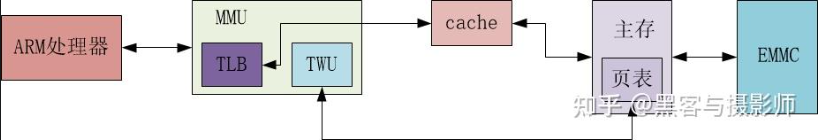
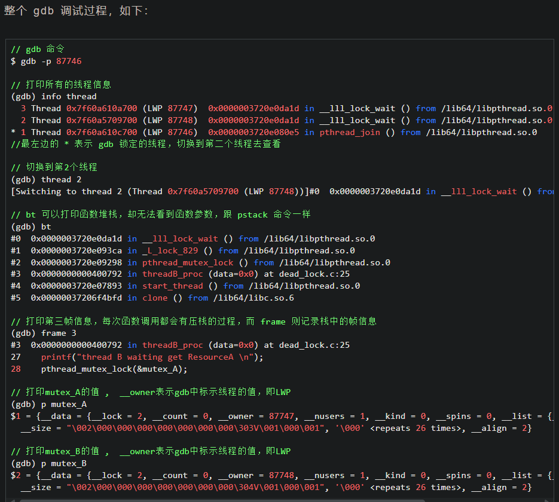
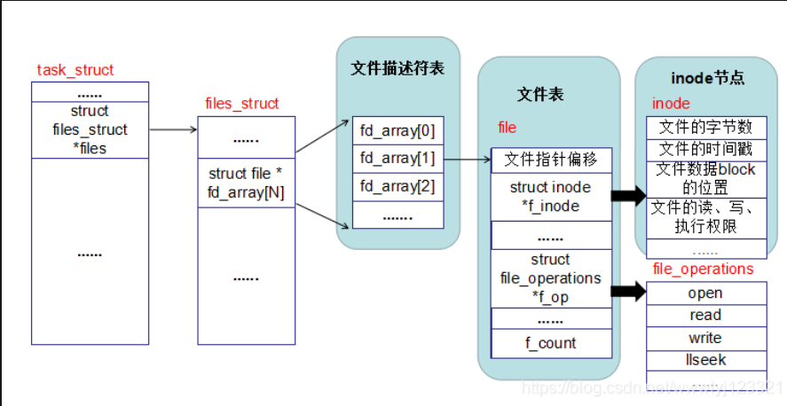
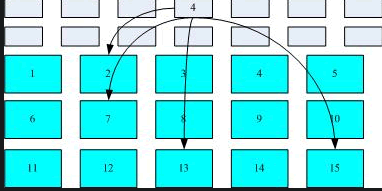
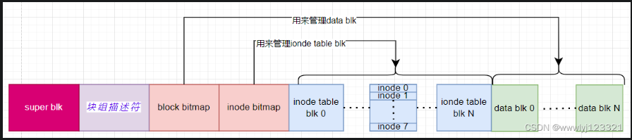

### 1. 进程，线程，协程区别？一个进程能开多少个协程？

1.  概念
+ 进程（Process）
    + 进程是程序在操作系统中的一次执行过程，是系统进行资源分配和调度的基本单位。每个进程都有自己独立的内存空间、系统资源（如文件描述符等）和执行上下文。例如，当你打开一个浏览器，操作系统就会为浏览器程序创建一个进程。
+ 线程（Thread）
    + 线程是进程中的一个执行单元，是 CPU 调度和分派的基本单位。一个进程可以包含多个线程，这些线程共享进程的内存空间和系统资源，但每个线程有自己独立的**栈空间**和**程序计数器**，用于保存线程的执行状态。比如在浏览器进程中，可以有负责渲染页面的线程、处理网络请求的线程等。 

    线程独立的栈空间，怎么找到临时变量？
    线程执行方法时，会在栈上为该方法创建一个栈帧（Stack Frame）。栈帧包含了方法的局部变量表、操作数栈、动态链接、方法返回地址等信息。临时变量通常存储在局部变量表中。

+ 协程（Coroutine）
    + 协程是一种比线程更加轻量级的并发编程模型，也被称为用户态线程。它由程序自身控制调度，而不是由操作系统内核进行调度。协程可以在一个线程中实现多个任务的并发执行，通过在任务之间主动让出执行权，实现上下文的切换。例如，在 Python 中使用 asyncio 库就可以实现协程编程。

2. 资源开销
    + 进程：进程的创建和销毁需要操作系统进行大量的资源分配和回收操作，包括内存空间的分配、文件描述符的分配等，因此进程的创建和切换开销较大。
    + 线程：线程的创建和销毁开销相对较小，因为线程共享进程的资源，不需要重新分配大量的系统资源。但线程的切换仍然需要操作系统内核进行调度，会有一定的开销。
    + 协程：协程的创建和切换开销非常小，因为协程的调度是在用户态完成的，不需要操作系统内核的干预，只需要保存和恢复协程的上下文信息即可。

3. 并发性
    + 进程：进程之间可以实现真正的并行执行，因为不同的进程可以在不同的 CPU 核心上同时运行。但进程间的通信和同步比较复杂，需要使用特定的进程间通信（IPC）机制，如管道、消息队列、共享内存等。
    + 线程：线程之间也可以实现并行执行，前提是在多核 CPU 系统中，不同的线程可以分配到不同的 CPU 核心上运行。线程间的通信和同步相对简单，可以通过共享内存的方式进行数据交换，但需要注意线程安全问题。
    + 协程：协程在单个线程中实现并发执行，通过在协程之间主动让出执行权，实现多个任务的交替执行。协程之间的通信和同步更加简单，因为它们共享同一个线程的上下文。但协程只能实现并发，不能实现真正的并行（除非使用多线程结合协程）。

4. 调度方式
    + 进程：进程的调度由操作系统内核负责，操作系统根据进程的优先级、资源使用情况等因素进行调度。进程的切换需要进行上下文切换，包括保存和恢复进程的寄存器状态、内存映射等信息。
    + 线程：线程的调度也由操作系统内核负责，操作系统会根据线程的优先级和调度算法进行线程的切换。线程的切换同样需要进行上下文切换，但由于线程共享进程的资源，切换开销相对较小。
    + 协程：协程的调度由程序自身控制，在协程中可以通过 yield、await 等关键字主动让出执行权，将执行权交给其他协程。协程的切换只需要保存和恢复协程的栈信息，开销非常小。

一个进程能开多少个协程
一个进程能开启的协程数量没有一个固定的上限，它受到多种因素的影响：

1. 内存限制
虽然协程的内存开销相对较小，但大量的协程仍然会占用一定的内存空间。每个协程都需要保存自己的上下文信息（如栈信息），如果系统内存不足，就无法创建更多的协程。例如，在 Python 的 asyncio 中，每个协程都有自己的栈，当创建大量协程时，栈空间的占用会逐渐增加。

2. CPU 处理能力
虽然协程本身不会占用太多的 CPU 资源，但大量协程的调度和切换也会消耗一定的 CPU 时间。如果 CPU 处理能力有限，过多的协程会导致系统性能下降。例如，在单核 CPU 系统中，过多的协程会导致频繁的上下文切换，增加 CPU 的负担。

3. 操作系统限制
操作系统对进程的资源使用有一定的限制，如最大文件描述符数量、最大线程数等。虽然协程不直接受这些限制的影响，但如果协程需要使用系统资源（如网络连接、文件操作等），这些限制可能会间接影响协程的创建数量。

线程共享的资源有那些？
同一进程内的线程共享进程的代码区、数据区和堆区；
全局变量，静态变量，堆内存， 进程代码段，进程打开的文件描述符。

> cpu核数为1，那些情况下适合开多线程？
1. 处理 I/O 密集型任务;I/O 操作（如磁盘读写、网络通信等）的速度远低于 CPU 的处理速度，在进行 I/O 操作时，CPU 往往处于空闲状态。多线程可以在一个线程进行 I/O 操作时，让其他线程继续执行，从而提高整体的效率。

2. 阻塞操作：如果程序中存在需要等待的阻塞操作（比如等待用户输入、文件读取等），可以通过多线程避免主线程被阻塞，保持界面响应或其他任务的持续运行。

3. 后台任务：对于一些不需要立即完成的后台任务（例如日志记录、数据同步等），可以使用单独的线程来处理，不影响主线程的主要工作流程。


> 线程间的主要区别
+ 栈（Stack）：每个线程都有自己的独立栈空间，用于存储局部变量、函数调用记录（调用帧）等。

+ 寄存器（Registers）：每个线程有自己独立的寄存器集合，包括程序计数器（PC）、栈指针（SP）等，线程切换时会保存/恢复这些寄存器。

+ 线程局部存储（Thread Local Storage, TLS）：某些语言或操作系统提供线程局部存储，每个线程可以拥有自己的私有变量，其他线程无法访问。

+ 调度状态：不同的线程可能处于不同的调度状态（运行、就绪、阻塞等），而进程的调度状态是由所有线程的状态综合决定的。

+ 信号处理：在多线程程序中，某些信号（如 SIGSEGV）会发送到触发该信号的线程，而进程级别的信号（如 SIGTERM）会影响整个进程。

+ CPU 亲和性（CPU Affinity）：不同的线程可能被调度到不同的 CPU 核心上运行，可以通过 sched_setaffinity 等接口绑定特定线程到指定核心。

+ 同步原语（Mutex, Condition Variable, Semaphore）：线程之间需要同步机制来确保数据一致性，而进程之间使用 IPC（如共享内存、管道、消息队列）进行通信。


### 2. 系统调用是什么？为什么还要分为用户态和内核态？怎么从用户态切换到内核态？

1. 系统调用的定义

系统调用（System Call）是操作系统提供给用户程序调用的一组特殊接口，它是用户程序与操作系统内核进行交互的桥梁。用户程序通过系统调用请求操作系统提供的各种服务，如文件操作（打开、读写、关闭文件）、进程管理（创建、销毁进程）、内存管理（分配、释放内存）等。

2. 区分用户态和内核态的原因
+ 将操作系统的执行状态分为用户态（User Mode）和内核态（Kernel Mode）主要是出于安全性和稳定性的考虑，具体原因如下：
    + 保护操作系统内核：内核是操作系统的核心部分，负责管理系统的各种资源和硬件设备。如果用户程序可以随意访问内核数据和硬件资源，可能会导致系统崩溃或数据丢失。通过区分用户态和内核态，用户程序只能在用户态下运行，无法直接访问内核数据和硬件资源，必须通过系统调用请求内核提供服务，从而保护了内核的安全性和稳定性。

    + 资源隔离：不同的用户程序可能会相互竞争系统资源，如果没有有效的隔离机制，可能会导致资源冲突和数据混乱。用户态和内核态的分离可以实现资源的隔离，每个用户程序在自己的用户态空间中运行，只能访问自己的内存空间和被授权的资源，避免了不同程序之间的相互干扰。

    + 权限控制：内核态具有最高的权限，可以直接访问系统的所有资源和硬件设备；而用户态的权限较低，只能访问自己的内存空间和执行一些受限的操作。通过这种权限控制机制，可以确保系统的安全性和稳定性，防止用户程序进行非法操作。

3. 从用户态切换到内核态的方式
从用户态切换到内核态主要有以下三种方式：
+ 系统调用：这是最常见的方式。当用户程序需要操作系统提供服务时，会调用系统调用函数。在调用系统调用函数时，会触发一个软中断（例如，在 x86 架构下，使用 int 0x80 或 syscall 指令），将控制权从用户态转移到内核态。内核接收到系统调用请求后，会根据请求的类型执行相应的操作，并在操作完成后将结果返回给用户程序，然后再将控制权从内核态切换回用户态。

+ 异常：当用户程序在执行过程中发生异常（如除法错误、访问非法内存等）时，会触发一个异常处理程序。异常处理程序会将控制权从用户态转移到内核态，由内核来处理异常。内核会根据异常的类型采取相应的措施，如终止程序、修复错误等，处理完成后再将控制权切换回用户态。

+ 外部中断：当外部设备（如键盘、鼠标、硬盘等）需要与计算机进行交互时，会向 CPU 发送一个中断信号。CPU 接收到中断信号后，会暂停当前正在执行的用户程序，将控制权从用户态转移到内核态，执行相应的中断处理程序。中断处理程序会处理外部设备的请求，处理完成后再将控制权切换回用户态，继续执行被暂停的用户程序。

### 3. rm删除一个文件，但是文件系统体积未变，什么情况下会发生？rm一个文件，系统会发送什么操作？

1. 文件被进程占用
    + 当一个文件被某个进程打开并使用时，即便使用 rm 命令删除该文件，文件系统中的磁盘空间也不会立即释放，文件系统的体积也就不会改变。这是因为在 Linux 系统中，文件的删除是通过减少文件的硬链接数来实现的，只有当文件的硬链接数为 0 且没有任何进程再打开该文件时，文件所占用的磁盘空间才会被真正释放。
    + 例如，使用 tail -f 命令持续监控一个日志文件，此时对该日志文件执行 rm 操作，文件看似被删除，但实际上进程仍然持有对该文件的引用，磁盘空间不会被释放。

2. 文件系统缓存
文件系统会使用缓存来提高读写性能。当执行 rm 操作后，文件系统可能只是在逻辑上标记文件为已删除，而实际的磁盘空间释放操作可能会被延迟，直到缓存被刷新或者系统进行垃圾回收。在这个延迟期间，文件系统的体积看起来不会改变。


流程:
1. 权限检查
系统会首先检查执行 rm 命令的用户是否具有删除该文件的权限。这涉及到检查文件的权限位（读、写、执行权限）以及用户所属的用户组和文件的所有者等信息。如果用户没有足够的权限，rm 命令将失败并返回相应的错误信息。
2. 减少硬链接数
在 Linux 文件系统中，每个文件都有一个或多个硬链接。rm 命令会将文件的硬链接数减 1。如果硬链接数减为 0，并且没有任何进程打开该文件，那么文件所占用的磁盘空间将被标记为可重用。
3. 删除目录项
rm 命令会从文件所在的目录中删除该文件的目录项。目录项包含了文件的名称和对应的 inode 号码。删除目录项后，用户将无法再通过文件名访问该文件。
4. 释放 inode
当文件的硬链接数为 0 且没有进程打开该文件时，系统会释放该文件对应的 inode。inode 是文件系统中存储文件元数据（如文件大小、创建时间、权限等）的结构。
5. 标记磁盘块为可用
最后，系统会将文件所占用的磁盘块标记为可用，以便后续的文件可以使用这些磁盘空间。但如前面所述，这个操作可能会被延迟，直到文件系统缓存被刷新。

### 4. 一块内存如果还没有被初始化就被其他线程访问会有问题吗?

1. 可能出现未定义行为
+ 未初始化的内存中存储的是一些随机的、不确定的数据。当其他线程读取这块内存时，会得到这些随机值。这可能会导致程序逻辑错误，因为程序可能会基于这些随机值进行后续的计算、判断等操作。

2.  也可能不会产生问题的情况：如果程序逻辑并不依赖于这块内存的初始值，或者后续会立即覆盖这块内存的内容，那么未初始化的内存被访问可能不会产生明显的问题。

### 5. 操作系统中的原子操作是什么实现的

基于硬件的实现方式

+ 总线锁定：在早期的处理器中，通过锁定系统总线来实现原子操作。当一个处理器要执行原子操作时，它会向总线发出一个锁定信号，阻止其他处理器访问共享内存。

+ 缓存锁定：现代处理器采用了缓存一致性协议（如 MESI 协议），可以通过**缓存锁定**来实现原子操作。当一个处理器要对共享内存中的数据进行原子操作时，它会先将该数据所在的缓存行标记为独占状态。如果其他处理器也有该缓存行的副本，会根据**缓存一致性协议将其无效化**。然后，处理器在自己的缓存中对数据进行操作，并将结果写回内存。由于缓存一致性协议的保证，其他处理器在该操作完成之前无法对同一数据进行修改，从而实现了原子操作。

一致性问题：
写操作：
+ 如果缓存命中，写到缓存块，标记为脏数据；
+ 如果没命中，定位缓存块（LRU），如果是脏，则写入内存；再从内存中读取想要写的数据；后续写这个数据，然后标记；

读操作：
+ 如果命中，直接返回
+ 没命中，找到一个位置；如果是dirty，刷入内存；然后读取想要的数据；标记为非脏；

问题：缓存不一致；
cpu多核，写回策略；

解决方法：
cpu之间有总线，写回时进行传播有写操作了；然后通过lock锁指令，锁主总线，实现穿行话，避免传播乱序问题；但是有带宽问题，多次修改多次接受广播；

MESI（modified, exelusive,shared,involidated） 一致协议；
modified 已修改还未同步
exelusive 数据只在某个核心，缓存和内存数据一致
shared 某个数据再多个核心加载，缓存和内存的数据一致
involidated 已失效，数据不是最新

cpu最小读取单元：cache line，cpu最小读取单元；


基于软件的实现方式: 

+ 使用特殊指令：许多处理器提供了一些特殊的指令来实现原子操作，如比较并交换（Compare-And-Swap，CAS）指令。CAS 指令接受三个参数：内存地址、期望值和新值。它会先比较内存地址处的值是否等于期望值，如果相等，则将新值写入该内存地址；否则，不进行任何操作。整个过程是原子的，不会被其他线程或进程中断。在多线程编程中，可以使用 CAS 指令来实现无锁数据结构，避免使用传统的锁机制带来的性能开销。例如，在 Java 中，AtomicInteger 类就是基于 CAS 操作实现的。

+ 自旋锁：自旋锁是一种简单的软件同步机制，用于实现原子操作。当一个线程要执行原子操作时，它会尝试获取自旋锁。如果锁已经被其他线程持有，该线程会进入自旋状态，不断地检查锁的状态，直到锁被释放。一旦获取到锁，线程就可以执行原子操作，操作完成后释放锁。自旋锁适用于锁的持有时间较短的场景，因为如果锁的持有时间过长，自旋会浪费大量的 CPU 时间。例如，在 Linux 内核中，自旋锁被广泛用于实现原子操作和同步机制。

### 6. mmu
https://www.zhihu.com/search?type=content&q=MMU

问题：进程地址空间安全问题、内存使用效率低。 -》 **虚拟内存** ： 一方面它让每个程序认为自己是独自、连续的使用内存，另一方面，每个程序之间的内存形成了安全隔离，避免程序破坏彼此的内存。

**分页**： 一是物理内存没有这么大，二是如果将整个程序加载到内存，为了多程序并行，就需要将大量的数据及代码换入、换出，这导致程序运行效率低下。

MMU 主要功能是进行虚拟地址到物理地址的转换，以及提供内存保护机制。为了提升虚拟地址到物理地址转换的速度，减少转换所消耗的时间。

MMU包含两个模块TLB（Translation Lookaside Buffer）和TWU（Table Walk Unit）。TLB是一个高速缓存，用于缓存页表转换的结果，从而缩短页表查询的时间。TWU是一个页表遍历模块，页表是由操作系统维护在物理内存中，但是页表的遍历查询是由TWU完成的，这样减少对CPU资源的消耗。

虚拟内存及分页机制的出现，**解决了**进程地址空间安全性的问题和内存使用效率低的问题，但是也引入了系统性能变差的问题。

#### 6.1 框架



页表的查询是一个耗时的过程，理想情况下，
+ TLB命中，可以从中直接得到虚拟地址对应的物理地址。当TLB未命中的时候，MMU才会通过TWU查询页表，从而翻译虚拟地址得到物理地址。
+ 得到物理地址后，首先要查询该物理地址的内容是否存在于cache中，若cache命中，则直接取出物理地址对应的内容返回给处理器。若cache没有命中，会进一步访问主存获取相应的内容，然后回写到cache，并返回给处理器。

+ 如果没能在页表中查询到虚拟地址对应的物理地址，则会触发一个与MMU相关的缺页异常，在异常处理的过程中，会将EMMC中相关的数据加载到主存，然后建立相应的页表，然后将物理地址对应的内容返回给cache及处理器。

#### 6.2MMU相关的基本概念

+ 虚拟内存（Virtual Memory,VM）：为每个进程提供了一致的、连续的、私有的内存空间，简化了内存管理。将主存看成是一个存储在磁盘上的地址空间的高速缓存，当运行多个进程或者一个进程需要更多的空间时，主存显然是不够用的，这时需要更大、更便宜的磁盘保存一部分数据。
+ 虚拟地址空间（Virtual Address Space,VAS）：每个进程独有。
+ 虚拟页（Virtual Page,VP）：把虚拟内存按照页表大小进行划分。
+ 虚拟地址（Virtual Address,VA）：处理器看到的地址。
+ 虚拟页号（Virtual Page Number,VPN）：用于定位页表的PTE。

（2）物理地址相关的基本概念 
+ 物理内存（Physical Memory,PM）：主存上能够使用的物理空间。 
+ 物理页（Physical Page）：把物理内存按照页表的大小进行划分。 
+ 物理地址（Physical Address,PA）：物理内存划分很多块，通过物理内存进行定位。 
+ 物理页号（Physical Page Number,PPN）：定位物理内存中块的位置。

（3）页表相关的基本概念 
+ 页表（Page Table）：虚拟地址与物理地址映射表的集合。 
+ 页表条目（Page Table Entry,PTE）：虚拟地址与独立地址具体对应的记录。 
+ 页全局目录（Page Global Directory,PGD）：多级页表中的最高一级。 
+ 页上级目录（Page Upper Directory,PUD）：多级页表中的次高一级。 
+ 页中间目录（Page Middle Directory,PMD）：多级页表中的一级。

#### 6.3 页命中、缺页

页命中：
a) 处理器要对虚拟地址VA进行访问。
b) MMU的TLB没有命中，通过TWU遍历主存页表中的PTEA（PTE地址）。
c) 主存向MMU返回PTE。
d) MMU通过PTE映射物理地址，并把它传给高速缓存或主存。
e) 高速缓存或主存返回物理地址对应的数据给处理器。

缺页：

a) 处理器要对虚拟地址VA进行访问。
b) MMU的TLB没有命中，通过TWU遍历主存页表中的PTEA（PTE地址）。
c) 主存向MMU返回PTE。
d) PTE中有效位是0，MMU触发一次异常，CPU相应缺页异常，运行相应的处理程序。
e) 缺页异常处理程序选出物理内存中的牺牲页，若这个页面已经被修改，将其换出到EMMC。f) 缺页异常处理程序从EMMC中加载新的页面，并更新内存中页表的PTE。
g) 缺页异常处理程序返回到原来的进程，再次执行导致缺页的指令。CPU将引起缺页异常的虚拟地址重新发给MMU。由于虚拟页面现在缓存在主存中，主存会将所请求的地址对应的内容返回给cache和处理器。

#### 6.4 TLB
https://zhuanlan.zhihu.com/p/108425561


页表基地址寄存器，它存储PGD页表的首地址。

> TLB 本质：
TLB其实就是一块高速缓存。
+ 数据cache缓存地址(虚拟地址或者物理地址)和数据。
+ TLB缓存虚拟地址和其映射的物理地址。
TLB根据虚拟地址查找cache，它没得选，只能根据虚拟地址查找。所以TLB是一个虚拟高速缓存。硬件存在TLB后，虚拟地址到物理地址的转换过程发生了变化。
虚拟地址首先发往TLB确认是否命中cache，如果cache hit直接可以得到物理地址。否则，一级一级查找页表获取物理地址。并将虚拟地址和物理地址的映射关系缓存到TLB中。

> TLB的特殊
虚拟地址映射物理地址的最小单位是4KB。所以TLB其实不需要存储虚拟地址和物理地址的低12位。。另外，我们如果命中cache，肯定是一次性从cache中拿出整个数据。所以虚拟地址不需要offset域。


### 7.什么是死锁？怎么排查死锁？怎么避免死锁？

发生：两个线程都在等待对方释放锁，在没有外力的作用下，这些线程会一直相互等待，就没办法继续运行，这种情况就是发生了死锁。

死锁只有同时满足以下四个条件才会发生：
+ 互斥条件；多个线程不能同时使用同一个资源。
+ 持有并等待条件；
    + 持有并等待条件是指，当线程 A 已经持有了资源 1，又想申请资源 2，而资源 2 已经被线程 C 持有了，所以线程 A 就会处于等待状态，但是线程 A 在等待资源 2 的同时并不会释放自己已经持有的资源 1。
+ 不可剥夺条件；
    + 不可剥夺条件是指，当线程已经持有了资源 ，在自己使用完之前不能被其他线程获取，线程 B 如果也想使用此资源，则只能在线程 A 使用完并释放后才能获取。
+ 环路等待条件；
    + 环路等待条件指都是，在死锁发生的时候，两个线程获取资源的顺序构成了环形链。


排查死锁：




+ 通过 info thread 打印了所有的线程信息，可以看到有 3 个 线程，一个是主线程（LWP 87746），另外两个都是我们自己创建的线程（LWP 87747 和 87748）；
+ 通过 thread 2，将切换到第2个线程（LWP 87748）；
+ 通过 bt，打印线程的调用栈信息，可以看到有 threadB_proc 函数，说明这个是线程B函数，也就说 LWP 87748 是线程 B;
+ 通过 frame 3，打印调用栈中的第三个帧的信息，可以看到线程 B 函数，在获取互斥锁 A 的时候阻塞了；
+ 通过 p mutex_A，打印互斥锁 A 对象信息，可以看到它被 LWP 为 87747（线程 A） 的线程持有者；
+ 通过 p mutex_B，打印互斥锁 A 对象信息，可以看到他被 LWP 为 87748 （线程 B） 的线程持有者；

因为线程 B 在等待线程 A 所持有的 mutex_A, 而同时线程 A 又在等待线程 B 所拥有的mutex_B, 所以可以断定该程序发生了死锁


04 避免死锁问题的发生

前面我们提到，产生死锁的四个必要条件是：互斥条件、持有并等待条件、不可剥夺条件、环路等待条件。

那么避免死锁问题就只需要破环其中一个条件就可以，最常见的并且可行的就是使用资源有序分配法，来破环环路等待条件。

那什么是资源有序分配法呢？

线程 A 和 线程 B 获取资源的顺序要一样，当线程 A 是先尝试获取资源 A，然后尝试获取资源 B 的时候，线程 B 同样也是先尝试获取资源 A，然后尝试获取资源 B。也就是说，线程 A 和 线程 B 总是以相同的顺序申请自己想要的资源。

我们使用资源有序分配法的方式来修改前面发生死锁的代码，我们可以不改动线程 A 的代码。

我们先要清楚线程 A 获取资源的顺序，它是先获取互斥锁 A，然后获取互斥锁 B。

所以我们只需将线程 B 改成以相同顺序地获取资源，就可以打破死锁了。

### 8. 孤儿进程和僵尸进程
孤儿进程
+ 定义：一个父进程退出，而它的一个或多个子进程还在运行，那么这些子进程将成为孤儿进程。孤儿进程会被 init 进程（在 Linux 系统中，init 进程的进程 ID 为 1，是系统中所有进程的祖先）所收养，并由 init 进程对它们完成状态收集工作。

+ 存在意义与影响：从系统管理角度来看，孤儿进程不会对系统造成危害。因为 init 进程会定期检查是否有孤儿进程存在，并负责回收它们的资源，如释放占用的内存空间等，保证了系统资源的有效利用，不会出现资源泄漏的问题。

僵尸进程：
+ 定义：当一个子进程先于父进程结束运行时，它并不会立即消失，而是会留下一些信息（如进程号、退出状态等）在进程表中，此时子进程处于僵尸状态，成为僵尸进程。如果父进程没有调用 wait () 或 waitpid () 函数来获取子进程的退出状态并回收其资源，僵尸进程就会一直存在于系统中。

+ 存在意义与影响：僵尸进程虽然不占用 CPU 时间片，但它会占用系统的进程表项资源。如果系统中存在大量的僵尸进程，可能会导致进程表被填满，从而使得系统无法再创建新的进程，影响系统的正常运行，造成资源浪费甚至系统性能下降。

### 9. 文件描述符和inode

https://blog.csdn.net/wwwlyj123321/article/details/100298377



#### 1. inode 索引节点

1. 理解inode，要从文件储存说起。

文件储存在硬盘上，硬盘的最小存储单位叫做"扇区"（Sector）。每个扇区储存512字节（相当于0.5KB）。操作系统读取硬盘的时候，不会一个个扇区地读取，这样效率太低，而是一次性连续读取多个扇区，即一次性读取一个"块"（block）。这种由多个扇区组成的"块"，是文件存取的最小单位。“块"的大小，最常见的是4KB，即连续八个 sector组成一个 block。

2. 通常情况下，文件系统会将文件的实际内容和属性分开存放：

+ 文件的属性保存在 inode 中（i 节点）中，每个 inode 都有自己的编号。**每个文件各占用一个 inode**。不仅如此，inode 中还记录着文件数据所在 block 块的编号；

+ 文件的实际内容保存在 data block 中（数据块），类似衣柜的隔断，用来真正保存衣物。每个 block 都有属于自己的编号。当文件太大时，可能会占用多个 block 块。

如图所示：文件系统先格式化出 inode 和 block 块，假设某文件的权限和属性信息存放到 inode 4 号位置，这个 inode 记录了实际存储文件数据的 block 号有 4 个，分别为 2、7、13、15，由此，操作系统就能快速地找到文件数据的存储位置。



> 每个inode都有一个号码，操作系统用inode号码来识别不同的文件。Unix/Linux系统内部不使用文件名，而使用inode号码来识别文件。对于系统来说，文件名只是inode号码便于识别的别称或者绰号。表面上，用户通过文件名，打开文件。实际上，系统内部这个过程分成三步：首先，系统找到这个文件名对应的inode号码；其次，通过inode号码，获取inode信息；最后，根据inode信息，分析 inode 所记录的权限与用户是否符合，找到文件数据所在的block，读出数据。

3. 联系平时实践，大家格式化硬盘（U盘）时发现有：快速格式化和底层格式化。快速格式化非常快，格式化一个32GB的U盘只要1秒钟，普通格式化格式化速度慢。这两个的差异？其实快速格式化就是只删除了U盘中的硬盘内容管理表（其实就是inode），真正存储的内容没有动。这种格式化的内容是有可能被找回的。

由于inode也占用一定的磁盘空间，所以当inode使用空间用完的时候，即使磁盘仍有存储空间也无法使用！所有当磁盘显示仍有可用空间，但使用时却提示空间不足，就有可能是inode使用完毕所造成的。

4.  inode本质上是一个结构体，定义如下

```cpp
struct inode {
        struct hlist_node       i_hash;              /* 哈希表 */
        struct list_head        i_list;              /* 索引节点链表 */
        struct list_head        i_dentry;            /* 目录项链表 */
        unsigned long           i_ino;               /* 节点号 */
        atomic_t                i_count;             /* 引用记数 */
        umode_t                 i_mode;              /* 访问权限控制 */
        unsigned int            i_nlink;             /* 硬链接数 */
        uid_t                   i_uid;               /* 使用者id */
        gid_t                   i_gid;               /* 使用者id组 */
        kdev_t                  i_rdev;              /* 实设备标识符 */
        loff_t                  i_size;              /* 以字节为单位的文件大小 */
        struct timespec         i_atime;             /* 最后访问时间 */
        struct timespec         i_mtime;             /* 最后修改(modify)时间 */
        struct timespec         i_ctime;             /* 最后改变(change)时间 */
        unsigned int            i_blkbits;           /* 以位为单位的块大小 */
        unsigned long           i_blksize;           /* 以字节为单位的块大小 */
        unsigned long           i_version;           /* 版本号 */
        unsigned long           i_blocks;            /* 文件的块数 */
        unsigned short          i_bytes;             /* 使用的字节数 */
        spinlock_t              i_lock;              /* 自旋锁 */
        struct rw_semaphore     i_alloc_sem;         /* 索引节点信号量 */
        struct inode_operations *i_op;               /* 索引节点操作表 */
        struct file_operations  *i_fop;              /* 默认的索引节点操作 */
        struct super_block      *i_sb;               /* 相关的超级块 */
        struct file_lock        *i_flock;            /* 文件锁链表 */
        struct address_space    *i_mapping;          /* 相关的地址映射 */
        struct address_space    i_data;              /* 设备地址映射 */
        struct dquot            *i_dquot[MAXQUOTAS]; /* 节点的磁盘限额 */
        struct list_head        i_devices;           /* 块设备链表 */
        struct pipe_inode_info  *i_pipe;             /* 管道信息 */
        struct block_device     *i_bdev;             /* 块设备驱动 */
        unsigned long           i_dnotify_mask;      /* 目录通知掩码 */
        struct dnotify_struct   *i_dnotify;          /* 目录通知 */
        unsigned long           i_state;             /* 状态标志 */
        unsigned long           dirtied_when;        /* 首次修改时间 */
        unsigned int            i_flags;             /* 文件系统标志 */
        unsigned char           i_sock;              /* 可能是个套接字吧 */
        atomic_t                i_writecount;        /* 写者记数 */
        void                    *i_security;         /* 安全模块 */
        __u32                   i_generation;        /* 索引节点版本号 */
        union {
                void            *generic_ip;         /* 文件特殊信息 */
        } u;
};
```

5. 
+ 每个 inode 大小均固定为 128 bytes；
+ 每个文件都仅会占用一个 inode ；
+ 承上，因此文件系统能够创建的文件数量与 inode 的数量有关；

#### 2. 文件系统对磁盘数据的管理划分



1. data block:

数据块是真正保存数据原始内容的。

linux EXT2 中所支持的 block 大小有 1k、2k 及 4k 三种。在格式化时 block 的大小就固定了，并都有编号，方便 inode 的记录。

block 的基本限制如下：

+ 每个 block 内最多只能够放置一个文件的数据；
+ 承上，如果文件大于 block 的大小，则一个文件会占用多个 block 数量；
+ 承上，若文件小于 block ，则该 block 的剩余容量就不能够再被使用了(磁盘空间会浪费)。


2. inode table block

从第一章我们知道，一个inode节点固定大小是128bytes，如果一个block是1K，那么一个blk可以存储8个 ionde节点。这些真正存储inode节点有效信息的blk我们称之为 inode table blk。

3. inode bitmap和data bitmap

我们知道，一个物理的blk可以存储用户数据，也可以存储inode节点。那么这些物理blk很多如何进行管理呢？例如怎么知道是否在使用中？我们引入了bitmap的概念。存储这些bitmap的物理blk分别叫做inode bitmap和data bitmap。

4. 块组描述符

如何inode table block很多，需要占用多个块；或者需要有多个inode bitmap、data bitmap 块。怎么办？我们也选择一个单独的块来记录。这个块就叫做块组描述符吧！

5. super blk
Superblock 是记录整个 filesystem 相关信息的地方， 没有 Superblock ，就没有这个 filesystem 了。他记录的信息主要有：

+ block 与 inode 的总量
+ 未使用与已使用的 inode 、block 数量
+ block 与 inode （block 1、2、4k，inode 为 128 、256 bytes）
+ filesystem 的挂载时间、最近一次写入时间的时间、最近一次检验磁盘（fsck）的时间等
+ 一个 valid bit 数值，若此文件系统已被挂载，则 valid bit 为 0，否则为 1

#### 3. inode table的直接索引和间接索引

一个inode大小是 128bytes ， 而记录一个 block 号码要花掉 4byte（int） ，假设我一个文件有 400MB 且每个 block 为 4K 时， 那么至少也要十万笔 block 号码的记录呢！这点数据空间是远远不够讲inode和十万笔data blk号相关联的。因此，操作系统讲inode的数据块指针做如下划分：数据块指针数组共有 15 项，前 12 个为直接块指针，后 3 个分别为“一次 间接块指针”、“二次间接块指针”、“三次间接块指针”。

所谓“直接块”，是指该块直接用来存储文件的数据，而“一次间接块”是指该块不存 储数据，而是存储直接块的地址，同样，“二次间接块”存储的是“一次间接块”的地址。 这里所说的块，指的都是物理块。

这样子 inode 能够指定多少个 block 呢？我们以较小的 1K block 来说明好了，可以指定的情况如下：

+ 12 个直接指向： 12*1K=12K
由于是直接指向，所以总共可记录 12 笔记录，因此总额大小为如上所示；
 
+ 间接： 256*1K=256K
每笔 block 号码的记录会花去 4bytes，因此 1K 的大小能够记录 256 笔记录，因此一个间接可以记录的文件大小如上；
 
+ 双间接： 256*256*1K=2562K
第一层 block 会指定 256 个第二层，每个第二层可以指定 256 个号码，因此总额大小如上；
 
+ 三间接： 256*256*256*1K=2563K
第一层 block 会指定 256 个第二层，每个第二层可以指定 256 个第三层，每个第三层可以指定 256 个号码，因此总额大小如上；
 
+ 总额：将直接、间接、双间接、三间接加总，得到 12 + 256 + 256*256 + 256*256*256 (K) = 16GB

此时我们知道当文件系统将 block 格式化为 1K 大小时，能够容纳的最大文件为 16GB，

#### 4. Ext2 的目录项及文件的定位

从上述分析我们可以看出，如果要读取文件的内容（data blk），需要先找到inode。那么如何找到inode呢？我们先联想一下：我们调用open函数打开文件的时候，输入的是文件路径。那么文件路径和inode有啥关系呢？

1. 目录项结构

在前面，我们知道了一个普通文件是如何存储的，但还有一个特殊的文件，经常用到的目录，它是如何保存的呢？基于 Linux 一切皆文件的设计思想，目录其实也是个文件，它是由 ext2_dir_entry 这个结构组成的列表。这 个结构是变长的，这样可以减少磁盘空间的浪费，但是，它还是有一定的长度方面的限制， 一是文件名最长只能为 255 个字符。二是尽管文件名长度可以不限（在 255 个字符之内）， 但系统自动将之变成 4 的整数倍，不足的地方用 NULL 字符（\0）填充。目录中有文件和子目 录，每一项对应一个 ext2_dir_entry_2。该结构在 include/Linux/ext2_fs.h 中定义如下

```cpp
struct ext2_dir_entry_2 {
 __u32 inode; /* Inode number */
 __u16 rec_len; /* Directory entry length */
 __u8 name_len; /* Name length */
 __u8 file_type;
 char name[EXT2_NAME_LEN]; /* File name */
};
```

+ 每个目录文件数据块包含多个目录项，每条目录项包含目录下
    + 文件 Inode 号
    + 目录项长度 rec_len
    + 文件名长度 name_len
    + 文件类型
        + 0：未知
        + 1：普通文件
        + 2：目录
        + 3：*character devicev
        + 4：block device
        + 5：命名管道
        + 6：socket
        + 7：符号链接
        + 文件名：文件名、一级子目录名、.、..

2. open的时候是如何找到文件内容的？

表面上，用户通过文件名打开文件。实际上，系统内部这个过程分成三步：
+ 从目录文件数据块中的所有目录项找到和这个文件名path相匹配的目录项（通俗理解哈，实际要复杂），从而找对对应的inode号；
+ 通过inode号码，获取inode信息；
+ 根据inode信息，找到文件数据所在的block，读出数据。

> 如果一个目录有超级多的文件，我们要想在这个目录下找文件，按照列表一项一项的找，效率就不高了。于是，保存目录的格式改成哈希表，对文件名进行哈希计算，把哈希值保存起来，如果我们要查找一个目录下面的文件名，可以通过名称取哈希。如果哈希能够匹配上，就说明这个文件的信息在相应的块里面。Linux 系统的 ext 文件系统就是采用了哈希表，来保存目录的内容，这种方法的优点是查找非常迅速，插入和删除也较简单，不过需要一些预备措施来避免哈希冲突。

#### 5. 进程与文件：

1. 文件描述符表

每个进程在Linux内核中都有一个task_struct结构体来维护进程相关的信息,称为进程描述符(Process Descriptor),而在操作系统理论中称为进程控制块 (PCB,Process Control Block)。

```cpp
struct task_struct {
 ...
/* open file information */
 struct files_struct *files;
 ...
};
```

task_struct中有一个指针(struct files_struct *files)指向files_struct结构体（如下所示）,称为文件描述符表（我认为这个定义不确切，暂时还没找到这个说法的来源）,记录该进程打开的所有文件。该表中有一个域(struct file * fd_array[NR_OPEN_DEFAULT]),为数组，该数组的每个元素指向已打开的文件的指针（已打开的文件在内核中用file 结构体表示,文件描述符表中的指针指向file 结构体）。

```cpp
　　struct files_struct
　　{
　　atomic_t count; //引用计数   累加
　　struct fdtable *fdt;
　　struct fdtable fdtab;
　　spinlock_t file_lock ____cacheline_aligned_in_smp;
　　int next_fd; 
　　struct embedded_fd_set close_on_exec_init; 
　　struct embedded_fd_set open_fds_init; 
　　struct file * fd_array[NR_OPEN_DEFAULT]; //文件描述符数组
　　};
```

```cpp
struct file
{
	mode_t f_mode;//表示文件是否可读或可写，FMODE_READ或FMODE_WRITE
	dev_ t  f_rdev ;// 用于/dev/tty
	off_t  f_ops;//当前文件位移
	unsigned short f_flags；//文件标志，O_RDONLY,O_NONBLOCK和O_SYNC
	unsigned short f_count；//打开的文件数目
	unsigned short f_reada；
	struct inode *f_inode;//指向inode的结构指针
	struct file_operations *f_op;//文件操作索引指针
}
```

用户程序不能直接访问内核中的文件描述符表,而只能使用文件描述符表的索引 (即0、1、2、3这些数字),这些索引就称为文件描述符(File Descriptor),用int 型变量保存。

+ 文件描述符（本质上是个数字）是open系统调用内部由操作系统自动分配的，操作系统分配这个fd时也不是随意分配，操作系统规定，fd从0开始依次增加。linux中文件描述符表是个数组（不是链表），所以这个文件描述符表其实就是一个数组，fd是index，文件表指针是value

+ 当我们去open时，内核会从文件描述符表中挑选一个最小的未被使用的数字给我们返回。也就是说如果之前fd已经占满了0-9，那么我们下次open得到的一定是10.（但是如果上一个fd得到的是9，下一个不一定是10，这是因为可能前面更小的一个fd已经被close释放掉了）

+ fd中0、1、2已经默认被系统占用了，因此用户进程得到的最小的fd就是3了。
linux内核占用了0、1、2这三个fd是有用的，当我们运行一个程序得到一个进程时，内部就默认已经打开了3个文件，这三个文件对应的fd就是0、1、2。这三个文件分别叫stdin（标准输入）、stdout（标准输出）、stderr（标准错误）。标准输入一般对应的是键盘，标准输出一般是LCD显示器（可以理解为：1对应LCD的设备文件）

+ printf函数其实就是默认输出到标准输出stdout上了。stdio中还有一个函数叫fpirntf，这个函数就可以指定输出到哪个文件描述符中。

### 10. 多级页表和单级的页表的优缺点

单级页表：空间
在 32 位的环境下，虚拟地址空间共有 4GB，假设一个页的大小是 4KB（2^12），那么就需要大约 100 万 （2^20） 个页，每个「页表项」需要 4 个字节大小来存储，那么整个 4GB 空间的映射就需要有 4MB 的内存来存储页表。

单级页表
优点：
+  简单易实现：结构简单，易于理解和实现。
+  访问速度快：只需一次内存访问即可完成地址转换，速度较快。

缺点：
+ 内存占用大：需要为每个虚拟页面分配一个页表项，即使许多页面未被使用，导致内存浪费。
+ 扩展性差：随着虚拟地址空间增大，页表会变得非常庞大，难以管理。


多级页表
优点：
+ 内存占用小：只分配实际使用的页表项，节省内存。
+ 扩展性好：支持更大的虚拟地址空间，适合现代操作系统。
+ 灵活性高：可根据需要动态调整页表层级，适应不同应用场景。

缺点：
+ 实现复杂：结构复杂，增加了设计和实现的难度。
+ 访问速度慢：需要多次内存访问才能完成地址转换，速度较慢。

> 单级页表：固定大小 为什么？不能按需分配吗？
1. 单级页表的设计原理

单级页表是一个连续的线性数组，数组的每个元素（页表项，PTE）对应一个虚拟页面。虚拟地址空间的大小决定了页表的大小。
这种设计的特点是：
+ 虚拟地址到页表项的映射是直接的：通过虚拟地址的高位（页号）可以直接计算出页表项的索引。
+ 页表是连续的：操作系统需要为整个页表分配一块连续的物理内存。

2. 为什么单级页表难以实现按需分配？

（1）连续内存分配
单级页表需要一块连续的物理内存来存储所有页表项。如果按需分配，页表会变得不连续，这会破坏单级页表的直接映射机制。

例如，如果只分配部分页表项，虚拟地址的高位（页号）无法直接映射到不连续的页表项中，导致地址转换失败。

（2）直接映射的依赖
单级页表的地址转换依赖于虚拟地址的高位（页号）直接作为页表项的索引。如果页表项不连续，这种直接映射关系会被破坏。

例如，虚拟地址的页号是10，但页表项10可能没有被分配，或者被分配到了其他位置，导致无法直接通过页号找到对应的页表项。

（3）管理复杂度
如果尝试在单级页表中实现按需分配，需要引入额外的数据结构（如位图或链表）来记录哪些页表项已被分配，哪些未被分配。这会显著增加管理复杂度，降低地址转换的效率。

这与多级页表的设计目标（简单、高效）相违背。

3. 多级页表如何实现按需分配？
多级页表通过将页表分成多级（如二级页表、三级页表等），实现了按需分配：
+ 分级结构：多级页表将虚拟地址分成多个部分，每一部分对应一级页表。例如，在二级页表中：
    + 虚拟地址的高位（页目录号）用于索引页目录。
    + 虚拟地址的中间位（页表号）用于索引页表。
    + 虚拟地址的低位（页内偏移）用于定位物理页面中的具体位置。

+ 按需分配：
    + 只有实际使用的虚拟页面才会分配页表项。
    + 未使用的虚拟页面对应的页表项不会被分配，从而节省内存。

+ 稀疏地址空间管理：
    + 多级页表天然适合管理稀疏地址空间，因为未使用的部分不会占用内存。

4. 单级页表能否实现按需分配？
从技术上讲，单级页表也可以实现按需分配，但需要引入额外的机制，例如：
+ 动态扩展：在单级页表中动态分配页表项，但需要解决连续内存分配和直接映射的问题。
+ 间接映射：引入额外的数据结构（如哈希表）来管理页表项，但这会显著增加复杂性和性能开销。


### 11. 操作系统给进程分配资源，分配那些资源

1. CPU 时间：CPU 是计算机的核心处理部件，操作系统通过进程调度算法，为每个进程分配一定的 CPU 时间片，使得各个进程能够轮流使用 CPU 进行计算和处理任务。

2. 内存空间：进程运行时需要一定的内存来存储程序代码、数据以及运行时产生的临时结果等。操作系统会为进程分配内存区域，包括代码段（存放程序的指令）、数据段（存放已初始化的全局变量和静态变量）、堆（用于动态内存分配，如使用malloc函数分配的内存）和栈（用于函数调用时的局部变量、参数传递和返回地址等）。

3. 文件描述符：在操作系统中，文件是一种重要的资源，包括普通文件、目录、管道、套接字等。

4. I/O 设备：计算机系统中包含各种输入输出设备，如键盘、鼠标、显示器、打印机、磁盘等。操作系统负责管理这些设备，并为进程分配设备资源。

5. 网络资源：如果进程需要进行网络通信，操作系统会为其分配网络相关的资源，如网络连接、端口号等。

6. 信号量等同步资源：在多进程环境中，为了协调进程之间的并发执行，避免出现竞争条件和死锁等问题，操作系统会提供一些同步机制，如信号量、互斥锁、条件变量等。

7. 虚拟内存资源：当物理内存不足时，操作系统会使用虚拟内存技术，将一部分硬盘空间作为虚拟内存来使用。

### 12. 在程序中打开一个文件，写一些数据，然后关闭，这个程序运行在Linux中，具体操作系统做了些什么？

1. 打开文件：

+ 系统调用处理：当程序调用 open 系统调用（如 open("test.txt", O_WRONLY | O_CREAT, 0644);）时，控制权从用户空间转移到内核空间。内核会检查该系统调用的参数，例如文件名是否合法、文件路径是否存在等。

+ 文件系统查找：内核通过文件系统的元数据（如索引节点 inode）来定位文件。对于普通文件，inode 包含了文件的权限、大小、所有者、数据块指针等信息。如果文件不存在且指定了创建标志（O_CREAT），内核会在合适的文件系统位置创建一个新的 inode 和目录项。

+ 文件描述符分配：如果文件成功打开，内核会为该文件分配一个文件描述符（一个小的非负整数，通常从 3 开始，因为 0、1、2 分别默认对应标准输入、标准输出和标准错误）。这个文件描述符会被返回给用户空间的程序，后续对文件的操作都将通过这个文件描述符进行。

+ 文件表和 inode 表维护：内核维护一个文件表，其中包含了文件的当前读写位置、打开模式等信息。每个打开的文件在文件表中都有一个对应的表项。同时，文件的 inode 信息会被缓存到内存中的 inode 表中，以便快速访问。

2. 写入数据：

+ 系统调用处理：程序调用 write 系统调用（如 write(fd, buffer, strlen(buffer));，其中 fd 是文件描述符，buffer 是要写入的数据缓冲区）时，再次进入内核空间。

+ 数据缓存和同步：内核会将用户空间的数据复制到内核空间的缓冲区中。为了提高性能，数据通常不会立即写入磁盘，而是先存储在页缓存（page cache）中。这样，多个写入操作可以合并为一次磁盘写入。内核会根据一定的策略（如缓存空间不足、达到一定的时间间隔等）将页缓存中的数据同步到磁盘上的文件中。

+ 更新文件表：在写入数据的过程中，内核会更新文件表中记录的文件当前读写位置。

3. 关闭文件：

+ 系统调用处理：当程序调用 close 系统调用（如 close(fd);）时，控制权再次进入内核空间。

+ 资源释放：内核会释放与该文件描述符相关的资源，包括关闭对应的文件表项，减少文件的引用计数。如果文件的引用计数降为 0，表示没有其他进程在使用该文件，内核会进一步清理相关的资源，如释放页缓存中与该文件相关的页面（如果有未写入磁盘的数据，会先进行同步）。

+ 文件描述符回收：文件描述符会被标记为可用，以便后续其他文件打开操作时重新分配使用。

### 13. 进程切换

进程的创建： fork() + exec()


running runnable两个状态；
running的pc保存在cpu上的，而runnable不保存在cpu上，所以我们需要切换这些信息。


> 进程切换的时机

+ 时间片用完：xv6 采用时间片轮转的调度算法，每个进程被分配一个固定的时间片来执行。当时间片用完时，时钟中断处理程序会触发进程切换，以便让其他进程有机会运行。

+ 进程阻塞：当进程执行到某些操作需要等待资源或事件时，如等待 I/O 操作完成、等待信号量等，它会主动调用系统函数将自己阻塞，此时会进行进程切换，调度其他就绪进程运行。


> 进程切换的实现

+ 保存当前进程上下文
    + 当决定进行进程切换时，首先要保存当前正在运行进程的上下文。这包括 CPU 寄存器的值，如通用寄存器、程序计数器（PC）、栈指针（SP）等。这些寄存器的值记录了进程当前的执行状态和位置。xv6 将这些寄存器的值保存在当前进程的进程控制块（PCB）中。
    + 除了 CPU 寄存器，还需要保存进程的栈状态。栈中存储了函数调用的参数、局部变量等信息，通过保存栈指针和栈的相关信息，可以在进程下次恢复运行时还原栈的状态，确保进程能够从上次中断的地方继续正确执行。

+ 选择下一个进程
    + xv6 维护了一个就绪队列，其中包含了所有准备好运行的进程。在进行进程切换时，需要从就绪队列中选择一个进程来运行。xv6 通常采用简单的轮转调度算法，按照顺序依次选择就绪队列中的进程，保证每个进程都有机会获得 CPU 资源。
    + 在选择进程时，还需要考虑进程的优先级等因素。虽然 xv6 的基本调度算法是轮转，但也可以根据实际需求对进程的优先级进行调整，优先选择优先级较高的进程运行。

+ 恢复新进程上下文
    + 一旦选择了下一个要运行的进程，就需要从该进程的 PCB 中读取保存的上下文信息，将 CPU 寄存器、栈指针等恢复到上次该进程被中断时的状态。
    + 加载新进程的页表信息，将虚拟地址空间映射到物理内存，确保进程能够正确访问其所需的内存资源。通过设置 CPU 的页表寄存器等相关寄存器，使 CPU 能够按照新进程的页表进行地址转换。

+ 更新相关数据结构
    + 进程切换完成后，需要更新系统中的一些数据结构，以反映当前系统的进程状态。例如，更新就绪队列，将刚刚切换出去的进程移动到队列末尾（如果采用轮转调度），将新运行的进程标记为当前运行进程。
    + 更新进程的时间片计数器等相关统计信息，记录进程的运行时间、等待时间等，以便进行系统性能分析和调度决策。


### 14. 在linux中，一个函数调用另一个函数的具体过程是怎样的？

1. 传递参数（通过寄存器或栈）。前几个参数通常通过寄存器传递，额外的参数则通过栈传递。

2. Caller 可能保存寄存器（Caller-save）。调用者（Caller，即调用函数的函数）可能会保存某些寄存器的值，以防止被被调用函数（Callee）修改。

3. 压栈（存储返回地址，分配局部变量空间）。进入被调用函数前，调用者可能会调整栈指针，为被调用者准备空间（比如局部变量、返回地址等）。

4. call 指令跳转到函数（或者 bl 指令）。

5. 进入被调用函数，设置栈帧。

6. 执行函数体（可能进行新的函数调用）。

7. 返回值存入寄存器（rax 或 x0）。

8. 恢复栈帧（Epilogue）。

9. 执行 ret 指令，跳回调用者。


## 18. xv6打开文件和写文件的流程

打开文件流程

1. 参数检查：open 系统调用接收文件名和标志（如只读、只写、读写等）作为参数。首先，操作系统会对这些参数进行检查，确保它们是合法的。
2. 查找文件：根据文件名，操作系统会在文件系统的目录结构中查找对应的文件。这通常涉及到对目录项的遍历，直到找到匹配的文件名。
3. 获取 inode：找到文件后，操作系统会从磁盘上读取该文件的 dinode 信息，并将其加载到内存中的 inode 结构里。如果 inode 已经在内存中，就直接使用；否则，需要从磁盘读取。
4. 权限检查：根据打开标志和文件的权限设置，操作系统会检查当前进程是否有足够的权限打开该文件。例如，如果标志为读，但文件的权限设置不允许该进程读取，那么打开操作将失败。
5. 分配文件描述符：如果权限检查通过，操作系统会为该文件分配一个空闲的文件描述符。文件描述符是一个整数，用于在进程中唯一标识一个打开的文件。
6. 创建文件表项：操作系统会在进程的文件表中创建一个新的表项，该表项包含了文件的 inode 指针、文件偏移量等信息。
7. 返回文件描述符：最后，操作系统会将分配的文件描述符返回给调用进程，进程可以使用该文件描述符来进行后续的文件操作。

## 19. 给出一个场景：从我在这个聊天框(pdd的线上面试平台提供的)给你发送了一个消息，到你那边接收到这个消息,中间发生了几次系统调用

一般来说，大致会经历以下几个主要环节（每个环节可能涉及多次系统调用）：

1. 客户端（你使用的设备和应用）：

+ 当你输入并发送消息时，操作系统的输入设备驱动相关的系统调用会被触发，用于获取你输入的字符数据。
+ 客户端应用会调用系统网络相关的系统调用（如 socket 相关的系统调用）来建立与服务器（用于消息中转等）的连接，并发送消息数据。这可能包括创建套接字、绑定地址、连接服务器、发送数据等操作，每一步都可能涉及系统调用。


> 发生消息

客户端
1. 文件读取：客户端应用调用系统的文件读取函数，这会触发系统调用，通知操作系统打开指定文件，并将文件内容读入内存缓冲区。操作系统会根据文件系统的格式和存储结构，找到文件在存储设备上的位置，然后将数据读取到内存中。
2. 文件分块与封装：为了便于网络传输，客户端应用通常会将文件分块，并将每个数据块封装成网络数据包。 在这个过程中，会调用系统的内存分配函数来为数据包分配内存空间，这也涉及系统调用。
3. 网络连接建立：客户端应用使用系统的网络编程接口（如 socket）来建立与服务器的连接。这包括创建套接字、设置套接字选项、绑定本地地址和端口、连接到服务器的指定地址和端口等操作，每个操作都需要通过系统调用向操作系统请求相应的服务。
4. 数据发送：客户端应用通过套接字将封装好的文件数据块逐个发送到服务器。在发送过程中，操作系统会将内存中的数据复制到网络发送缓冲区，并通过网络驱动程序将数据发送到网络接口，这个过程涉及多次系统调用，如写入网络缓冲区、触发网络设备发送数据等。


服务器端
1. 数据接收：服务器的网络接口接收到数据包后，操作系统通过系统调用将数据从网络接收缓冲区复制到服务器进程的内存缓冲区中。服务器应用通过套接字相关的系统调用从内存缓冲区中读取数据包，并进行解封装，将文件数据块还原出来。
2. 文件存储准备：服务器应用根据业务逻辑确定文件的存储位置和方式。如果需要将文件存储到本地磁盘，服务器应用会调用系统的文件创建函数，触发系统调用，通知操作系统在指定的文件系统中创建一个新的文件，并为其分配存储空间。
3. 文件写入：服务器应用将接收到的文件数据块依次写入到新创建的文件中。这涉及系统调用，通知操作系统将内存中的数据写入到文件对应的磁盘位置。操作系统会根据文件系统的缓存策略和磁盘 I/O 调度算法，将数据从内存缓冲区刷新到磁盘上，以确保数据的持久化存储。

## 20. nccl 中bootstrap为什么要建立环？

1. 高效通信

+ 减少通信复杂度：环结构是一种简单且规则的拓扑结构。在 NCCL 的多 GPU 通信场景中，每个 GPU 只需和相邻的两个 GPU 进行通信。这样一来，通信路径清晰，无需复杂的路由算法就能确定数据的传输方向，降低了通信管理的复杂度。

+ 提高通信效率：环结构有利于实现高效的集体通信操作，像 all - reduce 这类操作。在环上可以采用流水线方式进行数据传输，让数据在环中依次传递并进行规约操作，充分利用每个 GPU 的计算和通信能力，减少整体通信时间。

2. 实现简单性

+ 易于编程和实现：环结构的逻辑简单，在 NCCL 的实现过程中，开发者可以更方便地编写代码来管理和控制通信过程。无论是数据的发送、接收，还是错误处理，基于环结构的设计都更为直观和易于实现。
+ 便于故障恢复：当某个 GPU 出现故障时，环结构能够相对容易地进行故障隔离和恢复。可以通过跳过故障节点，重新构建一个临时的环来继续进行通信，保证整个系统的稳定性。


3. 可扩展性

+ 适应不同规模的集群：环结构具有良好的可扩展性，能够轻松适应不同数量 GPU 组成的集群。无论是小规模的多 GPU 系统，还是大规模的数据中心级集群，都可以通过简单地扩展环的长度来增加节点数量，而不需要对整体的通信架构进行大规模的修改。

> 为什么不可以节点间直接建立长连接呢？

1. 资源消耗

+ 连接数量与开销：如果在多个节点（GPU）之间直接两两建立长连接，连接数量会随着节点数的增加呈指数级增长。假设存在 n 个节点，那么需要建立的连接数为 n×(n−1)/2
 个。例如，当有 10 个节点时，需要 45 条连接；当有 100 个节点时，连接数会达到 4950 条。大量的连接会消耗大量的系统资源，包括内存、网络带宽和处理能力等。

+ 连接管理成本：管理大量的长连接会增加系统的复杂性和管理成本。每个连接都需要进行维护、监控和错误处理，这会占用大量的 CPU 时间和系统资源。而环结构只需要每个节点维护与相邻两个节点的连接，大大降低了连接管理的复杂度和成本。


2. 通信效率

+ 网络拥塞风险：大量的直接长连接会增加网络拥塞的风险。当多个节点同时进行通信时，网络带宽可能会被大量占用，导致通信延迟增加，甚至出现数据包丢失的情况。而环结构通过有序的数据传输和流水线操作，可以更好地控制数据流量，减少网络拥塞的可能性。

+ 数据传输路径优化：直接建立长连接可能会导致数据传输路径复杂，增加了数据传输的延迟。环结构提供了一种简单且固定的数据传输路径，数据可以在环中依次传递，减少了数据传输的跳数和延迟，提高了通信效率。

3. 故障处理

+ 故障定位与恢复难度：在直接长连接的网络中，当某个节点或连接出现故障时，故障定位和恢复会变得非常困难。因为节点之间的连接关系复杂，很难快速确定故障的具体位置和影响范围。而在环结构中，故障定位相对简单，只需要检查相邻节点之间的连接状态即可。并且，环结构可以通过跳过故障节点，重新构建一个临时的环来继续进行通信，实现快速的故障恢复。


