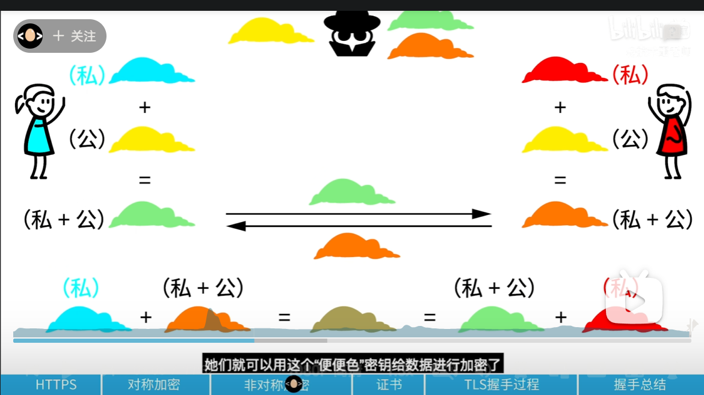
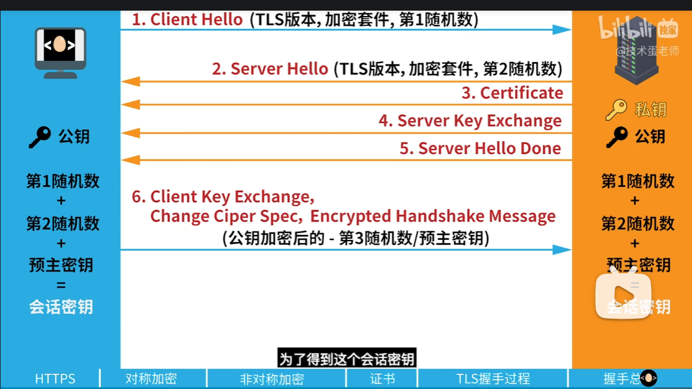
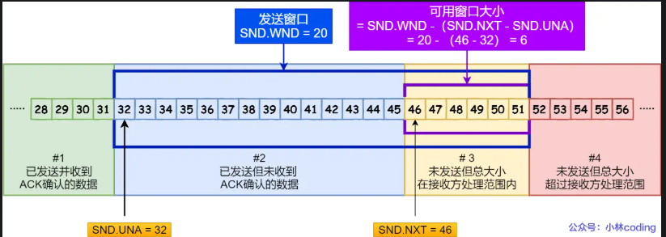
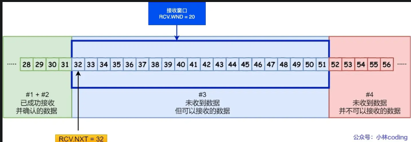
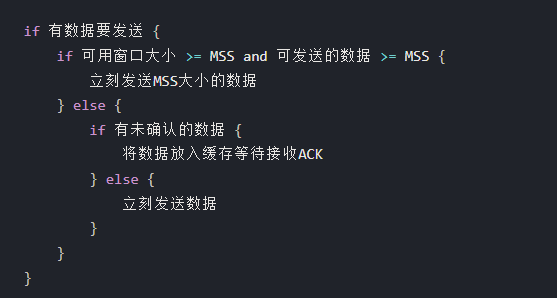
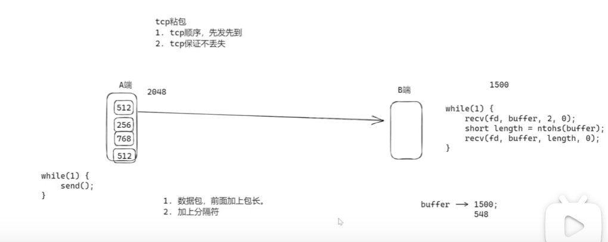
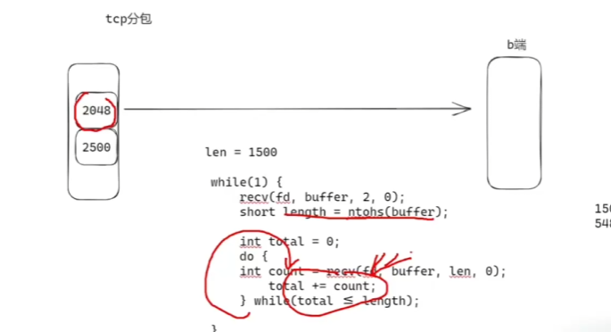
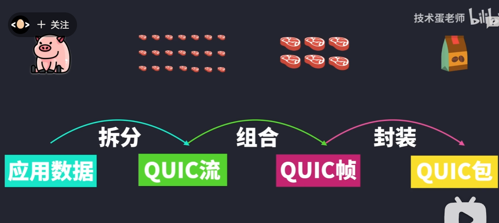
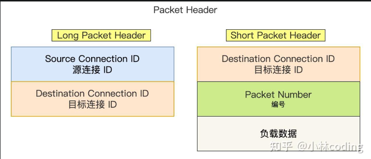

### 1. https和http区别，加密怎么做，tls握手过程

区别：
+ HTTP（超文本传输协议），信息是铭文传输，存在安全风险。HTTPS 则解决 HTTP 不安全的缺陷，在 TCP 和 HTTP 网络层之间加入了 SSL/TLS 安全协议，使得报文能够加密传输。
+ HTTP 连接建立相对简单， TCP 三次握手之后便可进行 HTTP 的报文传输。而 HTTPS 在 TCP 三次握手之后，还需进行 SSL/TLS 的握手过程，才可进入加密报文传输。
+ 两者的默认端口不一样，HTTP 默认端口号是 80，HTTPS 默认端口号是 443。
+ HTTPS 协议需要向 CA（证书权威机构）申请数字证书，来保证服务器的身份是可信的。

> 混合加密
HTTPS 采用的是对称加密和非对称加密结合的「混合加密」方式：
+ 在通信建立前采用非对称加密的方式交换「会话秘钥」，后续就不再使用非对称加密
+ 在通信过程中全部使用对称加密的「会话秘钥」的方式加密明文数据。

采用「混合加密」的方式的原因：
+ 对称加密只使用一个密钥，运算速度快，密钥必须保密，无法做到安全的密钥交换。
+ 非对称加密使用两个密钥：公钥和私钥，公钥可以任意分发而私钥保密，解决了密钥交换问题但速度慢。

非对称密钥：
双方刚开始都有自己独一的私钥，然后双方都有一个公钥（一样的），然后双方把自己的私钥和公钥混合发送给对方，然后把自己的私钥和交换的混合就成了独一无二的密钥了。



> HTTPS 是如何建立连接的？其间交互了什么？
SSL/TLS 协议基本流程：
+ 客户端向服务器索要并验证服务器的公钥
+ 双方协商生产「会话秘钥」。
+ 双方采用「会话秘钥」进行加密通信。



第一次握手：

1. CLient hello 发送 TLS版本，加密套件，第1随机数

TLS 第二次握手

2. server hello 确认TLS版本，使用的加密套件，第二随机树。然后在发送公钥和证书，确认发送完成；

TLS 第三次握手

4. 客户端生成预主密钥，通过公钥加密发送；
5. 服务端收到后，用自己的私钥解密，就拿到预主密钥了；
6. 双方使用第一第二随机数和预祝密钥生成会话密钥。
然后客户端发一个「Change Cipher Spec」，告诉服务端开始使用加密方式发送消息。
然后客户端发一个「Change Cipher Spec」，告诉服务端开始使用加密方式发送消息。把之前所有发送的数据做个摘要，再用会话密钥（master secret）加密一下，让服务器做个验证，验证加密通信「是否可用」和「之前握手信息是否有被中途篡改过」。

TLS 第四次握手

服务器也是同样的操作，发「Change Cipher Spec」和「Enccrypted Handshake Message」消息，如果双方都验证加密和解密没问题，那么握手正式完成。


### 2. HTTP/1.1、HTTP/2、HTTP/3

> HTTP/1.1 相比 HTTP/1.0 性能上的改进：

+ 使用长连接的方式改善了 HTTP/1.0 短连接造成的性能开销。
+ 支持管道（pipeline）网络传输，只要第一个请求发出去了，不必等其回来，就可以发第二个请求出去，可以减少整体的响应时间。但是服务器是按请求的顺序响应的。

但 HTTP/1.1 还是有性能瓶颈：
+ 请求 / 响应头部（Header）未经压缩就发送，首部信息越多延迟越大。只能压缩 Body 的部分；
+ 发送冗长的首部。每次互相发送相同的首部造成的浪费较多；
+ 服务器是按请求的顺序响应的，如果服务器响应慢，会招致客户端一直请求不到数据，也就是队头阻塞；
+ 没有请求优先级控制；
+ 请求只能从客户端开始，服务器只能被动响应。  


> HTTP/2 协议是基于 HTTPS 的，所以 HTTP/2 的安全性也是有保障的。
那 HTTP/2 相比 HTTP/1.1 性能上的改进：

+ 头部压缩 ->在客户端和服务器同时维护一张头信息表，所有字段都会存入这个表，生成一个索引号，以后就不发送同样字段了，只发送索引号，这样就提高速度了。
+ 二进制格式
+ 并发传输-》多路复用，解决对头阻塞  Stream ID 
+ 服务器主动推送资源

HTTP/2 有什么缺陷？
HTTP/2 还是存在“队头阻塞”的问题，只不过问题不是在 HTTP 这一层面，而是在 TCP 这一层。

+ HTTP/2 是基于 TCP 协议来传输数据的，TCP 是字节流协议，TCP 层必须保证收到的字节数据是完整且连续的，这样内核才会将缓冲区里的数据返回给 HTTP 应用，那么当「前 1 个字节数据」没有到达时，后收到的字节数据只能存放在内核缓冲区里，只有等到这 1 个字节数据到达时，HTTP/2 应用层才能从内核中拿到数据，这就是 HTTP/2 队头阻塞问题。


> HTTP/3 做了哪些优化？
HTTP/3 把 HTTP 下层的 TCP 协议改成了 UDP！基于 UDP 的 QUIC 协议 可以实现类似 TCP 的可靠性传输。

QUIC 有以下 3 个特点。
+ 无队头阻塞
+ 更快的连接建立

1. 无队头阻塞
在同一条连接上并发传输多个 Stream，Stream 可以认为就是一条 HTTP 请求。

QUIC 有自己的一套机制可以保证传输的可靠性的。当某个流发生丢包时，只会阻塞这个流，其他流不会受到影响，因此不存在队头阻塞问题。

所以，QUIC 连接上的多个 Stream 之间并没有依赖，都是独立的，某个流发生丢包了，只会影响该流，其他流不受影响。

2. 更快的连接建立
HTTP/3 的 QUIC 协议并不是与 TLS 分层，而是 QUIC 内部包含了 TLS，在自己的帧会携带 TLS 里的“记录”，再加上 QUIC 使用的是 TLS/1.3，因此仅需 1 个 RTT 就可以「同时」完成建立连接与密钥协商.

### 3. get 和 post 区别
+ 在 HTTP 协议里，所谓的「安全」是指请求方法不会「破坏」服务器上的资源
+ 所谓的「幂等」，意思是多次执行相同的操作，结果都是「相同」的。

GET 方法就是安全且幂等的。所以，可以对 GET 请求的数据做缓存，这个缓存可以做到浏览器本身上，也可以做到代理上（如nginx），而且在浏览器中 GET 请求可以保存为书签。

POST 因为是「新增或提交数据」的操作，会修改服务器上的资源，所以是不安全的，且多次提交数据就会创建多个资源，所以不是幂等的。所以，浏览器一般不会缓存 POST 请求，也不能把 POST 请求保存为书签。

1. 用途
+ GET
    + 通常用于获取资源。比如当你在浏览器地址栏输入一个网址并回车，浏览器就会发起一个 GET 请求来获取该网页的内容。再如访问搜索引擎搜索关键词时，也是使用 GET 请求将关键词发送给服务器以获取搜索结果页面。
+ POST
    + 主要用于向服务器提交数据，可能会导致服务器上的资源发生创建、更新等变化。例如在网页上填写表单（如注册表单、登录表单）后提交，一般会使用 POST 请求将表单数据发送给服务器进行处理。

2. 参数传递
+ GET
    + 参数会附加在 URL 的后面，以键值对的形式出现，多个参数之间用 & 符号连接。例如：https://example.com/search?keyword=apple&category=fruits。
    + 由于 URL 长度有限制（不同浏览器和服务器对 URL 长度的限制不同，一般限制在 2048 个字符左右），所以 GET 请求能携带的参数数量和大小都受到一定限制。
+ POST
    + 参数不会显示在 URL 中，而是放在请求体（body）里。请求体可以包含大量的数据，理论上对数据大小没有限制（实际受服务器配置限制），因此适合传递大量或敏感的数据，如文件上传就通常使用 POST 请求。

3. 安全性
+ GET
    + 因为参数暴露在 URL 中，所以安全性较低。例如在登录时使用 GET 请求传递用户名和密码，这些信息会直接显示在 URL 中，可能会被他人轻易获取，也容易被记录在浏览器历史记录、服务器日志中，存在信息泄露的风险。
    + 此外，GET 请求还容易受到 SQL 注入、跨站脚本攻击（XSS）等安全威胁，攻击者可以通过构造恶意的 URL 参数来执行非法操作。
+ POST
    + 参数放在请求体中，相对来说不那么容易被看到，一定程度上提高了数据的安全性。但这并不意味着 POST 请求就绝对安全，如果服务器端对请求数据的验证和处理不当，仍然可能存在安全漏洞。

4. 缓存性
+ GET
    + 具有可缓存性。浏览器通常会缓存 GET 请求的结果，当再次发起相同的 GET 请求时，如果缓存未过期，浏览器会直接从缓存中读取数据，而不会再次向服务器发送请求，这样可以提高页面的加载速度，减少服务器的负载。
+ POST
    + 一般不会被缓存。因为 POST 请求通常用于提交数据并可能对服务器资源产生改变，每次请求的结果可能不同，所以浏览器不会缓存 POST 请求的结果。


### 4. http缓存技术

强制缓存和协商缓存。

#什么是强制缓存？
强缓存指的是只要浏览器判断缓存没有过期，则直接使用浏览器的本地缓存，决定是否使用缓存的主动性在于浏览器这边。

两个 HTTP 响应头部：
+ Cache-Control， 是一个相对时间；
+ Expires，是一个绝对时间；
Cache-Control 的优先级高于 Expires 

#什么是协商缓存？
当我们在浏览器使用开发者工具的时候，你可能会看到过某些请求的响应码是 304，这个是告诉浏览器可以使用本地缓存的资源，通常这种通过服务端告知客户端是否可以使用缓存的方式被称为协商缓存。

### 5. http和rpc区别

HTTP 协议（Hyper Text Transfer Protocol），又叫做超文本传输协议。
RPC（Remote Procedure Call），又叫做远程过程调用。它本身并不是一个具体的协议，而是一种调用方式。

既然有 RPC 了，为什么还要有 HTTP 呢？

HTTP 主要用于 B/S 架构，而 RPC 更多用于 C/S 架构。

区别：

> 服务发现
+ 在 HTTP 中，你知道服务的域名，就可以通过 DNS 服务去解析得到它背后的 IP 地址，默认 80 端口。
+ 而 RPC 的话，就有些区别，一般会有专门的中间服务去保存服务名和IP信息，比如 Consul 或者 Etcd，甚至是 Redis。想要访问某个服务，就去这些中间服务去获得 IP 和端口信息。

> 底层连接形式
+  HTTP/1.1 协议为例，其默认在建立底层 TCP 连接之后会一直保持这个连接（Keep Alive），之后的请求和响应都会复用这条连接
+  RPC 协议，也跟 HTTP 类似，也是通过建立 TCP 长链接进行数据交互，但不同的地方在于，RPC 协议一般还会再建个连接池，在请求量大的时候，建立多条连接放在池内，要发数据的时候就从池里取一条连接出来，用完放回去，下次再复用，可以说非常环保。

> 传输的内容
+ HTTP/1.1，传的内容以字符串为主，它使用 Json 来序列化结构体数据。
+  RPC，采用体积更小的 Protobuf或其他序列化协议去保存结构体数据，同时也不需要像 HTTP 那样考虑各种浏览器行为，比如 302 重定向跳转啥的.

既然有了 HTTP/2，还要有 RPC 协议？
由于 HTTP/2 是 2015 年出来的。那时候很多公司内部的 RPC 协议都已经跑了好些年了，基于历史原因，一般也没必要去换了。

### 6. http和websocket区别

HTTP/1.1，也是基于TCP协议的，同一时间里，客户端和服务器只能有一方主动发数据，这就是所谓的半双工.

户端和服务器之间都要互相主动发大量数据的场景。需要另外一个基于TCP的新协议WebSocket。

怎么建立Websocket连接？
浏览器在 TCP 三次握手建立连接之后，都统一使用 HTTP 协议先进行一次通信。如果这时候是想建立 WebSocket 连接，就会在 HTTP 请求里带上一些特殊的header 头。包含升级协议和随机的base64码。发送给服务端。

如果服务端支持websocket协议，则握手；
WebSocket 握手流程：101 指协议切换。根据客户端生成的 base64 码，用某个公开的算法变成另一段字符串，放在 HTTP 响应的 Sec-WebSocket-Accept 头。

之后，浏览器也用同样的公开算法将base64码转成另一段字符串，如果这段字符串跟服务器传回来的字符串一致，那验证通过。

经历了一来一回两次 HTTP 握手，WebSocket就建立完成了，后续双方就可以使用 webscoket 的数据格式进行通信了。

### 7.输入url发生什么？

1. DNS 解析
+ 作用：URL 中的域名（如 www.example.com）是方便用户记忆的，但计算机网络通信需要使用 IP 地址。DNS（Domain Name System，域名系统）解析的目的就是将域名转换为对应的 IP 地址。
+ 过程
    + 浏览器缓存：浏览器会先检查自身的 DNS 缓存，看是否已经有该域名对应的 IP 地址。如果有且未过期，就直接使用该 IP 地址。
    + 操作系统缓存：若浏览器缓存中没有，浏览器会向操作系统查询其 DNS 缓存。不同操作系统有不同的 DNS 缓存机制，例如 Windows 可以通过 ipconfig /displaydns 命令查看。
    + 本地 DNS 服务器：如果操作系统缓存中也没有，请求会被发送到本地 DNS 服务器（通常由网络服务提供商提供）。本地 DNS 服务器会检查自己的缓存，如果有则返回结果；如果没有，它会进行递归或迭代查询。
    + 根 DNS 服务器等：本地 DNS 服务器会向根 DNS 服务器、顶级域名 DNS 服务器、权威 DNS 服务器依次查询，最终获取到域名对应的 IP 地址，并将结果返回给浏览器。


2. TCP 连接
+ 作用：HTTP 协议是基于 TCP（Transmission Control Protocol，传输控制协议）的，在进行 HTTP 数据传输之前，需要先建立 TCP 连接。TCP 提供可靠的、面向连接的通信，确保数据在传输过程中不会丢失、乱序。
+ 过程：使用三次握手来建立连接。
    + 客户端发送 SYN 包：客户端向服务器发送一个 SYN（Synchronize Sequence Numbers）包，包含客户端的初始序列号，表明请求建立连接。
    + 服务器发送 SYN + ACK 包：服务器收到 SYN 包后，向客户端发送一个 SYN + ACK 包，包含服务器的初始序列号和对客户端 SYN 包的确认号。
    + 客户端发送 ACK 包：客户端收到 SYN + ACK 包后，向服务器发送一个 ACK（Acknowledgment）包，包含对服务器 SYN 包的确认号，至此 TCP 连接建立成功。

3. HTTP 请求
+ 作用：在 TCP 连接建立后，浏览器会根据输入的 URL 构造 HTTP 请求消息，并发送给服务器。
+ 请求格式：HTTP 请求由请求行、请求头和请求体组成。
    + 请求行：包含请求方法（如 GET、POST 等）、请求的资源路径和 HTTP 版本，例如 GET /index.html HTTP/1.1。
    + 请求头：包含一些附加信息，如用户代理（浏览器类型和版本）、接受的文件类型、缓存控制等。
    + 请求体：对于 GET 请求，请求体通常为空；对于 POST 请求，请求体可以包含要提交的数据，如表单数据。


4. 服务器处理请求
+ 作用：服务器接收到 HTTP 请求后，会对请求进行解析和处理。
+ 过程
    + Web 服务器软件接收请求：常见的 Web 服务器软件有 Apache、Nginx 等，它们负责接收客户端的请求，并将请求转发给相应的应用程序。
    + 应用程序处理请求：服务器端的应用程序（如基于 PHP、Python 的 Django 或 Flask 框架等）会根据请求的内容进行逻辑处理，可能会查询数据库、调用其他服务等。
    + 生成响应：应用程序处理完请求后，会生成一个 HTTP 响应消息。

5. HTTP 响应
+ 作用：服务器将处理结果封装成 HTTP 响应消息，并通过已建立的 TCP 连接发送给客户端。
+ 响应格式：HTTP 响应由状态行、响应头和响应体组成。
    + 状态行：包含 HTTP 版本、状态码和状态消息，例如 HTTP/1.1 200 OK，表示请求成功。
    + 响应头：包含一些附加信息，如响应内容的类型、长度、缓存策略等。
    + 响应体：包含服务器返回的实际数据，如 HTML 页面、图片、JSON 数据等。

6. 浏览器解析渲染页面
+ 作用：浏览器接收到 HTTP 响应后，会根据响应内容进行解析和渲染，将页面呈现给用户。
+ 过程
    + 解析 HTML：浏览器会解析 HTML 文件，构建 DOM（Document Object Model，文档对象模型）树。    
    + 解析 CSS：同时解析 CSS 文件，构建 CSSOM（CSS Object Model，CSS 对象模型）树。
    + 合并渲染树：将 DOM 树和 CSSOM 树合并成渲染树，渲染树只包含需要显示的元素及其样式信息。
    + 布局和绘制：根据渲染树进行布局（确定元素的位置和大小）和绘制（将元素绘制到屏幕上），最终呈现出完整的页面。

7. TCP 连接关闭
+ 作用：当页面资源加载完成后，浏览器和服务器之间的 TCP 连接会关闭，释放系统资源。
+ 过程：使用四次挥手来关闭连接。
    + 客户端发送 FIN 包：客户端向服务器发送一个 FIN（Finish）包，表示请求关闭连接。
    + 服务器发送 ACK 包：服务器收到 FIN 包后，向客户端发送一个 ACK 包，表示确认收到关闭请求。
    + 服务器发送 FIN 包：服务器也向客户端发送一个 FIN 包，表示自己也请求关闭连接。
    + 客户端发送 ACK 包：客户端收到 FIN 包后，向服务器发送一个 ACK 包，表示确认收到服务器的关闭请求，至此 TCP 连接关闭。

### 8. TCP全连接队列,半连接队列?

半连接队列和全连接队列是在服务器端处理客户端连接请求时非常重要的概念，它们用于管理不同阶段的 TCP 连接。

#### 半连接队列（SYN 队列）

概念
半连接队列，也称为 SYN 队列，是在 TCP 三次握手的第一个阶段使用的队列。当客户端向服务器发送 SYN 包请求建立连接时，服务器收到该 SYN 包后，会为这个连接分配必要的资源，并将这个连接信息放入半连接队列中，同时向客户端发送 SYN + ACK 包作为响应。此时这个连接处于半连接状态，因为还没有完成三次握手的最后一步。

工作流程
1. 客户端向服务器发送 SYN 包，请求建立 TCP 连接。
2. 服务器收到 SYN 包后，为该连接分配资源（如内存等），并将连接信息添加到半连接队列中。
3. 服务器向客户端发送 SYN + ACK 包。
4. 客户端收到 SYN + ACK 包后，发送 ACK 包给服务器，完成三次握手。如果客户端的 ACK 包正常5到达服务器，该连接会从半连接队列移除，并进入全连接队列。

影响因素
+ 队列长度限制：半连接队列有一定的长度限制，通常可以通过内核参数进行调整。如果半连接队列已满，服务器可能会丢弃新的 SYN 包，导致客户端连接失败。
+ SYN Flood 攻击：恶意攻击者可以利用半连接队列进行 SYN Flood 攻击，通过发送大量的 SYN 包但不发送 ACK 包，使半连接队列被占满，从而阻止正常客户端的连接请求。

解决SYN Flood：启动SYN Cookie技术：是一种无状态的TCP连接技术，它通过计算一个独特的Cookie来验证TCP连接的合法性，而不需要在服务器上保证每个连接的状态信息。当服务器收到SYN请求时，他会计算一个Cookie并发送给客户端，客户端在后续的ACK报文中携带该Cookie，服务器通过验证Cookie的有效性来判断连接是否合法。这样可以有效减少服务器资源的消耗，并防止SYN flood攻击导致资源耗尽。


#### 全连接队列（Accept 队列）

概念
全连接队列，也称为 Accept 队列，是在 TCP 三次握手完成后使用的队列。当服务器收到客户端的 ACK 包，完成三次握手后，连接进入全连接状态，服务器会将该连接从半连接队列移除，并将其放入全连接队列中。服务器的应用程序可以通过调用 accept() 系统调用从全连接队列中取出连接进行处理。

工作流程
1. 客户端发送 ACK 包完成三次握手。
2. 服务器将连接从半连接队列移除，并添加到全连接队列中。
3. 服务器的应用程序通过 accept() 系统调用从全连接队列中取出连接，开始进行数据传输。

影响因素
+ 队列长度限制：全连接队列同样有长度限制，也可以通过内核参数进行调整。如果全连接队列已满，服务器可能会忽略客户端的 ACK 包，客户端可能会重传 ACK 包，造成一定的延迟。
+ 应用程序处理能力：如果服务器的应用程序处理连接的速度较慢，全连接队列可能会被占满，影响新连接的建立。

### 9. TCP流量控制，拥塞控制

重传机制：
+ 超时重传
+ 快速重传
+ SACK
+ D-SACK

滑动窗口 : N -> 流量传输
窗口大小就是指无需等待确认应答，而可以继续发送数据的最大值。

假设窗口大小为 3 个 TCP 段，那么发送方就可以「连续发送」 3 个 TCP 段，并且中途若有 ACK 丢失，可以通过「下一个确认应答进行确认」。

+ 图中的 ACK 600 确认应答报文丢失，也没关系，因为可以通过下一个确认应答进行确认，只要发送方收到了 ACK 700 确认应答，就意味着 700 之前的所有数据「接收方」都收到了。这个模式就叫累计确认或者累计应答。

> 窗口大小由哪一方决定

TCP 头里有一个字段叫 Window，也就是窗口大小。
这个字段是接收端告诉发送端自己还有多少缓冲区可以接收数据。于是发送端就可以根据这个接收端的处理能力来发送数据，而不会导致接收端处理不过来。

所以，通常窗口的大小是由接收方的窗口大小来决定的。

发送方发送的数据大小不能超过接收方的窗口大小，否则接收方就无法正常接收到数据。

> 发送方的滑动窗口 和 接收方的滑动窗口




> 接收窗口和发送窗口的大小是相等的吗？

并不是完全相等，接收窗口的大小是约等于发送窗口的大小的。

因为滑动窗口并不是一成不变的。比如，当接收方的应用进程读取数据的速度非常快的话，，这样的话接收窗口可以很快的就空缺出来。那么新的接收窗口大小，是通过 TCP 报文中的 Windows 字段来告诉发送方。那么这个传输过程是存在时延的，所以接收窗口和发送窗口是约等于的关系。


####  TCP 流量控制
TCP 每一侧都有接受缓存；如果发送方发送很快，而读取方太慢，发送方的数据就会很容易使该链接接受缓存溢出。

流量控制：消除发送方使接收方缓存溢出的可能性，也就是说是一个速度匹配服务，发送方的速率和接受方应用读取的速率向匹配。

TCP通过让发送方维护一个**接受窗口**的变量来控制流量控制。

两个变量： 
+ lastByteRead:应用程序冲缓存中读取数据流的最后一个字节编号
+ lastByteRecv:从网络中放入接受缓存中数据流的最后一个字节编号

接受缓存 RecvBuffer：TCP不允许缓存溢出
RecvBuffer >= lastByteRecv - lastByteRead

缓存可用空间： rwnd=RecvBuffer - [lastByteRecv - lastByteRead]

> 连接是如何使用变量rwnd来提高流量控制服务呢？

主机通过把当前的rwnd值放入它发送主机a的报文字段接受窗口字段中，告诉a它在该连接中还有多少可用空间。开始的时候rwnd=RecvBuffer；
发送方保证 发送为确认的数量小于 <= rwnd;


工作原理
+ 滑动窗口机制：TCP 使用滑动窗口协议来实现流量控制。接收方在 TCP 首部中通过 **窗口大小** 字段告知发送方自己当前可用的接收缓冲区大小。发送方根据这个窗口大小来决定可以发送多少数据。
+ 窗口动态调整：接收方会根据自身缓冲区的使用情况动态调整窗口大小。当接收方的缓冲区有更多空间时，会增大窗口大小，允许发送方发送更多数据；当缓冲区接近满时，会减小窗口大小，限制发送方的发送速率。

> 操作系统缓冲区与滑动窗口的关系

发送窗口和接收窗口中所存放的字节数，都是放在操作系统内存缓冲区中的，而操作系统的缓冲区，会被操作系统调整。

> 那操作系统的缓冲区，是如何影响发送窗口和接收窗口的呢？

当应用程序没有及时读取缓存时，发送窗口和接收窗口的变化。
可见最后窗口都收缩为 0 了，也就是发生了窗口关闭。当发送方可用窗口变为 0 时，送方实际上会定时发送窗口探测报文，以便知道接收方的窗口是否发生了改变.


当服务端系统资源非常紧张的时候，操作系统可能会直接减少了接收缓冲区大小，这时应用程序又无法及时读取缓存数据，那么这时候就有严重的事情发生了，会出现数据包丢失的现象。
+ 为了防止这种情况发生，TCP 规定是不允许同时减少缓存又收缩窗口的，而是采用先收缩窗口，过段时间再减少缓存，这样就可以避免了丢包情况。

> 窗口关闭

如果窗口大小为 0 时，就会阻止发送方给接收方传递数据，直到窗口变为非 0 为止，这就是窗口关闭。

TCP 为每个连接设有一个持续定时器，只要 TCP 连接一方收到对方的零窗口通知，就启动持续计时器。

如果持续计时器超时，就会发送窗口探测 ( Window probe ) 报文，而对方在确认这个探测报文时，给出自己现在的接收窗口大小。

+ 如果接收窗口仍然为 0，那么收到这个报文的一方就会重新启动持续计时器；
+ 如果接收窗口不是 0，那么死锁的局面就可以被打破了。

> 糊涂窗口综合症

如果接收方腾出几个字节并告诉发送方现在有几个字节的窗口，而发送方会义无反顾地发送这几个字节，这就是糊涂窗口综合症。

TCP + IP 头有 40 个字节，为了传输那几个字节的数据，要搭上这么大的开销，这太不经济了。

+ 让接收方不通告小窗口给发送方
+ 让发送方避免发送小数据

> 怎么让接收方不通告小窗口呢？

当「窗口大小」小于 min( MSS，缓存空间/2 ) ，小于 MSS 与 1/2 缓存大小中的最小值时，就会向发送方通告窗口为 0，也就阻止了发送方再发数据过来。

> 怎么让发送方避免发送小数据呢？

使用 Nagle 算法，该算法的思路是延时处理，只有满足下面两个条件中的任意一个条件，才可以发送数据：
+ 要等到窗口大小 >= MSS 并且 数据大小 >= MSS；
+ 收到之前发送数据的 ack 回包；

只要上面两个条件都不满足，发送方一直在囤积数据，直到满足上面的发送条件。



注意，如果接收方不能满足「不通告小窗口给发送方」，那么即使开了 Nagle 算法，也无法避免糊涂窗口综合症，因为如果对端 ACK 回复很快的话（达到 Nagle 算法的条件二），Nagle 算法就不会拼接太多的数据包，这种情况下依然会有小数据包的传输，网络总体的利用率依然很低。

接收方得满足「不通告小窗口给发送方」+ 发送方开启 Nagle 算法，才能避免糊涂窗口综合症。

#### TCP 拥塞控制

> 为什么要有拥塞控制呀，不是有流量控制了吗？

流量控制是避免「发送方」的数据填满「接收方」的缓存，但是并不知道网络的中发生了什么。因为IP网络阻塞遏制。

在网络出现拥堵时，如果继续发送大量数据包，可能会导致数据包时延、丢失等，这时 TCP 就会重传数据，但是一重传就会导致网络的负担更重，于是会导致更大的延迟以及更多的丢包，这个情况就会进入恶性循环被不断地放大....

拥塞控制，控制的目的就是避免「发送方」的数据填满整个网络。

为了在「发送方」调节所要发送数据的量，定义了一个叫做「拥塞窗口」的概念。

> 什么是拥塞窗口？和发送窗口有什么关系呢？

拥塞窗口 cwnd是发送方维护的一个的状态变量，它会根据网络的拥塞程度动态变化的。

我们在前面提到过发送窗口 swnd 和接收窗口 rwnd 是约等于的关系，那么由于加入了拥塞窗口的概念后，此时发送窗口的值是swnd = min(cwnd, rwnd)，也就是拥塞窗口和接收窗口中的最小值。

拥塞窗口 cwnd 变化的规则：
+ 只要网络中没有出现拥塞，cwnd 就会增大；
+ 但网络中出现了拥塞，cwnd 就减少；

> 那么怎么知道当前网络是否出现了拥塞呢？

其实只要「发送方」没有在规定时间内接收到 ACK 应答报文，也就是发生了超时重传，就会认为网络出现了拥塞。

> 拥塞控制有哪些控制算法？

+ 慢启动
+ 拥塞避免
+ 拥塞发生
+ 快速恢复


主要算法和工作过程

拥塞窗口是发送方在进行 TCP 数据传输时使用的一个动态变量，它表示发送方在没有收到接收方确认（ACK）的情况下，最多可以发送的数据量（以字节或报文段为单位）。

+ 慢启动（Slow Start）
    + TCP 在刚建立连接完成后，首先是有个慢启动的过程，个慢启动的意思就是一点一点的提高发送数据包的数量.
    + 原理：发送方初始时设置一个拥塞窗口（cwnd），大小通常为 1 个最大段大小（MSS）。每收到一个确认报文，拥塞窗口大小就增加 1 个 MSS。这样，发送方的发送速率会呈指数级增长。
    + 目的：快速探测网络的可用带宽。

> 那慢启动涨到什么时候是个头呢？
有一个叫慢启动门限 ssthresh状态变量。
+ 当 cwnd < ssthresh 时，使用慢启动算法。
+ 当 cwnd >= ssthresh 时，就会使用「拥塞避免算法」。


+ 拥塞避免（Congestion Avoidance）
    + 原理：当拥塞窗口大小达到慢启动阈值（ssthresh）时，发送方进入拥塞避免阶段。在这个阶段，每收到一个确认报文，拥塞窗口大小只增加 1/cwnd 个 MSS，即拥塞窗口呈线性增长。
    + 目的：避免网络拥塞，使发送速率的增长更加平缓。

就这么一直增长着后，网络就会慢慢进入了拥塞的状况了, 于是就会出现丢包现象，这时就需要对丢失的数据包进行重传。

当触发了重传机制，也就进入了「拥塞发生算法」

+ 拥塞发生:当网络出现拥塞，也就是会发生数据包重传，重传机制主要有两种：

超时重传: 
    当发生了「超时重传」，则就会使用拥塞发生算法。
    这个时候，ssthresh 和 cwnd 的值会发生变化：
    + ssthresh 设为 cwnd/2，
    + cwnd 重置为 1
    ss -nli 查看系统的 cwnd 初始化值
快速重传

+ 快速重传（Fast Retransmit）
    + 原理：当发送方连续收到 3 个相同的确认报文时，说明有一个数据包可能丢失了，但网络并没有完全拥塞。此时，发送方会立即重传丢失的数据包，而不需要等待超时重传。
    + 目的：快速恢复丢失的数据包，减少等待超时的时间。
    + cwnd = cwnd/2 ，也就是设置为原来的一半;
    + ssthresh = cwnd;
    + 进入快速恢复算法
    
+ 快速恢复（Fast Recovery）
快速重传和快速恢复算法一般同时使用，快速恢复算法是认为，你还能收到 3 个重复 ACK 说明网络也不那么糟糕，所以没有必要像 RTO 超时那么强烈。

    + 原理：在快速重传之后，发送方进入快速恢复阶段。
    + 拥塞窗口 cwnd =ssthresh + 3 * MSS（因为收到了 3 个重复确认）。
    + 重传丢失的数据包；
    + 如果再收到重复的 ACK，那么 cwnd 增加 1；
    + 如果收到新数据的 ACK 后，把 cwnd 设置为第一步中的 ssthresh 的值，原因是该 ACK 确认了新的数据，说明从 duplicated ACK 时的数据都已收到，该恢复过程已经结束，可以回到恢复之前的状态了，也即再次进入拥塞避免状态；

    + 目的：在网络没有完全拥塞的情况下，尽快恢复发送速率。


### 10 TCP四次握手能不能简化为三次?

在某些特定情况下，TCP 四次挥手可以简化为三次。

TCP 断开连接时使用四次挥手，其具体过程如下：
+ 客户端发送 FIN 包：客户端完成数据发送后，向服务器发送一个 FIN （Finish）包，表示请求关闭连接。此时客户端进入 FIN_WAIT_1 状态。
+ 服务器发送 ACK 包：服务器收到客户端的 FIN 包后，向客户端发送一个 ACK （Acknowledgment）包作为确认。服务器进入 CLOSE_WAIT 状态，客户端收到 ACK 包后进入 FIN_WAIT_2 状态。
+ 服务器发送 FIN 包：服务器完成数据发送后，向客户端发送一个 FIN 包，表示请求关闭连接。服务器进入 LAST_ACK 状态。
+ 客户端发送 ACK 包：客户端收到服务器的 FIN 包后，向服务器发送一个 ACK 包作为确认。客户端进入 TIME_WAIT 状态，服务器收到 ACK 包后关闭连接。

四次挥手可以简化为三次的情况:
在服务器收到客户端的 FIN 包后，如果服务器此时已经没有数据要发送，即可以立即关闭连接，那么服务器可以将 ACK 包和 FIN 包合并发送。这样原本的四次挥手就简化为三次：

+ 客户端发送 FIN 包：客户端向服务器发送 FIN 包，请求关闭连接，进入 FIN_WAIT_1 状态。
+ 服务器发送 ACK + FIN 包：服务器收到 FIN 包后，由于没有数据要发送，将 ACK 包和 FIN 包合并发送给客户端。服务器进入 LAST_ACK 状态，客户端收到该包后进入 CLOSING 或 TIME_WAIT 状态（取决于具体实现）。
+ 客户端发送 ACK 包：客户端向服务器发送 ACK 包作为确认，客户端进入 TIME_WAIT 状态，服务器收到 ACK 包后关闭连接。

简化的原因和条件
+ 原因：TCP 协议允许在一个 TCP 报文中同时设置多个标志位。当服务器没有数据要发送时，将 ACK 和 FIN 标志位同时设置在一个报文中发送，减少了一次报文传输，提高了连接关闭的效率。
+ 条件：服务器在收到客户端的 FIN 包时，必须已经完成了所有数据的发送，并且没有更多的数据需要发送给客户端。只有在这种情况下，服务器才能立即发送 FIN 包，从而实现将 ACK 包和 FIN 包合并发送。

### 11. 怎么查服务器建立了多少个TCP连接?

使用 netstat 命令

netstat 是一个常用的网络工具，可用于显示网络连接、路由表等信息。通过过滤 TCP 连接信息并统计数量，可以得到服务器建立的 TCP 连接数。

```bash
netstat -an | grep 'ESTABLISHED' | grep 'tcp' | wc -l
```

+ etstat -an：显示所有网络连接信息，包括 TCP 和 UDP 连接，-a 表示显示所有连接，-n 表示以数字形式显示地址和端口。
+ grep 'ESTABLISHED'：过滤出已建立（ESTABLISHED）状态的连接。
+ grep 'tcp'：进一步过滤出 TCP 连接。
+ wc -l：统计过滤后的行数，即 TCP 连接的数量。

### 12. 服务器TIME_WATE状态过多会对你的服务器产生什么影响?有什么办法能减少这种影响?

#### 1. 为什么 TIME_WAIT 等待的时间是 2MSL

MSL： 报文最大生存时间。

MSL 与 TTL（ip数据报最大路由数） 的区别： MSL 的单位是时间，而 TTL 是经过路由跳数。所以 MSL 应该要大于等于 TTL 消耗为 0 的时间，以确保报文已被自然消亡。

TTL 的值一般是 64，Linux 将 MSL 设置为 30 秒，意味着 Linux 为数据报文经过 64 个路由器的时间不会超过 30 秒，如果超过了，就认为报文已经消失在网络中了。

为什么是2MSL，网络中可能存在来自发送方的数据包，当这些发送方的数据包被接收方处理后又会向对方发送响应，所以一来一回需要等待 2 倍的时间。其实是相当于至少允许报文丢失一次。


#### 2. 为什么需要 TIME_WAIT 状态？

需要 TIME-WAIT 状态，主要是两个原因：
+ 防止历史连接中的数据，被后面相同四元组的连接错误的接收；
    序列号和初始化序列号并不是无限递增的，会发生回绕为初始值的情况，这意味着无法根据序列号来判断新老数据。
    比如说，服务端向客户端发送一个 seq=301的报文，但是这个报文阻塞了。后续服务端和客户端断开连接，然后又重新连接，刚好这个报文到达客户端，且正好在客户端接收窗口内，因此客户端会正常接收这个数据报文，产生混乱。
    因此 TCP 设计了 TIME_WAIT 状态，状态会持续 2MSL 时长，这个时间足以让两个方向上的数据包都被丢弃，使得原来连接的数据包在网络中都自然消失，再出现的数据包一定都是新建立连接所产生的。

+ 保证「被动关闭连接」的一方，能被正确的关闭；
    等待足够的时间以确保最后的 ACK 能让被动关闭方接收，从而帮助其正常关闭。
    比如：客户端（主动关闭方）最后一次 ACK 报文（第四次挥手）在网络中丢失了，那么按照 TCP 可靠性原则，服务端（被动关闭方）会重发 FIN 报文。假设客户端没有 TIME_WAIT 状态，而是在发完最后一次回 ACK 报文就直接进入 CLOSE 状态，如果该 ACK 报文丢失了，服务端则重传的 FIN 报文，而这时客户端已经进入到关闭状态了在收到服务端重传的 FIN 报文后，就会回 RST 报文。

#### 3. TIME_WAIT 过多有什么危害？

1. 占用系统资源
+ 端口资源：每个 TCP 连接需要使用一个源端口和一个目标端口，处于 TIME_WAIT 状态的连接会占用系统的端口资源。服务器可用的端口数量是有限的（通常为 1024 - 65535），如果 TIME_WAIT 状态的连接过多，会导致可用端口耗尽，从而无法建立新的连接。
+ 内存资源：操作系统需要为每个处于 TIME_WAIT 状态的连接维护一定的控制块信息，大量的 TIME_WAIT 连接会占用较多的内存资源，影响服务器的整体性能。

2. 增加 CPU 负担
+ 状态维护：操作系统需要对处于 TIME_WAIT 状态的连接进行状态维护和超时管理，频繁的状态检查和超时处理会增加 CPU 的负担，降低服务器的处理效率。

3. 影响新连接的建立
+ 端口复用受限：由于 TIME_WAIT 状态占用了大量端口，当有新的连接请求到来时，可能无法分配到可用的端口，导致新连接建立失败。


> 如果客户端（主动发起关闭连接方）的 TIME_WAIT 状态过多，占满了所有端口资源，那么就无法对「目的 IP+ 目的 PORT」都一样的服务端发起连接了，但是被使用的端口，还是可以继续对另外一个服务端发起连接的.

> 如果服务端（主动发起关闭连接方）的 TIME_WAIT 状态过多，并不会导致端口资源受限，因为服务端只监听一个端口，而且由于一个四元组唯一确定一个 TCP 连接，因此理论上服务端可以建立很多连接，但是 TCP 连接过多，会占用系统资源，比如文件描述符、内存资源、CPU 资源、线程资源等。


减少 TIME_WAIT 状态影响的方法: 

1. 调整内核参数
+ tcp_tw_reuse：该参数允许在 TIME_WAIT 状态的连接上复用端口。将其值设置为 1 可以开启此功能。
+ tcp_tw_recycle：该参数可以快速回收 TIME_WAIT 状态的连接。将其值设置为 1 可以开启此功能。

2. 优化应用程序设计
+ 长连接复用：尽量使用长连接代替短连接，减少频繁的连接建立和关闭操作，从而减少 TIME_WAIT 状态的产生。例如，在 HTTP 协议中，可以使用 Keep - Alive 机制来保持长连接。
+ 连接池技术：使用连接池来管理 TCP 连接，应用程序从连接池中获取和释放连接，而不是每次都建立新的连接，这样可以避免大量的 TIME_WAIT 状态。

#### 4. 服务器出现大量 TIME_WAIT 状态的原因有哪些？

主动关闭连接方才会出现的状态:
+ HTTP 没有使用长连接
+ HTTP 长连接超时
+ HTTP 长连接的请求数量达到上限

从 HTTP/1.1 开始， 就默认是开启了 Keep-Alive,只要客户端和服务端任意一方的 HTTP header 中有 Connection:close 信息，那么就无法使用 HTTP 长连接的机制。

不管哪一方禁用了 HTTP Keep-Alive，都是由服务端主动关闭连接，那么此时服务端上就会出现 TIME_WAIT 状态的连接。

HTTP Keep-Alive 的初衷是为客户端后续的请求重用连接，如果我们在某次 HTTP 请求-响应模型中，请求的 header 定义了connection：close 信息，那不再重用这个连接的时机就只有在服务端了

#### 5. 怎么排查

1. 确认 TIME_WAIT 连接数量

> netstat -an | grep TIME_WAIT | wc -l

2. 分析 TIME_WAIT 连接的来源

查看 netstat：使用以下命令可以查看处于 TIME_WAIT 状态的连接的详细信息，包括本地地址、端口、远程地址、端口等：

> netstat -anp | grep TIME_WAIT

3. 检查应用程序代码

+ 短连接频繁建立和关闭：如果应用程序频繁地建立和关闭连接，会导致大量的 TIME_WAIT 连接。检查代码中是否存在频繁创建和销毁连接的逻辑，例如在循环中不断创建和关闭 Socket 连接。

+ 未正确关闭连接：确保应用程序在使用完连接后正确关闭连接，避免连接长时间处于打开状态。例如，在使用完 Socket 连接后，调用 close 函数关闭连接。


### 13. TCP建立连接,断开连接,中间会发送什么样的报文,客户端服务器分别处于什么状态?

TCP 建立连接（三次握手）:

1. 第一次握手：客户端发送 SYN 报文
    + 发送的报文：客户端向服务器发送一个 SYN报文，该报文的 SYN 标志位被置为 1，表示请求建立连接。同时，客户端会随机选择一个初始序列号（ISN），假设为 client_isn，并将其放在报文的序列号字段中。
    + 客户端在发送 SYN 报文后，进入 SYN_SENT 状态，表示已发送连接请求，正在等待服务器的响应。
    + 服务器状态：服务器处于 LISTEN 状态，监听客户端的连接请求。

2. 第二次握手：服务器发送 SYN + ACK 报文
    + 发送的报文：服务器收到客户端的 SYN 报文后，会向客户端发送一个 SYN + ACK 报文。其中，SYN 标志位被置为 1，表示同意建立连接；ACK 标志位也被置为 1，表示对客户端 SYN 报文的确认。服务器也会随机选择一个初始序列号，假设为 server_isn，并将其放在报文的序列号字段中。同时，服务器会将客户端的初始序列号加 1（即 client_isn + 1）作为确认号，放在报文的确认号字段中，表示已收到客户端的 SYN 报文。
    + 客户端状态：仍然处于 SYN_SENT 状态，等待服务器的响应。
    + 服务器状态：在发送 SYN + ACK 报文后，进入 SYN_RCVD 状态，表示已收到客户端的连接请求并发送了响应，等待客户端的确认。

3. 第三次握手：客户端发送 ACK 报文

    + 发送的报文：客户端收到服务器的 SYN + ACK 报文后，会向服务器发送一个 ACK 报文。该报文的 ACK 标志位被置为 1，表示对服务器 SYN 报文的确认。客户端会将服务器的初始序列号加 1（即 server_isn + 1）作为确认号，放在报文的确认号字段中，表示已收到服务器的 SYN 报文。
    + 客户端状态：在发送 ACK 报文后，进入 ESTABLISHED 状态，表示连接已成功建立，可以开始进行数据传输。
    + 服务器状态：收到客户端的 ACK 报文后，也进入 ESTABLISHED 状态，表示连接已成功建立，可以开始进行数据传输。

### 14. 三次握手?为什么需要三次握手

三次握手: 具体过程包括客户端向服务器发送 SYN 包，服务器回应 SYN + ACK 包，客户端再发送 ACK 包。

需要三次握手主要基于以下几个重要原因：

1. 确认双方的发送和接收能力
+ 客户端到服务器方向：在第一次握手时，客户端向服务器发送 SYN 包。服务器接收到这个包后，就能够确认客户端具备发送数据的能力。因为如果客户端没有发送能力，服务器是不可能收到 SYN 包的。
+ 服务器到客户端方向：第二次握手，服务器向客户端发送 SYN + ACK 包。客户端接收到该包后，能确认服务器既具备接收数据的能力（因为收到了客户端的 SYN 包并作出响应），又具备发送数据的能力（因为收到了服务器发来的 SYN + ACK 包）。
+ 客户端再次确认：第三次握手，客户端向服务器发送 ACK 包。服务器接收到这个包后，就可以确认客户端也具备接收数据的能力，因为客户端成功接收了服务器的 SYN + ACK 包并进行了响应。

2. 初始化序列号
+ TCP 协议在传输数据时，需要为每个字节的数据分配一个序列号，以确保数据的有序传输和可靠交付。在三次握手过程中，客户端和服务器会互相交换初始序列号（ISN）。
+ 第一次握手，客户端发送 SYN 包时会携带自己的初始序列号。服务器在第二次握手时，不仅发送 SYN 包携带自己的初始序列号，还会对客户端的初始序列号进行确认。最后，客户端在第三次握手时，会对服务器的初始序列号进行确认。这样双方就都明确了对方的初始序列号，为后续的数据传输做好准备。

3. 防止历史连接的初始化
+ 在网络环境中，可能会存在一些延迟的数据包。如果只进行两次握手，当客户端发送的第一个 SYN 包由于网络延迟等原因在连接关闭后才到达服务器时，服务器会误以为这是一个新的连接请求，从而建立一个错误的连接。
+ 而三次握手机制可以避免这种情况。当服务器收到延迟的 SYN 包并发送 SYN + ACK 包后，客户端会发现这个 SYN + ACK 包对应的并不是自己当前想要建立的连接（因为客户端知道自己当前发送的 SYN 包序列号等信息），于是会发送 RST 包拒绝这个连接，从而避免了历史连接的错误初始化。


### 15. SQL注入

SQL 注入（SQL Injection）是一种常见的网络安全漏洞，它是通过将恶意的 SQL 查询或命令插入到应用程序的输入参数中，从而欺骗数据库执行非预期的操作。

假设存在一个登录验证的 SQL 查询语句，原本的 SQL 语句可能是 SELECT * FROM users WHERE username = '$username' AND password = '$password'，其中 $username 和 $password 是从用户输入获取的变量。如果没有对用户输入进行有效处理，攻击者可以在用户名或密码输入框中输入特殊的 SQL 语句，比如在用户名输入框中输入 ' OR '1'='1，此时拼接后的 SQL 语句就变成了 SELECT * FROM users WHERE username = '' OR '1'='1' AND password = '$password'。由于 '1'='1' 始终为真，这个查询就会绕过正常的用户名和密码验证，返回所有用户的信息，造成数据泄露。


### 16. IO多路复用,select,epoll优缺点,两种模式 ET,LT


epoll：
1. epoll的执行原理
    + 调用 epoll_create ，红黑树+就绪队列。红黑树节点保存的是：文件描述符，事件，color。
    + epoll_ctl，向红黑树中添加节点。
    + epoll_wait,遍历就绪队列。
    比如说此时有客户端发送数据，从网卡驱动拷贝到内核缓冲区，注册的时候，回向内核注册一个回调函数，当数据到达的时候，就调用这个回调函数，注册到就绪队列中。其实就绪队列就是把红黑树的节点连接起来。
2. epoll为什么比select/poll快，快在那些地方？
    注册时，只拷贝一次；
    不是遍历，而是使用回调函数；
    wait只拷贝就绪文件
3. epoll为什么采用红黑树，而不是hash,b+树存储需要关注的事件？
4. epoll一定比poll快吗？为什么还有人使用poll模型？
    不一定，小数据


3. epoll为什么采用红黑树，而不是hash,b+树存储需要关注的事件？

红黑树是一种自平衡的二叉查找树，具有以下特点：

+ 在最坏情况下，插入、删除和查找操作的时间复杂度为O(log n)，保证了较好的性能。
+ 红黑树的结构相对稳定，对于动态添加和删除节点的场景，红黑树能够保持平衡，减少了不必要的树旋转操作。
+ 红黑树的高度较低，使得在进行查找操作时能够快速定位到目标节点。

哈希表有个致命缺陷，那就是桶buckets的大小改变。我们都知道哈希表的实现是有一个桶的，桶大小决定着哈希冲突的长度，桶过小，会让冲突项变的更多，而桶过大，会造成内存浪费。所以，哈希表在存储数据变化的时候，比如从一百增长到一万，会合适变化自己的桶长度，然而，每一次桶长度的变更是一笔巨量的运算，因为需要重新计算所有的数据项的桶归属！红黑树数据再大，也不会出现这样的计算抖动，因为树最多就是几次翻转而已。


btree/b+tree更适合磁盘查找
1. 查找和插入的频率和模式
+ 红黑树：对于 epoll 来说，需要处理的文件描述符数量通常不会达到非常大的规模，红黑树的查找时间复杂度 O (log n) 已经能够满足需求。而且，红黑树的查找操作在实际应用中的性能表现也比较稳定。
+ B+ 树：B+ 树主要用于处理大规模数据的存储和查找，它的优势在于能够减少磁盘 I/O 次数。但在 epoll 中，数据主要存储在内存中，不存在磁盘 I/O 的问题，因此 B+ 树的优势无法得到充分发挥。

2. 实时性要求
+ 红黑树：epoll 作为一种 I/O 多路复用机制，需要能够快速地响应文件描述符的变化。红黑树的操作时间复杂度稳定，能够在较短的时间内完成插入、删除和查找操作，满足 epoll 对实时性的要求。
+ B+ 树：B+ 树的插入和删除操作涉及到节点的分裂和合并，可能会导致较长的操作时间，无法满足 epoll 对实时性的严格要求。

3. 内存使用和实现复杂度
+ 红黑树：红黑树的节点结构相对简单，每个节点只包含少量的指针和数据，内存开销较小。而且红黑树的实现相对容易，代码复杂度较低，便于维护和优化。
+ B+ 树：B+ 树是一种多路平衡搜索树，主要用于文件系统和数据库等场景，它的节点通常包含多个键和指针，节点结构较为复杂，内存开销较大。在 epoll 这种对内存使用和实现复杂度有较高要求的场景中，B+ 树并不是一个合适的选择。


水平触发(LT)

关注点是数据是否有无，只要读缓冲区不为空，写缓冲区不满，那么epoll_wait就会一直返回就绪，水平触发是epoll的默认工作方式。

边缘触发(ET)

关注点是变化，只要缓冲区的数据有变化，epoll_wait就会返回就绪。
这里的数据变化并不单纯指缓冲区从有数据变为没有数据，或者从没有数据变为有数据，还包括了数据变多或者变少。即当buffer长度有变化时，就会触发。


LT和ET如何实现？
tcp内部有一个循环，内核recvbuffer。
+ LT判断recvbuffer有数据就回调，往就绪队列里增加节点，节点状态为就绪
+ ET判断有数据写入recvbuffer才回调，往队列里增加节点，节点状态为就绪


以tcp为例，网络io的可读可写如何判断？

1. 三次握手完成 -> listenfd可读
2. 当recvbuffer接收到数据 -> clientfd可读
3. 当sendbuffer有空间 -> clientfd可写
4. 当接收到FIN包 -> clientfd可读

### 17. 一个包到网卡以后,操作系统怎么处理?这个包怎么被上层应用接收到?

应用层，负责给应用程序提供统一的接口；
表示层，负责把数据转换成兼容另一个系统能识别的格式；
会话层，负责建立、管理和终止表示层实体之间的通信会话；

传输层，负责端到端的数据传输；
网络层，负责数据的路由、转发、分片；

数据链路层，负责数据的封帧和差错检测，以及 MAC 寻址；
物理层，负责在物理网络中传输数据帧；

1. 网卡接收数据包

+ 物理层处理：网卡首先在物理层接收数据包的电信号或光信号，并将其转换为数字信号。网卡通过网线、光纤等物理介质与网络相连，当有数据传输过来时，网卡的物理接口会感知到信号变化，将其转换为二进制数据。
+ 链路层处理：网卡对接收的数据进行链路层的检查，比如检查帧头、帧尾、校验和等信息。如果校验和错误，说明数据包在传输过程中可能发生了损坏，网卡通常会丢弃该数据包。如果校验通过，网卡会将数据包从物理层传递给操作系统的网络驱动程序。

2. 操作系统内核处理

+ 网络驱动程序
    + 中断处理：当网卡接收到数据包后，会向 CPU 发送一个中断信号。CPU 响应中断，暂停当前正在执行的任务，转而执行网卡驱动程序的中断处理程序。中断处理程序的主要任务是从网卡的缓冲区中读取数据包，并将其传递给操作系统内核的网络协议栈。
    + 数据包封装：网络驱动程序会将接收到的数据包封装成适合内核处理的格式，添加一些必要的元数据，如数据包的来源、长度等信息。

+ 网络协议栈
    + 链路层处理：内核的网络协议栈首先对数据包进行链路层的处理，根据数据包的帧头信息，判断数据包的类型（如以太网帧、Wi - Fi 帧等），并提取出网络层的数据包（如 IP 数据包）。
    + 网络层处理：网络层负责处理 IP 数据包，检查 IP 地址、TTL（Time To Live）等信息。如果 TTL 为 0，说明数据包已经经过了太多的路由跳转，内核会丢弃该数据包并发送一个 ICMP（Internet Control Message Protocol）错误消息给发送方。如果 IP 地址是本地地址，内核会将数据包传递给传输层；如果是远程地址，内核会根据路由表选择合适的出口将数据包转发出去。
    + 传输层处理：传输层根据数据包的端口号和协议类型（如 TCP 或 UDP）对数据包进行进一步的处理。对于 TCP 数据包，内核会进行 TCP 连接的管理，如建立连接、数据传输、断开连接等操作。对于 UDP 数据包，内核会直接将其传递给相应的应用程序端口。

3. 数据包传递给上层应用程序
+ 套接字机制
    + 绑定端口：上层应用程序通过创建套接字（Socket）来与网络进行通信。应用程序在启动时会将套接字绑定到一个特定的端口上，告诉操作系统它要监听该端口的数据包。
    + 接收数据包：当内核的网络协议栈处理完数据包后，会根据数据包的端口号将其传递给相应的套接字。应用程序可以通过调用套接字的接收函数（如 recv() 或 recvfrom()）从套接字缓冲区中读取数据包，从而完成数据包从网卡到上层应用程序的传递过程。


### 18. http怎么解决tcp粘包问题的？

TCP 粘包问题是指在基于 TCP 协议进行数据传输时，由于 TCP 是面向流的协议，它会将多个应用层的数据合并在一起发送，或者将一个应用层数据拆分成多个部分发送，导致接收方难以区分不同的应用层数据边界。HTTP 协议通过以下几种方式解决了 TCP 粘包问题：

1. 加上包长

+ 原理：在 HTTP 1.0 中，如果响应头包含 Content-Length 字段，服务器会明确指定响应消息体的长度。客户端在接收数据时，会根据这个长度来准确地接收和解析数据，从而确定一个完整的 HTTP 响应边界。

```cpp
HTTP/1.1 200 OK
Content-Type: text/html
Content-Length: 12

Hello World!
```

在这个例子中，Content-Length 字段的值为 12，客户端会读取 12 个字节的数据作为响应消息体，这样就可以准确区分不同的 HTTP 响应，避免了粘包问题。

2. 分隔符方式

+ 原理：HTTP 协议使用特定的分隔符来区分不同的部分。在 HTTP 请求和响应中，请求头和响应头与消息体之间使用空行（即两个连续的换行符 \r\n）作为分隔符。同时，每个头部字段之间也使用换行符 \r\n 分隔。客户端和服务器可以根据这些分隔符来解析请求和响应的各个部分。

3. 分块传输编码

+ 原理：在 HTTP 1.1 中引入了分块传输编码，当服务器无法预先知道响应消息体的长度时，可以使用这种方式。服务器将响应消息体分成多个块进行传输，每个块都有一个表示块大小的十六进制数字，后面跟着一个换行符 \r\n，然后是块的数据内容，最后也是一个换行符 \r\n。当传输一个大小为 0 的块时，表示传输结束。



粘包：通过加上 包长 和 分割符；先读取长度，然后接受；


分包：一个包分成多个包发送，多次接收；




在 HTTP 协议中，解决 “粘包”（多个数据包粘连在一起难以区分边界）问题主要不是简单通过在包头中设置长度来完全解决的，而是通过以下多种方式综合处理：
+ 定长包头 + 内容长度字段：HTTP 协议有自己特定格式的包头，包头中会包含内容长度（Content-Length 字段）等信息。在 HTTP 请求和响应中，包头部分是按照固定格式来解析的，例如对于 HTTP/1.1 协议，请求行、请求头字段等都有明确的格式规范。通过读取包头信息中的 Content-Length 字段，服务器和客户端就知道后续消息体的长度，从而可以准确地分割出完整的 HTTP 消息，避免粘包问题。例如在 POST 请求中，客户端会先发送请求头，其中包含 Content-Length 说明消息体的大小，服务器接收到请求头后根据这个值来接收后续的消息体部分。

+ 特殊分隔符：HTTP 协议在包头和消息体之间，以及请求头的各个字段之间，都有特定的分隔符。比如在请求头结束时会使用连续的两个换行符（\r\n\r\n）来标识请求头的结束和消息体的开始。这样，当接收数据时，通过识别这些特殊的分隔符，就可以区分包头和消息体，以及包头中不同字段的界限，从而解决粘包问题。当服务器收到数据后，会根据这些分隔符来解析请求头和消息体，即使多个 HTTP 请求数据粘连在一起，也能通过这些分隔符正确地分割出每个独立的 HTTP 请求。

+ 应用层的处理逻辑：在实际的网络编程中，客户端和服务器的应用层代码会对接收的数据进行缓冲和处理。当数据到达时，应用层会将数据存储在缓冲区中，然后根据 HTTP 协议的格式逐步解析。如果接收到的数据不完整（例如只收到了部分包头或消息体），应用层会等待后续数据的到来，直到能够完整解析一个 HTTP 消息为止。这就要求应用层代码具备一定的状态管理和数据处理逻辑，以正确处理可能出现的粘包情况。

### 19. HTTPS中证书的一个交换过程，这个过程是单向验证还是双向验证。双向验证应该怎么做，双向和单向的本质差异是什么？举一个双向验证的例子。


1. 单向验证过程
+ 在 HTTPS 的单向验证中，主要是客户端验证服务器的身份。其基本的证书交换和验证流程如下：
    + 客户端发起请求：客户端向服务器发送一个 HTTP 请求，请求中包含客户端支持的 SSL/TLS 版本、加密算法等信息。
    + 服务器响应：服务器收到请求后，选择一个 SSL/TLS 版本和加密算法，并将自己的证书（包含公钥）发送给客户端。
    + 客户端验证证书：客户端接收到服务器的证书后，会检查证书的有效性，包括证书是否过期、是否由受信任的证书颁发机构（CA）签发等。如果验证通过，客户端会生成一个会话密钥，使用服务器证书中的公钥进行加密，然后发送给服务器。
    + 建立安全连接：服务器使用自己的私钥解密客户端发送的会话密钥，双方使用这个会话密钥进行加密通信。


2. 双向验证过程
+ 双向验证不仅客户端要验证服务器的身份，服务器也要验证客户端的身份。其基本流程如下：
    + 客户端发起请求：同单向验证，客户端向服务器发送 HTTP 请求，包含支持的 SSL/TLS 版本、加密算法等信息。
    + 服务器响应：服务器选择 SSL/TLS 版本和加密算法，将自己的证书发送给客户端，并要求客户端提供证书。
    + 客户端验证服务器证书：客户端接收到服务器证书后，进行验证，过程与单向验证类似。
    + 客户端发送证书：如果服务器证书验证通过，客户端将自己的证书发送给服务器。
    + 服务器验证客户端证书：服务器接收到客户端证书后，检查证书的有效性。如果验证通过，双方生成会话密钥，建立安全连接。


双向和单向验证的本质差异
+ 验证对象：单向验证仅客户端验证服务器的身份，确保客户端与合法的服务器进行通信；双向验证则是客户端和服务器相互验证对方的身份，进一步增强了通信双方的身份确认。
+ 安全性：双向验证的安全性更高，因为它可以防止中间人攻击。在单向验证中，中间人可以冒充服务器与客户端通信；而在双向验证中，由于服务器也会验证客户端的身份，中间人无法提供有效的客户端证书，从而无法进行攻击。
+ 应用场景：单向验证适用于大多数普通的 Web 应用场景，用户只需要确保与合法的服务器通信即可；双向验证适用于对安全性要求较高的场景，如金融交易、企业内部系统等。

双向验证的例子
+ 以网上银行系统为例，用户（客户端）通过浏览器访问银行的网站（服务器）。在双向验证的情况下：
+ 客户端验证服务器：用户的浏览器会验证银行服务器的证书，确保用户访问的是真正的银行网站，防止钓鱼攻击。
+ 服务器验证客户端：银行服务器会要求用户提供客户端证书，验证用户的身份。只有持有有效客户端证书的用户才能登录系统进行交易，这样可以防止非法用户冒用他人身份进行操作，保障了交易的安全性。

### 20. 如何用 UDP 实现可靠传输？ QUIC 协议

TCP缺点：
+ 升级 TCP 的工作很困难；TCP 协议是在内核中实现
+ TCP 建立连接的延迟；TCP 三次握手和 TLS 握手延迟
+ TCP 存在队头阻塞问题；packet #3 在网络中丢失了，即使 packet #4-6 被接收方收到后，由于内核中的 TCP 数据不是连续的，于是接收方的应用层就无法从内核中读取到，只有等到 packet #3 重传后，接收方的应用层才可以从内核中读取到数据。
+ 网络迁移需要重新建立 TCP 连接；四元组（源 IP、源端口、目的 IP、目的端口）确定一条 TCP 连接。当移动设备的网络从 4G 切换到 WIFI 时，意味着 IP 地址变化了，那么就必须要断开连接，然后重新建立 TCP 连接。


理论上解决了对头阻塞：假如一个 quic包丢失了，只需重传这个quic包；

1RTT： 把http握手和tls组合在一起；

#### 1. 怎么实现可靠传输

https://zhuanlan.zhihu.com/p/524824554




Packet Header： 
+ 首次建立连接时和日常传输数据时使用的 Header 是不同的



+ Long Packet Header 用于首次建立连接。
+ Short Packet Header 用于日常传输数据。

QUIC 也是需要**三次握手**来建立连接的，主要目的是为了协商连接 ID。协商出连接 ID 后，后续传输时，双方只需要固定住连接 ID，从而实现连接迁移功能。所以，你可以看到日常传输数据的 Short Packet Header 不需要在传输 Source Connection ID 字段了，只需要传输 Destination Connection ID。

Short Packet Header 中的 Packet Number 是每个报文独一无二的编号，它是严格递增的，也就是说就算 Packet N 丢失了，重传的 Packet N 的 Packet Number 已经不是 N，而是一个比 N 大的值。

> Packet Number 单调递增的两个好处：

+ 可以更加精确计算 RTT，没有 TCP 重传的歧义性问题；
+ 可以支持乱序确认，因为丢包重传将当前窗口阻塞在原地，而 TCP 必须是顺序确认的，丢包时会导致窗口不滑动；

QUIC Frame Header
一个 Packet 报文中可以存放多个 QUIC Frame。

+ Stream ID 作用：多个并发传输的 HTTP 消息，通过不同的 Stream ID 加以区别，类似于 HTTP2 的 Stream ID；
+ Offset 作用：类似于 TCP 协议中的 Seq 序号，保证数据的顺序性和可靠性；
+ Length 作用：指明了 Frame 数据的长度。

在前面介绍 Packet Header 时，说到 Packet Number 是严格递增，即使重传报文的 Packet Number 也是递增的，既然重传数据包的 Packet N+M 与丢失数据包的 Packet N 编号并不一致，我们怎么确定这两个数据包的内容一样呢？

所以引入 Frame Header 这一层，通过 Stream ID + Offset 字段信息实现数据的有序性，通过比较两个数据包的 Stream ID 与 Stream Offset ，如果都是一致，就说明这两个数据包的内容一致。


> QUIC 通过单向递增的 Packet Number，配合 Stream ID 与 Offset 字段信息，可以支持乱序确认而不影响数据包的正确组装，摆脱了TCP 必须按顺序确认应答 ACK 的限制，解决了 TCP 因某个数据包重传而阻塞后续所有待发送数据包的问题。

#### 2. QUIC 是如何解决 TCP 队头阻塞问题的？

TCP 队头阻塞的问题要从两个角度看，一个是发送窗口的队头阻塞，另外一个是接收窗口的队头阻塞。

1、发送窗口的队头阻塞。

TCP 发送出去的数据，都是需要按序确认的，只有在数据都被按顺序确认完后，发送窗口才会往前滑动。

2、接收窗口的队头阻塞。

接收方收到的数据范围必须在接收窗口范围内，如果收到超过接收窗口范围的数据，就会丢弃该数据

HTTP/2 的队头阻塞
HTTP/2 通过抽象出 Stream 的概念，实现了 HTTP 并发传输，一个 Stream 就代表 HTTP/1.1 里的**请求和响应**。

在 HTTP/2 连接上，不同 Stream 的帧是可以乱序发送的（因此可以并发不同的 Stream ），因为每个帧的头部会携带 Stream ID 信息，所以接收端可以通过 Stream ID 有序组装成 HTTP 消息，而同一 Stream 内部的帧必须是严格有序的。

但是 HTTP/2 多个 Stream 请求都是在一条 TCP 连接上传输，这意味着多个 Stream 共用同一个 TCP 滑动窗口，那么当发生数据丢失，滑动窗口是无法往前移动的，此时就会阻塞住所有的 HTTP 请求，这属于 **TCP 层队头阻塞**。


没有队头阻塞的 QUIC
QUIC 也借鉴 HTTP/2 里的 Stream 的概念，在一条 QUIC 连接上可以并发发送多个 HTTP 请求 (Stream)。

但是 QUIC 给每一个 Stream 都分配了一个独立的滑动窗口，这样使得一个连接上的多个 Stream 之间没有依赖关系，都是相互独立的，各自控制的滑动窗口。

假如 Stream2 丢了一个 UDP 包，也只会影响 Stream2 的处理，不会影响其他 Stream，与 HTTP/2 不同，HTTP/2 只要某个流中的数据包丢失了，其他流也会因此受影响。

#### 3. QUIC 是如何做流量控制的？

TCP 流量控制是通过让「接收方」告诉「发送方」，它（接收方）的接收窗口有多大，从而让「发送方」根据「接收方」的实际接收能力控制发送的数据量。

QUIC 实现流量控制的方式：

+ 通过 window_update 帧告诉对端自己可以接收的字节数，这样发送方就不会发送超过这个数量的数据。
+ 通过 BlockFrame 告诉对端由于流量控制被阻塞了，无法发送数据。

+ Stream 级别的流量控制：Stream 可以认为就是一条 HTTP 请求，每个 Stream 都有独立的滑动窗口，所以每个 Stream 都可以做流量控制，防止单个 Stream 消耗连接（Connection）的全部接收缓冲。
+ Connection 流量控制：限制连接中所有 Stream 相加起来的总字节数，防止发送方超过连接的缓冲容量。

### 21. TCP/IP、UDP、FTP、HTTP、HTTPS的基本原理及应用场景

TCP/IP（传输控制协议 / 网际协议）
+ 基本原理
    + IP 协议：负责在网络中进行数据报的寻址和路由，为每个数据包分配源 IP 地址和目的 IP 地址，使数据包能在不同的网络之间传输。
    + TCP 协议：建立在 IP 协议之上，提供面向连接的、可靠的字节流传输服务。通过三次握手建立连接，在数据传输过程中，对数据进行编号和确认，确保数据的顺序性和完整性，若有数据丢失或错误，会自动重传。
+ 应用场景：广泛应用于互联网的各种场景，如网页浏览、文件传输、电子邮件、远程登录等几乎所有基于网络的应用都依赖 TCP/IP 协议来实现数据的传输和通信。


UDP（用户数据报协议）
+ 基本原理：是一种无连接的传输协议，它不保证数据的可靠传输，也不进行数据的排序和确认。UDP 将数据封装成数据包后直接发送，每个数据包都是独立传输的，发送端不会等待接收端的确认信息就会继续发送下一个数据包，传输速度快，但可能会出现数据丢失、重复或乱序的情况。
+ 应用场景：适用于对实时性要求高、但对数据准确性要求相对较低的场景，如视频直播、在线游戏、实时音频通话等。


FTP（文件传输协议）
+ 基本原理：用于在网络上进行文件传输的标准协议，基于 TCP 协议。FTP 使用客户端 - 服务器模式，客户端与服务器建立连接后，可通过命令发送请求，服务器根据请求执行相应操作，如上传、下载文件，创建、删除目录等。FTP 有两种工作模式：主动模式和被动模式，用于解决数据传输时的连接问题。
+ 应用场景：主要用于文件的上传和下载，如网站管理员向服务器上传网站文件，用户从文件服务器下载软件、文档等资源。

HTTP（超文本传输协议）
+ 基本原理：是用于从万维网服务器传输超文本到本地浏览器的传输协议，基于 TCP 协议。客户端（如浏览器）向服务器发送请求，请求中包含要获取的资源路径等信息，服务器接收到请求后，根据请求内容查找相应的资源，并将资源以响应的形式发送回客户端，客户端根据接收到的内容进行解析和显示。
+ 应用场景：主要应用于网页浏览，用户通过浏览器访问各种网站，获取网页、图片、视频等资源都依赖 HTTP 协议。

HTTPS（超文本传输安全协议）
+ 基本原理：是在 HTTP 的基础上加入了 SSL/TLS 加密层，对数据进行加密传输，保证数据的保密性、完整性和身份认证。客户端与服务器建立连接时，先进行 SSL/TLS 握手，协商加密算法和密钥等参数，然后在加密通道上进行 HTTP 数据传输，防止数据被窃取或篡改。
+ 应用场景：主要用于对安全性要求较高的场景，如网上银行、电子商务、电子政务等网站，用户在这些网站进行登录、支付等操作时，使用 HTTPS 协议可确保数据的安全。


