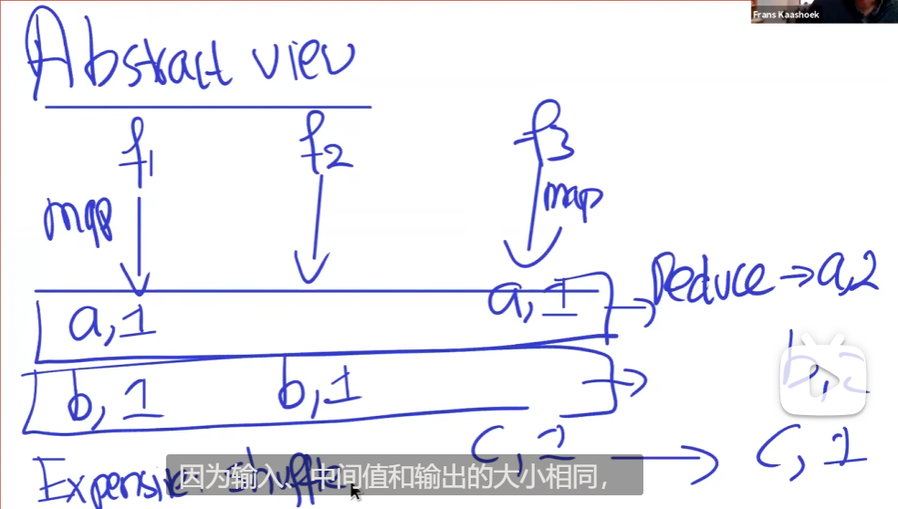

# mapreduce

## 1. 概述


MapReduce是一个分布式、并行处理的计算框架。

用户可以指定一个map函数用于处理key/value键值对，从而生成一个中间key/value键值对集合，同时可以指定一个reduce函数用于merge相同中间键的所有值；

**系统主要关注**：数据分区、集群作业调度、容错处理以及集群内的通信管理问题。

使用重新执行 re-execution 作为主要的容错机制。

## 2. programming model

整个mapreduce库将计算看成两二函数： map， reduce

Map函数：用户自定义，接受输入键值对并产生中间键值对的集合。然后将相同中间键的所有值发送给reduce函数；

reduce函数：也由用户定义，接受一个中间键和一系列对应的值。它将这些值融合以形成更小的值集合。

### 2.1 example



计算文档中每个词出现的次数；
```cpp
 map(String key, String value):
     // key: document name
     // value: document contents
     for each word w in value:
         EmitIntermediate(w, "1");
 ​
 reduce(String key, Iterator values):
     // key: a word
     // values: a list of counts
     int result = 0;
     for each v in values:
         result += ParseInt(v);
     Emit(AsString(result));
```

map构造<word,1>键值对，表征每个单词出现一次；reduce将相同的word的次数累加；

### Types

```cpp
 map    (k1,v1)         -> list(k2,v2)
 reduce (k2, list(v2))  -> list(v2)
```

## 3. implementation

一种在Google内部被广泛使用的实现方式：

1. 通常情况下, 计算机运行在 Linux环境中，每个机器有2核 x86 的处理器以及2~4GB 的内存；

2. 使用商业网络硬件设备。通常可以传输 1Gb/s 的数据，但是平均到每台计算机上的带宽相当少 ；

3. 一个集群由成百上千台计算机组成，因此其中一台计算机发生故障很常见；

4. 通过计算机各自的 IDE 硬盘提供存储空间。这些硬盘中的数据由一个内部开发的分布式文件系统进行管理，这个文件系统通过复制机制可以提供可用性和可靠性；

5. 用户提交 job 到调度系统中，每个 job 是由多个 task 组成，由调度器分发到集群中的可用机器； 

### 3.1 执行流程

当在多台机器上调用Map时，输入数据会被自动分成M份，因此数据能够被不同的机器并行处理。然后Map可以依据hash函数将不同key的数据映射到R份中间输出中，以供Reduce使用。


当调用MapReduce时：
1. 首先程序中的MapReduce库将输入文件分割成大小为16~64MB的多份切片，然后在集群上启动该程序的多份副本。

2. 其中一份程序副本作为 master，其余的作为 workers , 并由 master 分配任务。总共有 M 个 map tasks 以及R个 reduce tasks 需要被分配。master 会选取空闲的 worker 并分配给它们一个 map task 或者 reduce task；

3. 被分配map task 的 worker 会读取相应的输入内容。然后从输入数据中解析出 key/value 键值对，并将其作为用户定义的 map 函数输入。最后通过 map 函数产生的键值对会被缓存在内存中；

4. 这些缓存的键值对会周期性地写入本地磁盘， 并通过分区函数被划分到R个区域。 这些缓存的键值对在本地磁盘上的位置会被传递回 master ，而 master 会将这些位置信息转发给 reduce workers；

5. 当 reduce worker 接收到 master 的位置信息通知时，它会使用 rpc 从 map workers的本地磁盘 上读取缓存的数据。当一个 reduce worker 读取了所有的中间数据后，它会按照中间键进行排序，以便相同 key 的键值对可以在同个分组。由于很多不同的键值对会被传递到相同的reduce task，因此需要进行排序。如果中间数据太大的话，可以使用外部排序；

6. reduce worker 会对已经排序的中间数据进行迭代，当遇到到每个唯一的中间键时，它会传递 key 和 对应的中间值集合到用户的reduce函数中。reduce函数的输出结果会附加到这个 reduce 分区的最终输出文件中；

7. 当所有 map tasks 和 reduce tasks 都完成后，master 会唤醒用户程序。这时，用户程序中的 MapReduce 调用完成并返回到用户代码；

在成功完成后，MapReduce操作的输出是R个输出文件（一个reduce task生成一个文件，并且文件名由用户定义）。通常来讲，用户不必将这R个输出文件整合到一个文件中去，因为这些文件通常又会被其它MapReduce操作调用，或者被其它可以处理多分片文件的分布式程序使用。

### 3.2 Master Data Structures

master有很多数据结构，对于每个map task和reduce task而言，它存储了任务状态（空闲，正在进行中或者完成），以及任务对应的worker节点信息（针对非空闲任务）。

master将中间文件的位置信息从 map tasks 传递到 reduce tasks 。因此对于每个完成的 map task，master 都会存储R 个由 map task 产生的中间文件位置和大小。当map task 完成时，master 会收到位置和大小的更新信息，而这些消息会增量式地被推送给正在执行 reduce tasks的workers。


### 3.3  Fault Tolerance

由于MapReduce库需要用成千上百的机器帮助处理非常大的数据，因此必须要有一些策略容忍机器失效的情况。

#### 3.3.1 Worker Failure

master 会周期性地 ping worker 节点。如果在一定时间内没有收到来自worker 节点的响应，master 会标记这个 worker 节点已经失败。任何执行完成 的map tasks 都会被重置到初始的 idle 状态，此时这些 task 可以在其他 worker 上被再次调度。同样地，任何执行失败的 map tasks 或者 reduce tasks 也会被重置到 idle 状态，并且可以被重新调度。

当 map tasks 的输出存储的硬盘损坏时，已经完成的 map tasks 会被重新执行。已经完成的 reduce tasks 不需要重新执行，因为 reduce tasks 的输出会存储在全局的文件系统中。

当一个 map task 先在 worker A 上执行，然后由于A失败又在worker B 执行时，所有执行 reduce task 的 worker 都会被通知**重新执行**。任何一个还没有从 worker A 上读取数据的 reduce task 都会从 worker B上读取数据。

MapReduce 对于大规模的 worker 故障有恢复能力。例如，在一次MapReduce操作期间，由于网络维护，导致正在运行的集群中有80个机器在几分钟内无法访问。MapReduce master 服务器只是简单地重新执行了无法访问的机器所完成的工作，最终完成 MapReduce 操作。

#### 3.3.2 Master Failure

我们可以让 master 服务器定期将上述描述的数据结构写入检查点。如果 master 宕机，则可以从最后一个检查点状态进行恢复。但由于只有一个 master 服务器，因此发生故障的可能性不大。因此，如果 master 宕机，我们当前的实现将中止 MapReduce 计算。client 可以检查这种情况，并根据需要重试MapReduce 操作。

#### 3.3.3  Semantics in the Presence of Failures

当用户提供的 map 和 reduce算子是其输入值的确定性函数时，我们的分布式实现的输出与整个程序的无故障顺序执行的输出相同。

我们依靠 map 和 reduce task输出的原子性提交以达到这个性质。每个正在进行的 task 都将其输出写入到私有的临时文件中。 reduce task 产生一个这样的文件，map task 产生R个这样的文件（每个 reduce 任务一个）。当 map task 完成后，worker 会给 master 发消息，消息里包含 R 个临时文件的名称。如果 master 服务器已经收到相应map task 的完成消息，则它将忽略该消息。否则，它将在 master 的数据结构中记录 R 个文件的名称。

当 reduce 任务完成时，reduce worker会自动将其临时输出文件重命名为最终输出文件。如果在多台计算机上执行相同的reduce任务，则将对最终输出文件执行多个重命名调用。我们依靠 文件系统提供的原子重命名操作 来确保最终文件的系统状态仅包含执行一次reduce任务所产生的数据。

我们的 map 和 reduce 算子绝大多数是确定性的，在这种情况下我们的语义等同于顺序执行，因此用户很容易理解程序的行为。当 map 或 reduce 算子不确定时，我们提供较弱但仍然合理的语义。在存在不确定性算子的情况下，特定的 reduce task R1的输出等同于不确定性程序顺序执行产生的的输出。然而，一个不同的reduce task R2的输出可以对应于由不确定性程序的不同顺序执行所产生的输出。

考虑 map task M 和 reduce task R1和R2。令e(Ri)为已提交的Ri的执行（恰好有一次这样的执行）。之所以出现较弱的语义，是因为e（R1）可能已经读取了一次执行M所产生的输出，而e（R2）可能读取了M不同执行所产生的输出。

### 3.4 Locality

在我们的计算环境中，网络带宽是相对稀缺的资源。我们将输入数据存储在组成集群的机器本地磁盘上，从而节省了网络带宽。GFS将每个文件划分为64 MB的块，并将每个块的多个副本（通常为3个副本）存储在不同的机器上。MapReduce master 接收输入文件的位置信息，并尝试在存储输入数据副本的机器上调度一个 map task。如果失败，它将尝试在存储该任务输入数据的副本节点附近调度 map task （例如，在与存储数据的机器位于同一网络交换机的机器 ）。在集群中运行MapReduce操作时，大多数输入数据都是在本地读取的，不占用网络带宽。

### 3.5 Task Granularity

我们将 map 阶段划分为 M 个子阶段，将 reduce 阶段划分为R个子阶段。理想情况下，M和R应该比worker机器的数量大得多。让每个 worker 执行许多不同的任务以改善动态负载均衡，并且还可以在 worker 发生故障时加快恢复速度：许多完成的 map 任务可以传播到所有其他 worker 机器上。

由于 master 必须制定O(M + R)的调度决策并将O(M ∗ R)的状态保持在内存中，因此在我们的实现中，对 M 和 R 会有一定的限制。（虽然有O(M ∗ R)个任务对的状态块，但是每个 map 任务/ reduce 任务对大约包含一个字节的数据。)

此外，R 通常受用户约束，因为每个reduce任务的输出最终都存储在单独的输出文件中。在实践中，我们倾向于选择M，以便每个单独的map任务大约是16 MB到64 MB的输入数据（这样上述的局部优化是最有效的），并且我们将R设置为我们期望使用的worker机器数量乘以一个小小的放大因子。我们经常使用2000个 worker 机器执行M = 200000和 R = 5000的MapReduce计算。


### 3.6 Backup Tasks

MapReduce 操作总时间拖延的常见原因之一是“拖尾”现象：一台机器花费异常长的时间来完成最后几个 map 或者 reduce 任务。拖尾之所以出现，可能是由于多种原因。例如，磁盘损坏的机器可能会经常遇到可纠正的错误，从而将其读取性能从30 MB/s降低到1 MB/s。集群调度系统可能在机器上调度了其他任务，由于竞争CPU、内存、本地磁盘或网络带宽，导致其执行MapReduce代码的速度较慢。我们最近遇到的一个问题是机器初始化代码中的一个错误，该错误导致了处理器缓存被禁用：受影响机器上的计算速度降低了一百倍。

我们有一个通用的机制来**减轻拖尾的影响**。当MapReduce操作接近完成时，主服务器会调度其余正在进行的任务进行备份执行。每当主执行或备份执行完成时，该任务就会标记为已完成。我们已经对该机制进行了调整，以使该操作使用的计算资源增加不超过百分之几。我们发现这大大减少了完成大型MapReduce操作的时间。


## 4. Refinements

尽管map、reduce提供的基础功能已经能够满足大部分需求了，但是我们还发现了一些有用的扩展。

### 4.1 Partitioning Function

MapReduce 的用户指定他们想要的 reduce tasks /输出文件的数量 (R)。通过对中间键按照分区函数分区，可以将数据分配给这些任务。MapReduce 提供了默认的分区函数 hash(key) mod R ，这往往会使得分区相当均衡。但是，在某些情况下，通过其他方式对数据进行分区也很有用。例如，有时输出键是URL，而我们希望单个主机的所有条目都以同一输出文件结尾。为了支持这种情况，MapReduce库的用户可以提供特殊的分区功能。例如，使用 hash( Hostname(urlkey) ) mod R 作为分区函数可以使来自同一主机的所有URL最终都位于同一输出文件中。


### 4.2 Ordering Guarantees

我们保证在给定的分区内，中间键值对以递增的键顺序进行处理。这种排序保证每个分区能够更容易地生成排序后的输出文件，当输出文件格式需要支持通过键进行有效的随机访问查找，或者用户发现排序数据更方便时，这很有用。


### 4.3 Combiner Function

在某些情况下，每个map task产生的中间键有大量重复，并且用户指定的 reduce函数是可交换的和关联的。一个很好的例子是2.1节中的单词计数例子。由于单词频率倾向于遵循Zipf分布，因此每个 map task 都会产生成百上千的<the, 1>形式的记录。所有这些记录将通过网络发送给单个reduce任务，然后通过reduce函数累加以产生一个值。我们允许用户指定一个可选的Combiner函数，该函数在通过网络发送数据之前进行部分合并。

在执行 map task 的每台计算机上执行合并函数combiner的功能。通常，使用相同的代码来实现合combiner函数和reduce函数。 reduce函数和combiner函数之间的唯一区别是MapReduce库如何处理函数的输出。 reduce函数的输出将写入最终的输出文件，而combiner函数的输出将写入到一个中间文件中，该文件将被发送给reduce任务。

部分组合可显著加快某些 MapReduce 操作的速度。

### 4.4 Input and Output Types

MapReduce库支持以多种格式读取输入数据。text 格式的输入将每行作为键值对：键是文件中的偏移量，值是该行的内容。用户可以通过提供 reader 接口实现来添加新的输入类型，尽管大多数用户只使用少数几种预定义的输入类型。

reader 并不一定从文件中读取数据。举个例子，我们可以很容易地定义一个 reader 从数据库或者内存的数据结构中读取记录。

同样地，我们支持一系列的输出类型，用于生成不同格式的数据，并且用户代码也很容易添加对新输出类型的支持。

### 4.5 Side-effects

在某些情况下，MapReduce的用户发现可以方便地从 map 或 reduce 操作中生成辅助文件作为附加输出。我们依靠应用程序编写者来使这种 side-effects 具备原子性和幂等性。通常，应用程序将写入一个临时文件，并在文件完全生成后以原子方式重命名该文件。

我们不支持单个任务生成的多个输出文件对应的原子两阶段提交。因此，具有跨文件一致性要求的产生多个输出文件的任务应该是确定的。这种限制在实践中从来都不是问题。

### 4.6 Skipping Bad Records

有时，用户代码中的错误会导致 map或 reduce函数在某些记录上崩溃。这些 bugs 使得 MapReduce 操作无法完成。通常的做法就是去修复这个 bug，但这在有时候并不可行。比如这个 bug 来自于某个不可用的第三方库中。同样，有时可以忽略一些记录，例如在对大型数据集进行统计分析时。我们提供了一种可选的执行方式，MapReduce 库会检测哪些记录确定导致崩溃，并跳过这些记录继续执行下去。

每个 worker 进程都安装了一个信号处理器，可以捕获段错误和总线错误。在调用用户的 map或reduce 操作之前，MapReduce 库会存储参数的序列号到全局变量中。如果用户代码产生了一个信号，这个信号处理器会发送一个 "last gasp" (注: 类似于遗言) 的 UDP 包给 master，这个包中包含了序列号。当 master 发现一个记录出现超过1次的异常，它指示在下一次重新执行相应的Map或Reduce任务时，应跳过该记录。

### 4.7 Local Execution

Map或Reduce函数中的调试问题可能非常棘手，因为实际的计算发生在数千台机器上。由 master 动态分配任务的分布式系统中，为了更加方便的 debug，profiling以及小范围的测试，我们开发了一个MapReduce 库的替代版本， 它可以在本地机器上顺序执行 MapReduce 操作。用户可以限定在特定的 map task 上控制这些计算。用户通过一个特殊标志调用程序，就可以轻松地使用他们认为有用的任何调试或测试工具（例如gdb）。

### 4.8 Status Information

master运行在一个内部HTTP服务器，并提供了一些状态页面供人们使用。状态页面上展现了计算的进度，比如多少 tasks 已经完成，多少 tasks 正在进行中 in-process， 输入的字节数是多少，中间数据的字节数是多少，输出的字节数是多少以及处理的速率等。这个页面也包含了每个 task 生成的标准 error/info 输出文件的链接。用户可以使用这些信息来预测多少时间内能够完成计算，是否需要添加更多的资源到计算中。这些页面还可用于确定为什么实际计算时间比预期慢得多。

此外，顶层状态页面还会显示执行失败的 workers以及当 worker 宕机时，正在该worker上执行的 map/reduce 任务。在尝试诊断代码中的错误时，这些信息非常有用。

### 4.9 Counters
MapReduce库提供了一种计数器功能，可以对各种事件的发生进行计数。例如，用户代码可能想要计算处理的单词总数或索引的德语文档的数量，等等。

要使用此功能，用户代码将创建一个命名计数器对象，然后在map/reduce函数中适当地增加计数器。例如：

```CPP
 Counter* uppercase;
 uppercase = GetCounter("uppercase");
 map(String name, String contents):
     for each word w in contents:
         if (IsCapitalized(w)):
             uppercase->Increment();
         EmitIntermediate(w, "1");
```

来自各个worker机器的计数器值会定期发送到master（包含在ping响应上）。master 服务器从执行成功的 map 和 reduce 任务中聚合计数器值，并在MapReduce操作完成时将其返回给用户代码。当前计数器值也显示在 master 状态页面上，以便人们可以观看实时计算的进度。汇总计数器值时，master 服务器消除了重复执行同一 map 或 reduce 任务的情况以避免重复计数的影响。 （重复执行可能是由于我们使用备份任务以及由于失败而重新执行任务引起的。）

MapReduce库自动维护一些计数器值，例如处理的输入键值对的数量和产生的输出键值对的数量。

用户发现计数器功能对于MapReduce操作行为的完整性检查很有用。例如，在某些MapReduce操作中，用户代码可能想要确保生成的输出对的数量完全等于已处理的输入对的数量，或者要确保所处理的德语文档的比例在文档总数的某个可容忍的比例之内。

## 5. Conclusions

Google已成功地将MapReduce编程模型用于许多不同目的。我们将此成功归因于几个原因。首先，该模型易于使用，即使对于没有并行和分布式系统经验的程序员来说也是如此，因为该模型隐藏了并行化、容错、局部性优化以及负载平衡的细节。其次，各种各样的问题都可以很容易地表达为MapReduce计算。例如，MapReduce用于为Google的生产网络搜索服务生成数据，进行分类，进行数据挖掘，用于机器学习以及许多其他系统。第三，我们开发了MapReduce的实现，该实现可扩展到包含数千台机器的大型集群。该实现有效地利用了这些机器资源，因此适合用于Google遇到的许多大型计算问题。

我们从这项工作中学到了一些东西。首先，限制编程模型可以使并行计算和分布式计算变得容易，并使此类计算具有容错性。其次，网络带宽是一种稀缺资源。因此，我们系统中的许多优化旨在减少通过网络发送的数据量：位置优化使我们能够从本地磁盘读取数据，并将中间数据的单个副本写入本地磁盘可以节省网络带宽。第三，可以使用冗余执行来减少运行缓慢的计算机的影响，并处理计算机故障和数据丢失。


