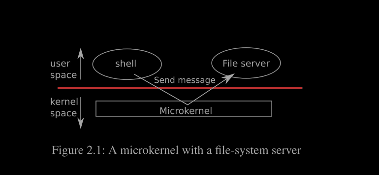
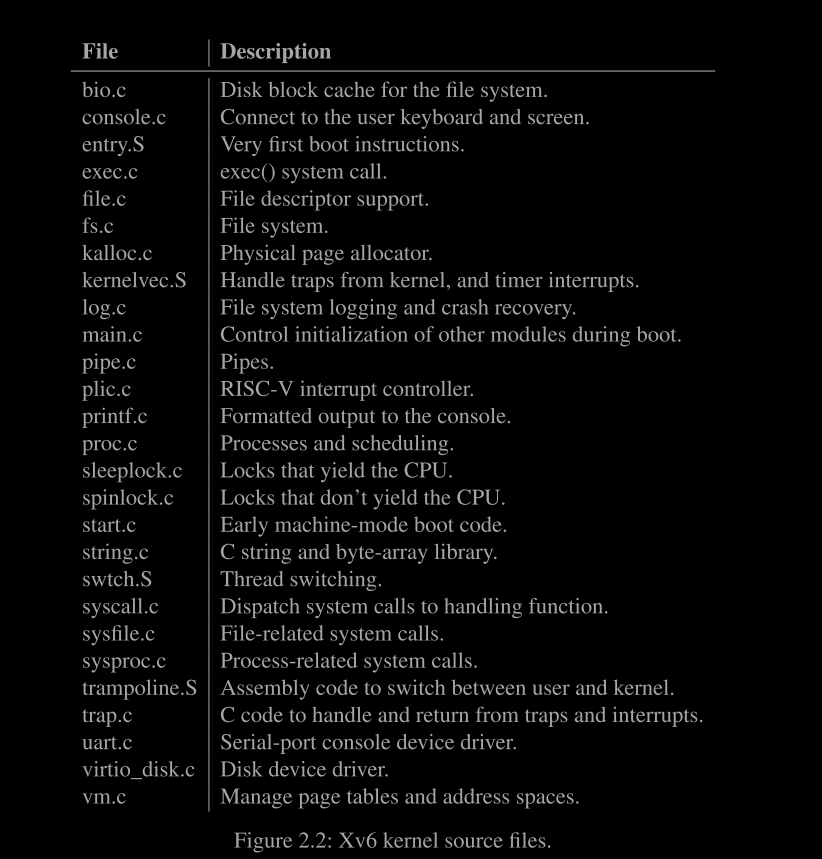
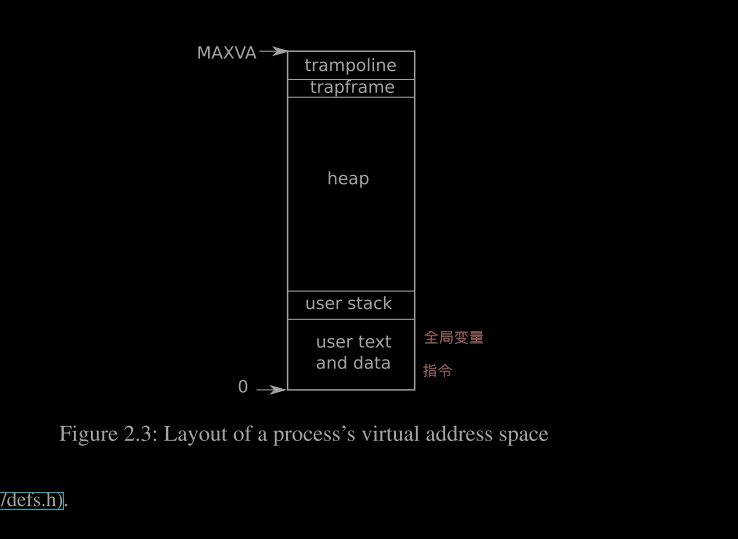

# 第2章 操作系统组织

操作系统的一个关键要求是支持多个活动同时进行。例如，使用第1章描述的系统调用接口，一个进程可以使用 `fork` 启动新进程。操作系统必须在这些进程之间共享计算机的资源。例如，即使进程数量超过硬件CPU的数量，操作系统也必须确保所有进程都有机会执行。操作系统还必须安排进程之间的隔离。也就是说，如果一个进程有错误并发生故障，它不应该影响不依赖于该错误进程的其他进程。然而，完全隔离过于严格，因为进程应该能够有意地相互作用；管道就是一个例子。因此，操作系统必须**满足三个要求：多路复用、隔离和交互。**

本章概述了操作系统如何组织以**实现这三个要求**。尽管有许多方法可以实现这一点，但本文重点介绍以单内核为中心的主流设计，许多 Unix 操作系统都采用了这种方法。本章还概述了 xv6 进程，这是 xv6 中的**隔离单元**，以及 xv6 启动时第一个进程的创建。

xv6 运行在一个多核 RISC-V 微处理器上，其大部分低级功能（例如，进程实现）特定于 RISC-V。RISC-V 是一个 64 位 CPU，xv6 使用“LP64”C 语言编写，这意味着 C 语言中的长整型（long）和指针（pointer）是 64 位，而整型（int）是 32 位。本书假定读者已经在某种架构上进行过一些机器级编程，并将在需要时介绍 RISC-V 特定的概念。RISC-V 的有用参考文献是《The RISC-V Reader: An Open Architecture Atlas》[13]。用户级指令集架构 [2] 和特权架构 [1] 是官方规范。

完整的计算机中的 CPU 周围有许多支持硬件，其中许多是以 I/O 接口的形式存在的。xv6 是为 qemu 的“-machine virt”选项模拟的支持硬件编写的。这包括 RAM、包含引导代码的 ROM、连接用户键盘/屏幕的串行连接以及用于存储的磁盘。

#### 2.1 抽象物理资源

遇到操作系统时，一个可能的问题是为什么需要它？也就是说，可以将图1.2中的系统调用实现为一个库，应用程序可以链接这个库。按照这个方案，每个应用程序甚至可以有自己的库，根据需要定制。应用程序可以直接与硬件资源交互，并以最适合应用程序的方式使用这些资源（例如，以实现高性能或可预测性能）。一些嵌入式设备或实时系统就是这样组织的。

这种库方法的缺点是，如果有多个应用程序运行，这些应用程序必须表现良好。例如，每个应用程序必须定期释放 CPU，以便其他应用程序可以运行。这种合作的时间共享方案在所有应用程序互相信任且没有错误的情况下可能是可行的。然而，应用程序通常互不信任，并且会有错误，因此通常需要比合作方案**更强的隔离**。

为了实现强隔离，禁止应用程序直接访问敏感的硬件资源，而是将这些资源抽象成服务是有帮助的。例如，Unix 应用程序仅通过文件系统的 `open`、`read`、`write` 和 `close` 系统调用来与存储交互，而不是直接读写磁盘。这为应用程序提供了路径名的便利，并允许操作系统（作为接口的实现者）管理磁盘。即使隔离不是问题，有意相互作用（或只是希望互不影响）的程序也可能发现文件系统比直接使用磁盘更方便。

类似地，Unix 透明地在进程之间切换硬件 CPU，**在必要时保存和恢复寄存器状态**，使应用程序不必意识到时间共享。这种透明性使得操作系统即使在某些应用程序陷入无限循环的情况下也能共享 CPU。

另一个例子是，Unix 进程使用 `exec` 构建其内存映像，而不是直接与物理内存交互。这允许操作系统决定将进程放置在内存中的位置；如果内存紧张，操作系统甚至可以将进程的部分数据存储在磁盘上。`exec` 还为用户提供了一个文件系统来存储可执行程序映像。许多形式的 Unix 进程间的交互都是通过文件描述符进行的。文件描述符不仅抽象了许多细节（例如，管道或文件中的数据存储在哪里），而且定义方式简化了交互。例如，如果管道中的一个应用程序失败，内核会为管道中的下一个进程生成一个文件结束信号。

图1.2中的系统调用接口经过精心设计，既提供了程序员的便利，又提供了强隔离的可能性。Unix 接口并不是抽象资源的唯一方式，但它已被证明是非常好的。

#### 2.2 用户模式、超级用户模式和系统调用

强隔离要求应用程序和操作系统之间有一个硬边界。如果应用程序出错，我们不希望操作系统或其它应用程序失败。相反，操作系统应能清理失败的应用程序并继续运行其他应用程序。为了实现强隔离，**操作系统必须确保应用程序不能修改（甚至不能读取）操作系统的数据结构和指令，并且不能访问其他进程的内存。**

CPU 提供了硬件支持以实现强隔离。例如，RISC-V 有三种模式：机器模式、超级用户模式和用户模式。机器模式下的指令具有完全权限；CPU 启动时处于机器模式。机器模式主要用于配置计算机。xv6 在机器模式下执行几行代码，然后切换到超级用户模式。

在超级用户模式下，CPU 可以执行特权指令，例如启用和禁用中断、读写页表地址寄存器等。如果用户模式下的应用程序尝试执行特权指令，CPU 不会执行该指令，而是切换到超级用户模式，让超级用户模式下的代码终止应用程序，因为它做了不该做的事情。第1章中的图1.1说明了这种组织方式。应用程序只能执行用户模式下的指令（例如，加法等），被称为运行在**用户空间**；而超级用户模式下的软件也可以执行特权指令，被称为运行在内核空间。运行在内核空间（或超级用户模式）下的软件称为**内核**。

想要调用内核函数（例如，xv6 中的 `read` 系统调用）的应用程序必须转换到内核；应用程序不能直接调用内核函数。CPU 提供了一条特殊指令，将 CPU 从用户模式切换到超级用户模式，并在内核指定的入口点进入内核。（RISC-V 提供了 `ecall` 指令用于此目的。）一旦 CPU 切换到超级用户模式，内核就可以验证系统调用的参数（例如，检查传递给系统调用的地址是否属于应用程序的内存），决定应用程序是否有权执行请求的操作（例如，检查应用程序是否有权写入指定的文件），然后拒绝或执行该操作。重要的是内核控制从用户模式切换到超级用户模式的入口点；如果应用程序可以决定内核的入口点，恶意应用程序可能会在跳过参数验证的地方进入内核。

#### 2.3 内核组织

一个关键的设计问题是操作系统中哪部分应该在超级用户模式下运行。一种可能性是整个操作系统驻留在内核中，因此所有系统调用的实现都在超级用户模式下运行。这种组织方式被称为整体式内核。

在这种组织中，整个操作系统以完全的硬件特权运行。这种方式的优点在于，操作系统设计者不需要决定操作系统中哪部分不需要完全的硬件特权。此外，操作系统不同部分之间的协作也更容易。例如，操作系统可能有一个缓冲区缓存，既可以被文件系统也可以被虚拟内存系统共享。

整体式内核的一个缺点是，操作系统各部分之间的接口往往很复杂（如本文其余部分所述），因此操作系统开发人员容易犯错。在整体式内核中，错误可能是致命的，因为超级用户模式下的错误通常会导致内核失败。如果内核失败，计算机将停止工作，从而所有应用程序也会失败。计算机必须重启才能再次启动。

为了减少内核中的错误风险，操作系统设计者可以最小化在超级用户模式下运行的操作系统代码量，并将大部分操作系统代码在用户模式下执行。这种内核组织方式称为微内核。

图2.1展示了这种微内核设计。在图中，文件系统作为一个用户级进程运行。作为进程运行的操作系统服务称为服务器。为了使应用程序能够与文件服务器交互，内核提供了一种**进程间通信机制**，可以从一个用户模式进程向另一个用户模式进程发送消息。例如，如果像 shell 这样的应用程序想要读取或写入文件，它会向文件服务器发送一条消息并等待响应。在微内核中，内核接口由一些底层函数组成，用于启动应用程序、发送消息、访问设备硬件等。这种组织方式使得内核相对简单，因为操作系统的大部分都驻留在用户级服务器中。

在现实中，整体式内核和微内核都很受欢迎。许多 Unix 内核都是整体式的。例如，Linux 拥有一个整体式内核，尽管一些操作系统功能作为用户级服务器运行（例如窗口系统）。Linux 向操作系统密集型应用提供了高性能，部分原因是内核的各个子系统可以紧密集成。

像 Minix、L4 和 QNX 这样的操作系统则是以微内核加服务器的形式组织的，并在嵌入式环境中得到了广泛应用。L4 的一个变种 seL4 足够小，以至于已经被验证具有内存安全性和其他安全属性 [7]。操作系统开发者们对哪种组织方式更好存在很多争论，但没有确凿的证据表明某一方更优。

此外，“更好”的含义取决于不同的标准：更快的性能、更小的代码量、内核的可靠性、整个操作系统的可靠性（包括用户级服务）等。还有实际考虑因素可能比组织方式的问题更重要。有些操作系统虽然采用微内核，但为了性能原因在内核空间中运行一些用户级服务。有些操作系统由于起步时就是整体式内核，因此转向纯微内核组织的动力不大，因为添加新特性可能比重新设计现有操作系统以适应微内核设计更为重要。

从本书的角度来看，微内核和整体式操作系统共享许多核心理念。它们实现系统调用、使用页表、处理中断、支持进程、使用锁进行并发控制、实现文件系统等。本书关注这些核心理念。

Xv6 被实现为一个整体式内核，就像大多数 Unix 操作系统一样。因此，Xv6 的内核接口对应于操作系统接口，内核实现了完整操作系统。由于 Xv6 提供的服务不多，其内核比一些微内核要小，但从概念上讲，Xv6 是整体式的。

### 2.4 代码：xv6 组织

xv6 内核的源代码位于 `kernel/` 子目录中。源代码按照模块化的大致概念划分为多个文件；图2.2列出了这些文件。模块之间的接口在 `defs.h`（`kernel/defs.h`）中定义。

### 2.5 进程概览

在 xv6 中（与其他 Unix 操作系统一样），**进程是隔离的基本单位**。进程抽象防止一个进程破坏或窥探另一个进程的内存、CPU、文件描述符等。它还防止进程破坏内核本身，从而使进程无法破坏内核的隔离机制。内核必须仔细实现进程抽象，因为有缺陷或恶意的应用程序可能会诱骗内核或硬件做坏事（例如，绕过隔离）。内核用于实现进程的机制包括用户/超级用户模式标志、地址空间和线程的时间片轮转。

为了加强隔离，进程抽象向程序提供了一台私有机器的幻觉。进程为程序提供了一个看似私有的内存系统或地址空间，其他进程无法读取或写入。进程还为程序提供了一个看似私有的 CPU 来执行程序的指令。xv6 使用由硬件实现的页表来为每个进程提供独立的地址空间。RISC-V 页表将虚拟地址（RISC-V 指令操作的地址）转换为物理地址（CPU 芯片发送到主存的地址）。xv6 为每个进程维护一个单独的页表，定义该进程的地址空间。

如图2.3所示，地址空间包括从虚拟地址零开始的进程用户内存。指令首先出现，其次是全局变量，然后是栈，最后是一个“堆”区域（用于 `malloc`），进程可以根据需要扩展。有几个因素限制了进程地址空间的最大大小：RISC-V 上的指针是 64 位宽；硬件在查找**页表中的虚拟地址时只使用低 39 位**；xv6 只使用这 39 位中的 38 位。因此，最大地址是 \(2^{38} - 1 = 0x3fffffffff\)，即 `MAXVA`（`kernel/riscv.h:363`）。

在地址空间的顶部，xv6 保留了**一个页面用于跳板（trampoline）**和**一个页面用于映射进程的陷阱帧（trapframe）**。xv6 使用这两个页面在**内核和用户空间之间进行切换**；跳板页面包含进入和退出内核的代码，映射陷阱帧是必要的，以便保存和恢复用户进程的状态，我们将在第4章中详细解释。

xv6 内核为每个进程维护许多状态信息，这些信息被收集到一个 `struct proc` 结构中（`kernel/proc.h:86`）。进程最重要的内核状态包括其页表、内核栈和运行状态。我们将使用 `p->xxx` 的记号来引用 `proc` 结构的元素；例如，`p->pagetable` 是指向进程页表的指针。

每个进程都有一个执行线程（简称线程），该**线程执行进程的指令**。线程可以被挂起，稍后再恢复。为了在进程之间透明地切换，内核会挂起当前正在运行的线程并恢复另一个进程的线程。线程的大部分状态（局部变量、函数调用返回地址）存储在线程的栈上。每个**进程有两个栈：用户栈和内核栈**（`p->kstack`）。当进程执行用户指令时，只有用户栈在使用，内核栈为空。当进程进入内核（用于系统调用或中断）时，内核代码在进程的内核栈上执行；当进程在内核中时，用户栈仍然包含保存的数据，但不主动使用。进程的线程在主动使用用户栈和内核栈之间交替。

内核栈是独立的（并且受用户代码保护），因此即使进程破坏了用户栈，内核仍然可以执行。进程可以通过执行 RISC-V 的 `ecall` 指令来发起系统调用。该指令提升硬件特权级别并将程序计数器更改为内核定义的入口点。入口点处的代码切换到内核栈并执行实现系统调用的内核指令。当系统调用完成时，内核切换回用户栈并通过调用 `sret` 指令返回用户空间，该指令降低硬件特权级别并恢复在系统调用指令之后执行用户指令。进程的线程可以在内核中“阻塞”以等待 I/O，并在 I/O 完成后从停止的地方恢复。

`p->state` 表示进程是否已分配、准备好运行、正在运行、等待 I/O 或退出。`p->pagetable` 持有进程的页表，格式为 RISC-V 硬件期望的格式。xv6 使分页硬件在用户空间执行进程时使用进程的 `p->pagetable`。进程的页表还记录了分配用于存储进程内存的物理页面的地址。

总之，进程捆绑了两个设计思想：**地址空间**，为进程提供私有内存的幻觉；**线程**，为进程提供私有 CPU 的幻觉。在 xv6 中，一个进程由一个地址空间和一个线程组成。在实际操作系统中，一个进程可能有多个线程以利用多个 CPU。

进程是对一个cpu的抽象，应用不是直接和cpu进行交互的，而是通过进程进行交互。假如有8个应用程序而只有4个内核，那么操作系统就会时分复用这些cpu核，根据时间切片，比如说一个cpu运行100ms，之后内核会停止运行并将哪个进程从cpu中卸载，再加载另一个应用程序并运行100ms，这种方式使得每一个应用程序都不会连续运行超过100ms。
### 2.6 代码：启动 xv6、第一个进程和系统调用

为了让 xv6 更具体一些，我们将概述内核如何启动并运行第一个进程。后续章节将更详细地描述本概述中提到的机制。

当 RISC-V 计算机开机时，它会初始化自身并运行存储在只读内存中的引导加载程序。引导加载程序将 xv6 内核加载到内存中。然后，在机器模式下，CPU 从 `_entry`（`kernel/entry.S:7`）开始执行 xv6。RISC-V 开始时禁用了分页硬件：虚拟地址直接映射到物理地址。

加载器将 xv6 内核加载到物理地址 `0x80000000` 处。选择将内核放置在 `0x80000000` 而不是 `0x0` 的原因是地址范围 `0x0:0x80000000` 包含 I/O 设备。

`_entry` 处的指令设置了一个栈，以便 xv6 可以运行 C 代码。xv6 在 `start.c` 文件中声明了一个初始栈 `stack0`（`kernel/start.c:11`）。`_entry` 处的代码将栈指针寄存器 `sp` 加载为 `stack0+4096`，即栈顶，因为 RISC-V 上的栈是从高地址向低地址增长的。

现在内核有了栈，`_entry` 就调用 C 代码中的 `start` 函数（`kernel/start.c:21`）。`start` 函数执行一些仅允许在机器模式下进行的配置，然后切换到超级用户模式。为了进入超级用户模式，RISC-V 提供了 `mret` 指令。这个指令通常用于从超级用户模式返回机器模式。`start` 并不是从这样的调用中返回，而是像之前有过这样的调用一样设置环境：它将前一个特权模式设置为超级用户模式，通过将 `main` 的地址写入寄存器 `mepc` 来设置返回地址，通过将 `0` 写入页表寄存器 `satp` 来禁用超级用户模式下的虚拟地址转换，并将所有中断和异常委托给超级用户模式。在跳转到超级用户模式之前，`start` 还执行了一个任务：编程时钟芯片以生成定时器中断。

完成了这些初始化工作后，`start` 通过调用 `mret` 返回到超级用户模式。这使得程序计数器变为 `main`（`kernel/main.c:11`）。`main`（`kernel/main.c:11`）初始化了几个设备和子系统后，通过调用 `userinit`（`kernel/proc.c:226`）创建了第一个进程。

第一个进程执行了一个用 RISC-V 汇编语言编写的小程序，发起了 xv6 中的第一个系统调用。`initcode.S`（`user/initcode.S:3`）将 `exec` 系统调用的编号 `SYS_EXEC`（`kernel/syscall.h:8`）加载到寄存器 `a7` 中，然后调用 `ecall` 重新进入内核。

内核在 `syscall`（`kernel/syscall.c:133`）中使用寄存器 `a7` 中的编号来调用所需的系统调用。系统调用表（`kernel/syscall.c:108`）将 `SYS_EXEC` 映射到 `sys_exec`，这是内核调用的函数。正如我们在第一章中所见，`exec` 用一个新的程序替换了当前进程的内存和寄存器（在这种情况下是 `/init`）。一旦内核完成了 `exec`，它就会返回到用户空间中的 `/init` 进程。`Init`（`user/init.c:15`）根据需要创建一个新的控制台设备文件，然后将其作为文件描述符 `0`、`1` 和 `2` 打开。然后它在控制台上启动一个 shell。系统已经启动。

操作系统必须假设进程的用户级代码会尽力破坏内核或其他进程。用户代码可能会尝试解引用超出其允许地址空间的指针；它可能试图执行任何 RISC-V 指令，甚至是不打算供用户代码使用的指令；它可能试图读取和写入任何 RISC-V 控制寄存器；它可能试图直接访问设备硬件；并且它可能传递巧妙的值给系统调用，试图诱使内核崩溃或做出愚蠢的行为。

内核的目标是限制每个用户进程，使其只能读取/写入/执行自己的用户内存，使用 32 个通用 RISC-V 寄存器，并以系统调用旨在允许的方式影响内核和其他进程。内核必须阻止任何其他行为。这通常是内核设计中的绝对要求。对于内核自身的代码，期望则完全不同。假定内核代码是由善意且谨慎的程序员编写的。期望内核代码是无错误的，当然也不包含任何恶意内容。这一假设影响了我们分析内核代码的方式。例如，有许多内部内核函数（如自旋锁）如果内核代码使用不当会导致严重的问题。当我们检查任何特定部分的内核代码时，我们需要说服自己它是正确的。然而，我们假设总体上的内核代码是正确编写的，并遵循所有关于使用内核自身功能和数据结构的规则。

在硬件层面，假定 RISC-V CPU、RAM、磁盘等按照文档所述的方式运行，没有硬件错误。当然，在现实生活中事情并不那么简单。防止聪明的用户代码通过消耗内核保护的资源——磁盘空间、CPU 时间、进程表槽位等——使系统无法使用（或导致其崩溃）是非常困难的。通常不可能编写无错误的代码或设计无错误的硬件；如果恶意用户代码的编写者知道内核或硬件中的错误，他们将会加以利用。值得在内核中设计防护措施来应对可能存在错误的情况：断言、类型检查、栈保护页等。最后，用户和内核代码之间的区别有时会变得模糊：某些特权用户级进程可能提供基本服务，实际上成为操作系统的一部分，而在某些操作系统中，特权用户代码可以将新代码插入内核（如 Linux 的可加载内核模块）。

### 2.8 现实世界

大多数操作系统都采用了进程的概念，大多数进程与 xv6 的类似。然而，现代操作系统支持在一个进程中运行多个线程，以允许单个进程利用多个 CPU。支持进程内的多线程涉及相当多的机制，这是 xv6 不具备的，包括潜在的接口更改（例如，Linux 的 `clone`，即 `fork` 的变体），以控制线程共享进程的哪些方面。

