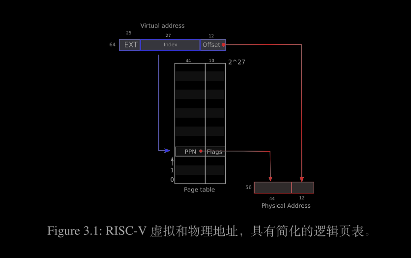
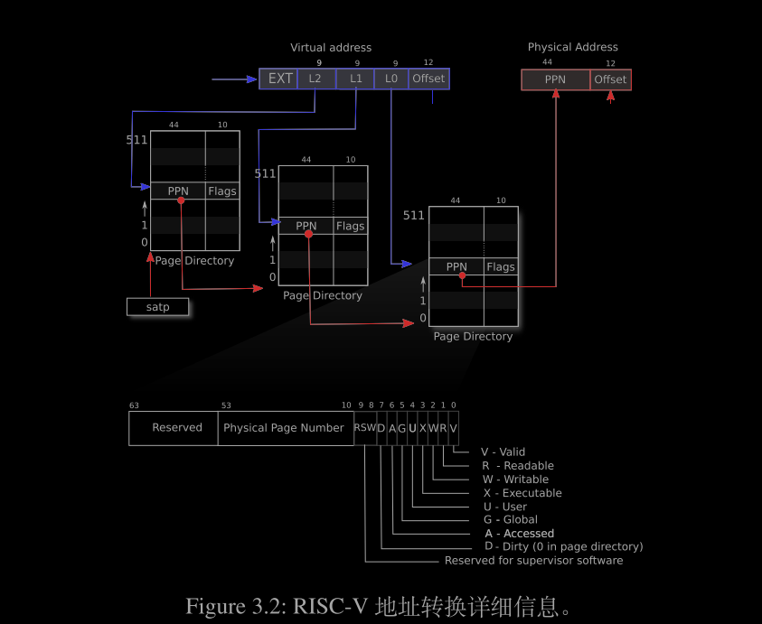
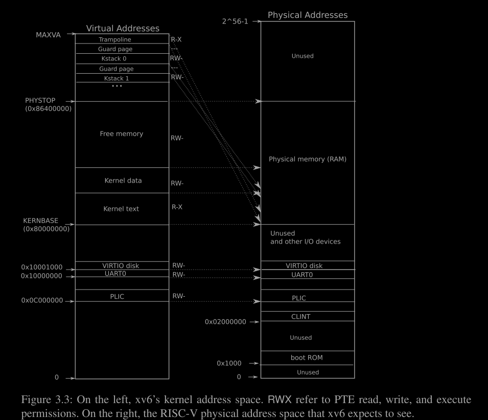
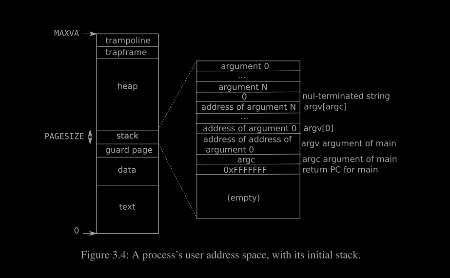

### 第三章 页表

页表是最流行的机制之一，通过这种方式，操作系统为每个进程提供独立的地址空间和内存。页表决定了内存地址的意义，以及哪些部分的物理内存可以访问。它们使 xv6 能够**隔离不同的进程地址空间**，并将它们复用到单一的物理内存上。页表之所以流行，是因为它们提供了一层间接性，使操作系统能够执行许多巧妙的操作。xv6 执行了一些这样的操作：在多个地址空间中映射相同的内存（一个跳板页），并通过一个未映射的页来保护内核和用户栈。本章剩余部分解释了 RISC-V 硬件提供的页表以及 xv6 如何使用它们。

#### 3.1 分页硬件

作为提醒，RISC-V 指令（无论是用户模式还是内核模式）都操作虚拟地址。机器的 RAM，或物理内存，由物理地址索引。RISC-V 页表硬件通过将每个虚拟地址映射到物理地址来连接这两种地址。

xv6 运行在 Sv39 RISC-V 上，这意味着只有 64 位虚拟地址的底部 39 位被使用；顶部 25 位未被使用。在这种 Sv39 配置中，RISC-V 页表逻辑上是一个包含 \(2^{27}\)（134,217,728）个页表项（PTEs）的数组。每个 PTE 包含一个 44 位的物理页号（PPN）和一些标志位。分页硬件通过使用 39 位中的顶部 27 位索引到页表中找到一个 PTE，并生成一个 56 位的物理地址，其中顶部 44 位来自 PTE 中的 PPN，底部 12 位从原始虚拟地址复制而来。图 3.1 以简单的 PTE 数组形式展示了这个过程的逻辑视图（见图 3.2 获取更完整的说明）。页表使操作系统能够在对齐的 4096 字节（\(2^{12}\) 字节）块粒度上控制虚拟地址到物理地址的转换。这样的一个块称为一页。

在 Sv39 RISC-V 中，虚拟地址的顶部 25 位不用于转换。物理地址也有扩展的空间：PTE 格式中有空间允许物理页号再增长 10 位。RISC-V 的设计者根据技术预测选择了这些数字。\(2^{39}\) 字节是 512 GB，这对于在 RISC-V 计算机上运行的应用程序来说应该足够了。256 GB 对未来的物理内存空间来说也足够容纳许多 I/O 设备和 DRAM 芯片。如果需要更多空间，RISC-V 设计者已经定义了 Sv48，支持 48 位的虚拟地址 [1]。


如图 3.2 所示，RISC-V CPU 将虚拟地址转换为物理地址分为三个步骤。

页表存储在物理内存中，表现为一个三层树结构。树的根是一个 4096 字节的页表页，包含 512 个 PTE，这些 PTE 包含下一层树中页表页的物理地址。每个这些页又包含 512 个 PTE，对应树的最后一层。分页硬件使用 27 位中的顶部 9 位选择根页表页中的一个 PTE，中间 9 位选择下一层页表页中的一个 PTE，底部 9 位选择最后一个 PTE。（在 Sv48 RISC-V 中，页表有四层，虚拟地址的第 39 到 47 位用于索引顶层。）

如果转换地址所需的三个 PTE 中有任何一个不存在，分页硬件将引发页面故障异常，留给内核处理异常（见第四章）。

图 3.2 中的三层结构相比图 3.1 中的单层设计提供了一种内存高效的记录 PTE 的方法。在大范围虚拟地址没有映射的常见情况下，三层结构可以省略整个页目录。例如，如果一个应用程序仅使用从地址零开始的几个页面，那么顶级页目录中的条目 1 到 511 无效，内核就不必为这 511 个中间页目录分配页面。此外，内核也不必为这 511 个中间页目录分配底层页目录的页面。因此，在这个例子中，三层设计节省了 511 个中间页目录的页面和 511 × 512 个底层页目录的页面。

尽管 CPU 在执行加载或存储指令时会在硬件中遍历三层结构，但三层结构的一个潜在缺点是 CPU 必须从内存加载三个 PTE 来完成加载/存储指令中虚拟地址到物理地址的转换。为了避免从物理内存加载 PTE 的开销，RISC-V CPU 在翻译旁路缓冲区（Translation Look-aside Buffer, TLB）中缓存页表项。

每个 PTE 包含标志位，告诉分页硬件关联的虚拟地址如何被允许使用。PTE_V 表示 PTE 是否存在：如果没有设置，对页面的引用将导致异常（即不允许）。PTE_R 控制指令是否允许读取页面。PTE_W 控制指令是否允许写入页面。PTE_X 控制 CPU 是否可以将页面内容解释为指令并执行。PTE_U 控制用户模式下的指令是否允许访问页面；如果未设置 PTE_U，PTE 仅能在超级用户模式下使用。图 3.2 展示了这一切是如何运作的。标志位和其他所有与页硬件相关结构的定义见（kernel/riscv.h）。

要告诉硬件使用一个页表，内核必须将根页表页的物理地址写入 satp 寄存器。每个 CPU 都有自己的 satp。一个 CPU 将使用其自己的 satp 指向的页表来转换后续指令生成的所有地址。每个 CPU 都有自己的 satp，因此不同的 CPU 可以运行不同的进程，每个进程都有由其自己的页表描述的私有地址空间。

通常，内核会将其所有的物理内存映射到其页表中，以便能够使用加载/存储指令读取和写入物理内存中的任何位置。由于页目录位于物理内存中，内核可以通过使用标准存储指令写入 PTE 的虚拟地址来编程页目录中 PTE 的内容。

关于术语的一些说明。物理内存指的是 DRAM 中的存储单元。物理内存中的一个字节有一个地址，称为物理地址。指令仅使用虚拟地址，分页硬件将虚拟地址转换为物理地址，然后发送给 DRAM 硬件进行读取。与物理内存和虚拟地址不同，虚拟内存不是物理对象，而是指内核提供的用于管理物理内存和虚拟地址的抽象和机制的集合。


#### 3.2 内核地址空间


xv6 为每个进程维护一个页表，描述每个进程的用户地址空间，加上一个描述内核地址空间的单一页表。内核配置其地址空间布局，以便以可预测的虚拟地址访问物理内存和各种硬件资源。图 3.3 显示了这种布局如何将内核虚拟地址映射到物理地址。文件 `memlayout.h`（`kernel/memlayout.h`）声明了 xv6 内核内存布局的常量。

QEMU 模拟了一台计算机，该计算机的 RAM（物理内存）从物理地址 0x80000000 开始，至少持续到 0x86400000，xv6 称之为 `PHYSTOP`。QEMU 模拟还包括诸如磁盘接口等 I/O 设备。QEMU 通过物理地址空间中低于 0x80000000 的内存映射控制寄存器将设备接口暴露给软件。内核通过读取/写入这些特殊的物理地址与设备交互；这样的读取和写入与设备硬件通信，而不是与 RAM 通信。

第 4 章解释了 xv6 如何与设备交互。内核使用“直接映射”来访问 RAM 和内存映射的设备寄存器；也就是说，将这些资源映射到等于物理地址的虚拟地址。例如，内核自身位于虚拟地址空间和物理内存中的 `KERNBASE`=0x80000000 处。直接映射简化了读取或写入物理内存的内核代码。例如，当 `fork` 为子进程分配用户内存时，分配器返回该内存的物理地址；`fork` 在复制父进程的用户内存到子进程时直接使用该地址作为虚拟地址。

有几个内核虚拟地址不是直接映射的：
- **trampoline 跳板页**。它映射在虚拟地址空间的顶部；用户页表具有相同的映射。第 4 章讨论了跳板页的作用，但这里展示了一个有趣的页表用例；一个物理页（持有跳板代码）在内核的虚拟地址空间中被映射两次：一次在虚拟地址空间的顶部，另一次是直接映射。
- **内核栈页**。每个进程都有自己的内核栈，该栈映射得很高，以便在其下方留出一个未映射的保护页。保护页的 PTE 是无效的（即 `PTE_V` 未设置），因此如果内核栈溢出，很可能会导致异常并使内核崩溃。没有**保护页**的情况下，溢出的栈会覆盖其他内核内存，导致运行不正确。内核崩溃是更好的选择。

虽然内核通过高内存映射使用其栈，但也可以通过直接映射的地址访问这些栈。另一种设计可能是只有直接映射，并在直接映射的地址上使用这些栈。然而，在这种安排下，提供保护页将涉及取消映射原本指向物理内存的虚拟地址，这将使得这些内存难以使用。内核使用权限 `PTE_R` 和 `PTE_X` 映射跳板页和内核文本页。内核从这些页面读取和执行指令。内核使用权限 `PTE_R` 和 `PTE_W` 映射其他页面，以便它可以读取和写入这些页面中的内存。保护页的映射是无效的。

每个进程都有自己的内核栈，该栈映射得很高，以便在其下方留出一个未映射的保护页。进程的内核栈在操作系统中扮演着重要的角色。以下是内核栈的主要作用和相关细节：

##### 内核栈的主要作用

1. **保存内核态下的局部变量**：
   - 当进程从用户态切换到内核态时（例如，通过系统调用或中断），内核栈用于保存内核态下的局部变量和临时数据。
   - 这些变量和数据在内核态下是必要的，用于处理系统调用、中断或其他内核任务。

2. **保存调用栈信息**：
   - 内核栈保存了调用栈的信息，包括函数调用的返回地址、参数和局部变量。
   - 这使得内核可以正确地处理嵌套的函数调用和返回操作。

3. **保存寄存器状态**：
   - 当进程从用户态切换到内核态时，内核需要保存当前的寄存器状态，以便在返回用户态时恢复这些状态。
   - 内核栈用于保存这些寄存器的状态，确保在内核态和用户态之间切换时不会丢失重要的寄存器信息。

4. **处理系统调用和中断**：
   - 系统调用和中断处理程序通常在内核栈上执行。
   - 内核栈提供了必要的空间来处理这些调用和中断，包括保存调用参数、返回地址和中间结果。

### 保护页的作用

1. **防止栈溢出**：
   - 内核栈下方的未映射保护页用于防止栈溢出。如果内核栈溢出并试图访问保护页，硬件会生成一个页面错误异常。
   - 这种保护机制可以防止栈溢出导致的内存损坏和潜在的安全漏洞。

2. **提高安全性**：
   - 保护页增加了系统的安全性，防止恶意代码通过栈溢出攻击来破坏内核栈。
   - 如果栈溢出，系统可以通过捕获页面错误异常来检测并处理这种异常情况。

### 示例

假设一个进程通过系统调用进入内核态：

1. **用户态到内核态的切换**：
   - 进程通过系统调用（例如，`syscall` 指令）从用户态切换到内核态。
   - CPU 保存当前的寄存器状态（包括程序计数器、栈指针等）到内核栈。

2. **处理系统调用**：
   - 内核栈用于保存系统调用的参数和局部变量。
   - 内核栈还保存了调用栈信息，包括返回地址和嵌套的函数调用。

3. **返回用户态**：
   - 系统调用处理完成后，内核从内核栈中恢复寄存器状态。
   - CPU 切换回用户态，继续执行用户态的代码。

### 总结

进程的内核栈在操作系统中扮演着至关重要的角色，用于保存内核态下的局部变量、调用栈信息、寄存器状态，并处理系统调用和中断。内核栈下方的未映射保护页用于防止栈溢出，提高系统的安全性和稳定性。通过这些机制，操作系统可以高效、安全地管理进程在内核态下的行为。

### 3.3 代码：创建地址空间

大多数 xv6 操纵地址空间和页表的代码位于 `vm.c` 文件中（`kernel/vm.c:1`）。核心数据结构是 `pagetable_t`，实际上是指向 RISC-V **根页表页的指针**；`pagetable_t` 可能是指向内核页表的指针，也可能是指向每个进程页表的指针。核心函数包括 `walk`，用于查找虚拟地址对应的 PTE；以及 `mappages`，用于安装新的映射 PTE。以 `kvm` 开头的函数操纵内核页表；以 `uvm` 开头的函数操纵用户页表；其他函数则同时用于两者。`copyout` 和 `copyin` 函数用于复制系统调用参数提供的用户虚拟地址中的数据；这些函数位于 `vm.c` 中，因为它们需要显式地转换这些地址以找到相应的物理内存。

在启动序列早期，`main` 函数调用 `kvminit`（`kernel/vm.c:54`）来创建内核的页表，这是在启用 RISC-V 的分页功能之前进行的，因此地址直接对应于物理内存。`kvmmake`（`kernel/vm.c:20`）首先分配一页物理内存来保存根页表页，然后调用 `kvmmap` 安装内核需要的地址转换。这些转换包括内核的指令和数据、直到 `PHYSTOP` 的物理内存，以及实际为设备的内存范围。`proc_mapstacks`（`kernel/proc.c:33`）为每个进程分配一个内核栈。它调用 `kvmmap` 将每个栈映射到由 `KSTACK` 生成的虚拟地址处，这样就为无效的栈保护页留出了空间。

`kvmmap`（`kernel/vm.c:127`）调用 `mappages`（`kernel/vm.c:138`），后者将一个虚拟地址范围映射到相应的物理地址范围，并为此范围内的每个虚拟地址单独安装映射，每次映射一个页面。对于要映射的每个虚拟地址，`mappages` 调用 `walk` 查找该地址对应的 PTE 地址。然后初始化 PTE，使其包含相关的物理页号、期望的权限（`PTE_W`、`PTE_X` 和/或 `PTE_R`），以及 `PTE_V` 以标记 PTE 有效（`kernel/vm.c:153`）。

`walk`（`kernel/vm.c:81`）模仿 RISC-V 分页硬件查找虚拟地址对应的 PTE（参见图 3.2）。`walk` 每次下降三级页表中的 9 位。它使用每级页表中的 9 位虚拟地址来查找下一级页表或最终页面的 PTE（`kernel/vm.c:87`）。如果 PTE 不有效，则所需页面尚未分配；如果 `alloc` 参数已设置，`walk` 将分配一个新的页表页，并将其物理地址放入 PTE 中。它返回树最低层的 PTE 地址（`kernel/vm.c:97`）。

上述代码依赖于物理内存直接映射到内核虚拟地址空间中。例如，当 `walk` 下降页表层级时，它从 PTE 中获取下一级页表的（物理）地址（`kernel/vm.c:89`），然后使用该地址作为虚拟地址来获取下一级的 PTE（`kernel/vm.c:87`）。

`main` 函数调用 `kvminithart`（`kernel/vm.c:62`）来安装内核页表。它将根页表页的物理地址写入 `satp` 寄存器。此后，CPU 将使用内核页表来转换地址。由于内核使用的是身份映射，因此下一个指令的虚拟地址将映射到正确的物理内存地址。

每个 RISC-V CPU 都在翻译旁路缓冲区（Translation Look-aside Buffer, TLB）中缓存页表项，当 xv6 更改页表时，必须通知 CPU 使相应的缓存 TLB 项失效。如果不这样做，以后某个时刻 TLB 可能会使用旧的缓存映射，指向一个在此期间已被分配给另一个进程的物理页，结果可能导致一个进程篡改另一个进程的内存。

RISC-V 拥有一条 `sfence.vma` 指令，用于刷新当前 CPU 的 TLB。xv6 在重新加载 `satp` 寄存器后，在 `kvminithart` 中执行 `sfence.vma`，并在切换到用户页表返回用户空间之前，在跳板代码中执行 `sfence.vma`（`kernel/trampoline.S:79`）。为了防止刷新整个 TLB，RISC-V CPU 可能支持地址空间标识符（Address Space Identifiers, ASIDs）[1]。内核可以只刷新特定地址空间的 TLB 项。


### 3.4 物理内存分配

内核必须在运行时为页表、用户内存、内核栈和管道缓冲区分配和释放物理内存。xv6 使用从内核结束到 `PHYSTOP` 之间的物理内存进行运行时分配。它一次分配和释放整个 4096 字节的页面。它通过在页面本身中穿插链表来跟踪哪些页面是空闲的。分配包括从链表中移除一个页面；释放包括将释放的页面添加回链表。

### 3.5 代码：物理内存分配器

分配器位于 `kalloc.c` 文件中（`kernel/kalloc.c:1`）。分配器的数据结构是一个可用物理内存页的自由列表。每个自由页面的列表元素是一个 `struct run` 结构体（`kernel/kalloc.c:17`）。

分配器从哪里获取存储该数据结构的内存？它将每个自由页面的 `run` 结构体存储在自由页面本身中，因为那里没有存储其他东西。自由列表由一个自旋锁保护（`kernel/kalloc.c:21-24`）。列表和锁被封装在一个结构体中，以明确锁保护该结构体中的字段。目前，忽略锁和对 `acquire` 和 `release` 的调用；第 6 章将详细讨论锁定。

`main` 函数调用 `kinit` 初始化分配器（`kernel/kalloc.c:27`）。`kinit` 将自由列表初始化为内核结束到 `PHYSTOP` 之间的每个页面。xv6 应该通过解析硬件提供的配置信息来确定可用的物理内存量。然而，xv6 假设机器有 128 兆字节的 RAM。

`kinit` 调用 `freerange` 通过逐页调用 `kfree` 将内存添加到自由列表中。PTE 只能引用以 4096 字节边界对齐的物理地址（即 4096 的倍数），因此 `freerange` 使用 `PGROUNDUP` 确保它只释放对齐的物理地址。分配器一开始没有任何内存；这些对 `kfree` 的调用给了它一些内存来管理。

分配器有时将地址视为整数以对其执行算术运算（例如，在 `freerange` 中遍历所有页面），有时将地址用作指针以读取和写入内存（例如，操作每个页面中存储的 `run` 结构体）；这种地址的双重用途是分配器代码充满 C 类型转换的主要原因。另一个原因是释放和分配本质上改变了内存的类型。`kfree` 函数（`kernel/kalloc.c:47`）首先将要释放的内存中的每个字节设置为值 1。这将导致在释放内存后使用该内存的代码（使用“悬空引用”）读取垃圾数据而不是旧的有效内容；希望这能让此类代码更快地出错。然后 `kfree` 将页面添加到自由列表的开头：它将 `pa` 转换为指向 `struct run` 的指针，记录自由列表的旧起点到 `r->next`，并将自由列表设置为 `r`。`kalloc` 移除并返回自由列表的第一个元素。

### 3.6 进程地址空间

每个进程都有一个独立的页表，当 xv6 在进程之间切换时，也会更改页表。如图 2.3 所示，进程的用户内存从虚拟地址零开始，可以增长到 `MAXVA`（`kernel/riscv.h:360`），理论上允许进程寻址高达 256 吉字节的内存。

当进程请求更多的用户内存时，xv6 首先使用 `kalloc` 分配物理页面。然后，它将指向新物理页面的 PTE 添加到进程的页表中。xv6 在这些 PTE 中设置 `PTE_W`、`PTE_X`、`PTE_R`、`PTE_U` 和 `PTE_V` 标志位。大多数进程不会使用全部的用户地址空间；xv6 在未使用的 PTE 中清除 `PTE_V` 标志位。

这里有几个**使用页表的好例子**。首先，不同进程的页表将用户地址转换为不同的物理内存页，从而使每个进程拥有私有的用户内存。其次，每个进程看到的内存是从零开始的连续虚拟地址，而进程的物理内存可以是非连续的。第三，内核在用户地址空间的顶部映射一个包含跳板代码的页面，因此单个物理内存页面出现在所有地址空间中。



图 3.4 更详细地显示了 xv6 中正在执行的进程的用户内存布局。

栈是一个页面，显示的是由 `exec` 创建的初始内容。命令行参数字符串及其指针数组位于栈的最顶部。紧挨着下面是允许程序像刚刚调用了 `main(argc, argv)` 函数一样从 `main` 开始运行的值。

为了检测用户栈是否溢出分配的栈内存，xv6 在栈下方放置一个**不可访问的保护页**，通过清除 `PTE_U` 标志位实现。如果用户栈溢出并且进程尝试使用栈下方的地址，硬件将因保护页对用户模式下运行的程序不可访问而生成**页面错误异常**。现实世界中的操作系统可能会在栈溢出时自动为用户栈分配更多内存。

### 3.7 代码：sbrk

`sbrk` 是进程缩小或增加其内存的系统调用。该系统调用由 `growproc` 函数实现（`kernel/proc.c:253`）。`growproc` 根据 `n` 是正数还是负数调用 `uvmalloc` 或 `uvmdealloc`。

`uvmalloc`（`kernel/vm.c:221`）使用 `kalloc` 分配物理内存，并使用 `mappages` 将 PTE 添加到用户页表中。`uvmdealloc` 调用 `uvmunmap`（`kernel/vm.c:166`），后者使用 `walk` 查找 PTE 并使用 `kfree` 释放它们引用的物理内存。x

v6 不仅使用进程的页表告诉硬件如何映射用户虚拟地址，还将其作为记录该进程已分配哪些物理内存页面的唯一记录。这就是为什么释放用户内存（在 `uvmunmap` 中）需要检查用户页表的原因。


### 3.8 代码：exec

`exec` 是创建地址空间用户部分的系统调用。它从文件系统中存储的文件初始化地址空间的用户部分。`exec`（`kernel/exec.c:13`）使用 `namei`（`kernel/exec.c:26`，将在第 8 章中解释）打开命名的二进制路径，然后读取 ELF 头。xv6 应用程序采用广泛使用的 ELF 格式描述，该格式在 `kernel/elf.h` 中定义。ELF 二进制文件由 ELF 头（`struct elfhdr`，`kernel/elf.h:6`）和一系列程序段头（`struct proghdr`，`kernel/elf.h:25`）组成。每个 `proghdr` 描述了应用程序的一个部分，这部分必须加载到内存中；xv6 程序只有一个程序段头，但其他系统可能有分别用于指令和数据的部分。

第一步是对文件进行快速检查，确保它可能包含一个 ELF 二进制文件。ELF 二进制文件以四字节的“魔数”0x7F, 'E', 'L', 'F' 或 `ELF_MAGIC`（`kernel/elf.h:3`）开头。如果 ELF 头包含正确的魔数，`exec` 就假设二进制文件格式正确。`exec` 使用 `proc_pagetable`（`kernel/exec.c:38`）分配一个没有用户映射的新页表，使用 `uvmalloc`（`kernel/exec.c:52`）为每个 ELF 段分配内存，并使用 `loadseg`（`kernel/exec.c:10`）将每个段加载到内存中。`loadseg` 使用 `walkaddr` 查找分配内存的物理地址，以便写入每个 ELF 段的页面，并使用 `readi` 从文件中读取数据。

第一个使用 `exec` 创建的用户程序 `/init` 的程序段头看起来如下：
```plaintext
# objdump -p _init
user/_init: file format elf64-littleriscv
Program Header:
LOAD off 0x00000000000000b0 vaddr 0x0000000000000000 paddr 0x0000000000000000 align 2**3
filesz 0x0000000000000840 memsz 0x0000000000000858 flags rwx
STACK off 0x0000000000000000 vaddr 0x0000000000000000 paddr 0x0000000000000000 align 2**4
filesz 0x0000000000000000 memsz 0x0000000000000000 flags rw
```

程序段头中的 `filesz` 可能小于 `memsz`，表示两者之间的差距应填充零（用于 C 全局变量），而不是从文件中读取。对于 `/init`，`filesz` 是 2112 字节，`memsz` 是 2136 字节，因此 `uvmalloc` 分配足够的物理内存以容纳 2136 字节，但只从文件 `/init` 中读取 2112 字节。

接下来，`exec` 分配并初始化用户栈。它只分配一个栈页面。`exec` 一次将一个参数字符串复制到栈顶，并在 `ustack` 中记录这些字符串的指针。它在将成为传递给 `main` 的 `argv` 列表末尾放置一个空指针。`ustack` 中的前三个条目是假的返回程序计数器、`argc` 和 `argv` 指针。

`exec` 在栈页面下方放置一个不可访问的页面，以便尝试使用超过一个页面的程序会触发故障。这个不可访问的页面还允许 `exec` 处理过大的参数；在这种情况下，`exec` 使用的 `copyout`（`kernel/vm.c:347`）函数将注意到目标页面不可访问，并返回 -1。

在准备新内存镜像的过程中，如果 `exec` 发现错误（如无效的程序段），它会跳转到标签 `bad`，释放新镜像，并返回 -1。`exec` 必须等到确保系统调用成功后才能释放旧镜像：如果旧镜像不存在，系统调用无法返回 -1。`exec` 中的错误情况只发生在创建镜像期间。一旦镜像完成，`exec` 可以提交到新的页表（`kernel/exec.c:113`）并释放旧的页表（`kernel/exec.c:117`）。

`exec` 从 ELF 文件中加载字节到由 ELF 文件指定的地址。用户或进程可以在 ELF 文件中放置任何他们想要的地址。因此，`exec` 存在风险，因为 ELF 文件中的地址可能指向内核，无论是意外还是故意。对粗心大意的内核来说，后果可能从崩溃到恶意破坏内核的隔离机制（即安全漏洞）不等。xv6 进行了一系列检查以避免这些风险。例如，`if(ph.vaddr + ph.memsz < ph.vaddr)` 检查求和是否溢出 64 位整数。危险在于，用户可以构造一个 ELF 二进制文件，其中 `ph.vaddr` 指向用户选择的地址，而 `ph.memsz` 足够大，以至于求和溢出到 0x1000，这看起来像是一个有效的值。在较早版本的 xv6 中，用户地址空间也包含内核（但在用户模式下不可读/写），用户可以选择一个与内核内存相对应的地址，从而将 ELF 二进制文件中的数据复制到内核中。在 RISC-V 版本的 xv6 中，这种情况不会发生，因为内核有自己的独立页表；`loadseg` 加载到进程的页表中，而不是内核的页表中。

内核开发人员很容易遗漏关键检查，现实世界中的内核有很长的历史，缺少这些检查会被用户程序利用以获得内核特权。很可能 xv6 没有完全验证提供给内核的用户级数据，恶意用户程序可能能够利用这一点绕过 xv6 的隔离机制。


