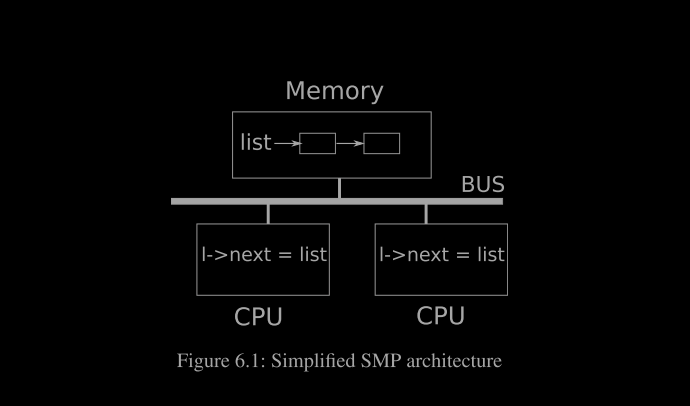
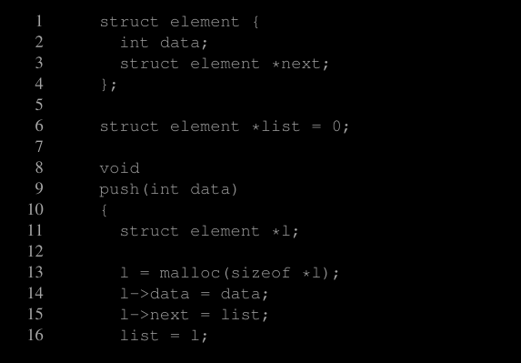
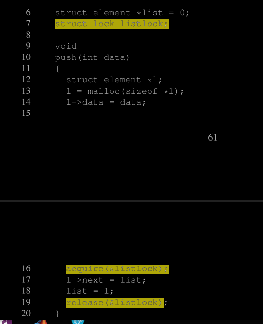
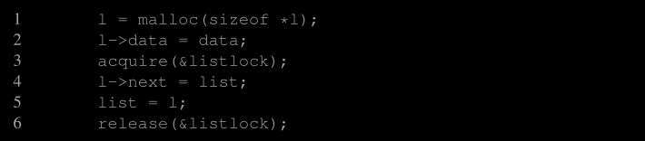

# Locking
大多数内核，包括 xv6，在执行多个活动时会交错执行。一个交错执行的来源是多处理器硬件：具有多个独立执行的 CPU 的计算机，例如 xv6 的 RISC-V。这些多个 CPU 共享物理 RAM，并且 xv6 利用这种共享来维护所有 CPU 都可以读写的数据结构。这种共享会增加一个 CPU 在另一个 CPU 正在更新数据结构时读取该数据结构的可能性，甚至多个 CPU 同时更新同一数据结构；如果没有精心设计，这样的并行访问可能会导致不正确的结果或破坏数据结构。即使在单处理器上，内核也可能在多个线程之间切换 CPU，导致它们的执行被交错执行。

最后，一个设备中断处理程序如果修改与某些可中断代码相同的数据，则如果中断发生的时机恰到好处，可能会损坏数据。并发这个词指的是多个指令流由于多处理器并行性、线程切换或中断而交错执行的情况。

## 6.1 竞争条件
为什么我们需要锁的一个例子是，考虑两个进程在两个不同的 CPU 上调用 `wait`。`wait` 会释放子进程的内存。因此，在每个 CPU 上，内核都会调用 `kfree` 来释放子进程的页。内核分配器维护一个链表：`kalloc()`（位于 kernel/kalloc.c:69）从空闲页列表中弹出一页内存，而 `kfree()`（位于 kernel/kalloc.c:47）将一页内存推入空闲列表。为了获得最佳性能，我们可能希望两个父进程的 `kfree` 能够并行执行，而无需彼此等待，但考虑到 xv6 的` kfree` 实现，这样做是不正确的。

图 6.1 更详细地说明了这种情况：链表位于由两个 CPU 共享的内存中，两个 CPU 使用加载和存储指令操作链表。（实际上，处理器有缓存，但从概念上讲，多处理器系统的行为就像只有一个共享内存。）如果没有并发请求，你可以按如下方式实现链表的推操作：

这种实现如果独立执行是正确的。但是，如果多个副本同时执行，该代码则不正确。如果两个 CPU 同时执行 push 操作，那么如图 6.1 所示，两者可能会同时执行第 15 行代码，在任意一个执行第 16 行之前，这会导致如图 6.2 所示的不正确结果。此时将会有两个链表元素的 next 被设置为链表的原始值。当两次对链表的赋值在第 16 行发生时，第二次赋值将覆盖第一次赋值；第一次赋值涉及的元素将会丢失。

第 16 行丢失的更新是竞争条件的一个例子。竞争条件是指在一个内存位置被并发访问且至少有一个访问是写操作的情况。竞争通常是错误的标志，可能导致更新丢失（如果访问是写操作）或读取未完全更新的数据结构。竞争的结果取决于两个 CPU 之间的确切时序以及内存系统对它们的内存操作的排序方式，这使得竞争引发的错误难以重现和调试。例如，在调试 `push` 时添加打印语句可能会改变执行的时序，从而使竞争消失。

避免竞争的常用方法是使用锁。锁确保互斥，这样一次只有一个 CPU 能执行 push 的关键行代码；这使得上述场景不可能发生。正确加锁版本的代码只增加了几行（用黄色突出显示）：

在 acquire 和 release 之间的指令序列通常称为临界区。通常认为锁在保护列表。

当我们说一个锁保护数据时，我们真正的意思是锁保护一些适用于该数据的约束集合。约束是数据结构在操作过程中保持不变的属性。通常，一个操作的正确行为依赖于操作开始时这些约束为真。操作可能会暂时违反这些约束，但必须在结束前重新建立这些约束。

例如，在链表情况下，约束是链表指向链表中的第一个元素，并且每个元素的 next 字段指向下一个元素。push 的实现暂时违反了这个约束：在第 17 行，l 指向下一个链表元素，但 list 还没有指向 l（在第 18 行重新建立）。我们之前讨论的竞争条件发生是因为第二个 CPU 在这些约束被暂时违反时执行了依赖于链表约束的代码。正确使用锁可以确保在临界区中一次只有一个 CPU 可以操作数据结构，从而确保在数据结构的约束不成立时，没有 CPU 会执行数据结构的操作。

你可以将锁视为将并发的临界区序列化，使它们一次运行一个，从而保持约束（假设临界区在单独执行时是正确的）。你还可以认为由同一个锁保护的临界区是相对于彼此原子的，这样每个临界区只能看到之前临界区的完整变更集，而不会看到部分完成的更新。

尽管正确使用锁可以使错误的代码变得正确，但锁限制了性能。例如，如果两个进程同时调用 kfree，锁会将这两个调用串行化，我们无法从在不同的 CPU 上运行它们中获得任何好处。我们说多个进程如果在同一时间需要同一个锁，则它们发生冲突，或者说该锁经历了争用。内核设计中的一个主要挑战是避免锁争用。xv6 在这方面做得很少，但复杂的内核会专门组织数据结构和算法以避免锁争用。在列表的例子中，内核可能会为每个 CPU 维护一个空闲列表，并且只有在该 CPU 的列表为空并且必须从另一个 CPU 窃取内存时才会接触另一个 CPU 的空闲列表。其他使用情况可能需要更复杂的设计。

锁的位置对于性能也很重要。例如，将 `acquire` 提前放在 `push` 中是正确的：将 `acquire` 调用移动到第 13 行之前是可以的。但这可能会降低性能，因为这样的话对 `malloc` 的调用也会被串行化。下面的“使用锁”部分提供了一些关于在何处插入 `acquire` 和 `release` 调用的指导。

## 6.2 锁

Xv6 有两种类型的锁：自旋锁和睡眠锁。我们将从自旋锁开始。Xv6 通过 struct spinlock（见 kernel/spinlock.h 的第 2 行）来表示自旋锁。结构体中的一个重要字段是 locked，**它在锁可用时为零，在锁被持有时为非零**。在逻辑上，xv6 应通过执行如下代码来获取一个锁：

不幸的是，这种实现并不能保证在多处理器上实现互斥。可能会出现这样的情况：两个 CPU 同时执行到第 25 行，看到 lk->locked 为零，然后两个 CPU 都通过执行第 26 行来获取锁。此时，两个不同的 CPU 都持有了锁，这违反了互斥属性。我们需要的是一种方法，使得第 25 行和第 26 行能够作为一个原子步骤（即不可分割的步骤）来执行。

由于锁的使用非常广泛，多核处理器通常提供一些指令来实现第 25 行和第 26 行的原子版本。在 RISC-V 上，这条指令是 `amoswap r, a`。amoswap 指令读取内存地址 a 处的值，将寄存器 r 的内容写入该地址，并将读取的值存入 r。也就是说，它交换了寄存器和内存地址的内容。它以原子方式执行这个序列，使用特殊硬件防止在读取和写入之间有其他 CPU 使用该内存地址。

Xv6 的 `acquire`（kernel/spinlock.c:22） 使用了可移植的 C 库调用 `__sync_lock_test_and_set`，其实质上就是 `amoswap` 指令；返回值是 `lk->locked` 的旧（被交换的）内容。`acquire` 函数将交换操作包装在一个循环中，不断重试（旋转）直到获取锁。每次迭代将 1 交换到 `lk->locked` 中，并检查之前的值；如果之前的值是 0，那么我们就获得了锁，并且交换操作会将 `lk->locked` 设置为 1。如果之前的值是 1，那么某个其他 CPU 持有锁，而我们原子性地将 1 交换到 `lk->locked` 中并没有改变它的值。

一旦锁被获取，acquire 会记录获取锁的 CPU 以供调试使用。lk->cpu 字段受到锁的保护，必须在持有锁时才能更改。

`release` 函数（在 kernel/spinlock.c:47 中）与 `acquire` 相反：它会清除 `lk->cpu` 字段，然后释放锁。从概念上讲，释放锁只需要将 `lk->locked` 赋值为零即可。C 标准允许编译器使用多个存储指令来实现赋值，因此 C 赋值操作在并发代码的情况下可能是非原子的。相反，`release` 使用了 C 库函数 `__sync_lock_release` 来执行原子赋值。这个函数也归结为 RISC-V 的 `amoswap` 指令。

## 6.3 使用锁

xv6 在许多地方使用锁来避免竞态条件。如上所述，kalloc（kernel/kalloc.c:69）和 kfree（kernel/kalloc.c:47）就是一个很好的例子。尝试练习 1 和 2，看看如果这些函数省略了锁会发生什么。你可能会发现，触发不正确的行为是很困难的，这表明很难可靠地测试代码是否没有锁定错误和竞态。xv6 可能存在一些竞态条件。

使用锁的一大难点是决定使用多少锁以及每个锁应该保护哪些数据和不变量。有几个基本原则。首先，当一个变量可以被一个 CPU 写入而同时另一个 CPU 可以读取或写入它时，应使用锁来防止这两个操作重叠。其次，记住锁是用来保护不变量的：如果一个不变量涉及多个内存位置，通常需要用单个锁来保护所有这些位置，以确保不变量得以维持。

上述规则说明了何时需要使用锁，但并未说明何时不需要锁。为了效率，避免过度使用锁非常重要，因为锁会减少并行性。如果并行性不重要，可以安排只有一个线程运行，从而不必担心锁的问题。在多处理器系统中，一个简单的内核可以通过在进入内核时获取一个单一锁，并在退出内核时释放该锁来实现这一点（尽管系统调用如管道读写或等待会带来问题）。许多单处理器操作系统已经通过这种方法转换为多处理器系统，这种方法有时被称为“大内核锁”，但这种方法牺牲了并行性：每次只有一个 CPU 可以在内核中执行。如果内核进行大量计算，使用更大且更细粒度的锁集会更高效，从而使内核能够在多个 CPU 上同时执行。

作为粗粒度锁定的一个例子，xv6 的 kalloc.c 分配器使用一个由单个锁保护的单一空闲列表。如果多个进程在不同的 CPU 上尝试同时分配页面，每个进程都必须通过在 acquire 中旋转来等待轮到它。旋转会降低性能，因为它不是有用的工作。如果锁的争用浪费了相当大一部分 CPU 时间，也许可以通过更改分配器设计来提高性能，例如使用多个空闲列表，每个列表都有自己的锁，**以实现真正的并行分配**

作为细粒度锁定的一个例子，xv6 为每个文件提供了一个独立的锁，因此操作不同文件的进程通常可以在不等待彼此锁的情况下继续进行。如果希望允许进程同时写入同一个文件的不同区域，可以将文件锁定方案做得更加细粒度。最终，锁的粒度决策需要基于性能测量和复杂性考虑。

后续章节将解释 xv6 的各个部分，并会提到 xv6 使用锁来处理并发的例子。作为预览，图 6.3 列出了 xv6 中的所有锁。

## 6.4 Deadlock and lock ordering

如果内核中的某条代码路径必须同时持有多个锁，那么所有代码路径必须以相同的顺序获取这些锁。如果不这样做，就有可能导致死锁。假设 xv6 中的两个代码路径需要锁 A 和锁 B，但路径 1 按顺序先获取锁 A 再获取锁 B，而路径 2 按顺序先获取锁 B 再获取锁 A。假设线程 T1 执行路径 1 并获取了锁 A，而线程 T2 执行路径 2 并获取了锁 B。接下来，T1 尝试获取锁 B，而 T2 尝试获取锁 A。由于两者都在等待对方释放所需的锁，两者的获取操作都会无限期地阻塞。为避免这种死锁情况，所有代码路径必须以相同的顺序获取锁。对全局锁获取顺序的需求意味着锁实际上成为了每个函数的规范的一部分：调用者必须以导致锁按照约定顺序获取的方式调用函数。

Xv6 中存在许多涉及每个进程锁（每个 struct proc 中的锁）的锁顺序链，这些锁顺序链的长度为二，原因在于 `sleep` 的工作方式（见第七章）。例如，`consoleintr`（kernel/console.c:136）是处理键入字符的中断例程。当接收到换行符时，任何等待控制台输入的进程都应该被唤醒。为此，consoleintr 在调用 wakeup 时持有 cons.lock，wakeup 会获取等待进程的锁以便唤醒它。因此，避免全局死锁的锁顺序规则包括 `cons.lock` 必须在任何进程锁之前获取。文件系统代码中包含了 xv6 中最长的锁链。例如，创建文件时需要同时持有目录的锁、新文件的 `inode` 的锁、磁盘块缓冲区的锁、磁盘驱动程序的 `vdisk_lock` 以及调用进程的 `p->lock`。为了避免死锁，文件系统代码总是按照前述顺序获取锁。

遵守全局避免死锁的顺序可能会出乎意料地困难。有时锁的顺序与程序的逻辑结构冲突，例如，代码模块 M1 调用模块 M2，但锁的顺序要求在获取 M1 的锁之前先获取 M2 的锁。有时锁的身份在事先并不知道，也许因为必须持有一个锁才能发现下一个要获取的锁的身份。这种情况在文件系统中查找路径名中的连续组件时会出现，也会在 wait 和 exit 代码中搜索进程表以查找子进程时出现。最后，避免死锁的危险往往是使锁定方案尽可能细粒度的一个限制因素，因为更多的锁通常意味着更多的死锁机会。避免死锁的需要通常是内核实现中的一个主要因素。

## 6.5递归锁
可能看起来某些死锁和锁顺序挑战可以通过使用可重入锁（也称为递归锁）来避免。其想法是，如果一个进程已经持有锁并尝试再次获取该锁，那么内核可以允许这种情况（因为进程已经持有该锁），而不是像 xv6 内核那样调用 panic。

然而，事实证明，可重入锁使得并发问题更难以推理：可重入锁打破了锁使临界区相对于其他临界区原子化的直觉。考虑以下两个函数 f 和 g。

看看这段代码，直觉上认为 call_once 只会被调用一次：要么由 f 调用，要么由 g 调用，而不是两者都调用。

但如果允许可重入锁，并且 h 恰好调用了 g，call_once 将被调用两次。

如果不允许可重入锁，那么 h 调用 g 会导致死锁，这也不太好。但假设调用 call_once 是一个严重错误，那么死锁是更可取的。内核开发人员会观察到死锁（内核会出现 panic），并且可以修复代码以避免这种情况，而调用 call_once 两次可能会悄然导致一个难以追踪的错误。

因此，xv6 使用了更容易理解的非可重入锁。然而，只要程序员记住锁定规则，无论哪种方法都可以正常工作。如果 xv6 使用可重入锁，则需要修改 acquire 函数以注意到当前锁是由调用线程持有的。此外，还需要在 struct spinlock 中添加一个嵌套 acquire 的计数器，类似于接下来讨论的 push_off。

## 6.6 锁和中断处理

某些 xv6 的自旋锁保护的是线程和中断处理程序都使用的数据。例如，时钟中断处理程序 clockintr 可能会在内核线程在 `sys_sleep` (kernel/sysproc.c:64) 中读取 `ticks` 的同时递增 `ticks` (kernel/trap.c:163)。锁 `tickslock `用来串行化这两个访问操作。

自旋锁与中断的交互带来了一种潜在的危险。假设 `sys_sleep` 持有 `tickslock`，而它的 CPU 被一个定时器中断打断。`clockintr` 将尝试获取 `tickslock`，看到它已经被持有，并等待它被释放。在这种情况下，`tickslock` 永远不会被释放：只有 `sys_sleep` 能释放它，但 `sys_sleep` 在 `clockintr` 返回之前不会继续运行。因此，CPU 将发生死锁，任何需要该锁的代码也会被冻结。

为避免这种情况，如果中断处理程序使用自旋锁，则 CPU 在持有该锁时必须禁用中断。xv6 更为保守：当 CPU 获取任何锁时，xv6 总是在该 CPU 上禁用中断。中断仍可能在其他 CPU 上发生，因此中断的获取可以等待线程释放自旋锁，但不会在同一个 CPU 上发生。

xv6 在 CPU 不持有自旋锁时重新启用中断；它必须做一些记录来处理嵌套的临界区。acquire 调用 push_off (kernel/spinlock.c:89)，而 release 调用 pop_off (kernel/spinlock.c:100) 来跟踪当前 CPU 上锁的嵌套级别。当该计数达到零时，pop_off 会恢复最外层临界区开始时存在的中断启用状态。intr_off 和 intr_on 函数分别执行 RISC-V 指令来禁用和启用中断。

acquire 调用 push_off 必须严格在设置 lk->locked 之前 (kernel/spinlock.c:28)，因为如果两者顺序相反，在锁持有且中断启用的情况下会有一个短暂的窗口，导致系统因不合时宜的中断而死锁。同样，release 只能在释放锁之后调用 pop_off (kernel/spinlock.c:66)。

## 6.7 指令和存储器排序

在思考程序执行时，自然会认为它们按源代码语句的顺序执行。然而，许多编译器和 CPU 实际上会为了提高性能而乱序执行代码。如果某条指令需要很多周期才能完成，CPU 可能会提前发出该指令，以便它能与其他指令重叠执行，从而避免 CPU 停顿。例如，CPU 可能会发现指令 A 和 B 在串行执行中彼此无依赖关系。CPU 可能会先开始执行指令 B，可能是因为 B 的输入在 A 的输入之前准备好，或者为了重叠执行 A 和 B。编译器也可能通过在源代码中的语句之前发出指令来执行类似的重排。

编译器和 CPU 在重排代码时遵循规则，以确保不会改变正确编写的串行代码的结果。然而，这些规则允许重排可能会改变并发代码的结果，这在多处理器环境中很容易导致不正确的行为 [2, 3]。CPU 的排序规则称为内存模型。

例如，在以下的 `push` 代码中，如果编译器或 CPU 将与第 4 行相对应的存储操作移动到第 6 行的释放操作之后，那将是灾难性的：

如果发生了这样的重排，将会出现一个窗口，在这个窗口中，另一个 CPU 可能会获取锁并观察到更新后的列表，但看到的是未初始化的 `list->next`。

为了告诉硬件和编译器不要执行这样的重排，xv6 在 `acquire`（kernel/spinlock.c:22）和 `release`（kernel/spinlock.c:47）中使用了 `__sync_synchronize()`。`__sync_synchronize()` 是一个**内存屏障**：它告诉编译器和 CPU 不要在屏障两侧重新排序加载或存储操作。xv6 中的 `acquire` 和 `release` 的屏障几乎在所有重要的情况下都强制执行了顺序，因为 xv6 在访问共享数据时使用了锁。第 9 章讨论了几个例外情况。

## 6.8 Sleep locks

有时，xv6 需要长时间持有一个锁。例如，文件系统（第 8 章）在读取和写入磁盘上的内容时会保持文件锁定，而这些磁盘操作可能需要几十毫秒。如果持有自旋锁这么长时间，其他进程在等待获取锁时会浪费大量 CPU 资源。自旋锁的另一个缺点是，持有自旋锁的进程不能让出 CPU；我们希望进程在等待磁盘时能够让出 CPU，以便其他进程可以使用 CPU。持有自旋锁时让出 CPU 是不合法的，因为如果第二个线程尝试获取自旋锁，可能会导致死锁；由于 acquire 不让出 CPU，第二个线程的自旋可能会阻止第一个线程运行和释放锁。持有锁时让出 CPU 也会违反持有自旋锁时必须关闭中断的要求。因此，我们希望有一种锁能够在等待获取锁时让出 CPU，并且在持有锁时允许让出 CPU 和中断。

xv6 提供了这种类型的锁，称为**睡眠锁（sleep-locks）**。acquiresleep（在 kernel/sleeplock.c:22 中）在等待时让出 CPU，使用的技术将在第 7 章中解释。高层次地说，睡眠锁具有一个由自旋锁保护的 locked 字段，而 acquiresleep **调用 sleep 原子性地让出 CPU 并释放自旋锁**。这样，其他线程可以在 acquiresleep 等待时执行。

由于睡眠锁（sleep-locks）保持中断开启，因此不能在中断处理程序中使用。由于 acquiresleep 可能让出 CPU，睡眠锁不能在自旋锁（spinlock）的临界区内使用（尽管自旋锁可以在睡眠锁的临界区内使用）。自旋锁最适合用于短的临界区，因为等待自旋锁会浪费 CPU 时间；而睡眠锁适合用于较长的操作。

## 6.9 Real word

尽管对并发原语和并行性进行了多年的研究，使用锁编程仍然具有挑战性。通常，最好将锁隐藏在更高级的构造中，例如同步队列，尽管 xv6 并没有这样做。如果你使用锁进行编程，明智的做法是使用能够识别竞争条件的工具，因为很容易遗漏需要锁保护的不变量。

大多数操作系统支持 POSIX 线程（Pthreads），这允许用户进程在不同的 CPU 上同时运行多个线程。Pthreads 支持用户级锁、屏障等功能。Pthreads 还允许程序员可选地指定锁应为可重入的。

在用户级别支持 Pthreads 需要操作系统的支持。例如，如果一个 pthread 在系统调用中阻塞，另一个同一进程的 pthread 应能在该 CPU 上运行。另一个例子是，如果一个 pthread 更改了其进程的地址空间（例如，映射或取消映射内存），内核必须安排其他运行同一进程线程的 CPU 更新其硬件页表，以反映地址空间的变化。

虽然可以在没有原子指令的情况下实现锁，但这成本很高，大多数操作系统使用原子指令。如果许多 CPU 同时尝试获取相同的锁，则锁可能会很昂贵。如果一个 CPU 在其本地缓存中缓存了一个锁，而另一个 CPU 必须获取该锁，那么更新包含锁的缓存行的原子指令必须将该行从一个 CPU 的缓存移动到另一个 CPU 的缓存，并且可能需要使其他副本无效。从另一个 CPU 的缓存中提取缓存行的成本可能比从本地缓存中提取缓存行的成本高几个数量级。为了避免与锁相关的开销，许多操作系统使用无锁数据结构和算法。例如，可以实现一个如本章开头提到的链表，在列表搜索期间无需锁，并且只需一条原子指令即可将一个项插入到列表中。然而，无锁编程比锁编程要复杂；例如，必须考虑指令和内存重排序。编程本身已经很困难，因此 xv6 避免了无锁编程的额外复杂性。

